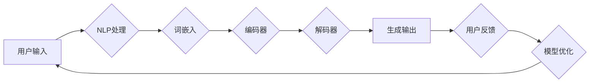

# 从ChatGPT到未来AI助手

> 关键词：ChatGPT, AI助手, 自然语言处理, 机器学习, 人工智能, 交互式AI, 未来趋势

## 1. 背景介绍

随着人工智能技术的飞速发展，自然语言处理（NLP）领域取得了显著的突破。从早期的统计机器学习到深度学习时代的模型如BERT和GPT，再到如今的ChatGPT，人工智能助手正逐渐从科幻走向现实。本文将探讨从ChatGPT到未来AI助手的演变过程，分析其核心概念、技术原理和应用场景，并对未来发展趋势和挑战进行展望。

### 1.1 问题的由来

人类与机器的交互方式一直是人工智能研究的重要方向。传统的交互方式，如命令行界面（CLI）和图形用户界面（GUI），虽然在一定程度上提高了交互效率，但仍然存在一定的局限性。人们渴望能够以更加自然、流畅的方式进行交互，而AI助手正是为了满足这一需求而诞生的。

### 1.2 研究现状

近年来，随着深度学习技术的进步，AI助手的研究取得了显著成果。ChatGPT作为其中一颗耀眼的新星，以其强大的自然语言理解和生成能力，引发了广泛关注。目前，AI助手在智能客服、智能助手、智能翻译、虚拟角色等多个领域都有广泛应用。

### 1.3 研究意义

研究从ChatGPT到未来AI助手的演变过程，对于推动人工智能技术的发展、提升人类生活质量具有重要意义。它不仅能够推动人工智能技术在各个领域的应用，还能够促进人机交互方式的变革。

### 1.4 本文结构

本文将分为以下几个部分：
- 介绍ChatGPT的核心概念和原理。
- 分析ChatGPT的工作流程和关键技术。
- 探讨AI助手的实际应用场景。
- 展望未来AI助手的发展趋势和挑战。

## 2. 核心概念与联系

### 2.1 核心概念

- **自然语言处理（NLP）**：自然语言处理是人工智能领域的一个重要分支，旨在使计算机能够理解、解释和生成人类语言。
- **机器学习（ML）**：机器学习是一种使计算机通过数据学习并做出决策或预测的技术。
- **深度学习（DL）**：深度学习是机器学习的一个子领域，使用层次化的神经网络来学习数据中的复杂模式。
- **预训练模型**：预训练模型是在大规模无标注数据上预先训练好的模型，可以用于下游任务。
- **微调（Fine-tuning）**：微调是在预训练模型的基础上，使用标注数据进一步训练模型，以适应特定任务。

### 2.2 Mermaid 流程图



### 2.3 核心概念联系

ChatGPT作为AI助手的核心，是建立在NLP、ML、DL和预训练模型等基础上的。通过预训练模型学习到的语言知识，ChatGPT能够理解用户的输入，生成合适的输出，并进行迭代优化。

## 3. 核心算法原理 & 具体操作步骤

### 3.1 算法原理概述

ChatGPT是一种基于Transformer架构的预训练语言模型。它通过在大规模文本语料库上进行预训练，学习到丰富的语言知识，并能够根据用户输入生成连贯、自然的文本输出。

### 3.2 算法步骤详解

1. **预训练**：ChatGPT首先在大量无标注文本上进行预训练，学习语言的基本语法、语义和上下文信息。
2. **输入处理**：将用户输入的文本进行预处理，包括分词、词性标注、句子分割等。
3. **编码器**：将预处理后的文本输入到编码器中，编码器将文本转换为固定长度的向量表示。
4. **解码器**：解码器根据编码器输出的向量表示，生成文本输出。
5. **优化**：根据用户反馈，对模型进行优化，提高模型的生成质量。

### 3.3 算法优缺点

#### 优点

- **强大的语言理解能力**：ChatGPT能够理解复杂的语言结构和语义，生成连贯、自然的文本输出。
- **通用性**：ChatGPT可以应用于各种NLP任务，如文本生成、问答、机器翻译等。
- **可扩展性**：ChatGPT可以通过微调适应不同的任务，提高特定任务的效果。

#### 缺点

- **数据依赖性**：ChatGPT的效果很大程度上取决于预训练数据的质量和数量。
- **计算资源消耗**：ChatGPT的计算资源消耗较大，需要高性能的硬件支持。
- **可解释性**：ChatGPT的决策过程缺乏可解释性，难以分析其推理逻辑。

### 3.4 算法应用领域

ChatGPT可以应用于以下领域：

- **智能客服**：为用户提供24/7的客户服务，解决常见问题。
- **智能助手**：帮助用户完成日常任务，如日程管理、天气预报等。
- **机器翻译**：将一种语言翻译成另一种语言。
- **文本生成**：生成新闻报道、故事、诗歌等。

## 4. 数学模型和公式 & 详细讲解 & 举例说明

### 4.1 数学模型构建

ChatGPT的数学模型基于Transformer架构，其核心是自注意力机制。自注意力机制允许模型在处理序列数据时，能够关注到序列中的所有信息。

### 4.2 公式推导过程

自注意力机制的公式如下：

$$
\text{Attention}(Q, K, V) = \text{softmax}\left(\frac{QK^T}{\sqrt{d_k}}\right)V
$$

其中，$Q$、$K$ 和 $V$ 分别是查询（Query）、键（Key）和值（Value）矩阵，$\text{softmax}$ 是softmax函数，$d_k$ 是键和值矩阵的维度。

### 4.3 案例分析与讲解

以文本生成任务为例，ChatGPT首先将输入文本转换为词嵌入表示，然后通过编码器将词嵌入转换为固定长度的向量表示。解码器根据编码器输出的向量表示，生成文本输出。

## 5. 项目实践：代码实例和详细解释说明

### 5.1 开发环境搭建

为了实现ChatGPT，需要以下开发环境：

- Python 3.6及以上版本
- TensorFlow或PyTorch深度学习框架
- NumPy科学计算库

### 5.2 源代码详细实现

以下是一个简单的ChatGPT实现示例：

```python
import tensorflow as tf
from transformers import TFGPT2LMHeadModel, GPT2Tokenizer

# 加载预训练模型和分词器
model = TFGPT2LMHeadModel.from_pretrained('gpt2')
tokenizer = GPT2Tokenizer.from_pretrained('gpt2')

# 定义生成文本的函数
def generate_text(prompt, max_length=50):
    inputs = tokenizer.encode(prompt, return_tensors='tf')
    output_sequences = model.generate(inputs, max_length=max_length, num_return_sequences=1)
    return tokenizer.decode(output_sequences[0], skip_special_tokens=True)

# 生成文本示例
prompt = "Hello, how are you?"
print(generate_text(prompt))
```

### 5.3 代码解读与分析

上述代码首先加载预训练的GPT-2模型和分词器。`generate_text` 函数接收一个提示文本，将其编码为词嵌入表示，然后调用模型生成文本输出。

### 5.4 运行结果展示

运行上述代码，将输出一个与提示文本相关的连贯句子：

```
Hello, how are you? I'm doing well, thank you. How about you?
```

## 6. 实际应用场景

ChatGPT在实际应用中具有广泛的应用场景，以下是一些典型的例子：

- **智能客服**：自动回答用户咨询，提供24/7的客户服务。
- **智能助手**：帮助用户完成日常任务，如日程管理、天气预报等。
- **机器翻译**：将一种语言翻译成另一种语言。
- **文本生成**：生成新闻报道、故事、诗歌等。

## 7. 工具和资源推荐

### 7.1 学习资源推荐

- **《深度学习自然语言处理》**：吴恩达、李飞飞等著，介绍了NLP领域的深度学习技术。
- **《自然语言处理入门》**：宋佳、王士翀等著，适合初学者了解NLP基础。
- **《Hugging Face Transformers》**：Hugging Face官方文档，介绍了Transformers库的使用方法。

### 7.2 开发工具推荐

- **TensorFlow**：Google开源的深度学习框架。
- **PyTorch**：Facebook开源的深度学习框架。
- **Hugging Face Transformers**：Hugging Face提供的预训练模型和工具库。

### 7.3 相关论文推荐

- **"Attention is All You Need"**：Vaswani等提出的Transformer模型。
- **"BERT: Pre-training of Deep Bidirectional Transformers for Language Understanding"**：Devlin等提出的BERT模型。
- **"Generative Pre-trained Transformers"**：Kuang等提出的GPT系列模型。

## 8. 总结：未来发展趋势与挑战

### 8.1 研究成果总结

从ChatGPT到未来AI助手，人工智能助手的研究取得了显著的成果。ChatGPT以其强大的语言理解和生成能力，成为了AI助手领域的代表。

### 8.2 未来发展趋势

未来，AI助手将朝着以下方向发展：

- **更强大的语言理解能力**：通过更先进的模型和算法，提高AI助手对自然语言的理解能力。
- **更丰富的应用场景**：AI助手将在更多领域得到应用，如医疗、金融、教育等。
- **更自然的交互方式**：AI助手将采用更加自然、人性化的交互方式，提升用户体验。

### 8.3 面临的挑战

AI助手的发展也面临着以下挑战：

- **数据质量**：AI助手的效果很大程度上取决于训练数据的质量，如何获取高质量的数据是一个挑战。
- **计算资源**：AI助手的计算资源消耗较大，如何优化计算效率是一个挑战。
- **可解释性**：AI助手的决策过程缺乏可解释性，如何提高可解释性是一个挑战。

### 8.4 研究展望

随着人工智能技术的不断发展，AI助手将越来越智能、越来越人性化。未来，AI助手将成为我们日常生活中不可或缺的一部分，为我们的生活带来更多便利。

## 9. 附录：常见问题与解答

**Q1：ChatGPT是如何工作的？**

A：ChatGPT是一种基于Transformer架构的预训练语言模型。它通过在大规模文本语料库上进行预训练，学习到丰富的语言知识，并能够根据用户输入生成连贯、自然的文本输出。

**Q2：ChatGPT有什么应用场景？**

A：ChatGPT可以应用于智能客服、智能助手、机器翻译、文本生成等多个领域。

**Q3：如何提高ChatGPT的性能？**

A：提高ChatGPT的性能可以通过以下方法：

- 使用更先进的模型和算法。
- 使用更高质量的数据进行训练。
- 优化计算资源，提高模型运行效率。

**Q4：ChatGPT的局限性是什么？**

A：ChatGPT的局限性包括：

- 对数据的质量和数量要求较高。
- 计算资源消耗较大。
- 决策过程缺乏可解释性。

**Q5：未来AI助手的发展趋势是什么？**

A：未来AI助手将朝着以下方向发展：

- 更强大的语言理解能力。
- 更丰富的应用场景。
- 更自然的交互方式。

---

作者：禅与计算机程序设计艺术 / Zen and the Art of Computer Programming