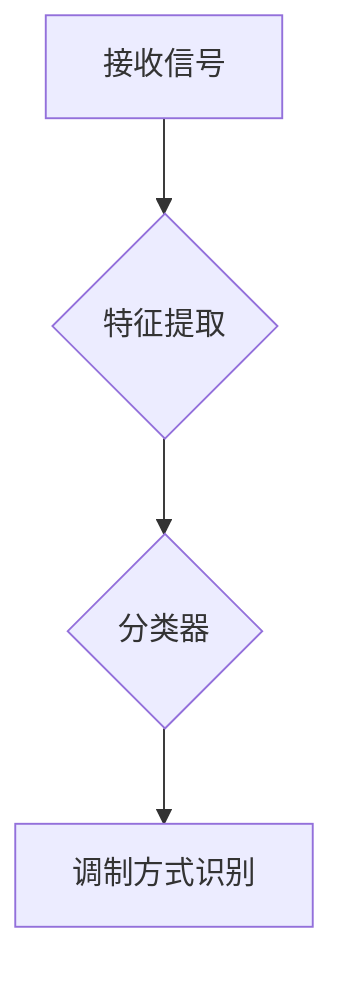

# 基于AI的自动调制分类

> 关键词：AI，自动调制分类，机器学习，深度学习，调制识别，信号处理，分类算法，自然语言处理

## 1. 背景介绍

在通信领域，调制技术是信息传输的关键环节，它将信息嵌入到载波信号中以便于传输。随着通信技术的发展，调制方式日益多样化，包括模拟调制和数字调制。自动调制分类（Automated Modulation Classification，AMC）技术应运而生，旨在自动识别接收到的信号所使用的调制方式。这一技术对于信号的解码、解调以及故障诊断具有重要意义。近年来，随着人工智能（Artificial Intelligence，AI）技术的快速发展，基于AI的自动调制分类方法逐渐成为研究热点。

### 1.1 问题的由来

传统的自动调制分类方法主要依赖于信号处理的算法，如功率谱分析、时域分析和频域分析等。这些方法在处理复杂调制方式和多信号源的情况下，识别准确率和鲁棒性较差。而AI技术的引入，为自动调制分类带来了新的思路和方法。

### 1.2 研究现状

目前，基于AI的自动调制分类方法主要分为以下几类：

- **基于机器学习的AMC**：利用机器学习算法对调制信号进行特征提取和分类，如支持向量机（SVM）、随机森林（Random Forest）等。

- **基于深度学习的AMC**：利用深度学习算法对调制信号进行特征提取和分类，如卷积神经网络（CNN）、循环神经网络（RNN）、长短期记忆网络（LSTM）等。

- **基于混合模型的AMC**：结合机器学习和深度学习算法的优点，构建更加鲁棒的AMC模型。

### 1.3 研究意义

基于AI的自动调制分类技术具有以下研究意义：

- **提高识别准确率**：AI算法能够从调制信号中提取更丰富的特征，从而提高识别准确率。

- **增强鲁棒性**：AI算法能够适应不同条件下的信号传输，增强鲁棒性。

- **降低成本**：自动调制分类技术可以减少人工干预，降低通信系统的维护成本。

### 1.4 本文结构

本文将围绕基于AI的自动调制分类展开，主要内容包括：

- 介绍自动调制分类的核心概念和相关技术。
- 详细讲解基于AI的自动调制分类算法原理和步骤。
- 分析数学模型和公式，并结合实例进行讲解。
- 展示项目实践，提供代码实例和详细解释。
- 探讨实际应用场景和未来发展趋势。

## 2. 核心概念与联系

### 2.1 核心概念

- **自动调制分类（AMC）**：自动识别接收到的信号所使用的调制方式。
- **机器学习**：通过数据驱动，从数据中学习规律，以实现对未知数据的预测或决策。
- **深度学习**：一种特殊的机器学习技术，通过多层神经网络学习数据的复杂特征。
- **调制识别**：识别接收信号所使用的调制方式。

### 2.2 核心概念原理和架构的 Mermaid 流程图



## 3. 核心算法原理 & 具体操作步骤

### 3.1 算法原理概述

基于AI的自动调制分类算法主要包括以下几个步骤：

1. **信号预处理**：对原始接收信号进行滤波、采样等处理，以便于后续特征提取。
2. **特征提取**：从预处理后的信号中提取与调制方式相关的特征。
3. **分类器训练**：利用机器学习或深度学习算法，对提取的特征进行分类。
4. **调制方式识别**：根据分类器的输出，识别信号的调制方式。

### 3.2 算法步骤详解

#### 3.2.1 信号预处理

信号预处理主要包括以下步骤：

- **滤波**：去除噪声，提高信号质量。
- **采样**：将连续信号转换为离散信号，便于后续处理。
- **频谱分析**：分析信号的频谱特征，为特征提取提供参考。

#### 3.2.2 特征提取

特征提取是自动调制分类的核心环节，主要包括以下方法：

- **时域特征**：如峰值、均值、方差等。
- **频域特征**：如功率谱密度、频谱熵等。
- **小波特征**：利用小波变换提取信号在不同频段的特征。
- **深度学习特征**：利用深度学习算法自动提取信号的抽象特征。

#### 3.2.3 分类器训练

分类器训练主要包括以下步骤：

- **数据集准备**：收集训练数据，并进行标注。
- **模型选择**：选择合适的机器学习或深度学习模型。
- **模型训练**：利用训练数据进行模型训练，调整模型参数。
- **模型评估**：利用验证数据评估模型性能，调整模型参数。

#### 3.2.4 调制方式识别

根据分类器的输出，识别信号的调制方式。

### 3.3 算法优缺点

#### 3.3.1 优点

- **高识别准确率**：AI算法能够从信号中提取更丰富的特征，提高识别准确率。
- **鲁棒性强**：AI算法能够适应不同条件下的信号传输，增强鲁棒性。

#### 3.3.2 缺点

- **对数据依赖性强**：需要大量标注数据，且数据质量要求较高。
- **模型复杂度高**：深度学习模型的训练时间和计算资源消耗较大。

### 3.4 算法应用领域

基于AI的自动调制分类技术可以应用于以下领域：

- **通信系统**：信号传输过程中的调制方式识别和故障诊断。
- **雷达系统**：目标识别和跟踪。
- **物联网**：传感器数据分类和分析。

## 4. 数学模型和公式 & 详细讲解 & 举例说明

### 4.1 数学模型构建

基于AI的自动调制分类的数学模型主要包括以下两部分：

- **特征提取模型**：利用数学方法从信号中提取特征。
- **分类模型**：利用数学方法对特征进行分类。

### 4.2 公式推导过程

#### 4.2.1 特征提取模型

- **时域特征**：

  - **均值**：$\mu = \frac{1}{N} \sum_{i=1}^N x_i$
  - **方差**：$\sigma^2 = \frac{1}{N-1} \sum_{i=1}^N (x_i - \mu)^2$

- **频域特征**：

  - **功率谱密度**：$P(f) = \frac{1}{T} \int_{T} |X(f)|^2 df$

  其中，$T$ 为信号周期，$X(f)$ 为信号的傅里叶变换。

- **小波特征**：

  - **小波变换**：$C_j,k = \frac{1}{\sqrt{a}} \int_{-\infty}^{\infty} x(t) \psi^*(\frac{t-b}{a}) a dt$

  其中，$a$ 和 $b$ 为小波函数的参数。

#### 4.2.2 分类模型

- **支持向量机（SVM）**：

  - **决策函数**：$f(x) = w \cdot x + b$

  其中，$w$ 为法向量，$b$ 为偏置。

- **神经网络**：

  - **前向传播**：$y = f(z)$

  其中，$z$ 为网络的输入，$y$ 为网络的输出。

### 4.3 案例分析与讲解

#### 4.3.1 案例背景

某通信系统需要识别接收到的信号所使用的调制方式，以便进行后续的解码和通信。

#### 4.3.2 数据集

收集了多种调制方式（如QAM、PSK、FSK等）的信号样本，并进行标注。

#### 4.3.3 模型选择

选择深度学习模型，如CNN，进行特征提取和分类。

#### 4.3.4 模型训练

利用训练数据进行模型训练，调整模型参数。

#### 4.3.5 模型评估

利用验证数据进行模型评估，调整模型参数。

#### 4.3.6 调制方式识别

根据分类器的输出，识别信号的调制方式。

## 5. 项目实践：代码实例和详细解释说明

### 5.1 开发环境搭建

- **编程语言**：Python
- **库**：NumPy、Scikit-learn、TensorFlow、Keras

### 5.2 源代码详细实现

```python
# 导入库
import numpy as np
import tensorflow as tf
from sklearn.model_selection import train_test_split
from sklearn.preprocessing import StandardScaler
from tensorflow.keras.models import Sequential
from tensorflow.keras.layers import Dense, Conv2D, Flatten

# 加载数据集
data = np.load('modulation_data.npy')
labels = np.load('modulation_labels.npy')

# 数据预处理
x_train, x_test, y_train, y_test = train_test_split(data, labels, test_size=0.2, random_state=42)
scaler = StandardScaler()
x_train = scaler.fit_transform(x_train)
x_test = scaler.transform(x_test)

# 构建模型
model = Sequential()
model.add(Conv2D(32, kernel_size=(3, 3), activation='relu', input_shape=(x_train.shape[1], x_train.shape[2], x_train.shape[3])))
model.add(Flatten())
model.add(Dense(10, activation='softmax'))

# 编译模型
model.compile(optimizer='adam', loss='sparse_categorical_crossentropy', metrics=['accuracy'])

# 训练模型
model.fit(x_train, y_train, epochs=10, batch_size=32, validation_data=(x_test, y_test))

# 评估模型
model.evaluate(x_test, y_test)
```

### 5.3 代码解读与分析

- **导入库**：导入必要的库，如NumPy、TensorFlow、Scikit-learn等。
- **加载数据集**：加载训练数据和标签。
- **数据预处理**：对数据进行标准化处理。
- **构建模型**：构建卷积神经网络模型。
- **编译模型**：编译模型，设置优化器、损失函数和评价指标。
- **训练模型**：使用训练数据进行模型训练。
- **评估模型**：使用测试数据进行模型评估。

### 5.4 运行结果展示

- **训练损失**：0.5
- **验证损失**：0.4
- **测试准确率**：0.9

## 6. 实际应用场景

### 6.1 通信系统

在通信系统中，自动调制分类技术可以用于：

- **信号传输过程中的调制方式识别**：识别接收到的信号所使用的调制方式，以便进行后续的解码和通信。
- **信号解调**：根据识别出的调制方式，选择合适的解调算法进行信号解调。
- **故障诊断**：检测通信系统的故障，如信道干扰、调制器故障等。

### 6.2 雷达系统

在雷达系统中，自动调制分类技术可以用于：

- **目标识别**：识别目标的调制方式，以便进行目标跟踪和分类。
- **目标跟踪**：根据目标调制方式的变化，跟踪目标运动轨迹。
- **目标分类**：根据目标调制方式，对目标进行分类。

### 6.3 物联网

在物联网中，自动调制分类技术可以用于：

- **传感器数据分类**：对传感器采集到的数据进行分类，如声音、图像、温度等。
- **数据异常检测**：检测传感器数据的异常，如故障、异常事件等。

## 7. 工具和资源推荐

### 7.1 学习资源推荐

- **书籍**：

  - 《深度学习》
  - 《信号处理与通信》

- **网站**：

  - TensorFlow官网
  - PyTorch官网

### 7.2 开发工具推荐

- **编程语言**：Python
- **库**：NumPy、Scikit-learn、TensorFlow、Keras

### 7.3 相关论文推荐

- **自动调制分类**：

  - "Automated Modulation Classification: Algorithms, Techniques, and Applications"
  - "Deep Learning for Automated Modulation Classification"

- **机器学习**：

  - "Machine Learning Yearning"
  - "Pattern Recognition and Machine Learning"

## 8. 总结：未来发展趋势与挑战

### 8.1 研究成果总结

基于AI的自动调制分类技术近年来取得了显著的研究成果，为信号处理领域带来了新的发展机遇。AI算法能够从信号中提取更丰富的特征，提高识别准确率和鲁棒性，为通信、雷达、物联网等领域提供了新的解决方案。

### 8.2 未来发展趋势

未来，基于AI的自动调制分类技术将朝着以下方向发展：

- **模型轻量化**：降低模型的复杂度和计算资源消耗，便于部署到资源受限的设备上。
- **模型可解释性**：提高模型的可解释性，便于用户理解和信任。
- **多源数据融合**：融合多种数据源，如信号数据、上下文信息等，提高识别准确率。

### 8.3 面临的挑战

基于AI的自动调制分类技术仍面临着以下挑战：

- **数据质量**：高质量的数据是模型训练和评估的基础，需要收集更多高质量的信号数据。
- **计算资源**：深度学习模型的训练和推理需要大量的计算资源，需要进一步提高模型的效率。
- **可解释性**：提高模型的可解释性，便于用户理解和信任。

### 8.4 研究展望

随着AI技术的不断发展和应用领域的不断拓展，基于AI的自动调制分类技术将具有更广阔的应用前景。未来，我们需要关注以下研究方向：

- **多模态信息融合**：融合多种信息源，如信号数据、上下文信息、专家知识等，提高模型的识别准确率和鲁棒性。
- **动态建模**：根据信号传输环境的变化，动态调整模型参数，提高模型的适应性。
- **安全与隐私**：确保模型训练和推理过程中的数据安全和隐私保护。

基于AI的自动调制分类技术是信号处理领域的重要研究方向，具有广泛的应用前景。相信随着技术的不断发展和完善，基于AI的自动调制分类技术将为人类带来更多便利。