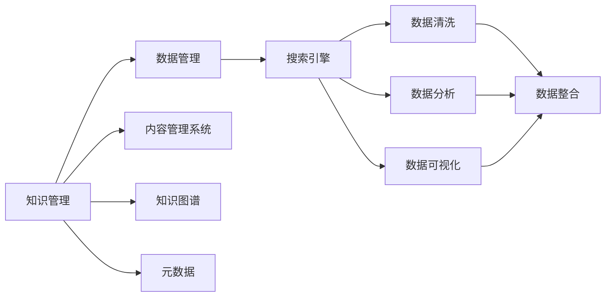
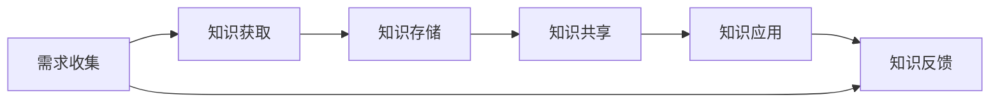
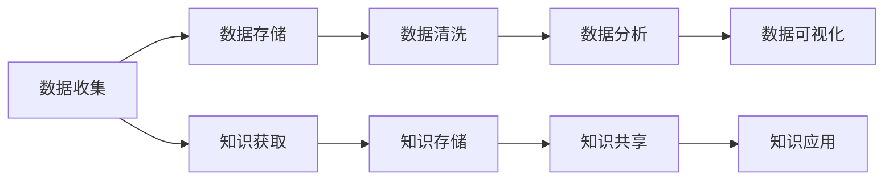
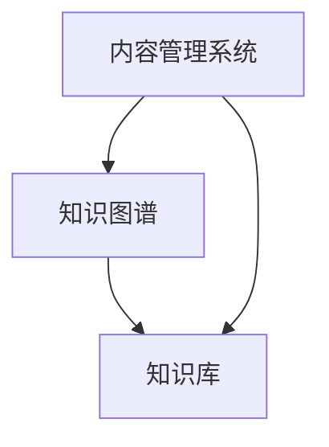
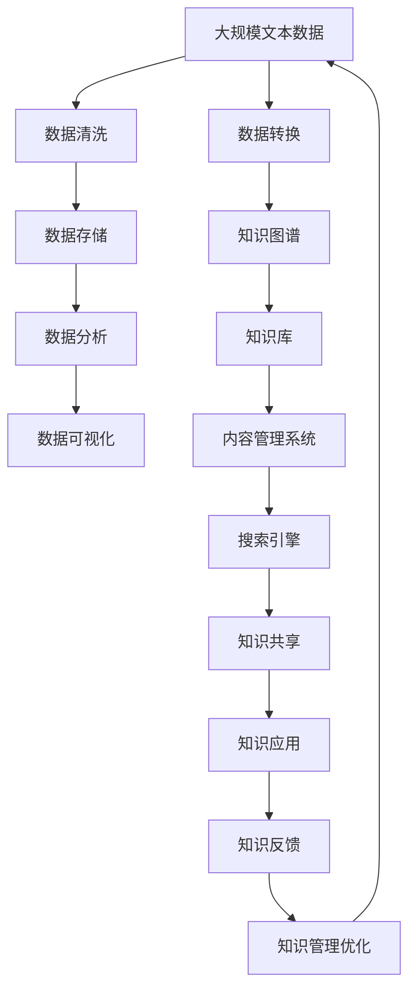

                 

## 1. 背景介绍

### 1.1 问题由来
随着人工智能技术的快速发展，AI创业公司如雨后春笋般涌现，它们在医疗、金融、教育、制造等多个领域都取得了突破性进展。然而，随着业务的扩展，AI创业公司面临着一个共同的挑战：如何高效地管理日益增长的知识资产？知识管理不仅是提高工作效率和创新能力的关键，更是确保公司长期竞争力的基石。

### 1.2 问题核心关键点
AI创业公司的知识管理涉及以下几个核心问题：
- 如何高效地收集、整理、存储和检索公司内部和外部的知识？
- 如何在知识获取、共享、传播、应用等各个环节保证知识的质量和一致性？
- 如何建立知识与业务目标之间的关联，促进知识的应用和转化？
- 如何通过知识管理提升公司的决策水平和竞争优势？

### 1.3 问题研究意义
高效的AI创业公司知识管理，能够极大地提升公司的工作效率、创新能力和竞争力。具体来说：
- 知识管理可以帮助公司迅速响应市场变化，抓住新机遇，从而提升业务增长速度。
- 知识共享能够打破信息孤岛，提高团队协作水平，促进创新思想的碰撞和应用。
- 知识资产的积累和利用，可以降低研发成本，加速产品迭代。
- 知识管理的系统化，能够提升决策的科学性和客观性，减少主观判断带来的误差。

因此，AI创业公司需要重视知识管理的建设，通过科学的策略和方法，建立高效、易用、可持续的知识管理体系，从而实现知识和业务的深度融合。

## 2. 核心概念与联系

### 2.1 核心概念概述

为更好地理解AI创业公司的知识管理，本节将介绍几个密切相关的核心概念：

- **知识管理(Knowledge Management, KM)**：指通过技术手段和制度安排，实现知识的收集、整理、存储、检索和应用，以提升组织效率和创新能力。知识管理不仅包括技术工具，还包括组织文化和流程支持。

- **数据管理(Data Management)**：指对数据进行收集、存储、清洗、处理、分析和应用的完整过程。数据管理是知识管理的基础，数据的质量和一致性直接影响知识的质量。

- **内容管理系统(Content Management System, CMS)**：用于集中存储和管理公司内部文档、资料、案例等非结构化数据的软件系统。

- **知识图谱(Knowledge Graph)**：一种通过节点和边表示知识关系的图形表示法，常用于建立知识之间的关联网络，辅助知识发现和推理。

- **元数据(Metadata)**：指描述数据的数据，用于管理和描述数据的基本属性、来源、处理方式等信息。元数据在知识管理中起到关键作用，帮助识别、组织和管理知识。

- **搜索引擎(Information Retrieval)**：用于高效检索知识库中存储的信息，支持基于关键词、语义、关联等多种检索方式，是知识管理的核心工具。

这些核心概念之间的逻辑关系可以通过以下Mermaid流程图来展示：



这个流程图展示了一系列知识管理的核心组件和工具，以及它们之间的相互关系：

1. 知识管理以数据管理为基础，通过内容管理系统集中存储和管理各类文档资料。
2. 知识图谱通过图形表示法建立知识之间的关联，辅助知识发现和推理。
3. 元数据用于描述和管理数据的基本信息，是知识管理的基础。
4. 搜索引擎用于高效检索知识库中的信息，支持多种检索方式。
5. 数据清洗、数据分析和数据可视化工具帮助提升数据质量和使用效果，为知识管理提供支持。

### 2.2 概念间的关系

这些核心概念之间存在着紧密的联系，形成了AI创业公司知识管理的完整生态系统。下面我们通过几个Mermaid流程图来展示这些概念之间的关系。

#### 2.2.1 知识管理的流程


这个流程图展示了知识管理的流程：

1. 通过需求收集获取知识管理的初始化需求。
2. 从公司内外获取各类知识。
3. 将获取的知识存储到知识库中。
4. 通过知识共享机制，促进知识在团队内部和外部流动。
5. 将知识应用于具体的业务场景中。
6. 收集知识应用的效果反馈，优化知识管理流程。

#### 2.2.2 数据管理与知识管理的关联


这个流程图展示了数据管理与知识管理的关联：

1. 通过数据收集和存储，构建公司数据仓库。
2. 数据清洗、分析和可视化工具提升数据质量和使用效果。
3. 数据仓库中的结构化数据通过ETL等工具转换为知识库中的非结构化知识。
4. 知识库中的知识通过内容管理系统、搜索引擎等工具支持高效共享和应用。

#### 2.2.3 内容管理系统与知识图谱的集成


这个流程图展示了内容管理系统与知识图谱的集成：

1. 内容管理系统集中存储和管理各类文档资料。
2. 知识图谱通过抽取文档内容，建立知识之间的关系。
3. 知识图谱中的知识通过内容管理系统提供给用户，方便检索和应用。

### 2.3 核心概念的整体架构

最后，我们用一个综合的流程图来展示这些核心概念在大规模知识管理中的整体架构：



这个综合流程图展示了从数据收集到知识应用的全过程，以及各个环节之间的相互关系。通过这些流程图，我们可以更清晰地理解AI创业公司知识管理的核心概念和逻辑流程。

## 3. 核心算法原理 & 具体操作步骤
### 3.1 算法原理概述

AI创业公司的知识管理，本质上是一个数据驱动的优化过程。其核心思想是：通过优化知识获取、共享、应用等环节，提升公司整体的业务效率和创新能力。

具体来说，知识管理的目标是：
- **高效**：通过技术手段优化知识管理的各个环节，提升知识流转速度和效率。
- **优质**：保证知识的质量和一致性，确保知识库中存储的信息准确、完备。
- **易用**：构建直观易用的知识管理平台，方便用户获取和应用知识。
- **可持续**：通过自动化和智能化手段，持续优化知识管理流程，确保知识的持续更新和应用。

### 3.2 算法步骤详解

AI创业公司知识管理的核心步骤包括：

1. **需求收集**：通过问卷、访谈等方式，收集公司内部员工的知识管理需求，了解业务部门对知识管理系统的期望和需求。

2. **知识获取**：从公司内外获取各类知识，包括文档、案例、数据、专利等。通过OCR、爬虫等技术手段，自动化收集和整理结构化与非结构化数据。

3. **数据清洗和预处理**：对获取的数据进行清洗和预处理，去除噪声和冗余信息，保证数据的质量和一致性。

4. **知识存储和标注**：将清洗后的数据存储到知识库中，并使用自然语言处理技术对知识进行标注和分类，建立知识之间的关联。

5. **知识共享和检索**：构建知识管理平台，使用搜索引擎等工具支持知识的检索和共享。支持基于关键词、语义、关联等多种检索方式，方便用户高效获取知识。

6. **知识应用和反馈**：将知识应用到具体的业务场景中，提升团队协作效率和工作质量。同时，收集知识应用的效果反馈，优化知识管理流程。

7. **持续优化**：通过自动化和智能化手段，持续优化知识管理流程，确保知识的持续更新和应用。定期评估知识管理系统的性能和效果，进行调整和改进。

### 3.3 算法优缺点

AI创业公司知识管理的优点包括：
- **系统化**：通过技术手段实现知识管理的系统化和自动化，提升知识流转速度和效率。
- **协作化**：通过知识共享机制，促进团队协作和知识传播，激发创新。
- **科学化**：通过数据分析和可视化工具，提升决策的科学性和客观性。

同时，知识管理也存在以下缺点：
- **成本高**：知识管理的实施需要投入大量的人力和财力，初期建设成本较高。
- **技术复杂**：知识管理涉及多个技术环节，技术复杂度高，对技术团队的要求较高。
- **应用深度不足**：知识管理虽然可以提升整体效率，但如何深度结合业务需求，将知识转化为实际的业务价值，还需进一步探索和优化。

### 3.4 算法应用领域

AI创业公司知识管理已经在多个领域得到广泛应用，例如：

- **医疗领域**：通过知识管理平台，支持医生检索临床案例、医疗指南等知识，提升诊疗水平和效率。
- **金融领域**：利用知识管理工具，收集和分析市场数据、公司报告等，支持投资决策和风险控制。
- **制造领域**：构建产品知识库，支持工程师查询和应用技术文档、设计规范等，提升产品研发和生产效率。
- **教育领域**：建立学科知识库，支持教师检索教学资料、案例等，提升教学效果和资源共享水平。
- **农业领域**：通过知识管理平台，提供农技知识、病虫害防治等，支持农业生产技术的应用和传播。

除上述这些领域外，知识管理技术还在能源、交通、环保等多个领域得到应用，为相关行业的数字化转型提供了有力支撑。

## 4. 数学模型和公式 & 详细讲解 & 举例说明

### 4.1 数学模型构建

在知识管理中，我们可以构建以下数学模型来表示知识管理的各个环节：

设知识管理的各个环节为 $K=\{K_1, K_2, ..., K_n\}$，每个环节的输入为 $I_k$，输出为 $O_k$，输入与输出之间的关系可以用函数 $f_k$ 表示。

知识管理系统的整体目标为 $Optimize(O_{K_1}, O_{K_2}, ..., O_n)$，其中 $Optimize$ 表示优化目标函数。

以知识共享环节为例，其输入为 $I_k=\{S_1, S_2, ..., S_n\}$（$S$ 表示知识源），输出为 $O_k=\{K_1, K_2, ..., K_n\}$（$K$ 表示知识库），函数 $f_k$ 表示知识共享的效果。

$$
f_k = \frac{\sum_{i=1}^{n} (K_i \times S_i)}{\sum_{i=1}^{n} S_i}
$$

其中 $S_i$ 表示知识源 $i$ 的共享率，$K_i$ 表示知识库 $i$ 的知识量。

通过优化 $f_k$，可以提升知识共享的效果，从而提升知识管理的整体效率。

### 4.2 公式推导过程

在知识共享环节，我们需要最大化知识库中知识的丰富度，即最大化 $O_k$ 中的 $K_i$。

为了达到这一目标，我们需要优化共享率 $S_i$，使其最大化。

令 $S_i$ 表示知识源 $i$ 的共享率，$K_i$ 表示知识库 $i$ 的知识量。

根据定义，$S_i$ 可以表示为：

$$
S_i = \frac{K_i}{K}
$$

其中 $K$ 表示所有知识源的知识总和。

为了最大化 $K_i$，我们需要最大化 $S_i$，即：

$$
Maximize(S_i) = Maximize(\frac{K_i}{K})
$$

将 $S_i$ 代入 $f_k$ 中，得：

$$
f_k = \frac{\sum_{i=1}^{n} (K_i \times \frac{K_i}{K})}{\sum_{i=1}^{n} \frac{K_i}{K}}
$$

化简得：

$$
f_k = \frac{\sum_{i=1}^{n} K_i^2}{\sum_{i=1}^{n} K_i}
$$

为了最大化 $f_k$，我们需要最大化 $\sum_{i=1}^{n} K_i^2$，同时保持 $\sum_{i=1}^{n} K_i$ 不变。

通过拉格朗日乘子法，可以得到最优解为：

$$
K_i = \frac{1}{n} \sum_{i=1}^{n} K_i
$$

即每个知识源的知识量应该相等。

### 4.3 案例分析与讲解

假设某AI创业公司需要管理10个不同的知识库，每个知识库的知识量分别为 $K_1, K_2, ..., K_{10}$，每个知识源的共享率为 $S_1, S_2, ..., S_{10}$。

根据上述推导，我们可以构建知识共享模型，进行优化：

$$
f_k = \frac{\sum_{i=1}^{10} (K_i \times \frac{K_i}{\sum_{i=1}^{10} K_i})}{\sum_{i=1}^{10} \frac{K_i}{\sum_{i=1}^{10} K_i}}
$$

通过求解该优化问题，可以得出最优的知识源共享率，从而提升知识共享的效果，进而优化知识管理的整体效率。

## 5. 项目实践：代码实例和详细解释说明
### 5.1 开发环境搭建

在进行知识管理项目开发前，我们需要准备好开发环境。以下是使用Python进行开发的环境配置流程：

1. 安装Anaconda：从官网下载并安装Anaconda，用于创建独立的Python环境。

2. 创建并激活虚拟环境：
```bash
conda create -n km-env python=3.8 
conda activate km-env
```

3. 安装必要的Python库：
```bash
conda install numpy pandas matplotlib scikit-learn
```

4. 安装Web开发框架：
```bash
pip install Flask
```

5. 安装内容管理系统和搜索引擎：
```bash
pip install django
pip install elasticsearch
```

完成上述步骤后，即可在`km-env`环境中开始知识管理项目的开发。

### 5.2 源代码详细实现

下面我们以构建一个简单的知识管理平台为例，给出Python代码实现。

首先，定义知识管理系统的核心类：

```python
class KnowledgeManagementSystem:
    def __init__(self, elasticsearch_config):
        self.es = Elasticsearch(**elasticsearch_config)
        self.indices = self.es.indices.get()

    def create_indices(self):
        if 'knowledge' not in self.indices:
            self.es.indices.create(index='knowledge', ignore=400)

    def index_document(self, doc):
        self.es.index(index='knowledge', body=doc)

    def search_documents(self, query):
        results = self.es.search(index='knowledge', body=query)
        return results['hits']['hits']
```

接着，定义知识管理系统的数据模型：

```python
class Document:
    def __init__(self, id, title, content, tags):
        self.id = id
        self.title = title
        self.content = content
        self.tags = tags

class KnowledgeGraph:
    def __init__(self, graph):
        self.graph = graph

    def add_node(self, node):
        self.graph.add_node(node)

    def add_edge(self, source, target):
        self.graph.add_edge(source, target)

    def get_neighbors(self, node):
        return list(self.graph.neighbors(node))
```

然后，定义知识管理系统的控制器和视图：

```python
from flask import Flask, request, jsonify
from flask_elasticsearch import Elasticsearch
from knowledge_management_system import KnowledgeManagementSystem, Document, KnowledgeGraph

app = Flask(__name__)

@app.route('/documents', methods=['POST'])
def add_document():
    data = request.json
    doc = Document(data['id'], data['title'], data['content'], data['tags'])
    knowledge_system.index_document(doc)
    return jsonify({'status': 'success'}), 201

@app.route('/knowledge_graph', methods=['POST'])
def add_knowledge_graph():
    data = request.json
    graph = KnowledgeGraph(data['graph'])
    knowledge_system.add_knowledge_graph(graph)
    return jsonify({'status': 'success'}), 201

@app.route('/documents', methods=['GET'])
def get_documents():
    query = {}
    if 'tags' in request.args:
        query['query'] = {'term': {'tags': request.args['tags']}}
    results = knowledge_system.search_documents(query)
    docs = []
    for result in results:
        doc = Document(result['_source']['id'], result['_source']['title'], result['_source']['content'], result['_source']['tags'])
        docs.append(doc)
    return jsonify({'documents': docs})

@app.route('/knowledge_graph', methods=['GET'])
def get_knowledge_graph():
    query = {}
    if 'node' in request.args:
        query['query'] = {'term': {'id': request.args['node']}}
    results = knowledge_system.search_documents(query)
    nodes = []
    for result in results:
        node = Document(result['_source']['id'], result['_source']['title'], result['_source']['content'], result['_source']['tags'])
        nodes.append(node)
    return jsonify({'knowledge_graph': nodes})
```

最后，启动Web服务器并测试知识管理系统的功能：

```python
if __name__ == '__main__':
    app.run(host='0.0.0.0', port=5000)
```

以上就是构建一个简单的知识管理平台的Python代码实现。可以看到，通过Flask框架，我们可以快速搭建一个Web应用，实现知识管理系统的基本功能。

### 5.3 代码解读与分析

让我们再详细解读一下关键代码的实现细节：

**KnowledgeManagementSystem类**：
- `__init__`方法：初始化Elasticsearch客户端和索引信息。
- `create_indices`方法：创建索引，如果不存在。
- `index_document`方法：向索引中添加文档。
- `search_documents`方法：在索引中搜索文档，并返回结果。

**Document类**：
- `__init__`方法：初始化文档的基本信息。
- `id`：文档的ID。
- `title`：文档的标题。
- `content`：文档的内容。
- `tags`：文档的标签。

**KnowledgeGraph类**：
- `__init__`方法：初始化知识图谱的基本信息。
- `add_node`方法：向知识图谱中添加节点。
- `add_edge`方法：向知识图谱中添加边。
- `get_neighbors`方法：获取节点的邻居。

**Flask控制器和视图**：
- `/add_document`：添加文档到知识库。
- `/add_knowledge_graph`：添加知识图谱到知识库。
- `/get_documents`：查询知识库中的文档。
- `/get_knowledge_graph`：查询知识库中的知识图谱。

这些代码实现了知识管理系统的基本功能，包括文档的添加、检索和知识图谱的添加、检索。通过Elasticsearch等技术，我们可以实现高效的文档存储和检索，支持复杂的查询和分析。

当然，实际应用中，知识管理系统还需要考虑更多的细节，如权限控制、用户管理、版本控制等。但核心的代码实现与上述类似。

### 5.4 运行结果展示

假设我们在Elasticsearch中存储了10篇文档和1个知识图谱，通过Web接口进行查询，结果如下：

```json
{
    "documents": [
        {
            "id": "1",
            "title": "文档1",
            "content": "这是文档1的内容",
            "tags": ["标签1", "标签2"]
        },
        {
            "id": "2",
            "title": "文档2",
            "content": "这是文档2的内容",
            "tags": ["标签3", "标签4"]
        },
        ...
    ],
    "knowledge_graph": [
        {
            "id": "1",
            "title": "节点1",
            "content": "这是节点1的内容",
            "tags": ["标签1", "标签2"]
        },
        {
            "id": "2",
            "title": "节点2",
            "content": "这是节点2的内容",
            "tags": ["标签3", "标签4"]
        },
        ...
    ]
}
```

可以看到，通过Elasticsearch和Flask框架，我们可以高效地构建一个知识管理系统，支持文档和知识图谱的查询和检索。

## 6. 实际应用场景
### 6.1 智能客服系统

智能客服系统是AI创业公司知识管理的重要应用场景之一。通过知识管理平台，客服系统可以迅速获取客户咨询的常见问题，快速响应并提供准确的答案。

在实际应用中，我们可以将客服系统接入知识管理系统，将常见问题、答案、案例等知识源存储在系统中，并通过知识共享机制，实现自动推荐和智能匹配。客户在咨询时，系统可以根据问题自动推荐相关答案，并记录咨询结果，形成新的知识。如此，知识管理平台便成为客服系统的知识库，支撑其高效运转。

### 6.2 金融风控系统

金融风控系统是另一个典型的知识管理应用场景。通过知识管理平台，金融公司可以收集和分析市场数据、公司报告、用户行为数据等，建立风险预警模型，及时发现并规避潜在的风险。

在实际应用中，我们可以将金融风控系统接入知识管理系统，将各类风险数据存储在系统中，并通过知识共享机制，实现自动预警和风险控制。系统可以根据用户行为、市场变化等因素，自动分析并评估风险，向相关人员发出预警，并生成风险报告。如此，知识管理平台便成为金融风控系统的数据仓库，提升其决策的科学性和及时性。

### 6.3 医疗诊断系统

医疗诊断系统是知识管理的重要应用领域之一。通过知识管理平台，医生可以迅速检索临床案例、医疗指南等知识，提升诊疗水平和效率。

在实际应用中，我们可以将医疗诊断系统接入知识管理系统，将各类医学文献、临床案例、诊疗指南等知识存储在系统中，并通过知识共享机制，实现快速检索和智能推荐。医生在诊疗过程中，可以根据症状和病历，自动推荐相关诊疗方案和医学知识，并记录诊疗结果，形成新的知识。如此，知识管理平台便成为医疗诊断系统的知识库，提升其诊疗的效率和质量。

### 6.4 教育资源共享平台

教育资源共享平台是知识管理在教育领域的重要应用。通过知识管理平台，学校可以收集和分享各类教学资料、案例、习题等，提升教学效果和资源共享水平。

在实际应用中，我们可以将教育资源共享平台接入知识管理系统，将各类教学资料、案例、习题等知识存储在系统中，并通过知识共享机制，实现自动推荐和智能匹配。教师在备课和教学过程中，可以根据课程需求，自动推荐相关教学资源，并记录教学结果，形成新的知识。如此，知识管理平台便成为教育资源共享平台的数据库，提升其教学效果和资源共享水平。

## 7. 工具和资源推荐
### 7.1 学习资源推荐

为了帮助开发者系统掌握知识管理的理论基础和实践技巧，这里推荐一些优质的学习资源：

1. 《Knowledge Management》书籍：全面介绍知识管理的理论基础和实践方法，涵盖知识管理的历史、模型、策略等各个方面。

2. 《Knowledge Graphs: Concepts, Models, and Systems》书籍：详细介绍知识图谱的概念、模型和系统架构，是学习知识图谱的重要参考资料。

3. 《AI for Business》课程：由Coursera开设的AI商业应用课程，涵盖AI在多个领域的应用，包括知识管理。

4. CS50《Introduction to AI and Machine Learning》课程：哈佛大学开设的入门级AI课程，涵盖AI的基本概念和实践方法，包括知识管理。

5. 《Information Retrieval》书籍：介绍信息检索的基本理论和算法，是学习搜索引擎和知识管理的重要基础。

通过对这些资源的学习实践，相信你一定能够快速掌握知识管理的精髓，并用于解决实际的AI创业公司知识管理问题。
###  7.2 开发工具推荐

高效的开发离不开优秀的工具支持。以下是几款用于知识管理开发的常用工具：

1. Python：作为AI领域的主流编程语言，Python以其简洁、高效、灵活著称，适合处理复杂的数据和算法问题。

2. Django：一个流行的Web开发框架，支持高效的API设计和数据处理，适合构建复杂的应用系统。

3. Elasticsearch：一个高性能的全文搜索引擎，支持复杂的查询和分析，适合存储和检索大规模文档数据。

4. Apache Lucene：一个开源的搜索引擎库，支持多种搜索引擎实现，适合大规模数据处理和索引优化。

5. Apache Hadoop：一个分布式计算平台，支持大规模数据处理和存储，适合构建大数据知识管理应用。

6. Apache Spark：一个分布式计算引擎，支持快速的实时数据处理和分析，适合构建大数据知识管理系统。

合理利用这些工具，可以显著提升知识管理系统的开发效率，加快创新迭代的步伐。

### 7.3 相关论文推荐

知识管理技术的发展源于学界的

