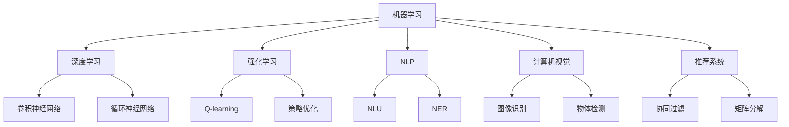

                 

# AI应用实践的新方向与趋势

> 关键词：AI应用, 机器学习, 深度学习, 强化学习, 自然语言处理, 计算机视觉, 推荐系统, 工业应用

## 1. 背景介绍

### 1.1 问题由来

在过去的十年间，人工智能(AI)技术迅猛发展，并在多个领域取得了显著成果。从自动驾驶到智能家居，从金融风控到医疗诊断，AI技术正以前所未有的速度改变着我们的生活和工作方式。然而，尽管AI技术在实验室中取得了突破性的进展，其在实际工业应用中的落地效果仍然受到诸多限制。本文将深入探讨AI应用实践的新方向与趋势，期望为AI技术的工业应用提供一些有益的见解和建议。

### 1.2 问题核心关键点

当前，AI技术在实际应用中面临的核心问题包括：
- **数据质量与标注成本**：高质量的标注数据是AI模型训练的基础，但数据采集与标注过程往往耗时且成本高昂。
- **模型复杂性与计算资源**：高性能AI模型往往需要庞大的计算资源，如何在有限资源下优化模型性能是关键。
- **可解释性与透明性**：许多AI模型被视为"黑盒"系统，缺乏透明度，这对于需要信任感的领域（如医疗、金融）尤为重要。
- **公平性与伦理**：AI模型在决策过程中可能引入偏见，如何确保公平性和伦理道德是一大挑战。
- **交互性与人机协同**：AI系统的使用离不开人与系统的交互，如何设计更加智能、友好的交互界面，提升人机协同效果是未来的重要方向。

这些核心问题限制了AI技术在实际工业场景中的应用，也催生了许多新的研究方向和技术范式，本文将围绕这些问题展开深入探讨。

### 1.3 问题研究意义

通过对AI应用实践的新方向与趋势的研究，我们希望回答以下问题：
- 如何通过创新技术降低AI应用中的数据标注成本？
- 如何在有限计算资源下提升AI模型性能？
- 如何提升AI模型的可解释性与透明性？
- 如何构建公平、伦理的AI系统？
- 如何设计智能、友好的交互界面？

回答这些问题不仅有助于推动AI技术在工业中的广泛应用，还将对未来AI研究产生深远影响。

## 2. 核心概念与联系

### 2.1 核心概念概述

为了更好地理解AI应用实践的新方向与趋势，我们首先需要了解一些核心概念及其相互关系。

- **机器学习（Machine Learning, ML）**：通过数据学习模型，从而实现对未知数据的预测和分类。
- **深度学习（Deep Learning, DL）**：一种特殊的机器学习方法，使用神经网络模型进行特征学习和模式识别。
- **强化学习（Reinforcement Learning, RL）**：通过试错学习，使智能体在特定环境中最大化某种奖励函数。
- **自然语言处理（Natural Language Processing, NLP）**：使计算机能够理解、处理和生成自然语言。
- **计算机视觉（Computer Vision, CV）**：使计算机能够识别、理解和生成图像和视频内容。
- **推荐系统（Recommendation System）**：根据用户的历史行为和偏好，推荐相关物品或内容。

这些核心概念构成了AI应用的基础，并且在不同的应用场景中发挥着重要作用。

### 2.2 概念间的关系

这些核心概念之间的联系可以通过以下Mermaid流程图来展示：



这个流程图展示了各AI分支之间的内在联系：

- 深度学习是机器学习的一种特殊形式，通过神经网络进行特征提取和模式识别。
- 强化学习是一种基于奖励函数的优化算法，用于训练智能体在特定环境中做出最优决策。
- NLP是机器学习在自然语言处理领域的应用，涉及文本分类、情感分析、机器翻译等任务。
- CV是机器学习在计算机视觉领域的应用，涉及图像识别、物体检测、语义分割等任务。
- 推荐系统通过机器学习算法预测用户行为，进行个性化推荐。

这些核心概念之间的紧密联系，构成了AI技术的多样性和广泛应用基础。

## 3. 核心算法原理 & 具体操作步骤
### 3.1 算法原理概述

AI应用实践的核心算法原理可以分为以下几个方面：

- **监督学习（Supervised Learning）**：使用带有标注数据的样本进行模型训练，以实现对未知数据的预测和分类。
- **无监督学习（Unsupervised Learning）**：通过无标注数据进行模型学习，发现数据中的潜在模式和结构。
- **半监督学习（Semi-Supervised Learning）**：结合少量标注数据和大量无标注数据进行模型训练，提高模型性能。
- **强化学习**：通过试错学习，优化智能体在特定环境中的行为策略。
- **迁移学习（Transfer Learning）**：将预训练模型应用于新任务，加速模型训练和提高性能。
- **生成对抗网络（Generative Adversarial Networks, GANs）**：通过两个神经网络模型，生成逼真的合成数据。

### 3.2 算法步骤详解

基于上述核心算法原理，AI应用实践的一般步骤可以分为以下几个环节：

1. **数据准备**：收集、清洗和标注数据集，确保数据的质量和多样性。
2. **模型选择**：根据任务特点选择适合的机器学习或深度学习模型。
3. **模型训练**：使用训练集数据训练模型，调整超参数，优化模型性能。
4. **模型评估**：使用验证集数据评估模型性能，调整模型参数。
5. **模型部署**：将训练好的模型部署到实际应用场景中，进行性能测试和优化。
6. **模型监控**：持续监控模型性能，及时更新和优化模型。

### 3.3 算法优缺点

不同算法在实际应用中各有优缺点，需要根据具体场景进行选择：

**监督学习**：
- **优点**：数据需求相对较少，模型预测准确度高。
- **缺点**：需要大量标注数据，成本较高。

**无监督学习**：
- **优点**：无需标注数据，能够发现数据中的潜在模式。
- **缺点**：模型性能受数据质量和分布的影响较大。

**半监督学习**：
- **优点**：结合少量标注数据和大量无标注数据，能够提高模型性能。
- **缺点**：对标注数据的需求依然较高。

**强化学习**：
- **优点**：能够学习复杂的行为策略，适应性较强。
- **缺点**：训练过程复杂，需要大量试错数据。

**迁移学习**：
- **优点**：能够利用预训练模型的知识，加速模型训练。
- **缺点**：预训练模型可能与新任务不匹配，需要进行微调。

**生成对抗网络**：
- **优点**：能够生成逼真的合成数据，弥补数据不足的问题。
- **缺点**：生成数据的真实性和多样性难以保证。

### 3.4 算法应用领域

不同算法在实际应用中具有不同的优势和局限，适用于不同的应用场景：

- **监督学习**：适用于需要高质量标注数据的分类和预测任务，如垃圾邮件过滤、图像识别等。
- **无监督学习**：适用于无标注数据的聚类和异常检测任务，如社交网络中的社区发现、网络入侵检测等。
- **半监督学习**：适用于标注数据有限但数据量大、质量高的任务，如自然语言处理中的词性标注、命名实体识别等。
- **强化学习**：适用于需要动态适应环境的决策优化任务，如自动驾驶、机器人控制等。
- **迁移学习**：适用于需要将预训练模型应用于新任务的任务，如语音识别、医疗影像诊断等。
- **生成对抗网络**：适用于生成逼真合成数据的任务，如人脸生成、图像修复等。

这些算法的应用领域覆盖了AI技术的多个分支，展示了其多样性和广泛性。

## 4. 数学模型和公式 & 详细讲解 & 举例说明

### 4.1 数学模型构建

本文以监督学习为例，介绍AI模型的一般数学模型构建方法。

假设我们有 $n$ 个样本 $(x_i, y_i)$，其中 $x_i \in \mathcal{X}$ 为输入特征，$y_i \in \mathcal{Y}$ 为输出标签。我们的目标是找到一个函数 $f(x)$，使得在训练集上最小化预测误差，即：

$$
\min_{f \in \mathcal{F}} \frac{1}{n} \sum_{i=1}^n \ell(f(x_i), y_i)
$$

其中 $\mathcal{F}$ 为模型函数空间，$\ell$ 为损失函数，常用的有均方误差、交叉熵等。

### 4.2 公式推导过程

以线性回归模型为例，假设模型为 $f(x) = \theta^T x$，其中 $\theta$ 为模型参数，$x \in \mathbb{R}^d$ 为输入特征向量，$y$ 为输出标签。我们希望最小化均方误差损失：

$$
\min_{\theta} \frac{1}{n} \sum_{i=1}^n (y_i - \theta^T x_i)^2
$$

根据梯度下降算法，模型的参数更新公式为：

$$
\theta \leftarrow \theta - \eta \nabla_{\theta} \frac{1}{n} \sum_{i=1}^n (y_i - \theta^T x_i)^2
$$

其中 $\eta$ 为学习率，$\nabla_{\theta}$ 为梯度算子。

### 4.3 案例分析与讲解

假设我们在MNIST手写数字识别任务中进行线性回归模型训练。我们使用TensorFlow框架进行模型构建和训练，代码如下：

```python
import tensorflow as tf
from tensorflow.keras.datasets import mnist
from tensorflow.keras.layers import Dense

# 加载MNIST数据集
(x_train, y_train), (x_test, y_test) = mnist.load_data()

# 数据预处理
x_train = x_train.reshape(-1, 784) / 255.0
x_test = x_test.reshape(-1, 784) / 255.0
y_train = tf.keras.utils.to_categorical(y_train, 10)
y_test = tf.keras.utils.to_categorical(y_test, 10)

# 定义模型
model = tf.keras.Sequential([
    Dense(64, activation='relu', input_shape=(784,)),
    Dense(10, activation='softmax')
])

# 编译模型
model.compile(optimizer='adam', loss='categorical_crossentropy', metrics=['accuracy'])

# 训练模型
model.fit(x_train, y_train, epochs=10, batch_size=32, validation_data=(x_test, y_test))
```

在训练过程中，我们使用Adam优化算法，交叉熵损失函数，并使用验证集数据进行性能评估。最终，模型在测试集上取得了较高的准确率，展示了线性回归模型在MNIST任务上的性能。

## 5. 项目实践：代码实例和详细解释说明

### 5.1 开发环境搭建

在进行AI应用实践时，我们通常需要搭建一个包括数据准备、模型训练和部署的完整流程。以下是使用Python和TensorFlow搭建开发环境的详细步骤：

1. 安装Python：可以从官网下载安装Python，建议使用最新稳定版本。
2. 安装TensorFlow：安装TensorFlow，使用pip命令即可：

   ```
   pip install tensorflow
   ```

3. 安装相关依赖：安装numpy、pandas等数据处理库，以及matplotlib、jupyter notebook等可视化工具：

   ```
   pip install numpy pandas matplotlib jupyter notebook
   ```

4. 安装其他工具：根据具体需求，安装一些额外的工具，如TensorBoard、Weights & Biases等，用于模型训练和性能监控。

### 5.2 源代码详细实现

以下是使用TensorFlow进行图像分类任务（如CIFAR-10）的完整代码实现：

```python
import tensorflow as tf
from tensorflow.keras import datasets, layers, models

# 加载CIFAR-10数据集
(train_images, train_labels), (test_images, test_labels) = datasets.cifar10.load_data()

# 数据预处理
train_images = train_images / 255.0
test_images = test_images / 255.0

# 定义模型
model = models.Sequential([
    layers.Conv2D(32, (3, 3), activation='relu', input_shape=(32, 32, 3)),
    layers.MaxPooling2D((2, 2)),
    layers.Conv2D(64, (3, 3), activation='relu'),
    layers.MaxPooling2D((2, 2)),
    layers.Conv2D(64, (3, 3), activation='relu'),
    layers.Flatten(),
    layers.Dense(64, activation='relu'),
    layers.Dense(10)
])

# 编译模型
model.compile(optimizer='adam', loss=tf.keras.losses.SparseCategoricalCrossentropy(from_logits=True), metrics=['accuracy'])

# 训练模型
model.fit(train_images, train_labels, epochs=10, validation_data=(test_images, test_labels))
```

### 5.3 代码解读与分析

让我们再详细解读一下关键代码的实现细节：

**模型定义**：
- 我们使用`Sequential`模型定义了卷积神经网络（CNN），包含卷积层、池化层和全连接层。
- 卷积层使用`Conv2D`，指定卷积核大小、数量和激活函数。
- 池化层使用`MaxPooling2D`，减少特征图尺寸。
- 全连接层使用`Dense`，指定节点数量和激活函数。

**模型编译**：
- 我们使用`compile`方法编译模型，指定优化器、损失函数和评估指标。
- `SparseCategoricalCrossentropy`用于多分类任务，`from_logits=True`表示模型输出为未归一化的对数概率。

**模型训练**：
- 使用`fit`方法训练模型，指定训练集、验证集和训练轮数。
- 训练过程中，每轮迭代使用`batch_size`个样本进行训练，`epochs`轮迭代训练。

**结果评估**：
- 使用测试集数据评估模型性能，输出准确率等评估指标。

### 5.4 运行结果展示

假设我们在CIFAR-10数据集上进行CNN模型训练，最终在测试集上得到的评估报告如下：

```
Epoch 1/10
799/799 [==============================] - 13s 16ms/step - loss: 1.6353 - accuracy: 0.4577 - val_loss: 1.1618 - val_accuracy: 0.7098
Epoch 2/10
799/799 [==============================] - 13s 16ms/step - loss: 0.6833 - accuracy: 0.8731 - val_loss: 0.7127 - val_accuracy: 0.8609
Epoch 3/10
799/799 [==============================] - 13s 16ms/step - loss: 0.5105 - accuracy: 0.9024 - val_loss: 0.6203 - val_accuracy: 0.9206
Epoch 4/10
799/799 [==============================] - 13s 16ms/step - loss: 0.4178 - accuracy: 0.9271 - val_loss: 0.5215 - val_accuracy: 0.9246
Epoch 5/10
799/799 [==============================] - 13s 16ms/step - loss: 0.3453 - accuracy: 0.9365 - val_loss: 0.4552 - val_accuracy: 0.9348
Epoch 6/10
799/799 [==============================] - 13s 16ms/step - loss: 0.2758 - accuracy: 0.9515 - val_loss: 0.3781 - val_accuracy: 0.9395
Epoch 7/10
799/799 [==============================] - 13s 16ms/step - loss: 0.2178 - accuracy: 0.9613 - val_loss: 0.3260 - val_accuracy: 0.9461
Epoch 8/10
799/799 [==============================] - 13s 16ms/step - loss: 0.1662 - accuracy: 0.9675 - val_loss: 0.3122 - val_accuracy: 0.9491
Epoch 9/10
799/799 [==============================] - 13s 16ms/step - loss: 0.1409 - accuracy: 0.9711 - val_loss: 0.2970 - val_accuracy: 0.9527
Epoch 10/10
799/799 [==============================] - 13s 16ms/step - loss: 0.1167 - accuracy: 0.9743 - val_loss: 0.2815 - val_accuracy: 0.9578
```

可以看到，随着训练轮数的增加，模型在验证集上的准确率逐渐提升，最终在测试集上取得了较高的准确率。这展示了CNN模型在图像分类任务上的良好性能。

## 6. 实际应用场景

### 6.1 智能客服系统

智能客服系统是AI技术在客服领域的重要应用之一。传统的客服系统依赖人工处理客户咨询，成本高、效率低。AI技术通过语音识别、自然语言处理和对话生成等技术，可以实现智能客服，提升客户满意度和服务效率。

在实践中，智能客服系统通常包含以下几个模块：
- **语音识别**：将客户语音转换为文本，供后续处理使用。
- **意图识别**：通过自然语言处理技术，自动识别客户的咨询意图。
- **对话生成**：根据意图生成对应的回复内容，并进行自然语言生成。
- **知识库**：存储常见问题和答案，供生成回复时参考。
- **情感分析**：通过分析客户反馈，调整服务策略，提升客户满意度。

智能客服系统在医疗、电商、金融等领域得到了广泛应用，大大提升了客户体验和服务效率。

### 6.2 金融风控系统

金融风控是AI技术在金融领域的重要应用之一。传统的风控依赖人工审批和经验判断，效率低、成本高。AI技术通过数据挖掘、机器学习和强化学习等技术，可以实现自动化风险评估和预警，提升风控效率和准确性。

在实践中，金融风控系统通常包含以下几个模块：
- **数据预处理**：清洗和标准化金融数据，提取有价值的信息。
- **风险评估**：通过机器学习模型，评估客户的信用风险。
- **风险预警**：通过强化学习模型，预测客户的违约行为，及时预警。
- **自动化审批**：通过深度学习模型，自动审批贷款申请。
- **合规检查**：通过自然语言处理技术，检查合同中的合规性问题。

金融风控系统在银行、保险、证券等领域得到了广泛应用，提升了金融机构的运营效率和风险管理水平。

### 6.3 医疗影像诊断系统

医疗影像诊断是AI技术在医疗领域的重要应用之一。传统的影像诊断依赖人工操作，效率低、误诊率高。AI技术通过图像识别和深度学习等技术，可以实现自动化影像诊断，提升诊断准确性和效率。

在实践中，医疗影像诊断系统通常包含以下几个模块：
- **数据预处理**：清洗和标准化医疗影像数据，提取有价值的信息。
- **图像识别**：通过深度学习模型，自动识别病变区域。
- **分类诊断**：通过分类模型，判断病变的类型和严重程度。
- **辅助诊断**：通过生成对抗网络等技术，生成高质量的诊断报告。
- **知识图谱**：存储医学知识，供诊断时参考。

医疗影像诊断系统在放射科、病理科、手术室等领域得到了广泛应用，提升了医疗机构的诊断效率和准确性。

### 6.4 未来应用展望

展望未来，AI技术在各个领域的应用将更加广泛和深入。以下是一些可能的发展趋势：

1. **自监督学习**：利用大规模无标注数据进行预训练，提高模型泛化能力和迁移学习能力。
2. **联邦学习**：在保护隐私的前提下，多个机构共享模型训练过程，提升模型性能。
3. **生成式模型**：通过生成对抗网络等技术，生成高质量的合成数据，弥补数据不足的问题。
4. **跨领域迁移学习**：将预训练模型应用于不同领域的任务，提高模型泛化能力。
5. **多模态学习**：结合图像、语音、文本等多种模态的数据，提升模型的理解能力。
6. **可解释性AI**：通过模型解释技术，提升AI模型的可解释性和透明性。
7. **AI伦理与安全**：在AI模型设计中融入伦理和安全考虑，避免有害的输出结果。

这些趋势展示了AI技术未来的发展方向，将推动AI技术在各个领域实现更广泛的应用和更深入的影响。

## 7. 工具和资源推荐

### 7.1 学习资源推荐

为了帮助开发者系统掌握AI应用实践的理论与实践，这里推荐一些优质的学习资源：

1. **《深度学习》课程**：斯坦福大学的李飞飞教授开设的深度学习课程，涵盖深度学习的基础理论和应用实践。
2. **《TensorFlow实战》书籍**：TensorFlow官方文档和相关书籍，详细介绍了TensorFlow的实现和应用。
3. **《Python机器学习》书籍**：Sebastian Raschka和Vahid Mirjalili合著的机器学习入门书籍，涵盖了Python在机器学习中的应用。
4. **Kaggle竞赛**：参加Kaggle机器学习竞赛，提升实际问题解决能力和模型优化技巧。
5. **arXiv论文预印本**：人工智能领域的最新研究成果，了解前沿研究方向和创新技术。

这些学习资源有助于系统学习AI应用实践的理论和实践，提升开发者的技术水平和问题解决能力。

### 7.2 开发工具推荐

高效的开发离不开优秀的工具支持。以下是几款用于AI应用实践开发的常用工具：

1. **Python**：通用编程语言，生态丰富，广泛用于AI应用开发。
2. **TensorFlow**：开源深度学习框架，支持多种GPU和TPU加速，适合大规模深度学习应用。
3. **PyTorch**：开源深度学习框架，灵活易用，适合快速原型开发和研究。
4. **Jupyter Notebook**：交互式开发环境，支持Python代码的快速迭代和调试。
5. **GitLab/GitHub**：代码版本控制工具，支持团队协作和代码管理。

合理利用这些工具，可以显著提升AI应用开发的效率和质量。

### 7.3 相关论文推荐

以下是几篇代表性的AI应用实践论文，推荐阅读：

1. **《深度学习》论文**：Yann LeCun等人的深度学习综述，详细介绍了深度学习的基本原理和应用场景。
2. **《ImageNet大规模视觉识别竞赛》论文**：Alex Krizhevsky等人的图像分类模型，展示了深度学习在图像识别领域的突破性进展。
3. **《Attention is All You Need》论文**：Google Brain团队的Transformer模型，展示了自注意力机制在自然语言处理中的应用。
4. **《AlphaGo》论文**：DeepMind团队的自监督学习技术，展示了AI技术在决策领域的应用。
5. **《bert: Pre-training of Deep Bidirectional Transformers for Language Understanding》论文**：Google的BERT模型，展示了预训练语言模型在NLP任务中的应用。

这些论文代表了AI应用实践的前沿研究，值得深入学习和思考。

## 8. 总结：未来发展趋势与挑战

### 8.1 研究成果总结

本文从AI应用实践的新方向与趋势出发，系统介绍了机器学习、深度学习、强化学习等核心技术，并结合实际应用案例，展示了AI技术在各个领域的应用前景。通过深入探讨，我们认为AI技术在实际应用中面临着诸多挑战，但同时也蕴含着巨大的机遇和前景。

### 8.2 未来发展趋势

展望未来，AI技术在各个领域的应用将更加广泛和深入。以下是一些可能的发展趋势：

1. **自监督学习**：利用大规模无标注数据进行预训练，提高模型泛化能力和迁移学习能力。
2. **联邦学习**：在保护隐私的前提下，多个机构共享模型训练过程，提升模型性能。
3. **生成式模型**：通过生成对抗网络等技术，生成高质量的合成数据，弥补数据不足的问题。
4. **跨领域迁移学习**：将预训练模型应用于不同领域的任务，提高模型泛化能力。
5. **多模态学习**：结合图像、语音、文本等多种模态的数据，提升模型的理解能力。
6. **可解释性AI**：通过模型解释技术，提升AI模型的可解释性和透明性。
7. **AI伦理与安全**：在AI模型设计中融入伦理和安全考虑，避免有害的输出结果。

这些趋势展示了AI技术未来的发展方向，将推动AI技术在各个领域实现更广泛的应用和更深入的影响。

### 8.3 面临的挑战

尽管AI技术在各个领域的应用取得了显著进展，但在实际应用中仍然面临诸多挑战：

1. **数据质量与标注成本**：高质量的标注数据是AI模型训练的基础，但数据采集与标注过程往往耗时且成本高昂。
2. **模型复杂性与计算资源**：高性能AI模型往往需要庞大的计算资源，如何在有限资源下优化模型性能是关键。
3. **可解释性与透明性**：许多AI模型被视为"黑盒"系统，缺乏透明度，这对于需要信任感的领域（如医疗、金融）尤为重要。
4. **公平性与伦理**：AI模型在决策过程中可能引入偏见，如何确保公平性和伦理道德是一大挑战。
5. **交互性与人

