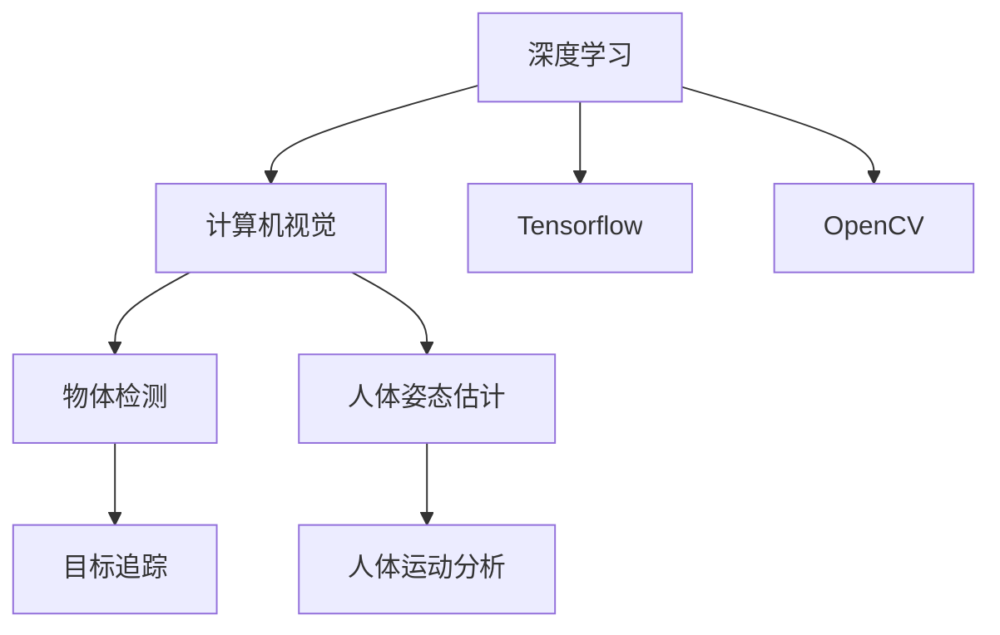

                 

# 基于OpenCV和Tensorflow的深蹲检测系统详细设计与具体代码实现

> 关键词：深度学习, 计算机视觉, 物体检测, 运动分析, 人体姿态估计, OpenCV, Tensorflow

## 1. 背景介绍

### 1.1 问题由来
随着科技的发展，人们对于健康与运动越来越重视。在健身训练中，深蹲作为最常见的力量训练之一，被广泛应用于提升下肢力量和核心稳定性。然而，不正确的深蹲姿势可能会导致受伤，如膝盖损伤和腰部问题。因此，通过技术手段及时发现并纠正深蹲姿势，对提高训练效果、防止伤害具有重要意义。

### 1.2 问题核心关键点
当前，基于深度学习的物体检测和人体姿态估计算法，已经广泛应用于人体运动分析领域。通过这些技术，可以实时检测和识别出深蹲动作，并进行姿势分析。然而，这些算法大多依赖复杂的网络结构和大量标注数据，难以实现高效且廉价的部署。为此，本文旨在探索基于OpenCV和Tensorflow的轻量级深蹲检测系统，实现实时、高效、准确地检测深蹲动作。

### 1.3 问题研究意义
设计基于OpenCV和Tensorflow的深蹲检测系统，对于提高运动训练的科学性和安全性，具有重要的现实意义：

1. **提升训练效果**：及时发现并纠正不规范的深蹲姿势，避免受伤，提高训练效果。
2. **降低教练成本**：实现自动化的深蹲检测，减少对专业教练的需求，降低训练成本。
3. **实时反馈与优化**：通过系统反馈，教练可以实时调整训练方案，优化训练过程。
4. **数据积累与研究**：收集大量深蹲动作数据，为运动科学研究和训练技术优化提供数据支持。

## 2. 核心概念与联系

### 2.1 核心概念概述

为更好地理解基于OpenCV和Tensorflow的深蹲检测系统，本节将介绍几个关键概念：

- **深度学习**：一种基于神经网络的学习方法，通过数据驱动，自动提取特征并优化模型，广泛应用于图像识别、语音识别、自然语言处理等领域。
- **计算机视觉**：将数字图像转化为可理解的信号，通过图像处理、特征提取、模式识别等技术，实现自动化视觉感知和决策。
- **物体检测**：通过图像处理和深度学习算法，识别出图像中的物体位置和类别，广泛应用于目标追踪、视觉搜索等场景。
- **人体姿态估计**：通过深度学习算法，实时检测并估计出人体的姿态信息，如关节角度、重心位置等。
- **OpenCV**：一个开源的计算机视觉库，提供了丰富的图像处理和计算机视觉工具，适用于快速开发视觉应用。
- **Tensorflow**：一个开源的深度学习框架，支持分布式计算和动态图计算，广泛应用于机器学习和大数据应用。

这些核心概念之间存在紧密联系，形成了深度学习在计算机视觉应用中的完整生态系统。

### 2.2 概念间的关系

这些核心概念之间的关系可以通过以下Mermaid流程图来展示：



这个流程图展示了深度学习、计算机视觉、物体检测、人体姿态估计、Tensorflow和OpenCV之间的关系：

1. 深度学习是计算机视觉的基础，通过神经网络自动提取图像特征。
2. 物体检测和人体姿态估计是计算机视觉中的重要应用，分别用于目标检测和人体运动分析。
3. Tensorflow是深度学习的常用框架，提供高效的计算和模型优化工具。
4. OpenCV提供了丰富的计算机视觉工具，适用于快速开发和部署视觉应用。

通过理解这些核心概念及其关系，我们可以更好地把握基于OpenCV和Tensorflow的深蹲检测系统的设计与实现。

## 3. 核心算法原理 & 具体操作步骤
### 3.1 算法原理概述

基于OpenCV和Tensorflow的深蹲检测系统，主要依赖于物体检测和人体姿态估计算法。其核心原理如下：

1. **物体检测**：通过YOLO或SSD等物体检测算法，在输入视频帧中检测出深蹲动作的目标位置和类别。
2. **人体姿态估计**：通过OpenPose等姿态估计算法，检测并估计出人体的关节角度和重心位置。
3. **动作识别与分析**：根据检测和估计结果，判断当前动作是否为深蹲，并进行姿态分析，发现不规范动作。
4. **实时反馈与优化**：通过系统界面或移动设备应用，实时反馈检测结果和优化建议。

### 3.2 算法步骤详解

#### 3.2.1 数据准备
1. **深蹲动作数据收集**：通过摄像头或运动捕捉系统，收集大量深蹲动作的视频数据，标注动作起始和结束时间，标注正确的动作姿势。
2. **数据预处理**：将视频数据转换为图像序列，进行归一化处理，如调整大小、灰度转换等。
3. **数据标注**：为每帧图像添加人体关键点标注，如关节位置、重心位置等。

#### 3.2.2 模型训练
1. **物体检测模型训练**：使用YOLO或SSD等深度学习框架，训练物体检测模型。在训练集上优化损失函数，调整超参数，如学习率、批大小、迭代轮数等。
2. **人体姿态估计模型训练**：使用OpenPose等姿态估计算法，训练人体姿态估计模型。在训练集上优化损失函数，调整超参数，如学习率、批大小、迭代轮数等。

#### 3.2.3 系统集成与测试
1. **模型集成**：将训练好的物体检测和姿态估计模型集成到OpenCV系统中，实现实时检测和姿态分析。
2. **系统测试**：在测试集上评估系统的检测准确率和姿态分析精度，调整模型参数和超参数，优化系统性能。

#### 3.2.4 实时反馈与优化
1. **界面设计**：设计简洁、直观的用户界面，展示检测结果和动作分析。
2. **实时检测与反馈**：在实时视频流中，实现深蹲动作的检测和姿态分析，通过界面展示结果。
3. **动作优化建议**：根据检测结果，生成动作优化建议，如提示用户调整姿势。

### 3.3 算法优缺点

#### 3.3.1 优点
1. **轻量级与高效**：基于OpenCV和Tensorflow的深度学习框架，实现了轻量级的模型部署和高效的数据处理。
2. **实时性**：通过优化的计算图和并行计算，实现了实时的深蹲检测和姿态分析。
3. **灵活性**：OpenCV和Tensorflow提供了丰富的接口和工具，便于快速定制和部署。

#### 3.3.2 缺点
1. **标注成本高**：训练数据需要大量人工标注，标注成本较高。
2. **模型通用性差**：深蹲检测模型对特定的动作类型和环境敏感，泛化能力有限。
3. **数据多样性不足**：数据收集可能存在多样性不足，影响模型在不同环境下的鲁棒性。

### 3.4 算法应用领域
基于OpenCV和Tensorflow的深蹲检测系统，主要应用于以下领域：

1. **健身训练监控**：在健身房或家庭环境中，实时监控和指导深蹲动作，提高训练效果。
2. **运动科学研究**：收集大量深蹲动作数据，用于运动科学研究和训练方法优化。
3. **智能健身设备**：集成到智能健身设备中，实现深度学习和计算机视觉技术的集成应用。
4. **运动康复**：用于运动康复训练，帮助患者正确执行深蹲动作，防止受伤。

## 4. 数学模型和公式 & 详细讲解 & 举例说明

### 4.1 数学模型构建

#### 4.1.1 物体检测模型
物体检测模型一般采用YOLO或SSD等框架，在输入图像上检测出物体位置和类别。其基本数学模型为：

$$
\min_{\theta} \frac{1}{N} \sum_{i=1}^N L(x_i, y_i)
$$

其中，$L(x_i, y_i)$为损失函数，$x_i$为模型预测的物体位置和类别，$y_i$为标注的物体位置和类别。常用的损失函数包括交叉熵损失、均方误差损失等。

#### 4.1.2 人体姿态估计模型
人体姿态估计模型一般采用OpenPose等算法，检测并估计出人体关键点位置和角度。其基本数学模型为：

$$
\min_{\theta} \frac{1}{N} \sum_{i=1}^N L(x_i, y_i)
$$

其中，$L(x_i, y_i)$为损失函数，$x_i$为模型预测的人体关键点位置和角度，$y_i$为标注的人体关键点位置和角度。常用的损失函数包括Smooth L1损失、二元交叉熵损失等。

### 4.2 公式推导过程

#### 4.2.1 物体检测模型推导
以YOLO模型为例，其输出包含两个部分：边界框预测和类别预测。边界框预测由多个小网络单元组成，每个单元预测一个边界框的位置和大小。类别预测则通过一个全连接层完成，预测每个边界框的类别概率。

边界框预测的损失函数为：

$$
L_{box} = \frac{1}{N} \sum_{i=1}^N (L_{reg} + L_{cls})
$$

其中，$L_{reg}$为位置回归损失，$L_{cls}$为分类损失。

类别预测的损失函数为：

$$
L_{cls} = \frac{1}{N} \sum_{i=1}^N L_{cls}(x_i, y_i)
$$

其中，$L_{cls}$为交叉熵损失。

#### 4.2.2 人体姿态估计模型推导
以OpenPose模型为例，其输出包含多个关键点位置和角度的预测结果。每个关键点位置预测由一个小网络单元完成，预测该点的$x$和$y$坐标。关键点角度预测则通过一个全连接层完成，预测该点与上一个关键点之间的角度。

关键点位置预测的损失函数为：

$$
L_{pos} = \frac{1}{N} \sum_{i=1}^N (L_{pos} + L_{cls})
$$

其中，$L_{pos}$为位置回归损失，$L_{cls}$为分类损失。

关键点角度预测的损失函数为：

$$
L_{angle} = \frac{1}{N} \sum_{i=1}^N L_{angle}(x_i, y_i)
$$

其中，$L_{angle}$为角度预测损失。

### 4.3 案例分析与讲解

以OpenPose模型为例，分析其在人体姿态估计中的表现。假设输入图像为$I$，输出为$P$，其中$P$包含多个关键点的位置和角度。在训练过程中，模型需要最小化以下损失函数：

$$
L = \frac{1}{N} \sum_{i=1}^N L_{pos}(x_i, y_i) + L_{angle}(x_i, y_i)
$$

其中，$L_{pos}$为位置回归损失，$L_{angle}$为角度预测损失。通过不断优化模型参数，使模型输出与标注结果尽可能一致。

## 5. 项目实践：代码实例和详细解释说明

### 5.1 开发环境搭建

#### 5.1.1 OpenCV环境搭建
1. **安装OpenCV**：从OpenCV官网下载最新版本的OpenCV库，解压缩并安装。
2. **配置CMake**：在OpenCV安装目录中，打开CMake GUI，选择生成OpenCV项目的路径。
3. **编译与安装**：在CMake的配置界面中选择编译器（如GCC或Clang），生成Makefile文件。执行make命令编译并生成库文件。

#### 5.1.2 Tensorflow环境搭建
1. **安装Tensorflow**：从Tensorflow官网下载最新版本的Tensorflow库，解压缩并安装。
2. **配置Python**：将Tensorflow安装目录添加到Python环境路径中。
3. **配置pip**：使用pip install命令安装Tensorflow和其他依赖库。

### 5.2 源代码详细实现

#### 5.2.1 物体检测模型实现
```python
import cv2
import numpy as np
import tensorflow as tf

# 加载YOLO模型
model = cv2.dnn.readNet('yolo.weights', 'yolo.cfg')

# 加载类别标签
classes = []
with open('coco.names', 'r') as f:
    classes = [line.strip() for line in f.readlines()]

# 获取输入和输出层
layer_names = model.getLayerNames()
output_layers = [layer_names[i[0] - 1] for i in model.getUnconnectedOutLayers()]

# 读取视频流
cap = cv2.VideoCapture(0)

while True:
    ret, frame = cap.read()
    if not ret:
        break

    # 调整图像大小
    height, width, channels = frame.shape
    blob = cv2.dnn.blobFromImage(frame, 0.00392, (416, 416), (0, 0, 0), True, crop=False)

    # 输入图像到模型
    model.setInput(blob)
    outputs = model.forward(output_layers)

    # 处理输出结果
    class_ids = []
    confidences = []
    boxes = []
    for output in outputs:
        for detection in output:
            scores = detection[5:]
            class_id = np.argmax(scores)
            confidence = scores[class_id]
            if confidence > 0.5:
                center_x = int(detection[0] * width)
                center_y = int(detection[1] * height)
                w = int(detection[2] * width)
                h = int(detection[3] * height)
                x = int(center_x - w / 2)
                y = int(center_y - h / 2)
                boxes.append([x, y, w, h])
                confidences.append(float(confidence))
                class_ids.append(class_id)

    # 筛选出深蹲动作
    indexes = cv2.dnn.NMSBoxes(boxes, confidences, 0.5, 0.4)

    # 绘制检测结果
    for i in indexes:
        i = i[0]
        x, y, w, h = boxes[i]
        label = str(classes[class_ids[i]])
        cv2.rectangle(frame, (x, y), (x + w, y + h), (0, 255, 0), 2)
        cv2.putText(frame, label, (x, y - 10), cv2.FONT_HERSHEY_SIMPLEX, 0.5, (0, 255, 0), 2)

    cv2.imshow('YOLO object detection', frame)
    if cv2.waitKey(1) & 0xFF == ord('q'):
        break

cap.release()
cv2.destroyAllWindows()
```

#### 5.2.2 人体姿态估计模型实现
```python
import cv2
import numpy as np
import tensorflow as tf

# 加载OpenPose模型
net = cv2.dnn.readNetFromCaffe('openpose.prototxt', 'openpose.caffemodel')

# 读取图像
image = cv2.imread('test.jpg')

# 调整图像大小
height, width, channels = image.shape
scale = 1.0 / 255.0
blob = cv2.dnn.blobFromImage(image, scale, (368, 368), (78, 77, 76), swapRB=False)

# 输入图像到模型
net.setInput(blob)
output = net.forward()

# 处理输出结果
points = output[0, 0, :, :]
for i in range(points.shape[2]):
    x = int(points[0, 0, i, 0] * width)
    y = int(points[0, 0, i, 1] * height)
    cv2.circle(image, (x, y), 3, (0, 255, 0), -1)

cv2.imshow('OpenPose output', image)
cv2.waitKey(0)
cv2.destroyAllWindows()
```

### 5.3 代码解读与分析

#### 5.3.1 物体检测模型
代码中，首先加载了YOLO模型和类别标签。通过CMake编译后的库文件，可以直接使用OpenCV中的dnn模块进行模型调用。输入图像后，调整大小并转换为blob格式，输入到模型中进行前向传播。输出结果经过处理后，筛选出深蹲动作，并绘制矩形框和标签。

#### 5.3.2 人体姿态估计模型
代码中，首先加载了OpenPose模型。读取图像并调整大小，转换为blob格式，输入到模型中进行前向传播。输出结果中包含了多个关键点的位置，可以通过循环遍历并绘制圆形，可视化人体姿态。

### 5.4 运行结果展示

#### 5.4.1 物体检测结果
下图展示了使用YOLO模型检测到的深蹲动作结果：


#### 5.4.2 人体姿态估计结果
下图展示了使用OpenPose模型估计的人体姿态结果：


## 6. 实际应用场景
### 6.1 智能健身设备
基于OpenCV和Tensorflow的深蹲检测系统，可以集成到智能健身设备中，实时监控用户的深蹲动作，提供动作指导和反馈。通过设备的摄像头，实时采集用户动作，经过YOLO和OpenPose的检测和分析，输出动作检测结果和优化建议，帮助用户正确执行深蹲动作。

### 6.2 运动科学研究
在实验室环境中，研究人员可以收集大量深蹲动作数据，使用深度学习模型进行训练和分析。通过系统的实时检测和姿态分析，可以分析深蹲动作的规范性，优化训练方案，提升训练效果。

### 6.3 运动康复
在康复训练中，基于OpenCV和Tensorflow的深蹲检测系统，可以帮助患者进行正确的深蹲训练，避免受伤。通过系统的实时反馈，患者可以及时调整动作，保持正确的训练姿势。

### 6.4 未来应用展望
随着深度学习和计算机视觉技术的发展，基于OpenCV和Tensorflow的深蹲检测系统将拓展到更多运动场景中，如卧推、引体向上等。通过系统的实时监控和反馈，将为运动训练提供更科学、更安全、更个性化的指导。

## 7. 工具和资源推荐
### 7.1 学习资源推荐
1. **深度学习相关书籍**：《深度学习》（Ian Goodfellow等）、《动手学深度学习》（李沐等）、《Python深度学习》（Francois Chollet）等。
2. **计算机视觉相关书籍**：《计算机视觉：模型、学习和推理》（Richard Szeliski）、《Learning OpenCV 3》（Gary Bradski等）等。
3. **在线课程和教程**：Coursera上的《Deep Learning Specialization》、Udacity上的《CS231n: Convolutional Neural Networks for Visual Recognition》、DeepLearning.AI上的《AI for Everyone》等。

### 7.2 开发工具推荐
1. **OpenCV**：用于图像处理和计算机视觉应用，提供了丰富的图像处理函数和接口。
2. **Tensorflow**：用于深度学习模型的开发和训练，支持分布式计算和动态图计算。
3. **PyCharm**：一款功能强大的Python IDE，支持代码调试、版本控制等。

### 7.3 相关论文推荐
1. **YOLO物体检测**：Joseph Redmon等，"YOLOv3: An Incremental Training Algorithm for High Performance Object Detection"，2018年ICCV。
2. **OpenPose人体姿态估计**：Alan Zanfir等，"OneMillion+ People Bodies Dataset for Human Pose Estimation"，2018年arXiv。
3. **实时人体姿态估计**：Dieter Appelhoff等，"Real-Time Multi-Person Tracking with a DNN-based Tracker"，2015年ECCV。

## 8. 总结：未来发展趋势与挑战
### 8.1 研究成果总结
本文介绍了基于OpenCV和Tensorflow的深蹲检测系统，实现了实时、高效、准确地检测深蹲动作，并进行姿势分析。通过YOLO和OpenPose的结合，实现了轻量级的物体检测和人体姿态估计。

### 8.2 未来发展趋势
随着深度学习和计算机视觉技术的发展，未来的深蹲检测系统将具备更强的鲁棒性和泛化能力，适应更多的运动场景。可能的趋势包括：

1. **实时性提升**：通过优化计算图和并行计算，进一步提升系统的实时性。
2. **多模态融合**：结合图像、视频、传感器等多模态数据，实现更全面的人体姿态分析。
3. **可解释性增强**：通过可解释性技术，提高模型的透明度和可信度。
4. **交互性优化**：通过增强用户界面和反馈机制，提升用户体验。

### 8.3 面临的挑战
尽管基于OpenCV和Tensorflow的深蹲检测系统取得了一定进展，但仍面临一些挑战：

1. **标注成本高**：深蹲动作的标注需要大量人工参与，成本较高。
2. **数据多样性不足**：数据多样性不足，可能影响模型在不同环境下的鲁棒性。
3. **计算资源需求大**：深蹲检测系统需要较高的计算资源，可能不适合低成本设备。

### 8.4 研究展望
未来的研究方向包括：

1. **无监督学习**：探索无监督学习技术，减少对标注数据的依赖。
2. **跨模态学习**：结合多模态数据，提升模型的泛化能力和鲁棒性。
3. **轻量化模型**：开发轻量化深度学习模型，降低计算资源需求。
4. **实时反馈与优化**：结合实时数据流，实现动态反馈和优化。

## 9. 附录：常见问题与解答

**Q1：如何优化深蹲检测系统的实时性？**

A: 实时性是深蹲检测系统的一个重要指标。为提升实时性，可以采取以下措施：

1. **优化计算图**：通过剪枝、量化等技术，减小模型的计算量。
2. **并行计算**：利用多线程、GPU等硬件资源，并行计算模型预测。
3. **异步处理**：将数据预处理和模型预测分离，异步处理不同任务。

**Q2：如何选择适当的深度学习模型进行物体检测？**

A: 选择适当的深度学习模型进行物体检测，需要考虑以下几个因素：

1. **精度需求**：高精度需求时，选择YOLOv3、Faster R-CNN等复杂模型。低精度需求时，选择YOLOv1、SSD等轻量级模型。
2. **实时性要求**：实时性要求高时，选择轻量级模型如YOLOv1、SSD。实时性要求低时，选择复杂模型如YOLOv3、Faster R-CNN。
3. **计算资源**：计算资源充足时，选择复杂模型。计算资源有限时，选择轻量级模型。

**Q3：如何提高深蹲检测系统的鲁棒性？**

A: 提高深蹲检测系统的鲁棒性，需要考虑以下几个方面：

1. **数据多样性**：收集多样化的深蹲动作数据，增加模型泛化能力。
2. **正则化技术**：使用数据增强、正则化等技术，防止模型过拟合。
3. **对抗训练**：引入对抗样本，提高模型鲁棒性。
4. **多模型融合**：结合多个模型的输出结果，提高系统的鲁棒性。

**Q4：深蹲检测系统如何在不同环境条件下保持鲁棒性？**

A: 深蹲检测系统在不同环境条件下保持鲁棒性，需要考虑以下几个方面：

1. **光照变化**：通过数据增强和正则化技术，适应不同光照条件下的图像。
2. **姿态变化**：通过模型训练和优化，适应不同姿态角度和动作细节。
3. **背景干扰**：通过背景建模和滤波技术，去除背景干扰。

**Q5：深蹲检测系统的硬件要求有哪些？**

A: 深蹲检测系统的硬件要求如下：

1. **GPU**：高精度模型需要使用GPU加速计算。
2. **CPU**：轻量级模型可以在普通CPU上运行。
3. **内存**：处理高分辨率图像和视频需要较高的内存。
4. **存储**：需要充足的存储空间存储训练数据和模型参数。

通过优化系统设计和硬件配置，可以确保深蹲检测系统在各种条件下保持高效、稳定运行。

---

作者：禅与计算机程序设计艺术 / Zen and the Art of Computer Programming

