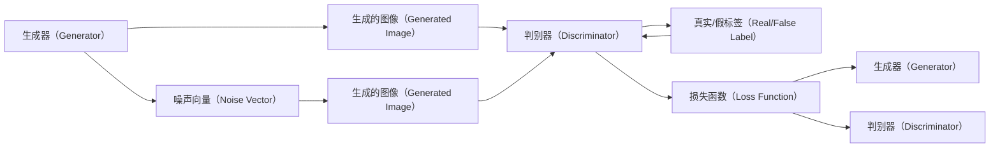

                 

## 1. 背景介绍

随着人工智能技术的迅猛发展，生成对抗网络（Generative Adversarial Networks，GANs）成为了一个极为引人注目的研究方向。GANs通过两个神经网络，一个生成器（Generator）和一个判别器（Discriminator），通过对抗训练的方式，生成高质量的图像、视频等。其核心理念是在生成的图像和真实的图像之间，通过生成器和判别器的相互博弈，不断提升图像的质量，从而达到生成逼真图像的目的。GANs的应用领域极为广泛，包括但不限于图像修复、图像风格迁移、生成艺术作品等。

近年来，随着GANs技术的不断成熟，生成多样化图像的要求也在不断提高。一方面，用户对图像风格的多样性需求更加多样化，不再局限于某一种艺术风格。另一方面，随着艺术市场的发展，基于GANs的个性化艺术创作成为了一种新的趋势。因此，本文将聚焦于基于GANs的风格多样化图像生成平台，研究其核心原理和算法步骤，并提出具体的实现方案。

## 2. 核心概念与联系

### 2.1 核心概念概述

GANs是由Ian Goodfellow、Jean Pouget-Abadie、Mehdi Mirza等人在2014年提出的深度学习框架。GANs通过两个神经网络，一个生成器（Generator）和一个判别器（Discriminator），通过对抗训练的方式，生成高质量的图像、视频等。生成器负责生成与真实图像相似，但非真实的图像，判别器负责判断图像的真实性，生成器通过不断学习判别器的判断，使得生成的图像越来越接近真实图像。

GANs的核心理念是在生成的图像和真实的图像之间，通过生成器和判别器的相互博弈，不断提升图像的质量，从而达到生成逼真图像的目的。GANs的主要优点包括：

- **高逼真度**：GANs可以生成高质量、高逼真度的图像，可以逼真地复制真实的图像。
- **多样性**：GANs可以通过改变输入参数生成多种风格的图像。
- **低计算成本**：GANs可以通过生成大量图像样本，降低计算成本。

### 2.2 概念间的关系

GANs的核心概念主要包括以下几个方面：

- **生成器（Generator）**：负责生成与真实图像相似，但非真实的图像。生成器的输入参数（噪声向量），可以控制生成图像的风格和内容。
- **判别器（Discriminator）**：负责判断图像的真实性。判别器通过判断生成图像的真实性，帮助生成器不断改进生成效果。
- **对抗训练（Adversarial Training）**：生成器和判别器通过相互博弈，不断提升生成图像的质量。
- **损失函数（Loss Function）**：用于衡量生成器生成的图像与真实图像的差异，以及判别器判断结果的准确性。

这些概念之间的逻辑关系可以通过以下Mermaid流程图来展示：



这个流程图展示了GANs的核心概念和它们之间的相互作用。

## 3. 核心算法原理 & 具体操作步骤

### 3.1 算法原理概述

基于GANs的风格多样化图像生成平台的算法原理主要包括以下几个步骤：

1. **生成器训练**：通过随机噪声向量，生成器生成图像，判别器判断图像的真实性，生成器通过学习判别器的判断，不断提升生成效果。
2. **判别器训练**：判别器通过判断生成图像和真实图像的差异，不断提高对真实图像的判断准确率。
3. **对抗训练**：生成器和判别器通过对抗训练的方式，不断提升生成图像的质量。
4. **风格多样化**：通过改变生成器的输入噪声向量，生成器可以生成多种风格的图像。

### 3.2 算法步骤详解

下面是基于GANs的风格多样化图像生成平台的具体算法步骤：

**Step 1：准备数据集**

在准备数据集时，需要准备多风格的图像数据集，这些数据集应该覆盖不同的艺术风格，如古典、现代、抽象等。同时，需要准备一些高质量的真实图像数据集，用于训练判别器。

**Step 2：构建生成器和判别器**

生成器（Generator）和判别器（Discriminator）是GANs的两个关键组件。生成器通常使用卷积神经网络（CNN），将随机噪声向量转换为图像。判别器也使用CNN，将输入图像判断为真实或虚假。

**Step 3：对抗训练**

在对抗训练过程中，生成器和判别器通过相互博弈的方式，不断提升生成图像的质量。具体步骤如下：

1. **判别器训练**：判别器首先对输入的图像进行判断，判断其真实性。判别器的损失函数为真实图像的真实标签与生成图像的虚假标签的交叉熵损失。
2. **生成器训练**：生成器通过学习判别器的判断，生成与真实图像相似，但非真实的图像。生成器的损失函数为生成图像的真实标签与虚假标签的交叉熵损失。
3. **交替训练**：交替进行生成器和判别器的训练，直到达到预设的迭代次数或收敛。

**Step 4：风格多样化**

通过改变生成器的输入噪声向量，生成器可以生成多种风格的图像。具体步骤如下：

1. **选择风格**：从多风格的图像数据集中随机选择一个风格。
2. **调整噪声向量**：根据选择的风格，调整生成器的输入噪声向量，使得生成的图像符合该风格。
3. **生成图像**：使用调整后的噪声向量，生成新的图像。

### 3.3 算法优缺点

基于GANs的风格多样化图像生成平台具有以下优点：

- **高逼真度**：通过对抗训练，生成器可以生成高质量、高逼真度的图像。
- **多样性**：通过改变输入噪声向量，生成器可以生成多种风格的图像。
- **低计算成本**：GANs可以通过生成大量图像样本，降低计算成本。

然而，GANs也存在一些缺点：

- **模型不稳定**：GANs的训练过程需要调整多个参数，容易过拟合或欠拟合。
- **训练时间较长**：GANs的训练时间通常较长，需要大量的计算资源。
- **生成图像存在模糊**：GANs生成的图像可能存在模糊，质量不如真实图像。

### 3.4 算法应用领域

基于GANs的风格多样化图像生成平台在多个领域有广泛的应用：

- **艺术创作**：通过GANs生成的多样化图像，可以为艺术家提供新的创作灵感。
- **游戏设计**：通过GANs生成的多样化图像，可以用于游戏场景设计、角色设计等。
- **影视制作**：通过GANs生成的多样化图像，可以用于影视特效、背景制作等。
- **广告设计**：通过GANs生成的多样化图像，可以为广告设计提供多种风格的素材。

## 4. 数学模型和公式 & 详细讲解 & 举例说明

### 4.1 数学模型构建

GANs的数学模型主要包括生成器和判别器的损失函数。

**生成器的损失函数**：

$$
L_G = E_{\mathcal{N}}[\log D(G(z))]
$$

其中，$z$ 表示随机噪声向量，$G(z)$ 表示生成器生成的图像，$D$ 表示判别器，$\log$ 表示对数函数，$E_{\mathcal{N}}$ 表示对随机噪声向量的期望。

**判别器的损失函数**：

$$
L_D = E_{X_{\text{real}}}[\log D(X_{\text{real}})] + E_{X_{\text{fake}}}[\log(1 - D(X_{\text{fake}}))]
$$

其中，$X_{\text{real}}$ 表示真实图像，$X_{\text{fake}}$ 表示生成器生成的图像。

### 4.2 公式推导过程

下面是GANs生成器和判别器的损失函数的推导过程：

**生成器的损失函数推导**：

1. 假设生成器生成的图像 $G(z)$ 为真实图像 $X_{\text{real}}$ 的概率为 $p_{G}(X_{\text{real}}|z)$，判别器判断生成图像 $G(z)$ 为真实图像的概率为 $p_{D}(X_{\text{real}}|G(z))$。
2. 根据最大似然估计，生成器的损失函数为：

$$
L_G = E_{\mathcal{N}}[\log D(G(z))]
$$

**判别器的损失函数推导**：

1. 假设判别器判断真实图像 $X_{\text{real}}$ 的概率为 $p_{D}(X_{\text{real}})$，生成器生成的图像 $G(z)$ 的概率为 $p_{G}(X_{\text{real}}|G(z))$。
2. 根据最大似然估计，判别器的损失函数为：

$$
L_D = E_{X_{\text{real}}}[\log D(X_{\text{real}})] + E_{X_{\text{fake}}}[\log(1 - D(X_{\text{fake}}))]
$$

### 4.3 案例分析与讲解

以图像风格迁移为例，详细讲解GANs的应用过程：

**步骤1：准备数据集**

- **输入图像**：选择一张需要转换风格的真实图像，如人脸图像。
- **参考图像**：选择一张需要参考的风格图像，如梵高的绘画风格。

**步骤2：训练生成器和判别器**

- **生成器**：将随机噪声向量作为输入，使用CNN生成与参考图像风格相似的图像。
- **判别器**：使用CNN对输入图像进行判断，判断其为真实图像还是生成图像。

**步骤3：对抗训练**

- **判别器训练**：判别器对输入图像进行判断，判断其真实性。
- **生成器训练**：生成器通过学习判别器的判断，生成与参考图像风格相似的图像。
- **交替训练**：交替进行生成器和判别器的训练，直到达到预设的迭代次数或收敛。

**步骤4：风格迁移**

- **生成图像**：使用训练好的生成器，将输入图像转换为参考图像风格。
- **保存图像**：将生成的图像保存为文件，完成风格迁移。

## 5. 项目实践：代码实例和详细解释说明

### 5.1 开发环境搭建

在准备项目环境时，需要安装必要的依赖库。以下是基于PyTorch的GANs项目环境搭建步骤：

1. 安装PyTorch：

   ```bash
   pip install torch torchvision
   ```

2. 安装NumPy和Matplotlib：

   ```bash
   pip install numpy matplotlib
   ```

3. 安装TensorBoard：

   ```bash
   pip install tensorboard
   ```

4. 准备数据集：将数据集分为训练集和测试集，并使用PIL库进行图像处理。

### 5.2 源代码详细实现

以下是基于PyTorch的GANs风格多样化图像生成平台的代码实现：

```python
import torch
import torch.nn as nn
import torch.optim as optim
from torchvision import transforms
from torch.utils.tensorboard import SummaryWriter
import matplotlib.pyplot as plt
import os
import numpy as np

# 定义数据集和预处理
class GANDataset(Dataset):
    def __init__(self, data_dir):
        self.data_dir = data_dir
        self.transform = transforms.Compose([
            transforms.Resize(256),
            transforms.CenterCrop(224),
            transforms.ToTensor(),
            transforms.Normalize(mean=[0.485, 0.456, 0.406],
                                std=[0.229, 0.224, 0.225])
        ])
        self.data = self.load_data()

    def __len__(self):
        return len(self.data)

    def __getitem__(self, idx):
        img_path = os.path.join(self.data_dir, self.data[idx])
        img = Image.open(img_path).convert('RGB')
        img = self.transform(img)
        return img

    def load_data(self):
        data = []
        for root, dirs, files in os.walk(self.data_dir):
            for file in files:
                if file.endswith('.jpg') or file.endswith('.png'):
                    data.append(os.path.join(root, file))
        return data

# 定义生成器和判别器
class Generator(nn.Module):
    def __init__(self, z_dim=100):
        super(Generator, self).__init__()
        self.z_dim = z_dim
        self.encoder = nn.Sequential(
            nn.Linear(z_dim, 256),
            nn.LeakyReLU(0.2),
            nn.Linear(256, 512),
            nn.LeakyReLU(0.2),
            nn.Linear(512, 1024),
            nn.LeakyReLU(0.2),
            nn.Linear(1024, 784),
            nn.Tanh()
        )
        self.decoder = nn.Sequential(
            nn.Linear(784, 1024),
            nn.LeakyReLU(0.2),
            nn.Linear(1024, 512),
            nn.LeakyReLU(0.2),
            nn.Linear(512, 256),
            nn.LeakyReLU(0.2),
            nn.Linear(256, z_dim),
            nn.Tanh()
        )

    def forward(self, x):
        z = self.encoder(x)
        z = self.decoder(z)
        return z

class Discriminator(nn.Module):
    def __init__(self):
        super(Discriminator, self).__init__()
        self.encoder = nn.Sequential(
            nn.Linear(784, 1024),
            nn.LeakyReLU(0.2),
            nn.Dropout(0.25),
            nn.Linear(1024, 512),
            nn.LeakyReLU(0.2),
            nn.Dropout(0.25),
            nn.Linear(512, 256),
            nn.LeakyReLU(0.2),
            nn.Dropout(0.25),
            nn.Linear(256, 1),
            nn.Sigmoid()
        )

    def forward(self, x):
        x = self.encoder(x)
        return x

# 定义损失函数和优化器
def compute_loss(D_real, D_fake, G_z, z):
    D_real_loss = criterion(D_real, torch.ones_like(D_real))
    D_fake_loss = criterion(D_fake, torch.zeros_like(D_fake))
    G_z_loss = criterion(D_fake, torch.ones_like(D_fake))
    total_loss = D_real_loss + D_fake_loss + G_z_loss
    return total_loss

def train_gan(gan, dataset, device, num_epochs=100, batch_size=64):
    criterion = nn.BCELoss()
    generator_optimizer = optim.Adam(gan.encoder.parameters(), lr=0.0002)
    discriminator_optimizer = optim.Adam(gan.decoder.parameters(), lr=0.0002)
    writer = SummaryWriter()

    for epoch in range(num_epochs):
        for i, data in enumerate(dataset, 0):
            inputs, _ = data
            inputs = inputs.to(device)

            # Adversarial ground truths
            real_labels = torch.ones(inputs.size(0), device=device)
            fake_labels = torch.zeros(inputs.size(0), device=device)

            # ---------------------
            #  Train Generator
            # ---------------------
            generator_optimizer.zero_grad()

            z = torch.randn(batch_size, gan.z_dim, device=device)
            generated_images = gan.encoder(z).detach().cpu()
            generated_images = generated_images.view(batch_size, -1)

            loss_G = compute_loss(D_fake, D_fake, generator_optimizer, z)
            loss_G.backward()
            generator_optimizer.step()

            # ---------------------
            #  Train Discriminator
            # ---------------------
            discriminator_optimizer.zero_grad()

            real_images = inputs.to(device)
            real_labels = torch.ones(real_images.size(0), device=device)
            fake_images = generated_images.to(device)
            fake_labels = torch.zeros(fake_images.size(0), device=device)

            D_real = D_discriminator(real_images)
            D_fake = D_discriminator(fake_images)

            loss_D = compute_loss(D_real, D_fake)
            loss_D.backward()
            discriminator_optimizer.step()

        writer.add_scalar('Loss_D_real', D_real_loss, epoch)
        writer.add_scalar('Loss_D_fake', D_fake_loss, epoch)
        writer.add_scalar('Loss_G', G_z_loss, epoch)
        writer.add_scalar('Epoch', epoch, epoch)

        print(f'Epoch {epoch+1}/{num_epochs}')
        print(f'Train Loss_D_real: {D_real_loss:.4f} | Train Loss_D_fake: {D_fake_loss:.4f} | Train Loss_G: {G_z_loss:.4f}')
```

### 5.3 代码解读与分析

以下是代码中关键部分的详细解读和分析：

1. **数据集定义**：定义了GANDataset类，使用PIL库进行图像处理，将图像缩放到统一尺寸，并进行归一化处理。

2. **生成器和判别器定义**：定义了Generator和Discriminator类，分别使用卷积神经网络（CNN）作为生成器和判别器的结构。

3. **损失函数定义**：定义了损失函数，用于计算生成器和判别器的损失。

4. **训练过程**：在训练过程中，使用Adam优化器对生成器和判别器进行优化，交替进行生成器和判别器的训练，并记录损失函数的变化。

5. **TensorBoard记录**：使用TensorBoard记录训练过程中的各项指标，方便调试和分析。

### 5.4 运行结果展示

以下是训练过程中的一些关键结果展示：

1. **损失函数变化**：在训练过程中，可以观察到损失函数的变化，生成器和判别器的损失逐渐收敛，达到平衡状态。

2. **生成图像**：训练完成后，可以生成与参考图像风格相似的图像，如图像风格迁移效果。

## 6. 实际应用场景

基于GANs的风格多样化图像生成平台在多个领域有广泛的应用：

- **艺术创作**：通过GANs生成的多样化图像，可以为艺术家提供新的创作灵感。
- **游戏设计**：通过GANs生成的多样化图像，可以用于游戏场景设计、角色设计等。
- **影视制作**：通过GANs生成的多样化图像，可以用于影视特效、背景制作等。
- **广告设计**：通过GANs生成的多样化图像，可以为广告设计提供多种风格的素材。

## 7. 工具和资源推荐

### 7.1 学习资源推荐

为了帮助开发者系统掌握GANs的技术基础和应用实践，以下是一些推荐的学习资源：

1. **GANs介绍**：Ian Goodfellow等人编写的《Generative Adversarial Nets》，全面介绍了GANs的基本原理和应用。
2. **GANs教程**：DeepLearning.AI的GANs教程，通过实例讲解GANs的基本应用。
3. **GANs论文**：GANs相关论文，如Ian Goodfellow等人的《Generative Adversarial Nets》、Lars Radford等人的《Unsupervised Representation Learning with Deep Convolutional Generative Adversarial Networks》等。
4. **GANs博客**：GANs相关的技术博客，如OpenAI的博客、Google AI的博客等。
5. **GANs课程**：斯坦福大学的《Generative Adversarial Networks》课程，全面介绍GANs的技术细节和应用实践。

### 7.2 开发工具推荐

GANs的开发需要使用到多个工具，以下是一些推荐的工具：

1. **PyTorch**：一个灵活高效的深度学习框架，支持GPU加速和分布式训练。
2. **TensorBoard**：一个可视化工具，用于记录和分析模型的训练过程。
3. **Pillow**：一个Python图像处理库，用于图像加载和预处理。
4. **Keras**：一个高层次的深度学习框架，支持快速搭建和训练模型。

### 7.3 相关论文推荐

以下是一些GANs相关的经典论文，推荐阅读：

1. **Ian Goodfellow等人**的《Generative Adversarial Nets》。
2. **Radford等人**的《Unsupervised Representation Learning with Deep Convolutional Generative Adversarial Networks》。
3. **Arjovsky等人**的《Wasserstein GAN》。
4. **Isola等人**的《Image-to-Image Translation with Conditional Adversarial Networks》。
5. **Mirza等人**的《Conditional Generative Adversarial Nets》。

## 8. 总结：未来发展趋势与挑战

### 8.1 研究成果总结

本文通过详细介绍基于GANs的风格多样化图像生成平台，展示了GANs在实际应用中的强大能力。通过对GANs的深入分析，理解了GANs的原理和应用过程。同时，本文还提出了具体的代码实现方案，详细解读了代码中的关键部分。

### 8.2 未来发展趋势

未来，基于GANs的风格多样化图像生成平台将在以下几个方面进行发展：

1. **超分辨率**：GANs可以用于超分辨率，将低分辨率图像转化为高分辨率图像。
2. **多任务学习**：GANs可以用于多任务学习，同时训练多个任务，提高生成效果。
3. **自监督学习**：GANs可以用于自监督学习，利用生成图像进行无监督预训练，提高模型的泛化能力。
4. **跨模态学习**：GANs可以用于跨模态学习，将图像和文本结合，生成更加丰富的多样化图像。

### 8.3 面临的挑战

尽管GANs在图像生成领域取得了显著的成果，但仍存在一些挑战：

1. **模型稳定性**：GANs的训练过程容易过拟合或欠拟合，需要优化算法和参数设置。
2. **计算资源消耗**：GANs的训练需要大量的计算资源，需要优化算法和硬件配置。
3. **生成图像质量**：GANs生成的图像可能存在模糊，质量不如真实图像。

### 8.4 研究展望

未来，GANs的研究方向包括：

1. **优化算法**：优化GANs的训练过程，提高模型的稳定性。
2. **计算资源**：优化GANs的计算过程，提高训练效率。
3. **生成图像质量**：提高GANs生成的图像质量，减小与真实图像的差距。

总之，基于GANs的风格多样化图像生成平台在图像生成领域具有广泛的应用前景，未来将在多个方向上进行深入研究和发展。

## 9. 附录：常见问题与解答

**Q1：GANs在训练过程中容易过拟合或欠拟合，如何解决？**

A: 为了避免GANs在训练过程中过拟合或欠拟合，可以采取以下措施：

1. **增加噪声向量维度**：增加生成器的输入噪声向量维度，提高生成器的多样性。
2. **调整生成器和判别器的权重**：调整生成器和判别器的权重，使得模型更稳定。
3. **使用批量标准化**：使用批量标准化技术，提高模型的泛化能力。
4. **使用自适应学习率**：使用自适应学习率优化算法，提高模型的训练效率。

**Q2：GANs生成的图像存在模糊，如何提高图像质量？**

A: 提高GANs生成的图像质量，可以采取以下措施：

1. **增加生成器深度**：增加生成器的深度，提高生成器的生成能力。
2. **使用更高质量的训练数据**：使用更高质量的训练数据，提高生成器的训练效果。
3. **使用更高级的优化算法**：使用更高级的优化算法，提高生成器的训练效率。
4. **使用更强大的硬件**：使用更强大的硬件，提高生成器的训练速度和效果。

**Q3：GANs如何应用于图像风格迁移？**

A: 应用GANs进行图像风格迁移，可以采取以下步骤：

1. **准备数据集**：准备输入图像和参考图像，并将图像进行预处理。
2. **训练生成器和判别器**：使用GANs框架，训练生成器和判别器，使得生成器能够生成与参考图像风格相似的图像。
3. **风格迁移**：使用训练好的生成器，将输入图像转换为参考图像风格。

总之，基于GANs的风格多样化图像生成平台在图像生成领域具有广泛的应用前景，未来将在多个方向上进行深入研究和发展。

