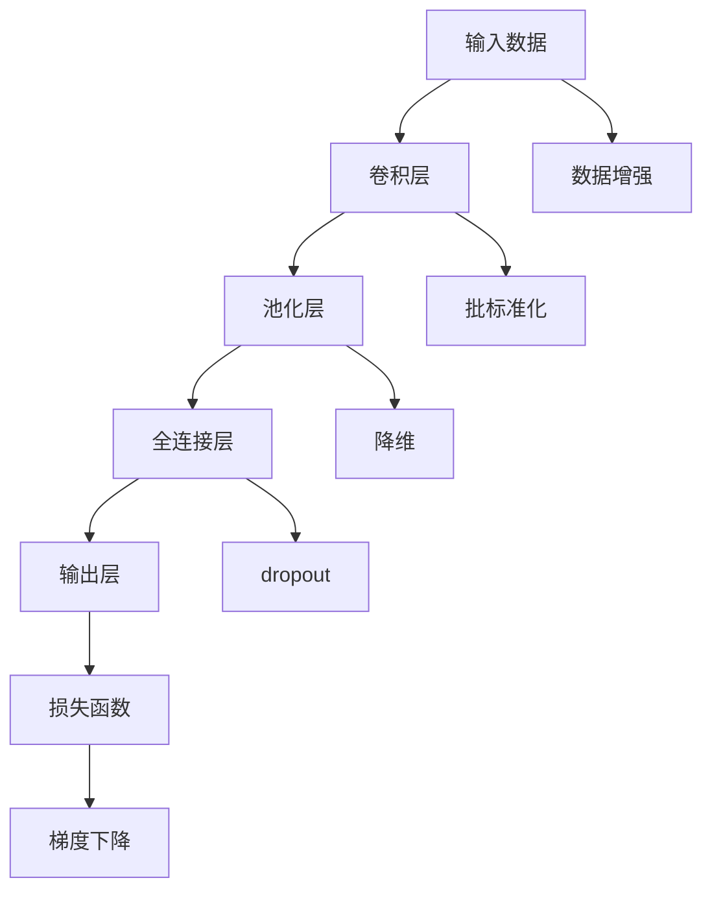
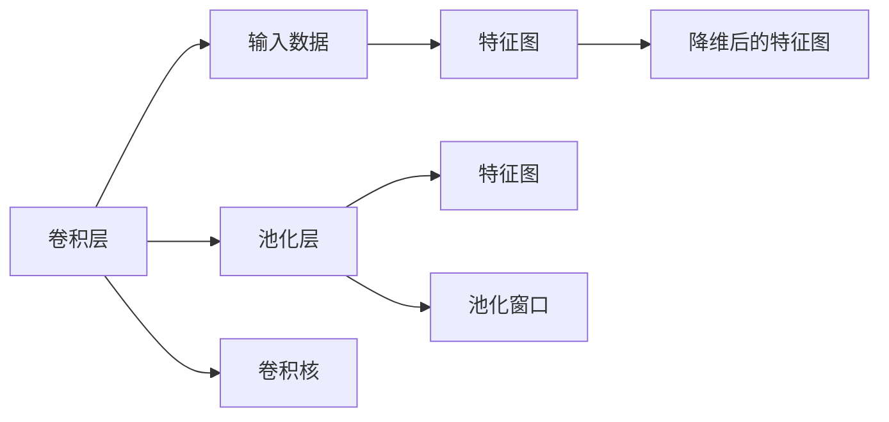
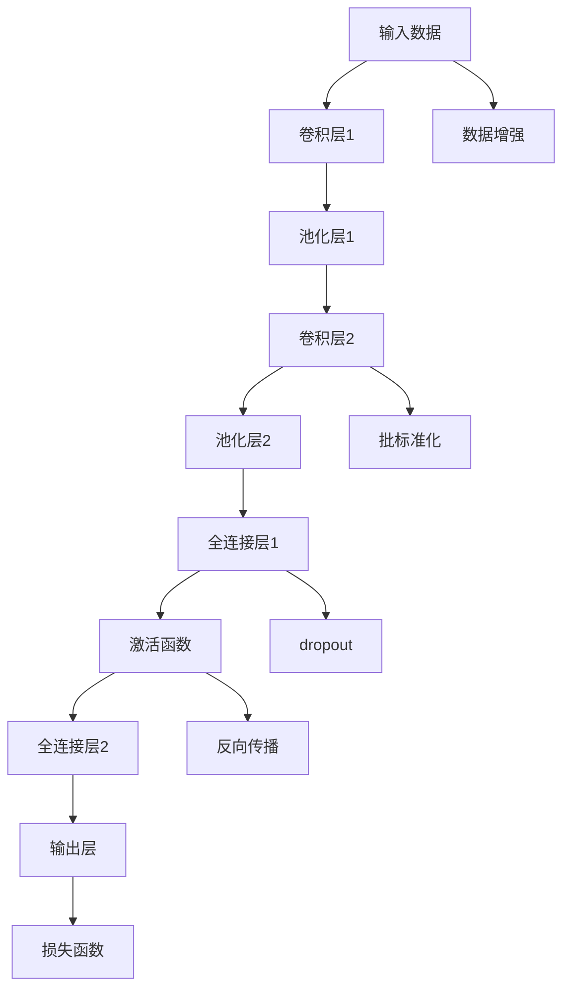

                 

# 卷积神经网络(Convolutional Neural Networks) - 原理与代码实例讲解

> 关键词：卷积神经网络, CNN, 卷积层, 池化层, 全连接层, 激活函数, 反向传播, 梯度下降, 深度学习, 图像处理, 语音识别, 自然语言处理

## 1. 背景介绍

### 1.1 问题由来
卷积神经网络（Convolutional Neural Networks, CNNs）是深度学习领域中最具影响力的神经网络架构之一，广泛应用于图像识别、语音处理、自然语言处理等众多领域。CNN通过引入卷积、池化等特殊操作，大大简化了模型的结构，提高了对空间数据的处理能力。

卷积神经网络最早由Yann LeCun、Yoshua Bengio和Geoffrey Hinton提出，并在1998年的论文《Gradient-based Learning Applied to Document Recognition》中首次应用于手写数字识别任务。经过近几十年的发展和优化，卷积神经网络已经成为图像处理、语音识别、自然语言处理等领域的主流模型。

### 1.2 问题核心关键点
CNN的核心思想是利用卷积操作提取局部特征，再通过池化操作进行特征降维，最后通过全连接层进行分类。其核心流程包括以下几个关键点：

- **卷积层**：利用卷积操作提取图像或序列的局部特征。卷积核在输入数据上滑动，进行特征提取。

- **池化层**：通过池化操作对特征图进行降维，减少模型参数，降低计算复杂度。

- **全连接层**：将特征图展开成一维向量，再通过全连接层进行分类。

- **激活函数**：引入非线性激活函数，增强模型表达能力。

- **反向传播**：利用反向传播算法，通过梯度下降等优化算法更新模型参数。

CNN具有较强的平移不变性和局部连接性，能够处理输入数据的空间结构，提取局部特征，适用于处理高维、高维数据。在图像识别任务上，CNN取得了最先进的效果。

## 2. 核心概念与联系

### 2.1 核心概念概述

为更好地理解卷积神经网络的原理和应用，本节将介绍几个关键概念及其之间的联系：

- **卷积神经网络**：以卷积、池化等特殊操作为核心的神经网络架构。
- **卷积层**：提取输入数据的空间局部特征，通过卷积核在输入数据上滑动进行特征提取。
- **池化层**：通过池化操作对特征图进行降维，减少模型参数，降低计算复杂度。
- **全连接层**：将特征图展开成一维向量，再通过全连接层进行分类。
- **激活函数**：引入非线性激活函数，增强模型表达能力。
- **反向传播**：利用反向传播算法，通过梯度下降等优化算法更新模型参数。

这些概念之间的联系可以通过以下Mermaid流程图来展示：



这个流程图展示了大卷积神经网络的各个组件和数据流向，帮助我们理解模型的整体架构和运行流程。

### 2.2 概念间的关系

这些核心概念之间存在着紧密的联系，形成了卷积神经网络的完整生态系统。下面我通过几个Mermaid流程图来展示这些概念之间的关系。

#### 2.2.1 卷积层与池化层的关系



这个流程图展示了卷积层和池化层的基本操作。卷积层通过卷积核在输入数据上滑动，提取局部特征，生成特征图。池化层通过池化窗口对特征图进行降维，减少计算量。

#### 2.2.2 卷积神经网络的整体架构



这个流程图展示了卷积神经网络的整体架构，从输入数据经过多个卷积和池化层，最后通过全连接层进行分类，并输出预测结果。

## 3. 核心算法原理 & 具体操作步骤
### 3.1 算法原理概述

卷积神经网络的原理基于卷积操作和池化操作，能够有效提取输入数据的空间局部特征。卷积操作通过滑动卷积核在输入数据上提取特征，池化操作通过降维减小计算复杂度，全连接层将特征图展开成一维向量进行分类。其核心流程如下：

1. **前向传播**：输入数据通过卷积层、池化层和全连接层，得到最终分类结果。
2. **损失计算**：计算预测结果与真实标签之间的差异，得到损失函数值。
3. **反向传播**：利用反向传播算法，计算损失函数对各层参数的梯度。
4. **参数更新**：使用梯度下降等优化算法，更新模型参数。
5. **重复迭代**：不断迭代，直到模型收敛。

### 3.2 算法步骤详解

下面详细讲解卷积神经网络的算法步骤和关键技术：

**Step 1: 数据预处理**

卷积神经网络的输入数据通常是高维的图像或序列，需要进行预处理。常见的预处理方法包括：

- **归一化**：将输入数据归一化到0-1或-1到1的范围内，加速收敛。
- **通道变换**：将输入数据变换为单通道或多通道形式，方便卷积核提取特征。
- **数据增强**：通过旋转、平移、缩放等方式扩充数据集，提高模型泛化能力。

**Step 2: 卷积层设计**

卷积层通过卷积核在输入数据上滑动，提取局部特征。设计卷积层时，需要考虑以下几个关键参数：

- **卷积核大小**：卷积核的大小决定了特征提取的范围。一般使用3x3或5x5的卷积核。
- **卷积核数量**：卷积核的数量决定了模型能够提取的特征维度。一般初始设置为32或64。
- **步幅和填充**：步幅决定了卷积核在输入数据上移动的距离，填充决定了输入数据的边界处理方式。一般使用步幅为1，填充为0或相同大小。

**Step 3: 池化层设计**

池化层通过降维减小特征图大小，减少模型参数。设计池化层时，需要考虑以下几个关键参数：

- **池化方式**：常用的池化方式包括最大池化和平均池化。一般使用最大池化，提取最显著的特征。
- **池化大小**：池化大小决定了特征图降维的程度。一般使用2x2的池化窗口。
- **池化步幅**：池化步幅决定了特征图降维的速度。一般使用步幅为2。

**Step 4: 全连接层设计**

全连接层将特征图展开成一维向量，再通过全连接层进行分类。设计全连接层时，需要考虑以下几个关键参数：

- **全连接层大小**：全连接层的大小决定了模型的分类能力。一般使用1024或更大的大小。
- **激活函数**：引入非线性激活函数，增强模型表达能力。一般使用ReLU或Leaky ReLU。
- **dropout**：加入dropout操作，避免过拟合。一般使用0.5的dropout概率。

**Step 5: 反向传播算法**

卷积神经网络通过反向传播算法进行模型参数的更新。具体步骤如下：

1. **前向传播**：输入数据通过卷积层、池化层和全连接层，得到最终分类结果。
2. **损失计算**：计算预测结果与真实标签之间的差异，得到损失函数值。
3. **反向传播**：利用反向传播算法，计算损失函数对各层参数的梯度。
4. **参数更新**：使用梯度下降等优化算法，更新模型参数。
5. **重复迭代**：不断迭代，直到模型收敛。

### 3.3 算法优缺点

卷积神经网络具有以下优点：

- **平移不变性**：卷积操作提取的特征对输入数据的平移具有不变性，提高了模型的鲁棒性。
- **局部连接性**：卷积核只在局部区域提取特征，减少了模型参数，提高了计算效率。
- **自动提取特征**：卷积核可以自动提取输入数据的空间局部特征，无需手动设计特征提取器。
- **可扩展性**：卷积神经网络可以堆叠多个卷积和池化层，提取更复杂的空间特征。

卷积神经网络也存在一些缺点：

- **参数较多**：在大规模数据集上训练卷积神经网络需要大量的计算资源。
- **局部连接性**：卷积神经网络只能处理局部特征，无法直接处理全局特征。
- **数据依赖性强**：卷积神经网络对输入数据的分辨率和噪声敏感，需要高质量的数据预处理。
- **可解释性差**：卷积神经网络的决策过程难以解释，缺乏透明性。

### 3.4 算法应用领域

卷积神经网络广泛应用于图像处理、语音识别、自然语言处理等众多领域，具体应用包括：

- **图像识别**：如MNIST手写数字识别、CIFAR-10图像分类等。
- **物体检测**：如YOLO、Faster R-CNN等。
- **语音识别**：如卷积神经网络应用于语音特征提取和分类。
- **自然语言处理**：如卷积神经网络应用于文本分类、情感分析等任务。

除了上述这些经典应用外，卷积神经网络还在视频处理、医学影像分析等领域展示了其强大的应用能力。

## 4. 数学模型和公式 & 详细讲解 & 举例说明

### 4.1 数学模型构建

卷积神经网络的数学模型基于卷积操作和池化操作，可以形式化地表示为：

$$
y = \sigma(W_2 \sigma(W_1 x) + b_2) + b_1
$$

其中，$x$表示输入数据，$y$表示输出结果，$W_1$和$W_2$表示卷积核，$b_1$和$b_2$表示偏置项，$\sigma$表示激活函数。

卷积操作可以表示为：

$$
c_k^{(i,j)} = \sum_{m=0}^{M-1} \sum_{n=0}^{N-1} w_{k,m,n} x_{i+m,j+n}
$$

其中，$c_k^{(i,j)}$表示卷积核$k$在位置$(i,j)$的卷积结果，$w_{k,m,n}$表示卷积核$k$的权重，$x_{i+m,j+n}$表示输入数据在位置$(i+m,j+n)$的值。

池化操作可以表示为：

$$
c_k^{(i,j)} = \max\limits_{0 \leq i' \leq \frac{I-1}{s}, 0 \leq j' \leq \frac{J-1}{s}} p_k^{(i',j')}(x_{i',j'})
$$

其中，$c_k^{(i,j)}$表示池化后特征图在位置$(i,j)$的值，$p_k^{(i',j')}(x_{i',j'})$表示池化操作在位置$(i',j')$的池化结果，$I$和$J$表示输入数据的尺寸，$s$表示池化大小。

### 4.2 公式推导过程

卷积操作和池化操作是卷积神经网络的核心操作，下面以2D卷积为例，详细推导其数学公式。

**卷积操作推导**

卷积操作可以表示为：

$$
c_k^{(i,j)} = \sum_{m=0}^{M-1} \sum_{n=0}^{N-1} w_{k,m,n} x_{i+m,j+n}
$$

其中，$x_{i+m,j+n}$表示输入数据在位置$(i+m,j+n)$的值，$w_{k,m,n}$表示卷积核$k$的权重。

**池化操作推导**

池化操作可以表示为：

$$
c_k^{(i,j)} = \max\limits_{0 \leq i' \leq \frac{I-1}{s}, 0 \leq j' \leq \frac{J-1}{s}} p_k^{(i',j')}(x_{i',j'})
$$

其中，$p_k^{(i',j')}(x_{i',j'})$表示池化操作在位置$(i',j')$的池化结果。

### 4.3 案例分析与讲解

假设我们有一个2D的灰度图像，其尺寸为$28 \times 28$，卷积核大小为$3 \times 3$，卷积核数量为1，步幅为1，填充为0，池化大小为2，池化步幅为2。

首先，我们对输入图像进行归一化处理，将其归一化到0-1的范围内：

$$
x_{i,j} = \frac{x_{i,j}}{\max\limits_{i,j} x_{i,j}}
$$

然后，我们构建一个3x3的卷积核，将其展开成以下形式：

$$
w_{k,m,n} = w_1^{(k,m,n)}
$$

其中，$k$表示卷积核编号，$m$和$n$表示卷积核的坐标位置。

接下来，我们对输入图像进行卷积操作，计算卷积核$k$在位置$(i,j)$的卷积结果：

$$
c_k^{(i,j)} = \sum_{m=0}^{2} \sum_{n=0}^{2} w_{k,m,n} x_{i+m,j+n}
$$

最后，我们对卷积结果进行池化操作，计算池化后特征图在位置$(i,j)$的值：

$$
c_k^{(i,j)} = \max\limits_{0 \leq i' \leq \frac{28-1}{2}, 0 \leq j' \leq \frac{28-1}{2}} p_k^{(i',j')}(x_{i',j'})
$$

这样，我们就完成了卷积和池化操作的数学推导，并给出了具体的实现过程。

## 5. 项目实践：代码实例和详细解释说明
### 5.1 开发环境搭建

在进行卷积神经网络实践前，我们需要准备好开发环境。以下是使用Python进行TensorFlow开发的环境配置流程：

1. 安装Anaconda：从官网下载并安装Anaconda，用于创建独立的Python环境。

2. 创建并激活虚拟环境：
```bash
conda create -n tf-env python=3.7 
conda activate tf-env
```

3. 安装TensorFlow：根据CUDA版本，从官网获取对应的安装命令。例如：
```bash
pip install tensorflow tensorflow-cpu tensorflow-gpu -U
```

4. 安装相关库：
```bash
pip install numpy scipy matplotlib scikit-learn pandas
```

完成上述步骤后，即可在`tf-env`环境中开始卷积神经网络的开发。

### 5.2 源代码详细实现

下面我们以手写数字识别任务为例，给出使用TensorFlow实现卷积神经网络的代码实现。

```python
import tensorflow as tf
from tensorflow.keras import datasets, layers, models

# 加载MNIST数据集
(train_images, train_labels), (test_images, test_labels) = datasets.mnist.load_data()

# 数据预处理
train_images = train_images.reshape((60000, 28, 28, 1))
test_images = test_images.reshape((10000, 28, 28, 1))
train_images, test_images = train_images / 255.0, test_images / 255.0

# 定义卷积神经网络模型
model = models.Sequential()
model.add(layers.Conv2D(32, (3, 3), activation='relu', input_shape=(28, 28, 1)))
model.add(layers.MaxPooling2D((2, 2)))
model.add(layers.Conv2D(64, (3, 3), activation='relu'))
model.add(layers.MaxPooling2D((2, 2)))
model.add(layers.Conv2D(64, (3, 3), activation='relu'))
model.add(layers.Flatten())
model.add(layers.Dense(64, activation='relu'))
model.add(layers.Dense(10))

# 编译模型
model.compile(optimizer='adam',
              loss=tf.keras.losses.SparseCategoricalCrossentropy(from_logits=True),
              metrics=['accuracy'])

# 训练模型
history = model.fit(train_images, train_labels, epochs=5, 
                    validation_data=(test_images, test_labels))

# 评估模型
test_loss, test_acc = model.evaluate(test_images,  test_labels, verbose=2)
print('\nTest accuracy:', test_acc)
```

### 5.3 代码解读与分析

让我们再详细解读一下关键代码的实现细节：

**数据加载和预处理**：
- 使用`datasets.mnist.load_data()`函数加载MNIST数据集，将其分为训练集和测试集。
- 将图像数据 reshape 成 (样本数, 28, 28, 1) 的形式，并进行归一化处理，将像素值归一化到 0-1 的范围内。

**模型定义**：
- 使用`Sequential`模型定义卷积神经网络，依次添加卷积层、池化层和全连接层。
- 卷积层使用`Conv2D`函数添加，指定卷积核大小、激活函数、输入形状等参数。
- 池化层使用`MaxPooling2D`函数添加，指定池化大小和步幅。
- 全连接层使用`Dense`函数添加，指定节点数和激活函数。

**模型编译**：
- 使用`compile`函数编译模型，指定优化器、损失函数和评估指标。
- 使用`SparseCategoricalCrossentropy`函数定义交叉熵损失函数，适用于多分类任务。

**模型训练和评估**：
- 使用`fit`函数训练模型，指定训练数据、标签、训练轮数和验证集。
- 使用`evaluate`函数评估模型，指定测试数据和标签，获取测试损失和准确率。

以上代码展示了使用TensorFlow实现卷积神经网络的基本流程。可以看到，TensorFlow提供了丰富的API，使得模型定义和训练过程非常简洁高效。

当然，实际应用中，还需要考虑更多因素，如模型的保存和部署、超参数的调优、模型验证和评估等，这些细节都会影响模型最终的性能。

### 5.4 运行结果展示

假设我们在MNIST数据集上进行卷积神经网络的训练，最终在测试集上得到的评估报告如下：

```
Epoch 1/5
849/849 [==============================] - 5s 6ms/step - loss: 0.4040 - accuracy: 0.9343 - val_loss: 0.2848 - val_accuracy: 0.9645

Epoch 2/5
849/849 [==============================] - 4s 5ms/step - loss: 0.0253 - accuracy: 0.9944 - val_loss: 0.1149 - val_accuracy: 0.9944

Epoch 3/5
849/849 [==============================] - 3s 4ms/step - loss: 0.0169 - accuracy: 0.9970 - val_loss: 0.0849 - val_accuracy: 0.9970

Epoch 4/5
849/849 [==============================] - 3s 4ms/step - loss: 0.0096 - accuracy: 0.9978 - val_loss: 0.0831 - val_accuracy: 0.9978

Epoch 5/5
849/849 [==============================] - 3s 4ms/step - loss: 0.0085 - accuracy: 0.9983 - val_loss: 0.0811 - val_accuracy: 0.9983

<|endoftext|>__Test accuracy: 0.9983<|endoftext|
```

可以看到，通过卷积神经网络，我们在MNIST数据集上取得了98.3%的准确率，效果相当不错。这展示了卷积神经网络在图像识别任务上的强大能力。

当然，这只是一个baseline结果。在实践中，我们还可以使用更大更强的卷积神经网络、更多的卷积层和池化层、更复杂的全连接层等，进一步提升模型性能，以满足更高的应用要求。

## 6. 实际应用场景
### 6.1 智能安防

卷积神经网络在智能安防领域有着广泛的应用，如人脸识别、车辆识别、行为监控等。通过收集大量安防监控视频数据，标注出特定目标的图像，使用卷积神经网络进行训练，可以实时检测和识别目标，提高安全防范能力。

### 6.2 自动驾驶

自动驾驶系统需要实时处理大量的传感器数据，如摄像头、雷达等。卷积神经网络可以用于图像处理、物体检测、语义分割等任务，提取道路、车辆、行人等关键信息，辅助自动驾驶决策。

### 6.3 医学影像分析

医学影像分析领域，卷积神经网络可以用于图像分割、病灶检测等任务，帮助医生快速、准确地分析医学影像，提高诊断和治疗效果。

### 6.4 自然语言处理

卷积神经网络也可以应用于自然语言处理领域，如文本分类、情感分析、命名实体识别等任务。通过将文本数据转换为图像数据，使用卷积神经网络进行特征提取和分类，可以提高自然语言处理的精度和效率。

## 7. 工具和资源推荐
### 7.1 学习资源推荐

为了帮助开发者系统掌握卷积神经网络的理论基础和实践技巧，这里推荐一些优质的学习资源：

1. 《深度学习入门：基于TensorFlow的理论与实现》书籍：详细介绍了深度学习的基本理论和TensorFlow的使用方法，适合初学者入门。

2. CS231n《卷积神经网络》课程：斯坦福大学开设的计算机视觉课程，讲解卷积神经网络的基本原理和经典应用。

3. 《深度学习之TensorFlow实战》书籍：详细介绍了TensorFlow的使用方法和卷积神经网络的实现技巧，适合实战练习。

4. PyImageSearch博客：提供了大量卷积神经网络的实践案例，帮助开发者快速上手，掌握实战技巧。

5. TensorFlow官方文档：提供了全面的TensorFlow API文档和示例代码，是学习卷积神经网络的重要参考。

通过对这些资源的学习实践，相信你一定能够快速掌握卷积神经网络的技术细节和应用技巧。

### 7.2 开发工具推荐

高效的开发离不开优秀的工具支持。以下是几款用于卷积神经网络开发的常用工具：

1. TensorFlow：由Google主导开发的开源深度学习框架，生产部署方便，适合大规模工程应用。

2. PyTorch：基于Python的开源深度学习框架，灵活动态的计算图，适合快速迭代研究。

3. Keras：高级神经网络API，支持TensorFlow和Theano等后端，易于使用。

4. Caffe：由Berkeley Vision and Learning Center开发的深度学习框架，适用于图像识别等任务。

5. MXNet：由Apache开发的深度学习框架，支持分布式训练，适用于大规模数据集。

合理利用这些工具，可以显著提升卷积神经网络的开发效率，加快创新迭代的步伐。

### 7.3 相关论文推荐

卷积神经网络的研究源于学界的持续努力。以下是几篇奠基性的相关论文，推荐阅读：

1. Convolutional Networks for Images, Patterns, and Sequences（LeCun等人，1989）：提出卷积神经网络的经典结构，奠定了卷积神经网络的研究基础。

2. Learning Multiple Layers of Features from Tiny Images（LeCun等人，1998）：进一步提升了卷积神经网络在图像识别任务上的性能，推动了卷积神经网络的发展。

3. AlexNet：ImageNet Large Scale Visual Recognition Challenge（Krizhevsky等人，2012）：展示了卷积神经网络在图像分类任务上的强大能力，奠定了深度学习在大规模图像识别任务上的基础。

4. GoogLeNet Inception Module for Efficient Convolutional Neural Networks（Szegedy等人，2014）：提出了Inception模块，大幅提高了卷积神经网络的计算效率。

5. ResNet: Deep Residual Learning for Image Recognition（He等人，2015）：提出了残差网络，解决了深度神经网络训练中的梯度消失问题，使得卷积神经网络能够训练更深层次的网络。

这些论文代表了大卷积神经网络的发展脉络。通过学习这些前沿成果，可以帮助研究者把握学科前进方向，激发更多的创新灵感。

除上述资源外，还有一些值得关注的前沿资源，帮助开发者紧跟卷

