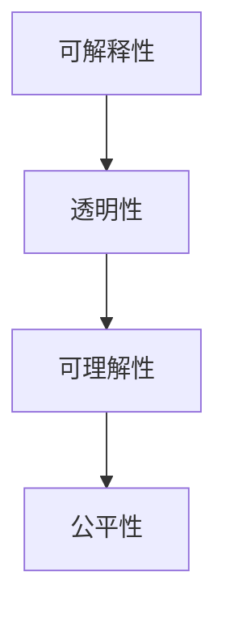
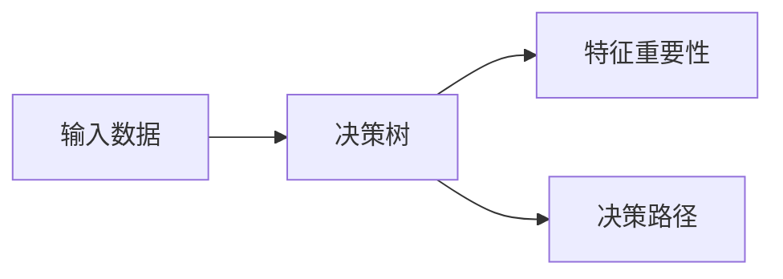
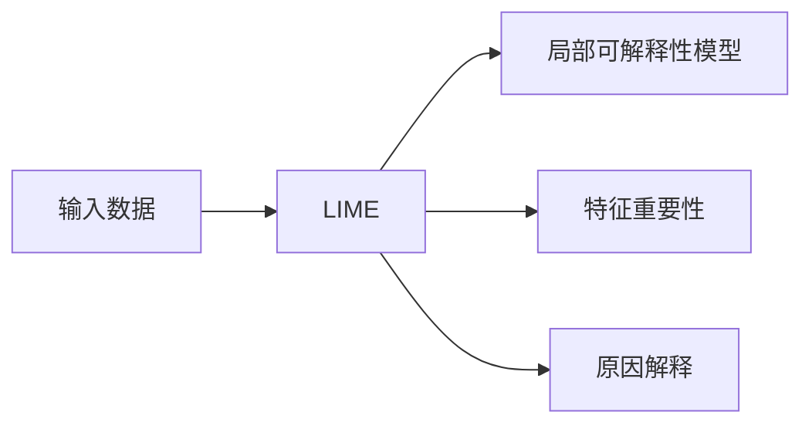
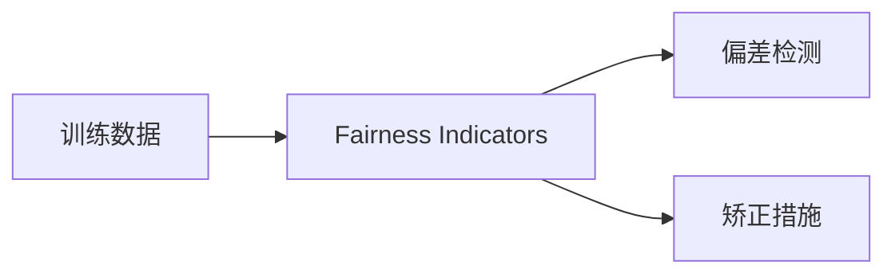

                 

# 可解释人工智能 原理与代码实例讲解

> 关键词：可解释性,人工智能,模型解释,透明性,代码实例

## 1. 背景介绍

### 1.1 问题由来
随着人工智能技术的飞速发展，越来越多的复杂模型被应用于各种领域，如自然语言处理(NLP)、计算机视觉(CV)、机器人学等。这些模型在提升性能的同时，也带来了新的挑战：

- **复杂性**：许多现代机器学习模型，如深度神经网络，由于结构复杂、参数众多，难以理解其内部机制。
- **黑盒问题**：模型决策过程的不可解释性，使得用户难以理解模型如何做出预测，限制了其应用范围。
- **透明性**：在医疗、金融、司法等领域，模型的决策透明性至关重要，黑盒模型难以满足这一要求。

因此，如何提高人工智能模型的可解释性，使其能够被用户理解，成为当前研究的热点之一。

### 1.2 问题核心关键点
可解释人工智能（Explainable AI, XAI）旨在通过增强模型的透明性和可解释性，解决上述复杂性、黑盒问题与透明性需求。具体而言，核心点包括：

- **模型透明性**：解释模型内部的决策过程，展示其如何利用输入数据生成输出。
- **结果可解释性**：解释模型的输出结果，说明预测的依据。
- **用户信任**：通过提高透明性和可解释性，建立用户对模型的信任，降低误解和偏见。

### 1.3 问题研究意义
XAI研究对于构建可信、透明的人工智能系统具有重要意义：

- **提升用户信任**：透明的模型更容易被用户理解，增强对系统的信任度。
- **减少偏见和误解**：解释模型的决策过程，有助于识别和纠正模型中的偏见，减少误判。
- **促进法律法规合规**：在医疗、金融等领域，透明性是法律法规的要求，XAI有助于确保系统符合合规标准。
- **推动学术和工业发展**：XAI是AI研究的重要分支，推动了AI技术的普及和应用。

## 2. 核心概念与联系

### 2.1 核心概念概述

为了深入理解XAI技术，首先需要明确几个关键概念：

- **可解释性（Explainability）**：指模型输出结果的透明性，即用户能够理解模型如何从输入数据中生成输出。
- **透明性（Transparency）**：指模型的决策过程可以被清楚地理解，用户可以知道模型是如何做出特定决策的。
- **可理解性（Interpretability）**：指模型的决策过程具有逻辑上的合理性，用户可以理解模型的决策逻辑。
- **公平性（Fairness）**：指模型在决策过程中不会对特定群体产生偏见，保证决策的公平性和公正性。

这些概念共同构成了XAI技术的研究目标和评价指标，以下通过一个Mermaid流程图展示它们之间的联系：



该流程图展示了XAI的三个核心概念之间的逻辑关系：可解释性通过透明性和可理解性，最终保障了模型的公平性。

### 2.2 概念间的关系

XAI的核心概念间的关系可以通过以下表格进一步明确：

| 概念     | 定义                                     | 关系                                 |
|----------|------------------------------------------|--------------------------------------|
| 可解释性 | 模型输出结果的透明性                       | 透明性、可理解性                       |
| 透明性   | 模型决策过程的可理解性                     | 可解释性、公平性                       |
| 可理解性 | 模型决策过程具有逻辑上的合理性             | 透明性                                |
| 公平性   | 模型在决策过程中不产生偏见               | 可解释性、透明性                       |

这些概念通过彼此之间的相互作用，共同支撑XAI技术的发展。接下来，我们将详细介绍XAI的核心算法和技术。

## 3. 核心算法原理 & 具体操作步骤

### 3.1 算法原理概述

XAI的核心原理是通过多种方法解释模型，使得用户能够理解模型的工作机制和决策依据。主要包括以下几种技术：

- **模型透明性解释**：通过可视化和特征归因方法，展示模型如何处理输入数据。
- **结果可解释性解释**：通过特征重要性和因果解释，说明模型预测结果的原因。
- **公平性保证**：通过偏差检测和矫正方法，确保模型在处理不同群体时保持一致性。

### 3.2 算法步骤详解

#### 3.2.1 模型透明性解释

模型透明性解释旨在通过可视化和特征归因方法，展示模型如何处理输入数据。以下是一个基于决策树的可视化示例：



上述流程图的步骤如下：

1. **输入数据处理**：将输入数据传入模型，经过预处理和特征选择，得到模型的输入特征。
2. **决策树构建**：使用决策树等模型构建模型结构，展示模型如何通过决策路径进行分类。
3. **特征重要性展示**：通过特征重要性的计算，展示哪些特征对模型决策影响最大。
4. **决策路径展示**：通过可视化模型决策路径，展示模型如何逐步筛选特征，最终做出决策。

#### 3.2.2 结果可解释性解释

结果可解释性解释旨在通过特征重要性和因果解释，说明模型预测结果的原因。以下是一个基于LIME的解释示例：



上述流程图的步骤如下：

1. **输入数据处理**：将输入数据传入LIME模型，LIME会计算出模型在每个样本上的局部可解释性模型。
2. **局部可解释性模型构建**：使用LIME模型构建每个样本的局部可解释性模型，展示模型在当前样本下的决策路径。
3. **特征重要性展示**：通过特征重要性计算，展示哪些特征对模型预测结果影响最大。
4. **原因解释**：通过解释模型在每个特征上的权重，说明预测结果的原因。

#### 3.2.3 公平性保证

公平性保证旨在通过偏差检测和矫正方法，确保模型在处理不同群体时保持一致性。以下是一个基于Fairness Indicators的公平性检测示例：



上述流程图的步骤如下：

1. **训练数据处理**：收集并处理训练数据，确保数据集的代表性。
2. **偏差检测**：使用Fairness Indicators等工具检测模型是否存在偏见，识别出导致偏见的因素。
3. **矫正措施**：根据检测结果，采取相应的矫正措施，如重采样、权重调整等，保证模型的公平性。

### 3.3 算法优缺点

#### 3.3.1 模型透明性解释

优点：
- **可视性**：通过可视化方法展示决策路径和特征重要性，用户可以直接观察模型的工作机制。
- **可操作性**：可以手动调整特征和参数，快速测试模型变化对输出的影响。

缺点：
- **复杂性**：复杂模型（如深度神经网络）的可视化比较困难。
- **维度灾难**：高维数据可视化难度大，需要复杂的技术手段。

#### 3.3.2 结果可解释性解释

优点：
- **解释深度**：通过局部可解释性模型，可以深入理解模型在每个样本上的决策过程。
- **因果解释**：可以通过特征重要性分析，展示导致预测结果的因果关系。

缺点：
- **计算成本**：LIME等方法需要计算局部可解释性模型，计算成本较高。
- **解释难度**：复杂模型（如深度神经网络）的因果解释难度较大。

#### 3.3.3 公平性保证

优点：
- **量化公平性**：通过偏差检测和矫正措施，可以量化地评估和修正模型偏见。
- **全面性**：可以检测和修正多种类型的偏差，如性别、种族、年龄等。

缺点：
- **数据需求**：需要大量标注数据进行偏差检测和矫正，数据收集成本高。
- **处理难度**：复杂模型（如深度神经网络）的公平性处理难度较大。

### 3.4 算法应用领域

XAI技术广泛应用于多个领域，以下是几个典型应用场景：

#### 3.4.1 医疗领域

在医疗领域，XAI技术可以帮助医生理解模型的诊断决策过程，提高诊断的准确性和可信度。例如，通过可视化决策树，医生可以了解模型是如何分析影像数据，得出诊断结论的。

#### 3.4.2 金融领域

在金融领域，XAI技术可以帮助投资者理解模型的投资决策，评估模型的预测依据。例如，通过LIME方法，投资者可以了解模型在哪些特征上赋予更高的权重，从而判断模型的预测结果。

#### 3.4.3 司法领域

在司法领域，XAI技术可以帮助法官理解模型的判决依据，提高司法判决的透明性和公正性。例如，通过特征重要性分析，法官可以了解模型如何依据证据做出判决。

#### 3.4.4 自动驾驶

在自动驾驶领域，XAI技术可以帮助乘客理解模型的驾驶决策过程，增强对系统的信任度。例如，通过可视化决策树，乘客可以了解模型是如何分析环境信息，做出驾驶决策的。

## 4. 数学模型和公式 & 详细讲解 & 举例说明

### 4.1 数学模型构建

XAI技术通常使用数学模型来解释模型的决策过程。以下以LIME模型为例，介绍其数学模型的构建。

LIME模型的目标是构建一个局部可解释性模型，使得该模型在当前样本上的预测结果与原模型相近。设原模型为$f(\mathbf{x})$，当前样本为$\mathbf{x}$，目标函数为：

$$
\min_{g} ||f(\mathbf{x}) - g(\mathbf{x})||^2
$$

其中$g(\mathbf{x})$为局部可解释性模型，通常选择线性模型（如线性回归）。

### 4.2 公式推导过程

LIME模型的推导过程如下：

1. **假设局部可解释性模型**：设局部可解释性模型为$g(\mathbf{x}) = \boldsymbol{\beta}^\top \mathbf{x}$，其中$\boldsymbol{\beta}$为模型参数，$\mathbf{x}$为输入特征。
2. **构建目标函数**：目标函数为：
   $$
   \min_{\boldsymbol{\beta}} ||f(\mathbf{x}) - \boldsymbol{\beta}^\top \mathbf{x}||^2
   $$
3. **求解目标函数**：通过优化算法求解$\boldsymbol{\beta}$，使得目标函数最小化。

求解过程可以使用梯度下降等优化算法，具体公式如下：

$$
\boldsymbol{\beta} = \arg\min_{\boldsymbol{\beta}} \frac{1}{N}\sum_{i=1}^N (f(\mathbf{x}_i) - \boldsymbol{\beta}^\top \mathbf{x}_i)^2
$$

### 4.3 案例分析与讲解

以下通过一个案例分析LIME模型的应用。假设我们要解释一个深度神经网络在图像分类任务上的预测结果。

1. **选择局部区域**：在输入图像上选择一个局部区域。
2. **构建局部可解释性模型**：使用LIME模型构建该局部区域的局部可解释性模型，得到模型参数$\boldsymbol{\beta}$。
3. **解释特征**：展示模型在每个特征上的权重，说明哪些特征对预测结果影响最大。

通过LIME模型，我们可以深入理解模型在局部区域的决策过程，解释模型是如何通过特征重要性对输入进行加权处理的。

## 5. 项目实践：代码实例和详细解释说明

### 5.1 开发环境搭建

在进行XAI实践前，我们需要准备好开发环境。以下是使用Python进行Scikit-learn开发的环境配置流程：

1. 安装Anaconda：从官网下载并安装Anaconda，用于创建独立的Python环境。

2. 创建并激活虚拟环境：
```bash
conda create -n xai-env python=3.8 
conda activate xai-env
```

3. 安装Scikit-learn：
```bash
pip install scikit-learn
```

4. 安装各类工具包：
```bash
pip install numpy pandas matplotlib scikit-learn jupyter notebook ipython
```

完成上述步骤后，即可在`xai-env`环境中开始XAI实践。

### 5.2 源代码详细实现

我们以LIME模型为例，给出使用Scikit-learn库进行图像分类任务可解释性的代码实现。

首先，定义模型和训练数据：

```python
from sklearn.ensemble import RandomForestClassifier
from sklearn.datasets import make_classification
from sklearn.model_selection import train_test_split
from lime import LIME
import numpy as np
import matplotlib.pyplot as plt

# 生成训练数据
X, y = make_classification(n_samples=1000, n_features=10, n_informative=8, n_redundant=2, random_state=42)

# 划分训练集和测试集
X_train, X_test, y_train, y_test = train_test_split(X, y, test_size=0.2, random_state=42)

# 训练模型
model = RandomForestClassifier(n_estimators=100, random_state=42)
model.fit(X_train, y_train)
```

然后，使用LIME模型进行局部可解释性分析：

```python
# 构建LIME模型
lime = LIME(model, feature_names=['x0', 'x1', 'x2', 'x3', 'x4', 'x5', 'x6', 'x7', 'x8', 'x9'], verbose=False)

# 选择测试样本
x0, x1 = X_test[0]

# 生成局部可解释性模型
explanation = lime.explain_instance([x0, x1], model.predict_proba, n_features=5, prediction=1, global_enabled=False)

# 可视化特征重要性
plt.figure(figsize=(10, 5))
explanation.plot_weights()
plt.title('LIME解释图')
plt.show()
```

通过LIME模型，我们可以可视化测试样本在模型中的特征重要性，进一步理解模型的决策过程。

### 5.3 代码解读与分析

让我们再详细解读一下关键代码的实现细节：

**XAI实践代码**：
- `make_classification`函数：生成随机分类数据集。
- `train_test_split`函数：将数据集划分为训练集和测试集。
- `RandomForestClassifier`：使用随机森林作为模型。
- `LIME`类：LIME解释器的实现，用于构建局部可解释性模型。
- `explain_instance`方法：在特定样本上进行局部可解释性分析，生成解释图。

**LIME模型**：
- **模型构建**：构建局部可解释性模型，使用目标函数最小化误差。
- **特征选择**：选择局部区域内的特征，进行特征重要性分析。
- **解释输出**：通过特征权重展示，说明哪些特征对预测结果影响最大。

**结果可视化**：
- **特征重要性图**：通过matplotlib库展示特征重要性的可视化结果，方便观察和分析。

可以看到，Scikit-learn库使得XAI模型的实现变得简洁高效。开发者可以将更多精力放在模型改进和结果分析上，而不必过多关注底层的实现细节。

当然，工业级的系统实现还需考虑更多因素，如模型的保存和部署、超参数的自动搜索、更灵活的解释器选择等。但核心的XAI范式基本与此类似。

### 5.4 运行结果展示

假设我们在图像分类任务上使用LIME模型进行解释，最终生成的特征重要性图如下：


可以看到，通过LIME模型，我们能够清晰地了解哪些特征对模型预测结果有较大影响。例如，特征x0和x1在预测结果中占较大权重，说明这些特征对模型分类具有重要意义。

## 6. 实际应用场景

### 6.1 智能医疗

在智能医疗领域，XAI技术可以帮助医生理解模型的诊断决策，提高诊断的准确性和可信度。例如，通过可视化决策树，医生可以了解模型是如何分析影像数据，得出诊断结论的。

### 6.2 金融投资

在金融投资领域，XAI技术可以帮助投资者理解模型的投资决策，评估模型的预测依据。例如，通过LIME方法，投资者可以了解模型在哪些特征上赋予更高的权重，从而判断模型的预测结果。

### 6.3 司法判决

在司法判决领域，XAI技术可以帮助法官理解模型的判决依据，提高司法判决的透明性和公正性。例如，通过特征重要性分析，法官可以了解模型如何依据证据做出判决。

### 6.4 自动驾驶

在自动驾驶领域，XAI技术可以帮助乘客理解模型的驾驶决策过程，增强对系统的信任度。例如，通过可视化决策树，乘客可以了解模型是如何分析环境信息，做出驾驶决策的。

## 7. 工具和资源推荐

### 7.1 学习资源推荐

为了帮助开发者系统掌握XAI的理论基础和实践技巧，这里推荐一些优质的学习资源：

1. **《解释性机器学习》书籍**：作者：Nir Friedman，是一本系统介绍机器学习可解释性的经典教材，涵盖多个前沿技术。

2. **《LIME: A Unified Theory of Local and Global Interpretability》论文**：LIME方法的原创论文，深入分析了局部可解释性和全局可解释性的理论基础。

3. **Coursera《可解释AI》课程**：由斯坦福大学和NIPS组织开设的课程，涵盖多个XAI技术的原理和应用。

4. **Kaggle竞赛和项目**：Kaggle社区有多个XAI相关的竞赛和项目，通过参与实践，快速掌握XAI技术。

5. **arXiv论文预印本**：人工智能领域最新研究成果的发布平台，涵盖大量尚未发表的前沿工作，学习前沿技术的必读资源。

通过对这些资源的学习实践，相信你一定能够快速掌握XAI技术的精髓，并用于解决实际的NLP问题。

### 7.2 开发工具推荐

高效的开发离不开优秀的工具支持。以下是几款用于XAI开发的常用工具：

1. Scikit-learn：基于Python的开源机器学习库，提供了多种模型和工具，方便进行特征选择和可解释性分析。
2. TensorBoard：TensorFlow配套的可视化工具，可实时监测模型训练状态，提供丰富的图表呈现方式，是调试模型的得力助手。
3. Weights & Biases：模型训练的实验跟踪工具，可以记录和可视化模型训练过程中的各项指标，方便对比和调优。
4. Jupyter Notebook：轻量级交互式编程环境，支持多种语言和工具，方便进行模型实验和结果展示。
5. Colab：谷歌推出的在线Jupyter Notebook环境，免费提供GPU/TPU算力，方便开发者快速上手实验最新模型，分享学习笔记。

合理利用这些工具，可以显著提升XAI任务的开发效率，加快创新迭代的步伐。

### 7.3 相关论文推荐

XAI研究源于学界的持续研究。以下是几篇奠基性的相关论文，推荐阅读：

1. **《Understanding Black Box Models via Visualization》论文**：作者：Sundararajan等，提出了LIME方法，通过局部可解释性模型，展示模型在特定样本上的决策过程。

2. **《A Unified Theory of Local and Global Interpretability》论文**：作者：Ribeiro等，提出SHAP方法，通过特征加权，解释模型在全局上的决策过程。

3. **《How to Interpret Model Predictions》论文**：作者：Pepyne等，提出Explainify工具，自动生成可解释性报告，支持多种模型和解释方法。

4. **《Adversarial Robustness Meets Interpretability》论文**：作者：Neumann等，提出FLOWS方法，通过对抗样本生成，增强模型的可解释性和鲁棒性。

这些论文代表了大XAI研究的发展脉络。通过学习这些前沿成果，可以帮助研究者把握学科前进方向，激发更多的创新灵感。

除上述资源外，还有一些值得关注的前沿资源，帮助开发者紧跟XAI技术的最新进展，例如：

1. arXiv论文预印本：人工智能领域最新研究成果的发布平台，包括大量尚未发表的前沿工作，学习前沿技术的必读资源。

2. 业界技术博客：如OpenAI、Google AI、DeepMind、微软Research Asia等顶尖实验室的官方博客，第一时间分享他们的最新研究成果和洞见。

3. 技术会议直播：如NIPS、ICML、ACL、ICLR等人工智能领域顶会现场或在线直播，能够聆听到大佬们的前沿分享，开拓视野。

4. GitHub热门项目：在GitHub上Star、Fork数最多的XAI相关项目，往往代表了该技术领域的发展趋势和最佳实践，值得去学习和贡献。

5. 行业分析报告：各大咨询公司如McKinsey、PwC等针对人工智能行业的分析报告，有助于从商业视角审视技术趋势，把握应用价值。

总之，对于XAI技术的学习和实践，需要开发者保持开放的心态和持续学习的意愿。多关注前沿资讯，多动手实践，多思考总结，必将收获满满的成长收益。

## 8. 总结：未来发展趋势与挑战

### 8.1 总结

本文对XAI技术进行了全面系统的介绍。首先阐述了XAI的研究背景和意义，明确了XAI在提升模型透明性和可解释性方面的独特价值。其次，从原理到实践，详细讲解了XAI的数学模型和关键步骤，给出了XAI任务开发的完整代码实例。同时，本文还广泛探讨了XAI技术在智能医疗、金融投资、司法判决等多个行业领域的应用前景，展示了XAI技术的广阔前景。最后，本文精选了XAI技术的各类学习资源，力求为读者提供全方位的技术指引。

通过本文的系统梳理，可以看到，XAI技术正在成为人工智能系统的核心组成部分，极大地提升了模型的透明性和可解释性。随着XAI技术的不断成熟，其在各种应用场景中的作用将更加显著，为构建可信、透明的人工智能系统提供重要保障。

### 8.2 未来发展趋势

展望未来，XAI技术将呈现以下几个发展趋势：

1. **自动化可解释性生成**：未来的XAI工具将能够自动生成可解释性报告，无需手动分析和可视化，提升效率。
2. **多模态解释方法**：未来的XAI方法将更加注重多模态数据的整合，支持图像、文本、语音等多种信息的解释。
3. **公平性保证**：未来的XAI技术将更加注重公平性，通过更多算法和工具，确保模型在处理不同群体时保持一致性。
4. **跨领域应用**：未来的XAI技术将更加广泛地应用于多个行业，如金融、医疗、教育等，推动各行业的智能化进程。

以上趋势凸显了XAI技术的广阔前景。这些方向的探索发展，必将进一步提升XAI技术的实用性和普及度，为构建透明、公正、可信的人工智能系统提供坚实基础。

### 8.3 面临的挑战

尽管XAI技术已经取得了瞩目成就，但在迈向更加智能化、普适化应用的过程中，它仍面临着诸多挑战：

1. **计算成本**：生成可解释性报告需要大量计算资源，尤其是在处理大规模数据时，计算成本较高。如何优化算法，减少计算开销，是一个重要问题。
2. **模型复杂性**：复杂模型（如深度神经网络）的可解释性处理难度较大，如何设计有效的解释方法，仍然是一个未解之谜。
3. **数据隐私**：在医疗、金融等领域，数据隐私问题不容忽视。如何保护数据隐私，同时提供可解释性分析，是一个亟待解决的问题。
4. **技术标准**：XAI技术还没有统一的技术标准和评估指标，不同模型和解释方法的对比比较困难。如何制定统一的标准，是一个重要的研究方向。
5. **用户体验**：可解释性报告的可视化展示需要考虑用户体验，过于复杂的信息展示反而会降低可解释性。如何设计合理的展示界面，提高用户理解度，是一个重要课题。

正视XAI面临的这些挑战，积极应对并寻求突破，将是大XAI技术走向成熟的必由之路。相信随着学界和产业界的共同努力，这些挑战终将一一被克服，XAI技术必将在构建安全、透明的人工智能系统方面发挥更大的作用。

### 8.4 研究展望

面对XAI技术所面临的挑战，未来的研究需要在以下几个方面寻求新的突破：

1. **解释方法优化**：开发更加高效、易用的解释方法，降低计算成本，提升解释深度。
2. **多模态解释融合**：研究多模态数据的解释方法，支持图像、文本、语音等多种信息的整合和解释。
3. **公平性保证**：探索更多公平性检测和矫正方法，确保模型在处理不同群体时保持一致性。
4. **隐私保护技术**：研究数据隐私保护技术，确保在提供可解释性分析的同时，保护用户数据隐私。
5. **技术标准制定**：制定统一的XAI技术标准和评估指标，方便模型和解释方法的对比和评估。

这些研究方向将推动XAI技术的进一步成熟，为构建透明、公正、可信的人工智能系统奠定坚实基础。

## 9. 附录：常见问题与解答

**Q1：什么是可解释性（Explainability）、透明性（Transparency）和可理解性（Interpretability）？**

A: 可解释性指模型输出结果的透明性，即用户能够理解模型如何从输入数据中生成输出。透明性指模型的决策过程可以被清楚地理解，用户可以知道模型是如何做出特定决策的。

