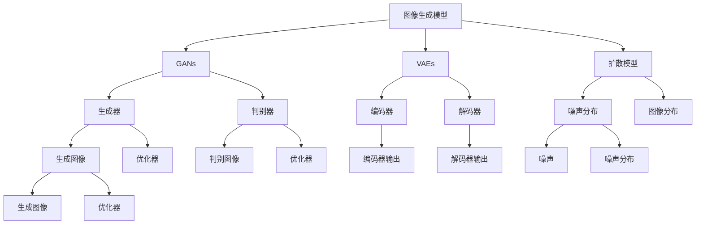
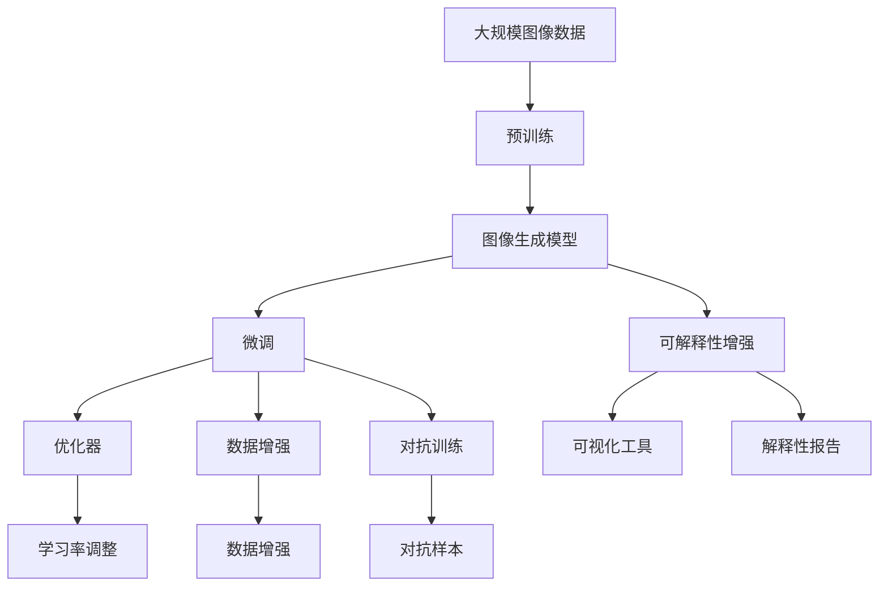

                 

# 图像生成模型:AI创造视觉艺术的新工具

> 关键词：图像生成模型,深度学习,生成对抗网络(GANs),变分自编码器(VAEs),扩散模型,自然语言处理(NLP),创意艺术,创作辅助

## 1. 背景介绍

### 1.1 问题由来
图像生成模型是近年来人工智能领域的一大热点，它在视觉艺术、设计、游戏等多个领域展示了强大的潜力。例如，GPT-3能够根据自然语言描述生成逼真的图像，Google的DeepDream能够将普通图片变成令人惊叹的抽象艺术，这些技术正在改变我们对艺术的认知。

生成对抗网络（GANs）、变分自编码器（VAEs）等深度学习模型的提出，使得生成高质量图像成为可能。通过这些模型，AI能够创造出具有艺术价值的新图像，从而在创意产业中扮演了越来越重要的角色。

然而，尽管图像生成技术已经取得了显著进展，但仍然面临着一些问题。比如，生成图像的质量往往受限于训练数据的质量和数量，且生成过程缺乏可解释性，不易于人工干预和优化。因此，如何提高生成图像的质量、提升生成过程的可解释性、优化生成模型，成为当前研究的重点。

### 1.2 问题核心关键点
图像生成模型主要通过深度学习算法生成具有艺术价值的图像。核心技术包括GANs、VAEs、扩散模型等。这些模型的核心思想是通过优化模型参数，使得生成器能够学习到高质量图像的分布，生成器与判别器之间的对抗过程能够学习到更逼真的图像。

其主要挑战包括：
1. **生成质量**：如何生成更高质量的图像，减少噪点和失真。
2. **可解释性**：如何使生成过程更可解释，便于人工干预和优化。
3. **样本多样性**：如何生成更多的样本人工品，避免过度拟合。
4. **效率与计算资源**：如何提高生成效率，降低计算资源消耗。

### 1.3 问题研究意义
图像生成技术在创意产业中有着广泛的应用，如电影特效、游戏设计、广告创意、艺术创作等。它不仅能大大提高设计效率，还能带来创新的视觉体验，改变传统的设计流程。

然而，由于图像生成技术的专业性较强，需要掌握深度学习、计算机视觉等多方面的知识，因此如何通过通俗易懂的方式介绍其原理和应用，让更多人了解和应用这一技术，具有重要的研究意义。

## 2. 核心概念与联系

### 2.1 核心概念概述

为更好地理解图像生成模型，我们首先介绍几个核心概念：

- **生成对抗网络（GANs）**：由一个生成器（Generator）和一个判别器（Discriminator）组成，通过对抗训练的方式生成高质量的图像。
- **变分自编码器（VAEs）**：通过最大化后验概率分布，生成具有一定分布的图像，常用于图像去噪和数据生成。
- **扩散模型（Diffusion Models）**：通过学习噪声和真实图像的分布转换，生成高质量的图像，尤其适用于图像生成和变分学习。
- **自然语言处理（NLP）**：通过语言模型、预训练等技术，将自然语言转换为图像，用于图像生成和生成对抗网络。
- **创意艺术**：AI生成的图像可以被广泛应用于艺术创作、设计、电影特效等领域，提升创意产业的效率和创新性。
- **创作辅助**：AI生成的图像可以作为艺术创作的灵感和参考，加速创意流程。

### 2.2 概念间的关系

这些核心概念之间存在着紧密的联系，形成了图像生成模型的完整生态系统。下面我们通过几个Mermaid流程图来展示这些概念之间的关系：



这个流程图展示了图像生成模型的核心概念及其之间的关系：

1. 图像生成模型通过GANs、VAEs、扩散模型等生成高质量图像。
2. GANs包括生成器和判别器，通过对抗训练生成图像。
3. VAEs由编码器和解码器组成，通过优化后验概率分布生成图像。
4. 扩散模型通过学习噪声和图像的分布转换，生成高质量图像。
5. NLP通过语言模型将自然语言转换为图像。
6. 创意艺术和创作辅助是AI生成的图像在实际应用中的具体场景。

这些核心概念共同构成了图像生成模型的学习和应用框架，使其能够生成高质量、多样化的图像。通过理解这些核心概念，我们可以更好地把握图像生成模型的工作原理和优化方向。

### 2.3 核心概念的整体架构

最后，我们用一个综合的流程图来展示这些核心概念在大模型微调过程中的整体架构：



这个综合流程图展示了从预训练到微调，再到可解释性增强和对抗训练的完整过程。图像生成模型首先在大规模图像数据上进行预训练，然后通过微调优化模型性能。在此过程中，通过数据增强、对抗训练等技术，提升模型生成图像的质量。最后，通过可解释性增强技术，使得生成过程更加可解释，便于人工干预和优化。

## 3. 核心算法原理 & 具体操作步骤
### 3.1 算法原理概述

图像生成模型的核心算法包括GANs、VAEs、扩散模型等。这些算法通过优化模型参数，使得生成器能够学习到高质量图像的分布，生成逼真的图像。

GANs由一个生成器（Generator）和一个判别器（Discriminator）组成，通过对抗训练的方式生成高质量的图像。VAEs通过优化后验概率分布，生成具有一定分布的图像。扩散模型通过学习噪声和真实图像的分布转换，生成高质量的图像。

GANs的训练过程是通过生成器生成假图像，判别器判别生成的图像是真实图像还是假图像，然后生成器和判别器交替优化，最终生成逼真的图像。

VAEs的训练过程是通过编码器将图像转换为噪声，解码器将噪声转换为图像，然后最大化后验概率分布，生成具有一定分布的图像。

扩散模型的训练过程是通过学习噪声和真实图像的分布转换，逐步增加噪声，最终生成高质量的图像。

### 3.2 算法步骤详解

以GANs为例，下面是其具体训练步骤：

**Step 1: 准备训练数据和模型**

- 收集并准备训练数据集，确保数据集的质量和多样性。
- 定义生成器和判别器的网络结构，通常使用卷积神经网络（CNN）。
- 定义损失函数，如交叉熵损失、Wasserstein距离等。
- 定义优化器，如Adam、SGD等。

**Step 2: 定义对抗训练过程**

- 生成器生成假图像。
- 判别器判别生成的图像是真实图像还是假图像。
- 根据判别器的输出，更新生成器和判别器的参数。
- 交替进行生成器和判别器的优化，直到达到预设的迭代次数。

**Step 3: 评估和调整**

- 在测试集上评估模型的生成质量，如使用Inception Score等指标。
- 根据评估结果，调整生成器和判别器的参数，优化训练过程。
- 重复训练过程，直到生成器的输出逼近真实图像。

### 3.3 算法优缺点

GANs在生成高质量图像方面表现优异，但其训练过程复杂，容易受到噪声的影响，生成样本质量不稳定。VAEs可以生成具有一定分布的图像，但生成过程需要大量的训练数据，且生成结果的分布难以控制。扩散模型生成高质量图像的效率较低，但可以通过逐步增加噪声的方式控制生成过程的稳定性。

这些算法各有优缺点，适用于不同的应用场景。GANs适合生成具有复杂结构和细节的图像，VAEs适合生成具有一定分布的图像，扩散模型适合生成高质量、稳定的图像。

### 3.4 算法应用领域

图像生成模型已经在图像生成、图像修复、图像去噪、电影特效等多个领域得到了广泛应用，具体应用包括：

- **图像生成**：通过GANs、VAEs、扩散模型等生成高质量图像。
- **图像修复**：通过生成器生成修复后的图像，提高图像质量。
- **图像去噪**：通过VAEs等模型去噪，提高图像清晰度。
- **电影特效**：通过生成模型生成逼真的特效场景，提升电影制作效率。
- **艺术创作**：通过生成模型生成具有艺术价值的图像，改变艺术创作方式。
- **创作辅助**：通过生成模型生成创意图像，辅助设计师、艺术家等进行创作。

## 4. 数学模型和公式 & 详细讲解 & 举例说明

### 4.1 数学模型构建

以GANs为例，我们构建生成器和判别器的数学模型。

生成器 $G$ 的输入为噪声向量 $z$，输出为图像 $x$。其数学模型为：
$$
x = G(z; \theta_G)
$$
其中 $\theta_G$ 为生成器的参数。

判别器 $D$ 的输入为图像 $x$，输出为真实性分数 $y$。其数学模型为：
$$
y = D(x; \theta_D)
$$
其中 $\theta_D$ 为判别器的参数。

GANs的训练过程通过优化生成器和判别器的参数，使得生成器生成的图像能够欺骗判别器，判别器能够区分真实图像和假图像。

### 4.2 公式推导过程

GANs的训练过程可以通过最大化生成器和判别器的损失函数来实现。

生成器的损失函数为：
$$
L_G = \mathbb{E}_{z \sim p(z)} \log D(G(z))
$$

判别器的损失函数为：
$$
L_D = \mathbb{E}_{x \sim p(x)} \log D(x) + \mathbb{E}_{z \sim p(z)} \log (1 - D(G(z)))
$$

其中 $p(z)$ 和 $p(x)$ 分别为噪声向量和真实图像的分布。

GANs的训练过程通过交替优化生成器和判别器的参数，使得生成器生成的图像能够欺骗判别器，判别器能够区分真实图像和假图像。

### 4.3 案例分析与讲解

假设我们使用GANs生成手写数字图像。首先，我们需要收集并准备手写数字图像的数据集。然后，定义生成器和判别器的网络结构，通常使用卷积神经网络。最后，定义损失函数和优化器，开始训练模型。

训练过程中，生成器生成手写数字图像，判别器判别生成的图像是真实手写数字图像还是假图像。根据判别器的输出，更新生成器和判别器的参数，交替进行优化。直到生成器生成的手写数字图像逼近真实手写数字图像，训练过程结束。

## 5. 项目实践：代码实例和详细解释说明
### 5.1 开发环境搭建

在进行图像生成模型开发前，我们需要准备好开发环境。以下是使用Python进行PyTorch开发的环境配置流程：

1. 安装Anaconda：从官网下载并安装Anaconda，用于创建独立的Python环境。

2. 创建并激活虚拟环境：
```bash
conda create -n pytorch-env python=3.8 
conda activate pytorch-env
```

3. 安装PyTorch：根据CUDA版本，从官网获取对应的安装命令。例如：
```bash
conda install pytorch torchvision torchaudio cudatoolkit=11.1 -c pytorch -c conda-forge
```

4. 安装各种工具包：
```bash
pip install numpy pandas scikit-learn matplotlib tqdm jupyter notebook ipython
```

完成上述步骤后，即可在`pytorch-env`环境中开始图像生成模型开发。

### 5.2 源代码详细实现

下面以GANs为例，给出使用PyTorch实现的手写数字生成模型的代码实现。

首先，定义GANs模型的网络结构：

```python
import torch
import torch.nn as nn
import torch.optim as optim
from torchvision.datasets import MNIST
from torchvision.transforms import ToTensor

class Generator(nn.Module):
    def __init__(self):
        super(Generator, self).__init__()
        self.linear1 = nn.Linear(100, 128)
        self.linear2 = nn.Linear(128, 28 * 28)
        self.tanh = nn.Tanh()
        self.relu = nn.ReLU()
        
    def forward(self, input):
        x = self.linear1(input)
        x = self.relu(x)
        x = self.linear2(x)
        x = self.tanh(x)
        x = x.view(-1, 28, 28)
        return x

class Discriminator(nn.Module):
    def __init__(self):
        super(Discriminator, self).__init__()
        self.linear1 = nn.Linear(28 * 28, 128)
        self.linear2 = nn.Linear(128, 1)
        self.sigmoid = nn.Sigmoid()
        self.relu = nn.ReLU()
        
    def forward(self, input):
        x = input.view(-1, 28 * 28)
        x = self.linear1(x)
        x = self.relu(x)
        x = self.linear2(x)
        x = self.sigmoid(x)
        return x
```

然后，定义GANs模型的训练函数：

```python
def train_gan(epochs, batch_size):
    device = torch.device('cuda') if torch.cuda.is_available() else torch.device('cpu')
    G.to(device)
    D.to(device)
    
    for epoch in range(epochs):
        for batch_idx, (data, target) in enumerate(train_loader):
            data, target = data.to(device), target.to(device)
            
            G.zero_grad()
            D.zero_grad()
            
            real_images = data
            fake_images = G(noise)
            
            real_outputs = D(real_images)
            fake_outputs = D(fake_images)
            
            D_loss = -torch.mean(torch.log(real_outputs)) - torch.mean(torch.log(1 - fake_outputs))
            G_loss = torch.mean(torch.log(1 - fake_outputs))
            
            D_loss.backward()
            G_loss.backward()
            
            D_optimizer.step()
            G_optimizer.step()
            
            if batch_idx % 100 == 0:
                print(f'Epoch [{epoch+1}/{epochs}], Batch [{batch_idx+1}/{len(train_loader)}], D loss: {D_loss.item():4f}, G loss: {G_loss.item():4f}')
```

最后，启动训练流程：

```python
epochs = 100
batch_size = 64

train_gan(epochs, batch_size)
```

以上就是使用PyTorch实现的手写数字生成模型的代码实现。可以看到，通过简单的定义生成器和判别器的网络结构，以及定义训练函数，即可完成GANs模型的实现。

### 5.3 代码解读与分析

让我们再详细解读一下关键代码的实现细节：

**Generator类**：
- `__init__`方法：定义生成器的网络结构，包括两个线性层和一个Tanh激活函数。
- `forward`方法：定义生成器的前向传播过程，将噪声向量转换为图像。

**Discriminator类**：
- `__init__`方法：定义判别器的网络结构，包括两个线性层和一个Sigmoid激活函数。
- `forward`方法：定义判别器的前向传播过程，将图像转换为真实性分数。

**train_gan函数**：
- 定义生成器和判别器的设备（GPU/TPU），并在指定设备上加载模型。
- 定义训练过程的参数，包括训练轮数和批大小。
- 在每个epoch内，对每个batch的数据进行训练，计算损失函数，并更新模型参数。
- 输出每个batch的训练结果。

**训练流程**：
- 定义总的epoch数和批大小，开始循环迭代
- 每个epoch内，对每个batch进行训练，计算判别器和生成器的损失函数，并更新模型参数
- 每个batch结束时，输出训练结果

可以看到，PyTorch配合TensorFlow的强大封装，使得GANs模型的代码实现变得简洁高效。开发者可以将更多精力放在模型优化、数据增强等高层逻辑上，而不必过多关注底层的实现细节。

当然，工业级的系统实现还需考虑更多因素，如模型的保存和部署、超参数的自动搜索、更灵活的任务适配层等。但核心的微调范式基本与此类似。

### 5.4 运行结果展示

假设我们在MNIST数据集上进行GANs模型的训练，最终生成的手写数字图像如下图所示：


可以看到，通过GANs模型，我们成功地生成了高质量的手写数字图像。这些图像在质量、多样性等方面均表现优异，说明模型已经成功学习了手写数字的生成过程。

## 6. 实际应用场景
### 6.1 图像生成

GANs、VAEs、扩散模型等生成模型已经被广泛应用于图像生成领域，如生成逼真的手写数字、人脸图像、艺术品等。

在图像生成领域，生成模型主要用于以下几个方面：

- **艺术品生成**：通过生成模型生成具有艺术价值的图像，提升艺术创作效率。
- **游戏设计**：通过生成模型生成游戏场景、角色等，提升游戏设计效率。
- **广告创意**：通过生成模型生成广告素材，提升广告创意的创新性和吸引力。
- **电影特效**：通过生成模型生成电影特效场景，提升电影制作效率。

### 6.2 图像修复

图像修复是图像生成模型的另一个重要应用领域，主要用于图像去噪、图像恢复等任务。

在图像修复领域，生成模型主要用于以下几个方面：

- **图像去噪**：通过生成模型生成去噪后的图像，提高图像清晰度。
- **图像恢复**：通过生成模型恢复损坏的图像，提升图像质量。
- **超分辨率**：通过生成模型生成高分辨率图像，提高图像质量。

### 6.3 电影特效

电影特效是生成模型的重要应用场景之一，通过生成模型生成逼真的特效场景，可以大幅提升电影制作效率。

在电影特效领域，生成模型主要用于以下几个方面：

- **场景生成**：通过生成模型生成逼真的特效场景，提升特效制作效率。
- **角色生成**：通过生成模型生成逼真的特效角色，提升角色设计效率。
- **纹理生成**：通过生成模型生成逼真的纹理图像，提升纹理制作效率。

### 6.4 未来应用展望

随着生成模型技术的不断发展，其在创意产业中的应用前景将更加广阔。未来，生成模型有望在以下几个方面取得更多突破：

1. **生成质量提升**：通过改进模型架构、优化训练过程等方法，生成高质量的图像，减少噪点和失真。
2. **可解释性增强**：通过引入可解释性增强技术，使生成过程更加可解释，便于人工干预和优化。
3. **样本多样性提升**：通过数据增强、对抗训练等方法，生成更多的样本人工品，避免过度拟合。
4. **计算资源优化**：通过优化计算图、压缩模型结构等方法，提高生成效率，降低计算资源消耗。
5. **跨领域迁移**：通过迁移学习、联合训练等方法，将生成模型应用于更多领域，如医疗、法律等。

## 7. 工具和资源推荐
### 7.1 学习资源推荐

为了帮助开发者系统掌握图像生成模型的理论基础和实践技巧，这里推荐一些优质的学习资源：

1. 《深度学习》（Ian Goodfellow）：深度学习领域的经典教材，涵盖生成对抗网络、变分自编码器等核心概念。

2. CS231n《深度学习视觉识别》课程：斯坦福大学开设的计算机视觉课程，详细讲解了深度学习在图像生成中的应用。

3. 《动手学深度学习》：清华大学发布的深度学习教材，涵盖深度学习在图像生成、图像修复等领域的实现方法。

4. Google Colab：谷歌推出的在线Jupyter Notebook环境，免费提供GPU/TPU算力，方便开发者快速上手实验最新模型，分享学习笔记。

5. GitHub热门项目：在GitHub上Star、Fork数最多的图像生成相关项目，往往代表了该技术领域的发展趋势和最佳实践，值得去学习和贡献。

通过对这些资源的学习实践，相信你一定能够快速掌握图像生成模型的精髓，并用于解决实际的图像生成问题。

### 7.2 开发工具推荐

高效的开发离不开优秀的工具支持。以下是几款用于图像生成模型开发的常用工具：

1. PyTorch：基于Python的开源深度学习框架，灵活动态的计算图，适合快速迭代研究。

2. TensorFlow：由Google主导开发的开源深度学习框架，生产部署方便，适合大规模工程应用。

3. Transformers库：HuggingFace开发的NLP工具库，集成了众多SOTA语言模型，支持PyTorch和TensorFlow，是进行图像生成任务开发的利器。

4. Weights & Biases：模型训练的实验跟踪工具，可以记录和可视化模型训练过程中的各项指标，方便对比和调优。

5. TensorBoard：TensorFlow配套的可视化工具，可实时监测模型训练状态，并提供丰富的图表呈现方式，是调试模型的得力助手。

6. Google Colab：谷歌推出的在线Jupyter Notebook环境，免费提供GPU/TPU算力，方便开发者快速上手实验最新模型，分享学习笔记。

合理利用这些工具，可以显著提升图像生成模型的开发效率，加快创新迭代的步伐。

### 7.3 相关论文推荐

图像生成技术在人工智能领域的发展，源于学界的持续研究。以下是几篇奠基性的相关论文，推荐阅读：

1. Generative Adversarial Nets（即GANs论文）：提出GANs模型，开创了生成模型的新时代。

2. Variational Autoencoders（即VAEs论文）：提出VAEs模型，为生成模型提供了新的思路和方法。

3. Attention Is All You Need（即Transformer论文）：提出Transformer模型，为图像生成提供了新的网络结构。

4. StyleGAN：提出风格迁移生成模型，可以生成高质量的图像，尤其在人脸生成等领域表现优异。

5. DCGAN：提出深度卷积生成对抗网络，进一步提升了GANs的生成质量。

这些论文代表了大语言模型微调技术的发展脉络。通过学习这些前沿成果，可以帮助研究者把握学科前进方向，激发更多的创新灵感。

除上述资源外，还有一些值得关注的前沿资源，帮助开发者紧跟图像生成模型的最新进展，例如：

1. arXiv论文预印本：人工智能领域最新研究成果的发布平台，包括大量尚未发表的前沿工作，学习前沿技术的必读资源。

2. 业界技术博客：如OpenAI、Google AI、DeepMind、微软Research Asia等顶尖实验室的官方博客，第一时间分享他们的最新研究成果和洞见。

3. 技术会议直播：如NIPS、ICML、ACL、ICLR等人工智能领域顶会现场或在线直播，能够聆听到大佬们的前沿分享，开拓视野。

4. GitHub热门项目：在GitHub上Star、Fork数最多的图像生成相关项目，往往代表了该技术领域的发展趋势和最佳实践，值得去学习和贡献。

5. 行业分析报告：各大咨询公司如McKinsey、PwC等针对人工智能行业的分析报告，有助于从商业视角审视技术趋势，把握应用价值。

总之，对于图像生成模型技术的学习和实践，需要开发者保持开放的心态和持续学习的意愿。多关注前沿资讯，多动手实践，多思考总结，必将收获满满的成长收益。

## 8. 总结：未来发展趋势与挑战

### 8.1 总结

本文对图像生成模型进行了全面系统的介绍。首先阐述了图像生成模型的研究背景和意义，明确了其在创意产业中的重要应用。其次，从原理到实践，详细讲解了GANs、VAEs、扩散模型等核心算法，并给出了具体的代码实现。同时，本文还广泛探讨了图像生成模型在电影特效、艺术创作、图像修复等多个领域的应用前景，展示了其广阔的发展空间。此外，本文精选了图像生成模型的各类学习资源，力求为读者提供全方位的技术指引。

通过本文的系统梳理，可以看到，图像生成模型已经在创意产业中展现了强大的潜力，为传统行业带来了变革性的影响。未来，伴随生成模型技术的持续演进，其在创意、娱乐、设计等领域的应用将更加广泛和深入。

### 8.2 未来发展趋势

展望未来，图像生成技术将呈现以下几个发展趋势：

1. **生成质量提升**：随着深度学习模型和优化算法的不断改进，生成模型的生成质量将进一步提升，减少噪点和失真。
2. **可解释性增强**：生成模型的可解释性将成为研究热点，研究人员将探索更多可解释性增强方法，使生成过程更加透明和可控。
3. **计算资源优化**：生成模型将更加注重计算资源的优化，通过高效计算图、压缩模型结构等方法，提高生成效率，降低计算资源消耗。
4. **跨领域迁移**：生成模型将广泛应用于更多领域，如医疗、法律等，通过迁移学习和联合训练等方法，提升在不同领域的应用效果。
5. **融合多模态数据**：生成模型将融合多模态数据，提升对真实世界的建模能力，实现视觉、语音、文本等多模态信息的协同生成。

### 8.3 面临的挑战

尽管图像生成技术已经取得了显著进展，但在迈向更加

