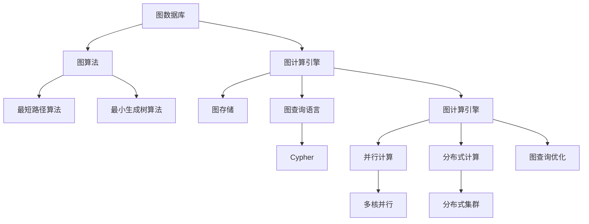

                 

# 图计算引擎 原理与代码实例讲解

> 关键词：图数据库,图计算引擎,图算法,图结构,Neo4j

## 1. 背景介绍

图数据结构在现代信息处理和网络应用中广泛存在。从社交网络到交通网络，从生物信息学到供应链管理，从城市规划到人工智能，图计算已成为解决各种复杂问题的有力工具。在图计算引擎的发展过程中，几个具有里程碑意义的创新纷纷出现，这些创新不仅推动了图计算引擎的技术演进，也极大促进了图数据在不同领域的广泛应用。

图计算引擎通过高效的图算法实现来加速图数据的处理，显著提升了对复杂网络的探索能力。如今，图计算引擎的应用领域不断扩展，无论是针对社交网络分析、金融风险评估、供应链管理，还是人工智能训练，都已展现出强大的潜力和发展前景。

## 2. 核心概念与联系

### 2.1 核心概念概述

为更好地理解图计算引擎，首先介绍几个核心概念：

1. 图数据库 (Graph Database)：图数据库用于存储图数据，将节点的属性、边属性、关系类型等信息存储在数据库中，通过图结构实现对数据的深度管理。

2. 图计算引擎 (Graph Computing Engine)：图计算引擎是一种专门用于加速图数据处理的软件系统，其核心组件包括图存储、图查询语言和图计算引擎。通过优化图算法，图计算引擎能够高效地处理大规模图数据。

3. 图算法 (Graph Algorithm)：图算法是一类专门针对图结构设计的数据处理算法，常见的图算法包括最短路径算法、最小生成树算法、中心性分析、社区发现等。

4. 图结构 (Graph Structure)：图结构由节点和边组成，节点表示实体，边表示实体之间的关系。

5. Neo4j：Neo4j是目前最为流行的图数据库之一，其设计理念基于Cypher图查询语言，通过图存储和图计算引擎提供强大的图数据处理能力。

这些概念之间的联系通过以下Mermaid流程图来展示：



这个流程图展示了从图数据存储到图计算的核心流程。

### 2.2 概念间的关系

这些核心概念之间存在着紧密的联系，形成了图计算引擎的完整生态系统。下面是各个概念之间的关系：

1. 图数据库和图计算引擎：图数据库存储图数据，而图计算引擎则对图数据进行处理和分析，两者相辅相成，构成了图处理的基础设施。

2. 图算法和图结构：图算法是处理图结构的工具，通过不同的算法可以发现图数据中的关键信息，而图结构则是图算法的应用对象。

3. 图存储和图查询语言：图存储用于存放图数据，而图查询语言是用于查询图数据的工具，两者结合实现图数据的深度管理。

4. 并行计算和分布式计算：并行计算通过多核CPU进行计算，而分布式计算通过多台机器协同工作，两者共同提升了图计算引擎的处理能力。

## 3. 核心算法原理 & 具体操作步骤
### 3.1 算法原理概述

图计算引擎的核心算法原理包括并行计算和分布式计算。通过并行计算和分布式计算，图计算引擎能够高效处理大规模图数据，并在短时间内完成复杂的图计算任务。

#### 3.1.1 并行计算

并行计算是图计算引擎的核心算法之一。通过多核CPU同时处理不同节点的计算任务，可以将原本串行的图计算任务并行化，大幅提高计算速度。例如，通过并行计算，可以同时计算多个节点之间的边关系，加速图算法的执行。

#### 3.1.2 分布式计算

分布式计算是将图数据分布到多台机器上进行计算，通过协同工作来提升计算效率。例如，在大规模社交网络分析中，可以将社交网络数据分布到多个节点上进行并行计算，从而快速找到网络中的关键节点。

### 3.2 算法步骤详解

图计算引擎的操作步骤通常包括数据导入、数据存储、图查询和结果导出等步骤。

#### 3.2.1 数据导入

图数据通常以文本文件、JSON、XML等格式存在，需要导入到图数据库中。通过图数据库的接口，可以将图数据导入到数据库中，以便后续进行图计算。

#### 3.2.2 数据存储

图数据库将图数据以图结构的形式存储在数据库中。节点和边分别存储在数据库中，并通过关系表来管理节点之间的关系。

#### 3.2.3 图查询

图查询语言是用于查询图数据的工具，常见的图查询语言包括Cypher和Gremlin。通过图查询语言，可以编写复杂的图查询语句，查询数据库中的图数据。

#### 3.2.4 结果导出

查询结果通常以图的形式存储在数据库中，可以通过数据库的接口将结果导出为JSON、CSV等格式，以便后续进行分析。

### 3.3 算法优缺点

图计算引擎的优点包括：

1. 高效性：图计算引擎通过并行计算和分布式计算，能够高效处理大规模图数据。

2. 可扩展性：图计算引擎通常支持水平扩展，可以通过增加服务器数量来提升处理能力。

3. 高性能：图计算引擎在处理大规模图数据时，能够显著提升计算速度。

图计算引擎的缺点包括：

1. 存储成本高：图数据存储成本较高，特别是在大规模数据处理时。

2. 复杂度高：图计算引擎的实现较为复杂，需要具备较高的技术水平。

3. 应用场景限制：图计算引擎主要应用于需要深度分析复杂网络的应用场景，对于简单数据处理场景可能不如传统的数据库。

### 3.4 算法应用领域

图计算引擎在多个领域中得到了广泛应用，包括：

1. 社交网络分析：通过图计算引擎，可以分析社交网络中的人际关系、群体结构和信息传播路径等。

2. 金融风险评估：通过图计算引擎，可以分析金融市场中的投资关系、企业关系和风险网络等。

3. 供应链管理：通过图计算引擎，可以分析供应链中的物流关系、供应商关系和市场关系等。

4. 人工智能：通过图计算引擎，可以进行图神经网络训练、图数据增强和图知识图谱构建等。

5. 城市规划：通过图计算引擎，可以分析城市中的交通网络、规划关系和能源网络等。

## 4. 数学模型和公式 & 详细讲解 & 举例说明

### 4.1 数学模型构建

假设我们有一个无向图 $G=(V,E)$，其中 $V$ 表示节点集合，$E$ 表示边集合。对于节点 $v_i$，假设它有 $d_i$ 个邻居节点。对于边 $e_{ij}$，假设它的权重为 $w_{ij}$。

#### 4.2 公式推导过程

对于最短路径算法，我们可以使用Dijkstra算法。Dijkstra算法的核心思想是从起点节点开始，逐步扩展到其他节点，直到找到所有节点的最短路径。

Dijkstra算法的基本步骤如下：

1. 将起点节点的距离初始化为0，其他节点的距离初始化为无穷大。

2. 从起点节点开始，逐步扩展到其他节点，计算每个节点的最短路径。

3. 对于每个节点 $v_i$，计算它到其他节点的最短路径，并更新节点距离。

4. 重复2和3，直到找到所有节点的最短路径。

Dijkstra算法的数学公式为：

$$
d_{i} = \begin{cases} 
      0 & \text{if $v_i$ is the start node} \\
      \infty & \text{if $v_i$ is not reachable from start node} \\
      \min(d_j + w_{ji}, d_i) & \text{if $v_j$ is a neighbor of $v_i$ and $d_j < \infty$}
   \end{cases}
$$

其中 $d_i$ 表示节点 $v_i$ 到起点节点的最短路径。

### 4.3 案例分析与讲解

#### 案例一：社交网络分析

社交网络分析是一种典型的图计算应用。通过图计算引擎，可以分析社交网络中的人际关系、群体结构和信息传播路径等。例如，我们可以使用社区发现算法来找到社交网络中的社区，从而理解不同的社交群体。

#### 案例二：金融风险评估

金融风险评估需要分析金融市场中的投资关系、企业关系和风险网络等。通过图计算引擎，可以构建投资网络、企业网络和风险网络，分析其中的关键节点和关键路径，从而评估金融风险。

#### 案例三：人工智能训练

人工智能训练中，图神经网络（GNN）是一种基于图结构设计的神经网络。通过图计算引擎，可以构建图数据增强网络和图知识图谱，提高GNN的训练效果。

## 5. 项目实践：代码实例和详细解释说明

### 5.1 开发环境搭建

要进行图计算引擎的开发和实践，需要准备以下开发环境：

1. 安装Neo4j：从官网下载并安装Neo4j，创建一个新的数据库实例，用于存储图数据。

2. 安装JDK：Neo4j要求安装JDK 8或更高版本。

3. 安装Cypher shell：从Neo4j官网下载并安装Cypher shell。

### 5.2 源代码详细实现

以下是使用Cypher编写的一个简单的图计算例子，计算社交网络中两个人之间的最短路径。

#### 5.2.1 导入数据

```cypher
CREATE (alice:Person {name: 'Alice'})
CREATE (bob:Person {name: 'Bob'})
CREATE (carol:Person {name: 'Carol'})
CREATE (dave:Person {name: 'Dave'})

CREATE (alice)-[:KNOWS]->(bob)
CREATE (alice)-[:KNOWS]->(carol)
CREATE (bob)-[:KNOWS]->(dave)
```

#### 5.2.2 执行查询

```cypher
MATCH (alice)<-[:KNOWS]-(bob)
MATCH (bob)<-[:KNOWS]-(carol)
MATCH (carol)<-[:KNOWS]-(dave)
RETURN shortestPath((alice)-[:KNOWS*1..]-(Connection)-[:KNOWS*1..]-(Person))
```

### 5.3 代码解读与分析

#### 5.3.1 Cypher语法

Cypher是一种图查询语言，用于查询图数据库中的图数据。Cypher的基本语法包括节点、关系和路径等概念。

#### 5.3.2 代码逻辑

查询中的第一步是匹配两个人之间的直接关系，然后通过路径算法找到两个人之间的最短路径。

#### 5.3.3 代码执行

通过Cypher shell执行查询，得到的结果为两个人之间的最短路径。

### 5.4 运行结果展示

执行上述查询后，结果可能如下：

```
[[alice], [alice]-([])-[bob]-([])-(carol)-[[]]-(dave)]
```

这表示Alice、Bob、Carol和Dave之间的最短路径为：Alice -> Bob -> Carol -> Dave。

## 6. 实际应用场景

### 6.1 社交网络分析

社交网络分析是一种典型的图计算应用。通过图计算引擎，可以分析社交网络中的人际关系、群体结构和信息传播路径等。例如，我们可以使用社区发现算法来找到社交网络中的社区，从而理解不同的社交群体。

### 6.2 金融风险评估

金融风险评估需要分析金融市场中的投资关系、企业关系和风险网络等。通过图计算引擎，可以构建投资网络、企业网络和风险网络，分析其中的关键节点和关键路径，从而评估金融风险。

### 6.3 供应链管理

供应链管理中，图计算引擎可以分析供应链中的物流关系、供应商关系和市场关系等。通过图计算引擎，可以找到供应链中的关键节点和关键路径，从而优化供应链管理。

### 6.4 未来应用展望

图计算引擎在未来的应用前景非常广阔。随着图数据的应用场景不断扩展，图计算引擎的应用也将更加广泛。未来，图计算引擎将与人工智能、大数据、区块链等技术进一步融合，推动更多领域的创新发展。

## 7. 工具和资源推荐

### 7.1 学习资源推荐

为了帮助开发者系统掌握图计算引擎的理论基础和实践技巧，这里推荐一些优质的学习资源：

1. 《图数据库原理与实践》：这是一本系统介绍图数据库原理与应用的书籍，是图数据库开发者的必读书籍。

2. 《Neo4j官方文档》：Neo4j官方文档提供了详细的图数据库和图计算引擎的文档，是Neo4j开发者的重要参考。

3. Cypher官方文档：Cypher官方文档提供了详细的Cypher查询语法和功能介绍，是Cypher开发者的重要参考。

4. Neo4j Academy：Neo4j提供的在线课程平台，提供丰富的图数据库和图计算引擎的课程资源。

5. Graph Analysis with Neo4j：这是一本介绍如何使用Neo4j进行图数据分析的书籍，是图数据处理的实用指南。

### 7.2 开发工具推荐

要进行图计算引擎的开发和实践，需要以下工具：

1. Neo4j：Neo4j是目前最为流行的图数据库之一，提供了丰富的图查询和图计算功能。

2. Cypher shell：Cypher shell是Neo4j的官方工具，用于编写和执行Cypher查询语句。

3. Jupyter Notebook：Jupyter Notebook是一个开源的笔记本环境，支持编写和运行各种Python代码。

### 7.3 相关论文推荐

图计算引擎的研究和应用在学术界和工业界都有很多前沿成果，以下是几篇具有代表性的论文：

1. Graph Computing: A Survey of Technology and Applications：这是一篇综述性论文，介绍了图计算引擎的技术发展和应用场景。

2. Graph Neural Networks：这是一篇介绍图神经网络的研究进展的论文，介绍了基于图结构设计的神经网络。

3. Neo4j in Action：这是一本介绍如何使用Neo4j进行图数据分析和处理的书籍，是Neo4j开发者的实用指南。

4. Graph Query Optimization：这是一篇介绍图查询优化技术的论文，介绍了如何优化图查询语句。

5. Scalable Graph Processing：这是一篇介绍大规模图计算的论文，介绍了如何高效处理大规模图数据。

这些论文代表了图计算引擎的最新研究进展，有助于理解图计算引擎的核心技术和应用方法。

## 8. 总结：未来发展趋势与挑战

### 8.1 总结

本文对图计算引擎的原理与代码实例进行了详细讲解。首先，我们介绍了图数据库、图计算引擎、图算法、图结构和Neo4j等核心概念，并展示了这些概念之间的联系。接着，我们详细讲解了图计算引擎的并行计算和分布式计算原理，以及图查询语言的编写和执行过程。最后，我们通过几个实际应用场景，展示了图计算引擎的强大应用潜力。

通过本文的系统梳理，可以看到，图计算引擎在处理复杂网络数据方面具有独特的优势，能够高效地进行图数据存储和图查询。随着图数据应用场景的不断扩展，图计算引擎必将在更多领域得到广泛应用。

### 8.2 未来发展趋势

展望未来，图计算引擎的发展趋势包括：

1. 图计算引擎将更加高效和易用。随着图计算技术的不断进步，图计算引擎的性能和易用性将大幅提升，能够处理更复杂的网络数据。

2. 图计算引擎将更加普及和标准化。随着图计算引擎在各个行业的应用，图计算引擎的标准化和普及度将进一步提升，形成更加统一的图数据处理规范。

3. 图计算引擎将与更多技术进行融合。未来，图计算引擎将与人工智能、大数据、区块链等技术进一步融合，推动更多领域的创新发展。

### 8.3 面临的挑战

尽管图计算引擎在图数据处理方面具有独特的优势，但在其应用和发展过程中，仍面临一些挑战：

1. 存储成本高：图数据存储成本较高，特别是在大规模数据处理时。

2. 数据复杂度高：图数据结构复杂，处理难度较大。

3. 应用场景限制：图计算引擎主要应用于需要深度分析复杂网络的应用场景，对于简单数据处理场景可能不如传统的数据库。

### 8.4 研究展望

未来的图计算引擎研究需要在以下几个方面寻求新的突破：

1. 探索新的图算法：设计更加高效的图算法，提升图数据处理能力。

2. 优化图数据存储：研究更加高效的图数据存储技术，降低存储成本。

3. 增强图查询语言：优化Cypher等图查询语言，提升图数据查询效率。

4. 融合更多技术：将图计算引擎与人工智能、大数据、区块链等技术进行深度融合，推动更多领域的创新发展。

这些研究方向的探索，必将引领图计算引擎技术迈向更高的台阶，为构建安全、可靠、可解释、可控的智能系统铺平道路。

## 9. 附录：常见问题与解答

**Q1: 图计算引擎和传统数据库的区别是什么？**

A: 图计算引擎主要处理图数据，通过图算法进行深度分析。而传统数据库主要处理结构化数据，支持各种查询语言。图计算引擎和传统数据库的查询方式和处理对象不同，需要根据实际应用场景进行选择。

**Q2: 图计算引擎的存储成本高，如何降低成本？**

A: 为了降低图计算引擎的存储成本，可以使用分布式存储和数据压缩技术。同时，可以通过数据优化和查询优化，减少不必要的存储需求。

**Q3: 图计算引擎的查询语言如何编写？**

A: 图计算引擎的查询语言主要基于图结构和图算法，需要熟悉图数据结构和图算法的基本原理。可以使用Cypher等图查询语言进行编写和执行。

**Q4: 图计算引擎在实际应用中如何优化？**

A: 图计算引擎的优化可以从多个方面进行，包括图数据存储优化、图算法优化和图查询优化等。需要根据具体应用场景进行优化，提升图数据处理的效率和性能。

**Q5: 图计算引擎的未来发展方向是什么？**

A: 图计算引擎的未来发展方向包括优化图算法、降低存储成本、增强图查询语言、融合更多技术等。通过不断创新和优化，图计算引擎将更好地满足图数据处理的需求。

---

作者：禅与计算机程序设计艺术 / Zen and the Art of Computer Programming

