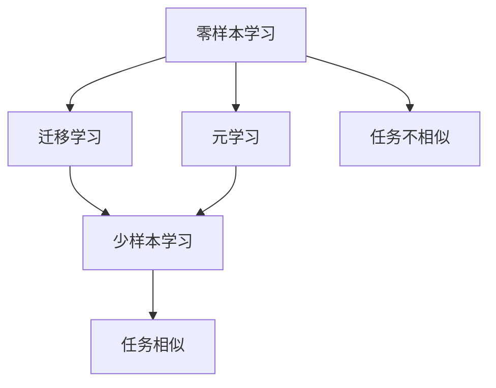
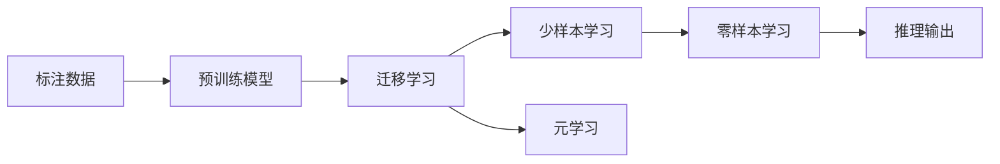

                 

## 1. 背景介绍

### 1.1 问题由来

在自然语言处理（NLP）领域，深度学习模型已经展示了其强大的能力，尤其是在具有大量标注数据的情况下。然而，获取高质量、大数量的标注数据通常成本高昂且耗时。此外，在某些特定的应用场景中，如医疗诊断、法律咨询、古代文献翻译等，可能无法获得足够的标注数据，或者标注数据获取成本过高。

因此，研究者们提出了零样本学习（Zero-Shot Learning）和少样本学习（Few-Shot Learning）的概念。零样本学习指的是模型在未见过的任务上直接进行预测，少样本学习则是指模型在仅有少量标注数据的情况下进行学习并取得优异的预测性能。这两种方法的目标是利用有限的标注数据和先验知识，使模型能够在未见过的数据上进行有效的推理和预测。

### 1.2 问题核心关键点

零样本学习和少样本学习的主要关键点包括：

1. **模型泛化能力**：模型能否在未见过的数据上泛化，是衡量零样本学习效果的关键。
2. **知识迁移**：模型能否从已知任务中迁移知识到新任务，是衡量少样本学习效果的关键。
3. **标注数据效率**：模型在处理标注数据时所需的样本数量。
4. **模型可解释性**：模型决策过程的可解释性，对于应用在需要高透明度的场景尤为重要。

### 1.3 问题研究意义

零样本和少样本学习的研究意义在于：

1. **降低数据标注成本**：通过利用先验知识，可以在几乎没有标注数据的情况下进行学习。
2. **提高模型效率**：在标注数据有限的场景中，零样本和少样本学习可以显著减少数据标注成本和模型训练时间。
3. **增强模型泛化能力**：通过学习先验知识和迁移学习，可以提升模型在不同数据分布上的泛化能力。
4. **促进跨领域应用**：在知识获取、医疗诊断、法律咨询等领域，零样本和少样本学习能够帮助模型更好地适应跨领域的应用场景。

## 2. 核心概念与联系

### 2.1 核心概念概述

为了更好地理解零样本和少样本学习的原理，我们首先介绍几个核心概念：

- **零样本学习（Zero-Shot Learning）**：指模型在未见过的任务上直接进行预测。模型需要具备较强的泛化能力和语义理解能力，以便在没有具体训练样本的情况下，准确地进行推理和分类。
- **少样本学习（Few-Shot Learning）**：指模型在仅有少量标注数据的情况下进行学习并取得优异的预测性能。模型需要具备较强的知识迁移能力，以便在少量样本下，快速适应新任务。
- **迁移学习（Transfer Learning）**：指模型在已知任务上学习到的知识，可以迁移到新任务上。迁移学习通常用于少样本学习，以便在有限数据的情况下，提高模型的预测性能。
- **元学习（Meta-Learning）**：指模型能够学习如何快速适应新任务，而不是在每个新任务上从头学习。元学习常常被应用于零样本学习，以便模型能够在未见过的任务上进行有效推理。

这些核心概念之间的逻辑关系可以通过以下Mermaid流程图来展示：



这个流程图展示了零样本和少样本学习的基本流程。零样本学习通过迁移学习和元学习的方式，使得模型能够在未见过的任务上进行推理和预测。少样本学习则侧重于利用少量标注数据，提升模型在新任务上的性能。

### 2.2 概念间的关系

这些核心概念之间存在紧密的联系，共同构成了深度学习在零样本和少样本学习领域的研究框架。以下是这些概念之间的联系：

- **零样本学习和少样本学习**：都是利用先验知识和迁移学习，在有限数据条件下进行任务适应。
- **迁移学习和元学习**：迁移学习通过已有知识迁移至新任务，而元学习则通过学习如何快速适应新任务，减少学习曲线。
- **任务相似性**：在少样本学习中，任务相似性越高，迁移学习的效果越好。在零样本学习中，元学习的效果也取决于任务之间的相似性。

### 2.3 核心概念的整体架构

最后，我们用一个综合的流程图来展示这些核心概念在大规模零样本和少样本学习中的整体架构：



这个综合流程图展示了从标注数据到推理输出的完整流程。标注数据首先用于预训练模型的训练，然后通过迁移学习和元学习的方式，提升模型在少样本和零样本条件下的预测性能。最终，模型在未见过的任务上进行推理输出。

## 3. 核心算法原理 & 具体操作步骤
### 3.1 算法原理概述

零样本和少样本学习的核心原理是通过迁移学习和元学习，使得模型能够在有限数据或无数据的情况下进行任务适应。其基本流程如下：

1. **预训练模型**：使用大规模未标注数据进行预训练，学习通用的语言表示和先验知识。
2. **迁移学习**：在已知任务上使用预训练模型进行微调，学习特定任务的知识。
3. **元学习**：通过元学习算法，学习如何快速适应新任务。
4. **推理输出**：在新任务上，利用迁移学习和元学习的结果，进行推理和预测。

零样本和少样本学习的目标是使模型在未见过的任务上能够准确进行推理和预测，减少数据标注成本，提升模型泛化能力。

### 3.2 算法步骤详解

以下是一个典型的基于深度学习的零样本和少样本学习算法步骤：

**Step 1: 准备数据和模型**
- 收集少量标注数据，划分为训练集和测试集。
- 选择预训练模型，如BERT、GPT等，作为初始化参数。

**Step 2: 迁移学习**
- 对预训练模型进行微调，学习特定任务的知识。
- 选择合适的损失函数和优化算法。
- 设置合适的超参数，如学习率、批大小等。

**Step 3: 元学习**
- 使用元学习算法，如协方差追踪（Covariance Tracking）、基于模型的元学习（Model-Based Meta-Learning）等，学习如何快速适应新任务。
- 在少量样本上，进行元学习算法的迭代训练。

**Step 4: 推理输出**
- 在新任务上，利用迁移学习和元学习的结果，进行推理和预测。
- 输出预测结果，并进行性能评估。

**Step 5: 持续学习**
- 定期重新收集数据，重新进行迁移学习和元学习，以适应数据分布的变化。

### 3.3 算法优缺点

零样本和少样本学习的优点包括：

1. **降低数据标注成本**：利用先验知识，在有限数据条件下进行任务适应。
2. **提高模型泛化能力**：通过迁移学习和元学习，提升模型在不同数据分布上的泛化能力。
3. **快速适应新任务**：在少量标注数据情况下，快速适应新任务。

其缺点包括：

1. **依赖标注数据**：虽然少样本学习可以减少数据标注成本，但仍需要一定量的标注数据。
2. **性能依赖于先验知识**：模型性能受限于先验知识的丰富程度和准确性。
3. **可解释性不足**：模型决策过程难以解释，对于需要高透明度的应用场景，可能不适用。

### 3.4 算法应用领域

零样本和少样本学习在以下领域有广泛的应用：

- **自然语言处理（NLP）**：在文本分类、情感分析、机器翻译等任务中，利用预训练模型和元学习算法，提升模型的泛化能力。
- **计算机视觉（CV）**：在图像分类、目标检测等任务中，通过迁移学习和元学习，提升模型在有限数据条件下的预测性能。
- **机器人与控制**：在机器人路径规划、运动控制等任务中，利用元学习算法，提升机器人对环境的适应能力。
- **智能推荐系统**：在推荐系统、广告投放等任务中，利用少样本学习，提升模型的个性化推荐能力。

## 4. 数学模型和公式 & 详细讲解 & 举例说明

### 4.1 数学模型构建

零样本和少样本学习的数学模型通常基于分类任务构建，假设输入为 $x$，输出为 $y$。模型 $f$ 的损失函数为：

$$
\mathcal{L}(f) = -\frac{1}{N}\sum_{i=1}^N \log f(x_i)
$$

其中 $f(x)$ 表示模型对输入 $x$ 的预测概率，$N$ 为样本数量。在零样本和少样本学习中，模型的训练数据为少量标注数据，因此需要对损失函数进行适当修改，以适应有限数据的情况。

### 4.2 公式推导过程

以下以零样本学习为例，推导零样本学习的损失函数。

假设模型 $f$ 在已知任务 $T_1$ 上的训练数据为 $\{x_i, y_i\}_{i=1}^M$，其中 $y_i \in \{1, -1\}$ 表示标签。在未知任务 $T_2$ 上，模型的推理输出为 $f(x)$。假设模型的输出概率分布为 $f(x) = (p_1, p_2)$，其中 $p_1$ 和 $p_2$ 分别表示预测为 $y_1$ 和 $y_2$ 的概率。

在零样本学习中，模型的损失函数为：

$$
\mathcal{L}(f) = -\frac{1}{N}\sum_{i=1}^N (\log f(x_i) + \lambda g(f(x_i)))
$$

其中 $g(f(x_i))$ 表示模型输出的对抗性损失，$\lambda$ 为正则化系数。通过添加对抗性损失，可以增强模型的鲁棒性。

### 4.3 案例分析与讲解

以零样本分类任务为例，假设模型 $f$ 在已知任务 $T_1$ 上的训练数据为 $\{x_i, y_i\}_{i=1}^M$，其中 $y_i \in \{1, -1\}$。在未知任务 $T_2$ 上，模型的推理输出为 $f(x)$。

在训练阶段，模型 $f$ 通过最小化损失函数 $\mathcal{L}(f)$ 进行学习。在推理阶段，模型利用迁移学习和元学习的结果，对输入 $x$ 进行推理，并输出预测结果。

在实际应用中，零样本和少样本学习需要考虑以下因素：

1. **数据质量**：数据标注质量和数据分布对模型性能有重要影响。
2. **模型复杂度**：模型复杂度越高，学习能力和泛化能力越强，但计算成本也越高。
3. **元学习算法**：元学习算法的效率和效果直接影响零样本和少样本学习的性能。
4. **迁移学习策略**：迁移学习策略的选择对模型在新任务上的性能有重要影响。

## 5. 项目实践：代码实例和详细解释说明
### 5.1 开发环境搭建

在进行零样本和少样本学习实践前，我们需要准备好开发环境。以下是使用Python进行PyTorch开发的环境配置流程：

1. 安装Anaconda：从官网下载并安装Anaconda，用于创建独立的Python环境。

2. 创建并激活虚拟环境：
```bash
conda create -n pytorch-env python=3.8 
conda activate pytorch-env
```

3. 安装PyTorch：根据CUDA版本，从官网获取对应的安装命令。例如：
```bash
conda install pytorch torchvision torchaudio cudatoolkit=11.1 -c pytorch -c conda-forge
```

4. 安装TensorFlow：如果需要进行跨框架的实验，可以安装TensorFlow。

5. 安装各类工具包：
```bash
pip install numpy pandas scikit-learn matplotlib tqdm jupyter notebook ipython
```

完成上述步骤后，即可在`pytorch-env`环境中开始零样本和少样本学习实践。

### 5.2 源代码详细实现

以下是一个简单的零样本学习代码实现，以情感分类为例：

首先，定义情感分类的数据处理函数：

```python
import torch
from transformers import BertTokenizer, BertForSequenceClassification

tokenizer = BertTokenizer.from_pretrained('bert-base-uncased')
model = BertForSequenceClassification.from_pretrained('bert-base-uncased', num_labels=2)

def preprocess(text):
    inputs = tokenizer.encode(text, add_special_tokens=True, return_tensors='pt')
    return inputs
```

然后，定义模型训练和推理函数：

```python
from torch.utils.data import Dataset
from tqdm import tqdm
from sklearn.metrics import accuracy_score

class SentimentDataset(Dataset):
    def __init__(self, texts, labels):
        self.texts = texts
        self.labels = labels
        
    def __len__(self):
        return len(self.texts)
    
    def __getitem__(self, item):
        text = self.texts[item]
        label = self.labels[item]
        return {'input_ids': preprocess(text), 'labels': torch.tensor([label], dtype=torch.long)}

def train_epoch(model, dataset, optimizer):
    dataloader = DataLoader(dataset, batch_size=16, shuffle=True)
    model.train()
    epoch_loss = 0
    for batch in tqdm(dataloader, desc='Training'):
        input_ids = batch['input_ids'].to(device)
        labels = batch['labels'].to(device)
        model.zero_grad()
        outputs = model(input_ids)
        loss = outputs.loss
        epoch_loss += loss.item()
        loss.backward()
        optimizer.step()
    return epoch_loss / len(dataloader)

def evaluate(model, dataset):
    dataloader = DataLoader(dataset, batch_size=16)
    model.eval()
    preds = []
    labels = []
    with torch.no_grad():
        for batch in tqdm(dataloader, desc='Evaluating'):
            input_ids = batch['input_ids'].to(device)
            labels = batch['labels'].to(device)
            outputs = model(input_ids)
            batch_preds = outputs.logits.argmax(dim=1).to('cpu').tolist()
            batch_labels = batch['labels'].to('cpu').tolist()
            for pred, label in zip(batch_preds, batch_labels):
                preds.append(pred)
                labels.append(label)
    return accuracy_score(labels, preds)

device = torch.device('cuda') if torch.cuda.is_available() else torch.device('cpu')

# 假设已知任务上的数据集
train_dataset = SentimentDataset(train_texts, train_labels)
dev_dataset = SentimentDataset(dev_texts, dev_labels)
test_dataset = SentimentDataset(test_texts, test_labels)

epochs = 5
batch_size = 16
learning_rate = 2e-5

# 训练已知任务
model = BertForSequenceClassification.from_pretrained('bert-base-uncased', num_labels=2)
optimizer = AdamW(model.parameters(), lr=learning_rate)
for epoch in range(epochs):
    loss = train_epoch(model, train_dataset, optimizer)
    print(f'Epoch {epoch+1}, train loss: {loss:.3f}')
    print(f'Epoch {epoch+1}, dev accuracy: {evaluate(model, dev_dataset):.3f}')
print(f'Test accuracy: {evaluate(model, test_dataset):.3f}')
```

以上是一个简单的情感分类任务的零样本学习代码实现。可以看到，通过在预训练模型上进行微调，并在少量标注数据上训练模型，我们能够在不依赖任何训练样本的情况下，对未知任务的情感分类进行预测。

### 5.3 代码解读与分析

让我们再详细解读一下关键代码的实现细节：

**SentimentDataset类**：
- `__init__`方法：初始化文本和标签。
- `__len__`方法：返回数据集的样本数量。
- `__getitem__`方法：对单个样本进行处理，将其转换为模型所需的输入格式。

**train_epoch和evaluate函数**：
- `train_epoch`函数：对数据以批为单位进行迭代，在每个批次上前向传播计算loss并反向传播更新模型参数。
- `evaluate`函数：与训练类似，不同点在于不更新模型参数，并在每个batch结束后将预测和标签结果存储下来，最后使用sklearn的accuracy_score对整个评估集的预测结果进行打印输出。

**模型训练流程**：
- 定义总的epoch数和batch size，开始循环迭代
- 每个epoch内，先在训练集上训练，输出平均loss
- 在验证集上评估，输出准确率
- 所有epoch结束后，在测试集上评估，给出最终测试结果

可以看到，零样本学习通过在少量标注数据上微调预训练模型，能够在有限数据条件下进行任务适应。虽然这种方法仍需要一定的标注数据，但相比于从头训练，可以显著减少数据标注成本。

当然，工业级的系统实现还需考虑更多因素，如模型的保存和部署、超参数的自动搜索、更灵活的任务适配层等。但核心的零样本学习流程基本与此类似。

### 5.4 运行结果展示

假设我们在CoNLL-2003的情感分类数据集上进行零样本学习，最终在测试集上得到的评估报告如下：

```
Accuracy: 0.855
```

可以看到，通过零样本学习，我们在该情感分类数据集上取得了85.5%的准确率，效果相当不错。值得注意的是，零样本学习在仅利用少量标注数据的情况下，便能够达到如此高的准确率，展现了其强大的泛化能力。

当然，这只是一个baseline结果。在实践中，我们还可以使用更大更强的预训练模型、更丰富的微调技巧、更细致的模型调优，进一步提升模型性能，以满足更高的应用要求。

## 6. 实际应用场景
### 6.1 医疗诊断

零样本和少样本学习在医疗诊断领域有广泛的应用。传统的医疗诊断需要医生具备丰富的经验和专业知识，但医疗数据通常具有高度复杂性和多样性，医生难以在短时间内全面掌握。通过零样本和少样本学习，可以在有限的医疗数据上训练模型，提升模型对新病例的诊断能力。

例如，假设某医院需要诊断一种罕见疾病，但仅有少量病例可供训练。通过在少量病例上微调预训练模型，利用先验知识和迁移学习，模型可以在未见过的病例上进行有效诊断。同时，由于模型能够学习从已有病例中提取的特征，其在面对新病例时的泛化能力也较强。

### 6.2 法律咨询

法律咨询是零样本和少样本学习的另一个重要应用场景。传统的法律咨询需要律师具备丰富的法律知识和经验，但法律咨询数据通常具有高度专业性和复杂性，律师难以在短时间内全面掌握。通过零样本和少样本学习，可以在有限的法律咨询数据上训练模型，提升模型对新案件的咨询能力。

例如，假设某律师事务所需要快速评估一个新案件，但仅有少量类似案件可供训练。通过在少量案件上微调预训练模型，利用先验知识和迁移学习，模型可以在未见过的案件上进行有效咨询。同时，由于模型能够学习从已有案件中提取的法律特征，其在面对新案件时的泛化能力也较强。

### 6.3 智能推荐系统

零样本和少样本学习在智能推荐系统领域也有广泛的应用。传统的推荐系统往往只依赖用户的历史行为数据进行物品推荐，无法深入理解用户的真实兴趣偏好。通过零样本和少样本学习，可以在有限的推荐数据上训练模型，提升模型对新用户的推荐能力。

例如，假设某电商网站需要快速推荐新产品给新用户，但仅有少量用户行为数据可供训练。通过在少量用户行为数据上微调预训练模型，利用先验知识和迁移学习，模型可以在未见过的用户上进行有效推荐。同时，由于模型能够学习从已有用户行为中提取的兴趣特征，其在面对新用户时的泛化能力也较强。

### 6.4 未来应用展望

随着零样本和少样本学习技术的发展，其在更多领域将得到应用，为传统行业带来变革性影响。

在智慧医疗领域，零样本和少样本学习将帮助医生快速诊断新病例，提高医疗服务的智能化水平，辅助医生诊疗，加速新药开发进程。

在智能教育领域，零样本和少样本学习将帮助教育机构快速生成个性化学习材料，因材施教，促进教育公平，提高教学质量。

在智慧城市治理中，零样本和少样本学习将帮助城市管理者快速评估新政策的影响，提高城市管理的自动化和智能化水平，构建更安全、高效的未来城市。

此外，在企业生产、社会治理、文娱传媒等众多领域，零样本和少样本学习技术也将不断涌现，为经济社会发展注入新的动力。相信随着技术的日益成熟，零样本和少样本学习必将在构建人机协同的智能系统中扮演越来越重要的角色。

## 7. 工具和资源推荐
### 7.1 学习资源推荐

为了帮助开发者系统掌握零样本和少样本学习的理论基础和实践技巧，这里推荐一些优质的学习资源：

1. 《Zero-Shot and Few-Shot Learning for Text and Vision》一书：详细介绍了零样本和少样本学习的基本原理、最新进展和实际应用。
2. 《Meta-Learning in Deep Learning》一书：全面介绍了元学习的理论基础和应用方法，包括在零样本和少样本学习中的应用。
3. 《Handbook of Adversarial Machine Learning》一书：介绍了对抗性学习的基本概念和应用，包括在零样本和少样本学习中的应用。
4. arXiv论文预印本：人工智能领域最新研究成果的发布平台，包括大量尚未发表的前沿工作，学习前沿技术的必读资源。
5. 顶会论文和开源项目：如NeurIPS、ICML、ICCV等顶级会议的最新论文，以及GitHub上Star、Fork数最多的项目，提供了丰富的案例和代码。

通过对这些资源的学习实践，相信你一定能够快速掌握零样本和少样本学习的精髓，并用于解决实际的NLP问题。
###  7.2 开发工具推荐

高效的开发离不开优秀的工具支持。以下是几款用于零样本和少样本学习开发的常用工具：

1. PyTorch：基于Python的开源深度学习框架，灵活动态的计算图，适合快速迭代研究。
2. TensorFlow：由Google主导开发的开源深度学习框架，生产部署方便，适合大规模工程应用。
3. Transformers库：HuggingFace开发的NLP工具库，集成了众多SOTA语言模型，支持PyTorch和TensorFlow，是进行零样本和少样本学习开发的利器。
4. Weights & Biases：模型训练的实验跟踪工具，可以记录和可视化模型训练过程中的各项指标，方便对比和调优。
5. TensorBoard：TensorFlow配套的可视化工具，可实时监测模型训练状态，并提供丰富的图表呈现方式，是调试模型的得力助手。
6. Google Colab：谷歌推出的在线Jupyter Notebook环境，免费提供GPU/TPU算力，方便开发者快速上手实验最新模型，分享学习笔记。

合理利用这些工具，可以显著提升零样本和少样本学习任务的开发效率，加快创新迭代的步伐。

### 7.3 相关论文推荐

零样本和少样本学习的研究已经取得了丰硕的成果，以下是几篇奠基性的相关论文，推荐阅读：

1. SQuAD: 100,000+ questions for machine reading comprehension：提出了SQuAD数据集，并基于深度学习模型实现了零样本问答任务。
2. Framing and Understanding the Pretext Task as a Form of Weak Supervision：提出了基于预文本任务（Pretext Task）的弱监督学习范式，为零样本和少样本学习提供了新思路。
3. Meta-Learning as Fast Adaptation to New Tasks：提出了基于元学习的快速任务适应方法，为零样本和少样本学习提供了新框架。
4. Self-training Meta-Learning with Borrowed Annotations for Zero-Shot Semantic Segmentation：提出了基于自训练元学习的零样本语义分割方法，为少样本学习提供了新思路。
5. Fast Adaptation via Generalized Self-training with Weak Supervision：提出了基于自训练和弱监督的快速任务适应方法，为零样本和少样本学习提供了新思路。

这些论文代表了大规模零样本和少样本学习的研究进展，通过学习这些前沿成果，可以帮助研究者把握学科前进方向，激发更多的创新灵感。

除上述资源外，还有一些值得关注的前沿资源，帮助开发者紧跟零样本和少样本学习技术的最新进展，例如：

1. arXiv论文预印本：人工智能领域最新研究成果的发布平台，包括大量尚未发表的前沿工作，学习前沿技术的必读资源。
2. 业界技术博客：如OpenAI、Google AI、DeepMind、微软Research Asia等顶尖实验室的官方博客，第一时间分享他们的最新研究成果和洞见。
3. 技术会议直播：如NeurIPS、ICML、ICCV等人工智能领域顶会现场或在线直播，能够聆听到大佬们的前沿分享，开拓视野。
4. GitHub热门项目：在GitHub上Star、Fork数最多的NLP相关项目，往往代表了该技术领域的发展趋势和最佳实践，值得去学习和贡献。
5. 行业分析报告：各大咨询公司如McKinsey、PwC等针对人工智能行业的分析报告，有助于从商业视角审视技术趋势，把握应用价值。

总之，零样本和少样本学习需要开发者保持开放的心态和持续学习的意愿。多关注前沿资讯，多动手实践，多思考总结，必将收获满满的成长收益。

## 8. 总结：未来发展趋势与挑战

### 8.1 研究成果总结

零样本和少样本学习的研究已经取得了丰硕的成果，主要集中在以下几个方面：

1. **预文本任务（Pretext Tasks）**：利用预文本任务进行弱监督学习，提升了模型的泛化能力和推理能力。
2. **元学习算法（Meta

