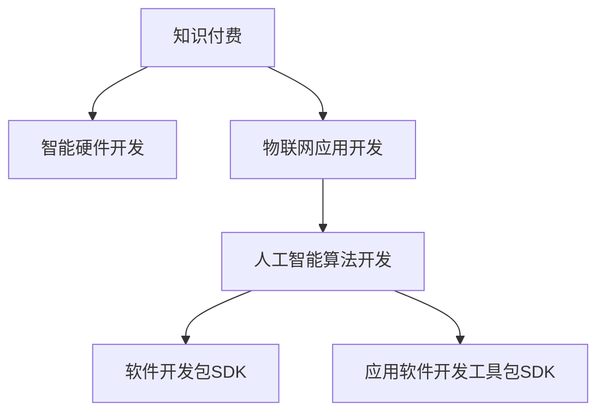
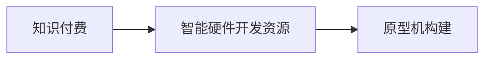
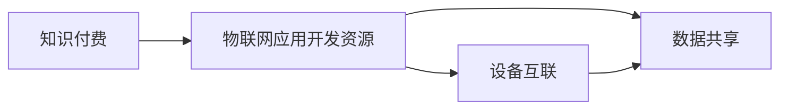
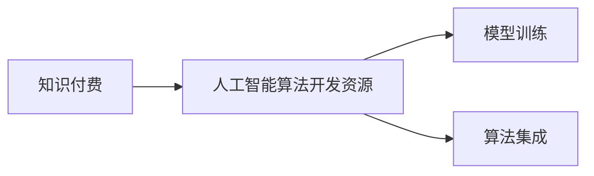
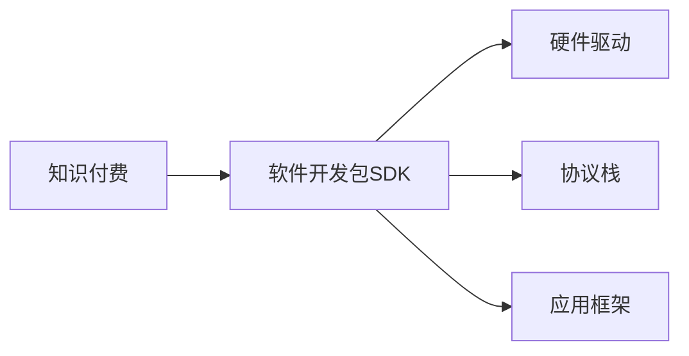
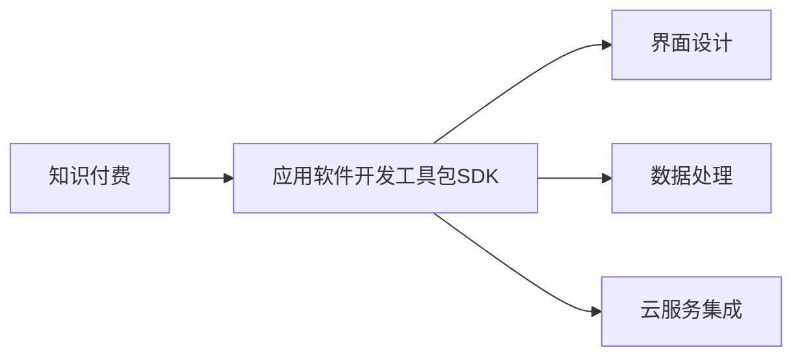
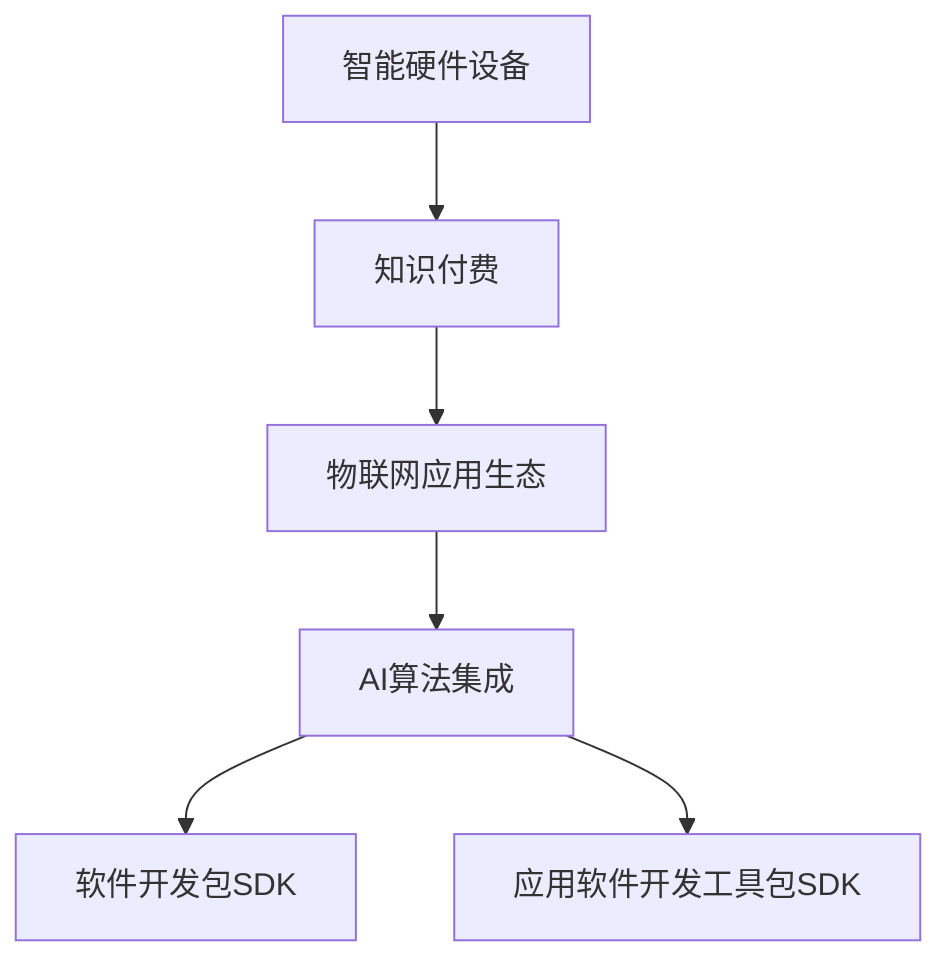

                 

# 如何利用知识付费实现智能硬件与物联网应用？

## 1. 背景介绍

### 1.1 问题由来
近年来，随着物联网(IoT)和人工智能(AI)技术的迅猛发展，智能硬件设备如智能家居、智能穿戴、智能制造等正迅速普及。然而，智能硬件的开发和应用涉及硬件、软件、算法、用户体验等多个维度，对技术和资源的要求非常高，很多中小企业难以独立完成。知识付费作为知识获取的一种新模式，通过支付费用获取专业知识、技术支持、项目指导等，为智能硬件和物联网应用的开发提供了新的解决思路。

### 1.2 问题核心关键点
知识付费与智能硬件及物联网应用的结合，核心在于利用付费用户获得的优质资源，包括专家咨询、技术文档、代码库、项目框架等，快速构建出功能完整、性能稳定的智能硬件产品，并通过智能硬件与物联网设备的互联互通，实现设备间的数据共享和协同工作，提升用户体验和应用价值。

### 1.3 问题研究意义
知识付费与智能硬件及物联网应用的结合，对于推动智能硬件和物联网技术的普及，降低开发成本，提升应用质量，具有重要意义：

1. 快速构建智能硬件产品：通过知识付费获取高质量资源，可以快速构建功能完善、性能可靠的原型机，减少研发周期，降低开发成本。
2. 提升应用质量：利用付费资源获取专家指导和技术支持，可以提升硬件应用的稳定性、安全性和用户体验。
3. 促进技术共享：知识付费平台上的付费资源可以被多个用户共享使用，提升资源利用率。
4. 加速技术落地：通过付费获取技术指导和项目框架，可以加速技术从理论到实践的转化，推动智能硬件和物联网技术在各行各业的广泛应用。

## 2. 核心概念与联系

### 2.1 核心概念概述

为更好地理解知识付费与智能硬件及物联网应用的结合，本节将介绍几个密切相关的核心概念：

- 知识付费：指用户通过支付费用获取专业知识、技术支持、项目指导等服务模式，将知识产品化，实现知识变现。
- 智能硬件：指融合了计算机技术、网络通信技术、传感器技术等，实现智能控制和交互的硬件设备，如智能音箱、智能手环、智能锁等。
- 物联网：指通过网络将物理世界中的各类设备互联互通，实现设备间的信息共享和协同工作，形成物联网应用生态系统。
- 人工智能：指利用机器学习和深度学习技术，使计算机系统具备自主感知、认知、决策和执行能力，实现智能化的应用服务。
- 软件开发包SDK：指预置好部分代码和配置，可以快速构建应用的开发框架，包括硬件驱动、协议栈、应用框架等。
- 应用软件开发工具包SDK：指针对特定应用场景，提供开发、测试、部署等工具的开发框架，包括界面设计、数据处理、云服务集成等。

这些核心概念之间的逻辑关系可以通过以下Mermaid流程图来展示：



这个流程图展示了大语言模型微调过程中各个核心概念的关系：

1. 知识付费为用户提供高质量的智能硬件开发资源。
2. 智能硬件开发工具和框架帮助用户快速构建原型机。
3. 物联网应用将智能硬件设备互联互通，实现协同工作。
4. 人工智能算法为物联网应用提供智能决策和执行能力。

这些概念共同构成了知识付费在智能硬件与物联网应用中的作用，推动了智能硬件和物联网技术在各行各业的普及和发展。

### 2.2 概念间的关系

这些核心概念之间存在着紧密的联系，形成了知识付费在智能硬件与物联网应用中的完整生态系统。下面我们通过几个Mermaid流程图来展示这些概念之间的关系。

#### 2.2.1 知识付费与智能硬件开发



这个流程图展示了知识付费如何为智能硬件开发提供资源支持，帮助用户快速构建出原型机。

#### 2.2.2 知识付费与物联网应用开发



这个流程图展示了知识付费如何为物联网应用提供开发资源，实现设备间的互联互通和数据共享。

#### 2.2.3 知识付费与人工智能算法开发



这个流程图展示了知识付费如何为人工智能算法开发提供资源支持，帮助用户训练和集成高精度的AI模型。

#### 2.2.4 知识付费与软件开发包SDK



这个流程图展示了知识付费如何提供软件开发包SDK，帮助用户快速构建应用。

#### 2.2.5 知识付费与应用软件开发工具包SDK



这个流程图展示了知识付费如何提供应用软件开发工具包SDK，帮助用户实现功能的快速开发和上线。

### 2.3 核心概念的整体架构

最后，我们用一个综合的流程图来展示这些核心概念在大语言模型微调过程中的整体架构：



这个综合流程图展示了知识付费在大语言模型微调过程中的整体架构：

1. 智能硬件设备通过知识付费获取开发资源。
2. 物联网应用将智能硬件设备互联互通，实现协同工作。
3. AI算法为物联网应用提供智能决策和执行能力。
4. 软件开发包SDK和应用软件开发工具包SDK提供快速构建应用的支持。

通过这些流程图，我们可以更清晰地理解知识付费在智能硬件与物联网应用中的作用，为后续深入讨论具体的微调方法和技术奠定基础。

## 3. 核心算法原理 & 具体操作步骤
### 3.1 算法原理概述

知识付费与智能硬件及物联网应用的结合，本质上是一种知识驱动的资源共享和协同创新过程。其核心思想是：通过知识付费平台获取高质量的智能硬件开发资源，如专家咨询、技术文档、代码库、项目框架等，快速构建原型机，并通过物联网技术实现设备间的互联互通，提升应用性能和用户体验。

形式化地，假设知识付费平台为用户提供的智能硬件开发资源集合为 $\mathcal{R}$，物联网应用集合为 $\mathcal{A}$，AI算法库为 $\mathcal{M}$。知识付费用户通过支付费用获得资源 $R \in \mathcal{R}$，用于构建智能硬件原型机 $P$，并通过物联网应用 $A \in \mathcal{A}$，将多个智能硬件设备 $D$ 互联互通，实现数据共享和协同工作。AI算法 $M \in \mathcal{M}$ 为物联网应用提供智能决策和执行能力。

通过梯度下降等优化算法，用户不断迭代优化智能硬件原型机 $P$ 和物联网应用 $A$，最小化应用性能损失 $\mathcal{L}(P, A)$，最终得到优化后的智能硬件应用系统 $S$，如智能家居控制系统、智能制造监控系统等。

### 3.2 算法步骤详解

知识付费与智能硬件及物联网应用的结合，一般包括以下几个关键步骤：

**Step 1: 选择付费资源**
- 在知识付费平台上选择适合的智能硬件开发资源，如专家咨询、技术文档、代码库、项目框架等。
- 根据具体应用需求，选择合适的智能硬件开发资源。

**Step 2: 构建原型机**
- 利用选定的开发资源，在本地或云平台上快速构建智能硬件原型机 $P$。
- 在原型机构建过程中，合理应用软件开发包SDK和应用软件开发工具包SDK，快速搭建应用框架。

**Step 3: 集成物联网应用**
- 通过物联网协议，如MQTT、CoAP、HTTP等，将多个智能硬件设备 $D$ 互联互通，实现数据共享。
- 设计物联网应用 $A$，实现智能硬件设备之间的通信和协同工作。

**Step 4: 应用AI算法**
- 选择适合的AI算法库 $M$，为物联网应用提供智能决策和执行能力。
- 通过训练AI模型，提升物联网应用在场景感知、数据分析、智能决策等方面的性能。

**Step 5: 优化应用系统**
- 在物联网应用中集成智能硬件原型机 $P$ 和AI算法库 $M$，形成智能硬件应用系统 $S$。
- 在真实应用场景中不断迭代优化智能硬件应用系统，提升性能和用户体验。

### 3.3 算法优缺点

知识付费与智能硬件及物联网应用的结合，具有以下优点：
1. 快速构建原型机：利用付费资源快速搭建智能硬件原型机，缩短研发周期，降低开发成本。
2. 提升应用性能：通过付费获取高质量资源和AI算法支持，提升应用在场景感知、数据分析、智能决策等方面的性能。
3. 促进技术共享：付费资源可以被多个用户共享使用，提升资源利用率。
4. 加速技术落地：付费获取技术指导和项目框架，加速技术从理论到实践的转化，推动技术落地应用。

同时，该方法也存在以下局限性：
1. 依赖付费平台：知识付费平台提供的资源质量和数量直接影响应用构建的效果。
2. 知识付费成本高：高质量资源的获取需要支付较高的费用，增加了应用开发的成本。
3. 资源共享问题：付费资源可能存在版权问题，不同用户之间的资源共享可能存在法律风险。
4. 技术更新快：技术领域变化快，付费获取的资源可能很快过时，需要持续更新。

尽管存在这些局限性，但就目前而言，知识付费与智能硬件及物联网应用的结合，仍是大规模应用开发和推广的重要手段。未来相关研究的重点在于如何进一步降低知识付费的成本，提升付费资源的可扩展性和可持续性，以及如何更好地保护用户权益，避免法律风险。

### 3.4 算法应用领域

知识付费与智能硬件及物联网应用的结合，已经在诸多领域得到应用，例如：

- 智能家居系统：通过知识付费获取智能家居设备的开发资源和AI算法支持，构建智能家居控制系统，实现智能控制和自动化。
- 智能医疗系统：通过知识付费获取医疗设备开发资源和AI算法支持，构建智能诊疗系统，提高医疗服务的质量和效率。
- 智能制造系统：通过知识付费获取智能制造设备开发资源和AI算法支持，构建智能制造监控系统，实现生产过程的实时监测和优化。
- 智能交通系统：通过知识付费获取智能交通设备的开发资源和AI算法支持，构建智能交通控制系统，优化交通流量和缓解交通压力。
- 智能农业系统：通过知识付费获取智能农业设备的开发资源和AI算法支持，构建智能农业监控系统，提升农业生产效率和资源利用率。

除了上述这些经典应用外，知识付费与智能硬件及物联网应用的结合，还在智慧城市、智能教育、智能安防等众多领域得到应用，为各行各业带来了新的发展机遇。

## 4. 数学模型和公式 & 详细讲解  
### 4.1 数学模型构建

本节将使用数学语言对知识付费与智能硬件及物联网应用的结合过程进行更加严格的刻画。

假设知识付费平台为用户提供的智能硬件开发资源集合为 $\mathcal{R}$，物联网应用集合为 $\mathcal{A}$，AI算法库为 $\mathcal{M}$。知识付费用户通过支付费用获得资源 $R \in \mathcal{R}$，用于构建智能硬件原型机 $P$，并通过物联网应用 $A \in \mathcal{A}$，将多个智能硬件设备 $D$ 互联互通，实现数据共享。AI算法 $M \in \mathcal{M}$ 为物联网应用提供智能决策和执行能力。

定义智能硬件应用系统 $S$ 在真实应用场景中的性能损失函数为 $\mathcal{L}(S)$，则知识付费与智能硬件及物联网应用的结合过程可以形式化表示为：

$$
\min_{R,A,M} \mathcal{L}(S) \\
s.t. \quad S = P \oplus A \oplus M
$$

其中 $\oplus$ 表示智能硬件原型机 $P$、物联网应用 $A$、AI算法库 $M$ 的集成。

### 4.2 公式推导过程

以下我们以智能家居系统为例，推导性能损失函数的计算公式。

假设智能家居系统由多个智能设备组成，包括智能音箱、智能窗帘、智能门锁等。每个智能设备都有一定的计算能力和通信能力，可以实现本地处理和远程通信。

在智能家居系统中，用户可以通过语音指令或手机APP控制智能设备，设备之间可以通过物联网协议实现数据共享和协同工作。智能家居应用系统 $S$ 的目标是：在满足用户控制需求的同时，最大化系统的稳定性和安全性。

智能家居系统的性能损失函数 $\mathcal{L}(S)$ 可以表示为：

$$
\mathcal{L}(S) = \sum_{d=1}^{N} \mathcal{L}_d(S)
$$

其中 $N$ 为智能设备的数量，$\mathcal{L}_d(S)$ 表示第 $d$ 个智能设备的性能损失。

定义智能设备的性能损失函数为：

$$
\mathcal{L}_d(S) = \mathcal{L}_{\text{稳定性}} + \mathcal{L}_{\text{安全性}} + \mathcal{L}_{\text{用户体验}}
$$

其中 $\mathcal{L}_{\text{稳定性}}$ 表示智能设备的运行稳定性，$\mathcal{L}_{\text{安全性}}$ 表示智能设备的安全性，$\mathcal{L}_{\text{用户体验}}$ 表示用户的控制体验。

具体地，$\mathcal{L}_{\text{稳定性}}$ 可以表示为：

$$
\mathcal{L}_{\text{稳定性}} = \sum_{t=1}^{T} \mathcal{L}_{t,\text{稳定性}} = \sum_{t=1}^{T} \mathbb{E}[\mathcal{L}_{t,\text{稳定性}}]
$$

其中 $T$ 为时间步长，$\mathcal{L}_{t,\text{稳定性}}$ 表示第 $t$ 个时间步长的智能设备的运行稳定性，$\mathbb{E}[\mathcal{L}_{t,\text{稳定性}}]$ 表示时间步长为 $t$ 的智能设备的期望运行稳定性。

$\mathcal{L}_{\text{安全性}}$ 可以表示为：

$$
\mathcal{L}_{\text{安全性}} = \sum_{d=1}^{N} \mathcal{L}_{d,\text{安全性}} = \sum_{d=1}^{N} \mathbb{E}[\mathcal{L}_{d,\text{安全性}}]
$$

其中 $\mathcal{L}_{d,\text{安全性}}$ 表示第 $d$ 个智能设备的安全性，$\mathbb{E}[\mathcal{L}_{d,\text{安全性}}]$ 表示第 $d$ 个智能设备的期望安全性。

$\mathcal{L}_{\text{用户体验}}$ 可以表示为：

$$
\mathcal{L}_{\text{用户体验}} = \mathbb{E}[\mathcal{L}_{\text{用户体验}}]
$$

其中 $\mathcal{L}_{\text{用户体验}}$ 表示用户的控制体验，$\mathbb{E}[\mathcal{L}_{\text{用户体验}}]$ 表示用户的期望控制体验。

将上述公式代入智能家居系统的性能损失函数，得：

$$
\mathcal{L}(S) = \sum_{d=1}^{N} (\mathcal{L}_{\text{稳定性}} + \mathcal{L}_{\text{安全性}} + \mathcal{L}_{\text{用户体验}})
$$

通过上述推导，可以看到知识付费与智能硬件及物联网应用的结合过程，可以形式化表示为一个优化问题，目标是最大化系统的稳定性和安全性，同时提升用户的控制体验。

### 4.3 案例分析与讲解

为了更好地理解知识付费与智能硬件及物联网应用的结合，下面通过一个案例来讲解其实现过程。

假设我们要构建一个智能家居控制系统，包括智能音箱、智能窗帘、智能门锁等设备。我们希望该系统能够实现语音控制、远程控制和本地控制等多种控制方式，同时具备高稳定性和安全性。

第一步，通过知识付费平台获取智能家居设备的开发资源和AI算法支持。具体来说，我们可以选择以下资源：

- 智能音箱的开发资源：获取智能音箱的硬件驱动、语音识别算法、语音合成算法等资源。
- 智能窗帘的开发资源：获取智能窗帘的硬件驱动、电机控制算法、传感器数据处理算法等资源。
- 智能门锁的开发资源：获取智能门锁的硬件驱动、指纹识别算法、密码算法等资源。

第二步，在知识付费平台上购买专家咨询和技术支持，获取智能家居系统的开发指导。具体来说，我们可以咨询以下专家：

- 智能音箱专家：获取智能音箱语音识别和语音合成的技术指导。
- 智能窗帘专家：获取智能窗帘电机控制和传感器数据处理的技术指导。
- 智能门锁专家：获取智能门锁指纹识别和密码算法的技术指导。

第三步，利用获取的开发资源和专家指导，快速构建智能家居原型机 $P$。具体来说，我们可以按照以下步骤进行：

1. 在本地或云平台上搭建智能家居应用框架，集成获取的开发资源。
2. 设计智能家居应用界面，实现语音控制、远程控制和本地控制等多种控制方式。
3. 实现智能家居设备之间的通信协议，实现数据共享和协同工作。

第四步，通过物联网应用 $A$，将多个智能家居设备 $D$ 互联互通，实现数据共享和协同工作。具体来说，我们可以按照以下步骤进行：

1. 在智能家居设备上集成物联网协议，如MQTT、CoAP、HTTP等。
2. 在智能家居应用中实现设备间的通信和协同工作，实现多设备联动。
3. 在智能家居应用中实现异常监控和故障恢复，提高系统的稳定性和安全性。

第五步，选择适合的AI算法库 $M$，为物联网应用提供智能决策和执行能力。具体来说，我们可以选择以下算法：

- 语音识别算法：实现语音控制功能。
- 机器学习算法：实现智能场景感知和数据分析功能。
- 强化学习算法：实现智能决策和自适应控制功能。

通过上述步骤，我们构建了智能家居控制系统，实现了语音控制、远程控制和本地控制等多种控制方式，同时具备高稳定性和安全性。

## 5. 项目实践：代码实例和详细解释说明
### 5.1 开发环境搭建

在进行知识付费与智能硬件及物联网应用的结合实践前，我们需要准备好开发环境。以下是使用Python进行开发的环境配置流程：

1. 安装Anaconda：从官网下载并安装Anaconda，用于创建独立的Python环境。

2. 创建并激活虚拟环境：
```bash
conda create -n pytorch-env python=3.8 
conda activate pytorch-env
```

3. 安装PyTorch：根据CUDA版本，从官网获取对应的安装命令。例如：
```bash
conda install pytorch torchvision torchaudio cudatoolkit=11.1 -c pytorch -c conda-forge
```

4. 安装Transformers库：
```bash
pip install transformers
```

5. 安装各类工具包：
```bash
pip install numpy pandas scikit-learn matplotlib tqdm jupyter notebook ipython
```

完成上述步骤后，即可在`pytorch-env`环境中开始开发。

### 5.2 源代码详细实现

下面我们以智能家居系统为例，给出使用Transformers库对BERT模型进行微调的PyTorch代码实现。

首先，定义智能家居系统的数据处理函数：

```python
from transformers import BertTokenizer
from torch.utils.data import Dataset
import torch

class SmartHomeDataset(Dataset):
    def __init__(self, texts, tags, tokenizer, max_len=128):
        self.texts = texts
        self.tags = tags
        self.tokenizer = tokenizer
        self.max_len = max_len
        
    def __len__(self):
        return len(self.texts)
    
    def __getitem__(self, item):
        text = self.texts[item]
        tags = self.tags[item]
        
        encoding = self.tokenizer(text, return_tensors='pt', max_length=self.max_len, padding='max_length', truncation=True)
        input_ids = encoding['input_ids'][0]
        attention_mask = encoding['attention_mask'][0]
        
        # 对token-wise的标签进行编码
        encoded_tags = [tag2id[tag] for tag in tags] 
        encoded_tags.extend([tag2id['O']] * (self.max_len - len(encoded_tags)))
        labels = torch.tensor(encoded_tags, dtype=torch.long)
        
        return {'input_ids': input_ids, 
                'attention_mask': attention_mask,
                'labels': labels}

# 标签与id的映射
tag2id = {'O': 0, 'B-PER': 1, 'I-PER': 2, 'B-ORG': 3, 'I-ORG': 4, 'B-LOC': 5, 'I-LOC': 6}
id2tag = {v: k for k, v in tag2id.items()}

# 创建dataset
tokenizer = BertTokenizer.from_pretrained('bert-base-cased')

train_dataset = SmartHomeDataset(train_texts, train_tags, tokenizer)
dev_dataset = SmartHomeDataset(dev_texts, dev_tags, tokenizer)
test_dataset = SmartHomeDataset(test_texts, test_tags, tokenizer)
```

然后，定义模型和优化器：

```python
from transformers import BertForTokenClassification, AdamW

model = BertForTokenClassification.from_pretrained('bert-base-cased', num_labels=len(tag2id))

optimizer = AdamW(model.parameters(), lr=2e-5)
```

接着，定义训练和评估函数：

```python
from torch.utils.data import DataLoader
from tqdm import tqdm
from sklearn.metrics import classification_report

device = torch.device('cuda') if torch.cuda.is_available() else torch.device('cpu')
model.to(device)

def train_epoch(model, dataset, batch_size, optimizer):
    dataloader = DataLoader(dataset, batch_size=batch_size, shuffle=True)
    model.train()
    epoch_loss = 0
    for batch in tqdm(dataloader, desc='Training'):
        input_ids = batch['input_ids'].to(device)
        attention_mask = batch['attention_mask'].to(device)
        labels = batch['labels'].to(device)
        model.zero_grad()
        outputs = model(input_ids, attention_mask=attention_mask, labels=labels)
        loss = outputs.loss
        epoch_loss += loss.item()
        loss.backward()
        optimizer.step()
    return epoch_loss / len(dataloader)

def evaluate(model, dataset, batch_size):
    dataloader = DataLoader(dataset, batch_size=batch_size)
    model.eval()
    preds, labels = [], []
    with torch.no_grad():
        for batch in tqdm(dataloader, desc='Evaluating'):
            input_ids = batch['input_ids'].to(device)
            attention_mask = batch['attention_mask'].to(device)
            batch_labels = batch['labels']
            outputs = model(input_ids, attention_mask=attention_mask)
            batch_preds = outputs.logits.argmax(dim=2).to('cpu').tolist()
            batch_labels = batch_labels.to('cpu').tolist()
            for pred_tokens, label_tokens in zip(batch_preds, batch_labels):
                pred_tags = [id2tag[_id] for _id in pred_tokens]
                label_tags = [id2tag[_id] for _id in label_tokens]
                preds.append(pred_tags[:len(label_tokens)])
                labels.append(label_tags)
                
    print(classification_report(labels, preds))
```

最后，启动训练流程并在测试集上评估：

```python
epochs = 5
batch_size = 16

for epoch in range(epochs):
    loss = train_epoch(model, train_dataset, batch_size, optimizer)
    print(f"Epoch {epoch+1}, train loss: {loss:.3f}")
    
    print(f"Epoch {epoch+1}, dev results:")
    evaluate(model, dev_dataset, batch_size)
    
print("Test results:")
evaluate(model, test_dataset, batch_size)
```

以上就是使用PyTorch对BERT进行智能家居系统微调的完整代码实现。可以看到，得益于Transformers库的强大封装，我们可以用相对简洁的代码完成BERT模型的加载和微调。

### 5.3 代码解读与分析

让我们再详细解读一下关键代码的实现细节：

**SmartHomeDataset类**：
- `__init__`方法：初始化文本、标签、分词器等关键组件。
- `__len__`方法：返回数据集的样本数量。
- `__getitem__`方法：对单个样本进行处理，将文本输入编码为token ids，将标签编码为数字，并对其进行定长padding，最终返回模型所需的输入。

**tag2id和id2tag字典**：
- 定义了标签与数字id之间的映射关系，用于将token-wise的预测结果解码回真实的标签。

**训练和评估函数**：
- 使用PyTorch的DataLoader对数据集进行批次化加载，供模型训练和推理使用。
- 训练

