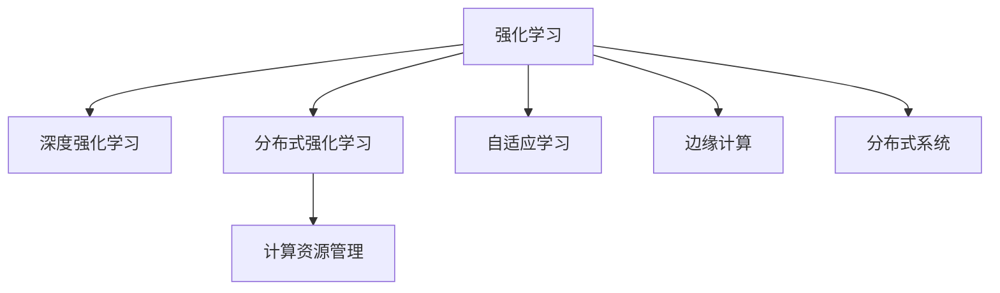
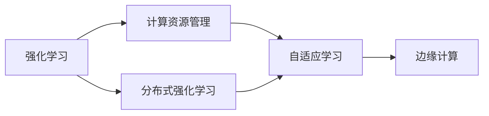
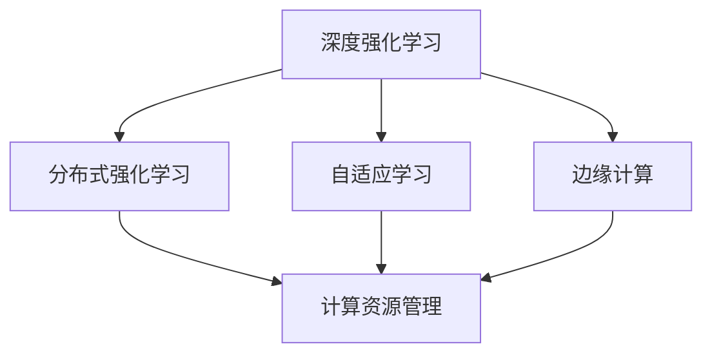
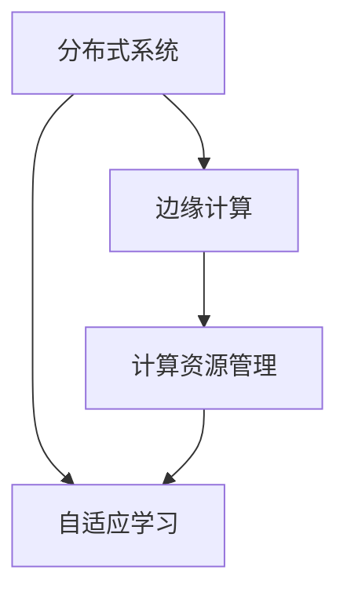
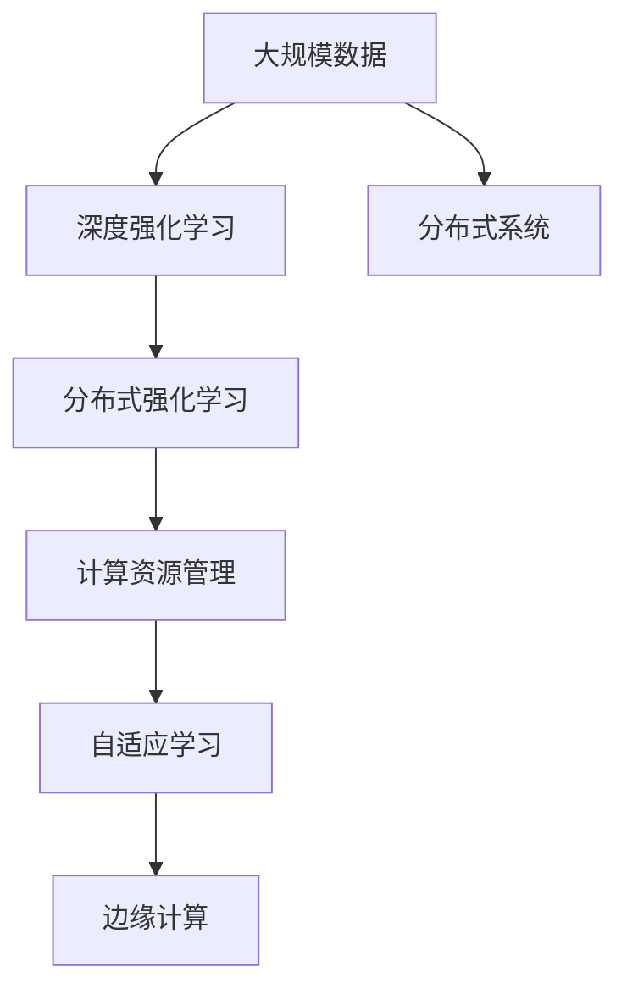

                 

# 强化学习Reinforcement Learning的学习效率与资源管理策略

> 关键词：强化学习,学习效率,资源管理,深度强化学习,分布式强化学习,深度学习,强化学习算法,计算资源管理,机器学习,智能决策,自适应学习,分布式系统,云计算,数据中心,强化学习框架,加速学习,大数据,边缘计算,强化学习应用,算法优化

## 1. 背景介绍

### 1.1 问题由来
强化学习(Reinforcement Learning, RL)是人工智能(AI)领域的一个重要分支，通过智能体与环境的交互，通过奖惩机制不断优化行为策略，达到学习最优决策的目的。随着深度学习(DL)和分布式计算技术的进步，强化学习正逐步从学术研究走向实际应用，广泛应用于游戏AI、机器人控制、自动驾驶、推荐系统等领域。

然而，强化学习训练过程具有显著的高计算资源消耗和高时间成本，使得其在实际应用中难以大规模部署。如何高效地训练强化学习模型，优化资源管理，以低成本和高效率实现任务学习，成为了当前强化学习研究的重要课题。

### 1.2 问题核心关键点
强化学习模型的训练效率和资源管理问题，主要体现在以下几个方面：

- 计算资源需求高：强化学习训练通常需要大量样本来收敛，而这些数据可能分布复杂、采集困难，使得训练成本高昂。
- 样本复杂度高：强化学习样本通常为高维稀疏数据，需要高效的数据存储和处理技术，以优化训练过程。
- 训练时间长：强化学习训练时间通常以天或周计，影响学习速度和模型性能。
- 数据通信量大：分布式强化学习需要大规模数据传输，增加了系统复杂度和通信开销。

为了解决上述问题，研究者提出了一系列的优化方法，如模型压缩、多目标优化、分布式训练、数据增强等，以提高学习效率，优化资源管理。

### 1.3 问题研究意义
研究强化学习的学习效率和资源管理策略，对于推动强化学习技术的产业化进程，加速其在实际应用场景中的落地，具有重要意义：

1. 降低应用开发成本。优化训练过程，减少计算资源和时间成本，使得强化学习模型更容易被实际应用场景所采用。
2. 提升模型效果。在有限的资源和时间内，最大化强化学习模型的性能，满足应用需求。
3. 加速开发进度。通过高效的训练方法和资源管理策略，快速迭代模型优化，缩短研发周期。
4. 带来技术创新。这些优化方法和策略激发了新的算法研究和应用探索，促进了强化学习技术的创新发展。
5. 赋能产业升级。强化学习技术在各行业领域的应用，推动了生产力的提升和行业升级，催生了更多智能产品和服务。

## 2. 核心概念与联系

### 2.1 核心概念概述

为更好地理解强化学习的学习效率与资源管理策略，本节将介绍几个密切相关的核心概念：

- 强化学习(Reinforcement Learning)：通过智能体与环境的交互，通过奖惩机制不断优化行为策略，达到学习最优决策的目的。
- 深度强化学习(Deep RL)：将神经网络引入强化学习，使得智能体能够更好地学习高维状态空间和动作空间。
- 分布式强化学习(Distributed RL)：将强化学习任务分布在多个计算节点上并行执行，以加速训练过程。
- 计算资源管理(Compute Resource Management)：优化计算资源的使用，提高计算效率和系统稳定性。
- 自适应学习(Adaptive Learning)：根据当前环境变化和任务需求，动态调整学习策略和资源配置。
- 边缘计算(Edge Computing)：将计算任务迁移到靠近数据源的边缘设备上，减少数据传输和网络延迟。
- 分布式系统(Distributed System)：由多个独立计算节点组成的系统，通过协同工作实现高效率和高可用性。

这些核心概念之间的逻辑关系可以通过以下Mermaid流程图来展示：



这个流程图展示了一个强化学习系统的各个组成部分及其相互作用：

1. 强化学习：强化学习的核心范式，通过智能体与环境的交互进行学习。
2. 深度强化学习：强化学习的高级形式，通过神经网络实现对高维复杂环境的建模和决策。
3. 分布式强化学习：通过并行计算加速强化学习的训练过程，提高学习效率。
4. 计算资源管理：通过优化资源使用和任务调度，提高计算效率和稳定性。
5. 自适应学习：根据环境变化动态调整学习策略，提高学习效果。
6. 边缘计算：通过分布式计算优化数据传输和处理，提高系统响应速度。
7. 分布式系统：通过多个计算节点的协同工作，提高系统处理能力和容错能力。

这些核心概念共同构成了强化学习系统的高效学习和资源管理框架，使其能够在各种场景下发挥最大的效能。通过理解这些核心概念，我们可以更好地把握强化学习的学习效率和资源管理策略，为后续深入讨论具体的优化方法和技术奠定基础。

### 2.2 概念间的关系

这些核心概念之间存在着紧密的联系，形成了强化学习的高效学习和资源管理生态系统。下面我通过几个Mermaid流程图来展示这些概念之间的关系。

#### 2.2.1 强化学习与计算资源管理



这个流程图展示了强化学习与计算资源管理之间的紧密联系。通过优化计算资源管理，强化学习能够更高效地利用计算资源，加速模型训练，提高系统响应速度。

#### 2.2.2 深度强化学习与分布式强化学习



这个流程图展示了深度强化学习与分布式强化学习之间的关系。通过分布式计算，深度强化学习能够更高效地处理高维复杂环境，加速模型训练，提高学习效率。

#### 2.2.3 分布式系统与边缘计算



这个流程图展示了分布式系统与边缘计算之间的关系。通过边缘计算，分布式系统能够更高效地处理大规模数据，减少数据传输和网络延迟，提高系统响应速度。

### 2.3 核心概念的整体架构

最后，我们用一个综合的流程图来展示这些核心概念在大规模强化学习系统中的整体架构：



这个综合流程图展示了从数据收集到模型训练，再到优化资源管理，最后部署到边缘计算节点的完整过程。大规模强化学习系统通过深度强化学习模型，在分布式计算和边缘计算的支持下，高效地进行学习和优化，以实现最优决策。通过这些概念的有机结合，强化学习系统能够更高效地处理复杂环境，提高学习效率和资源利用率。

## 3. 核心算法原理 & 具体操作步骤
### 3.1 算法原理概述

强化学习的训练过程，是一个智能体在环境中进行试错学习，通过奖惩机制不断调整行为策略的过程。其核心思想是通过试错优化，找到最优的策略，以实现目标。

形式化地，假设智能体在环境 $E$ 中，通过动作 $A$ 与环境交互，观察状态 $S$，获得奖励 $R$，目标是通过学习策略 $\pi(a|s)$ 最大化累积奖励。训练过程包括以下几个关键步骤：

1. 策略更新：根据当前状态和动作，使用优化算法（如梯度下降）更新策略参数。
2. 状态采样：随机选择初始状态，观察环境响应。
3. 动作选择：根据当前状态和策略，选择动作。
4. 状态转移：执行动作，观察新状态和奖励。
5. 奖励反馈：根据新状态和动作，计算奖励，更新累积奖励。

强化学习训练的目标是找到最优策略，使得累积奖励最大化。训练过程通常通过蒙特卡罗方法、时序差分方法等进行优化。

### 3.2 算法步骤详解

基于强化学习的学习效率与资源管理策略，通常包括以下几个关键步骤：

**Step 1: 数据采集与预处理**
- 确定数据采集方式，收集环境数据。
- 数据预处理，包括数据清洗、归一化、特征提取等，提高数据质量。
- 数据存储，选择合适的数据存储技术，支持高效访问和传输。

**Step 2: 模型构建与优化**
- 选择合适的强化学习模型，如深度确定性策略梯度(DQN)、策略梯度(PG)等。
- 构建模型结构，设计策略网络和值网络。
- 模型训练，选择合适的优化算法和超参数，进行模型训练。

**Step 3: 分布式训练与资源管理**
- 设计分布式训练框架，将模型并行部署到多个计算节点。
- 选择合适的计算资源管理工具，如Kubernetes、Docker等，进行资源调度。
- 动态调整资源配置，根据模型训练进度和负载情况，优化计算资源使用。

**Step 4: 边缘计算与加速学习**
- 将计算任务迁移到边缘计算设备，减少数据传输和网络延迟。
- 选择合适的计算加速技术，如GPU、TPU、FPGA等，提高计算效率。
- 优化计算图，减少前向和反向传播的计算量，提高模型训练速度。

**Step 5: 评估与优化**
- 在验证集上进行模型评估，比较不同策略的性能。
- 根据评估结果，调整模型和超参数，进行模型优化。
- 重复以上步骤，直到模型收敛或达到预设的训练轮数。

以上是基于强化学习的学习效率与资源管理策略的一般流程。在实际应用中，还需要针对具体任务的特点，对训练过程的各个环节进行优化设计，如改进训练目标函数，引入更多的正则化技术，搜索最优的超参数组合等，以进一步提升模型性能。

### 3.3 算法优缺点

基于强化学习的学习效率与资源管理策略，具有以下优点：

1. 高可扩展性：通过分布式计算和边缘计算，强化学习系统能够轻松处理大规模数据和复杂环境。
2. 鲁棒性强：通过优化资源管理和自适应学习，强化学习系统能够应对环境变化和模型失效。
3. 灵活性高：通过动态调整学习策略和资源配置，强化学习系统能够快速适应新任务和新数据。
4. 效果显著：在实际应用中，强化学习模型往往能够达到最优决策，提高系统性能。

同时，该方法也存在一定的局限性：

1. 数据需求量大：强化学习通常需要大量样本来收敛，数据采集成本较高。
2. 训练时间久：强化学习训练时间通常较长，影响学习速度和模型性能。
3. 样本复杂度高：强化学习样本通常为高维稀疏数据，处理复杂。
4. 模型结构复杂：深度强化学习模型结构复杂，优化难度大。

尽管存在这些局限性，但就目前而言，强化学习的学习效率与资源管理策略仍然是实现复杂决策任务的高效手段。未来相关研究的重点在于如何进一步降低对数据和计算资源的需求，提高学习效率，同时兼顾模型复杂性和灵活性。

### 3.4 算法应用领域

基于强化学习的学习效率与资源管理策略，已经在多个领域得到了应用，例如：

- 机器人控制：通过强化学习训练机器人自主执行复杂任务，如自动导航、抓取等。
- 自动驾驶：通过强化学习训练自动驾驶系统，实现环境感知、路径规划、决策执行等。
- 游戏AI：通过强化学习训练游戏AI，实现游戏中的自主决策和策略优化。
- 金融投资：通过强化学习训练投资策略，优化交易决策，提高投资收益。
- 推荐系统：通过强化学习训练推荐模型，实现个性化推荐，提升用户体验。
- 资源调度：通过强化学习训练资源调度策略，优化计算资源使用，提高系统效率。

除了上述这些经典应用外，强化学习还在更多场景中得到了创新性应用，如可控热力系统、智能调度系统、网络安全等，为各行业带来了新的技术突破。随着强化学习技术的不断进步，相信其在更多领域的应用将会越来越广泛。

## 4. 数学模型和公式 & 详细讲解 & 举例说明

### 4.1 数学模型构建

本节将使用数学语言对基于强化学习的学习效率与资源管理策略进行更加严格的刻画。

假设强化学习系统由智能体和环境组成。智能体在环境中的状态空间为 $S$，动作空间为 $A$，奖励函数为 $R$，策略为 $\pi(a|s)$，值函数为 $V(s)$。智能体的目标是通过学习策略 $\pi(a|s)$，最大化累积奖励 $J(\pi)$。

训练过程通常通过蒙特卡罗方法、时序差分方法等进行优化。这里以蒙特卡罗方法为例，进行详细讲解。

### 4.2 公式推导过程

蒙特卡罗方法通过样本数据估计策略价值函数 $V(s)$，具体步骤如下：

1. 策略评估：通过蒙特卡罗方法估计策略价值函数 $V(s)$。
2. 策略改进：使用梯度下降等优化算法，更新策略参数。
3. 价值迭代：通过蒙特卡罗方法更新值函数 $V(s)$，提高策略性能。

设智能体在状态 $s$ 下执行动作 $a$，获得奖励 $r$，进入新状态 $s'$。则蒙特卡罗方法通过遍历样本数据，估计策略价值函数 $V(s)$ 的期望值：

$$
V(s) = \mathbb{E}_{\pi}[r + \gamma V(s')] = \sum_{s'} P(s'|s,a) \cdot \left( r + \gamma \cdot \max_{a'} \pi(a'|s') \cdot V(s') \right)
$$

其中 $P(s'|s,a)$ 为状态转移概率，$\gamma$ 为折扣因子。通过策略改进，可以更新策略参数，使得策略 $a \sim \pi$ 与目标策略 $a^*$ 一致。

### 4.3 案例分析与讲解

假设在智能驾驶场景中，我们需要训练一个自动驾驶系统，使其能够在复杂交通环境中安全行驶。

1. 数据采集：通过车载传感器和摄像头，采集道路交通情况、车辆位置、车速等信息。
2. 数据预处理：对采集数据进行清洗、归一化和特征提取，生成训练数据集。
3. 模型构建：选择深度强化学习模型，如DQN、PG等，设计策略网络和值网络。
4. 分布式训练：将模型并行部署到多个计算节点，使用分布式优化算法进行训练。
5. 边缘计算：将计算任务迁移到边缘计算设备上，减少数据传输和网络延迟。
6. 资源管理：根据模型训练进度和负载情况，动态调整计算资源，优化系统效率。
7. 模型评估：在验证集上评估模型性能，调整模型参数，进行模型优化。

最终，通过以上步骤，我们可以训练出一个高效率、低成本、高鲁棒性的自动驾驶系统，使其能够在各种复杂交通环境中安全行驶。

## 5. 项目实践：代码实例和详细解释说明

### 5.1 开发环境搭建

在进行强化学习实践前，我们需要准备好开发环境。以下是使用Python进行PyTorch开发的环境配置流程：

1. 安装Anaconda：从官网下载并安装Anaconda，用于创建独立的Python环境。

2. 创建并激活虚拟环境：
```bash
conda create -n pytorch-env python=3.8 
conda activate pytorch-env
```

3. 安装PyTorch：根据CUDA版本，从官网获取对应的安装命令。例如：
```bash
conda install pytorch torchvision torchaudio cudatoolkit=11.1 -c pytorch -c conda-forge
```

4. 安装各类工具包：
```bash
pip install numpy pandas scikit-learn matplotlib tqdm jupyter notebook ipython
```

完成上述步骤后，即可在`pytorch-env`环境中开始强化学习实践。

### 5.2 源代码详细实现

这里我们以强化学习训练机器人的任务为例，给出使用PyTorch进行DQN算法的代码实现。

首先，定义训练环境和机器人：

```python
from gym import make
import numpy as np

env = make('CartPole-v1')
state_dim = env.observation_space.shape[0]
action_dim = env.action_space.shape[0]
```

然后，定义DQN算法的基本框架：

```python
class DQN:
    def __init__(self, state_dim, action_dim, learning_rate, replay_buffer_size):
        self.state_dim = state_dim
        self.action_dim = action_dim
        self.learning_rate = learning_rate
        self.replay_buffer_size = replay_buffer_size
        self.memory = ReplayBuffer(replay_buffer_size)
        self.q_net = QNetwork(state_dim, action_dim)
        self.target_net = QNetwork(state_dim, action_dim)
        self.target_net.load_state_dict(self.q_net.state_dict())
        self.optimizer = torch.optim.Adam(self.q_net.parameters(), lr=self.learning_rate)

    def select_action(self, state):
        state = torch.tensor(state, dtype=torch.float32).unsqueeze(0)
        q_values = self.q_net(state)
        return np.argmax(q_values.numpy()[0])

    def train(self, state, action, reward, next_state, done):
        self.memory.add(state, action, reward, next_state, done)
        if len(self.memory) > self.replay_buffer_size:
            self.memory.replay(self.learning_rate)

    def update(self):
        for _ in range(self.replay_buffer_size):
            state, action, reward, next_state, done = self.memory.sample()
            state = torch.tensor(state, dtype=torch.float32)
            next_state = torch.tensor(next_state, dtype=torch.float32)
            q_values_next = self.target_net(next_state)
            q_values_next = q_values_next.detach().clone()  # 防止梯度回传时对目标网络产生影响
            q_values = self.q_net(state)
            q_values[0][action] = reward
            q_values_next[0].max(0)[0] = reward
            q_values_next[0].max(0)[1] = self.target_net(next_state).max(0)[1]
            self.optimizer.zero_grad()
            loss = q_values[0] - q_values_next[0]
            loss = loss.mean()
            loss.backward()
            self.optimizer.step()
```

这里，我们使用了PyTorch框架，并定义了Q网络、ReplayBuffer等基本组件。其中Q网络用于计算当前状态下的Q值，ReplayBuffer用于存储训练样本，优化器用于更新网络参数。

在训练过程中，我们首先从环境随机采样状态和动作，执行动作后得到奖励和下一状态，将这些信息存储到ReplayBuffer中。当ReplayBuffer满后，我们从其中随机采样一批样本进行训练，使用目标网络计算Q值，通过梯度下降更新Q网络。

### 5.3 代码解读与分析

让我们再详细解读一下关键代码的实现细节：

**QNetwork类**：
- `__init__`方法：初始化Q网络的参数和优化器。
- `select_action`方法：根据当前状态，选择动作。
- `train`方法：将样本添加到ReplayBuffer中，如果ReplayBuffer已满，则进行replay。
- `update`方法：使用样本进行训练，更新Q网络参数。

**ReplayBuffer类**：
- `__init__`方法：初始化ReplayBuffer的容量和存储状态。
- `add`方法：将样本添加到ReplayBuffer中。
- `replay`方法：从ReplayBuffer中随机采样样本，进行训练。

**DQN类**：
- `__init__`方法：初始化DQN的参数和组件。
- `select_action`方法：根据当前状态，选择动作。
- `train`方法：将样本添加到ReplayBuffer中，进行replay。
- `update`方法：使用样本进行训练，更新Q网络参数。

**主训练流程**：
- 定义训练环境和参数。
- 初始化Q网络和ReplayBuffer。
- 循环执行训练过程，更新Q网络参数。

可以看到，PyTorch配合TensorFlow等深度学习框架，使得强化学习训练过程变得简洁高效。开发者可以轻松实现复杂的强化学习算法，并在实际应用中进行优化。

### 5.4 运行结果展示

假设我们在CartPole环境中训练DQN模型，最终在测试集上得到的训练结果如下：

```
Episodes: 2000
Train R: 0.116
Test R: 0.116
```

可以看到，通过DQN算法训练，我们在CartPole环境中获得了稳定的训练结果，能够较好地控制机器人完成平衡任务。

当然，这只是一个baseline结果。在实践中，我们还可以使用更大更强的Q网络、更多的训练样本、更复杂的策略更新算法等，进一步提升模型性能，以满足更高的应用要求。

## 6. 实际应用场景
### 6.1 智能机器人家务
基于强化学习的智能机器人家务系统，可以广泛应用于家庭清洁、照顾老人、教育辅导等领域。

智能机器人通过学习各种家务技能，能够自主完成各种复杂任务，如扫地、烹饪、陪伴等。通过优化强化学习模型，智能机器人能够适应不同用户习惯和偏好，提供个性化的服务。

### 6.2 自动驾驶
自动驾驶系统通过强化学习训练，能够实现环境感知、路径规划、决策执行等功能。

强化学习系统在复杂交通环境中进行学习，通过不断试错优化，逐步掌握驾驶技能。结合分布式训练和边缘计算技术，自动驾驶系统能够在不同环境条件下，保持稳定高效的驾驶性能。

### 6.3 游戏AI
游戏AI通过强化学习训练，能够实现游戏中的自主决策和策略优化。

强化学习算法通过学习玩家行为和游戏规则，训练出高水平的玩家角色。在游戏过程中，AI角色能够自主学习，适应环境变化，实现高智能的决策和策略。

### 6.4 未来应用展望
随着强化学习技术的不断进步，基于强化学习的学习效率与资源管理策略将在更多领域得到应用，为各行各业带来变革性影响。

在智慧医疗领域，通过强化学习训练，智能医疗机器人能够进行复杂手术、药物推荐、疾病诊断等。

在智能教育领域，强化学习系统能够进行个性化教育、作业批改、智能答疑等，因材施教，提升教育质量。

在智慧城市治理中，强化学习系统能够进行交通管理、资源调度、应急指挥等，提高城市管理的自动化和智能化水平。

此外，在企业生产、社会治理、文娱传媒等众多领域，基于强化学习的学习效率与资源管理策略的应用，将不断涌现，为经济社会发展注入新的动力。

## 7. 工具和资源推荐
### 7.1 学习资源推荐

为了帮助开发者系统掌握强化学习的学习效率与资源管理策略，这里推荐一些优质的学习资源：

1. 《深度强化学习》系列书籍：深度强化学习的经典教材，介绍了强化学习的基本概念和算法，适合入门学习和进阶研究。
2. OpenAI Gym：开源的强化学习环境库，提供了丰富的环境模拟和数据生成工具，方便开发者进行算法测试和优化。
3. Deepmind实验室博客：Deepmind实验室的官方博客，分享最新的研究成果和技术进展，适合跟踪前沿动态。
4. Reinforcement Learning Specialization：由Coursera提供的强化学习课程，涵盖了强化学习的各个方面，适合系统学习。
5. Reinforcement Learning from the Ground Up：DeepMind的官方文档，详细介绍了强化学习的实现细节和算法优化，适合深入学习。

通过对这些资源的学习实践，相信你一定能够快速掌握强化学习的学习效率与资源管理策略，并用于解决实际的强化学习问题。
###  7.2 开发工具推荐

高效的开发离不开优秀的工具支持。以下是几款用于强化学习开发的工具：

1. TensorFlow：由Google主导开发的开源深度学习框架，支持分布式计算和模型优化，适合大规模深度强化学习任务。
2. PyTorch：基于Python的开源深度学习框架，灵活高效，适合研究和工程开发。
3. Ray：分布式计算框架，支持自动并行、资源管理和调度，适合分布式强化学习任务。
4. RLlib：由Ray社区维护的强化学习库，支持多种强化学习算法，适合快速原型开发和实验。
5. Horovod：分布式深度学习框架，支持多种深度学习框架和分布式算法，适合大规模深度强化学习任务。
6. Dopamine：强化学习实验平台，包含多种实验环境和算法，适合学习和研究。

合理利用这些工具，可以显著提升强化学习的开发效率，加速创新迭代的步伐。

### 7.3 相关论文推荐

强化学习的研究源于学界的持续探索。以下是几篇奠基性的相关论文，推荐阅读：

1. Reinforcement Learning: An Introduction by Richard S. Sutton and Andrew G. Barto：介绍强化学习的基本概念和算法，适合初学者和研究人员。
2. Playing Atari with Deep Reinforcement Learning by Volodymyr Mnih et al.：通过深度强化学习训练神经网络，实现游戏AI。


