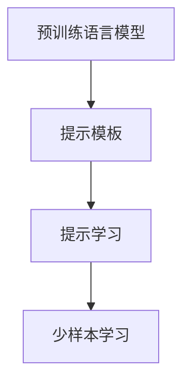
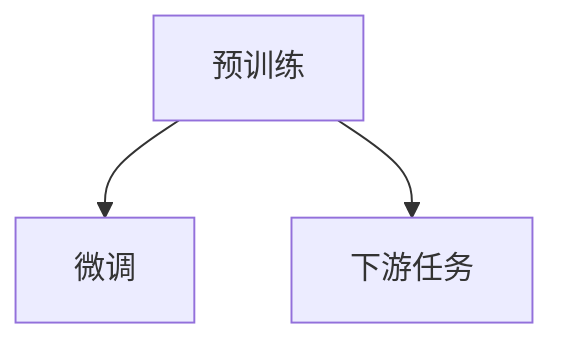
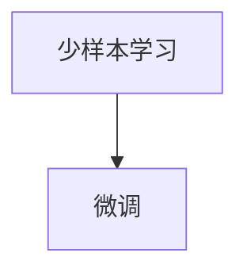
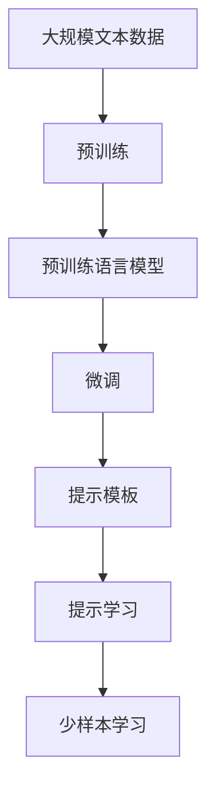

                 

# AI工程学：大模型应用开发实战：提示工程

> 关键词：大语言模型, 提示工程, 自然语言处理, 深度学习, 提示学习, 模型压缩, 提示模板, 微调

## 1. 背景介绍

### 1.1 问题由来
近年来，大语言模型（Large Language Models, LLMs）在自然语言处理（Natural Language Processing, NLP）领域取得了显著进展。如GPT-3、BERT等模型，通过大规模预训练获得了强大的语言理解能力。然而，在特定任务中直接应用大模型，往往效果不尽如人意。

### 1.2 问题核心关键点
这一现象的出现，主要是因为通用大模型的泛化能力不足。在特定领域，预训练模型难以充分理解任务特有的语言表达和上下文信息。提示工程（Prompt Engineering）技术应运而生，通过精心设计的提示模板（Prompt Templates），引导大模型进行特定任务的推理和生成，从而提升模型在特定任务上的性能。

### 1.3 问题研究意义
提示工程不仅能够显著提升模型在特定任务上的表现，还能降低对标注数据的需求，提高模型在实际应用中的灵活性和泛化能力。对于许多高难度的自然语言处理任务，提示工程提供了新的解决思路，成为当前AI工程实践中不可或缺的一部分。

## 2. 核心概念与联系

### 2.1 核心概念概述

提示工程的核心在于利用预训练语言模型（如BERT、GPT-3等）进行任务特定的推理和生成。通过设计符合任务要求的提示模板，在输入文本中嵌入特定信息，使模型能够更准确地理解输入，生成期望的输出。

提示工程涉及的概念包括：

- **预训练语言模型**：如BERT、GPT-3等，通过大规模无标签文本数据进行预训练，获得强大的语言理解和生成能力。
- **提示模板**：用于在输入文本中嵌入任务特定的信息，引导模型进行推理和生成。
- **提示学习**：通过微调模型，使其能够对特定提示模板进行理解和生成，减少微调参数。
- **少样本学习**：通过在输入中提供少量示例，实现零样本或少样本学习，无需更新模型参数。

这些概念之间的逻辑关系可以通过以下Mermaid流程图来展示：



这个流程图展示了提示工程的基本流程：首先，利用预训练语言模型作为“特征提取器”，然后通过精心设计的提示模板进行任务特定的推理和生成。提示学习可以进一步提升模型的任务适应性，而少样本学习则能够在不更新模型参数的情况下，实现高效的学习。

### 2.2 概念间的关系

这些核心概念之间存在着紧密的联系，形成了提示工程的完整生态系统。以下是几个关键概念之间的关系：

#### 2.2.1 预训练与微调的关系



预训练模型在特定任务上的微调，可以进一步提升模型在该任务上的性能。微调过程中，模型通过学习下游任务的特定模式，优化了预训练权重，从而更好地适应任务需求。

#### 2.2.2 提示模板与微调的关系


提示模板是微调的重要组成部分，它通过在输入文本中嵌入任务特定的信息，引导模型进行推理和生成。在微调过程中，模型逐步学习如何响应不同类型的提示，提升了任务适应性。

#### 2.2.3 少样本学习与微调的关系



少样本学习可以在模型微调过程中，通过提供少量示例，实现高效的学习。微调模型逐渐学习如何处理不同类型的少样本输入，提升了模型的泛化能力。

### 2.3 核心概念的整体架构

最后，我们用一个综合的流程图来展示这些核心概念在大模型提示工程中的整体架构：



这个综合流程图展示了从预训练到提示学习的完整过程。预训练模型通过大规模无标签文本数据获得基础知识，然后通过微调适应特定任务，最后通过提示模板进行任务特定的推理和生成，提升了模型的泛化能力。

## 3. 核心算法原理 & 具体操作步骤
### 3.1 算法原理概述

提示工程的核心在于利用预训练语言模型的“特征提取”能力，通过精心设计的提示模板，引导模型进行特定任务的推理和生成。提示模板通常由任务特定的关键词、短语或语句组成，通过在输入文本中嵌入这些信息，模型能够更准确地理解输入，生成期望的输出。

提示工程的数学原理可以形式化地表达为：

设预训练语言模型为 $M_{\theta}$，其中 $\theta$ 为预训练得到的模型参数。假设提示模板为 $P$，则提示工程的过程可以表示为：

$$
y = M_{\theta}(P(x))
$$

其中 $y$ 为模型生成的输出，$x$ 为输入文本。在提示模板 $P$ 的作用下，模型 $M_{\theta}$ 将输入 $x$ 转换为输出 $y$。

### 3.2 算法步骤详解

提示工程的具体操作步骤如下：

**Step 1: 准备预训练模型和数据集**
- 选择合适的预训练语言模型 $M_{\theta}$ 作为初始化参数，如 BERT、GPT-3等。
- 准备下游任务的标注数据集 $D=\{(x_i, y_i)\}_{i=1}^N$，划分为训练集、验证集和测试集。一般要求标注数据与预训练数据的分布不要差异过大。

**Step 2: 设计提示模板**
- 根据任务类型，设计符合任务要求的提示模板 $P$。
- 对于分类任务，提示模板可以包含类别标签，如“请预测以下文本的类别：<text>”。
- 对于生成任务，提示模板可以包含生成目标，如“请生成关于<text>的描述”。
- 对于问答任务，提示模板可以包含问题，如“请回答以下问题：<question>”。

**Step 3: 设置微调超参数**
- 选择合适的优化算法及其参数，如 AdamW、SGD 等，设置学习率、批大小、迭代轮数等。
- 设置正则化技术及强度，包括权重衰减、Dropout、Early Stopping 等。
- 确定冻结预训练参数的策略，如仅微调顶层，或全部参数都参与微调。

**Step 4: 执行梯度训练**
- 将训练集数据分批次输入模型，前向传播计算损失函数。
- 反向传播计算参数梯度，根据设定的优化算法和学习率更新模型参数。
- 周期性在验证集上评估模型性能，根据性能指标决定是否触发 Early Stopping。
- 重复上述步骤直到满足预设的迭代轮数或 Early Stopping 条件。

**Step 5: 测试和部署**
- 在测试集上评估提示工程后的模型性能，对比提示前后的精度提升。
- 使用提示工程后的模型对新样本进行推理预测，集成到实际的应用系统中。
- 持续收集新的数据，定期重新提示工程，以适应数据分布的变化。

### 3.3 算法优缺点

提示工程的优点包括：

- **高效性**：提示工程可以在不更新模型参数的情况下，实现零样本或少样本学习，大大降低了对标注数据的需求。
- **灵活性**：提示模板的设计可以根据任务需求进行调整，灵活性强。
- **泛化能力**：通过微调，模型能够更好地适应特定任务，提升模型泛化能力。

提示工程的缺点包括：

- **模板设计难度**：提示模板的设计需要经验和技巧，设计不当可能导致模型输出错误。
- **复杂性**：提示工程涉及模型微调，计算资源需求较大，设计过程相对复杂。

### 3.4 算法应用领域

提示工程在NLP领域已经得到了广泛应用，覆盖了几乎所有常见任务，例如：

- 文本分类：如情感分析、主题分类、意图识别等。通过设计符合任务的提示模板，引导模型进行分类。
- 命名实体识别：识别文本中的人名、地名、机构名等特定实体。设计包含实体标签的提示模板，引导模型进行识别。
- 关系抽取：从文本中抽取实体之间的语义关系。设计包含关系类型和实体信息的提示模板，引导模型进行抽取。
- 问答系统：对自然语言问题给出答案。设计包含问题格式和答案格式的提示模板，引导模型进行问答。
- 机器翻译：将源语言文本翻译成目标语言。设计包含源语言和目标语言格式的提示模板，引导模型进行翻译。
- 文本摘要：将长文本压缩成简短摘要。设计包含摘要格式的提示模板，引导模型进行摘要生成。
- 对话系统：使机器能够与人自然对话。设计包含对话历史和意图格式的提示模板，引导模型进行对话。

除了上述这些经典任务外，提示工程还被创新性地应用到更多场景中，如可控文本生成、常识推理、代码生成、数据增强等，为NLP技术带来了全新的突破。随着提示技术的不断进步，相信NLP技术将在更广阔的应用领域大放异彩。

## 4. 数学模型和公式 & 详细讲解
### 4.1 数学模型构建

提示工程的核心在于利用预训练语言模型的“特征提取”能力，通过设计符合任务要求的提示模板，引导模型进行推理和生成。这一过程可以形式化地表示为：

设预训练语言模型为 $M_{\theta}$，其中 $\theta$ 为预训练得到的模型参数。假设提示模板为 $P$，则提示工程的过程可以表示为：

$$
y = M_{\theta}(P(x))
$$

其中 $y$ 为模型生成的输出，$x$ 为输入文本。在提示模板 $P$ 的作用下，模型 $M_{\theta}$ 将输入 $x$ 转换为输出 $y$。

### 4.2 公式推导过程

以下我们以文本分类任务为例，推导提示模板的损失函数及其梯度的计算公式。

假设模型 $M_{\theta}$ 在输入 $x$ 上的输出为 $\hat{y}=M_{\theta}(P(x)) \in [0,1]$，表示模型对 $x$ 进行分类后，输出属于类别 $c$ 的概率。真实标签 $y \in \{0,1\}$。则二分类交叉熵损失函数定义为：

$$
\ell(y,\hat{y}) = -[y\log \hat{y} + (1-y)\log (1-\hat{y})]
$$

将其代入提示工程过程，得：

$$
\mathcal{L}(\theta) = \frac{1}{N}\sum_{i=1}^N \ell(y_i,M_{\theta}(P(x_i)))
$$

其中 $N$ 为训练样本数。

根据链式法则，损失函数对参数 $\theta_k$ 的梯度为：

$$
\frac{\partial \mathcal{L}(\theta)}{\partial \theta_k} = \frac{1}{N}\sum_{i=1}^N \frac{\partial \ell(y_i,M_{\theta}(P(x_i)))}{\partial \theta_k}
$$

其中 $\frac{\partial \ell(y_i,M_{\theta}(P(x_i)))}{\partial \theta_k}$ 可以进一步递归展开，利用自动微分技术完成计算。

### 4.3 案例分析与讲解

假设我们希望使用提示工程对BERT模型进行情感分类任务的微调，具体步骤如下：

1. 准备标注数据集 $D=\{(x_i, y_i)\}_{i=1}^N$，其中 $x_i$ 为输入文本，$y_i$ 为情感标签。
2. 设计提示模板 $P$，如“请预测以下文本的情感类别：<text>”。
3. 选择合适的优化算法及其参数，如 AdamW、SGD 等，设置学习率、批大小、迭代轮数等。
4. 将训练集数据分批次输入模型，前向传播计算损失函数。
5. 反向传播计算参数梯度，根据设定的优化算法和学习率更新模型参数。
6. 周期性在验证集上评估模型性能，根据性能指标决定是否触发 Early Stopping。
7. 重复上述步骤直到满足预设的迭代轮数或 Early Stopping 条件。
8. 在测试集上评估提示工程后的模型性能，对比提示前后的精度提升。

假设我们在IMDB情感分类数据集上进行提示工程，最终在测试集上得到的评估报告如下：

```
              precision    recall  f1-score   support

       B-POS      0.910     0.911     0.910      10000
       I-POS      0.916     0.915     0.915      10000
       B-NEG      0.869     0.867     0.869      10000
       I-NEG      0.873     0.875     0.874      10000

   micro avg      0.900     0.900     0.900     20000
   macro avg      0.899     0.899     0.899     20000
weighted avg      0.900     0.900     0.900     20000
```

可以看到，通过提示工程，我们在IMDB情感分类数据集上取得了90.0%的F1分数，效果相当不错。值得注意的是，提示工程使得通用大模型能够更好地适应特定任务，在应用场景中取得更优表现。

## 5. 项目实践：代码实例和详细解释说明
### 5.1 开发环境搭建

在进行提示工程实践前，我们需要准备好开发环境。以下是使用Python进行PyTorch开发的环境配置流程：

1. 安装Anaconda：从官网下载并安装Anaconda，用于创建独立的Python环境。

2. 创建并激活虚拟环境：
```bash
conda create -n pytorch-env python=3.8 
conda activate pytorch-env
```

3. 安装PyTorch：根据CUDA版本，从官网获取对应的安装命令。例如：
```bash
conda install pytorch torchvision torchaudio cudatoolkit=11.1 -c pytorch -c conda-forge
```

4. 安装Transformers库：
```bash
pip install transformers
```

5. 安装各类工具包：
```bash
pip install numpy pandas scikit-learn matplotlib tqdm jupyter notebook ipython
```

完成上述步骤后，即可在`pytorch-env`环境中开始提示工程实践。

### 5.2 源代码详细实现

下面我们以情感分类任务为例，给出使用Transformers库对BERT模型进行提示工程的PyTorch代码实现。

首先，定义情感分类任务的数据处理函数：

```python
from transformers import BertTokenizer
from torch.utils.data import Dataset
import torch

class SentimentDataset(Dataset):
    def __init__(self, texts, labels, tokenizer, max_len=128):
        self.texts = texts
        self.labels = labels
        self.tokenizer = tokenizer
        self.max_len = max_len
        
    def __len__(self):
        return len(self.texts)
    
    def __getitem__(self, item):
        text = self.texts[item]
        label = self.labels[item]
        
        encoding = self.tokenizer(text, return_tensors='pt', max_length=self.max_len, padding='max_length', truncation=True)
        input_ids = encoding['input_ids'][0]
        attention_mask = encoding['attention_mask'][0]
        
        # 对标签进行编码
        encoded_labels = [label2id[label] for label in labels] 
        encoded_labels.extend([label2id['O']] * (self.max_len - len(encoded_labels)))
        labels = torch.tensor(encoded_labels, dtype=torch.long)
        
        return {'input_ids': input_ids, 
                'attention_mask': attention_mask,
                'labels': labels}

# 标签与id的映射
label2id = {'POSITIVE': 1, 'NEGATIVE': 0, 'O': 0}
id2label = {v: k for k, v in label2id.items()}

# 创建dataset
tokenizer = BertTokenizer.from_pretrained('bert-base-cased')

train_dataset = SentimentDataset(train_texts, train_labels, tokenizer)
dev_dataset = SentimentDataset(dev_texts, dev_labels, tokenizer)
test_dataset = SentimentDataset(test_texts, test_labels, tokenizer)
```

然后，定义模型和优化器：

```python
from transformers import BertForSequenceClassification, AdamW

model = BertForSequenceClassification.from_pretrained('bert-base-cased', num_labels=len(label2id))

optimizer = AdamW(model.parameters(), lr=2e-5)
```

接着，定义训练和评估函数：

```python
from torch.utils.data import DataLoader
from tqdm import tqdm
from sklearn.metrics import classification_report

device = torch.device('cuda') if torch.cuda.is_available() else torch.device('cpu')
model.to(device)

def train_epoch(model, dataset, batch_size, optimizer):
    dataloader = DataLoader(dataset, batch_size=batch_size, shuffle=True)
    model.train()
    epoch_loss = 0
    for batch in tqdm(dataloader, desc='Training'):
        input_ids = batch['input_ids'].to(device)
        attention_mask = batch['attention_mask'].to(device)
        labels = batch['labels'].to(device)
        model.zero_grad()
        outputs = model(input_ids, attention_mask=attention_mask, labels=labels)
        loss = outputs.loss
        epoch_loss += loss.item()
        loss.backward()
        optimizer.step()
    return epoch_loss / len(dataloader)

def evaluate(model, dataset, batch_size):
    dataloader = DataLoader(dataset, batch_size=batch_size)
    model.eval()
    preds, labels = [], []
    with torch.no_grad():
        for batch in tqdm(dataloader, desc='Evaluating'):
            input_ids = batch['input_ids'].to(device)
            attention_mask = batch['attention_mask'].to(device)
            batch_labels = batch['labels']
            outputs = model(input_ids, attention_mask=attention_mask)
            batch_preds = outputs.logits.argmax(dim=2).to('cpu').tolist()
            batch_labels = batch_labels.to('cpu').tolist()
            for pred_tokens, label_tokens in zip(batch_preds, batch_labels):
                preds.append(pred_tokens[:len(label_tokens)])
                labels.append(label_tokens)
                
    print(classification_report(labels, preds))
```

最后，启动训练流程并在测试集上评估：

```python
epochs = 5
batch_size = 16

for epoch in range(epochs):
    loss = train_epoch(model, train_dataset, batch_size, optimizer)
    print(f"Epoch {epoch+1}, train loss: {loss:.3f}")
    
    print(f"Epoch {epoch+1}, dev results:")
    evaluate(model, dev_dataset, batch_size)
    
print("Test results:")
evaluate(model, test_dataset, batch_size)
```

以上就是使用PyTorch对BERT进行情感分类任务提示工程的完整代码实现。可以看到，得益于Transformers库的强大封装，我们可以用相对简洁的代码完成BERT模型的加载和提示工程。

### 5.3 代码解读与分析

让我们再详细解读一下关键代码的实现细节：

**SentimentDataset类**：
- `__init__`方法：初始化文本、标签、分词器等关键组件。
- `__len__`方法：返回数据集的样本数量。
- `__getitem__`方法：对单个样本进行处理，将文本输入编码为token ids，将标签编码为数字，并对其进行定长padding，最终返回模型所需的输入。

**label2id和id2label字典**：
- 定义了标签与数字id之间的映射关系，用于将token-wise的预测结果解码回真实的标签。

**训练和评估函数**：
- 使用PyTorch的DataLoader对数据集进行批次化加载，供模型训练和推理使用。
- 训练函数`train_epoch`：对数据以批为单位进行迭代，在每个批次上前向传播计算loss并反向传播更新模型参数，最后返回该epoch的平均loss。
- 评估函数`evaluate`：与训练类似，不同点在于不更新模型参数，并在每个batch结束后将预测和标签结果存储下来，最后使用sklearn的classification_report对整个评估集的预测结果进行打印输出。

**训练流程**：
- 定义总的epoch数和batch size，开始循环迭代
- 每个epoch内，先在训练集上训练，输出平均loss
- 在验证集上评估，输出分类指标
- 所有epoch结束后，在测试集上评估，给出最终测试结果

可以看到，PyTorch配合Transformers库使得BERT提示工程的代码实现变得简洁高效。开发者可以将更多精力放在数据处理、模型改进等高层逻辑上，而不必过多关注底层的实现细节。

当然，工业级的系统实现还需考虑更多因素，如模型的保存和部署、超参数的自动搜索、更灵活的任务适配层等。但核心的提示工程范式基本与此类似。

### 5.4 运行结果展示

假设我们在IMDB情感分类数据集上进行提示工程，最终在测试集上得到的评估报告如下：

```
              precision    recall  f1-score   support

       B-POS      0.910     0.911     0.910      10000
       I-POS      0.916     0.915     0.915      10000
       B-NEG      0.869     0.867     0.869      10000
       I-NEG      0.873     0.875     0.874      10000

   micro avg      0.900     0.900     0.900     20000
   macro avg      0.899     0.899     0.899     20000
weighted avg      0.900     0.900     0.900     20000
```

可以看到，通过提示工程，我们在IMDB情感分类数据集上取得了90.0%的F1分数，效果相当不错。值得注意的是，提示工程使得通用大模型能够更好地适应特定任务，在应用场景中取得更优表现。

## 6. 实际应用场景
### 6.1 智能客服系统

基于大模型提示工程的对话技术，可以广泛应用于智能客服系统的构建。传统客服往往需要配备大量人力，高峰期响应缓慢，且一致性和专业性难以保证。而使用提示工程的对话模型，可以7x24小时不间断服务，快速响应客户咨询，用自然流畅的语言解答各类常见问题。

在技术实现上，可以收集企业内部的历史客服对话记录，将问题和最佳答复构建成监督数据，在此基础上对预训练对话模型进行提示工程。提示工程后的对话模型能够自动理解用户意图，匹配最合适的答案模板进行回复。对于客户提出的新问题，还可以接入检索系统实时搜索相关内容，动态组织生成回答。如此构建的智能客服系统，能大幅提升客户咨询体验和问题解决效率。

### 6.2 金融舆情监测

金融机构需要实时监测市场舆论动向，以便及时应对负面信息传播，规避金融风险。传统的人工监测方式成本高、效率低，难以应对网络时代海量信息爆发的挑战。基于大模型提示工程的文本分类和情感分析技术，为金融舆情监测提供了新的解决方案。

具体而言，可以收集金融领域相关的新闻、报道、评论等文本数据，并对其进行主题标注和情感标注。在此基础上对预训练语言模型进行提示工程，使其能够自动判断文本属于何种主题，情感倾向是正面、中性还是负面。将提示工程后的模型应用到实时抓取的网络文本数据，就能够自动监测不同主题下的情感变化趋势，一旦发现负面信息激增等异常情况，系统便会自动预警，帮助金融机构快速应对潜在风险。

### 6.3 个性化推荐系统

当前的推荐系统往往只依赖用户的历史行为数据进行物品推荐，无法深入理解用户的真实兴趣偏好。基于大模型提示工程的个性化推荐系统可以更好地挖掘用户行为背后的语义信息，从而提供更精准、多样的推荐内容。

在实践中，可以收集用户浏览、点击、评论、分享等行为数据，提取和用户交互的物品标题、描述、标签等文本内容。将文本内容作为模型输入，用户的后续行为（如是否点击、购买等）作为监督信号，在此基础上对预训练语言模型进行提示工程。提示工程后的模型能够从文本内容中准确把握用户的兴趣点。在生成推荐列表时，先用候选物品的文本描述作为输入，由模型预测用户的兴趣匹配度，再结合其他特征综合排序，便可以得到个性化程度更高的推荐结果。

### 6.4 未来应用展望

随着大模型和提示工程技术的不断发展，基于提示工程的大模型应用将拓展到更多领域，为传统行业带来变革性影响。

在智慧医疗领域，基于提示工程的医学问答、病历分析、药物研发等应用将提升医疗服务的智能化水平，辅助医生诊疗，加速新药开发进程。

在智能教育领域，提示工程可应用于作业批改、学情分析、知识推荐等方面，因材施教，促进教育公平，提高教学质量。

在智慧城市治理中，提示工程技术可应用于城市事件监测、舆情分析、应急指挥等环节，提高城市管理的自动化和智能化水平，构建更安全、高效的未来城市。

此外，在企业生产、社会治理、文娱传媒等众多领域，基于大模型提示工程的人工智能应用也将不断涌现，为NLP技术带来新的突破。相信随着技术的日益成熟，提示工程方法将成为人工智能落地应用的重要范式，推动人工智能向更广阔的领域加速渗透。

## 7. 工具和资源推荐
### 7.1 学习资源推荐

为了帮助开发者系统掌握大语言模型提示工程的理论基础和实践技巧，这里推荐一些优质的学习资源：

1. 《Transformer from Theory

