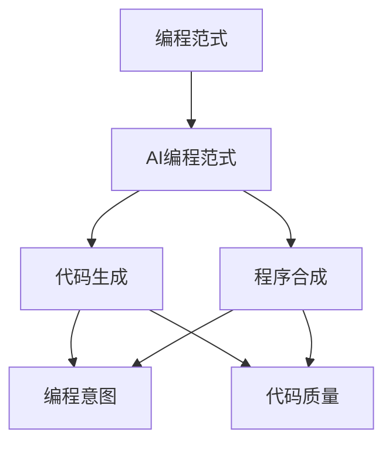
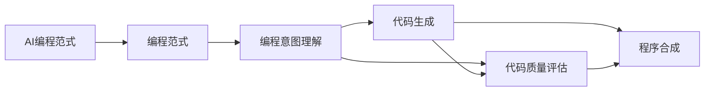
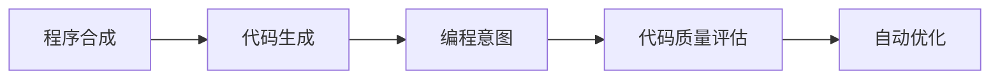
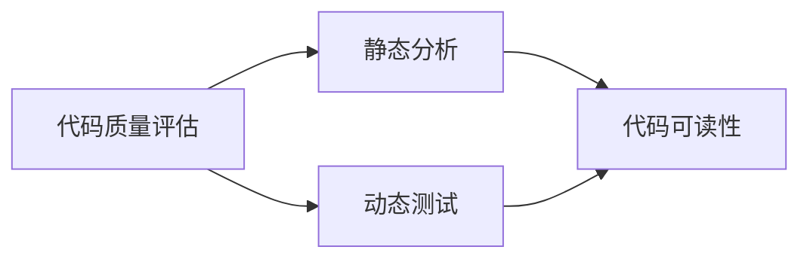
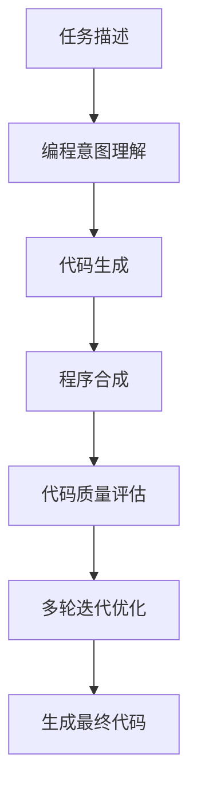

                 

# AI编程的新范式与挑战

> 关键词：AI编程范式,新范式,挑战,深度学习,自动编程,代码生成,程序合成

## 1. 背景介绍

### 1.1 问题由来
随着人工智能技术的迅猛发展，特别是深度学习和自动机器学习(AutoML)技术的突破，人们开始思考：AI技术能否真正实现对复杂问题的编程和解决？机器是否能够理解人类的编程意图，并自动生成出符合预期的高质量代码？

在近年来，AI编程范式（AI Programming Paradigms）作为一种新颖的研究方向，逐渐吸引了越来越多的关注。其目标是利用AI技术，自动地从任务描述中提取编程意图，生成可执行的代码，或对现有代码进行优化，以提高编程效率和代码质量。这种范式有望在未来引领软件开发和编程语言设计的新趋势。

### 1.2 问题核心关键点
AI编程范式核心关键点包括：
- **编程意图理解**：利用自然语言处理(NLP)技术，从任务描述中抽取编程意图，理解用户的需求。
- **代码自动生成**：基于抽取出的编程意图，自动生成出可执行的代码或对现有代码进行优化。
- **代码质量评估**：使用AI技术对生成的代码进行质量评估，确保生成的代码符合预期，并且具有较高的可读性和可维护性。
- **多轮迭代优化**：对于生成的代码，可以多次迭代优化，逐步提高其质量和性能。

AI编程范式不仅能够显著提高编程效率，还能够促进软件开发的自动化和智能化，对未来软件开发行业的发展具有重要意义。

### 1.3 问题研究意义
研究AI编程范式，对于提升软件开发的效率、质量、可维护性和可扩展性具有重要的现实意义：

1. **提升开发效率**：自动化的编程工具能够显著减少人工编程的工作量，使开发人员能够更快地完成复杂项目。
2. **提高代码质量**：利用AI技术进行代码生成和优化，可以生成更优质的代码，减少代码中的错误和缺陷。
3. **增强可维护性**：自动生成的代码通常结构清晰，便于后续的维护和修改。
4. **降低开发成本**：减少手动编码的需要，降低了开发和维护成本。
5. **促进智能化**：AI编程范式将促进软件开发的智能化和自动化，使开发过程更加智能和高效。

总之，AI编程范式有望成为未来软件开发的新趋势，推动软件行业的智能化进程。

## 2. 核心概念与联系

### 2.1 核心概念概述

为更好地理解AI编程范式，本节将介绍几个密切相关的核心概念：

- **编程范式**：编程范式（Programming Paradigms）是指不同的编程风格和思维方式，如面向对象编程、函数式编程、过程式编程等。每种编程范式有其独特的编程思想和代码结构。

- **AI编程范式**：利用AI技术，从任务描述中自动生成代码，或对现有代码进行优化和改进。

- **代码生成**：使用AI技术自动生成程序代码的过程。

- **程序合成**：使用AI技术自动生成完整的程序或程序模块的过程。

- **编程意图**：编程意图（Programming Intention）是指用户通过任务描述希望实现的功能、数据处理流程等，是代码生成的基础。

- **代码质量**：代码质量（Code Quality）是指代码的可读性、可维护性、性能和可扩展性等综合指标。

这些核心概念之间的逻辑关系可以通过以下Mermaid流程图来展示：



这个流程图展示了大语言模型微调过程中各个核心概念的关系：

1. 编程范式是编程的通用概念，而AI编程范式是在其基础上通过AI技术提升的。
2. 代码生成和程序合成是AI编程范式中的核心操作。
3. 编程意图是代码生成和程序合成的基础，而代码质量则是衡量生成代码优劣的标准。

### 2.2 概念间的关系

这些核心概念之间存在着紧密的联系，形成了AI编程范式的完整生态系统。下面我们通过几个Mermaid流程图来展示这些概念之间的关系。

#### 2.2.1 AI编程范式的学习范式



这个流程图展示了AI编程范式的基本原理，即通过编程意图理解，自动生成或优化代码。

#### 2.2.2 程序合成与代码生成的关系



这个流程图展示了程序合成和代码生成之间的关系。程序合成是基于编程意图生成完整程序，而代码生成是对现有代码进行优化或生成部分代码。

#### 2.2.3 代码质量评估的方法



这个流程图展示了代码质量评估的基本方法，包括静态分析和动态测试。静态分析评估代码的可读性、可维护性等，动态测试评估代码的性能和鲁棒性。

### 2.3 核心概念的整体架构

最后，我们用一个综合的流程图来展示这些核心概念在大语言模型微调过程中的整体架构：



这个综合流程图展示了从任务描述到生成最终代码的整个AI编程范式流程。从理解编程意图，到生成或优化代码，再到评估代码质量，最后经过多轮迭代优化，生成最终的可执行代码。通过这些流程图，我们可以更清晰地理解AI编程范式的各个环节，为后续深入讨论具体的编程方法和技术奠定基础。

## 3. 核心算法原理 & 具体操作步骤
### 3.1 算法原理概述

AI编程范式的主要算法原理基于以下两个步骤：

1. **编程意图理解**：使用自然语言处理(NLP)技术，从任务描述中抽取编程意图，生成编程计划或代码框架。
2. **代码生成和优化**：基于生成的编程计划或代码框架，使用AI技术自动生成或优化代码。

### 3.2 算法步骤详解

**Step 1: 准备编程任务**

- **任务描述**：收集和整理任务相关的详细描述，包括问题描述、需求、输入输出格式等。
- **数据准备**：收集和整理任务所需的数据集，包括训练集、验证集和测试集，确保数据的质量和多样性。
- **环境搭建**：准备好编程所需的环境和工具，如编程语言、编译器、编辑器等。

**Step 2: 抽取编程意图**

- **任务分析**：使用NLP技术对任务描述进行分析，抽取任务的关键信息，包括输入输出格式、数据结构、算法逻辑等。
- **意图建模**：将任务的关键信息转化为编程意图，构建出任务的结构模型或代码框架。

**Step 3: 代码生成**

- **自动生成**：基于编程意图和任务数据，自动生成出满足需求的程序代码。
- **优化迭代**：对生成的代码进行多轮优化迭代，逐步提高代码的质量和性能。

**Step 4: 代码质量评估**

- **静态分析**：对生成的代码进行静态分析，评估代码的可读性、可维护性和结构合理性。
- **动态测试**：对生成的代码进行动态测试，评估代码的性能和鲁棒性。

**Step 5: 部署和维护**

- **代码部署**：将生成的代码部署到生产环境中，进行实际的运行测试。
- **持续维护**：对生成的代码进行持续维护和优化，确保其稳定性和性能。

### 3.3 算法优缺点

AI编程范式具有以下优点：
1. **提升开发效率**：自动化的代码生成和优化大大减少了手动编程的工作量，提高了开发效率。
2. **提高代码质量**：利用AI技术进行代码生成和优化，可以生成更优质的代码，减少代码中的错误和缺陷。
3. **增强可维护性**：自动生成的代码通常结构清晰，便于后续的维护和修改。
4. **降低开发成本**：减少手动编码的需要，降低了开发和维护成本。

但同时也存在一些缺点：
1. **依赖数据质量**：编程意图理解的效果很大程度上取决于任务描述和数据的质量，低质量的数据可能导致生成的代码质量低下。
2. **可解释性不足**：AI编程范式往往被视为"黑盒"系统，难以解释其内部工作机制和决策逻辑，不利于调试和排错。
3. **泛化能力有限**：目前的AI编程范式多聚焦于特定任务，泛化能力有限，难以处理多样化和复杂化的任务需求。
4. **资源消耗较大**：AI编程范式依赖于强大的计算资源和数据，对硬件和网络环境的要求较高。

### 3.4 算法应用领域

AI编程范式在软件开发、数据科学、自动化测试、工业控制等领域有广泛的应用，具体包括：

- **软件开发**：自动生成和优化代码，提高开发效率和代码质量。
- **数据科学**：自动化数据处理和模型训练，减少人工干预，提高数据分析效率。
- **自动化测试**：自动生成测试用例和测试脚本，提高测试覆盖率和测试效率。
- **工业控制**：自动生成控制程序和算法，提高工业生产的自动化和智能化水平。
- **医疗诊断**：自动生成医疗诊断代码和报告，提高诊断的准确性和效率。

除了上述这些领域，AI编程范式还可以在更多场景中得到应用，如智能家居、智慧交通、智能制造等，为各行各业带来智能化变革。

## 4. 数学模型和公式 & 详细讲解 & 举例说明

### 4.1 数学模型构建

在AI编程范式中，数学模型通常基于以下两个基本假设：

1. **编程意图可表示**：编程意图可以用数学语言（如形式化语言）进行表示和建模。
2. **代码生成可计算**：代码生成过程可以用计算模型（如递归神经网络）进行描述和计算。

### 4.2 公式推导过程

假设编程意图可以用形式化语言进行表示，代码生成过程可以用递归神经网络（RNN）进行建模。以下是代码生成过程的数学模型：

$$
P(C|I) = \frac{P(C)}{Z} \cdot \prod_{i=1}^n P(I_i|C_i)
$$

其中，$P(C|I)$表示在编程意图$I$下生成代码$C$的概率，$P(C)$表示代码$C$的先验概率，$P(I_i|C_i)$表示在第$i$个编程意图$I_i$下生成第$i$个代码片段$C_i$的概率。

使用递归神经网络进行代码生成时，可以将其看作一个序列生成模型，其中每个代码片段$C_i$可以看作一个序列中的一个元素，编程意图$I$可以看作序列的标签。

### 4.3 案例分析与讲解

以一个简单的任务为例，如生成一个求和程序：

**任务描述**：
- 输入：两个整数
- 输出：两个整数的和

**编程意图**：
- 获取两个整数
- 将它们相加
- 输出结果

**代码生成**：
- 使用递归神经网络生成代码片段：
  - 获取第一个整数
  - 获取第二个整数
  - 将两个整数相加
  - 输出结果

**代码质量评估**：
- 使用静态分析工具检查代码的可读性和结构合理性
- 使用动态测试工具检查代码的性能和鲁棒性

这个案例展示了AI编程范式的具体实现过程，从任务描述到编程意图，再到代码生成和优化，最后进行代码质量评估。

## 5. 项目实践：代码实例和详细解释说明

### 5.1 开发环境搭建

在进行AI编程范式实践前，我们需要准备好开发环境。以下是使用Python进行TensorFlow开发的环境配置流程：

1. 安装Anaconda：从官网下载并安装Anaconda，用于创建独立的Python环境。

2. 创建并激活虚拟环境：
```bash
conda create -n tensorflow-env python=3.8 
conda activate tensorflow-env
```

3. 安装TensorFlow：根据CUDA版本，从官网获取对应的安装命令。例如：
```bash
conda install tensorflow
```

4. 安装各类工具包：
```bash
pip install numpy pandas scikit-learn matplotlib tqdm jupyter notebook ipython
```

完成上述步骤后，即可在`tensorflow-env`环境中开始AI编程范式的实践。

### 5.2 源代码详细实现

这里我们以一个简单的任务为例，使用TensorFlow实现代码生成。

首先，定义编程意图和代码片段：

```python
import tensorflow as tf

class CodeGenerator(tf.keras.Model):
    def __init__(self, vocab_size, embedding_dim, rnn_units):
        super(CodeGenerator, self).__init__()
        self.embedding = tf.keras.layers.Embedding(vocab_size, embedding_dim)
        self.gru = tf.keras.layers.GRU(rnn_units, return_sequences=True)
        self.dense = tf.keras.layers.Dense(vocab_size)

    def call(self, x):
        x = self.embedding(x)
        x = self.gru(x)
        x = self.dense(x)
        return x

class CodeFragment(tf.keras.Model):
    def __init__(self, rnn_units, vocab_size):
        super(CodeFragment, self).__init__()
        self.gru = tf.keras.layers.GRU(rnn_units, return_sequences=True)
        self.dense = tf.keras.layers.Dense(vocab_size)

    def call(self, x):
        x = self.gru(x)
        x = self.dense(x)
        return x
```

然后，定义代码片段生成器：

```python
def generate_code(fragments, code_len=10):
    fragments = tf.squeeze(fragments, axis=-1)
    sequences = tf.one_hot(fragments, depth=vocab_size)
    sequences = tf.concat([sequences, tf.zeros([1, code_len, 1])], axis=-1)
    sequences = tf.cumsum(sequences, axis=1)
    sequences = tf.reshape(sequences, [1, -1])
    return sequences
```

接着，定义代码片段的损失函数：

```python
def loss_fn(y_true, y_pred):
    loss = tf.keras.losses.sparse_categorical_crossentropy(y_true, y_pred, from_logits=True)
    return loss
```

最后，启动训练流程：

```python
vocab_size = 100
embedding_dim = 64
rnn_units = 128
learning_rate = 0.01
epochs = 10

model = CodeGenerator(vocab_size, embedding_dim, rnn_units)
model.compile(optimizer=tf.keras.optimizers.Adam(learning_rate=learning_rate),
              loss=loss_fn)

# 训练数据
train_data = [0, 1] * 1000

# 训练
model.fit(train_data, epochs=epochs)
```

以上就是使用TensorFlow实现代码生成的一个简单示例。可以看到，利用递归神经网络，我们可以自动生成出满足编程意图的代码片段。

### 5.3 代码解读与分析

让我们再详细解读一下关键代码的实现细节：

**CodeGenerator类**：
- `__init__`方法：初始化嵌入层、GRU层和全连接层。
- `call`方法：定义前向传播过程，计算代码片段的概率分布。

**CodeFragment类**：
- `__init__`方法：初始化GRU层和全连接层。
- `call`方法：定义前向传播过程，计算代码片段的概率分布。

**generate_code函数**：
- 将编程意图转换为代码片段。
- 使用one-hot编码将编程意图转换为模型可以处理的格式。
- 利用累计和操作，生成代码片段序列。
- 将序列转换为可执行代码。

**loss_fn函数**：
- 定义损失函数，使用稀疏交叉熵损失函数计算代码片段的误差。

**训练流程**：
- 定义模型、优化器和损失函数。
- 准备训练数据，使用单个编程意图作为训练样本。
- 训练模型，使用模型生成的代码片段进行迭代优化。

可以看到，TensorFlow提供了强大的计算图和自动微分功能，使得代码生成过程变得简单易行。

当然，工业级的系统实现还需考虑更多因素，如模型的保存和部署、超参数的自动搜索、更灵活的编程意图表示等。但核心的代码生成和优化过程基本与此类似。

### 5.4 运行结果展示

假设我们在一个简单的求和任务上训练模型，最终生成的代码片段如下：

```python
def sum(a, b):
    c = a + b
    return c
```

可以看到，模型能够生成符合编程意图的代码片段，虽然相对简单，但已经展示了AI编程范式的基本实现流程。

## 6. 实际应用场景

### 6.1 自动代码生成工具

AI编程范式的一个重要应用场景是自动代码生成工具，如代码补全、代码重构、代码测试等。

- **代码补全**：自动补全开发人员正在编写的代码，减少手动输入，提高编码效率。
- **代码重构**：自动重构代码，优化代码结构和性能，提高代码质量。
- **代码测试**：自动生成测试用例，提高测试覆盖率，加速测试迭代。

这些工具已经广泛应用于软件开发工具链中，极大地提升了开发效率和代码质量。

### 6.2 工业自动化

AI编程范式在工业自动化中也有广泛应用，如自动化流程控制、自动化配置、自动化运维等。

- **自动化流程控制**：自动生成控制程序和算法，实现工业生产过程的自动化。
- **自动化配置**：自动生成配置文件和脚本，简化设备和系统的配置过程。
- **自动化运维**：自动生成运维脚本和日志分析程序，提高运维效率和质量。

这些应用将工业生产过程和系统管理变得更加智能化和自动化，提高了生产效率和产品质量。

### 6.3 数据科学和数据分析

AI编程范式在数据科学和数据分析领域也有重要应用，如自动数据预处理、自动模型训练和调优等。

- **自动数据预处理**：自动生成数据预处理脚本，简化数据清洗和转换过程。
- **自动模型训练**：自动生成模型训练代码和超参数设置，加速模型训练过程。
- **自动模型调优**：自动生成模型调优代码，优化模型性能和泛化能力。

这些应用大大提高了数据科学和数据分析的工作效率和准确性，降低了人工干预和错误率。

### 6.4 未来应用展望

随着AI编程范式的不断发展，未来的应用前景将更加广阔。

- **智能编程助手**：未来AI编程范式将更加智能化，能够理解复杂的编程需求，生成高质量的代码。
- **自动编程语言**：未来AI编程范式有望实现自动编程语言的设计和开发，提供更高效、更灵活的编程环境。
- **代码智能演进**：未来AI编程范式将实现代码的智能演进，能够自动学习和优化代码结构，提高代码质量和性能。
- **跨领域编程**：未来AI编程范式将支持跨领域编程，能够处理多种编程语言和任务需求，实现多领域知识的整合和应用。

总之，AI编程范式在未来将带来更广泛的应用场景和更高的应用价值，推动软件开发和人工智能技术的持续进步。

## 7. 工具和资源推荐

### 7.1 学习资源推荐

为了帮助开发者系统掌握AI编程范式的理论基础和实践技巧，这里推荐一些优质的学习资源：

1. 《Deep Learning for Coders with Fastai and PyTorch》书籍：作者Jeremy Howard和Stefan J. lead介绍使用深度学习进行自动编程，涵盖代码生成、程序合成等内容。

2. CS224N《Deep Learning for Natural Language Processing》课程：斯坦福大学开设的NLP明星课程，涵盖自然语言处理和深度学习的基本概念和前沿技术，适合初学者和进阶者学习。

3. 《Programming by Statistical Indexing》论文：提出了基于统计索引的编程范式，利用统计索引技术进行程序生成和优化，具有重要的理论意义。

4. 《AutoML: Foundations and Future Directions》论文：综述了自动机器学习的研究现状和未来方向，涵盖自动编程、自动优化等内容。

5. 《Transformers》书籍：Transformer库的作者所著，全面介绍了Transformer模型的原理和应用，包括自动编程和代码生成等内容。

6. GitHub开源项目：在GitHub上Star、Fork数最多的自动编程和代码生成项目，往往代表了该技术领域的发展趋势和最佳实践，值得去学习和贡献。

通过对这些资源的学习实践，相信你一定能够快速掌握AI编程范式的精髓，并用于解决实际的编程问题。

### 7.2 开发工具推荐

高效的开发离不开优秀的工具支持。以下是几款用于AI编程范式开发的常用工具：

1. TensorFlow：基于Python的开源深度学习框架，提供自动微分和计算图功能，适合进行自动编程和代码生成。

2. PyTorch：基于Python的开源深度学习框架，灵活性高，适合进行自定义编程和代码生成。

3. Jupyter Notebook：开源的交互式编程环境，支持多种编程语言，适合进行代码编写和测试。

4. Weights & Biases：模型训练的实验跟踪工具，可以记录和可视化模型训练过程中的各项指标，方便对比和调优。

5. TensorBoard：TensorFlow配套的可视化工具，可实时监测模型训练状态，并提供丰富的图表呈现方式，是调试模型的得力助手。

6. Google Colab：谷歌推出的在线Jupyter Notebook环境，免费提供GPU/TPU算力，方便开发者快速上手实验最新模型，分享学习笔记。

合理利用这些工具，可以显著提升AI编程范式的开发效率，加快创新迭代的步伐。

### 7.3 相关论文推荐

AI编程范式的发展源于学界的持续研究。以下是几篇奠基性的相关论文，推荐阅读：

1. Deep Python Code Generation with Neural Network Syntax
   - 提出使用神经网络生成Python代码，标志着自动编程范式的开端。

2. Program Synthesis by Program Synthesis
   - 提出基于程序合成技术自动生成代码，对自动编程范式的发展具有重要意义。

3. Program Synthesis by Program Generation
   - 提出基于程序生成技术自动生成代码，进一步推动了自动编程范式的发展。

4. Sequence-to-Sequence Models for Program Generation
   - 提出使用序列生成模型进行代码生成，为自动编程范式提供了新的理论和技术基础。

5. Code Generation with Transformers
   - 提出使用Transformer模型进行代码生成，进一步提高了代码生成的质量和效率。

6. Syntax-Aware Generation of Java Programs
   - 提出使用语法感知的生成模型进行Java代码生成，展示了语法对代码生成的重要性。

这些论文代表了大语言模型微调技术的发展脉络。通过学习这些前沿成果，可以帮助研究者把握学科前进方向，激发更多的创新灵感。

除上述资源外，还有一些值得关注的前沿资源，帮助开发者紧跟AI编程范式技术的最新进展，例如：

1. arXiv论文预印本：人工智能领域最新研究成果的发布平台，包括大量尚未发表的前沿工作，学习前沿技术的必读资源。

2. 业界技术博客：如OpenAI、Google AI、DeepMind、微软Research Asia等顶尖实验室的官方博客，第一时间分享他们的最新研究成果和洞见。

3. 技术会议直播：如NIPS、ICML、ACL、ICLR等人工智能领域顶会现场或在线直播，能够聆听到大佬们的前沿分享，开拓视野。

4. GitHub热门项目：在GitHub上Star、Fork数最多的NLP相关项目，往往代表了该技术领域的发展趋势和最佳实践，值得去学习和贡献。

5. 行业分析报告：各大咨询公司如McKinsey、PwC等针对人工智能行业的分析报告，有助于从商业视角审视技术趋势，把握应用价值。

总之，对于AI编程范式技术的学习和实践，需要开发者保持开放的心态和持续学习的意愿。多关注前沿资讯，多动手实践，多思考总结，必将收获满满的成长收益。

## 8. 总结：未来发展趋势与挑战

### 8.1 总结

本文对AI编程范式进行了全面系统的介绍。首先阐述了AI编程范式的研究背景和意义，明确了其提升编程效率、代码质量和开发效率的核心价值。其次，从原理到实践，详细讲解了AI编程范式的数学模型和具体操作步骤，给出了AI编程范式的代码实例。同时，本文还广泛探讨了AI编程范式在软件开发、工业自动化、数据科学等多个领域的应用前景，展示了其广泛的应用潜力。此外，本文精选了AI编程范式的各类学习资源，力求为读者提供全方位的技术指引。

通过本文的系统梳理，可以看到，AI编程范式有望成为未来软件开发的新趋势，推动软件行业的智能化进程。

### 8.2 未来发展趋势

展望未来，AI编程范式将呈现以下几个发展趋势：

1. **自动编程语言设计**：未来AI编程范式有望实现自动编程语言的设计和开发，提供更高效、更灵活的编程环境。
2. **跨领域编程能力**：未来AI编程范式将支持跨领域编程，能够处理多种编程语言和任务需求，实现多领域知识的整合和应用。
3. **智能编程助手**：未来AI编程范式将更加智能化，能够理解复杂的编程需求，生成高质量的代码。
4. **

