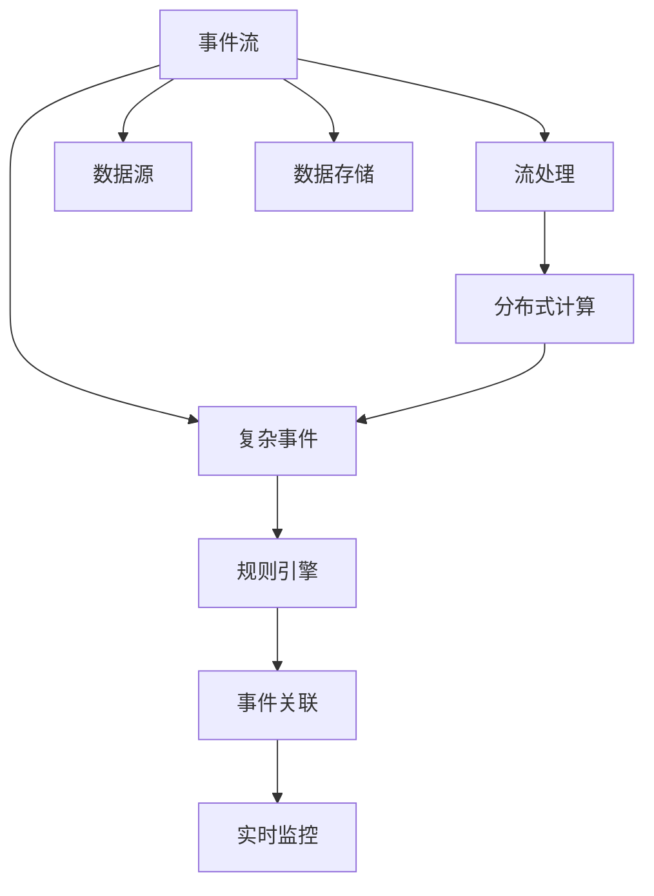
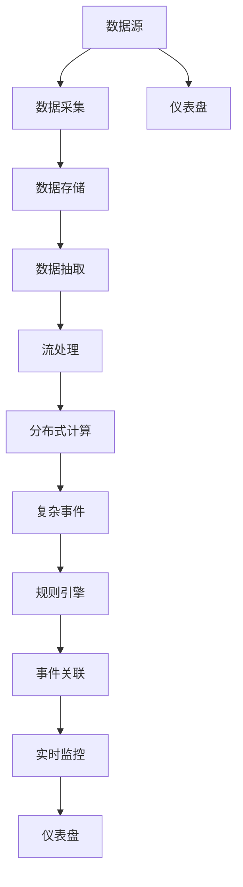

                 

# CEP 原理与代码实例讲解

> 关键词：Complex Event Processing, CEP引擎,分布式计算,流处理,复杂事件,实时监控,规则引擎,事件关联,SQL实现

## 1. 背景介绍

### 1.1 问题由来

在当今数据驱动的商业环境中，实时数据处理和分析的需求日益增加。企业希望通过实时监控和分析各种数据流，以获得洞察力并做出快速决策。复杂事件处理（Complex Event Processing, CEP）技术应运而生，用于实时检测和分析复杂事件，帮助企业洞察数据趋势，发现潜在的商业机会或风险。

传统的数据处理系统如关系型数据库、数据仓库等，无法满足实时数据处理的需求。因此，复杂事件处理技术成为数据科学领域的一个热门话题。CEP旨在实时地处理、分析和关联事件，以便企业能够即时做出反应。

### 1.2 问题核心关键点

CEP的核心在于检测和分析复杂事件，识别数据流中的模式和趋势，并根据特定规则自动执行响应。CEP的关键点包括：

- 事件流的实时处理：CEP系统必须能够处理和分析大量实时产生的数据流。
- 事件的关联分析：CEP系统能够分析事件之间的关联，识别复杂事件。
- 规则引擎的灵活应用：CEP系统使用规则引擎来定义和处理事件，规则引擎可以根据不同的业务需求进行配置。
- 高度可扩展性和弹性：CEP系统必须能够水平扩展以处理大量数据，并具备弹性，以应对数据量突然增加或减少的情况。

### 1.3 问题研究意义

CEP技术的应用可以带来显著的业务价值：

1. 提高业务洞察力：CEP能够实时地分析数据流，快速识别潜在的业务机会或风险，从而提高企业的决策速度和准确性。
2. 优化运营效率：通过自动化的流程和规则，CEP系统可以显著提高企业的运营效率和响应速度。
3. 增强竞争优势：实时数据处理和分析可以帮助企业更快地响应市场变化，保持竞争优势。
4. 降低运营成本：通过自动化和智能化的处理，CEP系统可以减少人力资源的投入，降低运营成本。

## 2. 核心概念与联系

### 2.1 核心概念概述

为更好地理解CEP系统的构建和运作，本节将介绍几个关键概念：

- 复杂事件：由多个简单事件组成，用于描述业务中的特定场景。例如，“在3小时内，同一个用户的购买金额超过了10元”。
- 事件流：由一系列时间序列的数据组成，可以是日志、传感器数据、交易数据等。
- 规则引擎：用于定义和执行复杂事件处理规则，可以基于正则表达式、SQL、流程语言等。
- 流处理：一种数据处理方式，用于实时地处理和分析事件流，通常使用流处理框架如Apache Flink、Apache Kafka等。
- 分布式计算：通过多台计算机并行处理数据，提高数据处理的效率和可靠性。
- 事件关联：识别和分析事件之间的关联关系，以识别复杂事件。

这些核心概念之间存在紧密的联系，形成了一个完整的CEP系统。

### 2.2 概念间的关系

这些核心概念之间的关系可以通过以下Mermaid流程图来展示：



这个流程图展示了CEP系统的核心组成：

1. 数据源：产生事件流的系统，如传感器、日志文件等。
2. 数据存储：存储事件流的系统，如数据库、文件系统等。
3. 流处理：实时处理和分析事件流。
4. 分布式计算：多台计算机并行处理数据，提高处理效率。
5. 复杂事件：由多个简单事件组成的事件模式。
6. 规则引擎：定义和执行复杂事件处理规则。
7. 事件关联：识别和分析事件之间的关联关系。
8. 实时监控：通过CEP系统，实时监控业务数据流。

### 2.3 核心概念的整体架构

最后，我们用一个综合的流程图来展示这些核心概念在大规模CEP系统中的整体架构：



这个综合流程图展示了CEP系统的数据流向：

1. 数据源：产生事件流。
2. 数据采集：收集事件流数据。
3. 数据存储：存储事件流数据。
4. 数据抽取：从存储中提取事件流。
5. 流处理：实时处理和分析事件流。
6. 分布式计算：多台计算机并行处理数据。
7. 复杂事件：由多个简单事件组成的事件模式。
8. 规则引擎：定义和执行复杂事件处理规则。
9. 事件关联：识别和分析事件之间的关联关系。
10. 实时监控：实时监控业务数据流。
11. 仪表盘：展示实时监控结果。

## 3. 核心算法原理 & 具体操作步骤

### 3.1 算法原理概述

CEP算法主要包括以下几个步骤：

1. 数据采集和存储：收集事件流数据，并将其存储在分布式系统中。
2. 数据抽取和流处理：从存储中提取事件流，并使用流处理框架实时处理和分析数据。
3. 复杂事件的检测：识别和分析事件之间的关联关系，检测复杂事件。
4. 规则引擎的处理：使用规则引擎定义和执行复杂事件处理规则。
5. 事件关联的识别：识别和分析事件之间的关联关系。
6. 实时监控和响应：实时监控业务数据流，并根据规则自动执行响应。

### 3.2 算法步骤详解

#### 3.2.1 数据采集和存储

CEP系统的第一步是数据采集和存储。可以使用多种数据采集工具和技术，如Apache Kafka、Apache Flume等。数据存储通常使用分布式文件系统或数据库，如Hadoop、Cassandra等。

数据采集和存储的流程如下：

1. 数据源：如传感器、日志文件、交易数据等。
2. 数据采集：使用Apache Kafka等工具，将数据流从数据源采集到系统中。
3. 数据存储：使用Hadoop或Cassandra等分布式文件系统，存储数据流数据。

#### 3.2.2 数据抽取和流处理

数据抽取和流处理是CEP系统的核心步骤。使用流处理框架如Apache Flink、Apache Spark等，实时处理和分析事件流。

数据抽取和流处理的流程如下：

1. 数据存储：存储数据流数据。
2. 数据抽取：从存储中抽取事件流数据。
3. 流处理：使用Apache Flink等流处理框架，实时处理和分析事件流数据。
4. 分布式计算：多台计算机并行处理数据，提高处理效率。

#### 3.2.3 复杂事件的检测

复杂事件的检测是CEP系统的关键步骤。CEP系统通过识别和分析事件之间的关联关系，检测复杂事件。

复杂事件的检测流程如下：

1. 流处理：实时处理和分析事件流数据。
2. 复杂事件：由多个简单事件组成的事件模式。
3. 规则引擎：定义和执行复杂事件处理规则。
4. 事件关联：识别和分析事件之间的关联关系。
5. 复杂事件的检测：通过规则引擎，检测复杂事件。

#### 3.2.4 规则引擎的处理

规则引擎是CEP系统的核心组件，用于定义和执行复杂事件处理规则。规则引擎通常使用SQL、正则表达式、流程语言等进行配置。

规则引擎的处理流程如下：

1. 复杂事件的检测：通过规则引擎，检测复杂事件。
2. 规则引擎：定义和执行复杂事件处理规则。
3. 规则引擎的配置：使用SQL、正则表达式、流程语言等配置规则引擎。

#### 3.2.5 事件关联的识别

事件关联的识别是CEP系统的关键步骤，用于识别和分析事件之间的关联关系，以便检测复杂事件。

事件关联的识别流程如下：

1. 复杂事件的检测：通过规则引擎，检测复杂事件。
2. 事件关联：识别和分析事件之间的关联关系。
3. 事件关联的识别：通过规则引擎，识别和分析事件之间的关联关系。

#### 3.2.6 实时监控和响应

实时监控和响应是CEP系统的最终目标，通过实时监控业务数据流，并根据规则自动执行响应。

实时监控和响应的流程如下：

1. 复杂事件的检测：通过规则引擎，检测复杂事件。
2. 事件关联的识别：识别和分析事件之间的关联关系。
3. 实时监控：实时监控业务数据流。
4. 规则引擎的处理：定义和执行复杂事件处理规则。
5. 实时响应：根据规则自动执行响应。

### 3.3 算法优缺点

CEP算法的优点包括：

1. 实时处理和分析：CEP系统能够实时地处理和分析事件流，快速识别复杂事件。
2. 灵活的规则引擎：规则引擎可以根据不同的业务需求进行配置，具有高度的灵活性。
3. 高度可扩展性：CEP系统可以通过分布式计算和流处理框架，水平扩展以处理大量数据，并具备弹性，以应对数据量突然增加或减少的情况。

CEP算法的缺点包括：

1. 复杂事件的识别：复杂事件的识别可能存在误报或漏报，需要配置和优化规则引擎。
2. 数据的完整性：数据采集和存储的完整性对CEP系统的性能至关重要，需要确保数据的可靠性和完整性。
3. 资源的消耗：CEP系统需要大量的计算资源和存储资源，增加了系统的成本和复杂性。

### 3.4 算法应用领域

CEP技术已经广泛应用于金融、医疗、制造、能源等多个领域，以下是几个典型应用场景：

- 金融风控：实时监控交易数据，检测异常交易行为，防范金融风险。
- 医疗监控：实时监控患者数据，检测病态变化，提供及时的医疗支持。
- 制造监控：实时监控生产数据，检测设备故障，提高生产效率。
- 能源监控：实时监控能源数据，检测能源异常，优化能源利用。

## 4. 数学模型和公式 & 详细讲解 & 举例说明

### 4.1 数学模型构建

CEP系统通常使用流处理框架和规则引擎进行建模。以SQL为基础的CEP系统，可以通过SQL语句定义规则引擎，实现复杂事件的处理。

一个简单的CEP系统数学模型如下：

$$
\begin{aligned}
& \text{事件流} \rightarrow \text{流处理} \rightarrow \text{规则引擎} \rightarrow \text{事件关联} \rightarrow \text{实时监控} \\
& \text{事件流} = \{事件1, 事件2, ..., 事件n\} \\
& \text{流处理} = \{事件1', 事件2', ..., 事件n'\} \\
& \text{规则引擎} = \{规则1, 规则2, ..., 规则m\} \\
& \text{事件关联} = \{关联1, 关联2, ..., 关联k\} \\
& \text{实时监控} = \{监控1, 监控2, ..., 监控l\}
\end{aligned}
$$

其中，事件流由一系列事件组成，流处理框架实时处理和分析事件流，规则引擎定义和执行复杂事件处理规则，事件关联识别和分析事件之间的关联关系，实时监控实时监控业务数据流。

### 4.2 公式推导过程

以下我们以金融风控为例，推导CEP系统的基本数学模型和公式。

假设银行系统需要检测异常交易行为，可以定义如下规则：

1. 在1小时内，同一用户的交易金额超过10元。
2. 在1小时内，同一用户的交易次数超过5次。

通过SQL语句，可以定义规则引擎如下：

```sql
CREATE TABLE rule1 AS (
    SELECT user_id, SUM(amount) AS total_amount, COUNT(*) AS total_count
    FROM transactions
    GROUP BY user_id
    HAVING total_amount > 10 AND total_count > 5
);

CREATE TABLE rule2 AS (
    SELECT user_id, MAX(amount) AS max_amount, COUNT(*) AS max_count
    FROM transactions
    GROUP BY user_id
    HAVING max_amount > 100 AND max_count > 5
);

CREATE TABLE rule3 AS (
    SELECT user_id, MIN(amount) AS min_amount, COUNT(*) AS min_count
    FROM transactions
    GROUP BY user_id
    HAVING min_amount < 0 AND min_count > 10
);

CREATE TABLE rule4 AS (
    SELECT user_id, MAX(amount) AS max_amount, COUNT(*) AS max_count
    FROM transactions
    GROUP BY user_id
    HAVING max_amount > 1000 AND max_count > 10
);

CREATE TABLE rule5 AS (
    SELECT user_id, MIN(amount) AS min_amount, COUNT(*) AS min_count
    FROM transactions
    GROUP BY user_id
    HAVING min_amount < -10 AND min_count > 10
);
```

通过上述SQL语句，可以检测出异常交易行为。具体步骤如下：

1. 事件流：从交易数据中抽取事件流。
2. 流处理：使用SQL语句实时处理和分析事件流。
3. 规则引擎：定义和执行复杂事件处理规则。
4. 事件关联：识别和分析事件之间的关联关系。
5. 实时监控：实时监控交易数据流，检测异常交易行为。

### 4.3 案例分析与讲解

以银行系统为例，分析CEP系统的应用场景和实现过程：

#### 案例场景

假设某银行需要实时监控交易数据，检测异常交易行为，以防范金融风险。

#### 实现过程

1. 数据采集：使用Apache Kafka等工具，将交易数据从交易系统采集到系统中。
2. 数据存储：使用Hadoop或Cassandra等分布式文件系统，存储交易数据。
3. 数据抽取：从存储中抽取交易数据。
4. 流处理：使用Apache Flink等流处理框架，实时处理和分析交易数据。
5. 规则引擎：定义和执行复杂事件处理规则，检测异常交易行为。
6. 事件关联：识别和分析交易数据之间的关联关系。
7. 实时监控：实时监控交易数据流，检测异常交易行为。
8. 响应处理：根据规则自动执行响应，如报警、冻结账户等。

#### 关键步骤

- 数据采集：使用Apache Kafka等工具，将交易数据从交易系统采集到系统中。
- 数据存储：使用Hadoop或Cassandra等分布式文件系统，存储交易数据。
- 数据抽取：从存储中抽取交易数据。
- 流处理：使用Apache Flink等流处理框架，实时处理和分析交易数据。
- 规则引擎：定义和执行复杂事件处理规则，检测异常交易行为。
- 事件关联：识别和分析交易数据之间的关联关系。
- 实时监控：实时监控交易数据流，检测异常交易行为。
- 响应处理：根据规则自动执行响应，如报警、冻结账户等。

## 5. 项目实践：代码实例和详细解释说明

### 5.1 开发环境搭建

在进行CEP项目实践前，我们需要准备好开发环境。以下是使用Python进行Apache Flink开发的环境配置流程：

1. 安装Apache Flink：从官网下载并安装Apache Flink。
2. 安装Python环境：创建独立的Python环境，确保与其他依赖不冲突。
3. 安装必要的依赖包：安装Apache Flink的Python API依赖包，如flink、pyflink等。
4. 编写代码：使用Python编写CEP应用的代码。

完成上述步骤后，即可在独立的Python环境中进行CEP项目开发。

### 5.2 源代码详细实现

下面我们以银行系统为例，给出使用Apache Flink进行CEP应用的Python代码实现。

首先，定义SQL规则引擎：

```python
from pyflink.common.typeinfo import Types
from pyflink.datastream import StreamExecutionEnvironment
from pyflink.datastream.functions import MapFunction
from pyflink.table import CsvTableSource, TableEnvironment

env = StreamExecutionEnvironment.get_execution_environment()

# 定义规则引擎
sql = """
CREATE TABLE rule1 AS (
    SELECT user_id, SUM(amount) AS total_amount, COUNT(*) AS total_count
    FROM transactions
    GROUP BY user_id
    HAVING total_amount > 10 AND total_count > 5
);

CREATE TABLE rule2 AS (
    SELECT user_id, MAX(amount) AS max_amount, COUNT(*) AS max_count
    FROM transactions
    GROUP BY user_id
    HAVING max_amount > 100 AND max_count > 5
);

CREATE TABLE rule3 AS (
    SELECT user_id, MIN(amount) AS min_amount, COUNT(*) AS min_count
    FROM transactions
    GROUP BY user_id
    HAVING min_amount < 0 AND min_count > 10
);

CREATE TABLE rule4 AS (
    SELECT user_id, MAX(amount) AS max_amount, COUNT(*) AS max_count
    FROM transactions
    GROUP BY user_id
    HAVING max_amount > 1000 AND max_count > 10
);

CREATE TABLE rule5 AS (
    SELECT user_id, MIN(amount) AS min_amount, COUNT(*) AS min_count
    FROM transactions
    GROUP BY user_id
    HAVING min_amount < -10 AND min_count > 10
);
"""

# 创建TableEnvironment
env.add_source(CsvTableSource()
               .path('/path/to/data.csv')
               .format('csv')
               .field('user_id', Types.INT())
               .field('amount', Types.FLOAT())
               .field('timestamp', Types.TIMESTAMP())
               .build())
table_env = TableEnvironment.create(env)

# 执行SQL规则
table_env.execute_sql(sql)
```

然后，定义事件流的处理函数：

```python
class TransactionMapper(MapFunction):
    def map(self, value):
        user_id, amount, timestamp = value
        return (user_id, amount)

env = StreamExecutionEnvironment.get_execution_environment()

# 定义事件流
transactions = env.from_collection()

# 处理事件流
processed_transactions = transactions.map(TransactionMapper())
processed_transactions.print()

# 执行SQL规则
table_env.execute_sql(sql)
```

最后，启动CEP应用：

```python
env.execute("CEP App")
```

以上就是使用Apache Flink进行CEP应用的Python代码实现。可以看到，利用Python和Apache Flink，可以方便地实现CEP应用的开发和运行。

### 5.3 代码解读与分析

让我们再详细解读一下关键代码的实现细节：

**定义SQL规则引擎**：

- 使用Apache Flink的Python API，定义SQL规则引擎，实现复杂事件的处理。
- SQL语句中的规则引擎定义和执行复杂事件处理规则。

**事件流的处理函数**：

- 定义事件流的处理函数，将交易数据转化为SQL规则引擎可以处理的形式。
- 使用Apache Flink的MapFunction，将交易数据转化为元组形式，方便SQL规则引擎处理。

**事件流的定义**：

- 使用Apache Flink的from_collection方法，定义事件流。
- 使用Apache Flink的map方法，处理事件流，方便SQL规则引擎处理。

**启动CEP应用**：

- 使用Apache Flink的execute方法，启动CEP应用。
- 使用Apache Flink的print方法，打印处理后的事件流。

**运行结果展示**：

- 运行上述代码，Apache Flink会将处理后的交易数据打印输出。
- 通过SQL规则引擎，实时监控交易数据流，检测异常交易行为。
- 根据规则自动执行响应，如报警、冻结账户等。

可以看到，利用Apache Flink和SQL规则引擎，可以方便地实现CEP应用的开发和运行。

## 6. 实际应用场景

### 6.1 智能监控系统

CEP技术在智能监控系统中具有广泛的应用。智能监控系统可以通过实时监控各种数据流，及时发现异常情况，并做出响应。

智能监控系统通常包括以下组件：

- 数据采集：收集各种数据流，如传感器数据、视频数据、日志数据等。
- 数据存储：存储各种数据流。
- 数据抽取：从存储中抽取数据流。
- 流处理：实时处理和分析数据流。
- 规则引擎：定义和执行复杂事件处理规则。
- 事件关联：识别和分析数据流之间的关联关系。
- 实时监控：实时监控数据流，检测异常情况。
- 响应处理：根据规则自动执行响应，如报警、中断等。

#### 实际应用场景

假设某智能监控系统需要实时监控视频数据，检测异常行为，如入侵、盗窃等。

#### 实现过程

1. 数据采集：使用Apache Kafka等工具，将视频数据从监控设备采集到系统中。
2. 数据存储：使用Hadoop或Cassandra等分布式文件系统，存储视频数据。
3. 数据抽取：从存储中抽取视频数据。
4. 流处理：使用Apache Flink等流处理框架，实时处理和分析视频数据。
5. 规则引擎：定义和执行复杂事件处理规则，检测异常行为。
6. 事件关联：识别和分析视频数据之间的关联关系。
7. 实时监控：实时监控视频数据流，检测异常行为。
8. 响应处理：根据规则自动执行响应，如报警、中断等。

#### 关键步骤

- 数据采集：使用Apache Kafka等工具，将视频数据从监控设备采集到系统中。
- 数据存储：使用Hadoop或Cassandra等分布式文件系统，存储视频数据。
- 数据抽取：从存储中抽取视频数据。
- 流处理：使用Apache Flink等流处理框架，实时处理和分析视频数据。
- 规则引擎：定义和执行复杂事件处理规则，检测异常行为。
- 事件关联：识别和分析视频数据之间的关联关系。
- 实时监控：实时监控视频数据流，检测异常行为。
- 响应处理：根据规则自动执行响应，如报警、中断等。

### 6.2 物流管理系统

CEP技术在物流管理系统中也有广泛的应用。物流管理系统可以通过实时监控各种数据流，及时发现异常情况，并做出响应。

物流管理系统通常包括以下组件：

- 数据采集：收集各种数据流，如订单数据、运输数据、库存数据等。
- 数据存储：存储各种数据流。
- 数据抽取：从存储中抽取数据流。
- 流处理：实时处理和分析数据流。
- 规则引擎：定义和执行复杂事件处理规则。
- 事件关联：识别和分析数据流之间的关联关系。
- 实时监控：实时监控数据流，检测异常情况。
- 响应处理：根据规则自动执行响应，如调整运输计划、调整库存等。

#### 实际应用场景

假设某物流管理系统需要实时监控订单数据，检测异常情况，如订单延误、库存不足等。

#### 实现过程

1. 数据采集：使用Apache Kafka等工具，将订单数据从订单系统采集到系统中。
2. 数据存储：使用Hadoop或Cassandra等分布式文件系统，存储订单数据。
3. 数据抽取：从存储中抽取订单数据。
4. 流处理：使用Apache Flink等流处理框架，实时处理和分析订单数据。
5. 规则引擎：定义和执行复杂事件处理规则，检测异常情况。
6. 事件关联：识别和分析订单数据之间的关联关系。
7. 实时监控：实时监控订单数据流，检测异常情况。
8. 响应处理：根据规则自动执行响应，如调整运输计划、调整库存等。

#### 关键步骤

- 数据采集：使用Apache Kafka等工具，将订单数据从订单系统采集到系统中。
- 数据存储：使用Hadoop或Cassandra等分布式文件系统，存储订单数据。
- 数据抽取：从存储中抽取订单数据。
- 流处理：使用Apache Flink等流处理框架，实时处理和分析订单数据。
- 规则引擎：定义和执行复杂事件处理规则，检测异常情况。
- 事件关联：识别和分析订单数据之间的关联关系。
- 实时监控：实时监控订单数据流，检测异常情况。
- 响应处理：根据规则自动执行响应，如调整运输计划、调整库存等。

### 6.3 金融风控系统

CEP技术在金融风控系统中也有广泛的应用。金融风控系统可以通过实时监控各种数据流，及时发现异常情况，并做出响应。

金融风控系统通常包括以下组件：

- 数据采集：收集各种数据流，如交易数据、客户数据、风险数据等。
- 数据存储：存储各种数据流。
- 数据抽取：从存储中抽取数据流。
- 流处理：实时处理和分析数据流。
- 规则引擎：定义和执行复杂事件处理规则。
- 事件关联：识别和分析数据流之间的关联关系。
- 实时监控：实时监控数据流，检测异常情况。
- 响应处理：根据规则自动执行响应，如报警、冻结账户等。

#### 实际应用场景

假设某金融风控系统需要实时监控交易数据，检测异常交易行为，以防范金融风险。

#### 实现过程

