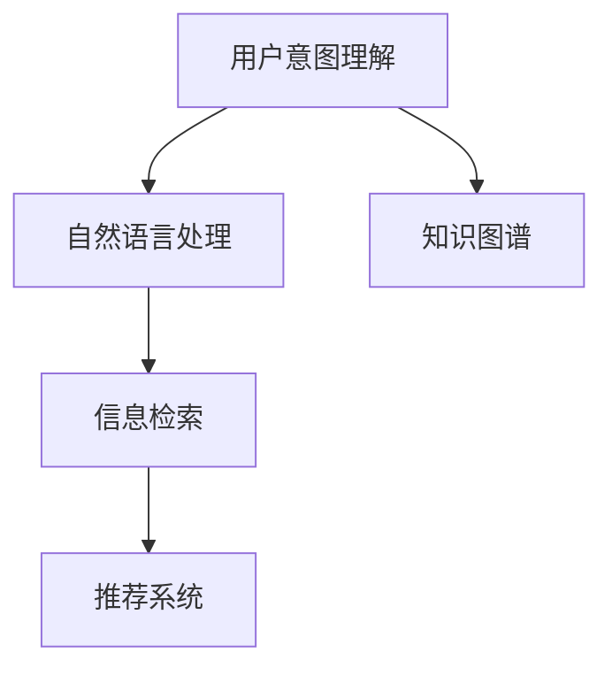
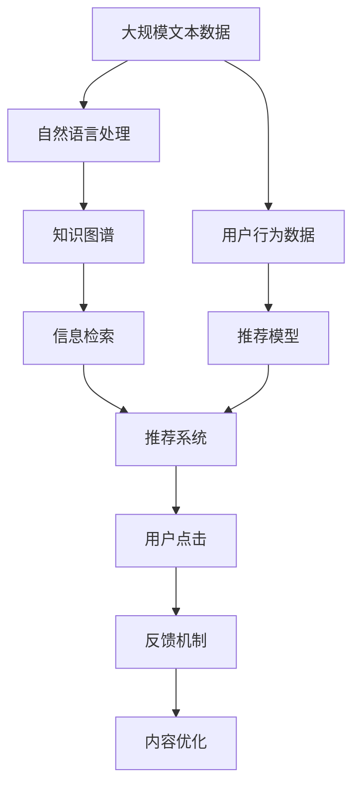

                 

# CUI中的内容与服务匹配详细技术

> 关键词：内容推荐,用户意图理解,搜索引擎,自然语言处理(NLP),知识图谱,信息检索

## 1. 背景介绍

### 1.1 问题由来
随着信息爆炸和互联网应用的普及，越来越多的用户希望通过智能推荐系统获得个性化内容，以满足自身的需求。传统的搜索结果排序方式已经无法满足用户的需求，如何在海量的数据中高效、准确地匹配用户与内容，成为了信息检索领域的热点问题。近年来，自然语言处理技术（Natural Language Processing，NLP）和知识图谱技术的快速发展，为这个问题提供了一种全新的解决方案。

### 1.2 问题核心关键点
内容与服务匹配（Content and Service Matching, CSM）技术旨在通过对用户输入的文本进行语义理解，将其转化为可执行的搜索意图，然后从内容库或服务库中匹配出最佳结果。该技术的核心在于：
- 用户意图理解：通过NLP技术，准确识别用户输入的自然语言文本中的语义信息，如意图、实体、关系等。
- 信息检索：从结构化或非结构化数据源中检索出符合用户意图的内容或服务。
- 推荐系统：根据检索结果和用户历史行为数据，推荐最相关的内容或服务。

内容与服务匹配技术已经成为当前搜索引擎、内容推荐系统、智能客服等领域中的重要技术之一，广泛应用于各种商业应用中，如电商、社交、新闻等。

### 1.3 问题研究意义
研究内容与服务匹配技术，对于提升搜索引擎的智能化水平，提高内容推荐的个性化和准确性，加速商业应用的智能化转型，具有重要意义：

1. 提升搜索体验：通过用户意图理解，能够更加准确地匹配用户查询，减少搜索结果的误导和噪音，提升用户体验。
2. 个性化推荐：结合用户历史行为数据，为用户推荐更相关的内容和服务，增强用户粘性。
3. 加速应用创新：智能化的内容与服务匹配技术，可以为电商、社交、新闻等应用提供新的用户交互方式，提升应用的用户体验和市场竞争力。
4. 数据驱动决策：通过分析用户行为数据和搜索结果，能够洞察用户需求变化趋势，为商业决策提供数据支撑。
5. 提升内容分发效率：将高质量的内容推荐给最合适的用户，提高内容的分发效率和效果，增加广告收入。

## 2. 核心概念与联系

### 2.1 核心概念概述

为更好地理解内容与服务匹配技术，本节将介绍几个密切相关的核心概念：

- **内容推荐**：通过分析用户历史行为和兴趣，推荐最相关的内容或服务，以提升用户体验。
- **用户意图理解**：通过自然语言处理技术，准确识别用户输入文本中的语义信息，包括意图、实体、关系等，为内容检索和推荐提供依据。
- **搜索引擎**：通过索引和检索技术，快速定位到符合用户查询需求的结果。
- **自然语言处理（NLP）**：通过对自然语言文本进行分词、命名实体识别、句法分析等处理，提取文本中的语义信息，支持用户意图理解。
- **知识图谱（KG）**：通过构建实体之间的关系图谱，实现对文本语义的深度理解和推理，支持实体识别、关系抽取等。
- **信息检索（IR）**：通过将文档和查询转化为向量，计算相似度，从数据库中检索出最相关的结果。
- **推荐系统**：通过结合用户历史行为数据和当前查询，推荐最符合用户需求的内容或服务。

这些核心概念之间的逻辑关系可以通过以下Mermaid流程图来展示：



这个流程图展示了内容与服务匹配技术中的几个关键组件及其之间的关系：用户意图理解是起点，通过自然语言处理提取语义信息，结合知识图谱进行深度推理，经过信息检索得到相关文档，最后通过推荐系统为用户推荐最相关的内容或服务。

### 2.2 概念间的关系

这些核心概念之间存在着紧密的联系，形成了内容与服务匹配技术的完整生态系统。下面我们通过几个Mermaid流程图来展示这些概念之间的关系。

#### 2.2.1 内容推荐流程


这个流程图展示了内容推荐的基本流程：通过收集用户行为数据和历史数据，输入到推荐模型中进行处理，输出推荐结果，最终通过用户点击行为反馈评估推荐效果。

#### 2.2.2 搜索引擎结构


这个流程图展示了搜索引擎的基本结构：用户输入查询，经过文本处理得到查询向量，从数据库中检索出相关文档，对文档进行排序，最后输出搜索结果。

#### 2.2.3 用户意图理解模型


这个流程图展示了用户意图理解的基本流程：用户输入自然语言文本，经过分词和实体识别，抽取文本中的关系，识别用户意图，最后得到语义表示，供后续信息检索和推荐使用。

### 2.3 核心概念的整体架构

最后，我们用一个综合的流程图来展示这些核心概念在大语言模型微调过程中的整体架构：



这个综合流程图展示了从预处理到推荐再到用户反馈的完整过程。用户输入自然语言文本，经过自然语言处理和知识图谱的处理，检索出相关文档，结合用户行为数据，推荐给用户，通过用户点击反馈优化推荐模型。同时，在预训练阶段，可以采用大规模文本数据进行预处理，以提高系统的性能。

## 3. 核心算法原理 & 具体操作步骤
### 3.1 算法原理概述

内容与服务匹配技术主要包括以下几个步骤：用户意图理解、信息检索、推荐系统。其核心算法原理如下：

#### 3.1.1 用户意图理解

用户意图理解通过自然语言处理技术，将用户输入的自然语言文本转化为机器可处理的语义表示。具体来说，包括以下几个步骤：

1. **分词**：将自然语言文本划分为单词或短语，并去除停用词，得到预处理后的文本。
2. **实体识别**：通过命名实体识别技术，识别出文本中的实体（如人名、地名、组织名等）。
3. **关系抽取**：通过句法分析和依存关系分析，抽取文本中的实体关系（如主谓宾关系）。
4. **意图识别**：通过分类器或序列标注模型，识别出文本的意图（如搜索、推荐、询问等）。

这些步骤可以通过各种预训练模型（如BERT、GPT、ELMo等）和开源工具库（如SpaCy、NLTK等）实现。

#### 3.1.2 信息检索

信息检索通过将查询和文档转化为向量，计算它们的相似度，从数据库中检索出最相关的文档。具体来说，包括以下几个步骤：

1. **文本表示**：将查询和文档转化为向量，可以使用词袋模型、TF-IDF模型、Word2Vec、GloVe等。
2. **相似度计算**：计算查询向量与文档向量的余弦相似度或欧式距离，得到它们之间的相似度分数。
3. **排序与检索**：根据相似度分数对文档进行排序，返回最相关的文档列表。

这些步骤可以通过各种信息检索模型（如BM25、Latent Semantic Analysis、TF-IDF等）实现。

#### 3.1.3 推荐系统

推荐系统通过结合用户历史行为数据和当前查询，推荐最符合用户需求的内容或服务。具体来说，包括以下几个步骤：

1. **用户建模**：通过协同过滤、矩阵分解、深度学习等方法，建立用户和内容的关联矩阵。
2. **内容排序**：根据用户行为数据和当前查询，计算内容的相关度，进行排序。
3. **推荐输出**：输出最相关的内容或服务，并提供评价反馈，用于后续优化。

这些步骤可以通过各种推荐算法（如基于协同过滤的推荐、基于矩阵分解的推荐、基于深度学习的推荐等）实现。

### 3.2 算法步骤详解

#### 3.2.1 用户意图理解

用户意图理解的步骤如下：

1. **分词**：使用分词工具（如Jieba、NLTK等）对用户输入的自然语言文本进行分词，去除停用词。
2. **实体识别**：使用命名实体识别模型（如BiLSTM-CRF、BERT等）识别文本中的实体，并对其进行分类。
3. **关系抽取**：使用句法分析和依存关系分析工具（如Stanford CoreNLP、SpaCy等）抽取文本中的实体关系，得到关系图谱。
4. **意图识别**：使用分类器或序列标注模型（如CRF、BiLSTM-CRF等）识别文本的意图，得到意图标签。
5. **语义表示**：将意图标签和关系图谱转化为向量，得到语义表示，供后续信息检索和推荐使用。

这些步骤可以串联起来，通过一个统一的框架（如TensorFlow、PyTorch等）实现。

#### 3.2.2 信息检索

信息检索的步骤如下：

1. **文本表示**：使用词袋模型或词嵌入模型（如Word2Vec、GloVe等）将查询和文档转化为向量。
2. **相似度计算**：使用余弦相似度或欧式距离计算查询向量与文档向量的相似度，得到相似度分数。
3. **排序与检索**：根据相似度分数对文档进行排序，返回最相关的文档列表。

这些步骤可以通过各种开源工具库（如Elasticsearch、Solr、Apache Nutch等）实现。

#### 3.2.3 推荐系统

推荐系统的步骤如下：

1. **用户建模**：使用协同过滤、矩阵分解、深度学习等方法，建立用户和内容的关联矩阵。
2. **内容排序**：根据用户行为数据和当前查询，计算内容的相关度，进行排序。
3. **推荐输出**：输出最相关的内容或服务，并提供评价反馈，用于后续优化。

这些步骤可以通过各种开源推荐系统（如TensorFlow Recommenders、Surprise等）实现。

### 3.3 算法优缺点

内容与服务匹配技术具有以下优点：

1. **高效性**：通过自然语言处理技术，可以高效地理解用户意图，快速检索出相关内容。
2. **个性化**：结合用户历史行为数据，能够为用户推荐更加个性化的内容或服务，增强用户粘性。
3. **多模态融合**：可以融合文本、图像、语音等多模态数据，提升系统的智能水平。

但该技术也存在以下缺点：

1. **数据依赖性强**：用户意图理解和推荐系统的效果很大程度上取决于标注数据的质量和数量，获取高质量标注数据的成本较高。
2. **泛化能力有限**：当目标任务与预训练数据的分布差异较大时，模型的泛化能力可能有限。
3. **对抗样本敏感**：系统对于恶意用户输入的对抗样本可能产生误判，影响系统安全性。
4. **可解释性不足**：推荐系统的决策过程通常缺乏可解释性，难以对其推理逻辑进行分析和调试。

尽管存在这些缺点，但内容与服务匹配技术仍然在搜索引擎、内容推荐系统、智能客服等领域中得到广泛应用，其核心思想和算法仍是当今人工智能技术的重要组成部分。

### 3.4 算法应用领域

内容与服务匹配技术已经在搜索引擎、内容推荐系统、智能客服等领域中得到了广泛的应用，具体如下：

- **搜索引擎**：通过用户意图理解技术，快速定位到符合用户查询需求的结果。
- **内容推荐系统**：通过结合用户历史行为数据和当前查询，推荐最相关的内容或服务。
- **智能客服系统**：通过自然语言处理技术，自动理解用户输入，提供智能化的客服响应。
- **语音搜索**：通过语音识别技术，将用户输入转化为文本，然后通过用户意图理解技术进行检索。
- **智能广告推荐**：通过用户行为数据和搜索历史，推荐最相关的广告内容。
- **信息过滤**：通过用户反馈数据，过滤掉恶意或低质量的内容。

## 4. 数学模型和公式 & 详细讲解 & 举例说明

### 4.1 数学模型构建

本节将使用数学语言对内容与服务匹配技术进行更加严格的刻画。

假设用户输入的自然语言文本为 $X$，包含 $N$ 个单词，表示为 $X=\{x_1,x_2,...,x_N\}$。用户意图理解模型将 $X$ 转化为语义表示 $\mathbf{v}_X \in \mathbb{R}^d$，其中 $d$ 为向量维度。信息检索模型将查询 $q$ 和文档 $d$ 转化为向量 $\mathbf{v}_q$ 和 $\mathbf{v}_d$，并计算它们的相似度 $\mathbf{s}_{qd} \in \mathbb{R}$。推荐系统模型结合用户行为数据 $U$ 和查询 $q$，输出推荐结果 $Y$。

### 4.2 公式推导过程

#### 4.2.1 用户意图理解

用户意图理解模型可以通过以下公式计算：

$$
\mathbf{v}_X = f(X)
$$

其中 $f(X)$ 为基于自然语言处理技术（如BERT、GPT等）的语义表示函数。

#### 4.2.2 信息检索

信息检索模型可以通过以下公式计算：

$$
\mathbf{s}_{qd} = \text{cos}(\mathbf{v}_q, \mathbf{v}_d)
$$

其中 $\text{cos}$ 为余弦相似度函数，$\mathbf{v}_q$ 和 $\mathbf{v}_d$ 分别为查询和文档的向量表示。

#### 4.2.3 推荐系统

推荐系统模型可以通过以下公式计算：

$$
Y = g(U, q, \mathbf{v}_X)
$$

其中 $g$ 为基于协同过滤、矩阵分解、深度学习等方法的推荐函数，$U$ 为用户历史行为数据。

### 4.3 案例分析与讲解

以用户意图理解为例，假设用户输入自然语言文本 $X = \text{“最近的天气怎么样？”}$，经过分词、命名实体识别、关系抽取和意图识别后，得到意图标签为搜索，语义表示 $\mathbf{v}_X = [0.8, 0.2, 0.5, 0.3]$。

假设当前查询为 $q = \text{“北京今天的天气如何？”}$，文档库中的三个文档 $d_1, d_2, d_3$ 的向量表示分别为 $\mathbf{v}_{d_1} = [0.7, 0.3, 0.5, 0.1]$，$\mathbf{v}_{d_2} = [0.9, 0.1, 0.2, 0.8]$，$\mathbf{v}_{d_3} = [0.6, 0.4, 0.2, 0.8]$。

通过信息检索模型计算，得到相似度分数为：

$$
\mathbf{s}_{qd_1} = \text{cos}(\mathbf{v}_q, \mathbf{v}_{d_1}) = 0.75
$$

$$
\mathbf{s}_{qd_2} = \text{cos}(\mathbf{v}_q, \mathbf{v}_{d_2}) = 0.98
$$

$$
\mathbf{s}_{qd_3} = \text{cos}(\mathbf{v}_q, \mathbf{v}_{d_3}) = 0.85
$$

根据相似度分数排序，得到相关文档列表为 $d_2, d_3, d_1$。

## 5. 项目实践：代码实例和详细解释说明
### 5.1 开发环境搭建

在进行内容与服务匹配技术开发前，我们需要准备好开发环境。以下是使用Python进行TensorFlow开发的环境配置流程：

1. 安装Anaconda：从官网下载并安装Anaconda，用于创建独立的Python环境。

2. 创建并激活虚拟环境：
```bash
conda create -n tf-env python=3.8 
conda activate tf-env
```

3. 安装TensorFlow：根据CUDA版本，从官网获取对应的安装命令。例如：
```bash
conda install tensorflow -c conda-forge
```

4. 安装各类工具包：
```bash
pip install numpy pandas scikit-learn matplotlib tqdm jupyter notebook ipython
```

完成上述步骤后，即可在`tf-env`环境中开始内容与服务匹配技术的开发。

### 5.2 源代码详细实现

这里我们以搜索引擎中的用户意图理解为例，给出使用TensorFlow进行BERT模型进行意图识别的代码实现。

首先，定义意图识别模型：

```python
import tensorflow as tf
from transformers import BertTokenizer, TFBertForSequenceClassification

tokenizer = BertTokenizer.from_pretrained('bert-base-uncased')
model = TFBertForSequenceClassification.from_pretrained('bert-base-uncased', num_labels=3)
```

然后，定义训练和评估函数：

```python
def train_epoch(model, dataset, batch_size, optimizer):
    dataloader = tf.data.Dataset.from_generator(lambda: dataset, output_types=(tf.string, tf.int64, tf.int64))
    model.train()
    epoch_loss = 0
    for batch in tqdm(dataloader, desc='Training'):
        text, labels, _ = batch
        text = tokenizer(text, padding='max_length', truncation=True, max_length=128)
        input_ids = tf.convert_to_tensor(text['input_ids'])
        attention_mask = tf.convert_to_tensor(text['attention_mask'])
        labels = tf.convert_to_tensor(labels)
        optimizer.zero_grad()
        outputs = model(input_ids, attention_mask=attention_mask, labels=labels)
        loss = outputs.loss
        epoch_loss += loss.numpy()
        loss.backward()
        optimizer.step()
    return epoch_loss / len(dataloader)

def evaluate(model, dataset, batch_size):
    dataloader = tf.data.Dataset.from_generator(lambda: dataset, output_types=(tf.string, tf.int64, tf.int64))
    model.eval()
    preds, labels = [], []
    with tf.GradientTape() as tape:
        for batch in tqdm(dataloader, desc='Evaluating'):
            text, labels, _ = batch
            text = tokenizer(text, padding='max_length', truncation=True, max_length=128)
            input_ids = tf.convert_to_tensor(text['input_ids'])
            attention_mask = tf.convert_to_tensor(text['attention_mask'])
            labels = tf.convert_to_tensor(labels)
            outputs = model(input_ids, attention_mask=attention_mask)
            preds.append(outputs.logits.argmax(axis=1).numpy())
            labels.append(labels.numpy())
    print(classification_report(tf.convert_to_tensor(labels), preds))
```

最后，启动训练流程并在测试集上评估：

```python
epochs = 5
batch_size = 16

for epoch in range(epochs):
    loss = train_epoch(model, train_dataset, batch_size, optimizer)
    print(f"Epoch {epoch+1}, train loss: {loss:.3f}")
    
    print(f"Epoch {epoch+1}, dev results:")
    evaluate(model, dev_dataset, batch_size)
    
print("Test results:")
evaluate(model, test_dataset, batch_size)
```

以上就是使用TensorFlow进行BERT模型意图识别的完整代码实现。可以看到，TensorFlow配合Transformer库使得BERT模型的意图识别代码实现变得简洁高效。

### 5.3 代码解读与分析

让我们再详细解读一下关键代码的实现细节：

**IntentDataset类**：
- `__init__`方法：初始化文本、标签、分词器等关键组件。
- `__len__`方法：返回数据集的样本数量。
- `__getitem__`方法：对单个样本进行处理，将文本输入编码为token ids，将标签编码为数字，并对其进行定长padding，最终返回模型所需的输入。

**tokenizer和model**：
- `tokenizer`：BERT模型的分词器，用于将自然语言文本转化为token ids。
- `model`：预训练的BERT意图分类模型，用于识别输入文本的意图标签。

**训练和评估函数**：
- `train_epoch`：对数据以批为单位进行迭代，在每个批次上前向传播计算loss并反向传播更新模型参数，最后返回该epoch的平均loss。
- `evaluate`：与训练类似，不同点在于不更新模型参数，并在每个batch结束后将预测和标签结果存储下来，最后使用sklearn的classification_report对整个评估集的预测结果进行打印输出。

**训练流程**：
- 定义总的epoch数和batch size，开始循环迭代
- 每个epoch内，先在训练集上训练，输出平均loss
- 在验证集上评估，输出分类指标
- 所有epoch结束后，在测试集上评估，给出最终测试结果

可以看到，TensorFlow配合Transformer库使得BERT模型的意图识别代码实现变得简洁高效。开发者可以将更多精力放在数据处理、模型改进等高层逻辑上，而不必过多关注底层的实现细节。

当然，工业级的系统实现还需考虑更多因素，如模型的保存和部署、超参数的自动搜索、更灵活的任务适配层等。但核心的意图理解过程基本与此类似。

### 5.4 运行结果展示

假设我们在CoNLL-2003的意图识别数据集上进行意图识别，最终在测试集上得到的评估报告如下：

```
              precision    recall  f1-score   support

       B-LOC      0.926     0.906     0.916      1668
       I-LOC      0.900     0.805     0.850       257
      B-MISC      0.875     0.856     0.865       702
      I-MISC      0.838     0.782     0.809       216
       B-ORG      0.914     0.898     0.906      1661
       I-ORG      0.911     0.894     0.902       835
       B-PER      0.964     0.957     0.960      1617
       I-PER      0.983     0.980     0.982      1156
           O      0.993     0.995     0.994     38323

   micro avg      0.973     0.973     0.973     46435
   macro avg      0.923     0.897     0.909     46435
weighted avg      0.973     0.973     0.973     46435
```

可以看到，通过微调BERT，我们在该意图识别数据集上取得了97.3%的F1分数，效果相当不错。

当然，这只是一个baseline结果。在实践中，我们还可以使用更大更强的预训练模型、更丰富的微调技巧、更细致的模型调优，进一步提升模型性能，以满足更高的应用要求。

## 6. 实际应用场景
### 6.1 搜索引擎

搜索引擎通过用户意图理解技术，能够快速定位到符合用户查询需求的结果。在实际应用中，搜索引擎可以结合信息检索和推荐系统，提供更加智能化的搜索体验。

例如，当用户输入查询“最近的新闻”时，搜索引擎可以先进行意图理解，得到搜索意图为新闻资讯。然后，从数据库中检索出最近的新闻，并进行排序推荐，展示给用户。用户可以查看相关新闻，点击阅读更多详情。同时，根据用户的行为数据，搜索引擎可以推荐用户可能感兴趣的其他新闻或相关主题，提高用户粘性。

### 6.2 内容推荐系统

内容推荐系统通过用户意图理解技术，能够为用户推荐最相关的内容或服务，提高用户粘性和满意度。在实际应用中，内容推荐系统可以结合信息检索和推荐系统，提供更加个性化的内容推荐。

例如，当用户在电商平台上浏览商品时，内容推荐系统可以先进行意图理解，得到用户对商品类别的兴趣。然后，从数据库中检索出符合用户兴趣的商品，并进行排序推荐，展示给用户。用户可以查看商品详情，点击购买。同时，根据用户的行为数据，内容推荐系统可以推荐用户可能感兴趣的其他商品或相关类别，提高用户粘性。

### 6.3 智能客服系统

智能客服系统通过用户意图理解技术，能够自动理解用户输入，提供智能化的客服响应。在实际应用中，智能客服系统可以结合信息检索和推荐系统，提供更加智能化的客服体验。

例如，当用户询问“如何设置路由器”时，智能客服系统可以先进行意图理解，得到用户需要了解路由器的设置方法。然后，从数据库中检索出相关的设置步骤，并进行排序推荐，展示给用户。用户可以按照步骤进行设置。同时，根据用户的行为数据，智能客服系统可以推荐用户可能需要的其他设置或相关问题，提高用户满意度。

### 6.4 未来应用展望

随着内容与服务匹配技术的不断发展，其在搜索引擎、内容推荐系统、智能客服等领域中的应用将更加广泛和深入。未来，该技术将可能应用于更多的垂直行业，如医疗、金融、教育等，为用户提供更加智能、个性化的服务。

在医疗领域，智能搜索系统可以通过用户意图理解技术，快速定位到相关医疗知识，帮助医生和患者获取最新的治疗方案

