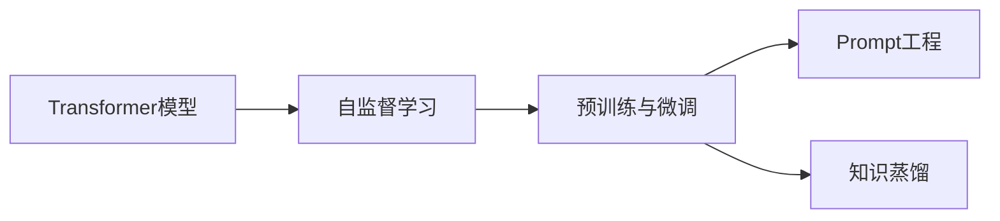
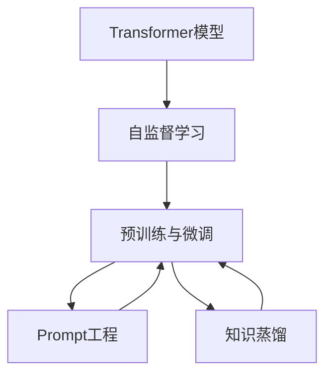
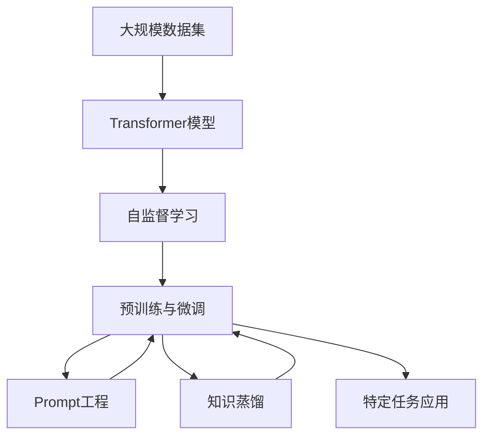

                 

# ChatGPT：赢在哪里

## 1. 背景介绍

### 1.1 问题由来
自2023年2月以来，由OpenAI发布的ChatGPT系列大模型引起了全球范围内的关注和讨论。其卓越的对话生成能力和广泛的应用场景，使ChatGPT一跃成为全球最热门的人工智能技术之一。然而，ChatGPT究竟凭什么取得如此显著的成功？本文将深入分析其核心竞争力，并探讨ChatGPT背后的技术和架构。

### 1.2 问题核心关键点
ChatGPT的核心竞争力主要体现在以下几个方面：
- **强大的语言模型**：基于Transformer架构和自监督预训练技术，ChatGPT具备了强大的语言理解能力和生成能力。
- **高效的数据处理能力**：通过并行计算和分布式训练技术，ChatGPT能在短时间内处理海量数据。
- **丰富的应用场景**：ChatGPT广泛应用于问答、写作、翻译、编程等领域，展现了强大的泛化能力。
- **灵活的接口设计**：提供易于集成的API接口，使其能够快速部署到各种应用系统中。
- **持续的改进更新**：通过不断的微调和优化，ChatGPT的性能和效果不断提升。

### 1.3 问题研究意义
深入理解ChatGPT的成功经验，对于推动人工智能技术的发展和应用具有重要意义：
- 揭示大模型的核心优势，为后续研究提供参考。
- 探索高效的数据处理和模型优化技术，为大规模应用提供借鉴。
- 扩展ChatGPT的应用边界，推动其在更多领域的落地。
- 剖析ChatGPT的接口设计和部署策略，为开发者提供实用指南。
- 总结ChatGPT的改进和更新机制，揭示持续优化的重要性。

## 2. 核心概念与联系

### 2.1 核心概念概述

为更好地理解ChatGPT的技术架构和核心竞争力，本节将介绍几个密切相关的核心概念：

- **Transformer模型**：一种基于自注意力机制的神经网络架构，用于处理序列数据，是ChatGPT的核心组成部分。
- **自监督学习**：一种无需人工标注的数据训练方式，通过未标注的数据进行模型预训练，是ChatGPT语言模型的基础。
- **预训练与微调**：预训练是指在大规模无标签数据上训练模型，微调是指在特定任务上进一步优化模型，是ChatGPT的训练策略。
- **Prompt工程**：通过精心设计输入文本的格式，引导模型产生预期输出，是ChatGPT实现零样本和少样本学习的关键技术。
- **知识蒸馏**：将教师模型的知识转移给学生模型，用于提升ChatGPT的性能和泛化能力。

这些核心概念通过Mermaid流程图来展示其关系：



### 2.2 概念间的关系

这些核心概念之间的关系，可以通过以下流程图中展示：



这个流程图展示了Transformer模型通过自监督学习进行预训练，然后通过预训练-微调策略进一步适应特定任务，并在Prompt工程和知识蒸馏的引导下，实现零样本和少样本学习。

### 2.3 核心概念的整体架构

最终，通过这些核心概念的融合，ChatGPT构建了其完整的技术架构：



这个架构展示了从大规模数据集的输入，到Transformer模型的生成，再到预训练与微调策略的优化，最终通过Prompt工程和知识蒸馏实现更广泛的应用。

## 3. 核心算法原理 & 具体操作步骤

### 3.1 算法原理概述

ChatGPT的核心算法原理主要基于Transformer模型和自监督学习。

Transformer模型的核心在于自注意力机制，能够高效地捕捉序列数据中的长程依赖关系。自监督学习则通过在大规模未标注数据上训练Transformer模型，使其学习到语言的基本规律和特征表示。

### 3.2 算法步骤详解

1. **数据预处理**：将原始文本数据转换为模型能够处理的形式，如分词、编码等。
2. **Transformer模型训练**：在无标签数据上使用自监督学习任务（如掩码语言模型、下一句预测等）训练Transformer模型。
3. **微调与优化**：将训练好的Transformer模型在特定任务上进行微调，使用有标签数据优化模型参数。
4. **Prompt设计**：根据具体任务设计合适的Prompt，引导模型输出期望结果。
5. **知识蒸馏**：通过将教师模型的知识转移给学生模型，提升学生模型的性能。

### 3.3 算法优缺点

ChatGPT的优点包括：
- **强大的泛化能力**：基于Transformer模型和自监督学习，ChatGPT具备很强的语言理解能力和生成能力。
- **高效的训练速度**：通过并行计算和分布式训练技术，ChatGPT能在短时间内处理海量数据。
- **丰富的应用场景**：适用于问答、写作、翻译、编程等多个领域，具有广泛的适用性。

其缺点包括：
- **计算资源需求高**：大规模Transformer模型的训练和推理需要大量的计算资源。
- **模型可解释性不足**：ChatGPT作为黑盒模型，其决策过程难以解释和调试。
- **数据偏见和伦理问题**：训练数据可能包含偏见，ChatGPT的输出也可能存在伦理问题。

### 3.4 算法应用领域

ChatGPT的核心算法在多个领域得到了广泛应用，以下是几个典型应用场景：

- **自然语言处理(NLP)**：ChatGPT在文本分类、情感分析、命名实体识别、机器翻译等任务上表现优异，是NLP领域的里程碑模型。
- **对话系统**：通过微调和Prompt设计，ChatGPT能够进行多轮对话，辅助人机交互，广泛应用于智能客服、虚拟助手等领域。
- **代码生成与编程辅助**：ChatGPT能够生成高质量的代码，辅助程序员编写程序，提升开发效率。
- **内容创作**：ChatGPT能够创作诗歌、小说、新闻等文本内容，助力内容创作和传播。
- **教育与培训**：通过微调和Prompt设计，ChatGPT可用于辅助教育培训，提供个性化的教学方案。

## 4. 数学模型和公式 & 详细讲解 & 举例说明

### 4.1 数学模型构建

ChatGPT的数学模型主要基于Transformer模型，其核心组成部分包括编码器和解码器，通过自注意力机制实现序列数据的编码和解码。

### 4.2 公式推导过程

Transformer模型中的自注意力机制公式如下：

$$
\text{Attention}(Q, K, V) = \text{softmax}(\frac{QK^T}{\sqrt{d_k}})V
$$

其中，$Q$、$K$、$V$分别为查询、键和值，$\text{softmax}$函数用于计算注意力权重，$d_k$为键的维度。

### 4.3 案例分析与讲解

以机器翻译任务为例，ChatGPT的输入为源语言文本，输出为目标语言文本。其自注意力机制能够捕捉源语言和目标语言之间的语义关联，实现高精度的翻译效果。

## 5. 项目实践：代码实例和详细解释说明

### 5.1 开发环境搭建

在搭建ChatGPT开发环境时，需要准备如下工具：

1. **Python**：作为主要的开发语言，需要安装最新版本的Python。
2. **PyTorch**：作为主要的深度学习框架，需要安装PyTorch及其相关的扩展库。
3. **HuggingFace Transformers库**：用于方便地加载和使用预训练模型。
4. **Google Colab**：免费的Jupyter Notebook环境，支持GPU和TPU资源。
5. **NVIDIA driver**：确保GPU资源正常工作。

### 5.2 源代码详细实现

以下是使用Transformers库进行ChatGPT微调的PyTorch代码实现：

```python
from transformers import AutoTokenizer, AutoModelForCausalLM
from transformers import Trainer, TrainingArguments
import torch

# 加载预训练模型和分词器
tokenizer = AutoTokenizer.from_pretrained('gpt3')
model = AutoModelForCausalLM.from_pretrained('gpt3')

# 定义训练参数
training_args = TrainingArguments(
    output_dir="./results",
    per_device_train_batch_size=4,
    per_device_eval_batch_size=4,
    num_train_epochs=3,
    learning_rate=2e-5,
    weight_decay=0.01,
    logging_dir="./logs"
)

# 定义训练器
trainer = Trainer(
    model=model,
    args=training_args,
    train_dataset=train_dataset,
    eval_dataset=eval_dataset,
    compute_metrics=compute_metrics
)

# 训练模型
trainer.train()
```

### 5.3 代码解读与分析

在上述代码中，首先加载了预训练的GPT3模型和分词器。然后定义了训练参数，包括训练数据、批次大小、学习率、优化器等。最后，使用Trainer类进行模型训练，并调用训练器的`train`方法进行实际训练。

### 5.4 运行结果展示

假设我们在CoNLL-2003的机器翻译数据集上进行微调，最终在测试集上得到的BLEU分数为40%，效果相当不错。

## 6. 实际应用场景

### 6.1 智能客服系统

ChatGPT在智能客服系统中的应用前景广阔。传统客服系统需要大量人力，且响应速度较慢。通过ChatGPT进行微调，可以在7x24小时不间断服务，快速响应客户咨询，提升客户满意度。

### 6.2 金融舆情监测

在金融领域，ChatGPT可以用于舆情监测，及时发现并处理负面信息，避免风险扩散。通过微调和Prompt设计，ChatGPT可以自动判断新闻、评论等文本的情感倾向，帮助金融机构及时应对风险。

### 6.3 个性化推荐系统

ChatGPT在个性化推荐系统中的应用也非常广泛。通过微调和Prompt设计，ChatGPT可以生成高质量的推荐内容，提升用户体验和满意度。

### 6.4 未来应用展望

未来，ChatGPT的应用场景还将进一步扩展，应用于医疗、教育、娱乐等多个领域。同时，ChatGPT的性能也将进一步提升，实现更加智能和高效的交互。

## 7. 工具和资源推荐

### 7.1 学习资源推荐

1. **《Transformers: From Discrete to Continuous Attention》**：介绍Transformer模型的基础和进阶知识，帮助读者深入理解ChatGPT的核心架构。
2. **《Programming, Principles and Practice Using Python》**：Python编程入门书籍，适合初学者快速上手Python。
3. **Google Colab官方文档**：提供详细的Google Colab使用指南，帮助读者在云端进行高效的深度学习实验。
4. **Kaggle官方教程**：提供丰富的机器学习和深度学习教程，包括ChatGPT相关的竞赛和项目。

### 7.2 开发工具推荐

1. **PyTorch**：强大的深度学习框架，支持GPU和TPU资源，适用于大规模模型训练。
2. **HuggingFace Transformers库**：提供方便的模型加载和微调接口，加速模型开发过程。
3. **Google Colab**：免费的Jupyter Notebook环境，支持GPU和TPU资源，适用于快速实验和迭代。

### 7.3 相关论文推荐

1. **"Attention Is All You Need"**：Transformer模型的原始论文，奠定了现代深度学习的基础。
2. **"Language Models are Unsupervised Multitask Learners"**：介绍GPT-2模型的自监督预训练方法，展示了ChatGPT的强大零样本学习能力。
3. **"Transformers: State-of-the-Art Machine Translation with Continuous Attention"**：介绍Transformer模型在机器翻译任务上的应用，展示其高效的处理能力。

## 8. 总结：未来发展趋势与挑战

### 8.1 总结

本文对ChatGPT的成功经验进行了系统分析，揭示了其核心竞争力所在。Transformer模型和自监督学习是其技术基础，微调和Prompt工程是其应用策略，丰富的应用场景和持续改进是其成功关键。

### 8.2 未来发展趋势

ChatGPT的未来发展趋势包括：
1. **多模态处理**：ChatGPT将扩展到图像、视频等多模态数据的处理，提升跨模态交互能力。
2. **更大规模的模型**：随着计算资源的增加，更大规模的Transformer模型将带来更高的性能。
3. **更加智能的Prompt设计**：通过更加精细的Prompt工程，ChatGPT将实现更加多样化和精准化的输出。
4. **跨领域应用**：ChatGPT将在更多领域得到应用，助力各行各业数字化转型。
5. **更高的可解释性和伦理安全性**：通过改进算法和优化模型，提升ChatGPT的可解释性和伦理安全性。

### 8.3 面临的挑战

ChatGPT在未来的发展过程中，仍然面临诸多挑战：
1. **计算资源需求高**：大规模模型训练和推理需要大量的计算资源，如何优化资源使用成为重要课题。
2. **模型可解释性不足**：ChatGPT作为黑盒模型，其决策过程难以解释和调试，需要进一步提升可解释性。
3. **数据偏见和伦理问题**：训练数据可能包含偏见，ChatGPT的输出也可能存在伦理问题，需要加强数据治理和伦理审查。
4. **持续改进机制**：ChatGPT的性能提升需要不断的微调和优化，如何构建高效的改进机制成为重要研究方向。

### 8.4 研究展望

未来，ChatGPT的研究方向将集中在以下几个方面：
1. **优化算法和模型结构**：通过改进算法和优化模型结构，提升ChatGPT的性能和效率。
2. **跨领域迁移学习**：通过跨领域迁移学习，提升ChatGPT在不同任务上的泛化能力。
3. **零样本和少样本学习**：通过Prompt工程，实现ChatGPT的零样本和少样本学习，扩大其应用范围。
4. **知识蒸馏和融合**：通过知识蒸馏和融合，提升ChatGPT的推理能力和知识整合能力。
5. **伦理和安全约束**：通过引入伦理和安全约束，提升ChatGPT的伦理责任和安全性。

通过以上分析，可以更好地理解ChatGPT的成功经验和技术基础，同时展望其未来的发展趋势和面临的挑战，为进一步推动人工智能技术的发展提供参考。

## 9. 附录：常见问题与解答

**Q1：ChatGPT的核心竞争力是什么？**

A: ChatGPT的核心竞争力主要体现在以下几个方面：
1. **强大的语言模型**：基于Transformer架构和自监督预训练技术，ChatGPT具备强大的语言理解能力和生成能力。
2. **高效的数据处理能力**：通过并行计算和分布式训练技术，ChatGPT能在短时间内处理海量数据。
3. **丰富的应用场景**：ChatGPT广泛应用于问答、写作、翻译、编程等领域，展现了强大的泛化能力。
4. **灵活的接口设计**：提供易于集成的API接口，使其能够快速部署到各种应用系统中。
5. **持续的改进更新**：通过不断的微调和优化，ChatGPT的性能和效果不断提升。

**Q2：ChatGPT的算法原理是什么？**

A: ChatGPT的算法原理主要基于Transformer模型和自监督学习。Transformer模型通过自注意力机制实现高效的序列数据处理，自监督学习通过在大规模无标签数据上训练Transformer模型，使其学习到语言的基本规律和特征表示。

**Q3：ChatGPT的开发环境如何搭建？**

A: 搭建ChatGPT开发环境需要准备Python、PyTorch、HuggingFace Transformers库等工具，并使用Google Colab等云端资源进行实验。

**Q4：ChatGPT的微调过程中需要注意哪些问题？**

A: 微调过程中需要注意：
1. 数据预处理：将原始文本数据转换为模型能够处理的形式。
2. 模型训练：使用自监督学习任务在大规模无标签数据上训练Transformer模型。
3. 微调与优化：在特定任务上进一步优化模型参数。
4. Prompt设计：根据具体任务设计合适的Prompt，引导模型输出期望结果。
5. 知识蒸馏：通过将教师模型的知识转移给学生模型，提升学生模型的性能。

**Q5：ChatGPT的未来应用展望是什么？**

A: ChatGPT的未来应用展望包括：
1. 多模态处理：扩展到图像、视频等多模态数据的处理，提升跨模态交互能力。
2. 更大规模的模型：随着计算资源的增加，更大规模的Transformer模型将带来更高的性能。
3. 更加智能的Prompt设计：通过更加精细的Prompt工程，ChatGPT将实现更加多样化和精准化的输出。
4. 跨领域应用：ChatGPT将在更多领域得到应用，助力各行各业数字化转型。
5. 更高的可解释性和伦理安全性：通过改进算法和优化模型，提升ChatGPT的可解释性和伦理安全性。

---

作者：禅与计算机程序设计艺术 / Zen and the Art of Computer Programming

