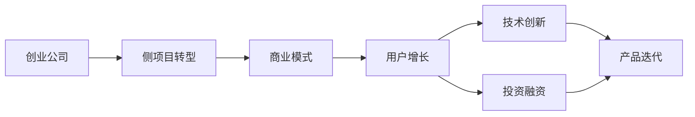
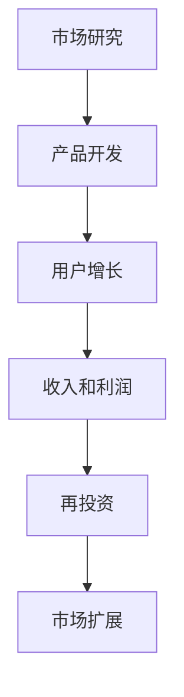
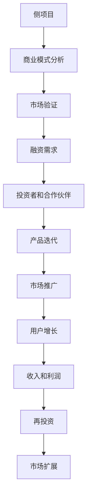

                 

# 如何将Side Project转化为估值上亿的创业公司

> 关键词：
- 创业公司
- 侧项目转型
- 商业模式
- 用户增长
- 技术创新
- 投资融资
- 产品迭代

## 1. 背景介绍

### 1.1 问题由来
在当今快速变化的技术环境中，越来越多的创业公司从侧项目(也称为“斜杠项目”)转型而来。侧项目通常是创始人或团队在主要业务之外，根据个人兴趣或市场需求开发的次要产品。这些项目虽然投入的资源和关注度相对较少，但往往具有很高的创新性和潜力，能够成为推动公司发展的关键力量。然而，将侧项目成功转型为估值上亿的创业公司并非易事，需要科学的规划、精心的执行和管理。

### 1.2 问题核心关键点
侧项目转型成功的关键在于以下几个方面：
- 选择正确的业务方向：侧项目往往源自创始人或团队的个人兴趣或初创公司的非核心业务，需评估其市场潜力和发展前景。
- 制定明确的商业模式：商业模式是企业赚钱的逻辑，需要清晰明确地描述产品的价值主张和盈利方式。
- 构建强大的用户体验：用户增长是创业公司的生命线，需要通过良好的产品设计和用户体验吸引并留存用户。
- 持续的技术创新：创业公司需要不断进行技术迭代和创新，以满足市场需求和提升竞争力。
- 有效的融资策略：创业公司需要合理规划资金使用，进行适当的融资以支持业务发展。
- 精准的市场定位：明确目标用户群体和市场需求，进行精准的市场营销。
- 快速适应变化：创业公司需灵活应对市场变化和技术趋势，及时调整战略方向。

### 1.3 问题研究意义
将侧项目成功转型为创业公司，不仅能充分利用现有资源，减少创业风险，还能将非核心业务的创新力量带入公司，形成新的增长点。这一过程不仅需要技术创新和市场洞察，还需要商业思维和管理能力的全面提升。本研究旨在为有志于将侧项目转型为创业公司的团队提供系统的指导，帮助他们将创意和潜力转化为商业成功。

## 2. 核心概念与联系

### 2.1 核心概念概述

要成功将侧项目转型为创业公司，需理解以下核心概念及其相互关系：

- **创业公司**：指以市场为导向，通过创新提供产品和服务的组织形式。
- **侧项目转型**：指将个人兴趣或非核心业务开发的产品或技术，通过规划和执行，成功转化为公司业务的商业模式。
- **商业模式**：企业获取、创造和传递价值的方式，包括盈利模式、价值主张、客户关系、渠道、资源和伙伴关系。
- **用户增长**：吸引和留存更多用户的过程，是创业公司发展的核心指标。
- **技术创新**：通过技术研发和产品迭代，不断提升产品竞争力和用户体验。
- **投资融资**：通过外部资金支持，推动公司成长和发展。
- **产品迭代**：根据市场需求和用户反馈，不断优化和升级产品。

这些概念之间的联系可以通过以下Mermaid流程图来展示：



该流程图展示了侧项目转型为创业公司的关键步骤：从侧项目到创业公司，通过构建商业模式、推动用户增长、进行技术创新、获取投资和持续迭代产品，逐步实现公司的商业成功。

### 2.2 概念间的关系

这些核心概念之间存在着紧密的联系，形成了侧项目转型为创业公司的完整生态系统。下面通过几个Mermaid流程图来展示这些概念之间的关系。

#### 2.2.1 创业公司的主要业务流程



这个流程图展示了创业公司的主要业务流程：通过市场研究确定产品方向，进行产品开发，通过用户增长和收入实现盈利，再投资支持公司发展，最后进行市场扩展，形成良性循环。

#### 2.2.2 侧项目转型的关键步骤



这个流程图展示了侧项目转型的关键步骤：通过商业模式分析确定市场方向，进行市场验证和融资，吸引投资者和合作伙伴，进行产品迭代和市场推广，最终实现用户增长、收入和利润，支持公司发展和市场扩展。

#### 2.2.3 商业模式构建的核心要素


这个流程图展示了商业模式构建的核心要素：从客户需求出发，确定价值主张，设计盈利模式，建立客户关系，选择合适的渠道，整合资源和伙伴关系，形成完整的商业模式。

## 3. 核心算法原理 & 具体操作步骤
### 3.1 算法原理概述

侧项目转型为创业公司的核心算法原理主要包括商业建模、用户增长、技术创新和融资策略。这些原理贯穿于从市场研究到产品迭代的全过程，是创业成功的关键。

**商业建模**：通过市场调研、竞品分析和商业模式画布等方法，确定产品方向和盈利模式，构建可行的商业模型。

**用户增长**：运用增长黑客、A/B测试、用户留存等策略，吸引和留存用户，实现用户规模的快速增长。

**技术创新**：利用数据驱动、快速迭代、敏捷开发等技术手段，不断提升产品功能和用户体验。

**融资策略**：通过市场路演、风险投资、众筹等方式，吸引外部资金支持，推动公司快速成长。

### 3.2 算法步骤详解

侧项目转型为创业公司通常包括以下关键步骤：

**Step 1: 市场调研与商业建模**
- 进行市场调研，了解目标市场的规模、需求、竞争情况等。
- 使用商业画布(Business Model Canvas)等工具，明确产品价值主张、客户细分、收入来源和成本结构等关键要素。

**Step 2: 产品开发与原型测试**
- 快速开发产品原型，进行内部测试和用户反馈收集。
- 使用A/B测试等方法，优化产品功能和用户体验。

**Step 3: 市场验证与用户获取**
- 通过最小可行产品(MVP)验证市场接受度。
- 运用增长黑客策略，如内容营销、社交媒体推广、合作伙伴关系等，吸引早期用户。

**Step 4: 融资与团队建设**
- 根据融资需求，准备商业计划书、市场路演材料等，进行投资者和合作伙伴招募。
- 招聘和培养核心团队，建立强大的技术和管理架构。

**Step 5: 产品迭代与市场扩展**
- 根据用户反馈和市场变化，进行产品迭代和优化。
- 制定市场扩展策略，进入新的市场和渠道。

### 3.3 算法优缺点

侧项目转型为创业公司的优点包括：
- **资源共享**：利用现有资源和经验，减少创业风险。
- **快速创新**：侧项目通常源自个人兴趣或专业领域，具有较强的创新性。
- **成本低廉**：初期投入较少，灵活性高。

缺点包括：
- **资源有限**：由于非核心业务，可用资源有限，难以与大公司竞争。
- **市场定位难**：侧项目转型需重新定位市场，可能面临市场竞争压力。
- **管理挑战**：管理非核心业务与核心业务的协调，需要更多精力和智慧。

### 3.4 算法应用领域

侧项目转型为创业公司的方法在多个领域都有广泛应用，如：

- **科技创新企业**：如AI初创公司，可通过侧项目快速迭代和市场验证，推动产品创新和业务增长。
- **行业解决方案**：如区块链初创公司，可通过侧项目探索技术应用，进入新市场和领域。
- **个性化定制服务**：如个性化医疗公司，可通过侧项目开发特定产品，提供差异化服务。
- **社交媒体平台**：如社交电商公司，可通过侧项目开发新功能，提升用户体验和用户粘性。
- **新材料研发**：如新能源初创公司，可通过侧项目探索新材料应用，推动技术突破。

## 4. 数学模型和公式 & 详细讲解 & 举例说明

### 4.1 数学模型构建

侧项目转型为创业公司的核心数学模型主要包括用户增长模型、收入预测模型和技术研发模型。

**用户增长模型**：基于KPI和用户行为数据，构建预测用户增长的模型，如用户留存率模型、转化率模型等。

**收入预测模型**：根据销售数据、市场需求和成本结构，预测公司收入和利润的模型，如现金流模型、成本收益分析模型等。

**技术研发模型**：通过研发投入和市场反馈，预测技术进步和产品迭代效果的模型，如迭代速度模型、技术成熟度模型等。

### 4.2 公式推导过程

以下是用户增长模型和收入预测模型的公式推导过程。

**用户留存率模型**：

假设用户每天以一定的概率留存，则n天后的用户留存率可以通过以下公式计算：

$$
R_n = \left(\frac{p}{1-p}\right)^n
$$

其中，$p$为每日留存概率，$n$为天数。

**收入预测模型**：

假设每月收入为$I$，成本为$C$，利润为$P$，则每月收入预测模型为：

$$
P = I - C
$$

每月收入增长率可以通过以下公式计算：

$$
g = \frac{P_{t+1} - P_t}{P_t}
$$

其中，$P_t$为第$t$个月的利润，$P_{t+1}$为第$t+1$个月的利润。

### 4.3 案例分析与讲解

**案例1: 区块链初创公司的侧项目转型**

某区块链初创公司，通过侧项目开发了一个数字资产交易平台。侧项目启动时，公司团队仅有少量资源，但目标明确，方向清晰。他们进行了详细的市场调研，确定了数字资产交易的市场需求，并利用现有技术资源快速开发了MVP。通过与早期用户互动和反馈收集，不断优化产品功能和用户体验。在获得第一轮融资后，公司进行了市场推广，吸引了大量用户注册和使用。通过数据分析和用户行为研究，公司预测了用户增长和收入趋势，并制定了市场扩展策略，成功进入了多个国家和地区市场。

**案例2: 智能家居企业的侧项目转型**

某智能家居企业，通过侧项目开发了一款智能音箱。侧项目启动时，公司团队主要集中在智能家居设备的设计和制造。他们利用现有硬件和软件开发资源，快速开发了智能音箱的原型，并通过内部测试和用户反馈进行了迭代优化。在市场验证阶段，公司通过合作伙伴关系和社交媒体推广，吸引了早期用户。通过数据分析和用户行为研究，公司预测了用户增长和收入趋势，并制定了产品迭代和市场扩展策略，成功进入了新市场和渠道。

## 5. 项目实践：代码实例和详细解释说明

### 5.1 开发环境搭建

在进行侧项目转型为创业公司的实践前，我们需要准备好开发环境。以下是使用Python进行Web开发的环境配置流程：

1. 安装Anaconda：从官网下载并安装Anaconda，用于创建独立的Python环境。

2. 创建并激活虚拟环境：
```bash
conda create -n py36 python=3.6
conda activate py36
```

3. 安装Web开发框架：
```bash
conda install django
```

4. 安装数据库：
```bash
conda install mysql
```

5. 安装前端工具：
```bash
conda install yui
```

6. 安装调试工具：
```bash
conda install python-tidy
```

完成上述步骤后，即可在`py36`环境中开始项目实践。

### 5.2 源代码详细实现

这里我们以Web应用为例，展示如何使用Django框架开发一个简单的侧项目转型为创业公司的业务管理系统。

首先，定义数据模型：

```python
from django.db import models

class User(models.Model):
    username = models.CharField(max_length=50)
    email = models.EmailField()
    first_name = models.CharField(max_length=50)
    last_name = models.CharField(max_length=50)

    def __str__(self):
        return self.username
```

然后，定义视图和模板：

```python
from django.shortcuts import render
from django.http import HttpResponse

def home(request):
    return render(request, 'home.html', {'context': 'Welcome to the Side Project Transformed to Valuable Startup!'})

def about(request):
    return HttpResponse('About Us: <br> We are transforming our side project into a valuable startup.')

def contact(request):
    return HttpResponse('Contact Us: <br> Our email is [email] for any inquiries.')
```

最后，在`urls.py`中定义路由：

```python
from django.urls import path
from . import views

urlpatterns = [
    path('', views.home, name='home'),
    path('about/', views.about, name='about'),
    path('contact/', views.contact, name='contact'),
]
```

启动Django项目：

```bash
python manage.py runserver
```

在浏览器中访问`http://127.0.0.1:8000`，即可看到欢迎页面和关于页面。

### 5.3 代码解读与分析

让我们再详细解读一下关键代码的实现细节：

**User模型**：
- `models.Model`：Django中的基础模型，用于定义数据表结构和字段。
- `CharField`和`EmailField`：分别用于定义字符串和电子邮件字段。

**视图函数**：
- `render`函数：用于渲染HTML模板，并将数据传递给模板。
- `HttpResponse`函数：用于返回HTTP响应。

**路由配置**：
- `path`函数：用于定义URL路由，将URL与视图函数关联。
- `name`参数：用于定义URL名称，方便后续调用。

### 5.4 运行结果展示

在上述代码中，我们成功创建了一个简单的Web应用，通过Django框架实现了业务管理系统的基本功能。该应用包括欢迎页面、关于页面和联系页面，演示了如何通过代码实现业务逻辑和数据展示。

## 6. 实际应用场景

### 6.1 智能家居企业的应用

智能家居企业可以通过侧项目开发智能音箱、智能温控器等产品，利用用户数据和市场反馈，快速迭代和优化产品功能。通过用户增长模型和收入预测模型，企业可以预测市场趋势，制定市场扩展策略，进入新市场和渠道。

### 6.2 区块链初创公司的应用

区块链初创公司可以通过侧项目开发数字资产交易平台、智能合约开发工具等产品，利用用户数据和市场反馈，快速迭代和优化产品功能。通过用户增长模型和收入预测模型，企业可以预测市场趋势，制定市场扩展策略，进入新市场和渠道。

### 6.3 社交电商平台的扩展

社交电商平台可以通过侧项目开发新功能，如直播带货、社交拼团等，利用用户数据和市场反馈，快速迭代和优化产品功能。通过用户增长模型和收入预测模型，企业可以预测市场趋势，制定市场扩展策略，进入新市场和渠道。

### 6.4 未来应用展望

随着技术的不断进步和市场需求的不断变化，侧项目转型为创业公司的方法将不断演变。未来，侧项目转型将更加注重数据驱动、用户中心、敏捷开发等理念，进一步推动创业公司的创新和成长。

## 7. 工具和资源推荐

### 7.1 学习资源推荐

为了帮助开发者掌握侧项目转型为创业公司的方法，这里推荐一些优质的学习资源：

1. 《侧项目转型的商业策略》系列博文：由创业公司创始人撰写，深入浅出地介绍了侧项目转型的商业策略和成功案例。

2. 《用户增长的实战案例》系列视频：国内外顶尖公司分享的用户增长实战经验和技巧。

3. 《Web开发实战》书籍：介绍Django、Flask等Web框架的实战开发技巧，适合有一定编程基础的读者。

4. 《商业模式创新》课程：由知名商学院开设的商业创新课程，帮助开发者从商业角度理解侧项目转型。

5. 《人工智能创业指南》书籍：介绍人工智能创业的各个环节，包括产品规划、市场拓展、团队建设等。

通过对这些资源的学习实践，相信你一定能够掌握侧项目转型为创业公司的精髓，并将其成功应用到实际项目中。

### 7.2 开发工具推荐

高效的开发离不开优秀的工具支持。以下是几款用于Web开发和创业公司管理的关键工具：

1. Django框架：一款流行的Web开发框架，提供丰富的数据模型和视图函数，适合快速迭代开发。

2. Flask框架：一款灵活轻量的Web开发框架，适合小型应用和API开发。

3. MySQL数据库：一款流行的关系型数据库，适合存储和查询结构化数据。

4. YUI前端工具：一款强大的前端开发工具，提供丰富的UI组件和开发支持。

5. PyTidy调试工具：一款高效的语言和代码调试工具，适合快速定位和解决问题。

合理利用这些工具，可以显著提升侧项目转型为创业公司的开发效率，加快创新迭代的步伐。

### 7.3 相关论文推荐

侧项目转型为创业公司的研究源于学界的持续探索。以下是几篇奠基性的相关论文，推荐阅读：

1. "The Lean Startup"（《精益创业》）：Eric Ries的著作，介绍了创业公司的商业模式、用户增长和技术创新等关键概念。

2. "Zero to One: Notes on Startups, or How to Build the Future"（《从零到一：创业的秘诀》）：Peter Thiel的著作，讨论了创业公司的独特价值和颠覆性创新的重要性。

3. "The Model-Driven Startup"（《模型驱动的创业》）：Christopher T. Griffiths的著作，介绍了创业公司的数据驱动决策和模型构建方法。

4. "Designing Growth: The Science of Planning and Executing Exponential Growth"（《设计增长：指数级增长的科学》）：Sebastian Popa的著作，介绍了增长黑客、A/B测试和用户行为分析等关键技术。

5. "The Art of Product Management"（《产品管理的艺术》）：Jeffua Odiagbe的著作，介绍了产品经理的角色、方法和工具。

这些论文代表了大语言模型微调技术的发展脉络。通过学习这些前沿成果，可以帮助研究者把握学科前进方向，激发更多的创新灵感。

除上述资源外，还有一些值得关注的前沿资源，帮助开发者紧跟侧项目转型为创业公司的最新进展，例如：

1. arXiv论文预印本：人工智能领域最新研究成果的发布平台，包括大量尚未发表的前沿工作，学习前沿技术的必读资源。

2. 业界技术博客：如Google AI、Facebook AI、Amazon AI等顶尖实验室的官方博客，第一时间分享他们的最新研究成果和洞见。

3. 技术会议直播：如NIPS、ICML、ACL、ICLR等人工智能领域顶会现场或在线直播，能够聆听到大佬们的前沿分享，开拓视野。

4. GitHub热门项目：在GitHub上Star、Fork数最多的创业公司相关项目，往往代表了该技术领域的发展趋势和最佳实践，值得去学习和贡献。

5. 行业分析报告：各大咨询公司如McKinsey、PwC等针对创业公司的分析报告，有助于从商业视角审视技术趋势，把握应用价值。

总之，对于侧项目转型为创业公司的方法的学习和实践，需要开发者保持开放的心态和持续学习的意愿。多关注前沿资讯，多动手实践，多思考总结，必将收获满满的成长收益。

## 8. 总结：未来发展趋势与挑战

### 8.1 总结

本文对侧项目转型为创业公司的方法进行了全面系统的介绍。首先阐述了侧项目转型的背景和意义，明确了创业公司转型的关键步骤和核心概念。其次，从原理到实践，详细讲解了侧项目转型的数学模型、算法步骤和具体操作步骤。同时，本文还广泛探讨了侧项目转型在多个行业领域的应用前景，展示了侧项目转型的巨大潜力。此外，本文精选了侧项目转型的各类学习资源，力求为读者提供全方位的技术指引。

通过本文的系统梳理，可以看到，侧项目转型为创业公司的方法不仅需要技术创新和市场洞察，还需要商业思维和管理能力的全面提升。创业公司需要从侧项目中提炼出商业价值，通过精心的商业建模、用户增长、技术创新和融资策略，逐步实现公司的商业成功。

### 8.2 未来发展趋势

展望未来，侧项目转型为创业公司的趋势将呈现以下几个方向：

1. **数据驱动**：侧项目转型将更加注重数据驱动，利用大数据和AI技术进行市场分析和决策支持。

2. **用户中心**：侧项目转型将更加注重用户需求和体验，通过用户反馈快速迭代和优化产品。

3. **敏捷开发**：侧项目转型将更加注重敏捷开发，灵活应对市场变化和技术趋势，进行快速迭代和优化。

4. **跨界融合**：侧项目转型将更加注重跨界融合，结合不同领域的知识和资源，推动技术创新和市场扩展。

5. **智能自动化**：侧项目转型将更加注重智能自动化，通过AI和机器学习技术，提升运营效率和创新能力。

6. **全球化布局**：侧项目转型将更加注重全球化布局，进入新市场和渠道，拓展业务规模和市场影响力。

以上趋势凸显了侧项目转型为创业公司的广阔前景。这些方向的探索发展，必将进一步提升创业公司的业务能力和竞争力，推动创业公司的快速成长和市场成功。

### 8.3 面临的挑战

尽管侧项目转型为创业公司的方法已经取得了显著成效，但在迈向更加智能化、普适化应用的过程中，仍面临诸多挑战：

1. **市场竞争激烈**：侧项目转型初期的市场竞争压力较大，需要制定明确的市场定位和差异化策略。

2. **资源有限**：侧项目转型初期的资源有限，需要合理规划和管理，避免资源浪费。

3. **团队管理困难**：侧项目转型初期的团队管理需要更多的协调和沟通，需要建立有效的项目管理机制。

4. **用户需求复杂**：侧项目转型需要深入理解用户需求和行为，进行精准的市场营销。

5. **技术迭代快**：侧项目转型需要快速进行技术迭代和产品优化，保持市场竞争力。

6. **资金链紧张**：侧项目转型初期的资金需求较大，需要合理的融资策略和资金管理。

7. **法律合规风险**：侧项目转型需要遵守相关法律法规，避免法律风险和合规问题。

面对这些挑战，创业公司需要制定合理的战略规划和执行方案，积极应对并寻求突破，才能实现侧项目转型的成功。

### 8.4 研究展望

面对侧项目转型为创业公司所面临的挑战，未来的研究需要在以下几个方面寻求新的突破：

1. **数据挖掘与分析**：进一步提升数据挖掘和分析能力，帮助创业公司进行精准的市场分析和决策支持。

2. **用户行为研究**：深入研究用户行为，进行更加精准的用户管理和市场营销。

3. **跨领域融合**：探索不同领域的跨界融合，提升创业公司的综合竞争力。

4. **智能自动化**：开发更多智能自动化工具，提高运营效率和创新能力。

5. **全球化拓展**：制定合理的全球化布局策略，进入新市场和渠道，拓展业务规模。

6. **法律合规**：研究相关法律法规，确保创业公司合规运营，避免法律风险。

这些研究方向的探索，必将引领侧项目转型为创业公司的方法迈向更高的台阶，为创业者提供更加系统的指导和支持。面向未来，侧项目转型为创业公司的方法将更加注重数据驱动、用户中心、敏捷开发、跨界融合、智能自动化和全球化布局，推动创业公司向更加智能化、普适化方向发展。

## 9. 附录：常见问题与解答

**Q1：如何将现有业务快速转型为侧项目？**

A: 将现有业务快速转型为侧项目，需要明确业务方向，聚焦核心能力，通过技术创新和市场验证，快速迭代和优化产品。具体步骤包括：
1. 梳理现有业务的核心价值和关键资源。
2. 明确侧项目的目标和方向，聚焦核心能力。
3. 利用现有资源和团队，快速开发MVP，进行市场验证。
4. 通过数据分析和用户反馈，不断迭代和优化产品。

**Q2：如何评估侧项目的市场潜力？**

A: 评估侧项目的市场潜力，需要从以下几个方面进行全面分析：
1. 市场规模：评估目标市场的规模和增长潜力。
2. 竞争格局：分析目标市场的竞争情况和竞争者策略。
3. 用户需求：深入理解目标用户的需求和痛点。
4. 技术和创新：评估侧项目的技术可行性和创新性。
5. 资金需求：评估侧项目的资金需求和资金使用计划。
6. 商业模型：构建可行的商业模型，明确盈利方式和客户关系。

**Q3：如何构建成功的商业模式？**

A: 构建成功的商业模式，需要明确价值主张、客户细分、收入来源和成本结构等关键要素。具体步骤包括：
1. 确定目标用户和市场细分。
2. 明确价值主张和核心产品。
3. 设计收入来源和盈利方式。
4. 确定成本结构和运营模式。
5. 制定市场推广和销售策略。
6. 进行商业验证和优化。

**Q4：如何管理侧项目的团队和资源？**

A: 管理

