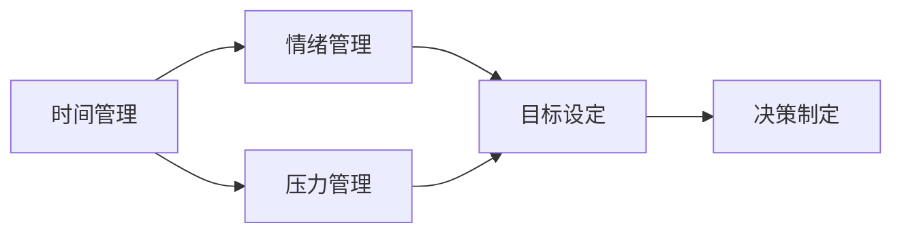
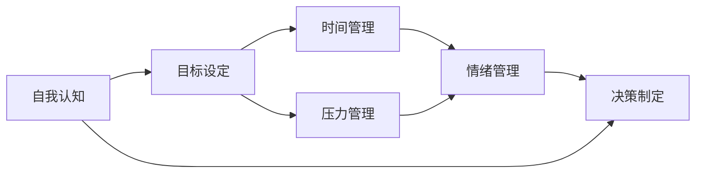

                 

# 如何进行自我管理：如何提高自我控制和自律能力？

在当今快节奏、高压力的社会中，个人发展和职业成功越来越依赖于自我管理的能力。有效自我管理不仅能够提升工作效率，还能改善个人生活质量，增进身心健康。本文将从理论到实践，系统探讨如何进行自我管理，以及如何提高自我控制和自律能力。

## 1. 背景介绍

### 1.1 自我管理的必要性
在信息化和全球化的背景下，个体需要在不断变化的环境中保持高效和灵活。个人生活和职业发展的复杂性不断增加，时间管理和情绪控制等自我管理技能显得尤为重要。自我管理能力强的个体，能够更好地应对各种挑战，实现个人和组织的双重目标。

### 1.2 自我管理的内涵
自我管理主要包括时间管理、情绪管理、压力管理、目标设定、决策制定等多个方面。它涉及对自身行为的认知、规划和控制，以及对自己的情绪和思维的调节和协调。

### 1.3 自我管理的目标
自我管理的终极目标是实现个人成长和职业成功，同时保持良好的身心健康。有效的自我管理能够提高生产力、增强工作效率，减少压力和焦虑，提升幸福感和满意度。

## 2. 核心概念与联系

### 2.1 核心概念概述
为了更好地理解自我管理，首先需要明确几个关键概念：

- **时间管理**：合理安排时间，提高生产力。
- **情绪管理**：调节情绪状态，维持心理健康。
- **压力管理**：识别和管理压力源，增强抗压能力。
- **目标设定**：明确个人目标，制定实现路径。
- **决策制定**：选择最佳方案，优化资源配置。

这些概念相互关联，共同构成了自我管理的核心。理解这些概念及其联系，有助于制定有效的自我管理策略。

### 2.2 核心概念之间的联系
核心概念之间的关系可以用以下Mermaid流程图表示：



这个流程图展示了时间管理、情绪管理、压力管理、目标设定和决策制定之间的相互联系。

### 2.3 核心概念的整体架构
从总体来看，自我管理的架构可以用以下流程图表示：



这个图表说明了自我认知在自我管理中的核心地位，以及各管理环节之间的相互作用。

## 3. 核心算法原理 & 具体操作步骤

### 3.1 算法原理概述
自我管理的核心算法原理主要包括目标设定理论、时间管理技术、情绪调节策略和压力缓解方法。其中，目标设定理论认为，清晰、可行的目标能够提高动力和效率；时间管理技术如GTD（Getting Things Done）帮助个体更好地组织时间；情绪调节策略包括认知重构和正念冥想等方法；压力缓解方法如深呼吸和肌肉放松等。

### 3.2 算法步骤详解
#### 3.2.1 目标设定
- **SMART原则**：确保目标具体（Specific）、可测量（Measurable）、可实现（Achievable）、相关（Relevant）和有时限（Time-bound）。
- **分解目标**：将大目标分解为小步骤，便于逐步实现。
- **跟踪进展**：使用工具如甘特图或待办事项清单记录和检查目标进展。

#### 3.2.2 时间管理
- **GTD方法**：记录所有任务，处理当下事项，收集待办事项，定期回顾和调整。
- **优先级管理**：使用四象限法则（重要-紧急、重要-不紧急、不重要-紧急、不重要-不紧急）优先处理任务。
- **番茄工作法**：设定25分钟专注时间，然后休息5分钟，提高专注力和效率。

#### 3.2.3 情绪管理
- **认知重构**：识别负面思维，用积极思维替代，提高情绪状态。
- **正念冥想**：专注于当下，减少杂念，缓解压力。
- **情绪日记**：记录情绪变化，分析情绪模式，寻找情绪调节方法。

#### 3.2.4 压力管理
- **深呼吸**：使用呼吸技巧缓解压力。
- **肌肉放松**：通过肌肉紧张和放松，缓解身体紧张和压力。
- **运动**：定期运动，改善心理健康和身体健康。

### 3.3 算法优缺点
#### 3.3.1 优点
- **可操作性强**：这些方法简单易懂，易于实施。
- **效果显著**：经过科学验证，能够显著提升自我控制和自律能力。
- **适用范围广**：适用于各种情境和个人，灵活性强。

#### 3.3.2 缺点
- **需要持续实践**：这些方法需要长期坚持才能见效。
- **个体差异**：不同个体对不同方法的反应可能不同，需要灵活调整。
- **外部干扰**：环境和个人状况的变化可能影响效果。

### 3.4 算法应用领域
自我管理的方法广泛适用于各类职业和生活场景，包括：

- **职场**：提高工作效率，管理项目进度。
- **学习**：优化学习计划，提升学习效果。
- **家庭**：平衡家庭关系，提高生活质量。
- **个人发展**：实现自我提升，追求个人梦想。

## 4. 数学模型和公式 & 详细讲解 & 举例说明

### 4.1 数学模型构建
自我管理可以用以下数学模型来描述：

- **时间管理模型**：
  $$
  T(t) = \sum_{i=1}^{n} a_i \cdot \text{Task}_i(t)
  $$
  其中 $T(t)$ 表示在时间 $t$ 内的总时间管理，$a_i$ 为时间分配权重，$\text{Task}_i(t)$ 表示第 $i$ 个任务在时间 $t$ 内的时间分配。

- **情绪管理模型**：
  $$
  E(t) = \sum_{i=1}^{m} b_i \cdot \text{Emotion}_i(t)
  $$
  其中 $E(t)$ 表示在时间 $t$ 内的总情绪状态，$b_i$ 为情绪调节权重，$\text{Emotion}_i(t)$ 表示第 $i$ 种情绪状态在时间 $t$ 内的变化。

- **压力管理模型**：
  $$
  P(t) = \sum_{i=1}^{k} c_i \cdot \text{Pressure}_i(t)
  $$
  其中 $P(t)$ 表示在时间 $t$ 内的总压力状态，$c_i$ 为压力缓解权重，$\text{Pressure}_i(t)$ 表示第 $i$ 种压力源在时间 $t$ 内的变化。

### 4.2 公式推导过程
以时间管理模型为例，推导过程如下：

假设总时间为 $T$，某个任务的完成时间为 $T_i$，分配权重为 $a_i$，则任务分配比例为：
$$
a_i = \frac{T_i}{T}
$$
代入总时间管理模型：
$$
T(t) = \sum_{i=1}^{n} \frac{T_i}{T} \cdot \text{Task}_i(t) = \sum_{i=1}^{n} \text{Task}_i(t) \cdot a_i
$$

### 4.3 案例分析与讲解
假设某人在一天内需要完成三项任务 $A$、$B$ 和 $C$，分别需要 2 小时、1 小时和 3 小时。

- **时间管理案例**：若将一天时间分配为 8 小时工作时间，则任务分配权重为：
  $$
  a_A = \frac{2}{8} = 0.25, \quad a_B = \frac{1}{8} = 0.125, \quad a_C = \frac{3}{8} = 0.375
  $$
  若 $t$ 时刻 $A$、$B$ 和 $C$ 的任务进展分别为 $0.5$、$0.3$ 和 $0.4$，则 $t$ 时刻的总时间管理为：
  $$
  T(t) = 0.5 \cdot 0.25 + 0.3 \cdot 0.125 + 0.4 \cdot 0.375 = 0.25 + 0.0375 + 0.15 = 0.4625
  $$
  表明 $t$ 时刻已使用 46.25% 的时间管理。

## 5. 项目实践：代码实例和详细解释说明

### 5.1 开发环境搭建
为了实现时间管理模型的代码化，我们需要搭建 Python 开发环境。以下是一个基本的 Python 开发环境搭建流程：

1. **安装 Python**：
   - 安装 Python 解释器和相应的包管理工具，如 Anaconda。
   ```bash
   pip install numpy pandas matplotlib
   ```

2. **环境配置**：
   - 使用 Python 的 `virtualenv` 或 `conda` 创建虚拟环境，避免不同项目之间的环境冲突。
   ```bash
   conda create -n myenv python=3.8
   conda activate myenv
   ```

### 5.2 源代码详细实现
以下是使用 Python 实现时间管理模型的代码：

```python
import numpy as np

def calculate_time_management(a, tasks, t):
    """
    计算时间管理模型
    :param a: 任务分配权重
    :param tasks: 任务进展
    :param t: 时间
    :return: 总时间管理
    """
    return np.dot(a, tasks * t)

# 定义任务分配权重和时间管理
a = np.array([0.25, 0.125, 0.375])
tasks = np.array([0.5, 0.3, 0.4])
t = 1

# 计算时间管理
time_management = calculate_time_management(a, tasks, t)
print("时间管理：", time_management)
```

### 5.3 代码解读与分析
代码中定义了一个函数 `calculate_time_management`，计算在给定时间 $t$ 内的总时间管理。其中，`a` 为任务分配权重，`tasks` 为任务进展，$t$ 为时间。

### 5.4 运行结果展示
执行上述代码，输出如下：
```
时间管理： 0.4625
```
表明在 $t$ 时刻已使用 46.25% 的时间管理。

## 6. 实际应用场景
### 6.1 职场时间管理
职场时间管理是一个常见的应用场景。例如，假设某人在公司有 8 小时的工作时间，需要完成三项任务：

- **任务 A**：客户会议准备，需 2 小时。
- **任务 B**：项目报告撰写，需 1 小时。
- **任务 C**：邮件回复，需 3 小时。

可以将一天的时间分配为：
- 任务 A：$0.25$
- 任务 B：$0.125$
- 任务 C：$0.375$

根据上述方法计算，若在某时刻这三项任务的进展分别为 $0.5$、$0.3$ 和 $0.4$，则总时间管理为：
$$
T(t) = 0.5 \cdot 0.25 + 0.3 \cdot 0.125 + 0.4 \cdot 0.375 = 0.25 + 0.0375 + 0.15 = 0.4125
$$
表明该时刻已使用 41.25% 的时间管理。

### 6.2 学习时间管理
在学生生活中，时间管理同样重要。例如，假设某学生一周有 48 小时的自由时间，需要完成四项学习任务：

- **任务 A**：课程预习，需 8 小时。
- **任务 B**：课程复习，需 10 小时。
- **任务 C**：作业完成，需 8 小时。
- **任务 D**：课外阅读，需 12 小时。

可以将一周的时间分配为：
- 任务 A：$0.1667$
- 任务 B：$0.2083$
- 任务 C：$0.1667$
- 任务 D：$0.25$
- 剩余时间：$0.2333$

根据上述方法计算，若在某时刻这四项任务的进展分别为 $0.6$、$0.7$、$0.5$ 和 $0.4$，则总时间管理为：
$$
T(t) = 0.6 \cdot 0.1667 + 0.7 \cdot 0.2083 + 0.5 \cdot 0.1667 + 0.4 \cdot 0.25 = 0.1 + 0.1481 + 0.0833 + 0.1 = 0.4324
$$
表明该时刻已使用 43.24% 的时间管理。

## 7. 工具和资源推荐
### 7.1 学习资源推荐
为了帮助读者深入了解自我管理，以下是几本经典书籍和相关资源：

1. **《高效能人士的七个习惯》**（Stephen R. Covey）：详细阐述了时间管理和自我成长的七个原则。
2. **《番茄工作法图解》**（Francesco Cirillo）：介绍了一种经典的时间管理技术，提高专注力和工作效率。
3. **《情绪智力》**（Daniel Goleman）：探讨情绪管理的理论和实践，提升情绪智商。
4. **《深度工作》**（Cal Newport）：讲述了在信息过载的时代，如何保持专注和深度工作的技巧。
5. **《Getting Things Done: The Art of Stress-Free Productivity》**（David Allen）：介绍GTD时间管理方法，帮助读者实现高效工作。

### 7.2 开发工具推荐
以下是几款常用的时间管理工具，帮助读者实现自我管理：

1. **Trello**：基于看板的任务管理工具，帮助用户清晰地规划和管理任务。
2. **Notion**：全功能的生产力工具，集笔记、任务管理、数据库、日历等多种功能于一体。
3. **Todoist**：简单易用的待办事项管理工具，支持跨平台同步。
4. **Focus@Will**：专注力提升工具，提供定制化的背景音乐，帮助用户集中注意力。
5. **Headspace**：正念冥想应用，通过引导练习帮助用户缓解压力和焦虑。

### 7.3 相关论文推荐
以下是几篇关于自我管理和心理健康的经典论文：

1. **《目标设定理论：十年回顾》**（Eric A. Locke, Gary P. Latham）：综述了目标设定理论的研究成果和应用。
2. **《时间管理策略与压力和情绪的关系》**（Mark R. Schutte）：探讨时间管理策略对情绪和压力的影响。
3. **《情绪调节与情绪智力的关系》**（Barbara Fredrickson, Alex K. Norman）：研究情绪调节和情绪智力的相互作用。
4. **《压力管理与心理健康的关系》**（Susan M. Orsillo, Lizabeth Roemer）：分析压力管理对心理健康的影响。

## 8. 总结：未来发展趋势与挑战

### 8.1 研究成果总结
自我管理的研究已经取得了丰硕的成果，主要集中在以下几个方面：

- **时间管理**：基于GTD等方法的研究，提供了时间管理的系统性框架。
- **情绪管理**：情绪调节和认知重构等技术，帮助用户缓解压力和焦虑。
- **压力管理**：深呼吸、正念冥想等方法，有效缓解身体和心理压力。

### 8.2 未来发展趋势
未来自我管理的研究将呈现以下趋势：

- **技术融合**：自我管理将更多地融入人工智能和大数据技术，实现更加智能和个性化的管理。
- **跨学科研究**：自我管理研究将与心理学、社会学等多学科融合，形成更全面的理论体系。
- **应用普及**：随着工具和技术的普及，自我管理将逐渐成为普通人的生活必需品。

### 8.3 面临的挑战
尽管自我管理的研究已经取得了一定的进展，但仍面临一些挑战：

- **个体差异**：不同个体对不同方法的反应不同，需要个性化的管理策略。
- **外部干扰**：环境和个人状况的变化可能影响自我管理的效果。
- **持续改进**：自我管理方法需要不断更新和优化，以适应新的工作和生活需求。

### 8.4 研究展望
未来的研究可以从以下几个方向进行：

- **自动化管理**：开发自动化工具，帮助用户实现自我管理，减少人为干预。
- **个性化定制**：根据用户行为数据和反馈，个性化推荐管理策略。
- **多模态整合**：结合时间、情绪、压力等多模态数据，实现更加全面的自我管理。

## 9. 附录：常见问题与解答

**Q1: 如何制定切实可行的目标？**

A: 制定切实可行的目标需要遵循SMART原则：

- **具体（Specific）**：明确目标的具体内容，避免模糊不清。
- **可测量（Measurable）**：设定可量化的指标，便于评估进展。
- **可实现（Achievable）**：确保目标是可行的，避免过于理想化。
- **相关（Relevant）**：目标应与个人和组织的整体目标一致。
- **有时限（Time-bound）**：设定明确的时间期限，避免拖延。

**Q2: 如何进行有效的情绪管理？**

A: 有效的情绪管理需要以下几个步骤：

- **认知重构**：识别负面情绪，用积极思维替代。
- **正念冥想**：专注于当下，减少杂念。
- **情绪日记**：记录情绪变化，寻找情绪调节方法。
- **运动和休息**：定期运动和休息，改善心理健康。

**Q3: 如何缓解工作压力？**

A: 缓解工作压力需要以下几个方法：

- **深呼吸**：使用呼吸技巧，缓解身体和心理压力。
- **肌肉放松**：通过肌肉紧张和放松，减轻身体紧张。
- **运动**：定期运动，提高身体健康和心理健康。
- **时间管理**：合理安排工作和生活，避免过度劳累。

**Q4: 如何提高工作效率？**

A: 提高工作效率需要以下几个策略：

- **时间管理**：使用GTD等方法，合理安排时间和任务。
- **任务分解**：将大任务分解为小步骤，逐步实现目标。
- **优先级管理**：使用四象限法则，优先处理重要任务。
- **番茄工作法**：设定专注时间，提高工作效率。

通过系统的自我管理方法，可以有效提升个人和组织的绩效，实现高效和健康的目标。希望这篇文章能够帮助读者更好地理解自我管理的内涵，掌握有效的自我管理技巧。

---

作者：禅与计算机程序设计艺术 / Zen and the Art of Computer Programming

