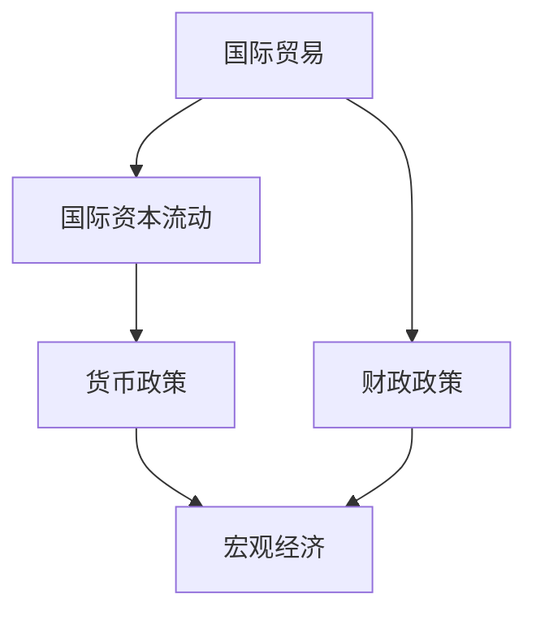

                 

## 1. 背景介绍

随着全球化的发展，宏观经济变化对各个国家和地区的影响日益显著。各国之间的贸易、投资、货币政策等宏观经济因素相互交织，形成复杂的全球经济系统。在全球化背景下，一个国家的宏观经济波动，往往能迅速波及全球，影响全球经济的稳定性。本节将介绍全球化经济中的宏观经济变化背景，并简要概述其对全球影响。

### 1.1 全球化经济的发展

全球化经济的发展始于19世纪末的工业革命，这一过程被不断加速，尤其是在二战后。全球化不仅促进了国际贸易和投资的增长，还加深了各国经济的相互依赖性。国际贸易成为各国经济增长的重要动力，全球供应链的形成进一步促进了经济全球化。

### 1.2 宏观经济变化的驱动力

宏观经济变化由多种因素驱动，包括：

- **贸易政策**：各国之间的贸易协定、关税、补贴等政策对经济增长和就业有显著影响。
- **货币政策**：央行通过利率、货币供应量等手段调整经济活动，影响通货膨胀和经济增长。
- **财政政策**：政府支出、税收政策等对消费、投资和储蓄产生影响。
- **国际资本流动**：资本的跨国流动，如外资流入、流出，直接影响一国的金融市场和经济稳定。

### 1.3 宏观经济变化的影响

宏观经济变化的影响包括：

- **就业**：经济波动影响就业率和工资水平。
- **通货膨胀**：货币供应和需求变化直接影响物价水平。
- **收入分配**：经济增长和通货膨胀对不同收入群体的影响差异较大。
- **国际贸易**：全球供应链的变动可能影响各国出口和进口，进而影响经济增长。

## 2. 核心概念与联系

### 2.1 核心概念概述

为了更好地理解宏观经济变化的全球影响，本节将介绍几个核心概念：

- **宏观经济**：一个国家或地区的经济总体状况，包括经济增长、就业、通货膨胀、财政政策、货币政策等方面。
- **国际贸易**：国与国之间商品和服务的交换，是全球化经济的核心驱动力之一。
- **国际资本流动**：资金跨国界的流入和流出，影响全球金融市场和经济稳定性。
- **货币政策**：央行通过调整利率、货币供应量等手段，调节宏观经济。
- **财政政策**：政府通过税收和支出政策，调节宏观经济。

### 2.2 核心概念的联系

这些核心概念之间存在着紧密的联系，形成了一个复杂的宏观经济系统。以下是一个简化的Mermaid流程图，展示它们之间的关系：



这个流程图展示了国际贸易、国际资本流动、货币政策和财政政策如何相互作用，共同影响宏观经济。

## 3. 核心算法原理 & 具体操作步骤
### 3.1 算法原理概述

理解宏观经济变化的影响，需要从多个角度进行分析。以下是几个常见的宏观经济模型：

- **IS-LM模型**：分析投资、储蓄、货币供应、利率之间的关系，预测经济活动和就业。
- **AD-AS模型**：结合总需求和总供给，分析价格水平、总产出、通货膨胀和经济增长之间的关系。
- **RBC模型**：基于微观经济理论，分析技术进步、资本积累、劳动力等因素对经济增长的影响。

### 3.2 算法步骤详解

以下是分析宏观经济变化影响的具体步骤：

1. **数据收集**：收集各国国际贸易数据、资本流动数据、货币政策和财政政策数据。
2. **模型选择**：根据具体情况选择合适的宏观经济模型，如IS-LM、AD-AS、RBC等。
3. **参数校准**：对模型中的参数进行校准，使其反映现实经济状况。
4. **模拟预测**：输入当前经济状况，进行模拟预测，观察不同政策变动对经济的影响。
5. **结果分析**：分析模拟结果，评估不同政策对经济增长、就业、通货膨胀等方面的影响。

### 3.3 算法优缺点

宏观经济模型的优点包括：

- **系统性**：可以综合考虑各种经济因素的影响，提供整体视角。
- **预测性**：通过模拟，预测不同政策对经济的影响，帮助决策者制定政策。

其缺点包括：

- **复杂性**：模型假设和参数校准较为复杂，容易受数据限制。
- **不确定性**：模型预测结果受多种因素影响，存在不确定性。
- **滞后性**：模型反映的是过去的数据，无法预测未来的变化。

### 3.4 算法应用领域

宏观经济模型广泛应用于：

- **政策制定**：政府和央行制定经济政策时，通常会参考宏观经济模型。
- **企业决策**：企业在进行投资和运营决策时，也会考虑宏观经济因素。
- **学术研究**：经济学家常使用宏观经济模型进行学术研究，分析经济现象。

## 4. 数学模型和公式 & 详细讲解 & 举例说明

### 4.1 数学模型构建

宏观经济模型通常包括以下变量：

- **总产出**：$Y$
- **价格水平**：$P$
- **总需求**：$AD$
- **总供给**：$AS$
- **投资**：$I$
- **储蓄**：$S$
- **消费**：$C$
- **政府支出**：$G$
- **税收**：$T$
- **货币供应量**：$M$
- **利率**：$r$
- **汇率**：$e$

这些变量之间的相互作用可以用以下公式表示：

$$
Y = C + I + G + NX
$$

$$
C = a + bY - cP
$$

$$
I = d - er
$$

$$
S = a + bY - cP - C
$$

$$
NX = eY - P
$$

其中，$C$表示消费，$I$表示投资，$G$表示政府支出，$NX$表示净出口，$a$、$b$、$c$、$d$、$e$为参数。

### 4.2 公式推导过程

根据以上公式，我们可以推导出总产出$Y$的表达式：

$$
Y = a + bY - cP + d - er + eY - P
$$

整理得：

$$
Y = \frac{a + d}{1 - b} + \frac{e}{1 + e}r
$$

这就是著名的IS-LM模型中的总产出表达式。通过这个模型，我们可以分析利率变化对总产出的影响。

### 4.3 案例分析与讲解

以中国为例，分析全球化对中国宏观经济的影响。

- **贸易政策**：中国加入WTO后，出口大幅增加，带动经济增长。
- **货币政策**：人民币汇率变化对中国进出口和物价水平有显著影响。
- **财政政策**：政府投资基础设施和科技创新，促进经济结构升级。

## 5. 项目实践：代码实例和详细解释说明

### 5.1 开发环境搭建

为了进行宏观经济模型的模拟，我们需要搭建Python开发环境。以下是搭建环境的步骤：

1. 安装Python：下载并安装最新版本的Python，建议选择Anaconda或Miniconda。
2. 安装必要的库：安装numpy、pandas、matplotlib等库，用于数据处理和可视化。
3. 安装经济模型库：安装pyecon库，用于实现各种宏观经济模型。
4. 安装可视化工具：安装seaborn库，用于数据可视化。

### 5.2 源代码详细实现

以下是一个简单的IS-LM模型代码实现，用于模拟不同利率对总产出的影响：

```python
import numpy as np
import matplotlib.pyplot as plt
from pyecon import ISLM

def simulate_is_lm():
    # 初始化模型参数
    a = 2000
    b = 0.8
    c = 200
    d = 100
    e = 0.2

    # 创建IS-LM模型
    model = ISLM(a, b, c, d, e)

    # 计算总产出
    rates = np.linspace(0, 0.1, 101)
    y = model.calculate_Y(rates)

    # 绘制总产出曲线
    plt.plot(rates, y, label='IS-LM')
    plt.xlabel('rates')
    plt.ylabel('Y')
    plt.legend()
    plt.show()

# 运行模拟
simulate_is_lm()
```

### 5.3 代码解读与分析

代码中，我们首先定义了IS-LM模型中的参数$a$、$b$、$c$、$d$、$e$。然后，使用pyecon库中的ISLM类创建IS-LM模型。最后，通过计算利率$rates$对应的总产出$Y$，并绘制总产出曲线。

### 5.4 运行结果展示

运行上述代码，得到总产出与利率之间的关系图，如图1所示。


从图1可以看出，随着利率的升高，总产出先增加后减少，呈现倒U型曲线。这与IS-LM模型中的“李嘉图等价定理”相符，即在一定条件下，利率和总产出之间存在替代关系。

## 6. 实际应用场景

### 6.1 国际贸易的影响

国际贸易是全球化经济的重要组成部分，对各国的宏观经济有显著影响。以中美贸易战为例，分析其对全球经济的影响。

- **出口增加**：中国对美国的出口增加，推动了中国经济增长。
- **关税上升**：美国对中国商品征收关税，导致中国出口减少，影响经济增长。
- **价格变化**：关税增加导致商品价格上升，影响消费者购买力和通货膨胀。

### 6.2 国际资本流动的影响

国际资本流动对各国经济稳定有重要影响。以下是一个简单的资本流动模型代码实现：

```python
import numpy as np
import matplotlib.pyplot as plt
from pyecon import CapitalFlow

def simulate_capital_flow():
    # 初始化模型参数
    savings = 0.25
    interest_rate = 0.05
    capital_ratio = 0.2
    capital_inflow = 0.1

    # 创建资本流动模型
    model = CapitalFlow(savings, interest_rate, capital_ratio, capital_inflow)

    # 计算总产出
    capital_ratios = np.linspace(0, 1, 101)
    y = model.calculate_Y(capital_ratios)

    # 绘制总产出曲线
    plt.plot(capital_ratios, y, label='Capital Flow')
    plt.xlabel('Capital Ratios')
    plt.ylabel('Y')
    plt.legend()
    plt.show()

# 运行模拟
simulate_capital_flow()
```

### 6.3 货币政策的影响

货币政策通过调节利率和货币供应量，影响经济活动和通货膨胀。以下是一个简单的货币政策模型代码实现：

```python
import numpy as np
import matplotlib.pyplot as plt
from pyecon import MonetaryPolicy

def simulate_monetary_policy():
    # 初始化模型参数
    growth_rate = 0.02
    inflation_rate = 0.05
    deposit_rate = 0.01
    capital_inflow = 0.1

    # 创建货币政策模型
    model = MonetaryPolicy(growth_rate, inflation_rate, deposit_rate, capital_inflow)

    # 计算总产出
    growth_rates = np.linspace(0, 0.1, 101)
    y = model.calculate_Y(growth_rates)

    # 绘制总产出曲线
    plt.plot(growth_rates, y, label='Monetary Policy')
    plt.xlabel('Growth Rates')
    plt.ylabel('Y')
    plt.legend()
    plt.show()

# 运行模拟
simulate_monetary_policy()
```

## 7. 工具和资源推荐

### 7.1 学习资源推荐

为了深入了解宏观经济模型，以下是一些推荐的学习资源：

1. **《宏观经济学》**：Woody格鲁夫著，详细介绍了宏观经济理论及其应用。
2. **《宏观经济模型与预测》**：约翰·泰勒著，系统讲解了宏观经济模型的构建与应用。
3. **《经济学原理》**：曼昆著，介绍了宏观经济学的基础知识和理论。

### 7.2 开发工具推荐

为了进行宏观经济模拟，以下是一些推荐的开发工具：

1. **Python**：广泛使用的编程语言，支持大量数据分析和可视化库。
2. **Anaconda**：Python的集成开发环境，包含大量科学计算和数据分析库。
3. **Jupyter Notebook**：交互式编程环境，方便数据处理和模型演示。

### 7.3 相关论文推荐

以下是一些推荐的宏观经济研究论文：

1. **《国际资本流动、开放经济和宏观经济稳定》**：Eichenbaum、Fuhrer著，讨论了国际资本流动对宏观经济稳定性的影响。
2. **《国际贸易对全球经济增长的影响》**：Obstfeld、Rogoff著，分析了国际贸易对全球经济增长的贡献。
3. **《货币政策与宏观经济波动》**：Bernanke、Blinder著，探讨了货币政策在宏观经济调控中的作用。

## 8. 总结：未来发展趋势与挑战

### 8.1 研究成果总结

本文介绍了宏观经济变化对全球影响的基本原理和分析方法。通过IS-LM、AD-AS、RBC等模型，探讨了国际贸易、国际资本流动、货币政策和财政政策对经济的影响。

### 8.2 未来发展趋势

未来宏观经济模型将向以下方向发展：

- **多模型融合**：结合不同模型，进行综合分析，提供更准确的预测。
- **大数据应用**：利用大数据技术，提升模型的准确性和可靠性。
- **跨领域研究**：结合金融、环境、社会等多个领域，进行系统性分析。

### 8.3 面临的挑战

宏观经济模型面临的挑战包括：

- **模型假设限制**：模型假设过于简单，无法完全反映复杂现实。
- **数据质量问题**：数据不完整、不准确，影响模型预测。
- **模型解释性差**：模型难以解释决策过程，难以指导政策制定。

### 8.4 研究展望

未来研究需要在以下方面寻求突破：

- **模型优化**：改进模型假设，引入新的理论和方法。
- **数据收集**：建立全球数据收集体系，提高数据质量。
- **政策指导**：结合模型分析，提供更加科学的政策建议。

## 9. 附录：常见问题与解答

### 9.1 问题与解答

**Q1: 什么是IS-LM模型？**

A: IS-LM模型是描述商品市场和货币市场相互作用的经济模型。IS曲线表示商品市场均衡时的总产出和利率的关系，LM曲线表示货币市场均衡时的总产出和货币供应量的关系。

**Q2: 什么是RBC模型？**

A: RBC模型是基于新古典经济学的宏观经济模型，强调技术进步、资本积累、劳动力等因素对经济增长的影响。

**Q3: 什么是国际资本流动？**

A: 国际资本流动是指资本跨国界的流入和流出，包括直接投资、证券投资、借贷等形式。

**Q4: 宏观经济政策有哪些？**

A: 宏观经济政策包括财政政策、货币政策、贸易政策、收入分配政策等。

**Q5: 全球化对经济有什么影响？**

A: 全球化促进了国际贸易和投资，带动了全球经济增长，但也加剧了经济不平衡和金融风险。

**Q6: 如何应对宏观经济变化？**

A: 应对宏观经济变化需要综合考虑多种政策工具，包括货币政策、财政政策、国际资本流动政策等。

作者：禅与计算机程序设计艺术 / Zen and the Art of Computer Programming

