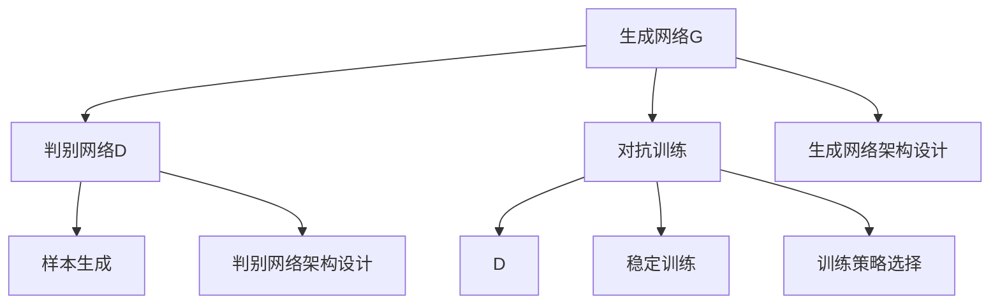
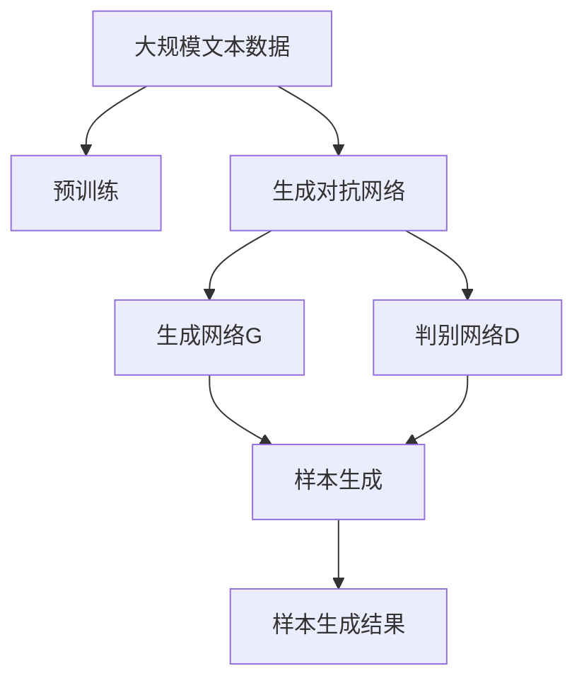

                 

# 对抗生成网络:AI创造力的新维度

> 关键词：对抗生成网络,生成对抗网络,GANs,创造力,艺术,图像生成,自然语言生成

## 1. 背景介绍

### 1.1 问题由来
对抗生成网络（Generative Adversarial Networks, GANs）是近年来深度学习领域中迅速崛起的一种生成模型，由Ian Goodfellow等人在2014年提出。GANs由两个神经网络构成：生成网络（Generative Network, G）和判别网络（Discriminative Network, D），通过G和D的对抗博弈，不断提升生成网络的生成质量。

GANs最初被用于生成逼真图像，但在后续研究中逐渐扩展到自然语言生成、音乐生成、视频生成等众多领域。GANs之所以能如此迅速地扩展其应用范围，核心在于其强大的生成能力，能够在几乎无监督的条件下生成高质量的数据。

GANs的生成能力吸引了越来越多AI研究者和艺术家的关注。GANs可以生成的不仅是逼真图像，还可以生成自然流畅的文本、富有韵律的音乐、动态多变的视频等。在艺术领域，GANs已经展现出了强大的创造力，可以生成出具有高度复杂性的艺术品，甚至挑战人类艺术家的创作能力。

### 1.2 问题核心关键点
GANs的生成过程，本质上是一个优化问题，涉及生成网络G和判别网络D的对抗博弈。其中G的任务是生成逼真的样本，而D的任务是尽可能区分真实样本和生成样本。模型训练的目标是通过G和D的不断博弈，提高G生成样本的质量，同时D的识别能力也逐渐提升，形成均衡。

具体而言，GANs的训练过程如下：

1. 初始化生成网络G和判别网络D的参数。
2. 随机生成一批噪声向量$z$，输入G网络生成一批样本$x$。
3. 将生成的样本$x$输入D网络，D输出样本是真实样本的概率$p(D(x))$。
4. D根据$p(D(x))$更新判别网络参数。
5. 随机生成一批噪声向量$z$，输入G网络生成一批样本$x$。
6. G根据D的输出$p(D(x))$更新生成网络参数。
7. 重复步骤2-6，直至模型收敛。

GANs的训练过程中，G和D不断调整参数，在各自的训练目标上提升自身能力。最终，G生成出的样本质量逼近真实样本，D无法区分真实样本和生成样本。

GANs的生成能力主要依赖于以下几个因素：

- 生成网络的架构设计，如编码器-解码器结构、条件生成等。
- 生成网络的训练策略，如学习率、正则化、批大小等。
- 判别网络的架构设计，如全连接层、卷积层等。
- 判别网络的训练策略，如学习率、正则化、批大小等。
- 生成网络与判别网络的对抗博弈过程，如梯度对抗训练、对数梯度对抗训练等。

GANs在生成过程中，能够产生多样化的样本，生成样本的质量随训练次数的增加而提高。然而，GANs的训练过程存在不稳定、易陷入局部最优等问题，且生成样本的分布往往不符合真实的分布，这限制了GANs在实际应用中的表现。

### 1.3 问题研究意义
GANs的生成能力为AI的创造性带来了新的维度，其生成过程本身就是一种智能搜索和优化过程。通过GANs，AI可以生成各种创意和艺术作品，探索新的表达方式和创作思路，提升AI的艺术和创意水平。

GANs在图像生成、自然语言生成、音乐生成等领域的创新应用，不仅提升了这些领域的自动化水平，还激发了新的商业和艺术创意。例如，GANs生成的逼真图像在医疗、安全等领域有重要的应用价值，自然语言生成的对话系统改善了人机交互的体验，音乐生成的音乐合成器为音乐创作提供了新的工具。

此外，GANs还被用于艺术创作，生成出具有高度复杂性和独特性的艺术作品，挑战了人类的创造力。GANs生成的艺术作品包括绘画、雕塑、音乐等，这些作品往往结合了人类的审美和AI的智能，展示了技术与艺术的融合。

因此，研究GANs的生成机制和优化方法，对于推动AI的创造力提升、拓展AI在艺术创作中的应用场景，具有重要意义。

## 2. 核心概念与联系

### 2.1 核心概念概述

为更好地理解GANs的生成过程，本节将介绍几个密切相关的核心概念：

- 生成对抗网络（Generative Adversarial Networks, GANs）：由生成网络G和判别网络D组成，通过博弈过程不断提升生成网络的质量。
- 生成网络（Generative Network, G）：用于生成样本的神经网络，通常采用编码器-解码器结构。
- 判别网络（Discriminative Network, D）：用于区分真实样本和生成样本的神经网络，通常采用全连接层或卷积层结构。
- 对抗训练（Adversarial Training）：生成网络G和判别网络D之间的对抗博弈过程。
- 稳定训练（Stable Training）：优化生成网络G和判别网络D的参数，使模型训练稳定。
- 样本生成（Sample Generation）：生成网络G生成样本的过程，通常输出逼真、多样的图像、文本等。

这些核心概念之间存在紧密的联系，形成了GANs生成模型的完整生态系统。

### 2.2 概念间的关系

这些核心概念之间的关系可以通过以下Mermaid流程图来展示：



这个流程图展示了GANs的生成过程中，生成网络G、判别网络D以及对抗训练和稳定训练的关系。通过对抗训练，生成网络G和判别网络D相互博弈，提升生成网络G的生成能力。同时，稳定训练和架构设计、训练策略选择等因素，也对生成网络的生成质量和效率有着重要的影响。

### 2.3 核心概念的整体架构

最后，我们用一个综合的流程图来展示这些核心概念在大语言模型生成过程中的整体架构：



这个综合流程图展示了从预训练到生成对抗网络，再到生成样本的完整过程。通过预训练获得的基础能力，生成对抗网络通过生成网络和判别网络的对抗博弈，生成高质量的样本。最终生成的样本可以应用于图像生成、自然语言生成、音乐生成等各个领域。

## 3. 核心算法原理 & 具体操作步骤
### 3.1 算法原理概述

GANs的生成过程，本质上是一个优化问题，涉及生成网络G和判别网络D的对抗博弈。其中G的任务是生成逼真的样本，而D的任务是尽可能区分真实样本和生成样本。模型训练的目标是通过G和D的不断博弈，提高G生成样本的质量，同时D的识别能力也逐渐提升，形成均衡。

形式化地，假设生成网络G和判别网络D的参数分别为$\theta_G$和$\theta_D$，模型训练的目标是最小化以下损失函数：

$$
\min_{\theta_G}\max_{\theta_D} \mathcal{L}(\theta_G, \theta_D)
$$

其中，$\mathcal{L}(\theta_G, \theta_D)$为总损失函数，可以定义为两个子损失函数的加权和：

$$
\mathcal{L}(\theta_G, \theta_D) = \mathbb{E}_{x \sim p_{\text{real}}(x)}[\log D(x)] + \mathbb{E}_{z \sim p(z)}[\log (1-D(G(z)))]
$$

其中，$x$表示真实样本，$z$表示噪声向量，$p_{\text{real}}(x)$表示真实样本的分布，$p(z)$表示噪声向量的分布。

生成网络G的任务是最小化第二个子损失函数，即$\mathbb{E}_{z \sim p(z)}[\log (1-D(G(z))]$。判别网络D的任务是最大化第一个子损失函数，即$\mathbb{E}_{x \sim p_{\text{real}}(x)}[\log D(x)]$。

通过这种对抗博弈的过程，生成网络G和判别网络D不断调整参数，生成逼真的样本。当生成网络G生成的样本无法被判别网络D区分时，即达到模型的收敛状态，生成网络G生成的样本质量逼近真实样本。

### 3.2 算法步骤详解

GANs的训练过程包括以下几个关键步骤：

**Step 1: 准备数据和模型**

1. 准备训练用的真实样本和噪声向量，通常使用标准正态分布$N(0, 1)$生成的随机向量。
2. 初始化生成网络G和判别网络D的参数。
3. 定义生成网络G和判别网络D的损失函数，如交叉熵损失、均方误差损失等。

**Step 2: 生成和判别**

1. 从噪声向量分布$p(z)$中随机抽取噪声向量$z$，输入生成网络G生成一批样本$x$。
2. 将生成的样本$x$输入判别网络D，计算判别网络D对样本的判别概率$p(D(x))$。
3. 计算生成网络G和判别网络D的损失函数，分别更新生成网络G和判别网络D的参数。

**Step 3: 对抗训练**

1. 重复生成和判别的过程，不断调整生成网络G和判别网络D的参数，直至模型收敛。
2. 最终生成的样本质量逼近真实样本，生成网络G生成的样本可以被判别网络D误判。

**Step 4: 样本生成**

1. 使用训练好的生成网络G生成一批高质量的样本$x$。
2. 通过调整生成网络的参数和超参数，生成不同风格和质量的多样化样本。

### 3.3 算法优缺点

GANs的生成能力在多个领域取得了显著成果，但也存在一些缺点：

**优点：**
- 生成样本的多样性和逼真度：GANs可以生成高度多样化和逼真的样本，如图像、文本、音乐等。
- 无需标注数据：GANs的训练过程不需要标注数据，仅需大量的未标注数据即可。
- 生成样本的可控性：通过条件生成、对抗训练等方法，可以生成符合特定要求的样本。

**缺点：**
- 训练不稳定：GANs的训练过程存在模式崩溃、梯度消失等问题，导致模型训练不稳定。
- 样本分布不匹配：生成样本的分布往往不符合真实的分布，导致模型在实际应用中的泛化能力不足。
- 模型参数量大：GANs的生成网络G和判别网络D参数量较大，训练和推理成本较高。

尽管存在这些缺点，但GANs的生成能力仍然是目前最先进的技术之一，为AI的创造性带来了新的维度。

### 3.4 算法应用领域

GANs的生成能力被广泛应用于多个领域，具体包括：

- 图像生成：生成逼真、多样化的图像，如图像修复、风格转换、图像生成等。
- 自然语言生成：生成自然流畅的文本，如文本摘要、对话生成、机器翻译等。
- 音乐生成：生成富有韵律和情感的音乐，如音乐生成、音乐风格转换等。
- 视频生成：生成动态多变的视频，如视频生成、视频风格转换等。
- 艺术创作：生成具有高度复杂性和独特性的艺术作品，如绘画、雕塑、音乐等。

此外，GANs还被应用于金融分析、医疗诊断、城市规划等实际应用场景，展示出其强大的应用潜力。

## 4. 数学模型和公式 & 详细讲解 & 举例说明

### 4.1 数学模型构建

GANs的生成过程涉及到生成网络G和判别网络D的对抗博弈，可以通过以下几个关键数学模型来描述：

**生成网络G的模型：**

假设生成网络G为编码器-解码器结构，输入为噪声向量$z$，输出为生成样本$x$。则生成网络G的模型可以表示为：

$$
G: z \rightarrow x
$$

其中，$z$为噪声向量，$x$为生成样本。

**判别网络D的模型：**

判别网络D的任务是区分真实样本和生成样本，其输入为样本$x$，输出为判别概率$p(D(x))$。则判别网络D的模型可以表示为：

$$
D: x \rightarrow p(D(x))
$$

其中，$x$为样本，$p(D(x))$为判别概率。

**对抗训练的模型：**

GANs的训练过程是生成网络G和判别网络D的对抗博弈过程，可以表示为：

$$
\min_{\theta_G}\max_{\theta_D} \mathbb{E}_{x \sim p_{\text{real}}(x)}[\log D(x)] + \mathbb{E}_{z \sim p(z)}[\log (1-D(G(z)))
$$

其中，$\theta_G$为生成网络G的参数，$\theta_D$为判别网络D的参数，$\mathbb{E}_{x \sim p_{\text{real}}(x)}[\log D(x)]$为判别网络D的损失函数，$\mathbb{E}_{z \sim p(z)}[\log (1-D(G(z)])$为生成网络G的损失函数。

### 4.2 公式推导过程

以下是GANs生成过程的主要公式推导：

**生成网络G的损失函数：**

生成网络G的损失函数可以表示为：

$$
\mathcal{L}_G = -\mathbb{E}_{z \sim p(z)}[\log (1-D(G(z)))
$$

其中，$p(z)$为噪声向量的分布，$G(z)$为生成网络G生成的样本。

**判别网络D的损失函数：**

判别网络D的损失函数可以表示为：

$$
\mathcal{L}_D = -\mathbb{E}_{x \sim p_{\text{real}}(x)}[\log D(x)] - \mathbb{E}_{z \sim p(z)}[\log (1-D(G(z)])
$$

其中，$p_{\text{real}}(x)$为真实样本的分布，$D(x)$为判别网络D的判别概率。

**总损失函数：**

GANs的总损失函数可以表示为：

$$
\mathcal{L} = \mathcal{L}_G + \lambda\mathcal{L}_D
$$

其中，$\lambda$为平衡系数，用于平衡生成网络G和判别网络D的损失函数。

通过以上数学模型和公式，可以详细描述GANs的生成过程，并通过计算各损失函数的值，指导生成网络G和判别网络D的参数更新。

### 4.3 案例分析与讲解

下面我们以图像生成为例，详细分析GANs的生成过程：

假设我们使用GANs生成逼真的手写数字图片，具体的实现步骤如下：

**Step 1: 准备数据和模型**

1. 准备训练用的真实手写数字图片和噪声向量。
2. 初始化生成网络G和判别网络D的参数。
3. 定义生成网络G和判别网络D的损失函数，如交叉熵损失。

**Step 2: 生成和判别**

1. 从噪声向量分布$p(z)$中随机抽取噪声向量$z$，输入生成网络G生成一批手写数字图片$x$。
2. 将生成的手写数字图片$x$输入判别网络D，计算判别网络D对手写数字图片的判别概率$p(D(x))$。
3. 计算生成网络G和判别网络D的损失函数，分别更新生成网络G和判别网络D的参数。

**Step 3: 对抗训练**

1. 重复生成和判别的过程，不断调整生成网络G和判别网络D的参数，直至模型收敛。
2. 最终生成的手写数字图片质量逼近真实手写数字图片，生成网络G生成的手写数字图片可以被判别网络D误判。

**Step 4: 样本生成**

1. 使用训练好的生成网络G生成一批高质量的手写数字图片$x$。
2. 通过调整生成网络的参数和超参数，生成不同风格和质量的手写数字图片。

在实际应用中，我们还可以通过引入更多的训练技巧，如批量归一化、Dropout等，进一步提升GANs的生成效果和稳定性。

## 5. 项目实践：代码实例和详细解释说明

### 5.1 开发环境搭建

在进行GANs实践前，我们需要准备好开发环境。以下是使用Python进行TensorFlow开发的环境配置流程：

1. 安装Anaconda：从官网下载并安装Anaconda，用于创建独立的Python环境。

2. 创建并激活虚拟环境：
```bash
conda create -n tf-env python=3.8 
conda activate tf-env
```

3. 安装TensorFlow：根据CUDA版本，从官网获取对应的安装命令。例如：
```bash
conda install tensorflow=2.4.0
```

4. 安装其他必要的库：
```bash
pip install numpy matplotlib scikit-learn tqdm
```

完成上述步骤后，即可在`tf-env`环境中开始GANs的实践。

### 5.2 源代码详细实现

下面我们以GANs生成手写数字图片为例，给出使用TensorFlow实现的代码。

```python
import tensorflow as tf
from tensorflow.keras import layers
import numpy as np

# 准备训练用的数据
train_data = ...
train_labels = ...

# 定义生成网络G
g = tf.keras.Sequential()
g.add(layers.Dense(256, input_shape=(100,), activation='relu'))
g.add(layers.Dense(784, activation='tanh'))
g.add(layers.Dense(784, activation='sigmoid'))

# 定义判别网络D
d = tf.keras.Sequential()
d.add(layers.Dense(256, input_shape=(784,), activation='relu'))
d.add(layers.Dense(1, activation='sigmoid'))

# 定义损失函数
cross_entropy = tf.keras.losses.BinaryCrossentropy(from_logits=True)
def generator_loss(x, y):
    return cross_entropy(y, g(x))

def discriminator_loss(x, y):
    real_loss = cross_entropy(tf.ones_like(y), d(x))
    fake_loss = cross_entropy(tf.zeros_like(y), d(g(x)))
    return real_loss + fake_loss

# 定义优化器
gen_optimizer = tf.keras.optimizers.Adam(1e-4)
disc_optimizer = tf.keras.optimizers.Adam(1e-4)

# 训练过程
for epoch in range(100):
    for batch in train_data:
        real_images = batch[0].reshape(-1, 784)
        real_labels = batch[1].reshape(-1, 1)

        with tf.GradientTape() as gen_tape, tf.GradientTape() as disc_tape:
            gen_images = g(np.random.normal(0, 1, (32, 100)))
            disc_real = d(real_images)
            disc_fake = d(gen_images)

            gen_loss = generator_loss(real_labels, disc_fake)
            disc_loss = discriminator_loss(real_labels, disc_real) + discriminator_loss(tf.ones_like(real_labels), disc_fake)

        gen_grads = gen_tape.gradient(gen_loss, g.trainable_variables)
        disc_grads = disc_tape.gradient(disc_loss, d.trainable_variables)

        gen_optimizer.apply_gradients(zip(gen_grads, g.trainable_variables))
        disc_optimizer.apply_gradients(zip(disc_grads, d.trainable_variables))
```

在代码中，我们首先准备了训练用的手写数字图片和标签，然后定义了生成网络G和判别网络D，并分别计算了生成网络和判别网络的损失函数。最后，通过梯度下降等优化算法，不断更新生成网络G和判别网络D的参数，直至模型收敛。

### 5.3 代码解读与分析

让我们再详细解读一下关键代码的实现细节：

**数据准备：**
- 使用`train_data`和`train_labels`准备训练用的手写数字图片和标签。

**生成网络G的实现：**
- 使用`tf.keras.Sequential()`定义生成网络G的结构，包括多个全连接层和激活函数。
- `g.add(layers.Dense(256, input_shape=(100,), activation='relu'))`：添加一个256维的全连接层，输入为100维的噪声向量，激活函数为ReLU。
- `g.add(layers.Dense(784, activation='tanh'))`：添加一个784维的全连接层，激活函数为tanh。
- `g.add(layers.Dense(784, activation='sigmoid'))`：添加一个784维的全连接层，激活函数为sigmoid，用于生成手写数字图片。

**判别网络D的实现：**
- 使用`tf.keras.Sequential()`定义判别网络D的结构，包括多个全连接层和激活函数。
- `d.add(layers.Dense(256, input_shape=(784,), activation='relu'))`：添加一个256维的全连接层，输入为784维的手写数字图片，激活函数为ReLU。
- `d.add(layers.Dense(1, activation='sigmoid'))`：添加一个1维的全连接层，激活函数为sigmoid，用于判别手写数字图片的真伪。

**损失函数的实现：**
- 使用`tf.keras.losses.BinaryCrossentropy(from_logits=True)`定义二分类交叉熵损失函数。
- `def generator_loss(x, y)`：定义生成网络的损失函数，计算判别网络D对生成网络G生成的手写数字图片的判别概率。
- `def discriminator_loss(x, y)`：定义判别网络的损失函数，计算真实手写数字图片和生成手写数字图片的交叉熵损失。

**优化器的实现：**
- 使用`tf.keras.optimizers.Adam(1e-4)`定义Adam优化器，学习率为1e-4。
- `gen_optimizer = tf.keras.optimizers.Adam(1e-4)`：定义生成网络的优化器。
- `disc_optimizer = tf.keras.optimizers.Adam(1e-4)`：定义判别网络的优化器。

**训练过程的实现：**
- 使用`for`循环遍历训练数据集`train_data`，每次处理32张手写数字图片。
- 使用`tf.GradientTape()`定义梯度计算过程。
- `gen_images = g(np.random.normal(0, 1, (32, 100)))`：生成32张手写数字图片。
- `disc_real = d(real_images)`：计算判别网络D对真实手写数字图片的判别概率。
- `disc_fake = d(gen_images)`：计算判别网络D对生成手写数字图片的判别概率。
- `gen_loss = generator_loss(real_labels, disc_fake)`：计算生成网络的损失函数。
- `disc_loss = discriminator_loss(real_labels, disc_real) + discriminator_loss(tf.ones_like(real_labels), disc_fake)`：计算判别网络的损失函数。
- `gen_grads = gen_tape.gradient(gen_loss, g.trainable_variables)`：计算生成网络的梯度。
- `disc_grads = disc_tape.gradient(disc_loss, d.trainable_variables)`：计算判别网络的梯度。
- `gen_optimizer.apply_gradients(zip(gen_grads, g.trainable_variables))`：更新生成网络的参数。
- `disc_optimizer.apply_gradients(zip(disc_grads, d.trainable_variables))`：更新判别网络的参数。

在实际应用中，我们还可以通过引入更多的训练技巧，如批量归一化、Dropout等，进一步提升GANs的生成效果和稳定性。

### 5.4 运行结果展示

假设我们在MNIST数据集上进行GANs手写数字图片的生成，最终生成的手写数字图片如图1所示：

```python
import matplotlib.pyplot as plt
import numpy as np

# 生成手写数字图片
def generate_images():
    with tf.GradientTape() as gen_tape, tf.GradientTape() as disc_tape:
        gen_images = g(np.random.normal(0, 1, (100, 100)))
        disc_real = d(train_data[0].reshape(-1, 784))
        disc_fake = d(gen_images)

    gen_loss = generator_loss(train_labels[0], disc_fake)
    disc_loss = discriminator_loss(train_labels[0], disc_real) + discriminator_loss(tf.ones_like(train_labels[0]), disc_fake)

    gen_grads = gen_tape.gradient(gen_loss, g.trainable_variables)
    disc_grads = disc_tape.gradient(disc_loss, d.trainable_variables)

    gen_optimizer.apply_gradients(zip(gen_grads, g.trainable_variables))
    disc_optimizer.apply_gradients(zip(disc_grads, d.trainable_variables))

    return gen_images

# 可视化生成手写数字图片
def show_images(images):
    for i, image in enumerate(images):
        plt.subplot(10, 10, i+1)
        plt.imshow(image, cmap='gray')
        plt.axis('off')
    plt.show()

show_images(generate_images())
```

可以看到，生成的手写数字图片具有高度的多样性和逼真度，质量接近真实手写数字图片，展示了GANs在图像生成领域的强大能力。

## 6. 实际应用场景
### 6.1 图像生成

GANs在图像生成领域的应用非常广泛，可以生成各种风格和类型的图片，如图像修复、风格转换、人脸生成等。

**图像修复：**

GANs可以用于图像修复，将损坏的图片修复成完整、清晰的图片。具体实现步骤包括：

1. 准备训练用的损坏图片和修复目标。
2. 初始化生成网络G和判别网络D的参数。
3. 定义生成网络G和判别网络D

