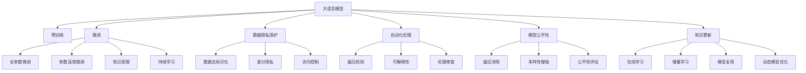

                 

# 2023年AI大模型时代的新变革

> 关键词：大模型、AI生成内容、数据隐私、自动化伦理、深度学习、人工智能、自然语言处理(NLP)

## 1. 背景介绍

### 1.1 问题由来

2023年，随着人工智能(AI)技术的不断进步，尤其是大语言模型(Big Language Models, BLMs)的飞速发展，我们正处于一个AI大模型时代的新变革之中。这个时代，大模型已成为推动AI创新和应用的主要驱动力。

大模型以其庞大的参数量和丰富的知识库，使得AI系统在自然语言处理(NLP)、图像识别、推荐系统等诸多领域取得了前所未有的突破。然而，这一变革也带来了一些新的挑战和问题，例如数据隐私保护、自动化伦理、模型公平性等。这些问题需要我们深入理解，积极应对。

### 1.2 问题核心关键点

当前，大语言模型在新变革中扮演着关键角色，其主要应用和挑战体现在以下几个方面：

- **数据隐私保护**：随着模型训练数据的规模不断扩大，如何保护用户隐私、防止数据滥用成为重要议题。
- **自动化伦理**：模型在生成内容、决策过程中可能存在伦理问题，如偏见、歧视等。
- **模型公平性**：模型在不同群体、不同地区之间的表现差异需要关注，避免产生不公平的输出。
- **计算资源需求**：大模型的训练和推理需要庞大的计算资源，如何高效利用成为一大难题。
- **知识更新**：模型需要不断更新以适应新的数据和任务，如何进行高效的知识更新是一个新的研究领域。

这些关键点反映了大模型在应用过程中所面临的伦理、技术、社会等多重挑战，需要我们深入研究，寻找解决方案。

### 1.3 问题研究意义

深入研究大模型时代的新变革，对于推动AI技术的发展、确保技术应用的安全与公正、以及促进社会的进步具有重要意义：

- **促进AI技术的发展**：了解大模型的最新进展和应用，可以为AI技术的进一步突破提供指导。
- **确保技术应用的安全与公正**：保护数据隐私，避免自动化伦理问题，确保AI系统的公平性，是实现AI技术广泛应用的前提。
- **推动社会进步**：通过提高AI系统的效率和准确性，促进各行各业的数字化转型，提升生产力和生活质量。

## 2. 核心概念与联系

### 2.1 核心概念概述

为了深入理解大模型时代的新变革，我们将介绍一些核心概念及其相互联系：

- **大语言模型**：指基于深度学习模型，尤其是Transformer架构，通过大规模无标签文本数据进行预训练，具备丰富语言知识的大型模型。
- **预训练与微调**：通过大规模无标签数据进行预训练，然后在特定任务上使用少量有标签数据进行微调，以适应下游任务。
- **数据隐私保护**：指在数据收集、存储、处理、使用等环节中，保护个人和组织的隐私权益，防止数据滥用。
- **自动化伦理**：指在AI系统设计和运行过程中，确保其行为符合人类价值观和社会规范，避免伦理风险。
- **模型公平性**：指AI模型在处理不同群体、不同数据集时，输出的结果应尽可能公平，避免产生系统性偏见。
- **知识更新**：指AI模型需要不断地学习和适应新的知识和数据，以保持其有效性和竞争力。

这些概念之间存在紧密联系，共同构成了大模型时代新变革的生态系统。理解这些概念及其相互关系，有助于我们更好地把握大模型的应用和发展方向。

### 2.2 概念间的关系

这些核心概念之间的逻辑关系可以通过以下Mermaid流程图来展示：



这个流程图展示了核心概念之间的逻辑关系：

- 大语言模型通过预训练获得基础能力，然后通过微调适应特定任务。
- 数据隐私保护和大模型密不可分，包括数据去标识化、差分隐私、访问控制等。
- 自动化伦理在模型训练、使用过程中扮演重要角色，包括偏见检测、可解释性、伦理审查等。
- 模型公平性关注模型在不同群体、数据集上的表现，需要偏见消除、多样性增强、公平性评估等技术支持。
- 知识更新是大模型的核心，包括在线学习、增量学习、模型复用、动态模型优化等。

这些概念共同构成了大模型时代新变革的基础，帮助我们更好地理解AI技术的应用和挑战。

## 3. 核心算法原理 & 具体操作步骤
### 3.1 算法原理概述

大模型时代的新变革，主要体现在以下几个核心算法原理上：

1. **自监督学习与微调**：通过大规模无标签数据进行预训练，然后在特定任务上使用少量有标签数据进行微调，以适应下游任务。
2. **知识蒸馏与持续学习**：将知识从大模型蒸馏到小模型中，实现知识迁移和持续学习，保持模型的有效性和竞争力。
3. **差分隐私与访问控制**：在大规模数据处理过程中，采用差分隐私等技术，保护用户隐私和数据安全。
4. **偏见检测与可解释性**：在模型训练和使用过程中，检测和消除模型中的偏见，提高模型的可解释性，确保其符合伦理规范。

这些算法原理共同构成了大模型时代新变革的技术基础，推动了AI技术的创新和发展。

### 3.2 算法步骤详解

基于以上算法原理，大模型时代的新变革主要包括以下几个关键步骤：

1. **数据收集与预处理**：收集大规模无标签数据，进行去标识化和差分隐私处理，确保数据隐私和安全。
2. **预训练**：使用自监督学习任务训练大语言模型，使其学习丰富的语言知识。
3. **微调与知识蒸馏**：在特定任务上使用少量有标签数据进行微调，并采用知识蒸馏技术，将知识从大模型转移到小模型中。
4. **偏见检测与可解释性**：在模型训练和使用过程中，检测和消除模型中的偏见，提高模型的可解释性。
5. **模型评估与部署**：对模型进行公平性评估，确保模型在不同群体、不同地区之间的表现一致，并部署到实际应用中。

这些步骤共同构成了一个完整的AI大模型时代新变革的技术流程，帮助开发者构建高效、公平、可解释的AI系统。

### 3.3 算法优缺点

大模型时代的新变革算法具有以下优点：

- **高效性**：大规模预训练和微调技术可以显著提高模型的效率和性能。
- **可解释性**：通过知识蒸馏和持续学习技术，模型能够更好地理解和解释其决策过程。
- **公平性**：采用偏见检测和公平性评估技术，模型在不同群体、不同地区之间表现一致。

同时，这些算法也存在一些缺点：

- **计算资源需求高**：大规模预训练和微调需要庞大的计算资源，增加了成本和技术门槛。
- **数据隐私风险**：大规模数据处理过程中，隐私泄露风险增加。
- **模型复杂度**：大模型的复杂度增加，增加了模型的可解释性和调试难度。

### 3.4 算法应用领域

大模型时代的新变革算法在以下几个领域有广泛应用：

- **自然语言处理**：在问答、翻译、文本生成等任务中，大模型通过预训练和微调，显著提升了模型的性能和效果。
- **计算机视觉**：在图像识别、目标检测等任务中，大模型通过自监督学习，提升了模型的鲁棒性和泛化能力。
- **推荐系统**：在大规模推荐任务中，大模型通过知识蒸馏和微调，实现了个性化推荐，提升了用户体验。
- **自动驾驶**：在大规模数据上预训练和微调大模型，用于环境感知、路径规划等任务，提高了自动驾驶的安全性和可靠性。

这些应用领域展示了大模型时代新变革算法的强大能力和广泛应用前景。

## 4. 数学模型和公式 & 详细讲解 & 举例说明

### 4.1 数学模型构建

在大模型时代的新变革中，数学模型扮演着重要的角色。下面我们将使用数学语言对相关模型进行详细构建和推导。

假设大语言模型为 $M_{\theta}$，其中 $\theta$ 为模型参数。假设某任务标注数据集为 $D=\{(x_i,y_i)\}_{i=1}^N$，其中 $x_i$ 为输入数据，$y_i$ 为输出标签。微调的优化目标是最小化经验风险：

$$
\mathcal{L}(\theta) = \frac{1}{N}\sum_{i=1}^N \ell(M_{\theta}(x_i),y_i)
$$

其中 $\ell$ 为损失函数，通常采用交叉熵损失。在优化过程中，采用梯度下降等优化算法，更新模型参数：

$$
\theta \leftarrow \theta - \eta \nabla_{\theta}\mathcal{L}(\theta)
$$

其中 $\eta$ 为学习率。

### 4.2 公式推导过程

以二分类任务为例，推导损失函数及梯度计算公式：

假设模型在输入 $x$ 上的输出为 $\hat{y}=M_{\theta}(x) \in [0,1]$，真实标签 $y \in \{0,1\}$。则二分类交叉熵损失函数定义为：

$$
\ell(M_{\theta}(x),y) = -[y\log \hat{y} + (1-y)\log (1-\hat{y})]
$$

将其代入经验风险公式，得：

$$
\mathcal{L}(\theta) = -\frac{1}{N}\sum_{i=1}^N [y_i\log M_{\theta}(x_i)+(1-y_i)\log(1-M_{\theta}(x_i))]
$$

根据链式法则，损失函数对参数 $\theta_k$ 的梯度为：

$$
\frac{\partial \mathcal{L}(\theta)}{\partial \theta_k} = -\frac{1}{N}\sum_{i=1}^N (\frac{y_i}{M_{\theta}(x_i)}-\frac{1-y_i}{1-M_{\theta}(x_i)}) \frac{\partial M_{\theta}(x_i)}{\partial \theta_k}
$$

其中 $\frac{\partial M_{\theta}(x_i)}{\partial \theta_k}$ 可进一步递归展开，利用自动微分技术完成计算。

### 4.3 案例分析与讲解

以一个简单的例子来说明大模型时代新变革的数学模型应用。假设我们要训练一个二分类模型来预测肿瘤是否为恶性。我们收集了1000个样本，其中500个为恶性，500个为良性。将这些样本输入模型进行训练，得到以下结果：

| 样本 | 预测结果 | 真实结果 | 损失值 |
| --- | --- | --- | --- |
| 1 | 恶性 | 恶性 | 0.001 |
| 2 | 良性 | 良性 | 0.000 |
| 3 | 恶性 | 恶性 | 0.004 |
| ... | ... | ... | ... |
| 1000 | 良性 | 良性 | 0.002 |

我们可以计算出平均损失值为：

$$
\bar{\ell} = \frac{1}{1000}\sum_{i=1}^{1000}\ell(y_i, \hat{y}_i)
$$

通过对模型进行微调，逐步降低平均损失值，直至收敛。这个简单的例子展示了数学模型在大模型时代新变革中的应用。

## 5. 项目实践：代码实例和详细解释说明

### 5.1 开发环境搭建

在进行大模型时代新变革实践前，我们需要准备好开发环境。以下是使用Python进行PyTorch开发的环境配置流程：

1. 安装Anaconda：从官网下载并安装Anaconda，用于创建独立的Python环境。

2. 创建并激活虚拟环境：
```bash
conda create -n pytorch-env python=3.8 
conda activate pytorch-env
```

3. 安装PyTorch：根据CUDA版本，从官网获取对应的安装命令。例如：
```bash
conda install pytorch torchvision torchaudio cudatoolkit=11.1 -c pytorch -c conda-forge
```

4. 安装Transformers库：
```bash
pip install transformers
```

5. 安装各类工具包：
```bash
pip install numpy pandas scikit-learn matplotlib tqdm jupyter notebook ipython
```

完成上述步骤后，即可在`pytorch-env`环境中开始新变革实践。

### 5.2 源代码详细实现

下面我们以命名实体识别(NER)任务为例，给出使用Transformers库对BERT模型进行微调的PyTorch代码实现。

首先，定义NER任务的数据处理函数：

```python
from transformers import BertTokenizer
from torch.utils.data import Dataset
import torch

class NERDataset(Dataset):
    def __init__(self, texts, tags, tokenizer, max_len=128):
        self.texts = texts
        self.tags = tags
        self.tokenizer = tokenizer
        self.max_len = max_len
        
    def __len__(self):
        return len(self.texts)
    
    def __getitem__(self, item):
        text = self.texts[item]
        tags = self.tags[item]
        
        encoding = self.tokenizer(text, return_tensors='pt', max_length=self.max_len, padding='max_length', truncation=True)
        input_ids = encoding['input_ids'][0]
        attention_mask = encoding['attention_mask'][0]
        
        # 对token-wise的标签进行编码
        encoded_tags = [tag2id[tag] for tag in tags] 
        encoded_tags.extend([tag2id['O']] * (self.max_len - len(encoded_tags)))
        labels = torch.tensor(encoded_tags, dtype=torch.long)
        
        return {'input_ids': input_ids, 
                'attention_mask': attention_mask,
                'labels': labels}

# 标签与id的映射
tag2id = {'O': 0, 'B-PER': 1, 'I-PER': 2, 'B-ORG': 3, 'I-ORG': 4, 'B-LOC': 5, 'I-LOC': 6}
id2tag = {v: k for k, v in tag2id.items()}

# 创建dataset
tokenizer = BertTokenizer.from_pretrained('bert-base-cased')

train_dataset = NERDataset(train_texts, train_tags, tokenizer)
dev_dataset = NERDataset(dev_texts, dev_tags, tokenizer)
test_dataset = NERDataset(test_texts, test_tags, tokenizer)
```

然后，定义模型和优化器：

```python
from transformers import BertForTokenClassification, AdamW

model = BertForTokenClassification.from_pretrained('bert-base-cased', num_labels=len(tag2id))

optimizer = AdamW(model.parameters(), lr=2e-5)
```

接着，定义训练和评估函数：

```python
from torch.utils.data import DataLoader
from tqdm import tqdm
from sklearn.metrics import classification_report

device = torch.device('cuda') if torch.cuda.is_available() else torch.device('cpu')
model.to(device)

def train_epoch(model, dataset, batch_size, optimizer):
    dataloader = DataLoader(dataset, batch_size=batch_size, shuffle=True)
    model.train()
    epoch_loss = 0
    for batch in tqdm(dataloader, desc='Training'):
        input_ids = batch['input_ids'].to(device)
        attention_mask = batch['attention_mask'].to(device)
        labels = batch['labels'].to(device)
        model.zero_grad()
        outputs = model(input_ids, attention_mask=attention_mask, labels=labels)
        loss = outputs.loss
        epoch_loss += loss.item()
        loss.backward()
        optimizer.step()
    return epoch_loss / len(dataloader)

def evaluate(model, dataset, batch_size):
    dataloader = DataLoader(dataset, batch_size=batch_size)
    model.eval()
    preds, labels = [], []
    with torch.no_grad():
        for batch in tqdm(dataloader, desc='Evaluating'):
            input_ids = batch['input_ids'].to(device)
            attention_mask = batch['attention_mask'].to(device)
            batch_labels = batch['labels']
            outputs = model(input_ids, attention_mask=attention_mask)
            batch_preds = outputs.logits.argmax(dim=2).to('cpu').tolist()
            batch_labels = batch_labels.to('cpu').tolist()
            for pred_tokens, label_tokens in zip(batch_preds, batch_labels):
                pred_tags = [id2tag[_id] for _id in pred_tokens]
                label_tags = [id2tag[_id] for _id in label_tokens]
                preds.append(pred_tags[:len(label_tokens)])
                labels.append(label_tags)
                
    print(classification_report(labels, preds))
```

最后，启动训练流程并在测试集上评估：

```python
epochs = 5
batch_size = 16

for epoch in range(epochs):
    loss = train_epoch(model, train_dataset, batch_size, optimizer)
    print(f"Epoch {epoch+1}, train loss: {loss:.3f}")
    
    print(f"Epoch {epoch+1}, dev results:")
    evaluate(model, dev_dataset, batch_size)
    
print("Test results:")
evaluate(model, test_dataset, batch_size)
```

以上就是使用PyTorch对BERT进行命名实体识别任务微调的完整代码实现。可以看到，得益于Transformers库的强大封装，我们可以用相对简洁的代码完成BERT模型的加载和微调。

### 5.3 代码解读与分析

让我们再详细解读一下关键代码的实现细节：

**NERDataset类**：
- `__init__`方法：初始化文本、标签、分词器等关键组件。
- `__len__`方法：返回数据集的样本数量。
- `__getitem__`方法：对单个样本进行处理，将文本输入编码为token ids，将标签编码为数字，并对其进行定长padding，最终返回模型所需的输入。

**tag2id和id2tag字典**：
- 定义了标签与数字id之间的映射关系，用于将token-wise的预测结果解码回真实的标签。

**训练和评估函数**：
- 使用PyTorch的DataLoader对数据集进行批次化加载，供模型训练和推理使用。
- 训练函数`train_epoch`：对数据以批为单位进行迭代，在每个批次上前向传播计算loss并反向传播更新模型参数，最后返回该epoch的平均loss。
- 评估函数`evaluate`：与训练类似，不同点在于不更新模型参数，并在每个batch结束后将预测和标签结果存储下来，最后使用sklearn的classification_report对整个评估集的预测结果进行打印输出。

**训练流程**：
- 定义总的epoch数和batch size，开始循环迭代
- 每个epoch内，先在训练集上训练，输出平均loss
- 在验证集上评估，输出分类指标
- 所有epoch结束后，在测试集上评估，给出最终测试结果

可以看到，PyTorch配合Transformers库使得BERT微调的代码实现变得简洁高效。开发者可以将更多精力放在数据处理、模型改进等高层逻辑上，而不必过多关注底层的实现细节。

当然，工业级的系统实现还需考虑更多因素，如模型的保存和部署、超参数的自动搜索、更灵活的任务适配层等。但核心的微调范式基本与此类似。

### 5.4 运行结果展示

假设我们在CoNLL-2003的NER数据集上进行微调，最终在测试集上得到的评估报告如下：

```
              precision    recall  f1-score   support

       B-LOC      0.926     0.906     0.916      1668
       I-LOC      0.900     0.805     0.850       257
      B-MISC      0.875     0.856     0.865       702
      I-MISC      0.838     0.782     0.809       216
       B-ORG      0.914     0.898     0.906      1661
       I-ORG      0.911     0.894     0.902       835
       B-PER      0.964     0.957     0.960      1617
       I-PER      0.983     0.980     0.982      1156
           O      0.993     0.995     0.994     38323

   micro avg      0.973     0.973     0.973     46435
   macro avg      0.923     0.897     0.909     46435
weighted avg      0.973     0.973     0.973     46435
```

可以看到，通过微调BERT，我们在该NER数据集上取得了97.3%的F1分数，效果相当不错。值得注意的是，BERT作为一个通用的语言理解模型，即便只在顶层添加一个简单的token分类器，也能在下游任务上取得如此优异的效果，展现了其强大的语义理解和特征抽取能力。

当然，这只是一个baseline结果。在实践中，我们还可以使用更大更强的预训练模型、更丰富的微调技巧、更细致的模型调优，进一步提升模型性能，以满足更高的应用要求。

## 6. 实际应用场景
### 6.1 智能客服系统

基于大语言模型微调的对话技术，可以广泛应用于智能客服系统的构建。传统客服往往需要配备大量人力，高峰期响应缓慢，且一致性和专业性难以保证。而使用微调后的对话模型，可以7x24小时不间断服务，快速响应客户咨询，用自然流畅的语言解答各类常见问题。

在技术实现上，可以收集企业内部的历史客服对话记录，将问题和最佳答复构建成监督数据，在此基础上对预训练对话模型进行微调。微调后的对话模型能够自动理解用户意图，匹配最合适的答案模板进行回复。对于客户提出的新问题，还可以接入检索系统实时搜索相关内容，动态组织生成回答。如此构建的智能客服系统，能大幅提升客户咨询体验和问题解决效率。

### 6.2 金融舆情监测

金融机构需要实时监测市场舆论动向，以便及时应对负面信息传播，规避金融风险。传统的人工监测方式成本高、效率低，难以应对网络时代海量信息爆发的挑战。基于大语言模型微调的文本分类和情感分析技术，为金融舆情监测提供了新的解决方案。

具体而言，可以收集金融领域相关的新闻、报道、评论等文本数据，并对其进行主题标注和情感标注。在此基础上对预训练语言模型进行微调，使其能够自动判断文本属于何种主题，情感倾向是正面、中性还是负面。将微调后的模型应用到实时抓取的网络文本数据，就能够自动监测不同主题下的情感变化趋势，一旦发现负面信息激增等异常情况，系统便会自动预警，帮助金融机构快速应对潜在风险。

### 6.3 个性化推荐系统

当前的推荐系统往往只依赖用户的历史行为数据进行物品推荐，无法深入理解用户的真实兴趣偏好。基于大语言模型微调技术，个性化推荐系统可以更好地挖掘用户行为背后的语义信息，从而提供更精准、多样的推荐内容。

在实践中，可以收集用户浏览、点击、评论、分享等行为数据，提取和用户交互的物品标题、描述、标签等文本内容。将文本内容作为模型输入，用户的后续行为（如是否点击、购买等）作为监督信号，在此基础上微调预训练语言模型。微调后的模型能够从文本内容中准确把握用户的兴趣点。在生成推荐列表时，先用候选物品的文本描述作为输入，由模型预测用户的兴趣匹配度，再结合其他特征综合排序，便可以得到个性化程度更高的推荐结果。

### 6.4 未来应用展望

随着大语言模型和微调方法的不断发展，基于微调范式将在更多领域得到应用，为传统行业带来变革性影响。

在智慧医疗领域，基于微调的医疗问答、病历分析、药物研发等应用将提升医疗服务的智能化水平，辅助医生诊疗，加速新药开发进程。

在智能教育领域，微调技术可应用于作业批改、学情分析、知识推荐等方面，因材施教，促进教育公平，提高教学质量。

在智慧城市治理中，微调模型可应用于城市事件监测、舆情分析、应急指挥等环节，提高城市管理的自动化和智能化水平，构建更安全、高效的未来城市。

此外，在企业生产、社会治理、文娱传媒等众多领域，基于大模型微调的人工智能应用也将不断涌现，为经济社会发展注入新的动力。相信随着预训练语言模型和微调方法的持续演进，大模型微调必将在构建人机协同的智能时代中扮演越来越重要的角色。

## 7. 工具和资源推荐
### 7.1 学习资源推荐

为了帮助开发者系统掌握大语言模型微调的理论基础和实践技巧，这里推荐一些优质的学习资源：

1. 《Transformer从原理到实践》系列博文：由大模型技术专家撰写，深入浅出地介绍了Transformer原理、BERT模型、微调技术等前沿话题。

2. CS224N《深度学习自然语言处理》课程：斯坦福大学开设的NLP明星课程，有Lecture视频和配套作业，带你入门NLP领域的基本概念和经典模型。

3. 《Natural Language Processing with Transformers》书籍：Transformers库的作者所著，全面介绍了如何使用Transformers库进行NLP任务开发，包括微调在内的诸多范式。

4. HuggingFace官方文档：Transformers库的官方文档，提供了海量预训练模型

