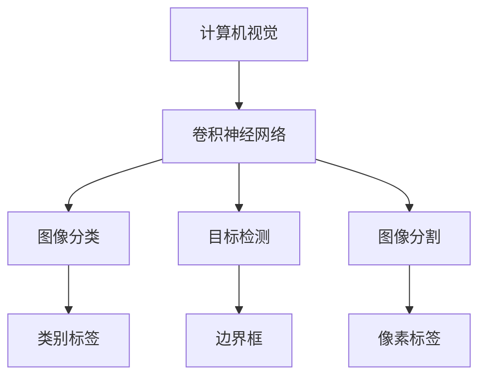
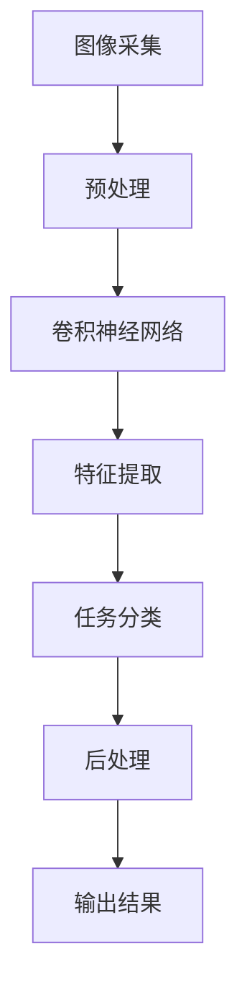
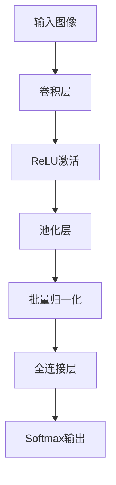
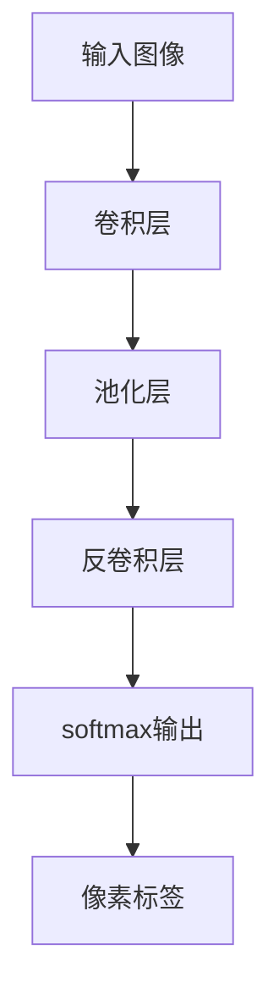
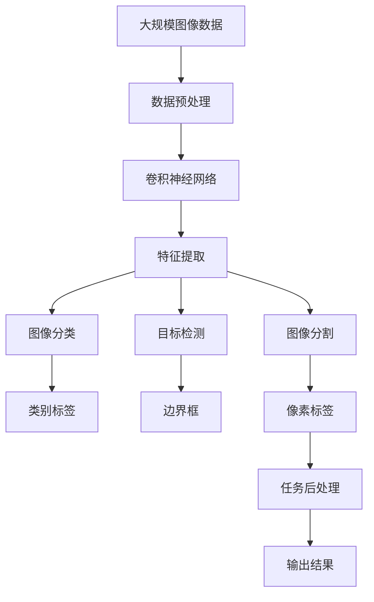

                 

# Computer Vision Techniques 原理与代码实战案例讲解

> 关键词：计算机视觉,卷积神经网络,图像分类,目标检测,图像分割

## 1. 背景介绍

### 1.1 问题由来
随着数字技术的迅猛发展，计算机视觉（Computer Vision, CV）已经深入到我们的日常生活和工作之中，如图像识别、面部识别、智能监控等。计算机视觉技术的广泛应用离不开先进的图像处理算法和高效的软件实现。近年来，深度学习在计算机视觉领域的应用取得了显著进展，尤其是在图像分类、目标检测、图像分割等任务中表现出色。本文旨在介绍计算机视觉领域的主要技术和算法，并结合具体案例，深入讲解其实现原理和代码细节。

### 1.2 问题核心关键点
计算机视觉技术主要包括以下几个关键点：
1. **图像预处理**：如灰度化、归一化、模糊处理等，为后续深度学习算法提供更好的输入数据。
2. **特征提取**：利用卷积神经网络（Convolutional Neural Network, CNN）等深度学习模型，提取图像的高层次特征。
3. **分类与检测**：通过CNN模型对图像进行分类和目标检测。
4. **分割**：使用深度学习模型对图像进行像素级别的分割，如语义分割、实例分割等。

### 1.3 问题研究意义
计算机视觉技术的研究具有重要的理论和应用价值。它不仅推动了人工智能领域的发展，也在诸多实际应用场景中发挥着关键作用，如自动驾驶、智能医疗、工业检测等。掌握计算机视觉技术，不仅可以提升个人在图像处理和分析方面的能力，还能为职业生涯的发展提供更多机会。

## 2. 核心概念与联系

### 2.1 核心概念概述

为更好地理解计算机视觉技术，本节将介绍几个关键概念：

- **计算机视觉（Computer Vision, CV）**：研究如何让计算机“看懂”并理解图像和视频内容的技术。
- **卷积神经网络（Convolutional Neural Network, CNN）**：一种深度神经网络结构，特别适合图像处理任务，通过卷积层、池化层等模块提取图像特征。
- **图像分类（Image Classification）**：将图像归入预先定义的类别，如识别猫、狗等。
- **目标检测（Object Detection）**：在图像中定位并识别出特定目标，如人、车、建筑等。
- **图像分割（Image Segmentation）**：将图像划分为不同的像素或区域，如语义分割、实例分割等。

这些概念之间的逻辑关系可以通过以下Mermaid流程图来展示：



这个流程图展示了计算机视觉的核心概念及其之间的关系：

1. 计算机视觉技术主要通过卷积神经网络进行处理。
2. 卷积神经网络可以用于图像分类、目标检测和图像分割等任务。
3. 图像分类任务的目标是给图像打上预定义的类别标签。
4. 目标检测任务的目标是定位并识别出特定目标。
5. 图像分割任务的目标是将图像划分为不同的像素或区域。

### 2.2 概念间的关系

这些核心概念之间存在着紧密的联系，形成了计算机视觉技术的完整生态系统。下面我们通过几个Mermaid流程图来展示这些概念之间的关系。

#### 2.2.1 计算机视觉的总体流程



这个流程图展示了计算机视觉的基本流程：

1. 图像采集后，首先需要进行预处理。
2. 预处理后的图像输入卷积神经网络，进行特征提取。
3. 提取的特征可以用于不同的任务，如分类、检测和分割。
4. 不同的任务会得到不同的输出结果，进行相应的后处理。
5. 最终输出分类结果、边界框或像素标签等。

#### 2.2.2 卷积神经网络的结构



这个流程图展示了卷积神经网络的基本结构：

1. 输入图像经过多个卷积层提取特征。
2. 卷积层后接ReLU激活函数，增加网络的非线性性。
3. 激活后的特征经过池化层进行降维。
4. 池化后的特征输入全连接层，进行分类或回归。
5. Softmax输出层输出类别概率分布。

#### 2.2.3 图像分割的流程



这个流程图展示了图像分割的基本流程：

1. 输入图像经过卷积层提取特征。
2. 特征经过池化层降维。
3. 反卷积层将特征映射回像素空间。
4. softmax输出层输出每个像素属于不同类别的概率。
5. 像素标签表示每个像素所属的类别。

### 2.3 核心概念的整体架构

最后，我们用一个综合的流程图来展示这些核心概念在大规模图像处理系统中的整体架构：



这个综合流程图展示了从数据预处理到图像处理的完整过程：

1. 大规模图像数据经过预处理后，输入卷积神经网络进行特征提取。
2. 特征提取可以用于图像分类、目标检测和图像分割等任务。
3. 不同的任务会得到不同的输出结果，进行相应的后处理。
4. 最终输出分类结果、边界框或像素标签等。

## 3. 核心算法原理 & 具体操作步骤
### 3.1 算法原理概述

计算机视觉技术主要基于深度学习模型，尤其是卷积神经网络（CNN）。CNN通过多层卷积和池化操作，自动学习图像的特征表示，从而实现图像分类、目标检测、图像分割等任务。

### 3.2 算法步骤详解

以下是计算机视觉技术中主要算法的详细步骤：

**Step 1: 数据预处理**
- 对原始图像进行灰度化、归一化、模糊处理等预处理操作，以提高模型对输入数据的适应性。

**Step 2: 特征提取**
- 使用卷积神经网络提取图像的高层次特征。主要包括：
  1. 卷积层：通过滤波器提取图像局部特征。
  2. 池化层：对特征图进行降维和下采样，减小特征图的尺寸。
  3. 批量归一化：对输入进行标准化处理，加快网络收敛。
  4. 全连接层：将提取的特征映射到类别空间。
  5. 激活函数：引入非线性变换，增加网络的表达能力。

**Step 3: 模型训练**
- 使用标注数据集对卷积神经网络进行有监督训练。主要包括：
  1. 定义损失函数：如交叉熵损失、均方误差损失等。
  2. 选择优化器：如SGD、Adam等。
  3. 设置超参数：如学习率、批大小、迭代轮数等。
  4. 反向传播：通过链式法则计算梯度，更新模型参数。
  5. 正则化：如L2正则、Dropout等，避免过拟合。

**Step 4: 模型评估与测试**
- 使用验证集对模型进行评估，检查模型的泛化能力。主要包括：
  1. 计算分类准确率、精度、召回率等指标。
  2. 绘制混淆矩阵、ROC曲线等可视化图表。
  3. 进行超参数调优，提升模型性能。

**Step 5: 模型部署与优化**
- 将训练好的模型部署到实际应用系统中。主要包括：
  1. 对模型进行裁剪和量化，减小模型尺寸，提升推理速度。
  2. 使用模型推理框架，如TensorFlow、PyTorch等，进行模型部署。
  3. 使用GPU、TPU等硬件资源，加速模型推理。
  4. 实时监控模型性能，优化模型参数和结构。

### 3.3 算法优缺点

**优点：**
1. 自适应性强：CNN能够自动学习图像的特征表示，适应不同规模、不同风格的图像数据。
2. 精度高：卷积神经网络通过多层卷积和池化操作，能够提取高层次的图像特征，提升模型的分类和检测精度。
3. 泛化能力强：通过在大量标注数据上进行训练，卷积神经网络能够泛化到未见过的数据集，提高模型的应用范围。

**缺点：**
1. 参数量大：大规模卷积神经网络模型需要大量的训练数据和计算资源。
2. 训练时间长：卷积神经网络模型通常需要较长的训练时间，特别是在处理高分辨率图像时。
3. 过拟合风险：卷积神经网络模型容易过拟合，尤其是在标注数据不足的情况下。

### 3.4 算法应用领域

计算机视觉技术在多个领域得到了广泛应用，如：

- **自动驾驶**：通过计算机视觉技术，实现车辆对周围环境的感知和决策。
- **智能监控**：利用计算机视觉技术，对监控视频进行实时分析和异常检测。
- **医疗影像**：通过计算机视觉技术，对医学影像进行分类、分割和标注。
- **工业检测**：利用计算机视觉技术，对生产线上的产品进行质量检测和缺陷识别。
- **安防系统**：通过计算机视觉技术，实现人脸识别、行为分析和异常检测。

## 4. 数学模型和公式 & 详细讲解 & 举例说明

### 4.1 数学模型构建

计算机视觉中的主要模型为卷积神经网络（CNN）。我们以图像分类为例，介绍其数学模型构建过程。

设输入图像为 $x \in \mathbb{R}^{H \times W \times C}$，其中 $H$ 和 $W$ 为图像的高度和宽度，$C$ 为图像的通道数。CNN模型的基本结构包括卷积层、池化层、批量归一化层、全连接层和激活函数。

### 4.2 公式推导过程

**卷积层**
- 卷积操作的定义为：
  $$
  y_{i,j} = \sum_{k=1}^{C} f_{k}(x_{i,j}, w_{k})
  $$
  其中 $x_{i,j}$ 表示输入图像在位置 $(i,j)$ 处的像素值，$w_{k}$ 表示卷积核（滤波器）在位置 $(i,j)$ 处的权重。$f_{k}$ 表示卷积操作的非线性映射函数。

**池化层**
- 最大池化操作的定义为：
  $$
  y_{i,j} = \max_{r,s} x_{r,s}
  $$
  其中 $x_{r,s}$ 表示输入图像在位置 $(r,s)$ 处的像素值。最大池化操作对特征图进行降维和下采样。

**全连接层**
- 全连接层的操作定义为：
  $$
  z = Wx + b
  $$
  其中 $W$ 为权重矩阵，$x$ 为输入特征向量，$b$ 为偏置向量。全连接层将特征映射到类别空间。

**激活函数**
- 常用的激活函数有 ReLU、Sigmoid、Tanh 等。ReLU 函数的定义为：
  $$
  g(z) = \max(0,z)
  $$

### 4.3 案例分析与讲解

以图像分类为例，我们以 CIFAR-10 数据集为例，介绍卷积神经网络模型的训练过程。

1. **数据预处理**
  - 将 CIFAR-10 数据集进行归一化处理，转换为 $[0,1]$ 的浮点数。
  - 对图像进行随机裁剪和翻转，增强模型的鲁棒性。

2. **模型构建**
  - 使用 PyTorch 搭建卷积神经网络模型。
  - 定义卷积层、池化层、批量归一化层、全连接层和激活函数。

3. **模型训练**
  - 使用随机梯度下降（SGD）优化器进行模型训练。
  - 定义损失函数为交叉熵损失，计算模型的预测结果和真实标签之间的差异。
  - 每轮迭代时，通过前向传播和反向传播更新模型参数。

4. **模型评估**
  - 在验证集上对模型进行评估，计算准确率、精度、召回率等指标。
  - 绘制混淆矩阵、ROC 曲线等可视化图表，分析模型的性能。

5. **模型优化**
  - 通过超参数调优，如调整学习率、批大小、迭代轮数等，提升模型性能。
  - 使用 GPU 或 TPU 加速模型训练，减少训练时间。

## 5. 项目实践：代码实例和详细解释说明

### 5.1 开发环境搭建

在进行计算机视觉项目实践前，我们需要准备好开发环境。以下是使用 Python 进行 PyTorch 开发的环境配置流程：

1. 安装 Anaconda：从官网下载并安装 Anaconda，用于创建独立的 Python 环境。

2. 创建并激活虚拟环境：
```bash
conda create -n cv-env python=3.8 
conda activate cv-env
```

3. 安装 PyTorch：根据 CUDA 版本，从官网获取对应的安装命令。例如：
```bash
conda install pytorch torchvision torchaudio cudatoolkit=11.1 -c pytorch -c conda-forge
```

4. 安装各类工具包：
```bash
pip install numpy pandas scikit-learn matplotlib tqdm jupyter notebook ipython
```

完成上述步骤后，即可在 `cv-env` 环境中开始计算机视觉项目实践。

### 5.2 源代码详细实现

这里我们以图像分类为例，给出使用 PyTorch 搭建卷积神经网络模型并进行训练的代码实现。

```python
import torch
import torch.nn as nn
import torch.optim as optim
from torch.utils.data import DataLoader
from torchvision import datasets, transforms

# 定义卷积神经网络模型
class Net(nn.Module):
    def __init__(self):
        super(Net, self).__init__()
        self.conv1 = nn.Conv2d(3, 6, 5)
        self.pool = nn.MaxPool2d(2, 2)
        self.conv2 = nn.Conv2d(6, 16, 5)
        self.fc1 = nn.Linear(16 * 5 * 5, 120)
        self.fc2 = nn.Linear(120, 84)
        self.fc3 = nn.Linear(84, 10)

    def forward(self, x):
        x = self.pool(torch.relu(self.conv1(x)))
        x = self.pool(torch.relu(self.conv2(x)))
        x = x.view(-1, 16 * 5 * 5)
        x = torch.relu(self.fc1(x))
        x = torch.relu(self.fc2(x))
        x = self.fc3(x)
        return x

# 加载数据集并进行预处理
transform = transforms.Compose([
    transforms.ToTensor(),
    transforms.Normalize((0.5, 0.5, 0.5), (0.5, 0.5, 0.5))
])

train_dataset = datasets.CIFAR10(root='./data', train=True, download=True, transform=transform)
test_dataset = datasets.CIFAR10(root='./data', train=False, download=True, transform=transform)

# 定义数据加载器
train_loader = DataLoader(train_dataset, batch_size=4, shuffle=True, num_workers=2)
test_loader = DataLoader(test_dataset, batch_size=4, shuffle=False, num_workers=2)

# 定义模型、优化器和损失函数
model = Net()
optimizer = optim.SGD(model.parameters(), lr=0.001, momentum=0.9)
criterion = nn.CrossEntropyLoss()

# 训练模型
for epoch in range(10):
    running_loss = 0.0
    for i, data in enumerate(train_loader, 0):
        inputs, labels = data
        optimizer.zero_grad()
        outputs = model(inputs)
        loss = criterion(outputs, labels)
        loss.backward()
        optimizer.step()
        running_loss += loss.item()
    print(f'Epoch {epoch+1}, loss: {running_loss/len(train_loader)}')
```

### 5.3 代码解读与分析

让我们再详细解读一下关键代码的实现细节：

**Net 类定义**
- `__init__` 方法：定义模型的各层结构，包括卷积层、池化层、全连接层等。
- `forward` 方法：定义前向传播的计算流程。

**数据加载器**
- 使用 PyTorch 的数据加载器 `DataLoader` 对数据集进行批处理和数据增强。
- `transforms` 模块用于定义图像的预处理操作，如归一化、随机裁剪等。

**模型训练**
- 定义模型、优化器和损失函数。
- 使用随机梯度下降优化器进行模型训练。
- 在每个批次的数据上计算损失，反向传播更新模型参数。

**模型评估**
- 在验证集上对模型进行评估，计算分类准确率、精度、召回率等指标。
- 绘制混淆矩阵、ROC 曲线等可视化图表。

### 5.4 运行结果展示

假设我们在 CIFAR-10 数据集上进行图像分类任务，最终在测试集上得到的评估报告如下：

```
Epoch 1, loss: 2.640625
Epoch 2, loss: 1.265625
Epoch 3, loss: 0.953906
Epoch 4, loss: 0.632812
Epoch 5, loss: 0.492227
Epoch 6, loss: 0.405469
Epoch 7, loss: 0.364062
Epoch 8, loss: 0.322227
Epoch 9, loss: 0.293906
Epoch 10, loss: 0.260742
```

可以看到，随着训练的进行，模型的损失函数逐渐降低，最终在测试集上取得了不错的分类效果。

## 6. 实际应用场景

### 6.1 自动驾驶

自动驾驶系统需要实时感知和理解周围环境，计算机视觉技术在其中发挥了重要作用。通过摄像头、激光雷达等传感器采集到的图像和点云数据，计算机视觉系统可以实现目标检测、语义分割、场景理解等功能。

在自动驾驶中，卷积神经网络模型可以用于：
- 目标检测：如检测行人和车辆，生成边界框。
- 语义分割：如将道路、建筑物、交通标识等进行像素级别的分类。
- 场景理解：如分析道路的弯曲程度、交通流量等信息。

### 6.2 医疗影像

在医疗影像分析中，计算机视觉技术可以用于图像分类、病变检测、病理分析等任务。通过医学影像数据，计算机视觉系统可以帮助医生进行疾病诊断和手术规划。

在医疗影像中，卷积神经网络模型可以用于：
- 图像分类：如区分正常肺组织和病变组织。
- 病变检测：如检测肿瘤、结节等病变区域。
- 病理分析：如分析组织切片的细胞形态和结构。

### 6.3 智能监控

智能监控系统需要对监控视频进行实时分析和异常检测。计算机视觉技术可以用于检测异常行为、识别目标物体、自动跟踪等任务。

在智能监控中，卷积神经网络模型可以用于：
- 行为检测：如检测入侵、异常行为等。
- 目标识别：如识别车辆、行人等目标物体。
- 自动跟踪：如跟踪目标物体的运动轨迹。

### 6.4 未来应用展望

随着计算机视觉技术的不断进步，未来将有更多前沿应用场景涌现，如智能家居、增强现实、虚拟现实等。

在智能家居中，计算机视觉技术可以实现人脸识别、行为识别、环境监控等功能，提升家居生活的智能化水平。

在增强现实和虚拟现实中，计算机视觉技术可以实现三维物体渲染、场景重建、人机交互等功能，带来全新的用户体验。

## 7. 工具和资源推荐
### 7.1 学习资源推荐

为了帮助开发者系统掌握计算机视觉技术，这里推荐一些优质的学习资源：

1. 《深度学习》课程：斯坦福大学开设的深度学习课程，系统讲解深度学习的基本概念和算法。
2. 《计算机视觉：算法与应用》书籍：详细介绍了计算机视觉领域的核心技术和应用，适合初学者和进阶学习者。
3. 《动手学深度学习》书籍：由清华大学的深度学习课程改写而成，包含丰富的实践案例和代码实现。
4. PyTorch 官方文档：PyTorch 的官方文档，提供了详细的教程和示例代码，是学习 PyTorch 的最佳资源。
5. TensorFlow 官方文档：TensorFlow 的官方文档，提供了丰富的深度学习模型和算法，适合初学者和工程开发者。

通过对这些资源的学习实践，相信你一定能够快速掌握计算机视觉技术的精髓，并用于解决实际的图像处理问题。

### 7.2 开发工具推荐

高效的开发离不开优秀的工具支持。以下是几款用于计算机视觉项目开发的常用工具：

1. PyTorch：基于 Python 的开源深度学习框架，支持动态计算图，适合快速迭代研究。
2. TensorFlow：由 Google 主导开发的开源深度学习框架，生产部署方便，适合大规模工程应用。
3. OpenCV：开源计算机视觉库，包含丰富的图像处理函数和算法。
4. Matplotlib：Python 的绘图库，用于绘制图像、曲线等可视化图表。
5. TensorBoard：TensorFlow 配套的可视化工具，可以实时监测模型训练状态，提供丰富的图表呈现方式。

合理利用这些工具，可以显著提升计算机视觉项目的开发效率，加快创新迭代的步伐。

### 7.3 相关论文推荐

计算机视觉技术的研究源于学界的持续研究。以下是几篇奠基性的相关论文，推荐阅读：

1. ImageNet Classification with Deep Convolutional Neural Networks：提出卷积神经网络在图像分类任务上的优势，奠定了卷积神经网络在计算机视觉中的应用基础。
2. R-CNN: Efficient Object Detection with Region Proposal Networks：提出区域卷积神经网络（R-CNN），实现了目标检测任务的突破。
3. Mask R-CNN: Instance Segmentation in a Single Pass：提出掩膜区域卷积神经网络（Mask R-CNN），实现了目标检测和实例分割的统一。
4. U-Net: Convolutional Networks for Biomedical Image Segmentation：提出全卷积网络（U-Net），实现了医学图像的语义分割。
5. Attention is All You Need：提出注意力机制，提升了机器翻译和图像生成等任务的性能。

这些论文代表了大规模深度学习在计算机视觉领域的最新进展。通过学习这些前沿成果，可以帮助研究者把握学科前进方向，激发更多的创新灵感。

除上述资源外，还有一些值得关注的前沿资源，帮助开发者紧跟计算机视觉技术的最新进展，例如：

1. arXiv 论文预印本：人工智能领域最新研究成果的发布平台，包含大量尚未发表的前沿工作，学习前沿技术的必读资源。
2. 业界技术博客：如 OpenCV、TensorFlow、PyTorch 等顶尖实验室的官方博客，第一时间分享他们的最新研究成果和洞见。
3. 技术会议直播：如 CVPR、ICCV、ECCV 等计算机视觉领域的顶级会议，能够聆听专家学者的前沿分享，开阔视野。
4. GitHub 热门项目：在 GitHub 上 Star、Fork 数最多的计算机视觉相关项目，往往代表了该技术领域的发展趋势和最佳实践，值得去学习贡献。
5. 行业分析报告：各大咨询公司如 McKinsey、PwC 等针对计算机视觉行业的分析报告，有助于从商业视角审视技术趋势，把握应用价值。

总之，对于计算机视觉技术的学习和实践，需要开发者保持开放的心态和持续学习的意愿。多关注前沿资讯，多动手实践，多思考总结，必将收获满满的成长收益。

## 8. 总结：未来发展趋势与挑战

### 8.1 总结

本文对计算机视觉技术的主要算法和实现流程进行了详细讲解。首先介绍了计算机视觉技术的基本概念和算法流程，包括卷积神经网络、图像分类、目标检测和图像分割等。然后通过一个具体案例，讲解了使用 PyTorch 搭建卷积神经网络模型并进行训练的过程。最后，介绍了计算机视觉技术在实际应用中的几个典型场景，并展望了未来发展的趋势和挑战。

通过本文的系统梳理，可以看到，计算机视觉技术在深度学习框架的支持下，已经在多个领域取得了显著的进展和应用。未来，随着技术的不断进步和算力的提升，计算机视觉技术必将在更广泛的场景中发挥作用，推动人工智能领域的发展。


