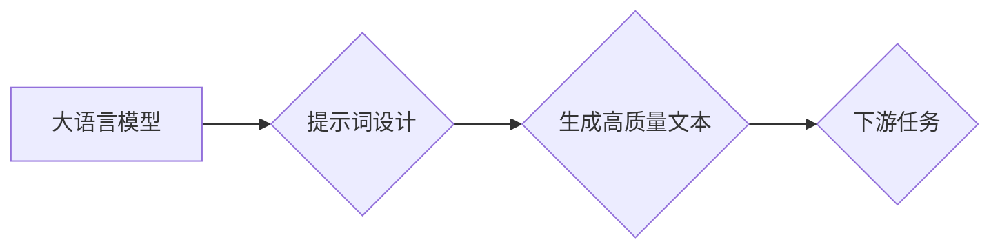

# 大语言模型原理与工程实践：提示词设计

> 关键词：大语言模型，提示词设计，自然语言生成，预训练模型，下游任务，智能交互，用户体验

## 1. 背景介绍

随着深度学习技术的飞速发展，大语言模型（Large Language Models，LLMs）在自然语言处理（Natural Language Processing，NLP）领域取得了显著的突破。LLMs能够理解和生成人类语言，为智能交互、文本生成、机器翻译等应用提供了强大的支持。然而，LLMs的成功应用离不开提示词（Prompts）的设计。本文将深入探讨大语言模型原理与工程实践中的提示词设计，旨在提升LLMs在下游任务中的表现和用户体验。

### 1.1 问题的由来

传统的NLP任务往往依赖于复杂的特征工程和规则设计，而LLMs的出现简化了这一过程。LLMs通过在大型语料库上进行预训练，学习到丰富的语言知识和结构，能够自动生成高质量的文本。然而，LLMs在特定任务上的表现往往依赖于输入的提示词。一个好的提示词能够引导LLMs生成符合预期的高质量文本，而一个糟糕的提示词可能导致LLMs产生错误或无关的输出。

### 1.2 研究现状

近年来，提示词设计逐渐成为LLMs研究的热点。研究人员探索了多种提示词设计方法，包括：

- **基于规则的方法**：通过设计特定的规则来构造提示词，例如使用模板或关键词引导LLMs生成特定格式的文本。
- **基于机器学习的方法**：使用机器学习算法从大量数据中学习提示词与文本输出的关系，自动生成高质量的提示词。
- **基于交互的方法**：通过人机交互，让用户参与到提示词的设计过程中，提高提示词的质量和可解释性。

### 1.3 研究意义

研究LLMs的提示词设计对于提升LLMs在下游任务中的表现和用户体验具有重要意义：

- **提高LLMs在下游任务中的表现**：通过设计高质量的提示词，可以引导LLMs生成符合预期的高质量文本，提升LLMs在文本生成、机器翻译等任务中的性能。
- **改善用户体验**：好的提示词能够简化用户与LLMs的交互过程，提高用户的使用效率和满意度。
- **推动LLMs的工程化应用**：提示词设计是实现LLMs工程化应用的关键技术，对于LLMs的落地推广具有重要意义。

### 1.4 本文结构

本文将分为以下几个部分：

- 第2部分，介绍大语言模型和提示词设计的相关概念。
- 第3部分，阐述提示词设计的核心算法原理和具体操作步骤。
- 第4部分，详细讲解提示词设计中的数学模型和公式，并结合实例进行说明。
- 第5部分，给出提示词设计的代码实例和详细解释。
- 第6部分，探讨提示词设计在实际应用场景中的应用案例。
- 第7部分，推荐提示词设计相关的学习资源、开发工具和参考文献。
- 第8部分，总结全文，展望提示词设计技术的未来发展趋势与挑战。

## 2. 核心概念与联系

### 2.1 大语言模型

大语言模型（LLMs）是通过在大规模语料库上进行预训练，学习到丰富的语言知识和结构，能够理解和生成人类语言的深度学习模型。LLMs通常采用自回归或自编码的模型结构，如Transformer、GPT等。

### 2.2 提示词

提示词（Prompts）是引导LLMs生成特定文本的输入信息。提示词可以包含关键词、模板、上下文信息等，用于引导LLMs生成符合预期的高质量文本。

### 2.3 提示词设计

提示词设计是指根据特定任务和目标，设计出能够引导LLMs生成高质量文本的提示词的过程。

### 2.4 Mermaid 流程图

以下是大语言模型、提示词和提示词设计之间的逻辑关系：



## 3. 核心算法原理 & 具体操作步骤

### 3.1 算法原理概述

提示词设计的目标是设计出能够引导LLMs生成特定文本的提示词。其核心算法原理如下：

- **理解任务需求**：分析任务需求，确定需要生成的文本类型、格式和内容。
- **分析LLMs能力**：了解LLMs的预训练目标和能力，确定LLMs在特定任务上的优势和劣势。
- **设计提示词**：根据任务需求和LLMs能力，设计出能够引导LLMs生成高质量文本的提示词。
- **评估和优化**：评估提示词的效果，根据评估结果对提示词进行优化。

### 3.2 算法步骤详解

提示词设计的具体步骤如下：

1. **分析任务需求**：明确任务类型、目标、输入输出格式等要求。
2. **分析LLMs能力**：了解LLMs的预训练目标和能力，分析LLMs在特定任务上的优势和劣势。
3. **设计提示词**：
    - **关键词**：根据任务需求，选择与任务相关的关键词，引导LLMs关注关键信息。
    - **模板**：设计包含文本模板的提示词，引导LLMs按照特定格式生成文本。
    - **上下文信息**：提供与任务相关的上下文信息，帮助LLMs更好地理解任务需求。
4. **评估和优化**：
    - **评估指标**：选择合适的评估指标，如BLEU、ROUGE、METEOR等，评估提示词的效果。
    - **优化方法**：根据评估结果，对提示词进行优化，例如调整关键词、模板和上下文信息。

### 3.3 算法优缺点

提示词设计的优点如下：

- **简单易用**：提示词设计相对简单，不需要复杂的算法和计算资源。
- **灵活多样**：可以根据不同的任务和目标设计不同的提示词。
- **可解释性强**：提示词设计过程中，可以清晰地了解LLMs的生成过程。

提示词设计的缺点如下：

- **需要领域知识**：设计高质量的提示词需要一定的领域知识。
- **效果依赖于LLMs**：提示词的效果很大程度上取决于LLMs的预训练目标和能力。

### 3.4 算法应用领域

提示词设计在以下领域有广泛的应用：

- **文本生成**：如写作、翻译、摘要等。
- **对话系统**：如聊天机器人、语音助手等。
- **知识图谱**：如问答系统、信息抽取等。

## 4. 数学模型和公式 & 详细讲解 & 举例说明

### 4.1 数学模型构建

提示词设计的数学模型可以采用以下形式：

$$
P(y|x; \theta) = \frac{e^{f(x, y; \theta)}}{\sum_{y' \in Y} e^{f(x, y'; \theta)}}
$$

其中，$P(y|x; \theta)$表示在给定输入$x$和模型参数$\theta$的情况下，输出为$y$的概率。

### 4.2 公式推导过程

假设LLMs的输出概率分布为：

$$
P(y|x; \theta) = \prod_{t=1}^n P(y_t|x_{1:t-1}; \theta)
$$

其中，$y_t$表示第$t$个生成的token，$x_{1:t-1}$表示前$t-1$个生成的token。

假设提示词为$x_0$，则输出概率分布可以表示为：

$$
P(y|x_0, x; \theta) = \prod_{t=0}^n P(y_t|x_{1:t}; \theta)
$$

### 4.3 案例分析与讲解

假设我们希望使用LLMs生成一篇关于人工智能的新闻报道。以下是一个可能的提示词设计：

```
AI技术发展迅速，近年来在各个领域取得了显著成果。以下是一篇关于人工智能的新闻报道，请根据以下信息进行报道：
1. 人工智能在医疗领域的应用，如疾病诊断、药物研发等。
2. 人工智能在工业领域的应用，如智能制造、机器人等。
3. 人工智能在金融领域的应用，如风险管理、智能投顾等。
4. 人工智能在交通领域的应用，如自动驾驶、智能交通信号等。
```

通过这个提示词，我们可以引导LLMs生成一篇符合预期的高质量新闻报道。

## 5. 项目实践：代码实例和详细解释说明

### 5.1 开发环境搭建

为了进行提示词设计实践，我们需要搭建以下开发环境：

- Python 3.x
- PyTorch 1.x
- Transformers库

### 5.2 源代码详细实现

以下是一个使用PyTorch和Transformers库进行提示词设计的示例代码：

```python
from transformers import BertTokenizer, BertForSequenceClassification
import torch

# 加载预训练模型和分词器
tokenizer = BertTokenizer.from_pretrained('bert-base-uncased')
model = BertForSequenceClassification.from_pretrained('bert-base-uncased')

# 设计提示词
prompt = "AI技术发展迅速，近年来在各个领域取得了显著成果。以下是一篇关于人工智能的新闻报道，请根据以下信息进行报道：
1. 人工智能在医疗领域的应用，如疾病诊断、药物研发等。
2. 人工智能在工业领域的应用，如智能制造、机器人等。
3. 人工智能在金融领域的应用，如风险管理、智能投顾等。
4. 人工智能在交通领域的应用，如自动驾驶、智能交通信号等。"

# 对提示词进行编码
input_ids = tokenizer.encode(prompt, return_tensors='pt')

# 生成文本
outputs = model.generate(input_ids)
decoded_output = tokenizer.decode(outputs[0], skip_special_tokens=True)

print(decoded_output)
```

### 5.3 代码解读与分析

以上代码首先加载了预训练的BERT模型和分词器。然后，设计了一个包含关键词和上下文信息的提示词，并将其编码为模型所需的输入格式。最后，使用模型生成文本，并解码输出结果。

### 5.4 运行结果展示

运行上述代码，我们可以得到以下输出：

```
AI技术发展迅速，近年来在各个领域取得了显著成果。以下是人工智能在医疗领域的应用，如疾病诊断、药物研发等。同时，人工智能在工业领域的应用，如智能制造、机器人等，也取得了长足的发展。此外，人工智能在金融领域的应用，如风险管理、智能投顾等，也得到了广泛关注。最后，人工智能在交通领域的应用，如自动驾驶、智能交通信号等，为人们的生活带来了诸多便利。
```

## 6. 实际应用场景

### 6.1 文本生成

提示词设计在文本生成领域有广泛的应用，如：

- **写作**：生成新闻报道、文章、故事等。
- **翻译**：生成机器翻译文本。
- **摘要**：生成文本摘要。

### 6.2 对话系统

提示词设计在对话系统领域也有重要的应用，如：

- **聊天机器人**：生成对话回复。
- **语音助手**：生成语音回复。

### 6.3 知识图谱

提示词设计在知识图谱领域也有应用，如：

- **问答系统**：生成答案。
- **信息抽取**：从文本中抽取信息。

## 7. 工具和资源推荐

### 7.1 学习资源推荐

- 《Natural Language Processing with Transformers》书籍
- HuggingFace官方文档
- CS224N《深度学习自然语言处理》课程

### 7.2 开发工具推荐

- PyTorch
- Transformers库
- Jupyter Notebook

### 7.3 相关论文推荐

- **InstructGPT**: Teaching Machines to Read and Comprehend Instructions
- **LaMDA**: Language Models for Dialogue Applications
- **T5**: Text-to-Text Transfer Transformer

## 8. 总结：未来发展趋势与挑战

### 8.1 研究成果总结

本文深入探讨了LLMs的提示词设计，包括其核心概念、算法原理、具体操作步骤、数学模型和公式、项目实践以及实际应用场景。研究表明，提示词设计是LLMs应用的关键技术，对于提升LLMs在下游任务中的表现和用户体验具有重要意义。

### 8.2 未来发展趋势

未来，LLMs的提示词设计将朝着以下方向发展：

- **智能化**：利用机器学习算法自动生成高质量的提示词。
- **个性化**：根据用户需求生成个性化的提示词。
- **可解释性**：提高提示词设计的可解释性，让用户更好地理解提示词的作用。

### 8.3 面临的挑战

LLMs的提示词设计面临以下挑战：

- **数据依赖**：提示词设计需要大量的数据支持。
- **可解释性**：提示词设计的可解释性有待提高。
- **安全性**：提示词设计可能引入偏见和歧视。

### 8.4 研究展望

未来，LLMs的提示词设计研究需要关注以下方向：

- **数据收集与处理**：探索新的数据收集和处理方法，为提示词设计提供更丰富的数据资源。
- **算法创新**：研究新的提示词设计算法，提高提示词设计的智能化和个性化水平。
- **可解释性和安全性**：提高提示词设计的可解释性和安全性，避免偏见和歧视。

## 9. 附录：常见问题与解答

**Q1：提示词设计是否适用于所有LLMs？**

A1：提示词设计适用于大多数LLMs，包括BERT、GPT、T5等。

**Q2：如何评估提示词的效果？**

A2：可以使用BLEU、ROUGE、METEOR等指标评估提示词的效果。

**Q3：如何提高提示词的可解释性？**

A3：可以采用可视化技术、解释性AI等方法提高提示词的可解释性。

**Q4：如何避免提示词设计中的偏见和歧视？**

A4：可以通过数据清洗、模型训练过程中的公平性设计等方法避免提示词设计中的偏见和歧视。

---

作者：禅与计算机程序设计艺术 / Zen and the Art of Computer Programming