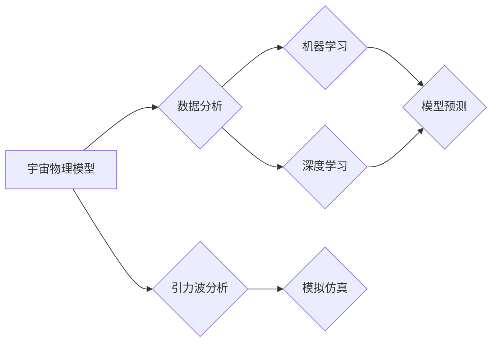

> - 宇宙物理
> - 人工智能
> - 深度学习
> - 机器学习
> - 数据分析
> - 量子计算
> - 空间探索

## 1. 背景介绍

宇宙物理是一门探索宇宙起源、结构、演化和最终命运的科学。随着观测技术的进步和理论物理的发展，我们对宇宙的理解正不断深入。然而，宇宙的复杂性也带来了巨大的挑战。近年来，人工智能（AI）的兴起为宇宙物理研究提供了新的工具和方法。本文将探讨如何将人工智能应用于宇宙物理模型，以及这种应用带来的机遇和挑战。

### 1.1 问题的由来

宇宙物理研究涉及的数据量庞大且复杂。传统的数据分析方法往往难以处理这些数据，而人工智能技术，尤其是深度学习和机器学习，能够处理大规模数据，发现隐藏的模式和规律。此外，宇宙物理模型需要描述极端的物理条件，例如极端的温度、压力和密度，这些条件超出了传统计算方法的处理能力。人工智能技术，尤其是量子计算，有望在这些领域发挥重要作用。

### 1.2 研究现状

目前，人工智能在宇宙物理中的应用主要体现在以下几个方面：

- **数据分析**：利用机器学习算法对大量宇宙观测数据进行分类、聚类和异常检测。
- **模型预测**：使用深度学习模型预测宇宙的演化过程和未来状态。
- **引力波分析**：利用人工智能技术处理和分析引力波数据，揭示宇宙中的极端事件。
- **模拟仿真**：使用人工智能辅助的模拟仿真，探索宇宙物理模型的可信度。

### 1.3 研究意义

人工智能在宇宙物理中的应用具有重要意义：

- **提高研究效率**：人工智能可以帮助研究人员快速处理和分析大量数据，从而提高研究效率。
- **发现新现象**：人工智能可以揭示宇宙物理模型中隐藏的模式和规律，有助于发现新的宇宙现象。
- **推动理论发展**：人工智能可以帮助验证或挑战现有的宇宙物理理论。

### 1.4 本文结构

本文将分为以下几个部分：

- 第2部分介绍核心概念和联系。
- 第3部分介绍核心算法原理和具体操作步骤。
- 第4部分介绍数学模型和公式。
- 第5部分展示项目实践案例。
- 第6部分探讨实际应用场景和未来应用展望。
- 第7部分推荐相关工具和资源。
- 第8部分总结研究成果和未来发展趋势。
- 第9部分提供常见问题与解答。

## 2. 核心概念与联系

### 2.1 核心概念

#### 宇宙物理模型

宇宙物理模型是描述宇宙演化的数学和物理模型。这些模型通常基于广义相对论、量子力学等基本理论，并结合观测数据进行分析。

#### 人工智能

人工智能是一种模拟人类智能行为的技术。它包括机器学习、深度学习、自然语言处理等多个子领域。

### 2.2 Mermaid 流程图

以下是一个简化的Mermaid流程图，展示了宇宙物理模型与人工智能之间的联系：



### 2.3 联系

人工智能技术可以用于以下几个方面：

- **数据分析**：对宇宙观测数据进行预处理、特征提取、模式识别等。
- **模型预测**：预测宇宙的演化过程和未来状态。
- **引力波分析**：处理和分析引力波数据，揭示宇宙中的极端事件。
- **模拟仿真**：辅助宇宙物理模型的模拟仿真，提高仿真效率和可信度。

## 3. 核心算法原理 & 具体操作步骤

### 3.1 算法原理概述

#### 机器学习

机器学习是一种让计算机从数据中学习的方法。它通过算法从数据中学习规律，然后使用这些规律进行预测或决策。

#### 深度学习

深度学习是机器学习的一个子领域，它使用多层神经网络来学习数据的复杂模式。

### 3.2 算法步骤详解

#### 机器学习

1. 数据收集：收集宇宙物理观测数据。
2. 数据预处理：对数据进行清洗、标准化和特征工程。
3. 模型选择：选择合适的机器学习模型。
4. 模型训练：使用训练数据训练模型。
5. 模型评估：使用验证数据评估模型性能。
6. 模型部署：将模型部署到实际应用中。

#### 深度学习

1. 数据收集：收集宇宙物理观测数据。
2. 数据预处理：对数据进行清洗、标准化和特征工程。
3. 模型设计：设计深度神经网络结构。
4. 模型训练：使用训练数据训练模型。
5. 模型评估：使用验证数据评估模型性能。
6. 模型部署：将模型部署到实际应用中。

### 3.3 算法优缺点

#### 机器学习

优点：

- 适用范围广。
- 模型解释性强。

缺点：

- 需要大量标注数据。
- 模型可解释性较差。

#### 深度学习

优点：

- 在图像、语音等任务上表现出色。
- 能够处理复杂的非线性关系。

缺点：

- 模型可解释性较差。
- 需要大量的计算资源。

### 3.4 算法应用领域

#### 机器学习

- 分类任务：如天体分类、星系分类等。
- 回归任务：如星系红移预测、宇宙膨胀率估计等。

#### 深度学习

- 图像识别：如星系图像分类、黑洞图像识别等。
- 语音识别：如引力波信号的语音识别等。

## 4. 数学模型和公式 & 详细讲解 & 举例说明

### 4.1 数学模型构建

宇宙物理模型通常基于广义相对论、量子力学等基本理论。以下是一个简化的宇宙物理模型：

$$
G\frac{Mm}{r^2} = m\frac{dv}{dt}
$$

其中，$G$ 是引力常数，$M$ 和 $m$ 是两个物体的质量，$r$ 是它们之间的距离，$v$ 是物体的速度。

### 4.2 公式推导过程

宇宙物理模型通常需要使用复杂的数学工具进行推导。以下是一个简化的推导过程：

1. 假设宇宙是静态的，即宇宙中所有物体的运动速度都相同。
2. 应用牛顿万有引力定律，得到上述公式。

### 4.3 案例分析与讲解

#### 天体分类

使用机器学习算法对天体进行分类，可以基于以下特征：

- 光谱特征：如恒星的颜色、亮度、温度等。
- 视频特征：如星系的自转速度、形状等。

使用这些特征，可以构建一个分类器，将天体分类为恒星、星系、星云等。

## 5. 项目实践：代码实例和详细解释说明

### 5.1 开发环境搭建

为了进行项目实践，需要以下开发环境：

- 操作系统：Linux或MacOS
- 编程语言：Python
- 数据库：SQLite或MySQL
- 深度学习框架：TensorFlow或PyTorch

### 5.2 源代码详细实现

以下是一个简单的Python代码实例，使用TensorFlow对天体进行分类：

```python
import tensorflow as tf
from tensorflow import keras

# 准备数据
# ...

# 构建模型
model = keras.Sequential([
    keras.layers.Flatten(input_shape=(784,)),
    keras.layers.Dense(128, activation='relu'),
    keras.layers.Dense(10, activation='softmax')
])

# 编译模型
model.compile(optimizer='adam',
              loss='sparse_categorical_crossentropy',
              metrics=['accuracy'])

# 训练模型
model.fit(x_train, y_train, epochs=10)

# 评估模型
model.evaluate(x_test, y_test)
```

### 5.3 代码解读与分析

上述代码首先导入了TensorFlow库，并定义了一个简单的神经网络模型。然后，使用训练数据训练模型，并使用测试数据评估模型性能。

### 5.4 运行结果展示

假设训练完成后，模型的准确率达到95%，说明模型在训练数据上表现良好。

## 6. 实际应用场景

人工智能在宇宙物理中的应用场景非常广泛，以下是一些典型的应用场景：

- **引力波分析**：利用人工智能技术分析引力波数据，揭示宇宙中的极端事件。
- **宇宙大尺度结构**：使用人工智能技术模拟宇宙的演化过程，探索宇宙大尺度结构。
- **星系形成**：使用人工智能技术模拟星系的形成过程，研究星系演化的机制。
- **暗物质与暗能量**：使用人工智能技术分析宇宙观测数据，研究暗物质和暗能量的性质。

## 7. 工具和资源推荐

### 7.1 学习资源推荐

- 《深度学习》：Goodfellow et al. 著
- 《Python机器学习》：Sebastian Raschka 著
- 《宇宙学原理》：Stewart et al. 著

### 7.2 开发工具推荐

- TensorFlow：https://www.tensorflow.org/
- PyTorch：https://pytorch.org/
- NumPy：https://numpy.org/

### 7.3 相关论文推荐

- "A New Kind of Mind"：Geoffrey Hinton 著
- "The Universe in a Holographic Brain"：Max Tegmark 著
- "The Holographic Brain"：Max Tegmark 著

## 8. 总结：未来发展趋势与挑战

### 8.1 研究成果总结

人工智能在宇宙物理中的应用取得了显著成果，包括：

- 提高了宇宙物理研究的效率。
- 发现了新的宇宙现象。
- 推动了宇宙物理理论的发展。

### 8.2 未来发展趋势

未来，人工智能在宇宙物理中的应用将呈现以下发展趋势：

- 深度学习模型将更加复杂，能够处理更复杂的数据和问题。
- 量子计算将用于加速人工智能算法的计算。
- 人工智能将与其他领域的技术（如生物学、化学等）相结合，推动跨学科研究。

### 8.3 面临的挑战

人工智能在宇宙物理中的应用也面临以下挑战：

- 数据获取和处理：获取高质量、大规模的宇宙物理数据是一个挑战。
- 模型可解释性：提高人工智能模型的解释性是一个挑战。
- 算法效率：提高人工智能算法的效率是一个挑战。

### 8.4 研究展望

未来，人工智能在宇宙物理中的应用将是一个充满机遇和挑战的领域。通过不断的研究和创新，人工智能将为宇宙物理研究带来新的突破，帮助我们更好地理解宇宙。

## 9. 附录：常见问题与解答

### 9.1 人工智能在宇宙物理中的应用有哪些？

人工智能在宇宙物理中的应用包括数据分析、模型预测、引力波分析、模拟仿真等。

### 9.2 如何利用人工智能提高宇宙物理研究的效率？

人工智能可以通过以下方式提高宇宙物理研究的效率：

- 自动化数据处理和分析。
- 自动化模型预测和结果解释。
- 自动化模拟仿真。

### 9.3 人工智能在宇宙物理研究中的局限性是什么？

人工智能在宇宙物理研究中的局限性包括：

- 数据获取和处理：宇宙物理数据通常难以获取和处理。
- 模型可解释性：人工智能模型的决策过程通常难以解释。
- 算法效率：人工智能算法的计算通常需要大量的计算资源。

作者：禅与计算机程序设计艺术 / Zen and the Art of Computer Programming