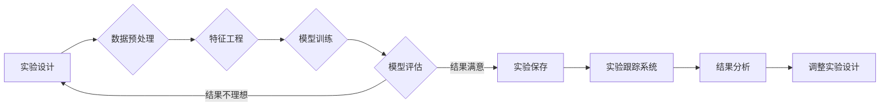

# 实验跟踪与实验管理原理与代码实战案例讲解

> 关键词：实验跟踪，实验管理，数据科学，机器学习，MLOps，代码实战，Docker，Kubernetes

## 1. 背景介绍

在数据科学和机器学习领域，实验和模型迭代是一个持续不断的过程。随着模型复杂性的增加和实验规模的扩大，实验跟踪与实验管理变得越来越重要。这不仅可以帮助研究人员有效地管理实验，还能提高实验效率，确保实验的可重复性和可追溯性。本文将深入探讨实验跟踪与实验管理的原理，并通过实战案例展示如何在实际项目中应用这些原理。

### 1.1 问题的由来

随着机器学习项目的复杂性增加，研究人员经常面临以下问题：

- 如何有效地组织和管理大量的实验？
- 如何快速定位问题的根源？
- 如何确保实验的可重复性和可追溯性？
- 如何在实验之间进行比较和选择最佳模型？

为了解决这些问题，实验跟踪与实验管理应运而生。

### 1.2 研究现状

实验跟踪与实验管理是机器学习工程（MLOps）的重要组成部分。目前，有许多工具和技术可以帮助研究人员管理实验，例如 MLflow、DVC（Data Version Control）、Weights & Biases 等。这些工具提供了实验版本控制、参数管理、结果记录等功能，极大地提高了实验管理的效率。

### 1.3 研究意义

实验跟踪与实验管理对于数据科学和机器学习项目具有重要意义：

- 提高实验效率，减少重复工作。
- 确保实验可重复性和可追溯性。
- 帮助研究人员快速定位问题。
- 支持实验比较和模型选择。
- 促进团队协作和数据共享。

### 1.4 本文结构

本文将按照以下结构进行：

- 第2部分，介绍实验跟踪与实验管理的核心概念和流程。
- 第3部分，探讨实验跟踪与实验管理的算法原理和具体操作步骤。
- 第4部分，通过数学模型和公式详细讲解实验管理的核心概念。
- 第5部分，提供实验跟踪与实验管理的代码实战案例。
- 第6部分，分析实验跟踪与实验管理在实际应用场景中的应用。
- 第7部分，展望实验跟踪与实验管理的未来发展趋势和挑战。
- 第8部分，总结研究成果和未来研究方向。

## 2. 核心概念与联系

### 2.1 Mermaid 流程图

以下是一个实验跟踪与实验管理的Mermaid流程图：



### 2.2 核心概念

- **实验设计**：定义实验的目标、参数、数据集等。
- **数据预处理**：对数据集进行清洗、转换等操作。
- **特征工程**：提取和创建有助于模型学习的特征。
- **模型训练**：使用训练数据训练模型。
- **模型评估**：使用验证数据评估模型性能。
- **实验保存**：将实验结果保存到实验跟踪系统中。
- **实验跟踪系统**：记录和管理实验数据。
- **结果分析**：分析实验结果，确定模型性能和潜在问题。
- **调整实验设计**：根据结果分析调整实验设计。

## 3. 核心算法原理 & 具体操作步骤

### 3.1 算法原理概述

实验跟踪与实验管理的核心原理是记录实验过程中的所有信息，包括实验设计、数据、模型、参数、结果等，以便于后续分析和比较。

### 3.2 算法步骤详解

1. **实验设计**：定义实验的目标、参数、数据集等。
2. **数据预处理**：对数据集进行清洗、转换等操作。
3. **特征工程**：提取和创建有助于模型学习的特征。
4. **模型训练**：使用训练数据训练模型。
5. **模型评估**：使用验证数据评估模型性能。
6. **实验保存**：将实验结果保存到实验跟踪系统中。
7. **结果分析**：分析实验结果，确定模型性能和潜在问题。
8. **调整实验设计**：根据结果分析调整实验设计。

### 3.3 算法优缺点

**优点**：

- 提高实验效率。
- 确保实验可重复性和可追溯性。
- 帮助研究人员快速定位问题。
- 支持实验比较和模型选择。

**缺点**：

- 实验跟踪系统的维护成本较高。
- 实验数据的存储和检索可能存在困难。
- 需要投入时间和精力进行结果分析。

### 3.4 算法应用领域

实验跟踪与实验管理适用于以下领域：

- 机器学习
- 数据科学
- 人工智能
- 量化金融
- 生物信息学

## 4. 数学模型和公式 & 详细讲解 & 举例说明

### 4.1 数学模型构建

实验跟踪与实验管理的数学模型可以看作是一个数据存储和检索系统。以下是一个简化的模型：

$$
M = (D, S, R)
$$

其中：

- $D$ 是数据集。
- $S$ 是实验状态，包括参数、超参数、代码版本等。
- $R$ 是实验结果，包括损失、准确率等。

### 4.2 公式推导过程

由于实验跟踪与实验管理涉及多个变量和操作，其公式推导过程较为复杂。以下是一个简单的例子：

假设有一个分类问题，损失函数为交叉熵损失：

$$
L(\theta) = -\frac{1}{N}\sum_{i=1}^N [y_i\log \hat{y}_i + (1-y_i)\log (1-\hat{y}_i)]
$$

其中：

- $N$ 是样本数量。
- $y_i$ 是真实标签。
- $\hat{y}_i$ 是模型预测的标签概率。

### 4.3 案例分析与讲解

假设我们有一个分类任务，数据集包含100个样本，每个样本有10个特征。我们使用神经网络进行分类，并使用交叉熵损失函数进行训练。

我们可以使用以下公式计算模型在训练集上的平均损失：

$$
L_{train} = -\frac{1}{N}\sum_{i=1}^N [y_i\log \hat{y}_i + (1-y_i)\log (1-\hat{y}_i)]
$$

其中：

- $N$ 是样本数量，即100。
- $y_i$ 是真实标签，即样本的类别。
- $\hat{y}_i$ 是模型预测的标签概率，即输出层神经元的输出。

通过计算平均损失，我们可以评估模型的训练效果。如果平均损失较高，说明模型的性能较差，需要调整模型结构或超参数。

## 5. 项目实践：代码实例和详细解释说明

### 5.1 开发环境搭建

为了进行实验跟踪与实验管理，我们需要搭建以下开发环境：

- 操作系统：Linux（推荐Ubuntu）
- 编程语言：Python
- 依赖库：MLflow、DVC、Scikit-learn、Pandas、NumPy等

### 5.2 源代码详细实现

以下是一个简单的实验跟踪与实验管理的代码示例：

```python
import mlflow
import dvc.api
from sklearn.datasets import load_iris
from sklearn.ensemble import RandomForestClassifier

# 创建MLflow项目
mlflow.set_experiment("iris_classification")

# 加载数据集
data = load_iris()
X, y = data.data, data.target

# 训练模型
model = RandomForestClassifier()
model.fit(X, y)

# 记录实验结果
mlflow.log_param("model_type", "RandomForestClassifier")
mlflow.log_param("n_estimators", model.n_estimators)
mlflow.log_param("max_depth", model.max_depth)

# 创建DVC版本控制
dvc.commit("Model trained with RandomForestClassifier")

# 记录模型
mlflow.sklearn.log_model(model, "model")

# 记录模型版本
mlflow.pyfunc.log_model(
    func=lambda X: model.predict(X),
    artifact_path="model",
    python_version="3.8",
    conda_env="python=3.8"
)

# 启动MLflow服务
mlflow.start_server()
```

### 5.3 代码解读与分析

- 首先，我们创建了一个MLflow项目，用于记录和管理实验。
- 然后，我们加载数据集，并使用随机森林分类器进行训练。
- 接着，我们使用MLflow记录模型的参数和训练结果。
- 使用DVC创建版本控制，记录模型训练过程。
- 最后，我们使用MLflow记录模型，并启动MLflow服务。

### 5.4 运行结果展示

运行上述代码后，我们可以在MLflow UI中查看实验记录，包括模型的参数、结果和版本信息。此外，我们还可以使用DVC查看模型的版本历史。

## 6. 实际应用场景

实验跟踪与实验管理在以下场景中有着广泛的应用：

- 机器学习项目开发
- 数据科学竞赛
- 模型评估和优化
- 研究论文撰写

### 6.4 未来应用展望

随着数据科学和机器学习技术的不断发展，实验跟踪与实验管理将在以下方面得到进一步发展：

- 更多的实验跟踪工具将支持更复杂的实验管理需求。
- 实验跟踪与实验管理将与人工智能技术相结合，实现自动化的实验设计、执行和结果分析。
- 实验跟踪与实验管理将成为数据科学和机器学习项目开发的标准流程。

## 7. 工具和资源推荐

### 7.1 学习资源推荐

- 《Machine Learning Engineering》
- 《Building Machine Learning Pipelines》
- 《MLOps: Building, Training, and Deploying Machine Learning Models at Scale》

### 7.2 开发工具推荐

- MLflow
- DVC
- Weights & Biases
- TensorBoard

### 7.3 相关论文推荐

- "Machine Learning Pipelines" by Ben Hamner et al.
- "MLOps: The Journey to Production Machine Learning" by Andrew E. Filler et al.
- "MLflow: An Open Source Platform for Machine Learning" by Ethan Andrew et al.

## 8. 总结：未来发展趋势与挑战

### 8.1 研究成果总结

本文深入探讨了实验跟踪与实验管理的原理和应用，并通过实战案例展示了如何在实际项目中应用这些原理。实验跟踪与实验管理是数据科学和机器学习项目的重要组成部分，可以提高实验效率，确保实验的可重复性和可追溯性。

### 8.2 未来发展趋势

实验跟踪与实验管理将朝着以下方向发展：

- 更多的实验跟踪工具将支持更复杂的实验管理需求。
- 实验跟踪与实验管理将与人工智能技术相结合，实现自动化的实验设计、执行和结果分析。
- 实验跟踪与实验管理将成为数据科学和机器学习项目开发的标准流程。

### 8.3 面临的挑战

实验跟踪与实验管理面临着以下挑战：

- 实验跟踪系统的维护成本较高。
- 实验数据的存储和检索可能存在困难。
- 需要投入时间和精力进行结果分析。

### 8.4 研究展望

为了解决实验跟踪与实验管理面临的挑战，未来的研究需要在以下方面进行：

- 开发更高效的实验跟踪工具。
- 研究更有效的实验数据存储和检索方法。
- 开发自动化的实验设计、执行和结果分析技术。

## 9. 附录：常见问题与解答

**Q1：实验跟踪与实验管理的主要目的是什么？**

A：实验跟踪与实验管理的主要目的是提高实验效率，确保实验的可重复性和可追溯性，帮助研究人员快速定位问题，并支持实验比较和模型选择。

**Q2：哪些工具可以用于实验跟踪与实验管理？**

A：常见的实验跟踪与实验管理工具有MLflow、DVC、Weights & Biases、TensorBoard等。

**Q3：实验跟踪与实验管理是否适用于所有机器学习项目？**

A：实验跟踪与实验管理适用于大多数机器学习项目，尤其是在项目规模较大、模型复杂度较高的情况下。

**Q4：如何选择合适的实验跟踪与实验管理工具？**

A：选择合适的实验跟踪与实验管理工具需要考虑以下因素：

- 项目需求
- 工具的易用性
- 工具的扩展性
- 工具的社区支持

**Q5：实验跟踪与实验管理是否会增加项目的复杂性？**

A：实验跟踪与实验管理会带来一定的复杂性，但通过合理的设计和实施，可以提高实验效率，确保实验的可重复性和可追溯性，从而降低项目的整体复杂性。

作者：禅与计算机程序设计艺术 / Zen and the Art of Computer Programming