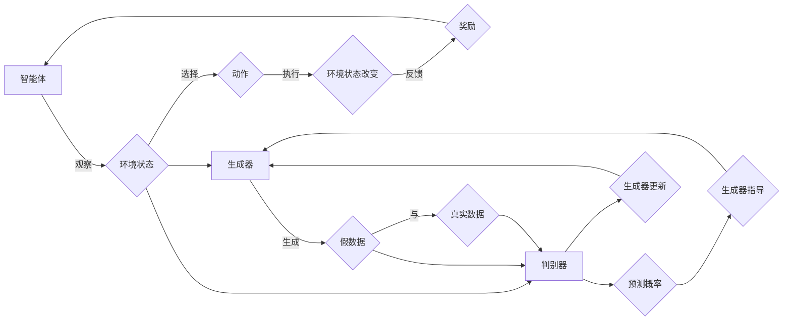

# 强化学习：在人工智能艺术创作中的应用

> 关键词：强化学习，艺术创作，生成对抗网络，创意生成，多智能体系统，人类情感模拟，艺术风格迁移

## 1. 背景介绍

艺术创作一直是人类文明的瑰宝，它不仅仅是美的体现，更是人类情感、思想和文化的载体。随着人工智能技术的飞速发展，艺术家们开始探索如何将人工智能引入艺术创作领域，以创造前所未有的艺术作品。强化学习作为一种先进的人工智能技术，因其能够使智能体通过试错学习来达到目标，而成为艺术创作领域的一种新兴工具。本文将探讨强化学习在人工智能艺术创作中的应用，分析其原理、方法、实践案例以及未来发展趋势。

## 2. 核心概念与联系

### 2.1 核心概念

#### 强化学习（Reinforcement Learning）

强化学习是一种机器学习方法，智能体通过与环境的交互来学习如何在给定情境下做出最优决策。智能体通过观察环境状态，选择动作，并接收奖励或惩罚，以此来学习如何最大化长期累积奖励。

#### 艺术创作（Artistic Creation）

艺术创作是指艺术家通过个人情感、思想、技巧和审美观念，运用各种艺术形式（如绘画、音乐、文学等）创造出具有审美价值、文化价值和情感价值的作品的过程。

#### 生成对抗网络（Generative Adversarial Networks，GANs）

生成对抗网络由生成器（Generator）和判别器（Discriminator）组成，生成器尝试生成与真实数据分布相似的假数据，而判别器则尝试区分真实数据和假数据。两者相互竞争，最终生成器生成越来越逼真的假数据。

### 2.2 核心概念原理和架构的 Mermaid 流程图



## 3. 核心算法原理 & 具体操作步骤

### 3.1 算法原理概述

强化学习在艺术创作中的应用，主要是通过训练智能体学习如何在给定的艺术创作环境中进行创作决策。智能体可以是一个生成器，它尝试生成新的艺术作品；也可以是一个多智能体系统，其中多个智能体协同创作。

### 3.2 算法步骤详解

1. **定义艺术创作环境**：构建一个模拟艺术创作过程的虚拟环境，其中包含创作工具、创作材料、创作规则等。

2. **设计奖励函数**：根据艺术创作的目标和评价标准，设计一个能够衡量作品优劣的奖励函数。

3. **选择强化学习算法**：根据具体问题和环境特点，选择合适的强化学习算法，如Q学习、SARSA、深度Q网络（DQN）、深度确定性策略梯度（DDPG）等。

4. **训练智能体**：使用强化学习算法训练智能体，使其在艺术创作环境中不断试错，学习如何生成高质量的艺术作品。

5. **评估和优化**：评估智能体的创作能力，根据评估结果对环境和奖励函数进行优化。

### 3.3 算法优缺点

#### 优点

- **创新性**：强化学习可以探索全新的艺术创作思路和风格。
- **灵活性**：智能体可以根据环境和目标灵活调整创作策略。
- **个性化**：智能体可以学习用户的喜好，生成个性化的艺术作品。

#### 缺点

- **计算复杂度高**：强化学习算法通常需要大量的计算资源。
- **训练时间较长**：需要较长时间才能让智能体掌握艺术创作的技巧。
- **难以评估**：艺术作品的评价主观性强，难以用量化指标进行评估。

### 3.4 算法应用领域

- **音乐创作**：生成新的音乐旋律、和声、节奏等。
- **绘画创作**：生成新的画作风格、主题、色彩搭配等。
- **文学创作**：生成新的诗歌、故事、剧本等。
- **影视创作**：生成新的电影剧本、角色、场景等。

## 4. 数学模型和公式 & 详细讲解 & 举例说明

### 4.1 数学模型构建

强化学习中的数学模型主要包括以下部分：

- **状态空间**：表示智能体所处的环境状态。
- **动作空间**：智能体可以采取的动作集合。
- **奖励函数**：衡量智能体动作优劣的函数。
- **策略**：智能体在特定状态下的最优动作选择。
- **价值函数**：表示智能体在特定状态下的长期预期收益。

### 4.2 公式推导过程

#### Q值函数

$$
Q(s, a) = \mathbb{E}[G_t | S_t = s, A_t = a]
$$

其中，$Q(s, a)$ 表示智能体在状态 $s$ 下采取动作 $a$ 的期望收益，$G_t$ 表示从状态 $s$ 采取动作 $a$ 后到终止状态 $t$ 的累积奖励。

#### 策略迭代

$$
\pi(a|s) = \frac{\exp(Q(s, a))}{\sum_a \exp(Q(s, a))}
$$

其中，$\pi(a|s)$ 表示在状态 $s$ 下采取动作 $a$ 的概率。

### 4.3 案例分析与讲解

以下是一个使用强化学习生成音乐旋律的案例：

- **状态空间**：当前旋律的音符序列。
- **动作空间**：下一个音符的选择。
- **奖励函数**：根据音符的和谐性、节奏感等指标计算。
- **策略**：使用深度Q网络（DQN）学习最优策略。
- **价值函数**：表示在当前旋律下继续创作音乐的价值。

## 5. 项目实践：代码实例和详细解释说明

### 5.1 开发环境搭建

1. 安装Python环境。
2. 安装TensorFlow或PyTorch深度学习框架。
3. 安装音乐处理库，如MIDI处理库。

### 5.2 源代码详细实现

以下是一个使用TensorFlow和MIDI处理库生成音乐旋律的简单示例：

```python
import tensorflow as tf
import numpy as np
import midiutil

def generate_melody():
    # 加载预训练的DQN模型
    model = tf.keras.models.load_model('dqn_model.h5')

    # 初始化音符序列
    melody = [0, 0, 0]

    # 使用DQN模型生成下一个音符
    for _ in range(16):  # 生成一个8小节的旋律
        state = np.array(melody).reshape(1, -1)
        action = np.argmax(model.predict(state))
        melody.append(action)

    # 将音符序列转换为MIDI文件
    with open('generated_melody.mid', 'wb') as output_file:
        midi = midiutil.MidiFile(1)
        track = midi.addTrack()
        track.addTempo(120)
        for note in melody:
            track.addNote(1, 0, note, 1, 1)
        midi.save(output_file)

# 生成音乐旋律
generate_melody()
```

### 5.3 代码解读与分析

上述代码使用TensorFlow加载了一个预训练的DQN模型，用于生成音乐旋律。模型输入为一个包含当前旋律音符序列的状态，输出为下一个音符的选择。代码循环调用模型生成16个音符，形成一个8小节的旋律。最后，使用MIDI处理库将生成的音符序列保存为MIDI文件。

### 5.4 运行结果展示

运行上述代码后，将生成一个名为`generated_melody.mid`的MIDI文件，其中包含了使用强化学习生成的音乐旋律。

## 6. 实际应用场景

强化学习在艺术创作中的应用场景十分广泛，以下是一些具体的例子：

- **个性化音乐推荐**：根据用户听歌历史和喜好，生成个性化的音乐推荐。
- **艺术风格迁移**：将一幅画作的风格迁移到另一幅画作上。
- **虚拟角色设计**：生成具有独特风格的虚拟角色。
- **动画生成**：生成具有特定情感或主题的动画。

## 7. 工具和资源推荐

### 7.1 学习资源推荐

- 《深度学习》（Goodfellow, Bengio, Courville）
- 《强化学习：原理与实战》（Sutton, Barto）
- 《生成对抗网络：原理与实现》（Goodfellow, Bengio, Courville）

### 7.2 开发工具推荐

- TensorFlow
- PyTorch
- Keras
- MIDI处理库

### 7.3 相关论文推荐

- "Unsupervised Representation Learning with Deep Convolutional Generative Adversarial Networks" (Goodfellow et al., 2014)
- "Generative Adversarial Text to Image Synthesis" (Karras et al., 2017)
- "Adversarial Regularization for Disentangled Representation Learning" (Cheung et al., 2019)

## 8. 总结：未来发展趋势与挑战

### 8.1 研究成果总结

强化学习在人工智能艺术创作中的应用取得了显著成果，为艺术创作带来了新的可能性。通过强化学习，智能体可以学习到复杂的创作技巧，生成具有独特风格和情感的艺术作品。

### 8.2 未来发展趋势

- **多智能体系统**：多个智能体协同创作，实现更加复杂和多样化的艺术作品。
- **多模态融合**：将文本、图像、音频等多模态信息融合到艺术创作中。
- **个性化创作**：根据用户喜好和需求生成个性化的艺术作品。

### 8.3 面临的挑战

- **数据获取**：获取高质量的艺术创作数据仍然是一个难题。
- **模型可解释性**：如何解释智能体的创作决策过程，是一个重要的研究方向。
- **版权和伦理**：艺术创作的版权和伦理问题需要得到关注。

### 8.4 研究展望

随着强化学习技术的不断发展和完善，相信未来将会出现更多具有创新性和艺术价值的艺术作品。艺术家和研究者们将继续探索强化学习在艺术创作中的应用，为人类文明的发展做出贡献。

## 9. 附录：常见问题与解答

**Q1：强化学习在艺术创作中的应用前景如何？**

A：强化学习在艺术创作中的应用前景十分广阔，有望在音乐、绘画、文学等领域产生革命性的变革。

**Q2：如何评估强化学习生成的艺术作品？**

A：评估强化学习生成的艺术作品需要结合主观评价和客观评价。主观评价可以由艺术家、设计师等专业人士进行；客观评价可以使用各种指标，如风格相似度、情感识别等。

**Q3：强化学习在艺术创作中的应用是否需要大量数据？**

A：强化学习在艺术创作中的应用需要一定量的数据，但不需要像监督学习那样大量标注数据。可以通过无监督或半监督学习的方式，利用未标注的数据进行训练。

**Q4：强化学习在艺术创作中的应用是否会取代人类艺术家？**

A：强化学习可以辅助艺术家进行创作，但无法完全取代人类艺术家。艺术创作不仅仅是技术问题，更是人类情感和思想的表达。

**Q5：如何将强化学习应用于实际的艺术创作项目中？**

A：将强化学习应用于实际的艺术创作项目，需要明确创作目标、设计合适的强化学习环境、选择合适的强化学习算法，并进行大量的实验和优化。

---

作者：禅与计算机程序设计艺术 / Zen and the Art of Computer Programming