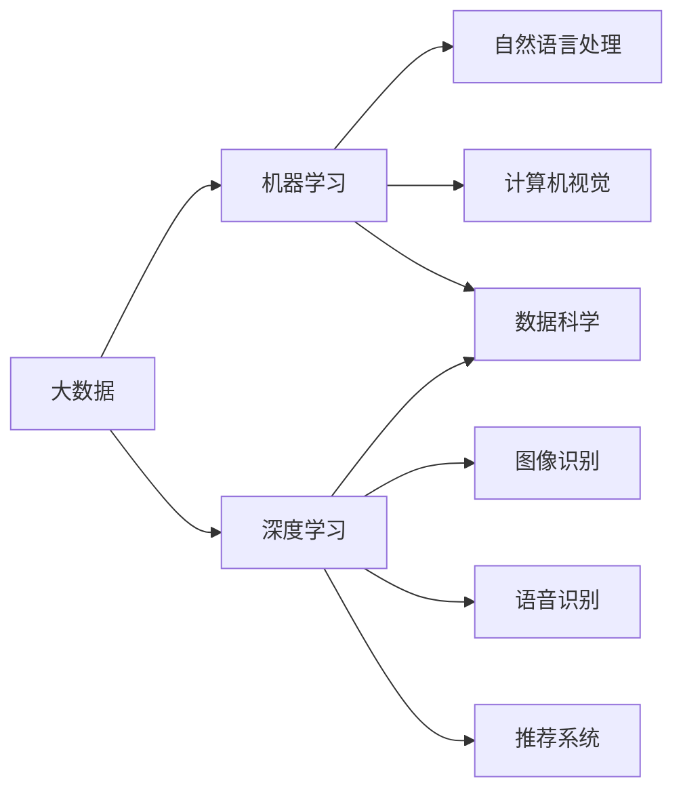

# 未来发展中的大数据与AI技术应用

> 关键词：大数据，人工智能，机器学习，深度学习，数据科学，应用场景，未来趋势

## 1. 背景介绍

随着信息技术的飞速发展，数据已成为现代社会最为重要的战略资源之一。大数据技术通过对海量数据的采集、存储、处理和分析，为我们提供了洞察世界、驱动创新的强大工具。同时，人工智能（AI）技术的兴起，使得机器学习、深度学习等算法能够从数据中学习模式、做出预测，极大地拓展了数据处理和分析的能力。本文将探讨大数据与AI技术应用的未来发展趋势，分析其面临的挑战，并展望研究展望。

## 2. 核心概念与联系

### 2.1 核心概念

#### 大数据（Big Data）

大数据是指规模巨大、类型多样、速度极快的数据集合，无法用传统数据处理工具进行高效处理。其特点可以用3V来概括：Volume（大量）、Velocity（高速）、Variety（多样）。

#### 人工智能（Artificial Intelligence, AI）

人工智能是指通过计算机程序模拟人类智能行为的技术，包括机器学习、深度学习、自然语言处理、计算机视觉等。

#### 机器学习（Machine Learning, ML）

机器学习是一种使计算机系统能够从数据中学习并做出决策的技术。它包括监督学习、无监督学习、半监督学习等。

#### 深度学习（Deep Learning, DL）

深度学习是机器学习的一个子集，它使用深层神经网络模拟人类大脑的神经元连接，从数据中自动学习特征和模式。

### 2.2 核心概念联系

Mermaid 流程图：



## 3. 核心算法原理 & 具体操作步骤

### 3.1 算法原理概述

#### 机器学习算法

机器学习算法主要分为监督学习、无监督学习、半监督学习、强化学习等。

- **监督学习**：通过标注数据进行学习，学习输入和输出之间的关系。
- **无监督学习**：通过未标注数据进行学习，发现数据中的模式和结构。
- **半监督学习**：结合标注数据和未标注数据进行学习，提高模型性能。
- **强化学习**：通过与环境交互学习最优策略，以最大化某种累积奖励。

#### 深度学习算法

深度学习算法主要基于神经网络，包括：

- **卷积神经网络（CNN）**：用于图像识别、目标检测等。
- **循环神经网络（RNN）**：用于序列数据处理，如语音识别、机器翻译等。
- **生成对抗网络（GAN）**：用于图像生成、视频合成等。

### 3.2 算法步骤详解

#### 机器学习算法步骤

1. 数据收集：收集用于训练和测试的数据集。
2. 数据预处理：对数据进行清洗、转换、标准化等操作。
3. 特征工程：提取特征，用于模型训练。
4. 模型选择：选择合适的模型算法。
5. 模型训练：使用训练数据训练模型。
6. 模型评估：使用测试数据评估模型性能。
7. 模型部署：将模型应用于实际场景。

#### 深度学习算法步骤

1. 数据收集：收集用于训练和测试的数据集。
2. 数据预处理：对数据进行清洗、转换、标准化等操作。
3. 模型构建：构建神经网络模型。
4. 模型训练：使用训练数据训练模型。
5. 模型评估：使用测试数据评估模型性能。
6. 模型部署：将模型应用于实际场景。

### 3.3 算法优缺点

#### 机器学习算法优缺点

- **优点**：通用性强，可应用于多种场景。
- **缺点**：需要大量标注数据，模型可解释性较差。

#### 深度学习算法优缺点

- **优点**：能够处理复杂数据和模型，可解释性较好。
- **缺点**：模型复杂度高，需要大量训练数据和计算资源。

### 3.4 算法应用领域

#### 机器学习算法应用领域

- 信用卡欺诈检测
- 信用评分
- 预测分析
- 文本分类
- 预测性维护

#### 深度学习算法应用领域

- 图像识别
- 语音识别
- 机器翻译
- 脸部识别
- 自动驾驶

## 4. 数学模型和公式 & 详细讲解 & 举例说明

### 4.1 数学模型构建

#### 机器学习算法数学模型

- 线性回归模型：$$ y = \theta_0 + \theta_1x_1 + \theta_2x_2 + ... + \theta_nx_n $$

- 支持向量机（SVM）：$$ f(x) = \text{sign}(\sum_{i=1}^{n} \alpha_i y_i \phi(x_i) + \theta) $$

#### 深度学习算法数学模型

- 卷积神经网络（CNN）：$$ f(x) = \text{ReLU}(W_3 \sigma(W_2 \sigma(W_1 x + b_1) + b_2) + b_3) $$

### 4.2 公式推导过程

#### 线性回归公式推导

以一元线性回归为例，假设目标函数为：

$$
E = \frac{1}{2}(y - \theta_1x - \theta_0)^2
$$

对 $\theta_1$ 和 $\theta_0$ 求偏导，并令偏导数为0，可得：

$$
\frac{\partial E}{\partial \theta_1} = -2(x_i - \hat{x})(y_i - \hat{y}) = 0
$$

$$
\frac{\partial E}{\partial \theta_0} = -2(y_i - \hat{y}) = 0
$$

其中，$\hat{x}$ 为输入均值，$\hat{y}$ 为输出均值。解上述方程组，即可得到线性回归模型的参数 $\theta_1$ 和 $\theta_0$。

### 4.3 案例分析与讲解

以信用卡欺诈检测为例，介绍如何使用机器学习算法进行欺诈检测。

1. 数据收集：收集信用卡交易数据，包括交易金额、交易时间、交易地点等特征。
2. 数据预处理：对数据进行清洗、转换、标准化等操作。
3. 特征工程：提取特征，如用户年龄、性别、职业等。
4. 模型选择：选择合适的模型算法，如支持向量机（SVM）。
5. 模型训练：使用训练数据训练模型。
6. 模型评估：使用测试数据评估模型性能，如准确率、召回率、F1值等。
7. 模型部署：将模型应用于实际场景，对交易数据进行实时检测。

## 5. 项目实践：代码实例和详细解释说明

### 5.1 开发环境搭建

1. 安装Python环境。
2. 安装机器学习库，如scikit-learn。
3. 安装深度学习库，如TensorFlow或PyTorch。

### 5.2 源代码详细实现

```python
from sklearn import datasets
from sklearn.model_selection import train_test_split
from sklearn.preprocessing import StandardScaler
from sklearn.svm import SVC

# 加载数据集
data = datasets.load_iris()
X = data.data
y = data.target

# 划分训练集和测试集
X_train, X_test, y_train, y_test = train_test_split(X, y, test_size=0.3, random_state=42)

# 数据预处理
scaler = StandardScaler()
X_train = scaler.fit_transform(X_train)
X_test = scaler.transform(X_test)

# 模型训练
model = SVC(kernel='linear')
model.fit(X_train, y_train)

# 模型评估
accuracy = model.score(X_test, y_test)
print("Accuracy:", accuracy)
```

### 5.3 代码解读与分析

1. 加载数据集：使用scikit-learn库的datasets模块加载鸢尾花数据集。
2. 划分训练集和测试集：使用train_test_split函数划分训练集和测试集，测试集占30%。
3. 数据预处理：使用StandardScaler标准化特征，提高模型收敛速度。
4. 模型训练：使用SVM模型进行训练。
5. 模型评估：计算模型在测试集上的准确率。

## 6. 实际应用场景

### 6.1 医疗健康

- 个性化医疗：根据患者的基因、病史等信息，为患者提供个性化的治疗方案。
- 疾病预测：通过分析患者的生理指标、生活习惯等数据，预测患者患病风险。
- 药物研发：使用药物分子数据预测药物活性，加速新药研发进程。

### 6.2 金融科技

- 信用评估：根据用户的信用历史、交易记录等信息，评估用户的信用等级。
- 风险控制：识别和预测金融风险，防范金融犯罪。
- 量化交易：利用机器学习算法进行量化交易，实现自动化的投资决策。

### 6.3 智能制造

- 预测性维护：通过分析设备运行数据，预测设备故障，提前进行维护，减少停机时间。
- 质量检测：自动识别和分类产品缺陷，提高产品质量。
- 生产优化：根据生产数据优化生产流程，提高生产效率。

### 6.4 交通出行

- 交通流量预测：预测交通流量，优化交通信号灯控制，缓解交通拥堵。
- 无人驾驶：利用计算机视觉和深度学习技术实现无人驾驶，提高交通安全。
- 智能导航：根据实时路况，为用户提供最优出行路线。

## 7. 工具和资源推荐

### 7.1 学习资源推荐

- 《机器学习实战》：提供机器学习算法的实例和代码，适合入门者学习。
- 《深度学习》：介绍深度学习的基本原理和常用算法，适合有一定基础的学习者。
- Coursera、Udacity等在线课程平台：提供丰富的机器学习和深度学习课程。

### 7.2 开发工具推荐

- Python：常用的编程语言，支持多种机器学习和深度学习库。
- Jupyter Notebook：用于数据分析和可视化，方便进行实验和分享。
- TensorFlow、PyTorch：常用的深度学习框架，提供丰富的API和工具。

### 7.3 相关论文推荐

- "Learning Representations by Back-Propagating Errors"（反向传播算法）
- "Playing Atari with Deep Reinforcement Learning"（深度强化学习）
- "ImageNet Classification with Deep Convolutional Neural Networks"（深度卷积神经网络）
- "A Theoretically Grounded Application of Dropout in Recurrent Neural Networks"（dropout在循环神经网络中的应用）

## 8. 总结：未来发展趋势与挑战

### 8.1 研究成果总结

大数据和AI技术的融合为各行业带来了颠覆性的变革。从个性化医疗、金融科技到智能制造、交通出行，大数据和AI技术已经深入到我们的日常生活和工作中。未来，随着计算能力的提升、数据量的爆炸式增长以及算法的不断优化，大数据和AI技术将在更多领域发挥重要作用。

### 8.2 未来发展趋势

#### 数据驱动决策

未来，越来越多的企业和组织将基于大数据和AI技术进行数据驱动决策，提高效率和竞争力。

#### 智能化服务

随着AI技术的不断发展，智能化服务将成为主流，为用户提供更加便捷、个性化的服务。

#### 跨界融合

大数据和AI技术将与物联网、区块链等其他技术进行跨界融合，创造更多创新应用。

### 8.3 面临的挑战

#### 数据安全问题

随着数据量的增加，数据安全问题将越来越突出。如何保护用户隐私、确保数据安全成为亟待解决的问题。

#### 算法偏见

AI算法可能会存在偏见，导致不公正的决策。如何消除算法偏见，保证算法公平性是一个重要挑战。

#### 模型可解释性

深度学习等复杂模型的可解释性较差，难以理解其决策过程。如何提高模型可解释性，增强用户信任是一个重要课题。

### 8.4 研究展望

未来，大数据和AI技术将在以下几个方面取得突破：

#### 1. 算法优化

通过算法优化，提高模型的效率和可解释性，降低计算成本。

#### 2. 跨模态学习

研究跨模态学习，实现不同模态数据的融合和交互。

#### 3. 自适应学习

研究自适应学习，使模型能够根据环境变化自动调整策略。

#### 4. 强化学习

研究强化学习，使机器能够从环境中学习最优策略。

#### 5. 知识表示与推理

研究知识表示与推理，使机器能够理解和运用知识，进行复杂决策。

通过不断努力，大数据和AI技术将在未来发挥更大的作用，为人类社会创造更多价值。

## 9. 附录：常见问题与解答

**Q1：大数据和AI技术的主要区别是什么？**

A：大数据是指规模巨大、类型多样的数据集合，而AI技术是指使计算机系统能够模拟人类智能行为的技术。大数据为AI技术提供了丰富的数据资源，AI技术则利用大数据实现更强大的数据处理和分析能力。

**Q2：机器学习和深度学习的区别是什么？**

A：机器学习是一种使计算机系统能够从数据中学习并做出决策的技术，包括监督学习、无监督学习、半监督学习等。深度学习是机器学习的一个子集，它使用深层神经网络模拟人类大脑的神经元连接，从数据中自动学习特征和模式。

**Q3：如何选择合适的机器学习模型？**

A：选择合适的机器学习模型需要考虑以下因素：
1. 数据特点：数据类型、数据量、特征数量等。
2. 任务类型：分类、回归、聚类等。
3. 模型复杂度：模型参数数量、计算复杂度等。
4. 计算资源：CPU、GPU等。

**Q4：如何提高机器学习模型的性能？**

A：提高机器学习模型性能的方法包括：
1. 数据增强：通过数据清洗、转换、标准化等操作，提高数据质量。
2. 特征工程：提取有效的特征，提高模型对数据的表达能力。
3. 模型调优：调整模型参数，如学习率、正则化参数等。
4. 模型集成：将多个模型集成，提高模型鲁棒性。

**Q5：大数据和AI技术有哪些伦理问题？**

A：大数据和AI技术可能带来的伦理问题包括：
1. 数据隐私：如何保护用户隐私，防止数据泄露。
2. 算法偏见：如何消除算法偏见，保证算法公平性。
3. 机器替代：如何处理机器替代人类工作的问题。
4. 人工智能武器化：如何防止人工智能被用于恶意目的。

作者：禅与计算机程序设计艺术 / Zen and the Art of Computer Programming