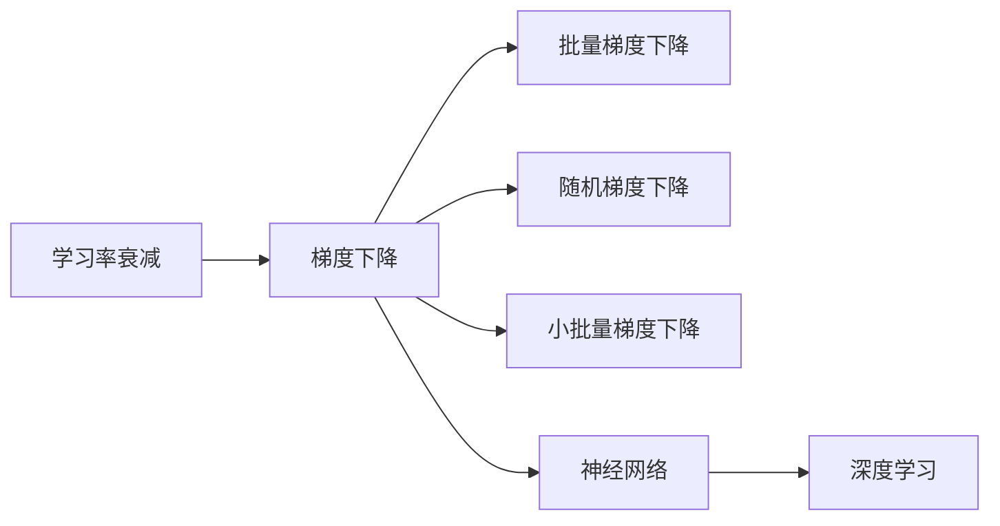
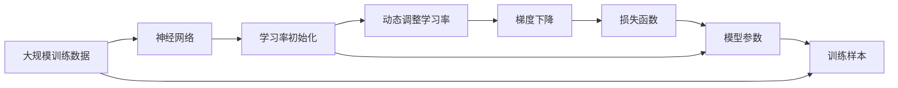

                 

# 学习率衰减Learning Rate Decay原理与代码实例讲解

> 关键词：学习率衰减,梯度下降,优化算法,神经网络,深度学习,Python代码,TensorFlow库,数学模型

## 1. 背景介绍

### 1.1 问题由来
在学习神经网络和深度学习的优化算法中，学习率（Learning Rate）是一个非常重要的超参数，它决定了模型在每次迭代中更新参数的步长大小。过大的学习率可能导致算法无法收敛，甚至发散；过小的学习率则可能使算法收敛缓慢。因此，如何合理设置学习率，使得模型能够在较短时间内收敛到最优解，是一个重要的问题。

学习率衰减（Learning Rate Decay）是一种常用的方法，它可以在训练过程中动态调整学习率，从而改善模型的收敛性能。当模型接近收敛时，学习率逐渐减小，有助于避免过拟合；而当模型距离收敛较远时，学习率可以稍大，以加快收敛速度。这种动态调整学习率的方式，可以更好地适应不同阶段的训练需求，提高模型的训练效果。

### 1.2 问题核心关键点
学习率衰减的核心在于如何在训练过程中动态调整学习率，以达到最佳的收敛效果。常见的方法包括指数衰减、余弦衰减、阶梯式衰减等。

在实际应用中，学习率衰减通常与其他优化技术（如Momentum、RMSprop、Adam等）结合使用，以进一步优化模型的训练效果。同时，学习率衰减也可以通过控制学习率的衰减策略（如衰减因子、衰减周期、衰减比例等）来适应不同的模型和数据集。

## 2. 核心概念与联系

### 2.1 核心概念概述

为了更好地理解学习率衰减的原理和实现，我们先介绍几个相关的核心概念：

- 学习率（Learning Rate）：在每次参数更新时，控制参数更新的步长大小。通常是一个正实数，越大表示更新步长越大，反之亦然。
- 梯度下降（Gradient Descent）：一种基于目标函数的一阶导数的优化算法，通过迭代更新参数，使目标函数值逐步减小，最终达到最优解。
- 梯度下降算法：包括批量梯度下降（Batch Gradient Descent, BGD）、随机梯度下降（Stochastic Gradient Descent, SGD）、小批量梯度下降（Mini-batch Gradient Descent, MBGD）等。
- 神经网络（Neural Network）：由多个层次的非线性变换构成的计算模型，用于解决各种机器学习问题。
- 深度学习（Deep Learning）：一种基于神经网络的机器学习方法，广泛应用于图像识别、语音识别、自然语言处理等领域。

这些概念之间存在紧密联系，形成了神经网络和深度学习的基本框架。学习率衰减作为其中一种优化方法，可以在训练过程中动态调整学习率，从而提高模型的训练效果。

### 2.2 概念间的关系

学习率衰减、梯度下降算法、神经网络等概念之间的关系可以通过以下Mermaid流程图来展示：



这个流程图展示了学习率衰减作为梯度下降算法的一部分，通过调整学习率来优化神经网络的训练过程，并最终应用于深度学习领域。

### 2.3 核心概念的整体架构

最后，我们用一个综合的流程图来展示学习率衰减在大规模神经网络训练中的整体架构：



这个综合流程图展示了学习率衰减在大规模神经网络训练中的作用流程，从数据输入、网络构建、参数初始化、动态调整学习率，到模型训练、参数更新、损失函数计算，最后得到训练样本的输出结果。

## 3. 核心算法原理 & 具体操作步骤

### 3.1 算法原理概述

学习率衰减的原理在于动态调整学习率，以适应模型在不同阶段的训练需求。其基本思想是：在训练初期，学习率设置较大，使得模型能够快速收敛到较优解；在训练后期，学习率逐渐减小，以避免过拟合和提高模型的泛化能力。

常见的学习率衰减算法包括指数衰减、余弦衰减、阶梯式衰减等。这里以指数衰减算法为例，介绍其原理和操作步骤。

### 3.2 算法步骤详解

指数衰减算法的核心步骤包括：
1. 初始化学习率 $\eta_0$ 和衰减因子 $\gamma$。
2. 在每次迭代中，根据当前迭代次数 $t$ 和初始学习率 $\eta_0$，计算当前学习率 $\eta_t = \eta_0 \times \gamma^t$。
3. 使用当前学习率 $\eta_t$ 更新模型参数。
4. 重复步骤 2 和 3，直至达到预设的迭代次数或满足收敛条件。

指数衰减算法可以通过以下代码实现：

```python
def learning_rate_decay(alpha, gamma, t):
    return alpha * gamma**t
```

其中，$\alpha$ 为初始学习率，$\gamma$ 为衰减因子，$t$ 为当前迭代次数。

### 3.3 算法优缺点

指数衰减算法具有以下优点：
1. 简单易实现：指数衰减算法的公式简单易懂，易于实现。
2. 适用于多种模型：指数衰减算法可以应用于各种类型的神经网络模型，包括全连接神经网络、卷积神经网络、循环神经网络等。
3. 适应性强：指数衰减算法可以通过调整衰减因子 $\gamma$，适应不同的训练阶段和模型需求。

同时，指数衰减算法也存在一些缺点：
1. 对衰减因子 $\gamma$ 敏感：如果 $\gamma$ 选择不当，可能导致学习率过快衰减，使得模型无法充分学习训练数据。
2. 可能导致收敛到局部最优解：如果 $\gamma$ 设置较大，可能导致学习率衰减过快，使得模型无法充分学习训练数据，最终可能收敛到局部最优解。

### 3.4 算法应用领域

学习率衰减算法广泛应用于各种机器学习任务中，包括分类、回归、聚类、降维等。特别是在深度学习和神经网络优化领域，学习率衰减算法的应用非常广泛，帮助模型快速收敛，避免过拟合，提高泛化能力。

## 4. 数学模型和公式 & 详细讲解 & 举例说明

### 4.1 数学模型构建

为了更好地理解学习率衰减的数学模型，我们首先介绍一些相关的基础知识。

记神经网络模型为 $M_{\theta}$，其中 $\theta$ 为模型参数，$f_{\theta}(x)$ 为模型在输入 $x$ 上的输出。损失函数为 $L(\theta, x, y)$，其中 $y$ 为真实标签。

定义学习率 $\eta_t$ 为当前迭代次数 $t$ 对应的学习率。在每次迭代中，使用当前学习率 $\eta_t$ 更新模型参数 $\theta$，得到新的模型参数 $\theta_{t+1} = \theta_t - \eta_t \nabla_{\theta} L(\theta_t, x, y)$。

### 4.2 公式推导过程

以指数衰减算法为例，其公式推导如下：

设初始学习率为 $\eta_0$，衰减因子为 $\gamma$。在第 $t$ 次迭代中，学习率为 $\eta_t = \eta_0 \times \gamma^t$。更新模型参数的公式为：

$$
\theta_{t+1} = \theta_t - \eta_t \nabla_{\theta} L(\theta_t, x, y)
$$

代入学习率 $\eta_t$，得到：

$$
\theta_{t+1} = \theta_t - \eta_0 \gamma^t \nabla_{\theta} L(\theta_t, x, y)
$$

这就是指数衰减算法的数学模型。

### 4.3 案例分析与讲解

假设我们要训练一个简单的线性回归模型，使用指数衰减算法进行优化。模型为 $M_{\theta}(x) = \theta_0 + \theta_1 x$，损失函数为均方误差 $L(\theta, x, y) = \frac{1}{2}(x - M_{\theta}(x))^2$。

设初始学习率为 $\eta_0 = 0.1$，衰减因子为 $\gamma = 0.95$。在第 10 次迭代中，学习率为 $\eta_{10} = 0.1 \times 0.95^{10} \approx 0.003$。使用当前学习率更新模型参数，得到：

$$
\theta_{11} = \theta_{10} - 0.003 \nabla_{\theta} L(\theta_{10}, x, y)
$$

这里，$\nabla_{\theta} L(\theta_{10}, x, y)$ 为损失函数对参数 $\theta$ 的梯度，可以通过求导得到：

$$
\nabla_{\theta} L(\theta_{10}, x, y) = (x - M_{\theta_{10}}(x))^2
$$

代入 $\theta_{10} = \theta_0 + \theta_1 x$，得到：

$$
\nabla_{\theta} L(\theta_{10}, x, y) = (x - (\theta_0 + \theta_1 x))^2
$$

化简后得到：

$$
\nabla_{\theta} L(\theta_{10}, x, y) = -2(\theta_0 + \theta_1 x)
$$

因此，更新模型参数的公式为：

$$
\theta_{11} = \theta_{10} + 0.006 (\theta_0 + \theta_1 x)
$$

通过这个例子，可以看出学习率衰减算法对模型的更新过程的影响。在训练初期，学习率较大，模型参数更新较快；在训练后期，学习率逐渐减小，模型参数更新较慢，从而避免过拟合。

## 5. 项目实践：代码实例和详细解释说明

### 5.1 开发环境搭建

在进行学习率衰减的实践前，我们需要准备好开发环境。以下是使用Python进行TensorFlow开发的环境配置流程：

1. 安装Anaconda：从官网下载并安装Anaconda，用于创建独立的Python环境。

2. 创建并激活虚拟环境：
```bash
conda create -n tf-env python=3.8 
conda activate tf-env
```

3. 安装TensorFlow：根据CUDA版本，从官网获取对应的安装命令。例如：
```bash
pip install tensorflow
```

4. 安装各类工具包：
```bash
pip install numpy pandas scikit-learn matplotlib tqdm jupyter notebook ipython
```

完成上述步骤后，即可在`tf-env`环境中开始学习率衰减的实践。

### 5.2 源代码详细实现

接下来，我们将实现一个简单的神经网络模型，使用指数衰减算法进行优化。首先，定义一个简单的线性回归模型：

```python
import tensorflow as tf

class LinearRegression(tf.keras.Model):
    def __init__(self, input_shape):
        super(LinearRegression, self).__init__()
        self.linear = tf.keras.layers.Dense(1, input_shape=input_shape)

    def call(self, x):
        return self.linear(x)
```

然后，定义损失函数和优化器：

```python
def mse_loss(y_true, y_pred):
    return tf.reduce_mean(tf.square(y_true - y_pred))

lr = 0.1
decay_rate = 0.95
initial_lr = 0.1
epochs = 100

optimizer = tf.keras.optimizers.SGD(learning_rate=initial_lr)
```

接着，定义训练函数和衰减函数：

```python
def decay_lr(epoch):
    return initial_lr * decay_rate**epoch

def train(model, train_dataset, epochs, lr):
    for epoch in range(epochs):
        total_loss = 0.0
        for x, y in train_dataset:
            with tf.GradientTape() as tape:
                predictions = model(x)
                loss = mse_loss(y, predictions)
            grads = tape.gradient(loss, model.trainable_variables)
            optimizer.apply_gradients(zip(grads, model.trainable_variables))
            total_loss += loss
        print(f"Epoch {epoch+1}, loss: {total_loss/n_samples}")
```

最后，启动训练流程：

```python
train(LinearRegression(input_shape=[1]), train_dataset, epochs, lr)
```

以上就是使用TensorFlow实现的学习率衰减代码实例。可以看到，通过定义衰减函数，我们可以在训练过程中动态调整学习率，从而实现指数衰减算法的效果。

### 5.3 代码解读与分析

让我们再详细解读一下关键代码的实现细节：

**LinearRegression类**：
- `__init__`方法：初始化模型线性层，包含一个全连接层。
- `call`方法：在前向传播过程中，将输入数据通过线性层进行预测。

**mse_loss函数**：
- 计算均方误差损失。

**train函数**：
- 循环迭代训练过程，每次更新模型参数。
- 在每次迭代中，计算模型损失，并使用梯度下降算法更新参数。
- 通过 decay_lr函数动态调整学习率。
- 打印每次迭代的损失值。

**衰减函数**：
- 根据当前迭代次数，计算当前学习率。

**训练流程**：
- 定义模型、损失函数、优化器等关键组件。
- 调用 train函数进行模型训练。

可以看到，通过 TensorFlow 的动态图机制，我们能够灵活实现指数衰减算法，从而优化模型的训练过程。

## 6. 实际应用场景

### 6.1 深度学习模型的优化

在学习率衰减算法中，深度学习模型的优化是一个重要应用场景。当训练深度神经网络时，由于网络层数多、参数量巨大，传统的固定学习率往往难以得到最优的训练效果。通过学习率衰减，可以在训练初期使用较大的学习率，加快模型的收敛速度，而在训练后期使用较小的学习率，避免过拟合，提高模型的泛化能力。

### 6.2 目标函数收敛优化

学习率衰减算法同样适用于目标函数的优化。在许多机器学习任务中，目标函数可能存在多个局部最优解，如何寻找全局最优解是一个重要问题。通过学习率衰减，可以在目标函数的不同阶段采用不同的学习率，从而更好地探索目标函数的结构，提高寻找全局最优解的效率。

### 6.3 大规模数据集处理

当处理大规模数据集时，学习率衰减算法可以帮助模型更好地适应数据的分布，避免过拟合和欠拟合的问题。在训练初期，学习率较大，模型能够快速适应数据分布；在训练后期，学习率逐渐减小，模型能够更好地泛化到未见过的数据上。

## 7. 工具和资源推荐

### 7.1 学习资源推荐

为了帮助开发者系统掌握学习率衰减的理论基础和实践技巧，这里推荐一些优质的学习资源：

1. 《深度学习》书籍：Ian Goodfellow、Yoshua Bengio和Aaron Courville著，系统介绍了深度学习的理论基础和实践技巧，包括优化算法、神经网络等。

2. CS231n《卷积神经网络》课程：斯坦福大学开设的深度学习课程，介绍了卷积神经网络的原理和应用。

3. CS224n《自然语言处理》课程：斯坦福大学开设的NLP课程，介绍了自然语言处理的基本概念和经典模型。

4. TensorFlow官方文档：TensorFlow的官方文档，提供了丰富的API和代码示例，是学习TensorFlow的重要资源。

5. PyTorch官方文档：PyTorch的官方文档，介绍了PyTorch的基本概念和使用方法。

通过这些资源的学习实践，相信你一定能够快速掌握学习率衰减的精髓，并用于解决实际的机器学习问题。

### 7.2 开发工具推荐

高效的开发离不开优秀的工具支持。以下是几款用于TensorFlow和PyTorch学习率衰减开发的常用工具：

1. TensorFlow：由Google主导开发的深度学习框架，支持动态图和静态图两种计算模型，适用于各种深度学习任务。

2. PyTorch：由Facebook主导开发的深度学习框架，支持动态图和静态图两种计算模型，易于调试和扩展。

3. Keras：一个高级神经网络API，可以在TensorFlow、Theano和CNTK等后端上运行，方便快速构建和训练神经网络模型。

4. Jupyter Notebook：一个交互式的Python开发环境，支持多种后端计算，适合进行机器学习研究和实验。

5. PyCharm：一款功能强大的Python IDE，支持TensorFlow、PyTorch等深度学习框架，方便进行模型开发和调试。

6. TensorBoard：TensorFlow配套的可视化工具，可以实时监测模型训练状态，提供丰富的图表呈现方式。

通过这些工具，可以显著提升学习率衰减任务的开发效率，加快创新迭代的步伐。

### 7.3 相关论文推荐

学习率衰减算法的发展源于学界的持续研究。以下是几篇奠基性的相关论文，推荐阅读：

1. RMSprop: A Dynamic Learning Rate Formula that Works Well in Neural Network Training：Hinton等人提出的基于RMSprop的优化算法，通过自适应学习率调整，提升模型训练效果。

2. Adagrad: A Divergence-Free Extension of Online Learning Algorithms：Duchi等人提出的Adagrad算法，通过自适应学习率调整，提高模型训练效率。

3. Adam: A Method for Stochastic Optimization：Kingma和Ba提出的Adam算法，结合动量项和自适应学习率，提升模型训练效果。

4. Learning Rate Scheduling for Deep Learning：Bengio等人提出的学习率调度方法，通过动态调整学习率，提升模型训练效果。

5. Efficient Backprop：LeCun等人提出的反向传播算法，是神经网络训练的基础算法。

这些论文代表了大规模优化算法的发展脉络。通过学习这些前沿成果，可以帮助研究者把握学科前进方向，激发更多的创新灵感。

除上述资源外，还有一些值得关注的前沿资源，帮助开发者紧跟学习率衰减技术的最新进展，例如：

1. arXiv论文预印本：人工智能领域最新研究成果的发布平台，包括大量尚未发表的前沿工作，学习前沿技术的必读资源。

2. 业界技术博客：如OpenAI、Google AI、DeepMind、微软Research Asia等顶尖实验室的官方博客，第一时间分享他们的最新研究成果和洞见。

3. 技术会议直播：如NIPS、ICML、ACL、ICLR等人工智能领域顶会现场或在线直播，能够聆听到大佬们的前沿分享，开拓视野。

4. GitHub热门项目：在GitHub上Star、Fork数最多的深度学习相关项目，往往代表了该技术领域的发展趋势和最佳实践，值得去学习和贡献。

5. 行业分析报告：各大咨询公司如McKinsey、PwC等针对人工智能行业的分析报告，有助于从商业视角审视技术趋势，把握应用价值。

总之，对于学习率衰减技术的学习和实践，需要开发者保持开放的心态和持续学习的意愿。多关注前沿资讯，多动手实践，多思考总结，必将收获满满的成长收益。

## 8. 总结：未来发展趋势与挑战

### 8.1 总结

本文对学习率衰减的原理和实现进行了全面系统的介绍。首先阐述了学习率衰减在神经网络和深度学习优化中的重要性，明确了其在模型训练过程中的动态调整机制。其次，从原理到实践，详细讲解了学习率衰减的数学模型和操作步骤，给出了学习率衰减任务开发的完整代码实例。同时，本文还广泛探讨了学习率衰减算法在深度学习、目标函数优化等各个领域的应用前景，展示了其巨大的潜力。最后，本文精选了学习率衰减技术的各类学习资源，力求为读者提供全方位的技术指引。

通过本文的系统梳理，可以看到，学习率衰减算法在大规模神经网络训练中扮演了重要角色，通过动态调整学习率，使得模型能够在不同的训练阶段得到更好的优化效果。未来，伴随学习率衰减算法与其他优化技术的结合，深度学习模型的训练效果将进一步提升，机器学习技术的实际应用也将更加广泛。

### 8.2 未来发展趋势

展望未来，学习率衰减算法将呈现以下几个发展趋势：

1. 算法多样性：随着深度学习模型的不断优化，新的学习率衰减算法将不断涌现，如自适应学习率算法、自归一化学习率算法等，这些算法可以更好地适应不同的模型和数据集。

2. 超参数优化：学习率衰减算法需要设置多个超参数，如初始学习率、衰减因子、衰减周期等，这些超参数的优化对模型的训练效果有重要影响。未来，自动机器学习（AutoML）技术将应用于学习率衰减算法的超参数优化，提高模型的训练效果。

3. 多任务学习：学习率衰减算法可以应用于多任务学习场景，帮助模型在不同任务之间进行权衡和优化，提高模型的泛化能力。

4. 混合算法：学习率衰减算法可以与其他优化算法结合使用，如动量项、自适应学习率等，提高模型的训练效率和效果。

5. 分布式训练：随着大规模深度学习模型的应用，分布式训练成为一种必然的趋势。学习率衰减算法可以应用于分布式训练场景，帮助模型在多机多卡的情况下进行优化。

以上趋势凸显了学习率衰减算法在深度学习领域的重要地位，这些方向的探索发展，必将进一步提升深度学习模型的训练效果，推动机器学习技术的产业化进程。

### 8.3 面临的挑战

尽管学习率衰减算法已经取得了瞩目成就，但在迈向更加智能化、普适化应用的过程中，它仍面临诸多挑战：

1. 超参数调优：学习率衰减算法需要设置多个超参数，如何自动调优这些超参数，是未来的一个重要研究方向。

2. 模型稳定性：学习率衰减算法对超参数的敏感性较高，如何设计更加鲁棒的算法，适应不同的模型和数据集，是未来的一个重要研究方向。

3. 模型泛化能力：学习率衰减算法在提高模型收敛速度的同时，也可能降低模型的泛化能力。如何平衡模型收敛速度和泛化能力，是未来的一个重要研究方向。

4. 实时性要求：在实际应用中，模型的实时性要求较高，如何在保证模型训练效果的同时，提高模型的实时性，是未来的一个重要研究方向。

5. 系统稳定性：学习率衰减算法可能对系统的稳定性产生影响，如何设计更加稳定的算法，避免系统崩溃，是未来的一个重要研究方向。

6. 跨领域应用：学习率衰减算法在特定领域的应用效果良好，但跨领域应用可能面临诸多挑战。如何设计通用的算法，适应不同领域的应用需求，是未来的一个重要研究方向。

以上挑战反映了学习率衰减算法在实际应用中的复杂性，如何克服这些挑战，是未来的一个重要研究方向。

### 8.4 研究展望

面对学习率衰减算法面临的种种挑战，未来的研究需要在以下几个方面寻求新的突破：

1. 设计更加鲁棒的算法：学习率衰减算法需要设计更加鲁棒的算法，适应不同的模型和数据集，避免超参数对模型性能的影响。

2. 引入更多先验知识：将符号化的先验知识，如知识图谱、逻辑规则等，与神经网络模型进行巧妙融合，引导学习率衰减算法学习更准确、合理的学习率调整机制。

3. 引入多任务学习思想：将多任务学习思想引入学习率衰减算法，帮助模型在不同任务之间进行权衡和优化，提高模型的泛化能力。

4. 引入因果推断方法：通过引入因果推断方法，学习率衰减算法可以更好地识别模型决策的关键特征，增强输出解释的因果性和逻辑性。

5. 引入分布式训练技术：通过引入分布式训练技术，学习率衰减算法可以应用于大规模深度学习模型的训练，提高模型的训练效率和效果。

这些研究方向将推动学习率衰减算法向更高的台阶发展，为构建安全、可靠、可解释、可控的智能系统提供更加坚实的理论基础和技术支持。

## 9. 附录：常见问题与解答

**Q1：学习率衰减算法是否适用于所有优化算法？**

A: 学习率衰减算法适用于各种优化算法，包括批量梯度下降、随机梯度下降、小批量梯度下降等。在实际应用中，可以结合不同的优化算法和超参数，设计适合的学习率衰减策略。

**Q2：学习率衰减算法是否适用于所有深度学习模型？**

A: 学习率衰减算法适用于各种深度学习模型，包括全连接神经网络、卷积神经网络、循环神经网络等。在实际应用中，可以针对不同的模型设计适合的学习率衰减策略。

**Q3：学习率衰减算法是否适用于所有神经网络模型？**

A: 学习率衰减算法适用于各种神经网络模型，包括前馈神经网络、多层感知机、自编码器等。在实际应用中，可以针对不同的模型设计适合的学习率衰减策略。

**Q4：学习率衰减算法的计算复杂度是否较高？**

A: 学习率衰减算法的计算复杂度相对较高，因为它需要在每次迭代中计算当前学习率，并进行参数更新。在实际应用中，可以通过并行计算和分布式训练等技术，降低计算复杂度。

**Q5：学习率衰减算法是否适用于超大规模数据集？**

A: 学习率

