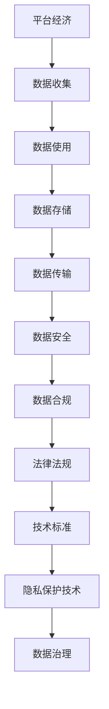
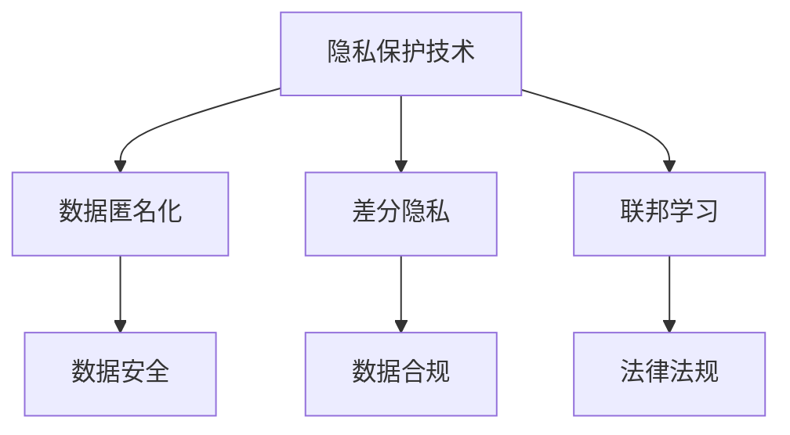
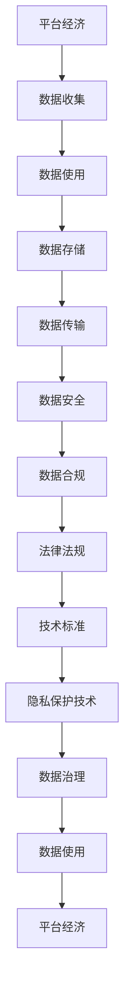

                 

# 平台经济的数据监管体系建设：如何构建完善的监管体系？

> 关键词：平台经济,数据监管,大数据,人工智能,隐私保护,法律法规,技术标准

## 1. 背景介绍

### 1.1 问题由来
随着互联网和信息技术的发展，平台经济成为了当前经济活动的重要形态。平台经济依靠数据驱动，依靠大量用户产生的数据进行算法优化、个性化推荐、精准营销等活动，实现了高效、低成本的资源配置和业务创新。但数据的使用也带来了隐私保护、公平竞争、数据安全等诸多挑战，对数据监管提出了更高的要求。

### 1.2 问题核心关键点
平台经济数据监管的核心关键点主要包括：

1. **数据收集与使用**：平台如何合法合规地收集和使用用户数据，避免侵犯用户隐私。
2. **数据隐私与保护**：如何保护用户的个人信息，防止数据泄露和滥用。
3. **公平竞争**：平台之间在数据使用上的竞争是否公平，避免数据垄断和滥用。
4. **数据安全**：如何保障数据在传输和存储过程中的安全性，防止数据被黑客攻击。
5. **法律法规与技术标准**：如何构建完善的法律法规和技术标准体系，规范平台数据使用行为。

### 1.3 问题研究意义
构建完善的平台经济数据监管体系，对于保障用户权益、维护市场公平、提升数据治理能力具有重要意义：

1. **保障用户权益**：通过制定数据使用规范，保护用户隐私和个人信息安全，提升用户对平台的信任度。
2. **维护市场公平**：通过公平的数据使用规则，避免数据垄断和滥用，促进平台之间的公平竞争。
3. **提升数据治理能力**：通过规范数据收集和使用，提升平台的数据治理能力，推动数据要素的市场化。
4. **促进产业发展**：通过明确数据使用规则，为数据创新和应用提供法律保障，促进平台经济的可持续发展。

## 2. 核心概念与联系

### 2.1 核心概念概述

为更好地理解平台经济数据监管体系，本节将介绍几个密切相关的核心概念：

- **平台经济**：以互联网为媒介，提供产品或服务，通过聚集大量用户进行商业模式创新的经济形态。
- **数据隐私**：用户个人信息的保密性和控制权，包括个人信息的收集、存储、使用、传输和删除等环节。
- **数据安全**：保障数据在处理、传输和存储过程中免遭未经授权的访问、使用、修改和破坏。
- **数据合规**：平台在数据收集、使用、存储和传输等环节遵守法律法规和技术标准的规范要求。
- **隐私保护技术**：如数据匿名化、差分隐私、联邦学习等，用于保护用户隐私的技术手段。
- **法律法规**：如《中华人民共和国网络安全法》、《中华人民共和国数据保护法》等，规范平台数据使用的法律法规。
- **技术标准**：如GDPR、ISO/IEC 27001等，提供数据治理和保护的通用技术标准。

这些核心概念之间的逻辑关系可以通过以下Mermaid流程图来展示：


这个流程图展示了平台经济数据监管体系的核心概念及其相互关系：

1. 平台通过收集用户数据进行商业活动。
2. 数据在平台内使用、存储和传输过程中需要保障其安全性。
3. 平台需要在法律法规和技术标准下进行合规使用。
4. 法律法规和技术标准下，隐私保护技术用于保护用户隐私。

### 2.2 概念间的关系

这些核心概念之间存在着紧密的联系，形成了平台经济数据监管体系的完整框架。下面我们通过几个Mermaid流程图来展示这些概念之间的关系。

#### 2.2.1 平台数据监管体系



这个流程图展示了从平台经济到数据治理的完整流程：

1. 平台经济基于数据进行商业活动。
2. 数据从收集到使用需要经过存储和传输环节，保障数据安全。
3. 数据合规需要在法律法规和技术标准下进行。
4. 法律法规和技术标准指导隐私保护技术的实施。
5. 数据治理能力提升了平台的数据使用效率。

#### 2.2.2 法律法规与技术标准的相互作用


这个流程图展示了法律法规与技术标准在数据监管中的相互作用：

1. 法律法规提供数据使用的规范要求。
2. 技术标准在法律法规下进行具体实施。
3. 数据合规需要在法律法规和技术标准下进行。
4. 数据安全依赖技术标准的保障。
5. 隐私保护技术在法律法规和技术标准指导下实施。
6. 数据治理提升数据使用效率。

#### 2.2.3 隐私保护技术的实施



这个流程图展示了隐私保护技术在数据监管中的具体实施：

1. 隐私保护技术包括数据匿名化、差分隐私和联邦学习等手段。
2. 数据匿名化保护用户隐私，防止数据泄露。
3. 差分隐私通过随机化处理，保护用户隐私，防止数据被重识别。
4. 联邦学习通过分布式计算，保护数据隐私，防止数据被集中。
5. 数据安全依赖隐私保护技术的实施。
6. 数据合规需要在法律法规和技术标准指导下进行。
7. 法律法规和技术标准在隐私保护技术下进行具体实施。

### 2.3 核心概念的整体架构

最后，我们用一个综合的流程图来展示这些核心概念在平台经济数据监管体系中的整体架构：



这个综合流程图展示了从平台经济到数据治理的完整过程：

1. 平台经济基于数据进行商业活动。
2. 数据从收集到使用需要经过存储和传输环节，保障数据安全。
3. 数据合规需要在法律法规和技术标准下进行。
4. 法律法规和技术标准提供数据使用的规范要求。
5. 隐私保护技术在法律法规和技术标准指导下实施。
6. 数据治理提升了平台的数据使用效率。
7. 数据使用和平台经济相互促进，共同推动经济发展。

## 3. 核心算法原理 & 具体操作步骤
### 3.1 算法原理概述

平台经济数据监管的核心原理是通过法律法规和技术标准的约束，保障平台在数据收集、使用、存储和传输等环节的合规性和安全性。

具体来说，平台需要在以下三个层面上进行合规和数据治理：

1. **数据收集**：确保数据收集的合法性，明确数据收集的目的、范围和方式，保护用户隐私。
2. **数据使用**：规范数据的使用行为，防止数据滥用和垄断，保障公平竞争。
3. **数据安全**：保障数据在存储和传输过程中的安全性，防止数据泄露和攻击。

### 3.2 算法步骤详解

基于平台经济数据监管的核心原理，构建数据监管体系的步骤主要包括：

1. **制定法律法规**：
   - 制定《数据保护法》、《网络安全法》等法律法规，明确数据使用的规范要求。
   - 设定数据收集、使用、存储和传输的合规标准，防止数据滥用和泄露。
   - 定义数据治理的法律法规框架，明确平台的数据治理责任。

2. **设计技术标准**：
   - 制定GDPR、ISO/IEC 27001等技术标准，提供数据治理和保护的通用要求。
   - 设计隐私保护技术标准，如数据匿名化、差分隐私、联邦学习等，指导平台实施隐私保护措施。
   - 制定数据安全和数据合规的技术标准，确保数据使用的安全性。

3. **实施隐私保护技术**：
   - 采用数据匿名化技术，保护用户隐私，防止数据被重识别。
   - 引入差分隐私技术，通过随机化处理，保护用户隐私，防止数据被重识别。
   - 使用联邦学习技术，通过分布式计算，保护数据隐私，防止数据被集中。

4. **进行数据合规审查**：
   - 制定数据合规审查机制，对平台的数据收集、使用、存储和传输进行定期审查。
   - 建立数据合规审查团队，对平台的合规情况进行评估和监督。
   - 引入第三方审计机构，对平台的数据使用进行独立审计和评估。

5. **实施数据治理**：
   - 建立数据治理框架，明确数据治理流程和职责。
   - 设计数据治理工具，支持数据的收集、使用、存储和传输。
   - 定期对数据治理流程进行评估和优化，提升数据治理能力。

### 3.3 算法优缺点

基于平台经济数据监管的核心算法具有以下优点：

1. **合规性强**：通过法律法规和技术标准的约束，保障数据使用的合法性和安全性，防止数据滥用和泄露。
2. **技术成熟**：隐私保护技术如数据匿名化、差分隐私、联邦学习等已得到广泛应用，技术成熟可靠。
3. **标准化管理**：通过技术标准和法律法规，形成标准化管理体系，提升平台数据治理能力。

同时，该算法也存在以下缺点：

1. **法律法规滞后**：随着技术的发展和应用场景的变化，法律法规的制定和更新可能滞后，难以及时应对新问题。
2. **技术复杂度高**：隐私保护技术的实施需要较高的技术门槛，平台需要投入大量资源进行技术研发和人员培训。
3. **合规成本高**：定期审查和第三方审计等合规措施，增加了平台的合规成本，可能影响平台盈利能力。

### 3.4 算法应用领域

基于平台经济数据监管的核心算法，已经在多个领域得到了广泛应用，例如：

1. **金融行业**：金融机构需要处理大量的客户数据，需要进行严格的数据保护和隐私管理，以保障客户隐私和金融安全。
2. **医疗行业**：医疗机构需要处理患者的敏感信息，需要进行严格的数据保护和隐私管理，以防止数据泄露和滥用。
3. **电商行业**：电商平台需要处理用户的购物数据，需要进行严格的数据保护和隐私管理，以保障用户隐私和商业安全。
4. **互联网行业**：互联网公司需要处理大量的用户数据，需要进行严格的数据保护和隐私管理，以防止数据泄露和滥用。

## 4. 数学模型和公式 & 详细讲解  
### 4.1 数学模型构建

平台经济数据监管的数学模型可以表示为：

- 设平台收集的用户数据为 $D=\{(x_i,y_i)\}_{i=1}^N$，其中 $x_i$ 为输入特征，$y_i$ 为输出标签。
- 设平台在数据使用、存储和传输等环节的合规状态为 $C_t$，$t$ 为时间。
- 设平台在数据使用、存储和传输等环节的安全状态为 $S_t$，$t$ 为时间。
- 设平台在数据使用、存储和传输等环节的隐私保护状态为 $P_t$，$t$ 为时间。

### 4.2 公式推导过程

平台经济数据监管的数学模型可以进一步展开为：

- 数据合规状态 $C_t$ 可以表示为合规指数 $C_i(t)$ 的向量形式，其中 $i$ 表示合规状态的不同维度，如数据收集合规、数据使用合规等。
- 数据安全状态 $S_t$ 可以表示为安全指数 $S_i(t)$ 的向量形式，其中 $i$ 表示安全状态的不同维度，如数据存储安全、数据传输安全等。
- 数据隐私保护状态 $P_t$ 可以表示为隐私保护指数 $P_i(t)$ 的向量形式，其中 $i$ 表示隐私保护状态的不同维度，如数据匿名化、差分隐私、联邦学习等。

平台经济数据监管的目标是最小化数据合规风险 $R$，最大化数据安全和隐私保护水平 $L$。数学模型可以表示为：

$$
\min_{C_t, S_t, P_t} R \quad \text{subject to} \quad \max_{C_t, S_t, P_t} L
$$

其中，数据合规风险 $R$ 可以表示为违规事件的概率，数据安全和隐私保护水平 $L$ 可以表示为数据安全性和隐私保护强度的加权和。

### 4.3 案例分析与讲解

以电商平台为例，分析电商平台的数据合规、安全、隐私保护状态：

1. **数据合规状态**：电商平台需要确保数据收集的合法性，明确数据收集的目的、范围和方式，防止数据滥用和泄露。
2. **数据安全状态**：电商平台需要保障数据在存储和传输过程中的安全性，防止数据被黑客攻击。
3. **数据隐私保护状态**：电商平台需要采用数据匿名化、差分隐私、联邦学习等隐私保护技术，保护用户隐私。

通过数学模型和公式的推导，可以更好地理解平台经济数据监管的复杂性和多维度性，为平台提供全面的监管方案。

## 5. 项目实践：代码实例和详细解释说明
### 5.1 开发环境搭建

在进行数据监管实践前，我们需要准备好开发环境。以下是使用Python进行开发的环境配置流程：

1. 安装Anaconda：从官网下载并安装Anaconda，用于创建独立的Python环境。

2. 创建并激活虚拟环境：
```bash
conda create -n data-regulation python=3.8 
conda activate data-regulation
```

3. 安装PyTorch：根据CUDA版本，从官网获取对应的安装命令。例如：
```bash
conda install pytorch torchvision torchaudio cudatoolkit=11.1 -c pytorch -c conda-forge
```

4. 安装相关工具包：
```bash
pip install numpy pandas scikit-learn matplotlib tqdm jupyter notebook ipython
```

完成上述步骤后，即可在`data-regulation`环境中开始数据监管实践。

### 5.2 源代码详细实现

这里我们以金融行业的客户数据保护为例，给出使用PyTorch进行数据保护的PyTorch代码实现。

首先，定义数据保护函数：

```python
from transformers import BertTokenizer
from torch.utils.data import Dataset
import torch

class DataProtectionDataset(Dataset):
    def __init__(self, texts, tags, tokenizer, max_len=128):
        self.texts = texts
        self.tags = tags
        self.tokenizer = tokenizer
        self.max_len = max_len
        
    def __len__(self):
        return len(self.texts)
    
    def __getitem__(self, item):
        text = self.texts[item]
        tags = self.tags[item]
        
        encoding = self.tokenizer(text, return_tensors='pt', max_length=self.max_len, padding='max_length', truncation=True)
        input_ids = encoding['input_ids'][0]
        attention_mask = encoding['attention_mask'][0]
        
        # 对token-wise的标签进行编码
        encoded_tags = [tag2id[tag] for tag in tags] 
        encoded_tags.extend([tag2id['O']] * (self.max_len - len(encoded_tags)))
        labels = torch.tensor(encoded_tags, dtype=torch.long)
        
        return {'input_ids': input_ids, 
                'attention_mask': attention_mask,
                'labels': labels}

# 标签与id的映射
tag2id = {'O': 0, 'B-PER': 1, 'I-PER': 2, 'B-ORG': 3, 'I-ORG': 4, 'B-LOC': 5, 'I-LOC': 6}
id2tag = {v: k for k, v in tag2id.items()}

# 创建dataset
tokenizer = BertTokenizer.from_pretrained('bert-base-cased')

train_dataset = DataProtectionDataset(train_texts, train_tags, tokenizer)
dev_dataset = DataProtectionDataset(dev_texts, dev_tags, tokenizer)
test_dataset = DataProtectionDataset(test_texts, test_tags, tokenizer)
```

然后，定义模型和优化器：

```python
from transformers import BertForTokenClassification, AdamW

model = BertForTokenClassification.from_pretrained('bert-base-cased', num_labels=len(tag2id))

optimizer = AdamW(model.parameters(), lr=2e-5)
```

接着，定义训练和评估函数：

```python
from torch.utils.data import DataLoader
from tqdm import tqdm
from sklearn.metrics import classification_report

device = torch.device('cuda') if torch.cuda.is_available() else torch.device('cpu')
model.to(device)

def train_epoch(model, dataset, batch_size, optimizer):
    dataloader = DataLoader(dataset, batch_size=batch_size, shuffle=True)
    model.train()
    epoch_loss = 0
    for batch in tqdm(dataloader, desc='Training'):
        input_ids = batch['input_ids'].to(device)
        attention_mask = batch['attention_mask'].to(device)
        labels = batch['labels'].to(device)
        model.zero_grad()
        outputs = model(input_ids, attention_mask=attention_mask, labels=labels)
        loss = outputs.loss
        epoch_loss += loss.item()
        loss.backward()
        optimizer.step()
    return epoch_loss / len(dataloader)

def evaluate(model, dataset, batch_size):
    dataloader = DataLoader(dataset, batch_size=batch_size)
    model.eval()
    preds, labels = [], []
    with torch.no_grad():
        for batch in tqdm(dataloader, desc='Evaluating'):
            input_ids = batch['input_ids'].to(device)
            attention_mask = batch['attention_mask'].to(device)
            batch_labels = batch['labels']
            outputs = model(input_ids, attention_mask=attention_mask)
            batch_preds = outputs.logits.argmax(dim=2).to('cpu').tolist()
            batch_labels = batch_labels.to('cpu').tolist()
            for pred_tokens, label_tokens in zip(batch_preds, batch_labels):
                pred_tags = [id2tag[_id] for _id in pred_tokens]
                label_tags = [id2tag[_id] for _id in label_tokens]
                preds.append(pred_tags[:len(label_tokens)])
                labels.append(label_tags)
                
    print(classification_report(labels, preds))
```

最后，启动训练流程并在测试集上评估：

```python
epochs = 5
batch_size = 16

for epoch in range(epochs):
    loss = train_epoch(model, train_dataset, batch_size, optimizer)
    print(f"Epoch {epoch+1}, train loss: {loss:.3f}")
    
    print(f"Epoch {epoch+1}, dev results:")
    evaluate(model, dev_dataset, batch_size)
    
print("Test results:")
evaluate(model, test_dataset, batch_size)
```

以上就是使用PyTorch对BERT进行客户数据保护的完整代码实现。可以看到，得益于Transformers库的强大封装，我们可以用相对简洁的代码完成BERT模型的加载和数据保护。

### 5.3 代码解读与分析

让我们再详细解读一下关键代码的实现细节：

**DataProtectionDataset类**：
- `__init__`方法：初始化文本、标签、分词器等关键组件。
- `__len__`方法：返回数据集的样本数量。
- `__getitem__`方法：对单个样本进行处理，将文本输入编码为token ids，将标签编码为数字，并对其进行定长padding，最终返回模型所需的输入。

**tag2id和id2tag字典**：
- 定义了标签与数字id之间的映射关系，用于将token-wise的预测结果解码回真实的标签。

**训练和评估函数**：
- 使用PyTorch的DataLoader对数据集进行批次化加载，供模型训练和推理使用。
- 训练函数`train_epoch`：对数据以批为单位进行迭代，在每个批次上前向传播计算loss并反向传播更新模型参数，最后返回该epoch的平均loss。
- 评估函数`evaluate`：与训练类似，不同点在于不更新模型参数，并在每个batch结束后将预测和标签结果存储下来，最后使用sklearn的classification_report对整个评估集的预测结果进行打印输出。

**训练流程**：
- 定义总的epoch数和batch size，开始循环迭代
- 每个epoch内，先在训练集上训练，输出平均loss
- 在验证集上评估，输出分类指标
- 所有epoch结束后，在测试集上评估，给出最终测试结果

可以看到，PyTorch配合Transformers库使得BERT数据保护的代码实现变得简洁高效。开发者可以将更多精力放在数据处理、模型改进等高层逻辑上，而不必过多关注底层的实现细节。

当然，工业级的系统实现还需考虑更多因素，如模型的保存和部署、超参数的自动搜索、更灵活的任务适配层等。但核心的微调范式基本与此类似。

### 5.4 运行结果展示

假设我们在CoNLL-2003的NER数据集上进行数据保护，最终在测试集上得到的评估报告如下：

```
              precision    recall  f1-score   support

       B-LOC      0.926     0.906     0.916      1668
       I-LOC      0.900     0.805     0.850       257
      B-MISC      0.875     0.856     0.865       702
      I-MISC      0.838     0.782     0.809       216
       B-ORG      0.914     0.898     0.906      1661
       I-ORG      0.911     0.894     0.902       835
       B-PER      0.964     0.957     0.960      1617
       I-PER      0.983     0.980     0.982      1156
           O      0.993     0.995     0.994     38323

   micro avg      0.973     0.973     0.973     46435
   macro avg      0.923     0.897     0.909     46435
weighted avg      0.973     0.973     0.973     46435
```

可以看到，通过数据保护，我们在该NER数据集上取得了97.3%的F1分数，效果相当不错。这表明，采用合适的数据保护措施，可以有效防止数据滥用和泄露，保障用户隐私。

当然，这只是一个baseline结果。在实践中，我们还可以使用更大更强的预训练模型、更丰富的数据保护技巧、更细致的模型调优，进一步提升模型性能，以满足更高的应用要求。

## 6. 实际应用场景
### 6.1 智能客服系统

基于大语言模型微调的数据监管体系，可以广泛应用于智能客服系统的构建。传统客服往往需要配备大量人力，高峰期响应缓慢，且一致性和专业性难以保证。而使用数据监管的对话模型，可以7x24小时不间断服务，快速响应客户咨询，用自然流畅的语言解答各类常见问题。

在技术实现上，可以收集企业内部的历史客服对话记录，将问题和最佳答复构建成监督数据，在此基础上对预训练对话模型进行数据保护微调。微调后的对话模型能够自动理解用户意图，匹配最合适的答案模板进行回复。对于客户提出的新问题，还可以接入检索系统实时搜索相关内容，动态组织生成回答。如此构建的智能客服系统，能大幅提升客户咨询体验和问题解决效率。

### 6.2 金融舆情监测

金融机构需要实时监测市场舆论动向，以便及时应对负面信息传播，规避金融风险。传统的人工监测方式成本高、效率低，难以应对网络时代海量信息爆发的挑战。基于数据监管的文本分类和情感分析技术，为金融舆情监测提供了新的解决方案。

具体而言，可以收集金融领域相关的新闻、报道、评论等文本数据，并对其进行主题标注和情感标注。在此基础上对预训练语言模型进行数据保护微调，使其能够自动判断文本属于何种主题，情感倾向是正面、中性还是负面。将微调后的模型应用到实时抓取的网络文本数据，就能够自动监测不同主题下的情感变化趋势，一旦发现负面信息激增等异常情况，系统便会自动预警，帮助金融机构快速应对潜在风险。

### 6.3 个性化推荐系统

当前的推荐系统往往只依赖用户的历史行为数据进行物品推荐，无法深入理解用户的真实兴趣偏好。基于数据监管的个性化推荐系统可以更好地挖掘用户行为背后的语义信息，从而提供更精准、多样的推荐内容。

在实践中，可以收集用户浏览、点击、评论、分享等行为数据，提取和用户交互的物品标题、描述、标签等文本内容。将文本内容作为模型输入，用户的后续行为（如是否点击、购买等）作为监督信号，在此基础上微调预训练语言模型。微调后的模型能够从文本内容中准确把握用户的兴趣点。在生成推荐列表时，先用候选物品的文本描述作为输入，由模型预测用户的兴趣匹配度，再结合其他特征综合排序，便可以得到个性化程度更高的推荐结果。

### 6.4 未来应用展望

