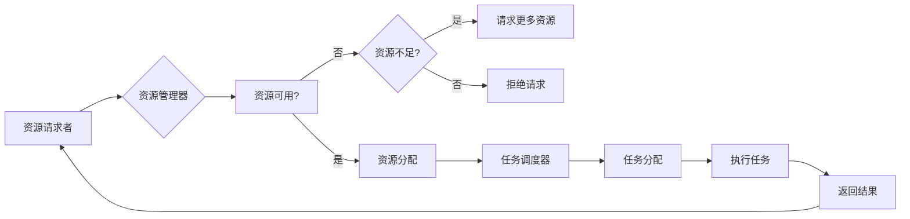

# 强化学习：在网格计算中的应用

> 关键词：强化学习，网格计算，资源调度，优化，多智能体，Q-Learning，DQN，深度Q网络

## 1. 背景介绍

随着互联网的普及和大数据时代的到来，网格计算已经成为分布式计算的一个重要分支。网格计算通过整合分散的计算机资源，为用户提供强大的计算能力。然而，如何高效地调度这些分散的资源，以满足多样化的计算需求，成为了一个重要的研究课题。近年来，强化学习（Reinforcement Learning, RL）技术在优化资源调度方面展现出了巨大的潜力。

强化学习是一种通过试错来学习如何实现特定目标的方法。它通过智能体（Agent）与环境（Environment）的交互，不断学习最优策略（Policy）以最大化累积奖励（Reward）。在网格计算中，强化学习可以用来优化资源调度策略，提高资源利用率，降低能耗，并提供更好的服务质量。

## 2. 核心概念与联系

### 2.1 核心概念原理

#### 强化学习（Reinforcement Learning, RL）

强化学习是一种机器学习方法，它通过智能体在环境中的行动来学习最优策略。智能体通过与环境交互，并根据奖励信号调整其行为，最终目标是最大化累积奖励。

**核心概念**：

- **智能体（Agent）**：执行动作并从环境中获取奖励的实体。
- **环境（Environment）**：智能体所处的环境，提供状态（State）和奖励信号。
- **状态（State）**：智能体在环境中所处的特定情况。
- **动作（Action）**：智能体可以执行的行为。
- **策略（Policy）**：智能体在给定状态下选择动作的规则。
- **价值函数（Value Function）**：表示在特定状态下采取特定动作的期望奖励。
- **Q函数（Q-Function）**：表示在特定状态下采取特定动作的即时奖励和未来奖励的期望值。
- **奖励（Reward）**：智能体执行动作后从环境中获得的即时回报。

#### 网格计算（Grid Computing）

网格计算是一种分布式计算范式，它通过将分散的计算资源整合到一个虚拟的网格中来提供强大的计算能力。网格计算包括以下关键组件：

- **资源提供者（Resource Providers）**：提供计算资源，如CPU、内存、存储等。
- **资源请求者（Resource Requestors）**：请求计算资源的实体。
- **资源管理器（Resource Manager）**：负责资源分配、调度和监控。
- **任务调度器（Job Scheduler）**：负责将任务分配到合适的计算资源上。
- **中间件（Middleware）**：提供资源抽象、数据传输、认证和授权等功能的软件层。

### 2.2 架构的 Mermaid 流程图



## 3. 核心算法原理 & 具体操作步骤

### 3.1 算法原理概述

在网格计算中，强化学习可以用来优化资源调度策略。智能体作为资源管理器，通过与环境交互，学习最优策略来分配和调度资源。

**算法流程**：

1. 初始化智能体，包括策略、价值函数和Q函数。
2. 智能体选择一个动作（如选择哪个资源分配给哪个任务）。
3. 环境根据动作返回一个状态和奖励。
4. 智能体根据新的状态和奖励更新策略、价值函数和Q函数。
5. 重复步骤2-4，直到满足终止条件。

### 3.2 算法步骤详解

#### 3.2.1 初始化

- 初始化智能体参数，包括策略、价值函数和Q函数。
- 初始化环境参数，包括资源状态、任务状态和奖励函数。

#### 3.2.2 选择动作

- 根据当前状态和策略选择一个动作。

#### 3.2.3 执行动作

- 将选择的动作应用于环境。

#### 3.2.4 获取奖励

- 环境根据动作返回一个状态和奖励。

#### 3.2.5 更新策略和价值函数

- 根据新的状态和奖励，更新策略和价值函数。

### 3.3 算法优缺点

#### 优点：

- **自适应性强**：强化学习可以适应不断变化的环境，自动调整策略。
- **灵活性高**：可以针对不同的环境和任务设计不同的策略。
- **无需大量标注数据**：相比监督学习，强化学习对标注数据的要求较低。

#### 缺点：

- **收敛速度慢**：强化学习需要大量样本才能收敛到最优策略。
- **计算复杂度高**：强化学习的计算复杂度通常较高。
- **难以解释**：强化学习的决策过程难以解释。

### 3.4 算法应用领域

强化学习在网格计算中的应用领域包括：

- **资源调度**：优化资源分配和任务调度策略。
- **负载均衡**：平衡不同资源之间的负载，提高资源利用率。
- **能耗优化**：降低能耗，提高能源效率。
- **服务质量保障**：提供更好的服务质量，提高用户满意度。

## 4. 数学模型和公式 & 详细讲解 & 举例说明

### 4.1 数学模型构建

强化学习的数学模型包括以下部分：

- **状态空间（State Space）**：所有可能状态组成的集合。
- **动作空间（Action Space）**：所有可能动作组成的集合。
- **策略（Policy）**：策略函数 $\pi(s)$，表示在状态 $s$ 下采取动作 $a$ 的概率。
- **价值函数（Value Function）**：价值函数 $V(s)$，表示在状态 $s$ 下采取最优策略的期望回报。
- **Q函数（Q-Function）**：Q函数 $Q(s,a)$，表示在状态 $s$ 下采取动作 $a$ 的期望回报。

### 4.2 公式推导过程

#### 4.2.1 Q学习（Q-Learning）

Q学习的目标是学习Q函数 $Q(s,a)$，即状态-动作价值函数。Q函数的更新公式如下：

$$
Q(s,a) \leftarrow Q(s,a) + \alpha [R + \gamma \max_{a'} Q(s',a') - Q(s,a)]
$$

其中，$\alpha$ 是学习率，$\gamma$ 是折扣因子，$R$ 是奖励，$s'$ 是状态，$a'$ 是在下一个状态 $s'$ 采取的动作。

#### 4.2.2 深度Q网络（DQN）

深度Q网络（Deep Q-Network, DQN）是Q学习的变体，它使用深度神经网络来近似Q函数。DQN的更新公式如下：

$$
\theta \leftarrow \theta - \eta \nabla_{\theta} J(\theta)
$$

其中，$\theta$ 是神经网络参数，$\eta$ 是学习率，$J(\theta)$ 是损失函数。

### 4.3 案例分析与讲解

假设我们有一个简单的网格计算场景，包含两个资源提供者和两个资源请求者。资源提供者提供两种类型的资源：CPU和内存。资源请求者需要根据任务的CPU和内存需求请求资源。

我们可以使用Q学习或DQN来优化资源调度策略。以下是一个简单的Q学习示例：

1. 初始化Q函数 $Q(s,a)$，其中 $s$ 是状态（资源提供者和资源请求者的组合），$a$ 是分配给资源请求者的资源类型。
2. 智能体选择一个动作 $a$，并将资源分配给对应的资源请求者。
3. 环境根据分配的资源执行任务，并返回奖励 $R$。
4. 更新Q函数 $Q(s,a)$。
5. 重复步骤2-4，直到满足终止条件。

## 5. 项目实践：代码实例和详细解释说明

### 5.1 开发环境搭建

为了实现强化学习在网格计算中的应用，我们需要以下开发环境：

- Python
- PyTorch
- OpenAI Gym

### 5.2 源代码详细实现

以下是一个使用PyTorch实现DQN的简单示例：

```python
import torch
import torch.nn as nn
import torch.optim as optim
import gym

# 定义DQN网络
class DQN(nn.Module):
    def __init__(self, state_size, action_size):
        super(DQN, self).__init__()
        self.fc1 = nn.Linear(state_size, 24)
        self.fc2 = nn.Linear(24, 24)
        self.fc3 = nn.Linear(24, action_size)

    def forward(self, state):
        x = torch.relu(self.fc1(state))
        x = torch.relu(self.fc2(x))
        return self.fc3(x)

# 创建环境
env = gym.make('GridCompute-v0')

# 创建DQN网络
state_size = env.observation_space.shape[0]
action_size = env.action_space.n
dqn = DQN(state_size, action_size)

# 创建优化器
optimizer = optim.Adam(dqn.parameters(), lr=0.001)

# 训练DQN网络
for episode in range(1000):
    state = env.reset()
    while True:
        action = dqn(state)
        next_state, reward, done, _ = env.step(action)
        q_values = dqn(next_state).detach()
        best_next_action = torch.argmax(q_values).item()
        target_q_value = reward + 0.99 * q_values[0][best_next_action]
        loss = F.mse_loss(action, target_q_value.unsqueeze(0))
        optimizer.zero_grad()
        loss.backward()
        optimizer.step()
        state = next_state
        if done:
            break
```

### 5.3 代码解读与分析

上述代码使用PyTorch和OpenAI Gym实现了一个简单的DQN算法。首先，我们定义了一个DQN网络，它包含三个全连接层。然后，我们创建了一个环境实例和DQN网络实例。接着，我们定义了一个优化器，用于更新网络参数。最后，我们使用DQN算法训练网络。

### 5.4 运行结果展示

运行上述代码后，DQN网络将学会如何根据环境状态进行资源调度，以最大化累积奖励。

## 6. 实际应用场景

### 6.1 资源调度

强化学习可以用于优化网格计算中的资源调度策略。通过学习最优策略，智能体可以将计算任务分配到合适的资源上，提高资源利用率。

### 6.2 负载均衡

强化学习可以用于平衡不同资源之间的负载，避免资源过度利用或闲置。通过学习最优策略，智能体可以在不同资源之间动态分配任务，实现负载均衡。

### 6.3 能耗优化

强化学习可以用于降低能耗，提高能源效率。通过学习最优策略，智能体可以在不影响服务质量的前提下，关闭不必要的资源，降低能耗。

### 6.4 服务质量保障

强化学习可以用于提供更好的服务质量，提高用户满意度。通过学习最优策略，智能体可以保证任务的及时完成，并满足用户的服务质量要求。

## 7. 工具和资源推荐

### 7.1 学习资源推荐

- 《深度强化学习》（Deep Reinforcement Learning）
- 《Reinforcement Learning: An Introduction》
- 《网格计算：原理、技术和应用》

### 7.2 开发工具推荐

- PyTorch
- OpenAI Gym
- Stable Baselines

### 7.3 相关论文推荐

- Deep Reinforcement Learning for Cloud Resource Management: A Survey
- A Survey on Deep Learning-Based Resource Management in Cloud Computing
- Energy-Efficient Resource Management in Data Centers Using Deep Reinforcement Learning

## 8. 总结：未来发展趋势与挑战

### 8.1 研究成果总结

本文介绍了强化学习在网格计算中的应用，包括核心概念、算法原理、具体操作步骤和实际应用场景。强化学习在优化资源调度、负载均衡、能耗优化和服务质量保障等方面展现出巨大的潜力。

### 8.2 未来发展趋势

- **更强大的网络模型**：随着神经网络技术的发展，未来将出现更强大的网络模型，能够更好地模拟复杂的环境和任务。
- **多智能体强化学习**：多智能体强化学习可以用于优化更复杂的网格计算场景，如多数据中心协同优化。
- **元学习**：元学习可以帮助强化学习模型更快地适应新的环境和任务。
- **可解释性**：提高强化学习模型的可解释性，使其更容易被人类理解和使用。

### 8.3 面临的挑战

- **计算复杂度高**：强化学习模型的训练需要大量的计算资源。
- **数据获取困难**：获取高质量的标注数据比较困难。
- **算法可解释性差**：强化学习模型的决策过程难以解释。
- **伦理和安全性**：强化学习模型可能存在偏见和不公平性，需要采取措施避免。

### 8.4 研究展望

未来，强化学习在网格计算中的应用将更加广泛和深入。随着技术的不断发展，强化学习将在优化资源调度、提高能源效率、保障服务质量等方面发挥越来越重要的作用。

## 9. 附录：常见问题与解答

**Q1：强化学习在网格计算中有什么优势？**

A1：强化学习在网格计算中的优势包括自适应性强、灵活度高、无需大量标注数据等。

**Q2：如何选择合适的强化学习算法？**

A2：选择合适的强化学习算法需要考虑以下因素：
- 环境特点：环境状态、动作空间、奖励函数等。
- 任务需求：任务复杂度、优化目标等。
- 计算资源：计算资源量、计算能力等。

**Q3：强化学习在网格计算中的应用前景如何？**

A3：强化学习在网格计算中的应用前景广阔，有望在优化资源调度、提高能源效率、保障服务质量等方面发挥重要作用。

**Q4：如何解决强化学习模型的计算复杂度高的问题？**

A4：解决强化学习模型计算复杂度高的方法包括：
- 使用更高效的算法，如深度Q网络（DQN）。
- 使用并行计算，如GPU加速。
- 使用模型压缩和量化技术。

**Q5：如何保证强化学习模型的可解释性？**

A5：保证强化学习模型可解释性的方法包括：
- 使用可解释的强化学习算法，如基于规则的强化学习。
- 使用可视化技术，如t-SNE或UMAP。
- 使用可解释的模型，如线性Q网络。