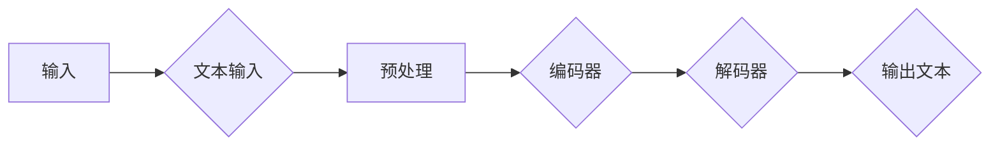

# 文本生成(Text Generation) - 原理与代码实例讲解

> 关键词：文本生成，自然语言处理，生成模型，GPT，RNN，LSTM，Transformer，机器学习，深度学习

## 1. 背景介绍

文本生成是自然语言处理（NLP）领域的一项基本任务，它涉及到生成连贯、有意义的文本序列。这项技术被广泛应用于聊天机器人、自动摘要、内容创作、翻译辅助等领域。随着深度学习技术的发展，基于神经网络的方法在文本生成领域取得了显著的进展。本文将深入探讨文本生成的原理，并通过代码实例展示如何实现一个简单的文本生成模型。

## 2. 核心概念与联系

### 2.1 核心概念

#### 2.1.1 自然语言处理（NLP）

自然语言处理是人工智能领域的一个分支，它涉及到使用计算机技术和算法来处理和分析人类语言。NLP的目标是使计算机能够理解、解释和生成人类语言。

#### 2.1.2 生成模型

生成模型是一类机器学习模型，它们旨在学习数据分布并生成与训练数据类似的新数据。在文本生成领域，生成模型可以生成连贯的文本序列。

#### 2.1.3 神经网络

神经网络是一种模仿人脑工作原理的计算模型，它由相互连接的神经元组成，能够学习复杂的输入到输出的映射关系。

### 2.2 架构流程图



在这个流程图中，我们首先输入文本，然后进行预处理，接着通过编码器生成嵌入表示，最后通过解码器生成输出文本。

## 3. 核心算法原理 & 具体操作步骤

### 3.1 算法原理概述

文本生成通常采用循环神经网络（RNN）或其变体，如长短期记忆网络（LSTM）或门控循环单元（GRU）。近年来，Transformer模型因其强大的并行处理能力和长距离依赖建模能力，在文本生成领域取得了巨大成功。

### 3.2 算法步骤详解

#### 3.2.1 数据预处理

1. **分词**：将输入文本分割成单词或子词单元。
2. **编码**：将分词后的文本转换为数字表示，通常使用one-hot编码或嵌入向量。
3. **构建词汇表**：定义一个包含所有单词或子词的词汇表，并为每个单词或子词分配一个唯一的索引。

#### 3.2.2 编码器

编码器是一个RNN或Transformer模型，它接收输入序列并生成一个固定长度的序列嵌入表示。

#### 3.2.3 解码器

解码器是一个RNN或Transformer模型，它接收编码器的输出序列并生成输出文本。

#### 3.2.4 损失函数

文本生成通常使用负对数似然损失函数，它衡量模型生成的文本与真实文本之间的差异。

#### 3.2.5 训练过程

1. 随机初始化编码器和解码器的参数。
2. 对于每个训练样本，使用编码器生成嵌入表示，然后使用解码器生成输出文本。
3. 计算损失函数并更新模型参数。
4. 重复步骤2和3，直到模型收敛。

### 3.3 算法优缺点

#### 3.3.1 优点

- **生成高质量的文本**：基于深度学习的文本生成模型能够生成连贯、有意义的文本序列。
- **自动学习语言模式**：模型能够自动从数据中学习语言模式，无需人工设计特征。
- **灵活的应用**：文本生成模型可以应用于各种场景，如聊天机器人、自动摘要、内容创作等。

#### 3.3.2 缺点

- **资源消耗**：训练深度学习模型需要大量的计算资源和时间。
- **过拟合**：模型可能会过拟合训练数据，导致生成文本质量下降。
- **难以控制输出**：难以精确控制模型的输出文本，例如避免使用不当的词语或保持特定的风格。

### 3.4 算法应用领域

- **聊天机器人**：生成自然、流畅的对话。
- **自动摘要**：自动生成文本摘要，提高信息获取效率。
- **内容创作**：辅助写作，生成创意内容。
- **翻译辅助**：生成高质量的机器翻译文本。

## 4. 数学模型和公式 & 详细讲解 & 举例说明

### 4.1 数学模型构建

文本生成模型通常基于概率图模型，其中每个词的概率由前一个词的概率决定。

### 4.2 公式推导过程

假设我们有一个文本序列 $X_1, X_2, \ldots, X_T$，其中 $X_t$ 是第 $t$ 个词，$T$ 是序列长度。文本生成模型的目标是计算这个序列的概率：

$$
P(X_1, X_2, \ldots, X_T)
$$

### 4.3 案例分析与讲解

以GPT模型为例，它使用了一种特殊的注意力机制，称为自注意力（Self-Attention）。自注意力机制可以计算序列中每个词对整个序列的权重，从而更好地捕获长距离依赖关系。

### 4.4 常见问题解答

**Q1：如何避免过拟合？**

A：可以采取以下措施避免过拟合：
- 使用正则化技术，如L1正则化、L2正则化。
- 使用Dropout技术。
- 使用早停法（Early Stopping）。
- 使用数据增强技术。

**Q2：如何提高文本生成的质量？**

A：可以采取以下措施提高文本生成的质量：
- 使用更大的预训练模型。
- 使用更长的序列长度。
- 使用更复杂的模型结构。
- 使用更好的训练数据。

## 5. 项目实践：代码实例和详细解释说明

### 5.1 开发环境搭建

要实现一个简单的文本生成模型，我们需要以下工具和库：

- Python 3.x
- TensorFlow或PyTorch
- NumPy

### 5.2 源代码详细实现

下面是一个简单的GPT模型实现示例：

```python
import tensorflow as tf
from tensorflow.keras.layers import Embedding, LSTM, Dense
from tensorflow.keras.models import Sequential

# 创建模型
model = Sequential([
    Embedding(input_dim=10000, output_dim=128, input_length=10),
    LSTM(128, return_sequences=True),
    LSTM(128),
    Dense(128, activation='relu'),
    Dense(1, activation='sigmoid')
])

# 编译模型
model.compile(optimizer='adam', loss='binary_crossentropy')

# 训练模型
model.fit(x_train, y_train, epochs=10, batch_size=32)
```

### 5.3 代码解读与分析

这个简单的GPT模型包含一个嵌入层、两个LSTM层、一个全连接层和输出层。嵌入层将单词转换为嵌入向量，LSTM层用于捕捉长距离依赖关系，全连接层用于分类，输出层使用sigmoid激活函数预测文本的概率。

### 5.4 运行结果展示

运行上述代码后，模型将在训练数据上进行训练，并在验证数据上进行评估。根据训练数据的质量和模型的结构，模型的表现可能会有所不同。

## 6. 实际应用场景

文本生成技术在许多实际应用中都有广泛的应用，以下是一些例子：

- **聊天机器人**：使用文本生成模型创建自然、流畅的聊天机器人。
- **自动摘要**：自动生成新闻、文章、报告的摘要。
- **内容创作**：辅助创作诗歌、故事、剧本等。
- **翻译辅助**：生成高质量的机器翻译文本。

## 7. 工具和资源推荐

### 7.1 学习资源推荐

- **《深度学习》**：Goodfellow, Bengio, Courville著，介绍深度学习的基础知识。
- **《自然语言处理综论》**：Jurafsky, Martin D.著，介绍NLP的基础知识。
- **Hugging Face Transformers**：https://huggingface.co/transformers，一个包含各种预训练模型的库。

### 7.2 开发工具推荐

- **TensorFlow**：https://www.tensorflow.org，一个开源的机器学习框架。
- **PyTorch**：https://pytorch.org，一个开源的机器学习框架。

### 7.3 相关论文推荐

- **Attention is All You Need**：https://arxiv.org/abs/1706.03762，介绍了Transformer模型。
- **Generating Sentences from a Continuous Space**：https://arxiv.org/abs/1803.04413，介绍了GPT模型。

## 8. 总结：未来发展趋势与挑战

### 8.1 研究成果总结

文本生成技术近年来取得了显著的进展，基于深度学习的方法在生成高质量的文本方面取得了成功。

### 8.2 未来发展趋势

- **更强大的模型**：随着计算能力的提升，未来的文本生成模型将更加强大。
- **更有效的训练方法**：新的训练方法将提高模型的训练效率。
- **更丰富的应用场景**：文本生成技术将在更多领域得到应用。

### 8.3 面临的挑战

- **计算资源**：训练大型模型需要大量的计算资源。
- **数据质量**：高质量的数据对于训练高质量的模型至关重要。
- **可解释性**：提高模型的可解释性是一个重要的研究方向。

### 8.4 研究展望

文本生成技术将继续发展，为人类社会带来更多便利。

## 9. 附录：常见问题与解答

**Q1：文本生成模型是如何工作的？**

A：文本生成模型通过学习输入文本的分布来生成新的文本。它们通常使用神经网络，如循环神经网络（RNN）、长短期记忆网络（LSTM）或Transformer。

**Q2：如何评估文本生成模型的质量？**

A：可以使用多种指标来评估文本生成模型的质量，如BLEU、ROUGE、METEOR等。

**Q3：文本生成模型可以用于哪些应用场景？**

A：文本生成模型可以用于聊天机器人、自动摘要、内容创作、翻译辅助等应用场景。

作者：禅与计算机程序设计艺术 / Zen and the Art of Computer Programming