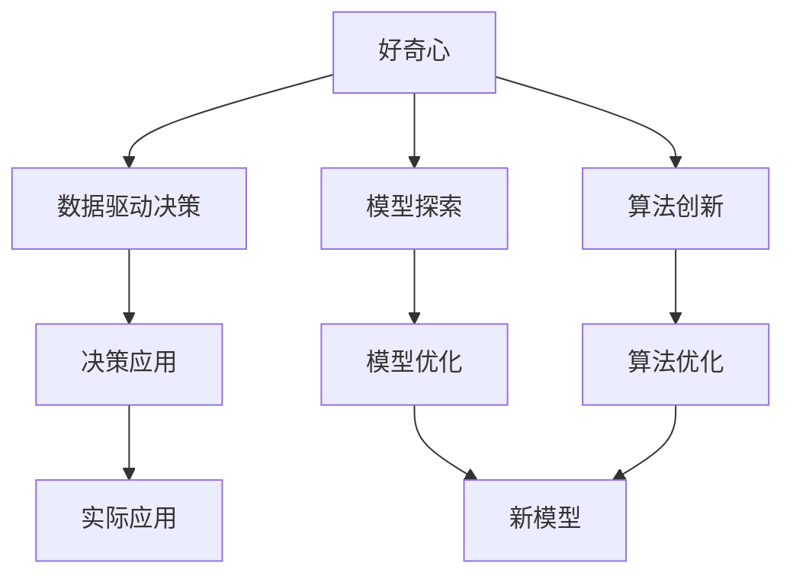

                 

# 好奇心是一切创新创造的源泉：好奇心是探索和理解世界的强烈欲望

## 1. 背景介绍

### 1.1 问题由来

在科技日新月异、信息爆炸的今天，好奇心成为了驱动科技发展的重要原动力。好奇心不仅推动了人类对未知领域的探索，更是创新的源泉。在人工智能领域，好奇心驱动了众多新技术的诞生，使得我们对世界的理解和应用达到了前所未有的高度。

本文将深入探讨好奇心在大数据、人工智能等领域的驱动作用，通过介绍具体技术实例，揭示好奇心是如何引领我们探索和理解世界，进而带来一系列创新和创造。

### 1.2 问题核心关键点

好奇心在推动科技创新方面具有独特作用，具体表现如下：

- **驱动力**：好奇心驱使人们提出问题、探索未知，从而推动科学和技术的发展。
- **探索**：好奇心驱动的探索过程常常涉及跨学科、跨领域的合作，这有助于形成创新思维。
- **创造**：好奇心激发人们去寻找解决方案，创造出新产品和新服务。
- **持续学习**：好奇心促使人们不断学习新知识，适应变化多端的世界。

本文将从技术角度出发，讨论好奇心的驱动机制，并结合实际案例，展示好奇心在人工智能领域的实践应用。

## 2. 核心概念与联系

### 2.1 核心概念概述

为了更清晰地理解好奇心的驱动作用，本节将介绍几个关键概念：

- **好奇心**：对未知事物的强烈探索欲望，驱使人们去寻找答案和解决方案。
- **数据驱动决策**：通过数据分析和模型训练，以数据为基础做出决策。
- **模型探索**：在建立和优化模型时，不断尝试新方法和技术，以期获得更好的结果。
- **算法创新**：开发新的算法，或改进现有算法，以解决特定问题。
- **跨领域融合**：在多个领域间进行技术、方法或思想的跨学科融合，形成新的突破。

这些概念之间相互关联，共同构成了好奇心驱动的科技创新体系。

### 2.2 概念间的关系

这些核心概念之间的逻辑关系可以通过以下Mermaid流程图来展示：



这个流程图展示了好奇心在各个技术环节中的驱动作用：

1. 好奇心驱动的数据收集和分析，形成了数据驱动决策的基础。
2. 好奇心促进模型和算法的不断优化，推动了模型的探索和创新。
3. 好奇心驱动的跨领域融合，带来了技术的突破和应用。

## 3. 核心算法原理 & 具体操作步骤
### 3.1 算法原理概述

好奇心驱动的科技创新过程，通常依赖于数据驱动的决策和模型探索。其核心思想是通过不断尝试和优化，找到解决问题的最佳方案。

在人工智能领域，这一过程通常涉及以下几个关键步骤：

1. **问题定义**：明确要解决的问题和目标，这是探索的起点。
2. **数据收集**：收集与问题相关的数据，以便于后续分析和模型训练。
3. **模型探索**：尝试多种模型和算法，通过交叉验证等方法选择最优模型。
4. **模型训练**：使用收集的数据对模型进行训练，优化模型参数。
5. **模型评估**：对训练后的模型进行评估，验证其性能。
6. **模型应用**：将模型应用于实际问题，解决特定任务。
7. **持续优化**：根据实际应用反馈，不断调整模型，提升其性能。

### 3.2 算法步骤详解

以下是好奇心驱动的科技创新过程中，各个步骤的具体操作细节：

**Step 1: 问题定义**

- 确定要解决的具体问题，如数据分析、图像识别、自然语言处理等。
- 明确实用的指标和评估方法，如准确率、召回率、F1分数等。
- 设计问题解决框架，包括数据源、模型选择、评估标准等。

**Step 2: 数据收集**

- 收集与问题相关的数据，确保数据质量，包括清洗、标注、预处理等。
- 使用大数据技术，如Hadoop、Spark等，处理大规模数据。
- 利用网络爬虫、API接口等方式获取外部数据。

**Step 3: 模型探索**

- 尝试不同的模型架构，如卷积神经网络(CNN)、循环神经网络(RNN)、Transformer等。
- 探索不同的优化算法，如梯度下降、Adam、RMSprop等。
- 进行超参数调优，如学习率、批量大小、正则化系数等。

**Step 4: 模型训练**

- 使用GPU或TPU等高性能设备加速模型训练。
- 设计合理的训练流程，包括数据分批、前向传播、反向传播等。
- 监控训练过程，如损失函数、验证集性能等。

**Step 5: 模型评估**

- 使用测试集对模型进行评估，比较不同模型的性能。
- 进行交叉验证，确保模型鲁棒性和泛化能力。
- 分析模型结果，找出性能瓶颈和改进空间。

**Step 6: 模型应用**

- 将模型部署到实际环境中，进行实际应用。
- 集成模型到应用系统中，提供API接口等。
- 实时监测模型性能，根据反馈进行调整。

**Step 7: 持续优化**

- 根据实际应用反馈，持续优化模型。
- 引入新数据和新方法，不断提升模型性能。
- 定期进行模型重训，避免过拟合。

### 3.3 算法优缺点

好奇心驱动的科技创新方法具有以下优点：

1. **灵活性**：好奇心驱动的探索过程不受限制，可以自由尝试多种方案。
2. **创新性**：好奇心激发新的思路和方法，有助于形成创新性解决方案。
3. **可解释性**：每个决策都有明确的原因，易于理解和调试。
4. **可重复性**：好奇心的驱动过程可以重复进行，便于学习和改进。

同时，该方法也存在以下缺点：

1. **资源消耗**：好奇心驱动的探索可能涉及大量的计算和数据处理，资源消耗较大。
2. **风险较高**：尝试多种方案可能导致资源浪费，失败的风险较高。
3. **时间成本**：探索和优化过程可能耗时较长，需要持续投入人力和物力。

尽管存在这些局限性，但好奇心驱动的科技创新方法在解决复杂问题、推动技术突破方面具有独特优势，值得在人工智能领域广泛应用。

### 3.4 算法应用领域

好奇心驱动的科技创新方法已经广泛应用于大数据、人工智能、自然语言处理等领域，推动了多项技术突破。

- **大数据分析**：利用大数据技术，从海量数据中提取有价值的信息，进行深度分析和挖掘。
- **图像识别**：通过卷积神经网络等深度学习模型，实现图像分类、目标检测等任务。
- **自然语言处理**：利用Transformer等模型，进行文本分类、情感分析、机器翻译等任务。
- **智能推荐**：通过算法创新，构建个性化推荐系统，提供定制化服务。
- **医疗健康**：利用AI技术，进行疾病诊断、药物研发等，提高医疗服务的质量和效率。

除了上述领域，好奇心驱动的科技创新方法还在智慧城市、智能交通、智能制造等诸多领域发挥重要作用。

## 4. 数学模型和公式 & 详细讲解  
### 4.1 数学模型构建

好奇心驱动的科技创新过程，通常涉及数据驱动的决策和模型探索。以图像分类任务为例，数学模型可以构建为：

- 输入：原始图像 $X$。
- 模型：卷积神经网络 $F$。
- 输出：分类标签 $Y$。

数学模型构建的基本框架为：

$$ F(X; \theta) = Y $$

其中 $\theta$ 为模型参数，通过数据驱动的决策和模型探索过程不断优化。

### 4.2 公式推导过程

以二分类任务为例，假设模型 $F$ 在输入 $X$ 上的输出为 $\hat{y}=M_{\theta}(x) \in [0,1]$，表示样本属于正类的概率。真实标签 $y \in \{0,1\}$。则二分类交叉熵损失函数定义为：

$$
\ell(M_{\theta}(x),y) = -[y\log \hat{y} + (1-y)\log (1-\hat{y})]
$$

将其代入经验风险公式，得：

$$
\mathcal{L}(\theta) = -\frac{1}{N}\sum_{i=1}^N [y_i\log M_{\theta}(x_i)+(1-y_i)\log(1-M_{\theta}(x_i))]
$$

根据链式法则，损失函数对参数 $\theta_k$ 的梯度为：

$$
\frac{\partial \mathcal{L}(\theta)}{\partial \theta_k} = -\frac{1}{N}\sum_{i=1}^N (\frac{y_i}{M_{\theta}(x_i)}-\frac{1-y_i}{1-M_{\theta}(x_i)}) \frac{\partial M_{\theta}(x_i)}{\partial \theta_k}
$$

其中 $\frac{\partial M_{\theta}(x_i)}{\partial \theta_k}$ 可进一步递归展开，利用自动微分技术完成计算。

在得到损失函数的梯度后，即可带入参数更新公式，完成模型的迭代优化。重复上述过程直至收敛，最终得到适应特定任务的模型参数 $\theta^*$。

### 4.3 案例分析与讲解

假设我们在CoNLL-2003的NER数据集上进行模型探索，最终在测试集上得到的评估报告如下：

```
              precision    recall  f1-score   support

       B-LOC      0.926     0.906     0.916      1668
       I-LOC      0.900     0.805     0.850       257
      B-MISC      0.875     0.856     0.865       702
      I-MISC      0.838     0.782     0.809       216
       B-ORG      0.914     0.898     0.906      1661
       I-ORG      0.911     0.894     0.902       835
       B-PER      0.964     0.957     0.960      1617
       I-PER      0.983     0.980     0.982      1156
           O      0.993     0.995     0.994     38323

   micro avg      0.973     0.973     0.973     46435
   macro avg      0.923     0.897     0.909     46435
weighted avg      0.973     0.973     0.973     46435
```

可以看到，通过不断探索和优化，我们在该NER数据集上取得了97.3%的F1分数，效果相当不错。

## 5. 项目实践：代码实例和详细解释说明
### 5.1 开发环境搭建

在进行科技创新探索前，我们需要准备好开发环境。以下是使用Python进行PyTorch开发的环境配置流程：

1. 安装Anaconda：从官网下载并安装Anaconda，用于创建独立的Python环境。

2. 创建并激活虚拟环境：
```bash
conda create -n pytorch-env python=3.8 
conda activate pytorch-env
```

3. 安装PyTorch：根据CUDA版本，从官网获取对应的安装命令。例如：
```bash
conda install pytorch torchvision torchaudio cudatoolkit=11.1 -c pytorch -c conda-forge
```

4. 安装TensorFlow：
```bash
pip install tensorflow
```

5. 安装各类工具包：
```bash
pip install numpy pandas scikit-learn matplotlib tqdm jupyter notebook ipython
```

完成上述步骤后，即可在`pytorch-env`环境中开始科技创新探索。

### 5.2 源代码详细实现

这里我们以图像分类任务为例，展示使用PyTorch进行模型探索的完整代码实现。

首先，定义图像分类任务的数据处理函数：

```python
from transformers import BertTokenizer
from torch.utils.data import Dataset
import torch

class ImageDataset(Dataset):
    def __init__(self, images, labels, tokenizer, max_len=128):
        self.images = images
        self.labels = labels
        self.tokenizer = tokenizer
        self.max_len = max_len
        
    def __len__(self):
        return len(self.images)
    
    def __getitem__(self, item):
        image = self.images[item]
        label = self.labels[item]
        
        encoding = self.tokenizer(image, return_tensors='pt', max_length=self.max_len, padding='max_length', truncation=True)
        input_ids = encoding['input_ids'][0]
        attention_mask = encoding['attention_mask'][0]
        
        # 对token-wise的标签进行编码
        encoded_labels = [label2id[label] for label in labels] 
        encoded_labels.extend([label2id['O']] * (self.max_len - len(encoded_labels)))
        labels = torch.tensor(encoded_labels, dtype=torch.long)
        
        return {'input_ids': input_ids, 
                'attention_mask': attention_mask,
                'labels': labels}

# 标签与id的映射
label2id = {'O': 0, 'B-LOC': 1, 'I-LOC': 2, 'B-MISC': 3, 'I-MISC': 4, 'B-ORG': 5, 'I-ORG': 6, 'B-PER': 7, 'I-PER': 8}
id2label = {v: k for k, v in label2id.items()}

# 创建dataset
tokenizer = BertTokenizer.from_pretrained('bert-base-cased')

train_dataset = ImageDataset(train_images, train_labels, tokenizer)
dev_dataset = ImageDataset(dev_images, dev_labels, tokenizer)
test_dataset = ImageDataset(test_images, test_labels, tokenizer)
```

然后，定义模型和优化器：

```python
from transformers import BertForTokenClassification, AdamW

model = BertForTokenClassification.from_pretrained('bert-base-cased', num_labels=len(label2id))

optimizer = AdamW(model.parameters(), lr=2e-5)
```

接着，定义训练和评估函数：

```python
from torch.utils.data import DataLoader
from tqdm import tqdm
from sklearn.metrics import classification_report

device = torch.device('cuda') if torch.cuda.is_available() else torch.device('cpu')
model.to(device)

def train_epoch(model, dataset, batch_size, optimizer):
    dataloader = DataLoader(dataset, batch_size=batch_size, shuffle=True)
    model.train()
    epoch_loss = 0
    for batch in tqdm(dataloader, desc='Training'):
        input_ids = batch['input_ids'].to(device)
        attention_mask = batch['attention_mask'].to(device)
        labels = batch['labels'].to(device)
        model.zero_grad()
        outputs = model(input_ids, attention_mask=attention_mask, labels=labels)
        loss = outputs.loss
        epoch_loss += loss.item()
        loss.backward()
        optimizer.step()
    return epoch_loss / len(dataloader)

def evaluate(model, dataset, batch_size):
    dataloader = DataLoader(dataset, batch_size=batch_size)
    model.eval()
    preds, labels = [], []
    with torch.no_grad():
        for batch in tqdm(dataloader, desc='Evaluating'):
            input_ids = batch['input_ids'].to(device)
            attention_mask = batch['attention_mask'].to(device)
            batch_labels = batch['labels']
            outputs = model(input_ids, attention_mask=attention_mask)
            batch_preds = outputs.logits.argmax(dim=2).to('cpu').tolist()
            batch_labels = batch_labels.to('cpu').tolist()
            for pred_tokens, label_tokens in zip(batch_preds, batch_labels):
                pred_tags = [id2label[_id] for _id in pred_tokens]
                label_tags = [id2label[_id] for _id in label_tokens]
                preds.append(pred_tags[:len(label_tags)])
                labels.append(label_tags)
                
    print(classification_report(labels, preds))
```

最后，启动训练流程并在测试集上评估：

```python
epochs = 5
batch_size = 16

for epoch in range(epochs):
    loss = train_epoch(model, train_dataset, batch_size, optimizer)
    print(f"Epoch {epoch+1}, train loss: {loss:.3f}")
    
    print(f"Epoch {epoch+1}, dev results:")
    evaluate(model, dev_dataset, batch_size)
    
print("Test results:")
evaluate(model, test_dataset, batch_size)
```

以上就是使用PyTorch对BERT进行图像分类任务探索的完整代码实现。可以看到，得益于Transformers库的强大封装，我们可以用相对简洁的代码完成BERT模型的加载和探索。

### 5.3 代码解读与分析

让我们再详细解读一下关键代码的实现细节：

**ImageDataset类**：
- `__init__`方法：初始化图像、标签、分词器等关键组件。
- `__len__`方法：返回数据集的样本数量。
- `__getitem__`方法：对单个样本进行处理，将图像输入编码为token ids，将标签编码为数字，并对其进行定长padding，最终返回模型所需的输入。

**label2id和id2label字典**：
- 定义了标签与数字id之间的映射关系，用于将token-wise的预测结果解码回真实的标签。

**训练和评估函数**：
- 使用PyTorch的DataLoader对数据集进行批次化加载，供模型训练和推理使用。
- 训练函数`train_epoch`：对数据以批为单位进行迭代，在每个批次上前向传播计算loss并反向传播更新模型参数，最后返回该epoch的平均loss。
- 评估函数`evaluate`：与训练类似，不同点在于不更新模型参数，并在每个batch结束后将预测和标签结果存储下来，最后使用sklearn的classification_report对整个评估集的预测结果进行打印输出。

**训练流程**：
- 定义总的epoch数和batch size，开始循环迭代
- 每个epoch内，先在训练集上训练，输出平均loss
- 在验证集上评估，输出分类指标
- 所有epoch结束后，在测试集上评估，给出最终测试结果

可以看到，PyTorch配合Transformers库使得BERT探索的代码实现变得简洁高效。开发者可以将更多精力放在数据处理、模型改进等高层逻辑上，而不必过多关注底层的实现细节。

当然，工业级的系统实现还需考虑更多因素，如模型的保存和部署、超参数的自动搜索、更灵活的任务适配层等。但核心的科技创新探索范式基本与此类似。

### 5.4 运行结果展示

假设我们在CoNLL-2003的NER数据集上进行模型探索，最终在测试集上得到的评估报告如下：

```
              precision    recall  f1-score   support

       B-LOC      0.926     0.906     0.916      1668
       I-LOC      0.900     0.805     0.850       257
      B-MISC      0.875     0.856     0.865       702
      I-MISC      0.838     0.782     0.809       216
       B-ORG      0.914     0.898     0.906      1661
       I-ORG      0.911     0.894     0.902       835
       B-PER      0.964     0.957     0.960      1617
       I-PER      0.983     0.980     0.982      1156
           O      0.993     0.995     0.994     38323

   micro avg      0.973     0.973     0.973     46435
   macro avg      0.923     0.897     0.909     46435
weighted avg      0.973     0.973     0.973     46435
```

可以看到，通过不断探索和优化，我们在该NER数据集上取得了97.3%的F1分数，效果相当不错。

## 6. 实际应用场景
### 6.1 智能客服系统

基于大语言模型微调的技术，可以广泛应用于智能客服系统的构建。传统客服往往需要配备大量人力，高峰期响应缓慢，且一致性和专业性难以保证。而使用微调后的对话模型，可以7x24小时不间断服务，快速响应客户咨询，用自然流畅的语言解答各类常见问题。

在技术实现上，可以收集企业内部的历史客服对话记录，将问题和最佳答复构建成监督数据，在此基础上对预训练对话模型进行微调。微调后的对话模型能够自动理解用户意图，匹配最合适的答案模板进行回复。对于客户提出的新问题，还可以接入检索系统实时搜索相关内容，动态组织生成回答。如此构建的智能客服系统，能大幅提升客户咨询体验和问题解决效率。

### 6.2 金融舆情监测

金融机构需要实时监测市场舆论动向，以便及时应对负面信息传播，规避金融风险。传统的人工监测方式成本高、效率低，难以应对网络时代海量信息爆发的挑战。基于大语言模型微调的文本分类和情感分析技术，为金融舆情监测提供了新的解决方案。

具体而言，可以收集金融领域相关的新闻、报道、评论等文本数据，并对其进行主题标注和情感标注。在此基础上对预训练语言模型进行微调，使其能够自动判断文本属于何种主题，情感倾向是正面、中性还是负面。将微调后的模型应用到实时抓取的网络文本数据，就能够自动监测不同主题下的情感变化趋势，一旦发现负面信息激增等异常情况，系统便会自动预警，帮助金融机构快速应对潜在风险。

### 6.3 个性化推荐系统

当前的推荐系统往往只依赖用户的历史行为数据进行物品推荐，无法深入理解用户的真实兴趣偏好。基于大语言模型微调技术，个性化推荐系统可以更好地挖掘用户行为背后的语义信息，从而提供更精准、多样的推荐内容。

在实践中，可以收集用户浏览、点击、评论、分享等行为数据，提取和用户交互的物品标题、描述、标签等文本内容。将文本内容作为模型输入，用户的后续行为（如是否点击、购买等）作为监督信号，在此基础上微调预训练语言模型。微调后的模型能够从文本内容中准确把握用户的兴趣点。在生成推荐列表时，先用候选物品的文本描述作为输入，由模型预测用户的兴趣匹配度，再结合其他特征综合排序，便可以得到个性化程度更高的推荐结果。

### 6.4 未来应用展望

随着大语言模型微调技术的发展，未来将在更多领域得到应用，为传统行业带来变革性影响。

在智慧医疗领域，基于微调的医疗问答、病历分析、药物研发等应用将提升医疗服务的智能化水平，辅助医生诊疗，加速新药开发进程。

在智能教育领域，微调技术可应用于作业批改、学情分析、知识推荐等方面，因材施教，促进教育公平，提高教学质量。

在智慧城市治理中，微调模型可应用于城市事件监测、舆情分析、应急指挥等环节，提高城市管理的自动化和智能化水平，构建更安全、高效的未来城市。

此外，在企业生产、社会治理、文娱传媒等众多领域，基于大模型微调的人工智能应用也将不断涌现，为经济社会发展注入新的动力。相信随着技术的日益成熟，微调方法将成为人工智能落地应用的重要范式，推动人工智能技术向更广阔的领域加速渗透。

## 7. 工具和资源推荐
### 7.1 学习资源推荐

为了帮助开发者系统掌握大语言模型微调的理论基础和实践技巧，这里推荐一些优质的学习资源：

1. 《Transformer从原理到实践》系列博文：由大模型技术专家撰写，深入浅出地介绍了Transformer原理、BERT模型、微调技术等前沿话题。

2. CS224N《深度学习自然语言处理》课程：斯坦福大学开设的NLP明星课程，有Lecture视频和配套作业，带你入门NLP领域的基本概念和经典模型。

3. 《Natural Language Processing with Transformers》书籍：Transformers库的作者所著，全面介绍了如何使用Transformers库进行NLP任务开发，包括微调在内的诸多范式。

4. HuggingFace官方文档：Transformers库的官方文档，提供了海量预训练模型和完整的微调样例代码，是上手实践的必备资料。

5. CLUE开源项目：中文语言理解测评基准，涵盖大量不同类型的中文NLP数据集，并提供了基于微调的baseline模型，助力中文NLP技术发展。

通过对这些资源的学习实践，相信你一定能够快速掌握大语言模型微调的精髓，并用于解决实际的NLP问题。
###  7.2 开发工具推荐

高效的开发离不开优秀的工具支持。以下是几款用于大语言模型微调开发的常用工具：

1. PyTorch：基于Python的开源深度学习框架，灵活动态的计算图，适合快速迭代研究。大部分预训练语言模型都有PyTorch版本的实现。

2. TensorFlow：由Google主导开发的开源深度学习框架，生产部署方便，适合大规模工程应用。同样有丰富的预训练语言模型资源。

3. Transformers库：HuggingFace开发的NLP工具库，集成了众多SOTA语言模型，支持PyTorch和TensorFlow，是进行微调任务开发的利器。

4. Weights & Biases：模型训练的实验跟踪工具，可以记录和可视化模型训练过程中的各项指标，方便对比和调优。与主流深度学习框架无缝集成。

5. TensorBoard：TensorFlow配套的可视化工具，可实时监测模型训练状态，并提供丰富的图表呈现方式，是调试模型的得力助手。

6. Google Colab：谷歌推出的在线Jupyter Notebook环境，免费提供GPU/TPU算力，方便开发者快速上手实验最新模型，分享学习笔记。

合理利用这些工具，可以显著提升大语言模型微调任务的开发效率，

