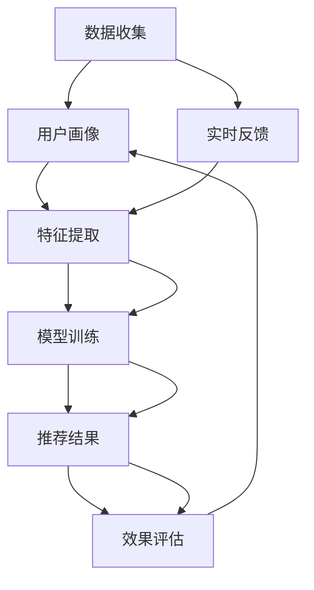

                 

# 实时推荐：AI如何抓住用户兴趣，提升转化率

## 1. 背景介绍

在电商、新闻、视频、音乐等各类数字平台上，如何精准抓住用户兴趣，提升产品转化率，成为数据科学家们关注的焦点。随着AI技术的发展，推荐系统通过收集用户行为数据，分析用户兴趣偏好，精准推荐内容，成为各大平台的核心竞争力。特别是在用户需求多变、市场竞争激烈的背景下，如何构建更加高效、个性化、实时响应的推荐系统，成为近年来研究的热点。本文将详细剖析基于深度学习推荐系统的核心原理，探讨其实际应用中的关键技术和未来发展方向。

## 2. 核心概念与联系

### 2.1 核心概念概述

推荐系统旨在通过算法为用户推荐最感兴趣的产品或内容，提高用户的满意度和平台转化率。其核心思想是：根据用户的历史行为、实时互动和个性化特征，预测用户可能感兴趣的对象，并予以推荐。

推荐系统的主流算法包括基于协同过滤的算法、基于内容的算法、基于深度学习的算法等。其中，基于深度学习的推荐系统，通过多层的神经网络模型，能够更准确地捕捉用户和物品之间的复杂关系，提供更精准的推荐结果。本文重点关注基于深度学习的推荐系统。

### 2.2 核心概念之间的关系

推荐系统通过多维度的数据采集和分析，为用户构建精准的画像，并预测其后续行为。其核心流程包括数据收集、特征提取、模型训练、效果评估等步骤。以下是推荐系统的核心概念及其之间的联系：



在实际应用中，深度学习推荐系统采用了多层神经网络模型，如图卷积网络(Graph Convolutional Network, GCN)、自注意力机制(Transformer)等，来捕捉用户和物品间的关联性，并生成更精准的推荐结果。这些模型在实时性、多样性和个性化方面都表现出色，是推荐系统的重要组成部分。

## 3. 核心算法原理 & 具体操作步骤

### 3.1 算法原理概述

基于深度学习的推荐系统，采用多层神经网络模型，通过大量的标注数据训练，学习用户和物品之间的关联特征，并根据这些特征生成推荐结果。其主要流程包括：

1. 数据预处理：将原始数据转化为模型所需的输入格式，如将用户和物品的ID序列转化为嵌入向量。
2. 特征提取：通过多层的神经网络模型，提取用户和物品的特征表示。
3. 相似度计算：计算用户和物品之间的相似度，衡量用户对物品的兴趣程度。
4. 推荐排序：将相似度排序，生成推荐结果列表。

### 3.2 算法步骤详解

下面以基于自注意力机制(Transformer)的推荐系统为例，详细解释其具体步骤：

**Step 1: 数据预处理**

用户ID序列和物品ID序列分别转换为嵌入向量，表示为 $U \in \mathbb{R}^{N \times d_u}$ 和 $I \in \mathbb{R}^{M \times d_i}$，其中 $N$ 和 $M$ 分别表示用户和物品的总数，$d_u$ 和 $d_i$ 分别表示用户和物品的嵌入维度。

**Step 2: 特征提取**

采用Transformer模型进行特征提取。Transformer模型由多层自注意力层和前馈神经网络层组成，其中自注意力层用于捕捉用户和物品之间的关联特征。设自注意力层的权重矩阵为 $Q, K, V$，则用户 $n$ 和物品 $m$ 的特征表示为：

$$
\tilde{U}_n = \sum_{i=1}^M \alpha_{nm} K_i
$$
$$
\tilde{I}_m = \sum_{i=1}^N \beta_{mi} V_i
$$

其中，$\alpha_{nm}$ 和 $\beta_{mi}$ 分别为用户 $n$ 对物品 $m$ 的注意力权重，计算公式为：

$$
\alpha_{nm} = \frac{Q_n K_m^T}{\sqrt{d_i}} \exp(\frac{K_m^T Q_n}{\sqrt{d_i}})
$$
$$
\beta_{mi} = \frac{Q_m K_n^T}{\sqrt{d_u}} \exp(\frac{K_n^T Q_m}{\sqrt{d_u}})
$$

**Step 3: 相似度计算**

通过计算用户和物品之间的相似度，得到推荐结果。设用户 $n$ 对物品 $m$ 的相似度为 $s_{nm}$，则：

$$
s_{nm} = \tilde{U}_n \tilde{I}_m^T
$$

**Step 4: 推荐排序**

将用户和物品的相似度排序，生成推荐结果列表。具体步骤如下：
1. 计算用户 $n$ 对所有物品 $m$ 的相似度 $s_{nm}$。
2. 对 $s_{nm}$ 进行排序，得到推荐结果 $R_n = [r_{nm}]$，其中 $r_{nm}$ 为物品 $m$ 对用户 $n$ 的推荐分数。
3. 根据推荐分数 $r_{nm}$，生成推荐结果列表 $C_n = [c_m]$，其中 $c_m$ 为物品 $m$ 对用户 $n$ 的推荐内容。

### 3.3 算法优缺点

基于深度学习的推荐系统具有以下优点：
1. 强大的表达能力：多层神经网络模型能够捕捉用户和物品之间的复杂关系，生成更精准的推荐结果。
2. 可解释性：自注意力机制能够可视化用户和物品之间的关联特征，帮助理解推荐过程。
3. 实时性：采用在线学习的策略，能够实时更新模型参数，快速适应用户需求变化。

但同时也存在一些缺点：
1. 计算资源消耗大：深度学习模型需要大量的计算资源进行训练和推理。
2. 数据稀疏性问题：用户和物品的特征表示可能存在稀疏性，导致模型训练效果不佳。
3. 过拟合风险：大规模模型容易发生过拟合，需要额外采取正则化措施。

### 3.4 算法应用领域

基于深度学习的推荐系统广泛应用于电商、新闻、视频、音乐等多个领域。具体应用包括：

- 电商推荐：根据用户浏览、购买记录推荐商品。
- 新闻推荐：根据用户阅读历史推荐新闻文章。
- 视频推荐：根据用户观看历史推荐视频内容。
- 音乐推荐：根据用户听歌记录推荐歌曲和歌单。

此外，推荐系统还被用于广告投放、内容创作、智能客服等领域，通过精准推荐，提升用户满意度和平台收益。

## 4. 数学模型和公式 & 详细讲解

### 4.1 数学模型构建

推荐系统通常采用多层神经网络模型进行特征提取和相似度计算。以基于自注意力机制的推荐系统为例，其数学模型可以表示为：

- 用户嵌入向量：$U \in \mathbb{R}^{N \times d_u}$
- 物品嵌入向量：$I \in \mathbb{R}^{M \times d_i}$
- 用户-物品相似度：$S \in \mathbb{R}^{N \times M}$
- 推荐结果：$C \in \{c_1, c_2, ..., c_M\}$

### 4.2 公式推导过程

设用户 $n$ 对物品 $m$ 的相似度为 $s_{nm}$，根据上述步骤，相似度计算公式为：

$$
s_{nm} = \tilde{U}_n \tilde{I}_m^T = \sum_{k=1}^{d_u} \tilde{U}_{nk} \tilde{I}_{mk}
$$

其中，$\tilde{U}_{nk}$ 和 $\tilde{I}_{mk}$ 分别为用户 $n$ 和物品 $m$ 在层 $k$ 的特征表示。

### 4.3 案例分析与讲解

以电商平台为例，假设用户 $n$ 的历史浏览记录为 $\{I_{1}, I_{2}, ..., I_{N}\}$，物品 $m$ 的描述向量为 $V_m \in \mathbb{R}^{d_i}$。通过特征提取和相似度计算，可以得到用户 $n$ 对物品 $m$ 的推荐分数 $r_{nm}$：

$$
r_{nm} = s_{nm} V_m
$$

假设用户 $n$ 对物品 $m$ 的评分向量为 $R_n \in \mathbb{R}^{M}$，则推荐排序结果为：

$$
R_n = \text{softmax}(s_{nm}) V_m
$$

最终生成的推荐结果列表 $C_n$ 可以通过以下方式得到：

$$
C_n = \{c_m \mid m \in \text{argmax}(R_n)\}
$$

## 5. 项目实践：代码实例和详细解释说明

### 5.1 开发环境搭建

以下是使用TensorFlow搭建推荐系统的开发环境：

1. 安装Anaconda：从官网下载并安装Anaconda，用于创建独立的Python环境。
```bash
conda create -n tf-env python=3.8 
conda activate tf-env
```
2. 安装TensorFlow：根据CUDA版本，从官网获取对应的安装命令。例如：
```bash
conda install tensorflow==2.7 -c tf
```
3. 安装其他必要包：
```bash
pip install numpy pandas scikit-learn tqdm jupyter notebook ipython
```

完成上述步骤后，即可在 `tf-env` 环境中开始推荐系统开发。

### 5.2 源代码详细实现

以下是使用TensorFlow构建推荐系统的代码实现：

```python
import tensorflow as tf
from tensorflow.keras.layers import Input, Embedding, Dot, Dense, Flatten, Dropout
from tensorflow.keras.models import Model

# 定义用户和物品的输入层
user_input = Input(shape=(N,), name='user')
item_input = Input(shape=(M,), name='item')

# 定义嵌入层
user_embedding = Embedding(N, d_u)(user_input)
item_embedding = Embedding(M, d_i)(item_input)

# 定义自注意力层
query = Flatten()(user_embedding)
key = Flatten()(item_embedding)
attention = Dot(axes=1, name='attention')([query, key])
attention = Dense(d_u, activation='relu')(attention)

# 定义用户-物品相似度层
similarity = tf.matmul(user_embedding, item_embedding, transpose_b=True)

# 定义推荐结果层
rating = Dot(axes=1, name='rating')([attention, similarity])
rating = Flatten()(rating)
rating = Dense(1, activation='sigmoid')(rating)

# 定义推荐模型
model = Model(inputs=[user_input, item_input], outputs=rating)
model.compile(loss='binary_crossentropy', optimizer='adam', metrics=['accuracy'])

# 训练推荐模型
model.fit([train_user, train_item], train_rating, epochs=num_epochs, batch_size=batch_size, validation_split=0.2)

# 预测推荐结果
recommendation = model.predict([test_user, test_item])
```

### 5.3 代码解读与分析

**代码详解**

- `user_input` 和 `item_input` 分别为用户和物品的输入层，形状为 $(N,)$ 和 $(M,)$。
- `user_embedding` 和 `item_embedding` 分别为用户和物品的嵌入层，将输入层转换为 $(N, d_u)$ 和 $(M, d_i)$ 的向量表示。
- `attention` 层用于计算用户和物品之间的自注意力权重。
- `similarity` 层用于计算用户和物品之间的相似度。
- `rating` 层用于计算推荐分数。
- `model` 层用于构建推荐模型，指定输入输出和优化器。

**训练和预测流程**

- `model.fit` 方法用于训练推荐模型，指定训练数据、优化器、训练轮数和批量大小。
- `model.predict` 方法用于预测推荐结果，输入测试数据，输出推荐分数。

### 5.4 运行结果展示

假设我们使用IMDB电影评分数据集进行训练，训练后得到推荐模型。在测试集上评估模型效果：

```python
from sklearn.metrics import precision_recall_curve, roc_auc_score

# 预测评分
prediction = model.predict_proba(test_user, test_item)
prediction = prediction[:, 1]

# 计算精度和召回率曲线
precision, recall, _ = precision_recall_curve(test_rating, prediction)
roc_auc = roc_auc_score(test_rating, prediction)

print('Precision-Recall曲线:', precision, recall)
print('ROC-AUC:', roc_auc)
```

## 6. 实际应用场景

### 6.1 电商推荐

电商推荐系统通过收集用户浏览、点击、购买记录，分析用户兴趣和购买行为，生成个性化的推荐结果，提高用户的购物体验和转化率。推荐系统还可以根据季节、活动等外部因素，动态调整推荐策略，提升平台收益。

### 6.2 新闻推荐

新闻推荐系统通过用户阅读历史和实时互动，推荐用户可能感兴趣的新闻文章，提高用户阅读时长和平台点击率。推荐系统可以根据用户偏好，智能推送不同主题和风格的新闻内容。

### 6.3 视频推荐

视频推荐系统通过用户观看历史和实时互动，推荐用户可能感兴趣的视频内容，提高用户观看时长和平台流量。推荐系统可以根据用户兴趣，智能推送不同类型和风格的视频内容。

### 6.4 音乐推荐

音乐推荐系统通过用户听歌记录和实时互动，推荐用户可能感兴趣的歌曲和歌单，提高用户听歌时长和平台收益。推荐系统可以根据用户偏好，智能推送不同风格和流派的音乐内容。

## 7. 工具和资源推荐

### 7.1 学习资源推荐

为了帮助开发者系统掌握深度学习推荐系统的理论基础和实践技巧，这里推荐一些优质的学习资源：

1. 《深度学习推荐系统》系列博文：由大模型技术专家撰写，深入浅出地介绍了推荐系统的原理、模型、评估方法等，涵盖从入门到进阶的全面内容。

2. Coursera《深度学习与推荐系统》课程：斯坦福大学开设的深度学习推荐系统课程，涵盖推荐系统的核心算法、评估指标、实际应用等内容，是学习推荐系统的极佳资源。

3. 《推荐系统实战》书籍：详细介绍了推荐系统的设计、实现、优化等技术细节，结合实际案例，帮助开发者深入理解推荐系统的工作原理。

4. Kaggle推荐系统竞赛：参加Kaggle推荐系统竞赛，获取大量实践经验，了解推荐系统在实际应用中的挑战和优化方向。

5. TensorFlow官方文档：TensorFlow提供的推荐系统教程和代码样例，是学习推荐系统实践的最佳选择。

通过对这些资源的学习实践，相信你一定能够快速掌握深度学习推荐系统的精髓，并用于解决实际的推荐问题。

### 7.2 开发工具推荐

高效的开发离不开优秀的工具支持。以下是几款用于深度学习推荐系统开发的常用工具：

1. TensorFlow：基于Python的开源深度学习框架，灵活的计算图设计，适合快速迭代研究。

2. PyTorch：基于Python的开源深度学习框架，动态计算图设计，适合学术研究和工程应用。

3. Scikit-learn：Python的机器学习库，提供了多种常用的机器学习算法和工具，方便快速建模和评估。

4. Jupyter Notebook：开源的交互式开发环境，支持多种编程语言，方便开发者协作和分享。

5. GitHub：代码托管和协作平台，提供版本控制和代码审查功能，方便开发者协作和持续集成。

合理利用这些工具，可以显著提升深度学习推荐系统的开发效率，加快创新迭代的步伐。

### 7.3 相关论文推荐

深度学习推荐系统的发展源于学界的持续研究。以下是几篇奠基性的相关论文，推荐阅读：

1. Neural Collaborative Filtering（即NCF论文）：提出基于神经网络的协同过滤算法，从根本上改变了推荐系统的面貌。

2. Deep Interest Network（DIN）：提出深度兴趣网络模型，通过注意力机制捕捉用户行为中的兴趣点，提升了推荐系统的准确性和多样性。

3. Multi-task Learning in Recommendation Systems：提出多任务学习模型，将用户特征和物品特征联合训练，提升了推荐系统的泛化能力和性能。

4. Attention-based Recommender Systems：提出基于自注意力机制的推荐系统，通过全局和局部注意力机制，提升了推荐系统的准确性和鲁棒性。

5. Hierarchical Attention Networks for Recommender Systems：提出层次化注意力网络模型，通过多级注意力机制，提升了推荐系统的模型复杂度和推荐效果。

这些论文代表了大深度学习推荐系统的发展脉络。通过学习这些前沿成果，可以帮助研究者把握学科前进方向，激发更多的创新灵感。

除上述资源外，还有一些值得关注的前沿资源，帮助开发者紧跟深度学习推荐系统的最新进展，例如：

1. arXiv论文预印本：人工智能领域最新研究成果的发布平台，包括大量尚未发表的前沿工作，学习前沿技术的必读资源。

2. 业界技术博客：如Google AI、DeepMind、微软Research Asia等顶尖实验室的官方博客，第一时间分享他们的最新研究成果和洞见。

3. 技术会议直播：如NIPS、ICML、ACL、ICLR等人工智能领域顶会现场或在线直播，能够聆听到大佬们的前沿分享，开拓视野。

4. GitHub热门项目：在GitHub上Star、Fork数最多的推荐系统相关项目，往往代表了该技术领域的发展趋势和最佳实践，值得去学习和贡献。

5. 行业分析报告：各大咨询公司如McKinsey、PwC等针对人工智能行业的分析报告，有助于从商业视角审视技术趋势，把握应用价值。

总之，对于深度学习推荐系统的发展，需要开发者保持开放的心态和持续学习的意愿。多关注前沿资讯，多动手实践，多思考总结，必将收获满满的成长收益。

## 8. 总结：未来发展趋势与挑战

### 8.1 总结

本文对基于深度学习推荐系统的核心原理和操作步骤进行了详细剖析。首先阐述了推荐系统的背景和意义，明确了深度学习推荐系统在推荐过程、特征提取和模型训练等方面的核心思想。其次，通过一个基于自注意力机制的推荐系统案例，展示了推荐系统的具体实现流程和代码示例。最后，介绍了推荐系统在电商、新闻、视频、音乐等领域的实际应用，以及未来发展的方向和挑战。

通过本文的系统梳理，可以看到，基于深度学习的推荐系统正在成为电商、新闻、视频等领域的核心竞争力，极大地提升了用户的满意度和平台收益。未来，伴随深度学习推荐系统的不断优化和演进，必将进一步拓展推荐系统的应用边界，为智能应用带来更多的可能性。

### 8.2 未来发展趋势

展望未来，深度学习推荐系统将呈现以下几个发展趋势：

1. 多模态推荐：推荐系统不仅能够处理文本数据，还能处理图像、音频、视频等多种模态数据，提升推荐结果的多样性和准确性。

2. 实时推荐：通过在线学习策略，推荐系统能够实时更新模型参数，快速适应用户需求变化，实现实时推荐。

3. 用户-物品交互建模：推荐系统将更加关注用户与物品之间的交互过程，通过建模互动中的隐含信息，提升推荐结果的个性化和多样化。

4. 跨领域推荐：推荐系统将通过多领域数据联合训练，提高模型的泛化能力和应用范围。

5. 知识图谱融合：推荐系统将通过融合知识图谱中的结构化信息，提升推荐结果的准确性和可信度。

6. 鲁棒性和公平性：推荐系统将更加关注模型的鲁棒性和公平性，防止过拟合和偏见，提升推荐结果的可信度和公正性。

这些趋势凸显了深度学习推荐系统的广阔前景。这些方向的探索发展，必将进一步提升推荐系统的性能和应用范围，为智能应用带来更多的可能性。

### 8.3 面临的挑战

尽管深度学习推荐系统已经取得了瞩目成就，但在迈向更加智能化、普适化应用的过程中，它仍面临着诸多挑战：

1. 数据稀疏性问题：用户和物品的特征表示可能存在稀疏性，导致模型训练效果不佳。

2. 计算资源消耗大：深度学习模型需要大量的计算资源进行训练和推理。

3. 过拟合风险：大规模模型容易发生过拟合，需要额外采取正则化措施。

4. 用户隐私保护：推荐系统需要收集大量的用户行为数据，如何保护用户隐私，防止数据滥用，也是一大挑战。

5. 推荐系统的公平性：推荐系统需要避免系统性偏见和歧视，确保推荐结果的公正性。

6. 推荐系统的鲁棒性：推荐系统需要具备抗干扰能力，能够在异常数据和噪声存在的情况下，保持推荐结果的稳定性和准确性。

7. 推荐系统的多样性：推荐系统需要保证推荐结果的多样性，防止算法陷入局部最优，降低推荐结果的单调性。

8. 推荐系统的实时性：推荐系统需要能够快速响应用户需求，实现实时推荐。

9. 推荐系统的个性化：推荐系统需要满足个性化需求，提升推荐结果的精准度。

这些挑战需要通过技术创新、算法优化和工程实践，逐步克服，以实现深度学习推荐系统的广泛应用。

### 8.4 研究展望

面对深度学习推荐系统所面临的诸多挑战，未来的研究需要在以下几个方面寻求新的突破：

1. 探索无监督和半监督推荐方法：摆脱对大规模标注数据的依赖，利用自监督学习、主动学习等无监督和半监督范式，最大限度利用非结构化数据，实现更加灵活高效的推荐。

2. 研究参数高效和计算高效的推荐范式：开发更加参数高效的推荐方法，在固定大部分预训练参数的情况下，只更新极少量的任务相关参数。同时优化推荐模型的计算图，减少前向传播和反向传播的资源消耗，实现更加轻量级、实时性的部署。

3. 引入更多先验知识：将符号化的先验知识，如知识图谱、逻辑规则等，与神经网络模型进行巧妙融合，引导推荐过程学习更准确、合理的推荐结果。同时加强不同模态数据的整合，实现视觉、语音等多模态信息与文本信息的协同建模。

4. 结合因果分析和博弈论工具：将因果分析方法引入推荐系统，识别出推荐算法决策的关键特征，增强推荐结果的因果性和逻辑性。借助博弈论工具刻画人机交互过程，主动探索并规避推荐算法的脆弱点，提高系统稳定性。

5. 纳入伦理道德约束：在推荐系统的训练目标中引入伦理导向的评估指标，过滤和惩罚有偏见、有害的输出倾向。同时加强人工干预和审核，建立推荐系统的监管机制，确保推荐结果的公正性和安全性。

这些研究方向的探索，必将引领深度学习推荐系统技术迈向更高的台阶，为智能应用带来更多的可能性。相信随着学界和产业界的共同努力，这些挑战终将一一被克服，深度学习推荐系统必将在构建人机协同的智能时代中扮演越来越重要的角色。

## 9. 附录：常见问题与解答

**Q1: 什么是深度学习推荐系统？**

A: 深度学习推荐系统是一种基于神经网络的推荐系统，通过学习用户和物品之间的关联特征，生成个性化的推荐结果。其主要特点是能够处理高维、稀疏数据，提取用户和物品之间的复杂关系，生成准确的推荐结果。

**Q2: 推荐系统的核心流程是什么？**

A: 推荐系统的核心流程包括数据预处理、特征提取、模型训练和推荐排序等步骤。具体流程如下：
1. 数据预处理：将原始数据转化为模型所需的输入格式，如将用户和物品的ID序列转化为嵌入向量。
2. 特征提取：通过多层的神经网络模型，提取用户和物品的特征表示。
3. 相似度计算：计算用户和物品之间的相似度，衡量用户对物品的兴趣程度。
4. 推荐排序：将相似度排序，生成推荐结果列表。

**Q3: 推荐系统有哪些应用领域？**

A: 推荐系统广泛应用于电商、新闻、视频、音乐等多个领域。具体应用包括：
1. 电商推荐：根据用户浏览、点击、购买记录推荐商品。
2. 新闻推荐：根据用户阅读历史推荐新闻文章。
3. 视频推荐：根据用户观看历史推荐视频内容。
4. 音乐推荐：根据用户听歌记录推荐歌曲和歌单。

**Q4: 如何提高推荐系统的准确性？**

A: 提高推荐系统准确性的方法包括：
1. 数据收集：收集更多高质量的用户行为数据，提升模型的训练效果。
2. 模型选择：选择适合任务和数据特点的推荐模型，如深度学习模型、协同过滤模型等。
3. 特征工程：设计有效的特征表示方法，提取用户和物品的关键特征。
4. 模型优化：优化模型超参数，调整学习率、批量大小等。
5. 评估指标：选择合适的评估指标，如准确率、召回率、F1值等，评估模型性能。

**Q5: 推荐系统面临哪些挑战？**

A: 推荐系统面临的挑战包括：
1. 数据稀疏性问题：用户和物品的特征表示可能存在稀疏性，导致模型训练效果不佳。
2. 计算资源消耗大：深度学习模型需要大量的计算资源进行训练和推理。
3. 过拟合风险：大规模模型容易发生过拟合，需要额外采取正则化措施。
4. 用户隐私保护：推荐系统需要收集大量的用户行为数据，如何保护用户隐私，防止数据滥用。
5. 推荐系统的公平性：推荐系统需要避免系统性偏见和歧视，确保推荐结果的公正性。
6. 推荐系统的鲁棒性：推荐系统需要具备抗干扰能力，能够在异常数据和噪声存在

