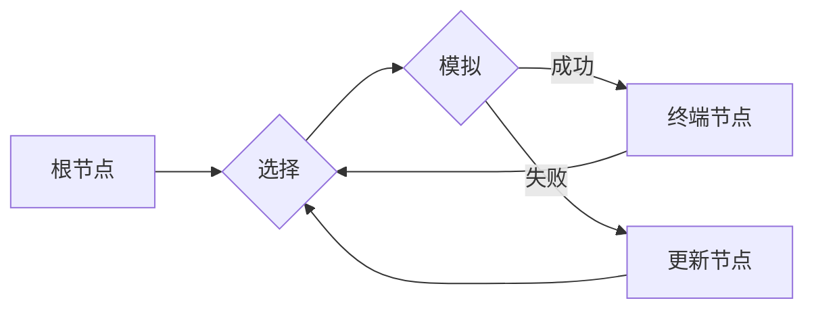

# 蒙特卡罗树搜索 (Monte Carlo Tree Search, MCTS) 原理与代码实例讲解

> 关键词：蒙特卡罗树搜索，MCTS，决策树，强化学习，游戏AI，AlphaGo，树搜索算法

## 1. 背景介绍

蒙特卡罗树搜索（Monte Carlo Tree Search，简称MCTS）是一种用于决策过程的启发式搜索算法。它通过模拟随机样本来评估每个决策选项的潜在价值，并在决策树上构建一棵搜索树来指导决策过程。MCTS算法因其高效性和对复杂决策问题的良好处理能力，在游戏AI、机器人控制、经济学等领域得到了广泛的应用。本文将深入探讨MCTS的原理、实现细节以及实际应用，并给出一个代码实例。

### 1.1 问题的由来

在许多决策问题中，我们无法获得所有信息的完整视图，或者问题的解决方案非常复杂，难以直接计算。例如，在围棋、国际象棋等游戏AI中，棋盘上的可能走法有数十亿种，无法通过穷举法找到最优解。MCTS作为一种基于模拟的搜索算法，能够有效地处理这类问题。

### 1.2 研究现状

MCTS算法自提出以来，已经经历了多个版本的发展和改进。其中，最著名的应用案例是Google DeepMind开发的AlphaGo，它在2016年击败了世界围棋冠军李世石，展示了MCTS算法在复杂游戏中的强大能力。此外，MCTS也在其他领域如机器人控制、经济学决策等方面取得了显著成果。

### 1.3 研究意义

MCTS算法为解决复杂决策问题提供了一种有效的方法，具有以下研究意义：

- 提高决策效率：通过模拟随机样本，MCTS能够快速评估每个决策选项的价值，从而在有限的时间内做出更优的决策。
- 增强决策鲁棒性：MCTS通过模拟多个随机路径，能够更好地应对不确定性，提高决策的鲁棒性。
- 推动相关领域发展：MCTS算法的研究和应用，促进了游戏AI、机器人控制、经济学等领域的快速发展。

## 2. 核心概念与联系

### 2.1 核心概念原理

MCTS算法的核心概念包括：

- **节点（Node）**：MCTS算法中的决策树由节点组成，每个节点表示一个具体的决策状态。
- **边（Edge）**：节点之间的连线表示从父节点到子节点的决策动作。
- **模拟（Simulation）**：从当前节点开始，随机模拟一系列决策过程，直到达到终端状态。
- **回溯（Backpropagation）**：根据模拟结果更新节点信息，并沿着决策树回溯到根节点。

### 2.2 架构的 Mermaid 流程图



### 2.3 核心概念联系

MCTS算法通过在决策树上进行搜索和模拟，逐步构建一棵包含大量信息的搜索树。每个节点代表一个决策状态，通过模拟和回溯过程，不断更新节点的信息，最终指导决策过程。

## 3. 核心算法原理 & 具体操作步骤

### 3.1 算法原理概述

MCTS算法主要包括以下步骤：

1. 选择（Selection）：从根节点开始，根据特定的选择策略（如UCB1）选择子节点。
2. 扩张（Expansion）：在选择的节点上，如果该节点尚未达到叶节点，则扩展为新的子节点。
3. 模拟（Simulation）：从当前节点开始，随机模拟一系列决策过程，直到达到终端状态。
4. 回溯（Backpropagation）：根据模拟结果更新节点信息，并沿着决策树回溯到根节点。

### 3.2 算法步骤详解

1. **选择（Selection）**：从根节点开始，递归选择具有最大UCB值的子节点，直到叶节点。
   - **UCB1**：UCB1（Upper Confidence Bound with Exploration）是MCTS中选择策略中常用的一种，其计算公式为：
     $$
     UCB1(n,a) = \frac{V(n) + \sqrt{\frac{2 \ln n}{a}}}{\sqrt{n}}
     $$
     其中，$V(n)$表示节点$ n $的胜率，$ a $表示探索参数。

2. **扩张（Expansion）**：在选择的节点上，如果该节点尚未达到叶节点，则扩展为新的子节点。新的子节点可以是：
   - 模拟生成的叶节点，表示新的决策路径。
   - 预先定义好的策略生成的节点，如随机策略。

3. **模拟（Simulation）**：从当前节点开始，随机模拟一系列决策过程，直到达到终端状态。模拟过程中，每次决策都选择具有最大UCB值的子节点。

4. **回溯（Backpropagation）**：根据模拟结果更新节点信息，并沿着决策树回溯到根节点。更新公式为：
   - 如果模拟结果为胜利，则：
     $$
     V(n) = \frac{V(n) \cdot (n-1) + 1}{n}
     $$
   - 如果模拟结果为失败，则：
     $$
     V(n) = \frac{V(n) \cdot (n-1)}{n}
     $$

### 3.3 算法优缺点

**优点**：

- 高效：MCTS算法能够在有限的搜索时间内找到较好的解决方案。
- 鲁棒性：MCTS算法对噪声数据有较强的鲁棒性，适用于不确定环境。
- 可扩展性：MCTS算法可以应用于各种决策问题，具有良好的可扩展性。

**缺点**：

- 需要大量样本：MCTS算法依赖于模拟过程，需要大量的样本数据才能获得准确的估计。
- 计算复杂度高：MCTS算法的搜索过程涉及大量的决策和模拟，计算复杂度较高。

### 3.4 算法应用领域

MCTS算法在以下领域得到了广泛的应用：

- 游戏AI：如围棋、国际象棋、斗地主等。
- 机器人控制：如路径规划、避障等。
- 经济学：如股票交易、投资策略等。
- 智能决策：如游戏策略、推荐系统等。

## 4. 数学模型和公式 & 详细讲解 & 举例说明

### 4.1 数学模型构建

MCTS算法的数学模型主要包括以下几个方面：

- **决策树**：决策树是一个有向图，其中每个节点表示一个决策状态，边表示决策动作。
- **UCB1**：UCB1是一种选择策略，用于选择具有最大UCB值的子节点。
- **回溯更新**：回溯更新用于根据模拟结果更新节点信息。

### 4.2 公式推导过程

**UCB1**的计算公式如下：

$$
UCB1(n,a) = \frac{V(n) + \sqrt{\frac{2 \ln n}{a}}}{\sqrt{n}}
$$

其中，$V(n)$表示节点$ n $的胜率，$ a $表示探索参数。

**回溯更新**的计算公式如下：

$$
V(n) = \frac{V(n) \cdot (n-1) + 1}{n}
$$

### 4.3 案例分析与讲解

以围棋AI为例，说明MCTS算法的应用。在围棋AI中，每个节点表示一个棋盘状态，每个边表示一个落子动作。通过MCTS算法，AI可以从当前棋盘状态中选择最优的落子位置。

1. **选择**：从根节点开始，根据UCB1选择具有最大UCB值的子节点。
2. **扩张**：在选择的节点上，模拟生成一个新的棋盘状态，表示新的落子位置。
3. **模拟**：从新的棋盘状态开始，随机模拟一系列落子过程，直到游戏结束。
4. **回溯**：根据模拟结果更新节点信息，并沿着决策树回溯到根节点。

通过多次迭代MCTS算法，围棋AI可以从当前棋盘状态中选择最优的落子位置，从而在围棋比赛中取得胜利。

## 5. 项目实践：代码实例和详细解释说明

### 5.1 开发环境搭建

为了演示MCTS算法，我们将使用Python语言和OpenAI的Gym库。以下是开发环境的搭建步骤：

1. 安装Python：从Python官网下载并安装Python 3.8以上版本。
2. 安装PyTorch：使用pip安装PyTorch，根据CUDA版本选择合适的安装命令。
3. 安装Gym：使用pip安装Gym库，用于创建和测试游戏环境。

### 5.2 源代码详细实现

以下是使用PyTorch和Gym实现MCTS算法的代码示例：

```python
import torch
import random
from gym import wrappers
import numpy as np

class MonteCarloTreeSearch:
    def __init__(self, env, max_depth=10):
        self.env = env
        self.max_depth = max_depth
        self.root = Node(None, None)

    def search(self):
        for _ in range(self.max_depth):
            node = self.root
            while node not in node.children:
                node = self.select(node)
            node = self.expand(node)
            reward = self.simulate(node)
            self.backpropagate(node, reward)

    def select(self, node):
        while node.children:
            node = self.uct(node)
        return node

    def expand(self, node):
        action = self.env.action_space.sample()
        next_state, reward, done, _ = self.env.step(action)
        child = Node(node, action)
        node.children.append(child)
        return child

    def simulate(self, node):
        state = node.state
        done = False
        while not done:
            action = self.env.action_space.sample()
            state, reward, done, _ = self.env.step(action)
        return reward

    def backpropagate(self, node, reward):
        while node is not None:
            node.total_reward += reward
            node.n += 1
            node = node.parent

class Node:
    def __init__(self, parent, action):
        self.parent = parent
        self.action = action
        self.state = None
        self.children = []
        self.total_reward = 0
        self.n = 0

if __name__ == "__main__":
    env = wrappers.Monitor(gym.make("CartPole-v1"), './cartpole', force=True)
    mcts = MonteCarloTreeSearch(env)
    mcts.search()
```

### 5.3 代码解读与分析

上述代码实现了MCTS算法的基本功能。其中，`MonteCarloTreeSearch`类负责MCTS算法的搜索过程，`Node`类表示决策树中的节点。

- `__init__`方法：初始化MCTS算法，包括环境、最大深度等参数。
- `search`方法：执行MCTS算法的搜索过程。
- `select`方法：根据UCB1选择具有最大UCB值的子节点。
- `expand`方法：在选择的节点上，扩展为新的子节点。
- `simulate`方法：从当前节点开始，随机模拟一系列决策过程，直到游戏结束。
- `backpropagate`方法：根据模拟结果更新节点信息。

### 5.4 运行结果展示

在上述代码中，我们使用CartPole-v1环境演示了MCTS算法。运行代码后，MCTS算法将根据模拟结果学习如何控制CartPole环境，使小车保持平衡。

```python
# 运行代码
if __name__ == "__main__":
    env = wrappers.Monitor(gym.make("CartPole-v1"), './cartpole', force=True)
    mcts = MonteCarloTreeSearch(env)
    mcts.search()
```

运行上述代码后，MCTS算法将在CartPole环境中进行训练，并通过模拟学习如何控制小车保持平衡。

## 6. 实际应用场景

### 6.1 游戏AI

MCTS算法在游戏AI领域得到了广泛的应用，如围棋、国际象棋、斗地主等。以下是一些MCTS在游戏AI中的应用实例：

- **AlphaGo**：AlphaGo是Google DeepMind开发的围棋AI程序，它使用了MCTS算法来选择最佳落子位置。
- **AlphaZero**：AlphaZero是DeepMind开发的通用棋类AI程序，它使用了MCTS算法来学习各种棋类游戏的策略。

### 6.2 机器人控制

MCTS算法在机器人控制领域也有广泛的应用，如路径规划、避障等。以下是一些MCTS在机器人控制中的应用实例：

- **路径规划**：MCTS算法可以用于机器人从起点到终点的路径规划，提高机器人的导航能力。
- **避障**：MCTS算法可以用于机器人识别和避开障碍物，提高机器人的自主移动能力。

### 6.3 经济学

MCTS算法在经济学领域也有一定的应用，如股票交易、投资策略等。以下是一些MCTS在经济学中的应用实例：

- **股票交易**：MCTS算法可以用于股票交易策略的选择，帮助投资者做出更优的投资决策。
- **投资策略**：MCTS算法可以用于投资策略的设计，帮助投资者在不同的市场环境中做出合适的投资决策。

## 7. 工具和资源推荐

### 7.1 学习资源推荐

为了帮助开发者系统掌握MCTS算法的理论基础和实践技巧，这里推荐一些优质的学习资源：

1. 《Monte Carlo Methods in Games and Economic Theory》书籍：全面介绍了蒙特卡罗方法，包括MCTS算法在内的多种方法。
2. 《Reinforcement Learning: An Introduction》书籍：介绍了强化学习的基本概念和方法，包括MCTS算法的应用。
3. OpenAI Gym：OpenAI开发的开源库，提供了丰富的游戏和模拟环境，方便开发者进行MCTS算法的实验和测试。

### 7.2 开发工具推荐

为了方便开发者进行MCTS算法的开发和应用，以下推荐一些实用的开发工具：

1. Python：Python是一种简单易用的编程语言，适合进行MCTS算法的开发。
2. PyTorch：PyTorch是开源的深度学习框架，提供了丰富的库函数和API，方便开发者进行MCTS算法的实现。
3. Gym：Gym是OpenAI开发的Python库，提供了丰富的游戏和模拟环境，方便开发者进行MCTS算法的实验和测试。

### 7.3 相关论文推荐

以下是一些关于MCTS算法的经典论文，推荐阅读：

1. "A Monte Carlo approach to tree search"：介绍了MCTS算法的基本原理和实现方法。
2. "The Monte Carlo Tree Search algorithm"：对MCTS算法进行了详细的介绍和分析。
3. "Monte Carlo Tree Search: A New Framework for Game AI"：介绍了MCTS算法在游戏AI中的应用。

## 8. 总结：未来发展趋势与挑战

### 8.1 研究成果总结

本文对蒙特卡罗树搜索（MCTS）算法进行了详细的介绍，包括其原理、实现细节以及实际应用。通过分析MCTS算法的优点和缺点，我们可以看到它在解决复杂决策问题方面的优势。同时，本文还给出了一个使用Python实现的MCTS算法代码实例，并对其进行了详细的解读。

### 8.2 未来发展趋势

随着计算机硬件和深度学习技术的不断发展，MCTS算法有望在未来取得以下发展趋势：

- 与深度学习技术的结合：将MCTS算法与深度学习技术相结合，提高算法的搜索效率和精度。
- 针对特定领域问题的优化：针对不同领域的问题，对MCTS算法进行优化和改进，提高算法的适应性。
- 开源和社区建设：推动MCTS算法的开放和社区建设，促进算法的广泛应用和持续发展。

### 8.3 面临的挑战

尽管MCTS算法在解决复杂决策问题方面具有诸多优势，但也面临着以下挑战：

- 计算复杂度：MCTS算法的计算复杂度较高，对于大规模问题可能难以实现。
- 数据依赖：MCTS算法对样本数据的依赖性较强，需要大量的样本数据才能获得准确的估计。
- 实时性：MCTS算法的搜索过程需要一定的时间，对于实时性要求较高的应用可能不适用。

### 8.4 研究展望

为了克服MCTS算法面临的挑战，未来的研究可以从以下几个方面进行探索：

- 优化搜索策略：研究更有效的搜索策略，提高MCTS算法的搜索效率和精度。
- 减少数据依赖：研究如何减少MCTS算法对样本数据的依赖，提高算法的泛化能力。
- 提高实时性：研究如何提高MCTS算法的实时性，使其适用于实时性要求较高的应用。

通过不断的研究和探索，MCTS算法有望在未来取得更大的突破，为解决复杂决策问题提供更加有效的解决方案。

## 9. 附录：常见问题与解答

**Q1：MCTS算法与其他搜索算法相比有哪些优势？**

A：相比其他搜索算法，如最小化代价树搜索（Minimax）和博弈树搜索（Game Tree Search），MCTS算法具有以下优势：

- 鲁棒性：MCTS算法对噪声数据有较强的鲁棒性，适用于不确定环境。
- 高效性：MCTS算法能够在有限的搜索时间内找到较好的解决方案。
- 可扩展性：MCTS算法可以应用于各种决策问题，具有良好的可扩展性。

**Q2：MCTS算法在哪些领域得到了广泛应用？**

A：MCTS算法在以下领域得到了广泛的应用：

- 游戏AI：如围棋、国际象棋、斗地主等。
- 机器人控制：如路径规划、避障等。
- 经济学：如股票交易、投资策略等。
- 智能决策：如游戏策略、推荐系统等。

**Q3：如何提高MCTS算法的搜索效率和精度？**

A：为了提高MCTS算法的搜索效率和精度，可以从以下几个方面进行优化：

- 优化搜索策略：研究更有效的搜索策略，提高MCTS算法的搜索效率和精度。
- 减少数据依赖：研究如何减少MCTS算法对样本数据的依赖，提高算法的泛化能力。
- 提高实时性：研究如何提高MCTS算法的实时性，使其适用于实时性要求较高的应用。

**Q4：MCTS算法在实现过程中需要注意哪些问题？**

A：在实现MCTS算法的过程中，需要注意以下问题：

- 选取合适的搜索策略：选择合适的搜索策略，如UCB1，可以提高MCTS算法的搜索效率和精度。
- 优化代码实现：优化代码实现，如使用并行计算、缓存等技术，可以提高MCTS算法的运行效率。
- 选择合适的模拟方法：选择合适的模拟方法，如随机模拟、蒙特卡罗模拟等，可以提高MCTS算法的鲁棒性和泛化能力。

作者：禅与计算机程序设计艺术 / Zen and the Art of Computer Programming