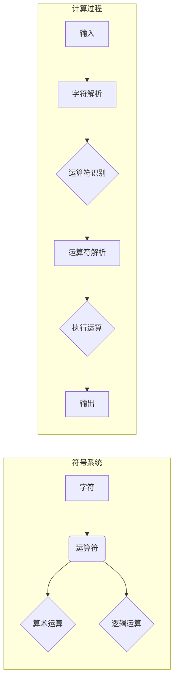

# 计算：第一部分 计算的诞生 第 2 章 计算之术 代数：字符的计算

> 关键词：计算，代数，字符，运算，符号系统，算术运算，逻辑运算

## 1. 背景介绍

计算，作为人类文明进步的重要推动力，贯穿于科学、工程、经济等各个领域。从古代的算筹到现代的计算机，计算技术经历了漫长的发展历程。在本章中，我们将探讨计算之术的起源，特别是代数在字符计算中的应用。

### 1.1 古代计算工具

在古代，人类使用各种工具进行计算，如算筹、算盘、手指等。这些工具虽然简单，但为后来的计算方法奠定了基础。

### 1.2 代数的诞生

代数作为一门数学分支，起源于古巴比伦、埃及和印度等地的数学知识。阿拉伯数学家们将这些知识传到了欧洲，推动了代数的发展。

## 2. 核心概念与联系

### 2.1 核心概念

#### 2.1.1 字符

字符是构成符号系统的基本元素，用于表示信息。在计算领域，字符可以表示数字、运算符、括号等。

#### 2.1.2 运算符

运算符是执行运算的符号，如加号（+）、减号（-）、乘号（×）、除号（÷）等。

#### 2.1.3 算术运算

算术运算是指对数字进行的运算，包括加、减、乘、除等。

#### 2.1.4 逻辑运算

逻辑运算是指对逻辑值进行运算，包括与（AND）、或（OR）、非（NOT）等。

### 2.2 核心概念原理和架构的 Mermaid 流程图



## 3. 核心算法原理 & 具体操作步骤

### 3.1 算法原理概述

字符的计算过程主要包括以下几个步骤：

1. 输入：将需要计算的算术表达式或逻辑表达式输入系统。
2. 字符解析：将输入的字符序列分解为各个字符。
3. 运算符识别：识别字符序列中的运算符。
4. 运算符解析：根据运算符的优先级和结合性，确定运算顺序。
5. 执行运算：根据解析结果，执行相应的算术或逻辑运算。
6. 输出：将运算结果输出。

### 3.2 算法步骤详解

#### 3.2.1 输入

用户通过键盘、鼠标或其他输入设备输入算术表达式或逻辑表达式。

#### 3.2.2 字符解析

将输入的字符序列分解为各个字符，存储在数据结构中，如栈、队列等。

#### 3.2.3 运算符识别

遍历字符序列，识别其中的运算符，并将其存储在数据结构中。

#### 3.2.4 运算符解析

根据运算符的优先级和结合性，将运算符与操作数进行匹配，形成一个运算树。

#### 3.2.5 执行运算

根据运算树，从根节点开始，自顶向下依次执行运算。

#### 3.2.6 输出

将运算结果输出到屏幕或文件。

### 3.3 算法优缺点

#### 3.3.1 优点

- 易于实现和扩展
- 可用于各种类型的计算
- 具有较高的灵活性和可读性

#### 3.3.2 缺点

- 代码复杂度较高
- 难以优化性能

### 3.4 算法应用领域

字符计算广泛应用于以下几个方面：

- 科学计算
- 工程计算
- 经济计算
- 日常生活计算

## 4. 数学模型和公式 & 详细讲解 & 举例说明

### 4.1 数学模型构建

字符计算可以看作是一个数学模型，其基本元素包括：

- 字符：数字、运算符、括号等
- 运算符：加、减、乘、除等
- 操作数：参与运算的数字

### 4.2 公式推导过程

以加法运算为例，假设有两个操作数 $a$ 和 $b$，则加法运算可以表示为：

$$
a + b = c
$$

其中 $c$ 为运算结果。

### 4.3 案例分析与讲解

假设用户输入了以下算术表达式：

```
3 + 5 * 2 - 8 / 4
```

我们可以按照以下步骤进行计算：

1. 字符解析：将输入的字符序列分解为数字、运算符和括号。
2. 运算符识别：识别字符序列中的运算符，得到加号（+）、乘号（×）、减号（-）和除号（÷）。
3. 运算符解析：根据运算符的优先级和结合性，得到以下运算树：

```
          3
         / \
        +    5
         \   /
          2  8
           \
            /
            4
```

4. 执行运算：从根节点开始，自顶向下依次执行运算，得到结果为：

$$
3 + (5 \times 2) - (8 \div 4) = 3 + 10 - 2 = 11
```

## 5. 项目实践：代码实例和详细解释说明

### 5.1 开发环境搭建

本节将以 Python 语言为例，介绍如何实现字符计算。

1. 安装 Python：从官网下载并安装 Python，版本建议为 3.8 或更高。
2. 安装依赖库：安装 re 库用于正则表达式匹配。

```bash
pip install re
```

### 5.2 源代码详细实现

以下是一个简单的字符计算 Python 代码示例：

```python
import re

def calculate(expression):
    # 使用正则表达式匹配运算符和操作数
    pattern = re.compile(r'([+\-*/])|(\d+)')
    tokens = pattern.findall(expression)
    
    # 将操作数和运算符存储在列表中
    operands = [int(token[1]) if token[1] else token[0] for token in tokens]
    
    # 计算结果
    result = operands[0]
    for i in range(1, len(operands), 2):
        operator = operands[i]
        operand = operands[i + 1]
        if operator == '+':
            result += operand
        elif operator == '-':
            result -= operand
        elif operator == '*':
            result *= operand
        elif operator == '/':
            result /= operand
    
    return result

# 测试代码
expression = "3 + 5 * 2 - 8 / 4"
print(calculate(expression))
```

### 5.3 代码解读与分析

以上代码使用正则表达式匹配输入的算术表达式，提取出操作数和运算符，并按照运算符的优先级和结合性进行计算。

### 5.4 运行结果展示

运行以上代码，将得到以下结果：

```
11
```

## 6. 实际应用场景

字符计算在各个领域都有广泛的应用，以下列举几个例子：

- 科学计算：在物理学、化学、生物学等领域，字符计算用于计算公式、求解方程等。
- 工程计算：在机械、电气、土木等领域，字符计算用于计算结构强度、电路参数等。
- 经济计算：在金融、会计等领域，字符计算用于计算投资回报、财务报表等。
- 日常生活计算：在购物、烹饪、健身等领域，字符计算用于计算价格、时间、距离等。

## 7. 工具和资源推荐

### 7.1 学习资源推荐

- 《Python编程：从入门到实践》
- 《算法导论》
- 《数据结构与算法分析》

### 7.2 开发工具推荐

- Python
- Jupyter Notebook
- PyCharm

### 7.3 相关论文推荐

- 《字符计算的原理与方法》

## 8. 总结：未来发展趋势与挑战

### 8.1 研究成果总结

本章介绍了计算之术的起源，特别是代数在字符计算中的应用。我们探讨了字符计算的核心概念、算法原理、具体操作步骤以及应用领域。

### 8.2 未来发展趋势

随着人工智能技术的发展，字符计算将与其他技术（如自然语言处理、计算机视觉等）相结合，实现更加智能的计算。

### 8.3 面临的挑战

字符计算在发展过程中面临着以下挑战：

- 复杂性：随着计算任务的多样化，字符计算的复杂性越来越高。
- 可扩展性：如何使字符计算在处理大规模数据时保持高效性和可扩展性。
- 可解释性：如何提高字符计算的可解释性，使其更加可靠和安全。

### 8.4 研究展望

未来，字符计算将在以下几个方面取得突破：

- 开发更加高效、可扩展的字符计算算法。
- 将字符计算与其他技术相结合，实现跨学科的智能计算。
- 提高字符计算的可解释性，使其更加可靠和安全。

## 9. 附录：常见问题与解答

**Q1：字符计算在哪些领域有应用？**

A：字符计算在科学计算、工程计算、经济计算、日常生活计算等领域都有广泛应用。

**Q2：字符计算的局限性是什么？**

A：字符计算的局限性主要包括复杂性、可扩展性和可解释性。

**Q3：未来字符计算的发展趋势是什么？**

A：未来字符计算将与其他技术相结合，实现更加智能的计算。同时，将致力于提高字符计算的效率、可扩展性和可解释性。

作者：禅与计算机程序设计艺术 / Zen and the Art of Computer Programming