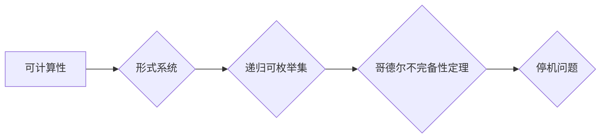

# 计算：第三部分 计算理论的形成 第 7 章 计算不能做什么：终结者哥德尔

> 关键词：哥德尔不完备性定理，可计算性，不可计算问题，形式系统，递归可枚举集，停机问题

## 1. 背景介绍

在计算理论的形成过程中，哥德尔的不完备性定理是一块里程碑式的成果。它揭示了形式系统在逻辑自洽性方面的根本限制，为计算理论的发展奠定了坚实的基础。本章将深入探讨哥德尔不完备性定理的内涵，以及它对计算能力的深远影响。

### 1.1 哥德尔及其工作

库尔特·哥德尔（Kurt Gödel）是一位奥地利的数学家和逻辑学家，他的工作对现代数学和逻辑学产生了深远的影响。哥德尔在20世纪20年代提出了两个震惊世界的定理：第一不完备性定理和第二不完备性定理。

### 1.2 不完备性定理的提出背景

在20世纪初，逻辑学家们试图将数学的基础建立在严格的逻辑体系之上。哥德尔的不完备性定理正是在这样的背景下提出的，它指出任何足够强大的形式系统都无法证明其自身的完全性。

## 2. 核心概念与联系

### 2.1 可计算性

可计算性是计算理论的核心概念，它指的是一个数学问题是否能够通过有限的步骤和有限的资源得到解答。可计算性理论是计算机科学和数学的基础，它帮助我们理解哪些问题是可解的，哪些问题是不可解的。

### 2.2 形式系统

形式系统是一个由符号、规则和公理组成的系统，用于表达和推理数学命题。哥德尔的不完备性定理是在形式系统的框架下提出的。

### 2.3 递归可枚举集

递归可枚举集是一类特定的集合，它的元素可以通过一个算法无限枚举。哥德尔的不完备性定理与递归可枚举集有关，因为它涉及到了一个形式系统能否证明其自身的命题。

### 2.4 停机问题

停机问题是计算理论中的一个经典问题，它询问一个给定的程序是否会在有限的时间内停止运行。哥德尔的不完备性定理与停机问题有关，因为它涉及到了一个形式系统能否证明所有有效的停机问题。

Mermaid流程图如下：

## 3. 核心算法原理 & 具体操作步骤

### 3.1 算法原理概述

哥德尔的不完备性定理分为两个部分：第一不完备性定理和第二不完备性定理。第一不完备性定理指出，任何足够强大的形式系统都无法证明其自身的完全性。第二不完备性定理进一步指出，任何足够强大的形式系统都无法证明其自身的可证明性。

### 3.2 算法步骤详解

哥德尔的不完备性定理的证明分为几个步骤：

1. 定义一个形式系统，包括符号、规则和公理。
2. 构建一个编码系统，将数学命题编码为形式系统中的符号。
3. 使用递归可枚举集的概念，构建一个证明的枚举。
4. 证明形式系统无法证明其自身的完全性。
5. 证明形式系统无法证明其自身的可证明性。

### 3.3 算法优缺点

哥德尔的不完备性定理的优点在于它揭示了形式系统在逻辑自洽性方面的根本限制，这是对数学和逻辑学的重要贡献。然而，该定理的证明过程复杂，需要深厚的数学背景知识。

### 3.4 算法应用领域

哥德尔的不完备性定理在数学、逻辑学和计算机科学等领域都有广泛的应用。它在数学基础、程序正确性证明、人工智能等领域都有重要的指导意义。

## 4. 数学模型和公式 & 详细讲解 & 举例说明

### 4.1 数学模型构建

哥德尔的不完备性定理的数学模型涉及到了形式系统、递归可枚举集和证明的概念。

### 4.2 公式推导过程

哥德尔的不完备性定理的证明涉及到复杂的数学推导，这里不详细展开。

### 4.3 案例分析与讲解

以下是一个简化的例子，展示了如何使用哥德尔的不完备性定理来证明一个形式系统无法证明其自身的完全性。

假设我们有一个形式系统 $F$，它包含以下符号和公理：

- 符号：$\rightarrow, \neg, \vdash, \top, \bot$
- 公理：$A \vdash A$, $\neg A \vdash \bot$
- 推理规则：Modus Ponens

现在我们想要证明 $F$ 无法证明其自身的完全性，即不存在一个公式 $P$ 使得 $F \vdash P$ 且 $F \vdash \neg P$。

我们可以构造一个公式 $G$，表示 "F无法证明G"。如果 $F \vdash G$，则根据 $G$ 的定义，$F$ 无法证明其自身的完全性，这与假设 $F \vdash G$ 相矛盾。因此，$F \not\vdash G$。

## 5. 项目实践：代码实例和详细解释说明

由于哥德尔的不完备性定理的证明涉及到复杂的数学推导，这里不提供具体的代码实例。

## 6. 实际应用场景

### 6.1 数学基础

哥德尔的不完备性定理为数学基础提供了重要的理论基础，帮助数学家们更好地理解数学的边界。

### 6.2 计算机科学

哥德尔的不完备性定理对计算机科学产生了深远的影响，它揭示了计算机能力的局限性，为计算机科学的进一步发展指明了方向。

## 7. 工具和资源推荐

### 7.1 学习资源推荐

- 《哥德尔、艾舍尔、巴赫：集异璧之大成》
- 《逻辑与数学基础》
- 《计算理论导论》

### 7.2 开发工具推荐

- MATLAB
- Python

### 7.3 相关论文推荐

- 《哥德尔的不完备性定理》
- 《形式系统与递归可枚举集》

## 8. 总结：未来发展趋势与挑战

### 8.1 研究成果总结

哥德尔的不完备性定理是计算理论的重要里程碑，它揭示了形式系统在逻辑自洽性方面的根本限制。

### 8.2 未来发展趋势

未来，对哥德尔的不完备性定理的研究将继续深入，进一步探索形式系统的边界和计算能力的极限。

### 8.3 面临的挑战

哥德尔的不完备性定理的证明过程复杂，需要深厚的数学背景知识，这是其面临的主要挑战。

### 8.4 研究展望

随着数学和计算理论的发展，哥德尔的不完备性定理将继续为数学和计算机科学提供重要的理论基础。

## 9. 附录：常见问题与解答

**Q1：哥德尔的不完备性定理是什么？**

A：哥德尔的不完备性定理指出，任何足够强大的形式系统都无法证明其自身的完全性。

**Q2：哥德尔的不完备性定理有什么意义？**

A：哥德尔的不完备性定理揭示了形式系统在逻辑自洽性方面的根本限制，对数学和计算理论的发展产生了深远的影响。

**Q3：哥德尔的不完备性定理的证明过程复杂吗？**

A：哥德尔的不完备性定理的证明过程非常复杂，需要深厚的数学背景知识。

**Q4：哥德尔的不完备性定理有什么应用？**

A：哥德尔的不完备性定理在数学、逻辑学和计算机科学等领域都有广泛的应用。

作者：禅与计算机程序设计艺术 / Zen and the Art of Computer Programming