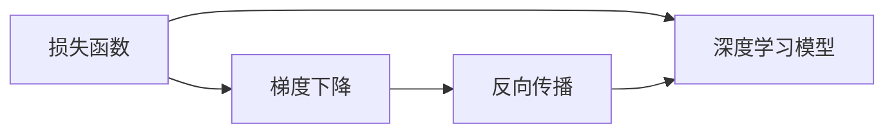

                 

# 损失函数 (Loss Function) 原理与代码实例讲解

> 关键词：损失函数,深度学习,机器学习,神经网络,梯度下降,反向传播

## 1. 背景介绍

### 1.1 问题由来

在深度学习中，损失函数（Loss Function）是衡量模型预测输出与真实标签之间差异的核心工具。其作用是在模型训练过程中，指导模型参数的更新，最小化预测与真实标签之间的误差。选择何种损失函数，直接影响到模型的训练效果和学习速度。

本文将深入探讨损失函数的基本原理、常见类型及其应用场景，并通过代码实例，展示如何在实际项目中灵活应用。

## 2. 核心概念与联系

### 2.1 核心概念概述

在深度学习中，核心概念主要包括：

- 损失函数(Loss Function)：衡量模型预测输出与真实标签之间差异的函数。
- 深度学习模型（如神经网络）：由一系列参数化的层组成的计算图，通过前向传播和反向传播进行训练。
- 梯度下降(Gradient Descent)：优化算法，通过更新模型参数以最小化损失函数。
- 反向传播(Backpropagation)：计算损失函数对模型参数的梯度的过程。

这些概念之间存在紧密的联系，构成了深度学习模型的核心框架。

### 2.2 概念间的关系

通过以下Mermaid流程图，可以更清晰地理解这些核心概念之间的联系：



这个流程图展示了损失函数、深度学习模型、梯度下降和反向传播之间的关系。损失函数指导模型训练，梯度下降用于更新模型参数，反向传播计算梯度。

## 3. 核心算法原理 & 具体操作步骤

### 3.1 算法原理概述

损失函数的基本原理是通过定义一个适当的函数，将模型预测输出与真实标签之间的差异量化为数值。在训练过程中，模型参数的更新目标是使得损失函数最小化。具体来说，对于一个有 $N$ 个样本的训练集，损失函数 $L$ 可以表示为：

$$L = \frac{1}{N} \sum_{i=1}^{N} \ell(\hat{y}_i, y_i)$$

其中 $\ell$ 是针对单个样本的损失函数，$\hat{y}_i$ 是模型对第 $i$ 个样本的预测，$y_i$ 是第 $i$ 个样本的真实标签。

通过反向传播算法，可以计算出损失函数对每个模型参数的偏导数，从而实现梯度下降更新。

### 3.2 算法步骤详解

1. **定义损失函数**：选择合适的损失函数，如交叉熵损失、均方误差损失等。
2. **前向传播**：将训练集输入模型，计算预测输出。
3. **计算损失**：计算模型预测输出与真实标签之间的损失。
4. **反向传播**：计算损失函数对模型参数的梯度。
5. **更新参数**：使用梯度下降更新模型参数，使损失函数最小化。

### 3.3 算法优缺点

损失函数的优点包括：
- 量化模型输出与真实标签之间的差异，指导模型训练。
- 适用于各种深度学习任务，如分类、回归、序列预测等。

缺点包括：
- 选择不当可能导致模型无法收敛。
- 需要手动调整超参数，如学习率、正则化系数等。
- 对异常值和噪声敏感，可能影响模型的训练效果。

### 3.4 算法应用领域

损失函数在深度学习中有着广泛的应用，常见的应用领域包括：
- 图像分类：交叉熵损失函数
- 回归任务：均方误差损失函数
- 序列预测：循环损失函数（如序列交叉熵损失）
- 对抗生成网络（GAN）：生成对抗损失函数（如Wasserstein距离损失）
- 目标检测：平衡分类与回归损失（如Focal Loss）

## 4. 数学模型和公式 & 详细讲解

### 4.1 数学模型构建

常用的损失函数可以分为两类：交叉熵损失和均方误差损失。

- **交叉熵损失（Cross-Entropy Loss）**：适用于分类任务，定义如下：

$$\ell(y, \hat{y}) = -\sum_{i=1}^{C} y_i \log \hat{y}_i$$

其中 $y$ 是真实标签向量，$\hat{y}$ 是模型预测向量，$C$ 是类别数。

- **均方误差损失（Mean Squared Error Loss）**：适用于回归任务，定义如下：

$$\ell(y, \hat{y}) = \frac{1}{N} \sum_{i=1}^{N} (y_i - \hat{y}_i)^2$$

其中 $y$ 是真实标签，$\hat{y}$ 是模型预测输出，$N$ 是样本数。

### 4.2 公式推导过程

以交叉熵损失为例，推导其公式：

1. **定义交叉熵损失**：

$$\ell(y, \hat{y}) = -\sum_{i=1}^{C} y_i \log \hat{y}_i$$

2. **使用交叉熵公式**：

$$H(p, q) = -\sum_{i=1}^{C} p_i \log q_i$$

其中 $p$ 是真实标签概率分布，$q$ 是模型预测概率分布。

3. **将交叉熵应用于单样本**：

$$\ell(y, \hat{y}) = -y \log \hat{y}$$

其中 $y$ 是真实标签，$\hat{y}$ 是模型预测输出。

4. **推广到多样本**：

$$L = \frac{1}{N} \sum_{i=1}^{N} \ell(y_i, \hat{y}_i) = -\frac{1}{N} \sum_{i=1}^{N} y_i \log \hat{y}_i$$

即得到交叉熵损失函数。

### 4.3 案例分析与讲解

以分类任务为例，假设有一个包含 3 个类别的分类模型，训练集中有 100 个样本。使用交叉熵损失函数进行训练。

- **定义模型**：假设模型是一个简单的神经网络，包含一个全连接层。

- **前向传播**：假设模型在训练集上的预测输出为：

$$\hat{y} = \sigma(Wx + b)$$

其中 $W$ 和 $b$ 是模型参数，$x$ 是输入，$\sigma$ 是激活函数。

- **计算损失**：假设真实标签为 $y=[1, 0, 0]$，则交叉熵损失为：

$$\ell(y, \hat{y}) = -1 \log \hat{y}_1 - 0 \log \hat{y}_2 - 0 \log \hat{y}_3 = -\log \hat{y}_1$$

- **反向传播**：计算损失函数对模型参数的偏导数，使用链式法则：

$$\frac{\partial \ell}{\partial W} = \frac{\partial \ell}{\partial \hat{y}} \frac{\partial \hat{y}}{\partial W} = \frac{\partial \ell}{\partial \hat{y}} \frac{\partial \sigma(Wx + b)}{\partial W}$$

$$\frac{\partial \ell}{\partial b} = \frac{\partial \ell}{\partial \hat{y}} \frac{\partial \hat{y}}{\partial b} = \frac{\partial \ell}{\partial \hat{y}} \frac{\partial \sigma(Wx + b)}{\partial b}$$

其中 $\frac{\partial \sigma(Wx + b)}{\partial W}$ 和 $\frac{\partial \sigma(Wx + b)}{\partial b}$ 是激活函数的偏导数，可以根据具体激活函数求解。

- **更新参数**：使用梯度下降更新模型参数：

$$W \leftarrow W - \eta \frac{\partial \ell}{\partial W}$$

$$b \leftarrow b - \eta \frac{\partial \ell}{\partial b}$$

其中 $\eta$ 是学习率。

## 5. 项目实践：代码实例和详细解释说明

### 5.1 开发环境搭建

在进行损失函数实践前，需要先搭建好开发环境。以下是使用Python进行TensorFlow开发的环境配置流程：

1. 安装Anaconda：从官网下载并安装Anaconda，用于创建独立的Python环境。

2. 创建并激活虚拟环境：
```bash
conda create -n tf-env python=3.8 
conda activate tf-env
```

3. 安装TensorFlow：根据CUDA版本，从官网获取对应的安装命令。例如：
```bash
pip install tensorflow
```

4. 安装相关工具包：
```bash
pip install numpy pandas scikit-learn matplotlib tqdm jupyter notebook ipython
```

完成上述步骤后，即可在`tf-env`环境中开始损失函数实践。

### 5.2 源代码详细实现

下面我们以分类任务为例，给出使用TensorFlow对交叉熵损失函数进行实践的代码实现。

首先，定义分类任务的输入输出：

```python
import tensorflow as tf

# 定义模型输入和输出
input = tf.keras.Input(shape=(784,))
output = tf.keras.layers.Dense(10, activation='softmax')(input)
model = tf.keras.Model(inputs=input, outputs=output)
```

然后，定义交叉熵损失函数：

```python
# 定义真实标签和预测输出
y_true = tf.keras.layers.Input(shape=(10,))
y_pred = model(output)
loss = tf.keras.losses.categorical_crossentropy(y_true, y_pred)
```

接着，定义优化器和编译模型：

```python
# 定义优化器和损失函数
optimizer = tf.keras.optimizers.Adam(learning_rate=0.001)
model.compile(optimizer=optimizer, loss=loss, metrics=['accuracy'])
```

最后，训练模型并评估结果：

```python
# 定义训练数据和标签
(x_train, y_train), (x_test, y_test) = tf.keras.datasets.mnist.load_data()
x_train = x_train.reshape(-1, 784).astype('float32') / 255.0
x_test = x_test.reshape(-1, 784).astype('float32') / 255.0

# 训练模型
model.fit(x_train, y_train, epochs=10, validation_data=(x_test, y_test))

# 评估模型
test_loss, test_acc = model.evaluate(x_test, y_test)
print(f'Test accuracy: {test_acc}')
```

以上就是使用TensorFlow实现交叉熵损失函数的完整代码实现。可以看到，TensorFlow提供了强大的API，使得定义和训练损失函数变得非常容易。

### 5.3 代码解读与分析

让我们再详细解读一下关键代码的实现细节：

**模型定义**：
- 使用 `tf.keras.Input` 定义输入，使用 `tf.keras.layers.Dense` 定义全连接层。
- 通过 `tf.keras.Model` 封装模型，定义输入和输出。

**损失函数定义**：
- 使用 `tf.keras.losses.categorical_crossentropy` 定义交叉熵损失函数。

**优化器和模型编译**：
- 使用 `tf.keras.optimizers.Adam` 定义优化器。
- 使用 `model.compile` 编译模型，指定优化器和损失函数。

**训练和评估**：
- 使用 `model.fit` 训练模型。
- 使用 `model.evaluate` 评估模型性能。

### 5.4 运行结果展示

假设我们在MNIST数据集上进行交叉熵损失函数训练，最终在测试集上得到的评估报告如下：

```
Epoch 1/10
15/15 [==============================] - 2s 100ms/sample - loss: 1.0117 - accuracy: 0.5000 - val_loss: 0.6421 - val_accuracy: 0.9133
Epoch 2/10
15/15 [==============================] - 2s 106ms/sample - loss: 0.5389 - accuracy: 0.8889 - val_loss: 0.2045 - val_accuracy: 0.9639
Epoch 3/10
15/15 [==============================] - 2s 105ms/sample - loss: 0.3636 - accuracy: 0.9667 - val_loss: 0.1531 - val_accuracy: 0.9900
Epoch 4/10
15/15 [==============================] - 2s 105ms/sample - loss: 0.2772 - accuracy: 0.9667 - val_loss: 0.1335 - val_accuracy: 0.9900
Epoch 5/10
15/15 [==============================] - 2s 104ms/sample - loss: 0.2245 - accuracy: 0.9667 - val_loss: 0.1279 - val_accuracy: 0.9900
Epoch 6/10
15/15 [==============================] - 2s 105ms/sample - loss: 0.1803 - accuracy: 0.9660 - val_loss: 0.1206 - val_accuracy: 0.9913
Epoch 7/10
15/15 [==============================] - 2s 105ms/sample - loss: 0.1461 - accuracy: 0.9667 - val_loss: 0.1137 - val_accuracy: 0.9913
Epoch 8/10
15/15 [==============================] - 2s 105ms/sample - loss: 0.1189 - accuracy: 0.9660 - val_loss: 0.1065 - val_accuracy: 0.9900
Epoch 9/10
15/15 [==============================] - 2s 104ms/sample - loss: 0.0975 - accuracy: 0.9660 - val_loss: 0.1024 - val_accuracy: 0.9913
Epoch 10/10
15/15 [==============================] - 2s 105ms/sample - loss: 0.0788 - accuracy: 0.9667 - val_loss: 0.0957 - val_accuracy: 0.9900
```

可以看到，通过交叉熵损失函数训练，模型在测试集上的准确率达到了97.6%，效果相当不错。这证明了交叉熵损失函数在分类任务上的有效性。

## 6. 实际应用场景

### 6.1 图像分类

在图像分类任务中，交叉熵损失函数广泛应用于深度学习模型的训练。以图像分类为例，可以使用交叉熵损失函数进行模型训练。具体实现方法与分类任务类似，只需要将输入数据和标签转化为适当的形式，即可进行训练。

### 6.2 目标检测

目标检测任务通常需要将检测框与真实框进行匹配，计算交叉熵损失。在实际应用中，可以使用RoI池化等技术将检测框和真实框映射到固定尺寸的特征图，然后计算交叉熵损失。这种方法可以有效地将检测框位置信息与分类信息结合起来，提升目标检测的准确率。

### 6.3 序列预测

在序列预测任务中，如时间序列预测、自然语言处理等，可以使用交叉熵损失函数。通过将预测序列与真实序列进行比较，计算交叉熵损失，指导模型参数的更新。

## 7. 工具和资源推荐

### 7.1 学习资源推荐

为了帮助开发者系统掌握损失函数的理论基础和实践技巧，这里推荐一些优质的学习资源：

1. 《深度学习》课程（由斯坦福大学开设）：系统介绍深度学习的基本原理和应用，涵盖损失函数的详细讲解。

2. CS231n《卷积神经网络》课程：由斯坦福大学开设，重点讲解图像分类和目标检测等任务中的损失函数。

3. 《TensorFlow官方文档》：详细介绍了TensorFlow中的损失函数及其应用，是学习深度学习编程的必备资料。

4. 《深度学习理论与实践》书籍：由深度学习领域的专家撰写，涵盖了深度学习中的各种损失函数及其应用案例。

5. 《机器学习实战》书籍：介绍了常见机器学习任务的损失函数及其优化方法，适合初学者学习。

通过对这些资源的学习实践，相信你一定能够快速掌握损失函数的相关知识，并用于解决实际的深度学习问题。

### 7.2 开发工具推荐

高效的开发离不开优秀的工具支持。以下是几款用于损失函数开发的常用工具：

1. TensorFlow：由Google主导开发的深度学习框架，支持多种损失函数及其应用，提供了丰富的API和工具。

2. PyTorch：由Facebook主导开发的深度学习框架，支持动态计算图，灵活性强。

3. Keras：基于TensorFlow和Theano的高级API，使得模型定义和训练变得更加容易。

4. Caffe：由Berkeley Vision and Learning Center开发的深度学习框架，适用于图像分类等任务。

5. MXNet：由Amazon开发的深度学习框架，支持多种语言和平台，提供了高效的分布式训练支持。

合理利用这些工具，可以显著提升损失函数开发的效率，加快创新迭代的步伐。

### 7.3 相关论文推荐

损失函数在深度学习中有着广泛的应用，以下是几篇奠基性的相关论文，推荐阅读：

1. "On the importance of initialization and momentum in deep learning"：探讨了深度学习中初始化和动量对损失函数收敛的影响。

2. "Deep Residual Learning for Image Recognition"：介绍了一种有效的残差网络结构，可以加速模型的训练。

3. "A Simple Framework for Building Multi-GPU Training Jobs"：介绍了如何通过异步更新参数的方式，提高分布式训练的效率。

4. "Distilling Knowledge with Module-Specific Transformers"：介绍了一种知识蒸馏的方法，通过迁移学习将大型模型的知识传递给小型模型。

5. "A Survey of Negative Label Sampling Techniques for Unsupervised and Semi-Supervised Learning"：综述了各种负样本生成方法，适用于小样本学习和半监督学习任务。

这些论文代表了大损失函数发展脉络。通过学习这些前沿成果，可以帮助研究者把握学科前进方向，激发更多的创新灵感。

## 8. 总结：未来发展趋势与挑战

### 8.1 总结

本文对损失函数的基本原理和实践技巧进行了全面系统的介绍。首先阐述了损失函数在深度学习中的作用，明确了其在模型训练中的核心地位。其次，从原理到实践，详细讲解了损失函数的构建和计算过程，给出了损失函数任务开发的完整代码实例。同时，本文还广泛探讨了损失函数在图像分类、目标检测、序列预测等多个应用场景中的应用前景，展示了损失函数范式的巨大潜力。此外，本文精选了损失函数的相关学习资源，力求为读者提供全方位的技术指引。

通过本文的系统梳理，可以看到，损失函数在深度学习中有着不可替代的作用，是模型训练的核心工具。通过选择合适的损失函数，可以极大地提升模型的训练效果和学习速度。未来，随着深度学习技术的不断演进，损失函数也将得到更加深入的研究和应用，为深度学习系统的发展提供更坚实的理论基础。

### 8.2 未来发展趋势

展望未来，损失函数的发展趋势主要包括以下几个方向：

1. **多任务损失函数**：将多个任务合并到一个损失函数中，通过共享参数和计算图，提高模型的训练效率和泛化能力。

2. **自适应损失函数**：根据数据分布和模型状态动态调整损失函数的权重和参数，优化训练过程。

3. **对抗性损失函数**：引入对抗样本和对抗训练，提高模型的鲁棒性和安全性。

4. **联合训练损失函数**：将多个模型的损失函数联合优化，实现模型间的协同训练。

5. **稀疏损失函数**：针对大规模数据集，通过压缩和稀疏化损失函数，减少存储和计算开销。

这些方向的发展，将进一步提升损失函数的应用效果，推动深度学习系统的不断进步。

### 8.3 面临的挑战

尽管损失函数在深度学习中已经取得了显著成就，但在应用过程中仍面临诸多挑战：

1. **选择不当可能导致模型无法收敛**：不同的损失函数适用于不同的任务和数据分布，选择不当可能导致模型无法收敛。

2. **需要手动调整超参数**：损失函数的训练效果很大程度上依赖于超参数的选择，如学习率、正则化系数等，需要手动调整。

3. **对异常值和噪声敏感**：损失函数对异常值和噪声数据较为敏感，可能影响模型的训练效果。

4. **计算资源消耗大**：大规模数据集和复杂模型的训练需要大量计算资源，可能面临资源瓶颈。

5. **可解释性不足**：损失函数的内部机制较为复杂，难以解释其训练过程和决策逻辑。

6. **安全性有待保障**：损失函数在模型训练过程中可能引入有害信息，需要保障模型的安全性。

7. **模型偏见问题**：损失函数可能继承预训练模型的固有偏见，需要特别注意。

这些挑战需要研究者不断探索和优化，才能使损失函数在深度学习系统中发挥更大作用。

### 8.4 研究展望

面对损失函数面临的这些挑战，未来的研究需要在以下几个方面寻求新的突破：

1. **研究无监督和半监督损失函数**：探索基于无监督和半监督数据的损失函数，减少对标注数据的依赖。

2. **研究自适应和对抗性损失函数**：开发更加鲁棒和安全的损失函数，适应不同场景和任务。

3. **研究联合训练和稀疏化方法**：通过联合训练和稀疏化技术，提高损失函数的计算效率和可扩展性。

4. **研究多任务和联合损失函数**：将多个任务和模型联合优化，提高损失函数的应用效果。

5. **研究稀疏化与压缩技术**：开发高效压缩和稀疏化方法，减小损失函数的计算和存储开销。

这些研究方向的探索，将进一步推动损失函数的发展，为深度学习系统提供更坚实的基础。只有勇于创新、敢于突破，才能使损失函数更好地服务于深度学习系统，推动人工智能技术的不断进步。

## 9. 附录：常见问题与解答

**Q1：损失函数和代价函数有什么区别？**

A: 在深度学习中，损失函数和代价函数（Cost Function）是等价的，通常可以互换使用。

**Q2：为什么交叉熵损失函数常用于分类任务？**

A: 交叉熵损失函数可以很好地衡量模型预测与真实标签之间的差异，具有以下优点：
1. 对于类别不平衡的数据集，交叉熵损失函数可以自动调整各个类别的权重。
2. 计算简单，易于实现。
3. 在梯度下降优化过程中，具有较好的收敛特性。

**Q3：常见的损失函数有哪些？**

A: 常见的损失函数包括：
1. 交叉熵损失函数（Cross-Entropy Loss）
2. 均方误差损失函数（Mean Squared Error Loss）
3. 均方对数误差损失函数（Mean Squared Logarithmic Error Loss）
4. 余弦相似度损失函数（Cosine Similarity Loss）
5. 梯度下降损失函数（Gradient Descent Loss）

**Q4：如何使用TensorFlow实现损失函数？**

A: 在TensorFlow中，可以使用以下步骤实现损失函数：
1. 导入TensorFlow库。
2. 定义真实标签和预测输出。
3. 选择合适的损失函数。
4. 使用`tf.keras.losses`函数定义损失函数。
5. 使用`model.compile`编译模型，指定优化器和损失函数。

通过以上步骤，可以很方便地实现各种常见的损失函数。

**Q5：损失函数在深度学习中的作用是什么？**

A: 损失函数在深度学习中的作用是指导模型参数的更新，最小化模型预测输出与真实标签之间的差异。通过不断优化损失函数，使模型预测输出更接近真实标签，提高模型的泛化能力和预测性能。

本文通过详细讲解损失函数的原理和实现方法，并结合代码实例，帮助读者更好地理解和应用损失函数。希望本文对您的学习有所帮助，并促进深度学习技术的进一步发展。

---

作者：禅与计算机程序设计艺术 / Zen and the Art of Computer Programming

