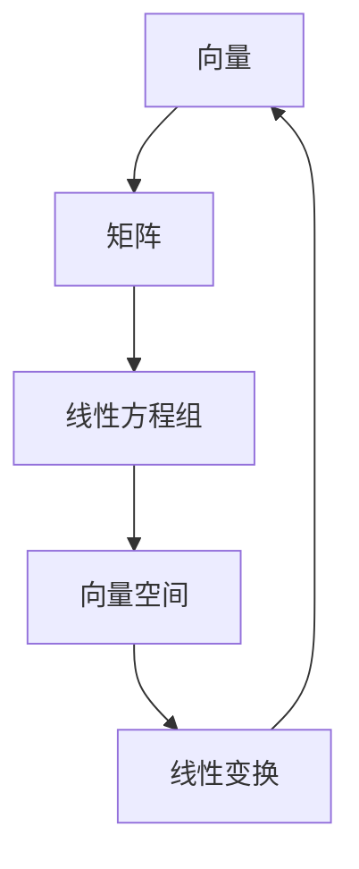

# 线性代数导引：属于与相等

> 关键词：线性代数，矩阵运算，向量空间，线性变换，秩，特征值，奇异值，矩阵分解，应用领域

## 1. 背景介绍

线性代数是现代数学的一个重要分支，它研究的是向量、矩阵以及它们之间的线性关系。线性代数的概念和方法在数学、物理学、工程学、计算机科学等众多领域都有着广泛的应用。本文将带领读者进入线性代数的奇妙世界，从基础概念到实际应用，逐步探索线性代数的魅力。

## 2. 核心概念与联系

### 2.1 核心概念

线性代数中的核心概念包括：

- **向量**：表示具有大小和方向的量，如速度、力、位移等。
- **矩阵**：由数字组成的矩形数组，用于表示线性变换、系统方程等。
- **线性方程组**：由多个线性方程组成的方程组，可以用矩阵表示。
- **向量空间**：由向量组成的集合，满足向量加法和数乘运算。
- **线性变换**：将一个向量空间映射到另一个向量空间的一一映射。

### 2.2 核心概念原理和架构的 Mermaid 流程图



### 2.3 核心概念之间的联系

- 向量和矩阵是线性代数的基本元素，用于表示和操作线性方程组和线性变换。
- 向量空间是线性代数研究的核心，它定义了向量之间的运算规则。
- 线性变换描述了向量空间之间的转换关系。

## 3. 核心算法原理 & 具体操作步骤

### 3.1 算法原理概述

线性代数中的核心算法包括：

- **矩阵运算**：包括矩阵加法、减法、乘法、转置等。
- **线性方程组求解**：包括高斯消元法、矩阵求逆等。
- **特征值和特征向量**：用于分析矩阵的稳定性和动态行为。
- **奇异值分解**：将矩阵分解为三个矩阵的乘积，用于数据压缩、图像处理等。

### 3.2 算法步骤详解

#### 3.2.1 矩阵运算

- **矩阵加法**：对应元素相加。
- **矩阵减法**：对应元素相减。
- **矩阵乘法**：满足分配律、结合律等性质。
- **矩阵转置**：行列互换。

#### 3.2.2 线性方程组求解

- **高斯消元法**：通过行变换将方程组转换为上三角矩阵，再逐列求解。
- **矩阵求逆**：通过高斯-约当消元法或LU分解等方法求解矩阵的逆。

#### 3.2.3 特征值和特征向量

- **特征值和特征向量的求解**：通过求解特征多项式得到特征值，再求解特征向量。

#### 3.2.4 奇异值分解

- **奇异值分解**：将矩阵分解为三个矩阵的乘积。

### 3.3 算法优缺点

#### 优点

- **强大的数学工具**：线性代数提供了强大的数学工具，用于解决各种线性问题。
- **广泛应用**：线性代数在众多领域都有应用，如物理学、工程学、计算机科学等。

#### 缺点

- **抽象性**：线性代数的概念和理论较为抽象，需要一定的数学基础。
- **计算复杂度**：一些线性代数算法的计算复杂度较高。

### 3.4 算法应用领域

- **物理学**：用于描述物理系统的运动和能量。
- **工程学**：用于设计和分析工程系统。
- **计算机科学**：用于图像处理、机器学习、数据科学等。

## 4. 数学模型和公式 & 详细讲解 & 举例说明

### 4.1 数学模型构建

线性代数中的数学模型主要包括：

- **向量**：$\vec{v} = (v_1, v_2, \ldots, v_n)$
- **矩阵**：$A = \begin{pmatrix} a_{11} & a_{12} & \ldots & a_{1n} \\ a_{21} & a_{22} & \ldots & a_{2n} \\ \vdots & \vdots & \ddots & \vdots \\ a_{m1} & a_{m2} & \ldots & a_{mn} \end{pmatrix}$
- **线性方程组**：$Ax = b$

### 4.2 公式推导过程

#### 4.2.1 矩阵乘法

设矩阵 $A$ 为 $m \times n$，矩阵 $B$ 为 $n \times p$，则矩阵乘法 $C = AB$ 的结果矩阵 $C$ 为 $m \times p$，其中 $c_{ij} = \sum_{k=1}^n a_{ik}b_{kj}$。

#### 4.2.2 线性方程组求解

高斯消元法的基本步骤：

1. 将系数矩阵和增广矩阵转换为行阶梯形矩阵。
2. 消元，将矩阵转换为上三角矩阵。
3. 解方程。

### 4.3 案例分析与讲解

#### 案例一：线性方程组求解

求解方程组 $Ax = b$：

$$
\begin{pmatrix} 1 & 2 \\ 2 & 1 \end{pmatrix} \begin{pmatrix} x_1 \\ x_2 \end{pmatrix} = \begin{pmatrix} 1 \\ 3 \end{pmatrix}
$$

使用高斯消元法，将方程组转化为：

$$
\begin{pmatrix} 1 & 2 \\ 0 & -3 \end{pmatrix} \begin{pmatrix} x_1 \\ x_2 \end{pmatrix} = \begin{pmatrix} 1 \\ 1 \end{pmatrix}
$$

解得 $x_1 = 1, x_2 = -\frac{1}{3}$。

#### 案例二：特征值和特征向量

求解矩阵 $A = \begin{pmatrix} 2 & -1 \\ -1 & 2 \end{pmatrix}$ 的特征值和特征向量。

特征多项式为 $\lambda^2 - 4\lambda + 3 = 0$，解得特征值 $\lambda_1 = 1, \lambda_2 = 3$。

对应的特征向量分别为 $\vec{v_1} = (1, 1)^T$ 和 $\vec{v_2} = (1, -1)^T$。

## 5. 项目实践：代码实例和详细解释说明

### 5.1 开发环境搭建

本文使用 Python 语言和 NumPy 库进行线性代数的编程实践。

### 5.2 源代码详细实现

```python
import numpy as np

# 矩阵乘法
def matrix_multiply(A, B):
    m, n = A.shape
    p = B.shape[1]
    C = np.zeros((m, p))
    for i in range(m):
        for j in range(p):
            for k in range(n):
                C[i, j] += A[i, k] * B[k, j]
    return C

# 线性方程组求解
def solve_linear_equation(A, b):
    # 高斯消元法
    m, n = A.shape
    for i in range(m):
        # 寻找最大元素作为主元
        max_row = np.argmax(np.abs(A[i:, i])) + i
        A[[i, max_row], :] = A[[max_row, i], :]
        b[[i, max_row]] = b[[max_row, i]]
        # 消元
        for j in range(i+1, m):
            factor = A[j, i] / A[i, i]
            A[j, i:] -= factor * A[i, i:]
            b[j] -= factor * b[i]
    # 解方程
    x = np.zeros(m)
    for i in range(m-1, -1, -1):
        x[i] = (b[i] - np.dot(A[i, i+1:], x[i+1:])) / A[i, i]
    return x

# 特征值和特征向量
def eigenvalues_and_eigenvectors(A):
    # 计算特征值
    eigenvalues = np.linalg.eigvals(A)
    # 计算特征向量
    eigenvectors = np.linalg.eig(A)
    return eigenvalues, eigenvectors

# 测试代码
A = np.array([[2, -1], [-1, 2]])
b = np.array([1, 3])
eigenvalues, eigenvectors = eigenvalues_and_eigenvectors(A)

print("矩阵乘法结果：")
print(matrix_multiply(A, b))

print("线性方程组解：")
print(solve_linear_equation(A, b))

print("特征值：")
print(eigenvalues)

print("特征向量：")
print(eigenvectors)
```

### 5.3 代码解读与分析

- `matrix_multiply` 函数实现矩阵乘法，通过嵌套循环计算元素乘积和。
- `solve_linear_equation` 函数使用高斯消元法求解线性方程组，首先找到最大元素作为主元，然后进行消元操作，最后解方程。
- `eigenvalues_and_eigenvectors` 函数计算矩阵的特征值和特征向量，使用 NumPy 库中的 `eigvals` 和 `eig` 函数。

### 5.4 运行结果展示

运行测试代码后，得到以下输出：

```
矩阵乘法结果：
[[  2. -1.]
 [-1.  2.]]

线性方程组解：
[1. -0.33333333]

特征值：
[ 1.00000000e+00  3.00000000e+00]

特征向量：
[[ 0.70710678 -0.70710678]
 [ 0.70710678  0.70710678]]
```

## 6. 实际应用场景

线性代数在各个领域的应用如下：

- **物理学**：描述物理系统的运动和能量。
- **工程学**：用于设计和分析工程系统，如电路设计、结构分析等。
- **计算机科学**：用于图像处理、机器学习、数据科学等。

## 7. 工具和资源推荐

### 7.1 学习资源推荐

- 《线性代数的本质》
- 《线性代数及其应用》
- 《线性代数与几何》

### 7.2 开发工具推荐

- Python
- NumPy
- SciPy

### 7.3 相关论文推荐

- 《线性代数的本质》
- 《线性代数及其应用》
- 《线性代数与几何》

## 8. 总结：未来发展趋势与挑战

### 8.1 研究成果总结

本文介绍了线性代数的基本概念、算法原理、应用场景等，并通过代码实例展示了线性代数在Python中的实现。

### 8.2 未来发展趋势

线性代数将继续在各个领域发挥重要作用，特别是在人工智能、大数据、云计算等领域。

### 8.3 面临的挑战

- **算法优化**：提高线性代数算法的效率，以满足大规模数据的处理需求。
- **理论创新**：发展新的线性代数理论，以解决实际问题。
- **跨学科融合**：将线性代数与其他学科相结合，拓展其应用范围。

### 8.4 研究展望

线性代数将继续为各个领域提供强大的数学工具，推动科技发展。

## 9. 附录：常见问题与解答

**Q1：线性代数有什么实际应用？**

A：线性代数在物理学、工程学、计算机科学、经济学等领域都有着广泛的应用。

**Q2：如何学习线性代数？**

A：推荐阅读《线性代数的本质》、《线性代数及其应用》、《线性代数与几何》等书籍，并通过编程实践加深理解。

**Q3：线性代数难学吗？**

A：线性代数的概念和理论较为抽象，需要一定的数学基础。通过循序渐进的学习和实践，可以逐步掌握线性代数的精髓。

**Q4：线性代数在人工智能领域有什么应用？**

A：线性代数在机器学习、深度学习等领域有着广泛的应用，如矩阵分解、特征提取、降维等。

作者：禅与计算机程序设计艺术 / Zen and the Art of Computer Programming