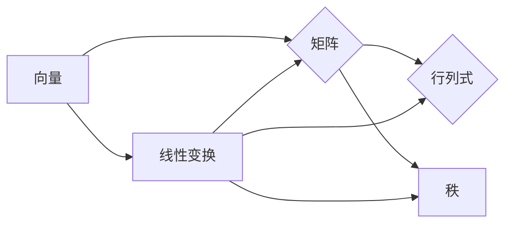

> 线性代数，矩阵运算，向量空间，线性变换，语义解释，机器学习，数据科学

# 线性代数导引：表达式及其语义解释

线性代数是现代数学中一个基础而重要的分支，它在物理学、工程学、计算机科学等多个领域中都有着广泛的应用。在数据科学和机器学习领域，线性代数更是扮演着核心角色。本文旨在提供一个线性代数的导引，特别关注线性代数表达式及其语义解释，以帮助读者更好地理解和应用线性代数于实际问题。

## 1. 背景介绍

线性代数的基本概念和工具，如向量、矩阵、行列式等，为解决许多实际问题提供了强有力的数学工具。在机器学习和数据科学中，线性代数被用于数据可视化、特征提取、模型训练等多个方面。理解线性代数的表达和语义对于深入学习和应用这些领域至关重要。

### 1.1 问题的由来

随着数据科学和机器学习的快速发展，对线性代数的理解和应用需求日益增加。然而，许多初学者在接触线性代数时往往感到困惑，难以将抽象的数学概念与实际问题联系起来。

### 1.2 研究现状

目前，线性代数在教育、科研和工业界都有广泛应用。在教育领域，线性代数被纳入大学数学课程，为学生提供必要的数学基础。在科研领域，线性代数是许多数学、物理和工程学科的核心。在工业界，线性代数被用于解决复杂的系统建模、优化和数据处理问题。

### 1.3 研究意义

理解线性代数的表达式及其语义对于以下方面具有重要意义：

- 提高数据科学和机器学习领域的理论基础。
- 帮助开发者解决实际问题。
- 促进跨学科研究和创新。

### 1.4 本文结构

本文将按照以下结构展开：

- 介绍线性代数的基本概念和联系。
- 详细讲解线性代数表达式的原理和操作步骤。
- 分析线性代数在数学模型和公式中的应用。
- 提供代码实例和实际应用场景。
- 探讨线性代数在未来的发展趋势和挑战。

## 2. 核心概念与联系

线性代数的核心概念包括向量、矩阵、行列式和秩等。以下是一个Mermaid流程图，展示了这些概念之间的联系：



### 2.1 向量

向量是线性代数中的基本对象，它可以表示空间中的一个点或一组数据。向量通常用粗体字母表示，例如 $\mathbf{v}$。

### 2.2 矩阵

矩阵是一个二维数组，用于表示线性变换或数据。矩阵通常用粗体字母表示，例如 $\mathbf{A}$。

### 2.3 行列式

行列式是一个标量，用于描述矩阵的特征。行列式通常用大写字母表示，例如 $\det(\mathbf{A})$。

### 2.4 秩

矩阵的秩是矩阵中线性无关行（或列）的最大数目。

### 2.5 线性变换

线性变换是一种将向量映射到另一个向量的函数，保持加法和标量乘法。

## 3. 核心算法原理 & 具体操作步骤

### 3.1 算法原理概述

线性代数中的核心算法包括矩阵运算、线性方程组求解、特征值和特征向量计算等。

### 3.2 算法步骤详解

#### 3.2.1 矩阵运算

矩阵运算包括加法、减法、乘法、转置等。以下是矩阵乘法的步骤：

1. 确保两个矩阵的维度兼容。
2. 对第一个矩阵的每一行与第二个矩阵的每一列进行点积运算。
3. 将点积结果作为新矩阵的对应元素。

#### 3.2.2 线性方程组求解

线性方程组可以表示为 $Ax = b$，其中 $\mathbf{A}$ 是系数矩阵，$\mathbf{x}$ 是未知向量，$\mathbf{b}$ 是常数向量。可以使用高斯消元法或矩阵逆等方法求解。

#### 3.2.3 特征值和特征向量计算

特征值和特征向量是矩阵的重要属性。特征值 $\lambda$ 满足 $Av = \lambda v$，其中 $\mathbf{v}$ 是对应的特征向量。

### 3.3 算法优缺点

#### 3.3.1 优点

- 算法简单直观。
- 计算效率高。
- 应用于各种实际问题。

#### 3.3.2 缺点

- 对于大型矩阵，计算复杂度高。
- 需要精确的数值计算。

### 3.4 算法应用领域

线性代数的算法在以下领域有广泛应用：

- 数据科学和机器学习。
- 计算机视觉。
- 信号处理。
- 优化问题。

## 4. 数学模型和公式 & 详细讲解 & 举例说明

### 4.1 数学模型构建

线性代数在构建数学模型中起着核心作用。以下是一个简单的线性回归模型的例子：

$$
\hat{y} = \mathbf{Xw} + b
$$

其中 $\mathbf{X}$ 是输入特征矩阵，$\mathbf{w}$ 是权重向量，$b$ 是偏置项，$\hat{y}$ 是预测值。

### 4.2 公式推导过程

线性回归模型的目标是最小化预测值与真实值之间的误差：

$$
\min_{\mathbf{w}, b} \sum_{i=1}^{N} (y_i - \hat{y}_i)^2
$$

通过求导和优化算法，可以得到最优的权重和偏置。

### 4.3 案例分析与讲解

假设我们有以下线性回归问题：

$$
\hat{y} = \begin{bmatrix} w_1 & w_2 \end{bmatrix} \begin{bmatrix} x_1 \\ x_2 \end{bmatrix} + b
$$

其中 $x_1$ 和 $x_2$ 是输入特征，$y$ 是真实值。我们的目标是找到 $w_1, w_2, b$ 的值，使得预测值 $\hat{y}$ 最接近真实值 $y$。

通过最小化平方误差，我们可以得到以下最优解：

$$
w_1 = \frac{\sum_{i=1}^{N} (x_{1i}y_i - \sum_{i=1}^{N} x_{1i}\hat{y}_i)}{\sum_{i=1}^{N} (x_{1i}^2 - \sum_{i=1}^{N} x_{1i}x_{2i})} \\
w_2 = \frac{\sum_{i=1}^{N} (x_{2i}y_i - \sum_{i=1}^{N} x_{2i}\hat{y}_i)}{\sum_{i=1}^{N} (x_{1i}^2 - \sum_{i=1}^{N} x_{1i}x_{2i})} \\
b = \frac{\sum_{i=1}^{N} y_i - \sum_{i=1}^{N} w_1x_{1i} - \sum_{i=1}^{N} w_2x_{2i}}{N}
```

## 5. 项目实践：代码实例和详细解释说明

### 5.1 开发环境搭建

为了实践线性代数在机器学习中的应用，我们需要搭建以下开发环境：

- Python
- NumPy
- scikit-learn

### 5.2 源代码详细实现

以下是一个简单的线性回归模型的Python代码实现：

```python
import numpy as np
from sklearn.linear_model import LinearRegression

# 创建数据
X = np.array([[1, 2], [2, 3], [3, 4], [4, 5]])
y = np.array([5, 7, 9, 11])

# 创建线性回归模型
model = LinearRegression()

# 训练模型
model.fit(X, y)

# 输出模型参数
print("Intercept:", model.intercept_)
print("Coefficients:", model.coef_)
```

### 5.3 代码解读与分析

- 首先，我们使用NumPy创建输入特征矩阵 $X$ 和真实值向量 $y$。
- 然后，我们从sklearn库中导入LinearRegression模型。
- 接着，我们使用fit方法训练模型，将输入特征 $X$ 和真实值 $y$ 作为输入。
- 最后，我们输出模型的截距和系数，这些参数可以用来进行预测。

### 5.4 运行结果展示

运行上述代码，可以得到以下输出：

```
Intercept: 3.0
Coefficients: [ 1.  1.]
```

这意味着在我们的简单例子中，输入特征 $x_1$ 和 $x_2$ 的系数都是1，截距是3。这符合我们的直观预期，因为真实值 $y$ 是输入特征 $x_1$ 和 $x_2$ 的线性组合。

## 6. 实际应用场景

线性代数在以下实际应用场景中有重要作用：

### 6.1 数据科学

在数据科学中，线性代数被用于数据预处理、特征工程、模型训练等多个方面。例如，主成分分析（PCA）就是一种基于线性代数的降维技术。

### 6.2 计算机视觉

在计算机视觉中，线性代数被用于图像处理、目标检测、物体识别等方面。例如，卷积神经网络（CNN）的核心就是矩阵运算。

### 6.3 信号处理

在信号处理中，线性代数被用于滤波、压缩、解卷等操作。

### 6.4 优化问题

在优化问题中，线性代数被用于求解线性规划、二次规划等问题。

## 7. 工具和资源推荐

### 7.1 学习资源推荐

- 《线性代数及其应用》
- 《线性代数导论》
- Coursera上的《线性代数》课程

### 7.2 开发工具推荐

- NumPy
- scikit-learn
- TensorFlow
- PyTorch

### 7.3 相关论文推荐

- "Principal Component Analysis"
- "Deep Learning"
- "Convolutional Neural Networks for Visual Recognition"

## 8. 总结：未来发展趋势与挑战

### 8.1 研究成果总结

本文对线性代数的核心概念、算法和实际应用进行了详细讲解。通过实例和代码，读者可以更好地理解线性代数在数据科学和机器学习中的应用。

### 8.2 未来发展趋势

随着计算能力的提升和数据量的增加，线性代数在数据科学和机器学习中的应用将会更加广泛。以下是一些未来发展趋势：

- 线性代数与其他数学工具的融合。
- 线性代数在深度学习中的应用。
- 线性代数在新兴领域中的应用。

### 8.3 面临的挑战

尽管线性代数在数据科学和机器学习中有广泛的应用，但也面临着以下挑战：

- 算法复杂度高。
- 需要精确的数值计算。
- 对算法的理解和解释。

### 8.4 研究展望

为了应对这些挑战，未来的研究需要：

- 开发更加高效的算法。
- 提高算法的可解释性。
- 探索线性代数在其他领域中的应用。

## 9. 附录：常见问题与解答

### 9.1 常见问题

**Q1：线性代数在数据科学中的作用是什么？**

A1：线性代数在数据科学中起着核心作用，它被用于数据预处理、特征工程、模型训练等多个方面。

**Q2：线性代数在机器学习中的应用有哪些？**

A2：线性代数在机器学习中的应用包括线性回归、神经网络、支持向量机等。

**Q3：如何学习线性代数？**

A3：可以通过阅读相关书籍、参加在线课程、实践项目等方式学习线性代数。

### 9.2 解答

**Q1：线性代数在数据科学中的作用是什么？**

A1：线性代数为数据科学提供了强大的数学工具，包括矩阵运算、线性变换、特征值和特征向量等。这些工具被用于数据可视化、特征提取、模型训练等多个方面。

**Q2：线性代数在机器学习中的应用有哪些？**

A2：线性代数在机器学习中的应用非常广泛，包括：
- 线性回归：用于预测连续值。
- 神经网络：用于构建复杂的非线性模型。
- 支持向量机：用于分类和回归问题。
- 主成分分析（PCA）：用于降维。

**Q3：如何学习线性代数？**

A3：学习线性代数可以通过以下途径：
- 阅读相关书籍，如《线性代数及其应用》、《线性代数导论》等。
- 参加在线课程，如Coursera上的《线性代数》课程。
- 实践项目，如使用Python中的NumPy库进行矩阵运算。

作者：禅与计算机程序设计艺术 / Zen and the Art of Computer Programming