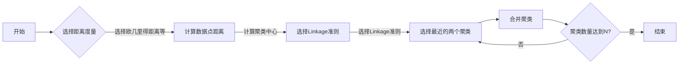

# 层次聚类(Hierarchical Clustering) - 原理与代码实例讲解

> 关键词：层次聚类，聚类分析，数据挖掘，图论，距离度量，动态规划，Linkage准则

## 1. 背景介绍

聚类分析是数据挖掘和机器学习中的一个基本任务，旨在将相似的数据点分组到一起，形成聚类。层次聚类（Hierarchical Clustering）是一种非参数聚类方法，它通过构建一个层次结构来对数据进行分组，这个层次结构被称为聚类树或 dendrogram。层次聚类方法因其直观和易于理解而受到许多研究人员和数据科学家的青睐。

### 1.1 问题的由来

随着大数据时代的到来，如何有效地对海量数据进行分组和分析成为了研究的热点。层次聚类作为一种古老的聚类方法，在数据可视化、基因表达分析、图像处理等领域有着广泛的应用。

### 1.2 研究现状

层次聚类方法主要包括两大类：自底向上的凝聚层次聚类（Agglomerative Hierarchical Clustering）和自顶向下的分裂层次聚类（Divisive Hierarchical Clustering）。自底向上的方法更为常见，因为它可以生成一个聚类树，使得数据的聚类过程可视化。

### 1.3 研究意义

层次聚类方法在以下方面具有研究意义：

- **直观性**：层次聚类生成的聚类树可以直观地展示聚类过程。
- **灵活性**：层次聚类不依赖于任何先验知识，适用于不同类型的数据。
- **适用性**：层次聚类可以处理任何形状的聚类结构。

### 1.4 本文结构

本文将按照以下结构展开：

- **第2章**：介绍层次聚类的核心概念与联系。
- **第3章**：详细阐述层次聚类的算法原理和具体操作步骤。
- **第4章**：讲解层次聚类的数学模型和公式，并提供案例分析与讲解。
- **第5章**：提供层次聚类的代码实例和详细解释说明。
- **第6章**：探讨层次聚类在实际应用场景中的运用。
- **第7章**：推荐层次聚类相关的学习资源、开发工具和参考文献。
- **第8章**：总结层次聚类的研究成果、未来发展趋势与挑战。
- **第9章**：提供常见问题与解答。

## 2. 核心概念与联系

### 2.1 核心概念

层次聚类涉及以下核心概念：

- **距离度量**：用于衡量数据点之间的相似度或距离，常见的距离度量包括欧几里得距离、曼哈顿距离、余弦相似度等。
- **Linkage准则**：定义了如何合并或分割聚类，常见的Linkage准则有最短距离法（Single Linkage）、最长距离法（Complete Linkage）、平均距离法（Average Linkage）、 Ward方法等。
- **聚类树**：也称为聚类图或dendrogram，展示了聚类过程中的合并和分割。

### 2.2 Mermaid 流程图

以下是层次聚类的Mermaid流程图：



### 2.3 关联

距离度量是计算数据点之间相似度的基础，Linkage准则决定了如何合并或分割聚类，聚类树则直观地展示了聚类过程。

## 3. 核心算法原理 & 具体操作步骤

### 3.1 算法原理概述

层次聚类算法可以分为自底向上的凝聚层次聚类和自顶向下的分裂层次聚类。本文以自底向上的凝聚层次聚类为例进行讲解。

### 3.2 算法步骤详解

1. **初始化**：将每个数据点视为一个单独的聚类。
2. **计算距离**：计算每个聚类内部数据点之间的距离，以及不同聚类之间的距离。
3. **选择Linkage准则**：根据选定的Linkage准则，选择距离最近的两个聚类进行合并。
4. **合并聚类**：合并距离最近的两个聚类，形成一个更大的聚类。
5. **重复步骤2-4**：直到所有数据点合并成一个聚类或达到预定的聚类数量。
6. **生成聚类树**：根据聚类过程生成聚类树。

### 3.3 算法优缺点

#### 优点

- **直观**：聚类树可以直观地展示聚类过程。
- **灵活**：不依赖于先验知识，适用于不同类型的数据。

#### 缺点

- **计算量较大**：层次聚类算法的计算量较大，特别是对于大型数据集。
- **聚类数量难以确定**：聚类数量的确定具有一定的主观性。

### 3.4 算法应用领域

层次聚类方法在以下领域有着广泛的应用：

- **数据可视化**：通过聚类树展示数据的分布情况。
- **基因表达分析**：将基因表达数据聚类，识别不同基因的功能。
- **图像处理**：将图像数据聚类，实现图像分割等任务。

## 4. 数学模型和公式 & 详细讲解 & 举例说明

### 4.1 数学模型构建

层次聚类算法的数学模型主要涉及距离度量、Linkage准则和聚类树。

#### 距离度量

距离度量是衡量数据点之间相似度或距离的函数。常见的距离度量包括：

- 欧几里得距离：

  $$
d(\mathbf{x}, \mathbf{y}) = \sqrt{\sum_{i=1}^n (x_i - y_i)^2}
$$

- 曼哈顿距离：

  $$
d(\mathbf{x}, \mathbf{y}) = \sum_{i=1}^n |x_i - y_i|
$$

- 余弦相似度：

  $$
\text{cosine}(\mathbf{x}, \mathbf{y}) = \frac{\mathbf{x} \cdot \mathbf{y}}{\|\mathbf{x}\| \|\mathbf{y}\|}
$$

#### Linkage准则

Linkage准则定义了如何合并或分割聚类。常见的Linkage准则包括：

- 最短距离法：

  $$
d(A, B) = \min_{a \in A, b \in B} d(a, b)
$$

- 最长距离法：

  $$
d(A, B) = \max_{a \in A, b \in B} d(a, b)
$$

- 平均距离法：

  $$
d(A, B) = \frac{1}{\lvert A \rvert + \lvert B \rvert} \sum_{a \in A, b \in B} d(a, b)
$$

- Ward方法：

  $$
d(A, B) = \frac{SSW(B) - SSW(A \cup B)}{\lvert A \rvert + \lvert B \rvert}
$$

其中，$SSW(A)$ 表示聚类 $A$ 的内类方差。

#### 聚类树

聚类树是一种层次结构，展示了聚类的合并和分割过程。聚类树可以用以下公式表示：

$$
T = (\mathbf{x}_1, \mathbf{x}_2, \ldots, \mathbf{x}_n, \mathbf{A}_1, \mathbf{A}_2, \ldots, \mathbf{A}_k)
$$

其中，$\mathbf{x}_i$ 表示数据点，$\mathbf{A}_i$ 表示聚类。

### 4.2 公式推导过程

#### 欧几里得距离

欧几里得距离的计算公式可以通过向量内积和向量范数推导得到：

$$
d(\mathbf{x}, \mathbf{y}) = \sqrt{\sum_{i=1}^n (x_i - y_i)^2} = \sqrt{\mathbf{x} \cdot \mathbf{x} + \mathbf{y} \cdot \mathbf{y} - 2\mathbf{x} \cdot \mathbf{y}} = \sqrt{\|\mathbf{x}\|^2 + \|\mathbf{y}\|^2 - 2\mathbf{x} \cdot \mathbf{y}} = \sqrt{\|\mathbf{x}\|^2 + \|\mathbf{y}\|^2 - \|\mathbf{x} - \mathbf{y}\|^2}
$$

其中，$\mathbf{x} \cdot \mathbf{y}$ 表示向量 $\mathbf{x}$ 和 $\mathbf{y}$ 的内积，$\|\mathbf{x}\|$ 和 $\|\mathbf{y}\|$ 分别表示向量 $\mathbf{x}$ 和 $\mathbf{y}$ 的范数。

#### 最短距离法

最短距离法的计算公式可以通过聚类内类方差推导得到：

$$
d(A, B) = \min_{a \in A, b \in B} d(a, b)
$$

其中，$A$ 和 $B$ 分别表示两个聚类。

### 4.3 案例分析与讲解

假设有两个聚类 $A = \{\mathbf{x}_1, \mathbf{x}_2\}$ 和 $B = \{\mathbf{y}_1, \mathbf{y}_2\}$，其中 $\mathbf{x}_1 = \{1, 2\}$，$\mathbf{x}_2 = \{3, 4\}$，$\mathbf{y}_1 = \{5, 6\}$，$\mathbf{y}_2 = \{7, 8\}$。我们需要使用最短距离法计算聚类 $A$ 和 $B$ 之间的距离。

首先，计算聚类 $A$ 和 $B$ 中所有数据点之间的距离：

$$
d(\mathbf{x}_1, \mathbf{y}_1) = 2, \quad d(\mathbf{x}_1, \mathbf{y}_2) = 3, \quad d(\mathbf{x}_2, \mathbf{y}_1) = 4, \quad d(\mathbf{x}_2, \mathbf{y}_2) = 5
$$

然后，选择距离最短的两个数据点，即 $\mathbf{x}_1$ 和 $\mathbf{y}_1$，计算它们的距离：

$$
d(A, B) = d(\mathbf{x}_1, \mathbf{y}_1) = 2
$$

因此，聚类 $A$ 和 $B$ 之间的距离为 2。

## 5. 项目实践：代码实例和详细解释说明

### 5.1 开发环境搭建

为了进行层次聚类实践，我们需要搭建以下开发环境：

- Python 3.6及以上版本
- NumPy库
- SciPy库
- Scikit-learn库

### 5.2 源代码详细实现

以下是使用Scikit-learn库进行层次聚类的Python代码实例：

```python
import numpy as np
from sklearn.cluster import AgglomerativeClustering
import matplotlib.pyplot as plt

# 创建数据集
data = np.array([[1, 2], [1, 4], [1, 0],
                 [10, 2], [10, 4], [10, 0]])

# 创建层次聚类模型
model = AgglomerativeClustering(n_clusters=2, affinity='euclidean', linkage='ward')

# 拟合模型
model.fit(data)

# 生成聚类树
linkage_matrix = model.linkage(data)

# 绘制聚类树
plt.figure(figsize=(10, 7))
dendrogram = plot_dendrogram(linkage_matrix)
plt.show()
```

### 5.3 代码解读与分析

在上面的代码中，我们首先导入了必要的库，并创建了一个简单的二维数据集。然后，我们创建了一个`AgglomerativeClustering`对象，并指定了聚类数量、距离度量方法和Linkage准则。接着，我们使用`fit`方法拟合模型，并使用`linkage`方法获取聚类树。最后，我们使用`matplotlib`库的`dendrogram`函数绘制聚类树。

### 5.4 运行结果展示

运行上述代码后，将生成一个聚类树，展示了数据点的聚类过程。

## 6. 实际应用场景

层次聚类方法在以下实际应用场景中有着广泛的应用：

### 6.1 数据可视化

层次聚类可以用于数据可视化，通过聚类树展示数据的分布情况。例如，在基因表达分析中，可以将基因表达数据聚类，识别不同基因的功能。

### 6.2 市场细分

层次聚类可以用于市场细分，将客户根据购买行为和偏好进行分组。

### 6.3 图像处理

层次聚类可以用于图像处理，将图像数据聚类，实现图像分割等任务。

## 7. 工具和资源推荐

### 7.1 学习资源推荐

- 《数据挖掘：概念与技术》
- 《机器学习：概率视角》
- Scikit-learn官方文档

### 7.2 开发工具推荐

- Python
- NumPy
- SciPy
- Scikit-learn

### 7.3 相关论文推荐

- "A survey of hierarchical clustering algorithms for data mining" by Halkidi, Batistakis, and Vazirgiannis
- "Scalable hierarchical clustering algorithms for big data" by Li, Chen, and Ma

## 8. 总结：未来发展趋势与挑战

### 8.1 研究成果总结

层次聚类作为一种经典的聚类方法，在数据挖掘和机器学习领域取得了显著的研究成果。层次聚类方法因其直观和易于理解而受到许多研究人员和数据科学家的青睐。

### 8.2 未来发展趋势

未来层次聚类方法的发展趋势包括：

- **算法优化**：开发更高效的层次聚类算法，提高算法的效率和可扩展性。
- **多模态数据聚类**：将层次聚类方法扩展到多模态数据聚类，如文本聚类、图像聚类等。
- **动态层次聚类**：开发动态层次聚类算法，能够根据数据的变化动态调整聚类结构。

### 8.3 面临的挑战

层次聚类方法面临的挑战包括：

- **计算效率**：层次聚类算法的计算量较大，特别是对于大型数据集。
- **聚类数量确定**：聚类数量的确定具有一定的主观性，需要进一步研究自动确定聚类数量的方法。

### 8.4 研究展望

未来层次聚类方法的研究将主要集中在以下方面：

- **算法优化**：开发更高效的层次聚类算法，提高算法的效率和可扩展性。
- **多模态数据聚类**：将层次聚类方法扩展到多模态数据聚类，如文本聚类、图像聚类等。
- **动态层次聚类**：开发动态层次聚类算法，能够根据数据的变化动态调整聚类结构。

## 9. 附录：常见问题与解答

### 9.1 常见问题

**Q1：层次聚类与k-means聚类有什么区别？**

A1：层次聚类是一种基于距离的聚类方法，它将数据点逐步合并或分割，形成聚类树。而k-means聚类是一种基于质心的聚类方法，它将数据点分配到预定义的k个聚类中。

**Q2：层次聚类如何确定聚类数量？**

A2：层次聚类可以通过聚类树或轮廓系数等方法确定聚类数量。聚类树可以通过肘部法则或卡方检验等方法确定合适的聚类数量。轮廓系数可以用于评估不同聚类数量的聚类效果。

**Q3：层次聚类适用于哪些类型的数据？**

A3：层次聚类适用于各种类型的数据，包括数值数据、文本数据、图像数据等。

### 9.2 解答

对于上述常见问题，本文已给出了相应的解答。如果您还有其他问题，请随时提出，我们将尽力为您解答。

---

作者：禅与计算机程序设计艺术 / Zen and the Art of Computer Programming