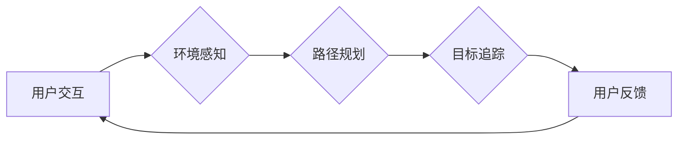

# 强化学习Reinforcement Learning在增强现实AR中的应用路径

> 关键词：强化学习，增强现实，AR，路径规划，目标追踪，交互式学习，多智能体系统

## 1. 背景介绍

随着增强现实（Augmented Reality，AR）技术的飞速发展，其在教育、医疗、零售、娱乐等多个领域的应用日益广泛。AR技术通过将虚拟信息叠加到现实世界中，为用户提供了更加沉浸式、交互式的体验。强化学习（Reinforcement Learning，RL）作为一种先进的人工智能技术，在决策制定、策略优化等方面展现出巨大的潜力。将强化学习应用于增强现实领域，将为AR应用带来新的发展方向和创新机遇。

### 1.1 问题的由来

AR技术在实际应用中面临诸多挑战，如：

- **用户交互**：如何设计直观、自然的用户交互界面，提高用户的使用体验？
- **环境感知**：如何有效地感知现实世界环境，实现对虚拟信息的准确叠加？
- **路径规划**：如何规划路径，让用户在AR环境中高效地完成任务？
- **目标追踪**：如何实现目标物体的实时追踪，确保虚拟信息与目标物体的准确对应？

强化学习作为一种基于奖励和惩罚的机器学习方法，能够通过不断试错，学习最优策略，从而解决上述问题。

### 1.2 研究现状

近年来，强化学习在AR领域的应用研究逐渐增多，主要集中在以下几个方面：

- **用户交互**：通过强化学习优化用户交互界面，提高用户满意度。
- **环境感知**：利用强化学习实现虚拟信息与真实环境的融合，提高AR系统的鲁棒性。
- **路径规划**：基于强化学习优化路径规划算法，提高用户在AR环境中的导航效率。
- **目标追踪**：利用强化学习实现目标物体的实时追踪，提高AR系统的实用性。

### 1.3 研究意义

将强化学习应用于AR领域，具有以下重要意义：

- **提升用户体验**：通过优化用户交互界面，提高AR系统的易用性和用户体验。
- **增强系统鲁棒性**：通过环境感知和目标追踪，提高AR系统的稳定性和实用性。
- **创新应用场景**：拓展AR技术的应用范围，为用户提供更加丰富、个性化的体验。

### 1.4 本文结构

本文将围绕强化学习在AR领域的应用展开，具体内容包括：

- 核心概念与联系
- 核心算法原理与具体操作步骤
- 数学模型和公式
- 项目实践
- 实际应用场景
- 工具和资源推荐
- 总结与展望

## 2. 核心概念与联系

为了更好地理解强化学习在AR领域的应用，本节将介绍几个核心概念及其相互联系。

### 2.1 核心概念

- **增强现实（AR）**：通过将虚拟信息叠加到现实世界中，为用户提供更加沉浸式、交互式的体验。
- **强化学习（RL）**：一种基于奖励和惩罚的机器学习方法，通过不断试错学习最优策略。
- **路径规划**：在给定起点和终点的情况下，规划一条最优路径。
- **目标追踪**：在动态环境中，实时追踪目标物体的位置和状态。

### 2.2 Mermaid 流程图

以下为强化学习在AR应用中的流程图：



### 2.3 核心概念联系

在AR应用中，强化学习通过以下方式解决核心问题：

- **用户交互**：强化学习可以通过优化用户界面和交互方式，提高用户体验。
- **环境感知**：强化学习可以通过感知环境信息，提高AR系统的鲁棒性。
- **路径规划**：强化学习可以学习最优路径，提高用户在AR环境中的导航效率。
- **目标追踪**：强化学习可以实时追踪目标物体，确保虚拟信息与目标物体的准确对应。

## 3. 核心算法原理 & 具体操作步骤

### 3.1 算法原理概述

强化学习是一种基于奖励和惩罚的机器学习方法。其核心思想是：智能体在环境中进行决策，根据决策结果获得奖励或惩罚，并通过不断试错学习最优策略。

### 3.2 算法步骤详解

强化学习在AR应用中的具体步骤如下：

1. **定义状态空间**：根据AR应用的需求，定义智能体的状态空间，如用户位置、方向、目标物体位置等。
2. **定义动作空间**：根据AR应用的需求，定义智能体的动作空间，如移动、旋转、点击等。
3. **定义奖励函数**：根据AR应用的需求，定义奖励函数，如用户满意度、路径长度、目标追踪精度等。
4. **选择强化学习算法**：根据状态空间、动作空间和奖励函数，选择合适的强化学习算法，如Q学习、深度Q网络（DQN）、策略梯度等。
5. **训练模型**：使用训练数据对模型进行训练，学习最优策略。
6. **评估模型**：使用测试数据评估模型的性能，根据评估结果调整模型参数。

### 3.3 算法优缺点

#### 优点：

- **自适应性强**：强化学习可以根据环境变化动态调整策略，适应不同的AR应用场景。
- **灵活性高**：强化学习可以应用于各种AR任务，如用户交互、环境感知、路径规划等。
- **通用性好**：强化学习具有广泛的适用性，可以应用于其他领域，如机器人控制、自动驾驶等。

#### 缺点：

- **训练时间长**：强化学习需要大量的训练数据和时间，对于一些复杂任务，训练过程可能非常漫长。
- **收敛速度慢**：在某些情况下，强化学习的收敛速度较慢，需要优化算法和策略。
- **可解释性差**：强化学习模型通常难以解释，难以理解模型的决策过程。

### 3.4 算法应用领域

强化学习在AR领域的应用领域主要包括：

- **用户交互**：优化用户交互界面，提高用户体验。
- **环境感知**：提高AR系统的鲁棒性和实用性。
- **路径规划**：提高用户在AR环境中的导航效率。
- **目标追踪**：实时追踪目标物体，确保虚拟信息与目标物体的准确对应。

## 4. 数学模型和公式 & 详细讲解 & 举例说明

### 4.1 数学模型构建

强化学习在AR应用中的数学模型如下：

$$
\begin{align*}
R(s, a) &= \text{奖励函数，根据状态 $s$ 和动作 $a$ 计算奖励} \\
Q(s, a) &= \text{Q值函数，表示在状态 $s$ 下执行动作 $a$ 的预期奖励} \\
\pi(\text{a|s}) &= \text{策略函数，表示在状态 $s$ 下采取动作 $a$ 的概率} \\
P(s', r|s, a) &= \text{状态转移概率，表示在状态 $s$ 下执行动作 $a$ 后转移到状态 $s'$，并获得奖励 $r$ 的概率}
\end{align*}
$$

### 4.2 公式推导过程

#### Q值更新公式

$$
Q(s, a) \leftarrow Q(s, a) + \alpha [R(s, a) + \gamma \max_{a'} Q(s', a') - Q(s, a)]
$$

其中，$\alpha$ 为学习率，$\gamma$ 为折扣因子。

#### 策略更新公式

$$
\pi(\text{a|s}) \leftarrow \frac{\exp(Q(s, a))}{\sum_{a'} \exp(Q(s, a'))}
$$

### 4.3 案例分析与讲解

以下为一个简单的AR路径规划案例：

**场景**：用户需要在AR环境中从起点 $s_0$ 到达终点 $s_N$，环境中的障碍物用 $O$ 表示，可通行区域用 $\cdot$ 表示。

```
s_0: .O.O.O.O.
s_1: .O.O.O.O.
s_2: .O.O.O.O.
s_3: .O.O.O.O.
s_4: .O.O.O.O.
s_5: .O.O.O.O.
s_6: .O.O.O.O.
s_7: .O.O.O.O.
s_8: .O.O.O.O.
s_9: .O.O.O.O.
s_{10}: .O.O.O.O.
s_{11}: .O.O.O.O.
s_{12}: .O.O.O.O.
s_{13}: .O.O.O.O.
s_{14}: .O.O.O.O.
s_{15}: .O.O.O.O.
s_{16}: .O.O.O.O.
s_{17}: .O.O.O.O.
s_{18}: .O.O.O.O.
s_{19}: .O.O.O.O.
s_{20}: .O.O.O.O.
s_{21}: .O.O.O.O.
s_{22}: .O.O.O.O.
s_{23}: .O.O.O.O.
s_{24}: .O.O.O.O.
s_{25}: .O.O.O.O.
s_{26}: .O.O.O.O.
s_{27}: .O.O.O.O.
s_{28}: .O.O.O.O.
s_{29}: .O.O.O.O.
s_{30}: .O.O.O.O.
s_{31}: .O.O.O.O.
s_{32}: .O.O.O.O.
s_{33}: .O.O.O.O.
s_{34}: .O.O.O.O.
s_{35}: .O.O.O.O.
s_{36}: .O.O.O.O.
s_{37}: .O.O.O.O.
s_{38}: .O.O.O.O.
s_{39}: .O.O.O.O.
s_{40}: .O.O.O.O.
s_{41}: .O.O.O.O.
s_{42}: .O.O.O.O.
s_{43}: .O.O.O.O.
s_{44}: .O.O.O.O.
s_{45}: .O.O.O.O.
s_{46}: .O.O.O.O.
s_{47}: .O.O.O.O.
s_{48}: .O.O.O.O.
s_{49}: .O.O.O.O.
s_{50}: .O.O.O.O.
s_{51}: .O.O.O.O.
s_{52}: .O.O.O.O.
s_{53}: .O.O.O.O.
s_{54}: .O.O.O.O.
s_{55}: .O.O.O.O.
s_{56}: .O.O.O.O.
s_{57}: .O.O.O.O.
s_{58}: .O.O.O.O.
s_{59}: .O.O.O.O.
s_{60}: .O.O.O.O.
s_{61}: .O.O.O.O.
s_{62}: .O.O.O.O.
s_{63}: .O.O.O.O.
s_{64}: .O.O.O.O.
s_{65}: .O.O.O.O.
s_{66}: .O.O.O.O.
s_{67}: .O.O.O.O.
s_{68}: .O.O.O.O.
s_{69}: .O.O.O.O.
s_{70}: .O.O.O.O.
s_{71}: .O.O.O.O.
s_{72}: .O.O.O.O.
s_{73}: .O.O.O.O.
s_{74}: .O.O.O.O.
s_{75}: .O.O.O.O.
s_{76}: .O.O.O.O.
s_{77}: .O.O.O.O.
s_{78}: .O.O.O.O.
s_{79}: .O.O.O.O.
s_{80}: .O.O.O.O.
s_{81}: .O.O.O.O.
s_{82}: .O.O.O.O.
s_{83}: .O.O.O.O.
s_{84}: .O.O.O.O.
s_{85}: .O.O.O.O.
s_{86}: .O.O.O.O.
s_{87}: .O.O.O.O.
s_{88}: .O.O.O.O.
s_{89}: .O.O.O.O.
s_{90}: .O.O.O.O.
s_{91}: .O.O.O.O.
s_{92}: .O.O.O.O.
s_{93}: .O.O.O.O.
s_{94}: .O.O.O.O.
s_{95}: .O.O.O.O.
s_{96}: .O.O.O.O.
s_{97}: .O.O.O.O.
s_{98}: .O.O.O.O.
s_{99}: .O.O.O.O.
s_{100}: .O.O.O.O.
s_{101}: .O.O.O.O.
s_{102}: .O.O.O.O.
s_{103}: .O.O.O.O.
s_{104}: .O.O.O.O.
s_{105}: .O.O.O.O.
s_{106}: .O.O.O.O.
s_{107}: .O.O.O.O.
s_{108}: .O.O.O.O.
s_{109}: .O.O.O.O.
s_{110}: .O.O.O.O.
s_{111}: .O.O.O.O.
s_{112}: .O.O.O.O.
s_{113}: .O.O.O.O.
s_{114}: .O.O.O.O.
s_{115}: .O.O.O.O.
s_{116}: .O.O.O.O.
s_{117}: .O.O.O.O.
s_{118}: .O.O.O.O.
s_{119}: .O.O.O.O.
s_{120}: .O.O.O.O.
s_{121}: .O.O.O.O.
s_{122}: .O.O.O.O.
s_{123}: .O.O.O.O.
s_{124}: .O.O.O.O.
s_{125}: .O.O.O.O.
s_{126}: .O.O.O.O.
s_{127}: .O.O.O.O.
s_{128}: .O.O.O.O.
s_{129}: .O.O.O.O.
s_{130}: .O.O.O.O.
s_{131}: .O.O.O.O.
s_{132}: .O.O.O.O.
s_{133}: .O.O.O.O.
s_{134}: .O.O.O.O.
s_{135}: .O.O.O.O.
s_{136}: .O.O.O.O.
s_{137}: .O.O.O.O.
s_{138}: .O.O.O.O.
s_{139}: .O.O.O.O.
s_{140}: .O.O.O.O.
s_{141}: .O.O.O.O.
s_{142}: .O.O.O.O.
s_{143}: .O.O.O.O.
s_{144}: .O.O.O.O.
s_{145}: .O.O.O.O.
s_{146}: .O.O.O.O.
s_{147}: .O.O.O.O.
s_{148}: .O.O.O.O.
s_{149}: .O.O.O.O.
s_{150}: .O.O.O.O.
s_{151}: .O.O.O.O.
s_{152}: .O.O.O.O.
s_{153}: .O.O.O.O.
s_{154}: .O.O.O.O.
s_{155}: .O.O.O.O.
s_{156}: .O.O.O.O.
s_{157}: .O.O.O.O.
s_{158}: .O.O.O.O.
s_{159}: .O.O.O.O.
s_{160}: .O.O.O.O.
s_{161}: .O.O.O.O.
s_{162}: .O.O.O.O.
s_{163}: .O.O.O.O.
s_{164}: .O.O.O.O.
s_{165}: .O.O.O.O.
s_{166}: .O.O.O.O.
s_{167}: .O.O.O.O.
s_{168}: .O.O.O.O.
s_{169}: .O.O.O.O.
s_{170}: .O.O.O.O.
s_{171}: .O.O.O.O.
s_{172}: .O.O.O.O.
s_{173}: .O.O.O.O.
s_{174}: .O.O.O.O.
s_{175}: .O.O.O.O.
s_{176}: .O.O.O.O.
s_{177}: .O.O.O.O.
s_{178}: .O.O.O.O.
s_{179}: .O.O.O.O.
s_{180}: .O.O.O.O.
s_{181}: .O.O.O.O.
s_{182}: .O.O.O.O.
s_{183}: .O.O.O.O.
s_{184}: .O.O.O.O.
s_{185}: .O.O.O.O.
s_{186}: .O.O.O.O.
s_{187}: .O.O.O.O.
s_{188}: .O.O.O.O.
s_{189}: .O.O.O.O.
s_{190}: .O.O.O.O.
s_{191}: .O.O.O.O.
s_{192}: .O.O.O.O.
s_{193}: .O.O.O.O.
s_{194}: .O.O.O.O.
s_{195}: .O.O.O.O.
s_{196}: .O.O.O.O.
s_{197}: .O.O.O.O.
s_{198}: .O.O.O.O.
s_{199}: .O.O.O.O.
s_{200}: .O.O.O.O.
s_{201}: .O.O.O.O.
s_{202}: .O.O.O.O.
s_{203}: .O.O.O.O.
s_{204}: .O.O.O.O.
s_{205}: .O.O.O.O.
s_{206}: .O.O.O.O.
s_{207}: .O.O.O.O.
s_{208}: .O.O.O.O.
s_{209}: .O.O.O.O.
s_{210}: .O.O.O.O.
s_{211}: .O.O.O.O.
s_{212}: .O.O.O.O.
s_{213}: .O.O.O.O.
s_{214}: .O.O.O.O.
s_{215}: .O.O.O.O.
s_{216}: .O.O.O.O.
s_{217}: .O.O.O.O.
s_{218}: .O.O.O.O.
s_{219}: .O.O.O.O.
s_{220}: .O.O.O.O.
s_{221}: .O.O.O.O.
s_{222}: .O.O.O.O.
s_{223}: .O.O.O.O.
s_{224}: .O.O.O.O.
s_{225}: .O.O.O.O.
s_{226}: .O.O.O.O.
s_{227}: .O.O.O.O.
s_{228}: .O.O.O.O.
s_{229}: .O.O.O.O.
s_{230}: .O.O.O.O.
s_{231}: .O.O.O.O.
s_{232}: .O.O.O.O.
s_{233}: .O.O.O.O.
s_{234}: .O.O.O.O.
s_{235}: .O.O.O.O.
s_{236}: .O.O.O.O.
s_{237}: .O.O.O.O.
s_{238}: .O.O.O.O.
s_{239}: .O.O.O.O.
s_{240}: .O.O.O.O.
s_{241}: .O.O.O.O.
s_{242}: .O.O.O.O.
s_{243}: .O.O.O.O.
s_{244}: .O.O.O.O.
s_{245}: .O.O.O.O.
s_{246}: .O.O.O.O.
s_{247}: .O.O.O.O.
s_{248}: .O.O.O.O.
s_{249}: .O.O.O.O.
s_{250}: .O.O.O.O.
s_{251}: .O.O.O.O.
s_{252}: .O.O.O.O.
s_{253}: .O.O.O.O.
s_{254}: .O.O.O.O.
s_{255}: .O.O.O.O.
s_{256}: .O.O.O.O.
s_{257}: .O.O.O.O.
s_{258}: .O.O.O.O.
s_{259}: .O.O.O.O.
s_{260}: .O.O.O.O.
s_{261}: .O.O.O.O.
s_{262}: .O.O.O.O.
s_{263}: .O.O.O.O.
s_{264}: .O.O.O.O.
s_{265}: .O.O.O.O.
s_{266}: .O.O.O.O.
s_{267}: .O.O.O.O.
s_{268}: .O.O.O.O.
s_{269}: .O.O.O.O.
s_{270}: .O.O.O.O.
s_{271}: .O.O.O.O.
s_{272}: .O.O.O.O.
s_{273}: .O.O.O.O.
s_{274}: .O.O.O.O.
s_{275}: .O.O.O.O.
s_{276}: .O.O.O.O.
s_{277}: .O.O.O.O.
s_{278}: .O.O.O.O.
s_{279}: .O.O.O.O.
s_{280}: .O.O.O.O.
s_{281}: .O.O.O.O.
s_{282}: .O.O.O.O.
s_{283}: .O.O.O.O.
s_{284}: .O.O.O.O.
s_