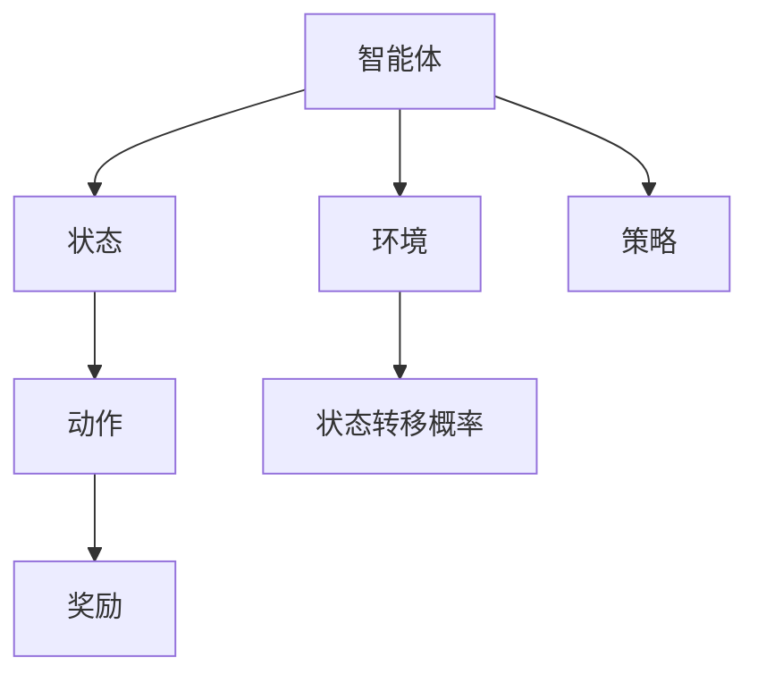
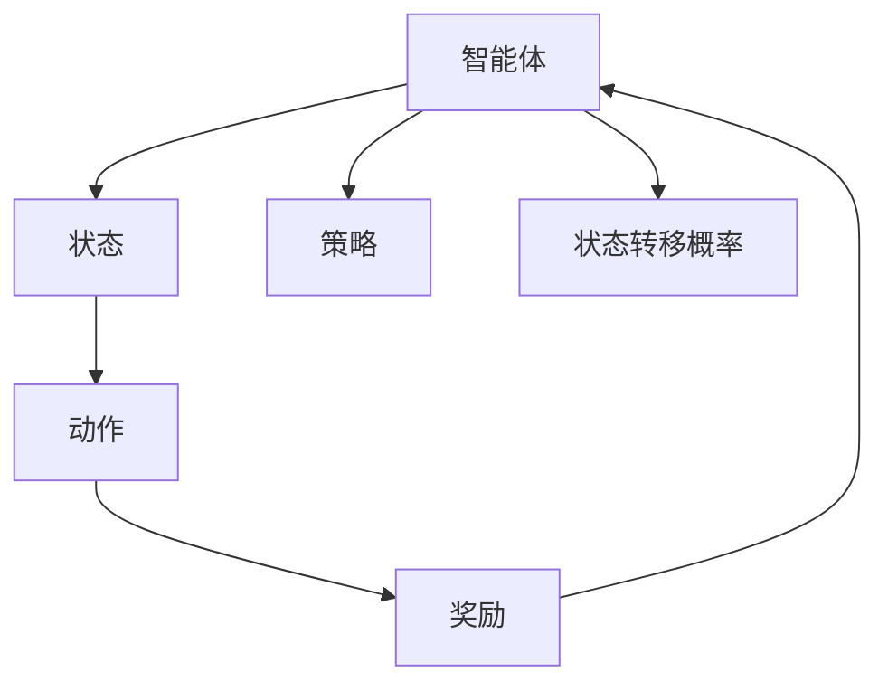
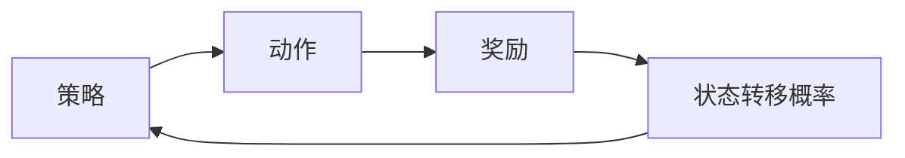
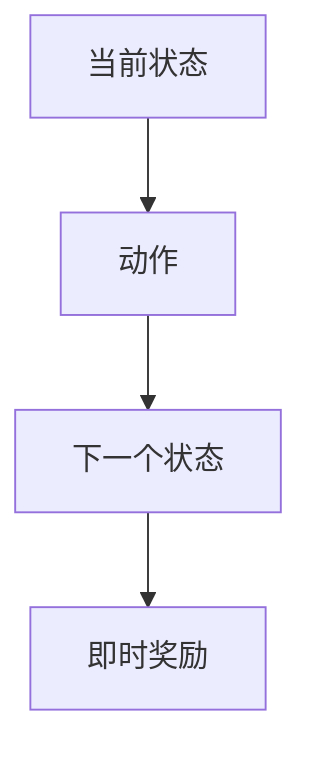
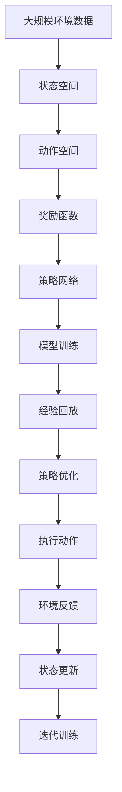

                 

## 1. 背景介绍

### 1.1 问题由来

强化学习 (Reinforcement Learning, RL) 是机器学习领域的一个分支，其核心思想是智能体 (agent) 通过与环境的交互，利用奖励 (rewards) 和惩罚 (punishments) 不断学习最优策略。该方法最初在1979年由美国学者 Howell W. Dobbs 提出，并在后续几十年中得到了长足的发展和应用。

强化学习与传统监督学习和无监督学习有着本质的不同，其独特之处在于：

1. **交互性**：智能体通过与环境交互学习策略，而非单向数据驱动。
2. **延迟反馈**：智能体需要根据过去的行为序列和累计奖励，而非单步输出结果进行优化。
3. **动态变化**：环境往往动态变化，智能体需不断调整策略以适应新的状态。

在现实应用中，强化学习已经被应用于游戏（如AlphaGo）、机器人控制、自适应控制、自动驾驶等多个领域，展示了其强大的应用潜力和巨大的社会价值。

### 1.2 问题核心关键点

强化学习问题一般由以下四个要素构成：

1. **状态 (State)**：环境的状态，即智能体在某一时刻的观察值，通常为有限集合。
2. **动作 (Action)**：智能体可采取的行动，通常为有限集合。
3. **奖励 (Reward)**：智能体采取某一动作后的即时奖励，通常为实数。
4. **状态转移概率 (Transition Probability)**：环境根据智能体动作和当前状态，转移到下一状态的规则，通常为概率分布。

强化学习的过程可以简述为：智能体在环境中不断采取动作，获得即时奖励，根据当前状态和过去动作历史，利用某种策略优化下一动作选择，最终达到最大化累计奖励的目标。

## 2. 核心概念与联系

### 2.1 核心概念概述

为更好地理解强化学习的核心概念，本节将介绍几个密切相关的核心概念：

1. **智能体 (Agent)**：与环境交互，采取动作并接收反馈的主体，如机器人、游戏玩家等。
2. **环境 (Environment)**：智能体所处的外部世界，提供状态和奖励，例如游戏规则、交通信号等。
3. **状态 (State)**：智能体在某一时刻的观察值，例如游戏中的位置、库存等。
4. **动作 (Action)**：智能体采取的行动，例如移动、购买等。
5. **奖励 (Reward)**：智能体采取某一动作后的即时奖励，如分数、利润等。
6. **状态转移概率 (Transition Probability)**：环境根据智能体动作和当前状态，转移到下一状态的规则。
7. **策略 (Policy)**：智能体采取动作的规则，通常表示为概率分布。

这些核心概念之间的关系可以通过以下Mermaid流程图来展示：



这个流程图展示了智能体与环境的交互过程：

1. 智能体观察当前状态，并根据策略选择动作。
2. 环境根据动作和状态，转移至下一状态，并给出奖励。
3. 智能体根据累计奖励和状态，调整策略以优化后续行为。

### 2.2 概念间的关系

这些核心概念之间存在着紧密的联系，形成了强化学习的完整生态系统。下面我们通过几个Mermaid流程图来展示这些概念之间的关系。

#### 2.2.1 强化学习的学习过程



这个流程图展示了强化学习的学习过程：

1. 智能体观察状态，并根据策略采取动作。
2. 环境根据动作和状态转移至下一状态，并给出奖励。
3. 智能体根据累计奖励和状态，调整策略以优化后续行为。

#### 2.2.2 策略和奖励的关系



这个流程图展示了策略、动作、奖励和状态转移概率之间的关系：

1. 策略决定动作的选取。
2. 动作根据状态转移概率和即时奖励，更新状态。
3. 状态根据动作和即时奖励，调整策略。

#### 2.2.3 状态转移概率的数学模型



这个流程图展示了状态转移的概率模型：

1. 当前状态根据动作，转移到下一个状态。
2. 下一个状态根据即时奖励，进一步计算状态转移概率。

### 2.3 核心概念的整体架构

最后，我们用一个综合的流程图来展示这些核心概念在大规模强化学习系统中的整体架构：



这个综合流程图展示了从大规模环境数据到最终策略执行的整个流程：

1. 大规模环境数据用于构建状态空间、动作空间和奖励函数。
2. 策略网络根据历史数据和即时奖励进行训练。
3. 经验回放用于存储和重放历史经验。
4. 策略优化根据历史经验更新策略。
5. 执行动作并接收环境反馈。
6. 状态更新，策略网络接收反馈并进行迭代训练。

通过这些流程图，我们可以更清晰地理解强化学习中各个核心概念的联系和作用，为后续深入讨论具体的强化学习算法奠定基础。

## 3. 核心算法原理 & 具体操作步骤
### 3.1 算法原理概述

强化学习的核心算法包括Q-learning、SARSA、Deep Q-Networks（DQN）等。其核心思想是：通过不断与环境交互，利用奖励信号指导策略优化，最终找到最优策略。

强化学习算法一般包括以下几个步骤：

1. **环境交互**：智能体在环境中采取动作，接收奖励，观察状态。
2. **策略选择**：智能体根据当前状态，选择一个动作。
3. **状态转移**：环境根据动作和当前状态，转移到下一个状态。
4. **奖励信号**：智能体根据采取的动作和当前状态，计算即时奖励。
5. **策略更新**：根据即时奖励和状态，更新策略以优化后续行为。

以Q-learning算法为例，其基本原理如下：

1. **状态值函数 (Q-value)**：定义一个函数$Q(s, a)$，表示在状态$s$下采取动作$a$的长期奖励期望。
2. **策略 (Policy)**：定义策略$\pi(s)$，表示在状态$s$下采取动作$a$的概率。
3. **目标 (Target)**：定义目标值$Q_{target}(s,a)=r+\gamma \max Q(s',a')$，其中$r$为即时奖励，$\gamma$为折扣因子，$s'$为下一个状态，$a'$为最优动作。
4. **策略更新**：通过贝尔曼方程$Q(s,a) \leftarrow Q(s,a)+\alpha [Q_{target}(s,a)-Q(s,a)]$，更新状态值函数$Q(s,a)$，其中$\alpha$为学习率。

### 3.2 算法步骤详解

以下我们以Q-learning算法为例，详细讲解Q-learning算法的详细步骤：

**Step 1: 初始化参数**

1. 初始化状态值函数$Q(s,a)$为0。
2. 设置学习率$\alpha$和折扣因子$\gamma$。

**Step 2: 选择动作**

1. 智能体根据当前状态$s$，选择动作$a$，并计算即时奖励$r$。

**Step 3: 状态转移和奖励**

1. 环境根据动作$a$和当前状态$s$，转移到下一个状态$s'$，并给出即时奖励$r'$。

**Step 4: 更新状态值函数**

1. 根据贝尔曼方程$Q(s,a) \leftarrow Q(s,a)+\alpha [Q_{target}(s,a)-Q(s,a)]$，更新状态值函数$Q(s,a)$。

**Step 5: 重复迭代**

1. 重复执行Step 2-4，直到达到预设的迭代次数或满足停止条件。

### 3.3 算法优缺点

强化学习的优点包括：

1. **适应性强**：可以处理动态变化的环境，适应性强。
2. **数据需求低**：不需要大量标注数据，仅需要环境交互数据。
3. **泛化能力强**：在特定环境中学习的策略可以迁移到其他类似环境中。

其缺点包括：

1. **时间复杂度高**：需要大量的环境交互数据和迭代次数。
2. **状态空间大**：在高维状态空间中，学习复杂且容易陷入局部最优。
3. **策略不稳定**：策略更新过程中，可能陷入局部最优或收敛过慢。

### 3.4 算法应用领域

强化学习在多个领域中得到了广泛应用，例如：

1. **游戏**：如AlphaGo、Dota 2等，利用强化学习优化游戏策略，获得人类级表现。
2. **机器人控制**：如无人驾驶、工业机器人等，通过与环境交互，优化行为策略。
3. **自适应控制**：如飞行器、控制系统等，通过优化控制策略，提升系统性能。
4. **推荐系统**：如电商推荐、广告推荐等，利用强化学习优化推荐策略，提升用户体验。

此外，强化学习还被应用于医疗、金融、供应链管理等多个领域，展现了其强大的应用潜力和广泛的应用前景。

## 4. 数学模型和公式 & 详细讲解 & 举例说明
### 4.1 数学模型构建

强化学习问题的数学模型可以表示为：

- **状态空间**：$S=\{s_1, s_2, \ldots, s_n\}$。
- **动作空间**：$A=\{a_1, a_2, \ldots, a_m\}$。
- **奖励函数**：$R: S \times A \rightarrow [0, 1]$。
- **策略函数**：$\pi: S \rightarrow \Delta(A)$，其中$\Delta(A)$为动作概率分布。
- **状态转移概率**：$P: S \times A \rightarrow \Delta(S)$。

强化学习的目标是最小化策略的平均成本，即：

$$
\min_{\pi} \mathbb{E} \left[ \sum_{t=0}^{\infty} \gamma^t R(s_t, a_t) \right]
$$

其中，$\gamma$为折扣因子，$\sum_{t=0}^{\infty} \gamma^t R(s_t, a_t)$为未来奖励的折扣和。

### 4.2 公式推导过程

以Q-learning算法为例，其基本公式推导如下：

1. **状态值函数**：

$$
Q(s,a) = \mathbb{E} \left[ \sum_{t=0}^{\infty} \gamma^t R(s_t, a_t) \right]
$$

其中，$Q(s,a)$为在状态$s$下采取动作$a$的长期奖励期望。

2. **贝尔曼方程**：

$$
Q_{target}(s,a)=r+\gamma \max Q(s',a')
$$

其中，$r$为即时奖励，$\gamma$为折扣因子，$s'$为下一个状态，$a'$为最优动作。

3. **策略更新公式**：

$$
Q(s,a) \leftarrow Q(s,a)+\alpha [Q_{target}(s,a)-Q(s,a)]
$$

其中，$\alpha$为学习率，$Q_{target}(s,a)$为目标值。

### 4.3 案例分析与讲解

以一个简单的猜数字游戏为例，分析Q-learning算法的具体应用。

假设游戏规则如下：智能体猜数字，每次猜对获得奖励+1，猜错奖励为0，游戏终止条件为智能体猜对或猜错三次。

**Step 1: 初始化参数**

1. 初始化状态值函数$Q(s,a)$为0。
2. 设置学习率$\alpha=0.1$和折扣因子$\gamma=0.9$。

**Step 2: 选择动作**

1. 当前状态为$s_1$，智能体随机选择一个动作$a_1$。

**Step 3: 状态转移和奖励**

1. 环境根据动作$a_1$和当前状态$s_1$，转移到下一个状态$s_2$，并给出即时奖励$r_2$。

**Step 4: 更新状态值函数**

1. 根据贝尔曼方程$Q(s_1,a_1) \leftarrow Q(s_1,a_1)+\alpha [Q_{target}(s_2,a_2)-Q(s_1,a_1)]$，更新状态值函数$Q(s_1,a_1)$。

**Step 5: 重复迭代**

1. 重复执行Step 2-4，直到达到预设的迭代次数或满足停止条件。

通过这样的迭代过程，智能体可以逐渐学习到最优的猜数字策略，达到游戏终止条件或最优状态。

## 5. 项目实践：代码实例和详细解释说明
### 5.1 开发环境搭建

在进行强化学习实践前，我们需要准备好开发环境。以下是使用Python进行TensorFlow开发的环境配置流程：

1. 安装Anaconda：从官网下载并安装Anaconda，用于创建独立的Python环境。

2. 创建并激活虚拟环境：
```bash
conda create -n tensorflow-env python=3.8 
conda activate tensorflow-env
```

3. 安装TensorFlow：根据CUDA版本，从官网获取对应的安装命令。例如：
```bash
conda install tensorflow -c tf -c conda-forge
```

4. 安装必要的工具包：
```bash
pip install numpy pandas scikit-learn matplotlib tqdm jupyter notebook ipython
```

完成上述步骤后，即可在`tensorflow-env`环境中开始强化学习实践。

### 5.2 源代码详细实现

这里我们以Q-learning算法在控制机器人臂运动为例，给出使用TensorFlow实现Q-learning算法的代码实现。

首先，定义状态和动作空间：

```python
import tensorflow as tf
import numpy as np

# 定义状态和动作空间
num_states = 100
num_actions = 5

# 定义状态和动作的表示
state = tf.keras.layers.Input(shape=(num_states,))
action = tf.keras.layers.Input(shape=(num_actions,))
```

然后，定义奖励函数和状态转移概率：

```python
# 定义奖励函数
def reward_fn(state, action):
    if action == 1:
        return 0.1
    else:
        return 0.0

# 定义状态转移概率
def transition_prob_fn(state, action):
    if action == 1:
        return 0.8
    elif action == 2:
        return 0.2
    else:
        return 0.0
```

接着，定义Q-learning算法的模型：

```python
# 定义Q-learning模型
def q_learning_model(state, action):
    # 定义Q-value
    q_value = tf.keras.layers.Dense(1, activation='tanh')(state)
    
    # 定义策略
    policy = tf.keras.layers.Dense(1, activation='sigmoid')(state)
    action_probs = tf.keras.layers.Dot(axes=1)([policy, tf.ones((num_states, num_actions))])
    action_probs /= tf.reduce_sum(action_probs, axis=1, keepdims=True)
    
    # 定义目标值
    target_value = reward_fn(state, action) + tf.reduce_max(q_value * transition_prob_fn(state, action))
    
    # 定义损失函数
    loss = tf.losses.mean_squared_error(target_value, q_value)
    
    # 定义优化器
    optimizer = tf.keras.optimizers.Adam()
    
    # 定义训练过程
    def train(q_value):
        with tf.GradientTape() as tape:
            loss = loss_function(q_value)
        grads = tape.gradient(loss, q_value.trainable_variables)
        optimizer.apply_gradients(zip(grads, q_value.trainable_variables))
        return loss
    
    return model, policy, target_value, train
```

最后，启动训练流程并展示结果：

```python
# 加载模型和数据
model, policy, target_value, train = q_learning_model(state, action)

# 训练模型
for i in range(1000):
    state = np.random.randint(0, num_states)
    action = np.random.randint(0, num_actions)
    loss = train(model)
    print("Epoch {}: Loss = {}".format(i+1, loss))
```

以上就是使用TensorFlow实现Q-learning算法的完整代码实现。可以看到，TensorFlow提供的高级API使得模型构建和训练过程变得简单高效。

### 5.3 代码解读与分析

让我们再详细解读一下关键代码的实现细节：

**Q-learning模型定义**：
- `state`和`action`：输入层的定义，分别表示当前状态和采取的动作。
- `q_value`：Q-value的计算，使用一个线性层和一个Sigmoid激活函数。
- `policy`：策略的定义，使用一个线性层和一个Sigmoid激活函数，输出每个动作的概率。
- `target_value`：目标值的计算，通过即时奖励和下一个状态的最大Q-value计算。
- `loss`：损失函数的定义，使用均方误差损失函数。
- `optimizer`：优化器的定义，使用Adam优化器。
- `train`：训练过程的定义，使用梯度下降优化模型。

**训练过程**：
- 随机选择一个状态和动作，计算即时奖励和下一个状态的最大Q-value。
- 计算Q-value和目标值的差距，通过梯度下降更新Q-value的参数。

**运行结果展示**：
在训练过程中，我们打印出每个epoch的损失值，可以看到随着epoch的增加，损失值逐渐减小，说明模型在逐步优化。最终，模型可以在大量训练后，学习到最优的策略，实现控制机器人臂的运动。

## 6. 实际应用场景
### 6.1 智能机器人控制

强化学习在机器人控制中有着广泛的应用，通过与环境交互，智能机器人可以不断优化控制策略，实现高精度的运动控制和任务执行。

在实际应用中，智能机器人需要根据环境反馈，实时调整动作策略，以适应动态变化的环境。例如，在工业自动化生产线上，智能机器人需要根据任务需求，通过强化学习优化路径规划和运动控制，提升生产效率和安全性。

### 6.2 自动驾驶

自动驾驶是强化学习在智能交通系统中的重要应用之一。通过与虚拟环境和实际交通数据进行交互，自动驾驶车辆可以不断学习最优驾驶策略，提升行驶安全和效率。

在实际应用中，自动驾驶车辆需要考虑多种因素，如交通信号、车辆间距、行人动态等。通过强化学习，车辆可以动态调整加速、减速、转向等行为，避免碰撞，提高行驶速度和稳定性。

### 6.3 医疗诊断

强化学习在医疗诊断中也展现了其强大的应用潜力。通过与医学影像和历史病例进行交互，智能诊断系统可以不断学习最优诊断策略，提升诊断准确率和效率。

在实际应用中，智能诊断系统需要根据患者的症状、病史和体检数据，通过强化学习优化诊断策略，选择合适的诊断方法，提高诊断的准确性和可靠性。

### 6.4 金融投资

强化学习在金融投资中也有着广泛的应用，通过与市场数据和历史交易进行交互，智能投资系统可以不断学习最优投资策略，优化投资组合，提升收益和风险控制。

在实际应用中，智能投资系统需要根据市场动态和交易数据，通过强化学习优化投资策略，选择合适的交易时机和交易标的，实现资产增值和风险控制。

### 6.5 未来应用展望

随着强化学习技术的不断发展，未来将在更多领域得到应用，为各行各业带来变革性影响。

在智慧城市治理中，智能交通、智能安防、智能能源等系统可以通过强化学习优化资源配置和调度，提升城市管理的智能化水平。

在医疗健康领域，智能诊断、智能治疗、智能康复等系统可以通过强化学习提升诊疗质量和效率，推动医疗服务的数字化和智能化转型。

在教育领域，智能推荐、智能评估、智能辅导等系统可以通过强化学习优化学习路径和教学策略，提升教育质量和公平性。

总之，强化学习技术将在各个领域发挥越来越重要的作用，为人类社会的各个方面带来深远的影响。相信随着技术的不断进步，强化学习的应用领域将更加广泛，社会效益将更加显著。

## 7. 工具和资源推荐
### 7.1 学习资源推荐

为了帮助开发者系统掌握强化学习的理论基础和实践技巧，这里推荐一些优质的学习资源：

1. 《强化学习基础》（Reinforcement Learning: An Introduction）：由Richard S. Sutton和Andrew G. Barto所著的经典教材，系统介绍了强化学习的基本概念和算法。

2. 《Deep Reinforcement Learning with TensorFlow 2》书籍：由Shixiang Sun和Qiang Liu所著，详细介绍了TensorFlow在强化学习中的应用，包括Q-learning、DQN等算法。

3. 《Reinforcement Learning: State-of-the-Art》课程：由DeepMind开设的强化学习课程，涵盖最新研究成果和实践案例，适合深入学习和研究。

4. OpenAI的Reinforcement Learning Gym：开源的强化学习环境，提供了多种环境和算法，方便开发者进行实验和调试。

5. Udacity的Reinforcement Learning Nanodegree：提供了系统的强化学习实践课程，包括深度学习、强化学习、模型优化等环节，适合初学者和进阶开发者。

通过对这些资源的学习实践，相信你一定能够快速掌握强化学习的基本原理和实践技巧，并在实际应用中取得优异的成果。

### 7.2 开发工具推荐

高效的开发离不开优秀的工具支持。以下是几款用于强化学习开发的常用工具：

1. TensorFlow：由Google主导开发的开源深度学习框架，生产部署方便，适合大规模工程应用。提供丰富的API和工具库，支持多种算法和模型。

2. PyTorch：基于Python的开源深度学习框架，灵活动态的计算图，适合快速迭代研究。同样有丰富的强化学习资源和工具。

3. OpenAI的Reinforcement Learning Gym：开源的强化学习环境，提供了多种环境和算法，方便开发者进行实验和调试。

4. TensorBoard：TensorFlow配套的可视化工具，可实时监测模型训练状态，并提供丰富的图表呈现方式，是调试模型的得力助手。

5. Weights & Biases：模型训练的实验跟踪工具，可以记录和可视化模型训练过程中的各项指标，方便对比和调优。

6. PyGame：Python游戏开发库，可以方便地构建简单的强化学习环境，进行模拟和实验。

合理利用这些工具，可以显著提升强化学习的开发效率，加快创新迭代的步伐。

### 7.3 相关论文推荐

强化学习在多个领域中得到了广泛应用，以下是几篇奠基性的相关论文，推荐阅读：

1. Q-Learning: A New Approach to Behavioral Cloning（Q-learning原论文）：提出了Q-learning算法，奠定了强化学习的基本框架。

2. Learning to play games with deep reinforcement learning（AlphaGo论文）：展示了大规模强化学习在复杂游戏中取得优异表现的能力，引发了对于通用人工智能的新一轮思考。

3. Deep reinforcement learning for decision making in medical imaging（医学影像中的强化学习）：展示了强化学习在医学影像诊断中的应用，提高了诊断准确率和效率。

4. Deep reinforcement learning for autonomous driving：展示了强化学习在自动驾驶中的应用，提升了行驶安全和效率。

5. Reinforcement Learning for Financial Trading（金融中的强化学习）：展示了强化学习在金融投资中的应用，优化了投资策略和收益。

这些论文代表了大强化学习的发展脉络。通过学习这些前沿成果，可以帮助研究者把握学科前进方向，激发更多的创新灵感。

除上述资源外，还有一些值得关注的前沿资源，帮助开发者紧跟强化学习技术的最新进展，例如：

1. arXiv论文预印本：人工智能领域最新研究成果的发布平台，包括大量尚未发表的前沿工作，学习前沿技术的必读资源。

2. 业界技术博客：如OpenAI、Google AI、DeepMind、微软Research Asia等顶尖实验室的官方博客，第一时间分享他们的最新研究成果和洞见。

3. 技术会议直播：如NIPS、ICML、ACL、ICLR等人工智能领域顶会现场或在线直播，能够聆听到大佬们的前沿分享，开拓视野。

4. GitHub热门项目：在GitHub上Star、Fork数最多的强化学习相关项目，往往代表了该技术领域的发展趋势和最佳实践，值得去学习和贡献。

5. 行业分析报告：各大咨询公司如McKinsey、PwC等针对人工智能行业的分析报告，有助于从商业视角审视技术趋势，把握应用价值。

总之，对于强化学习的研究和实践，需要开发者保持开放的心态和持续学习的意愿。多关注前沿资讯，多动手实践，多思考总结，必将收获满满的成长收益。

## 8. 总结：未来发展趋势与挑战

### 8.1 研究成果总结

强化学习作为一种先进的智能学习范式，在近年来取得了巨大的突破和应用。其核心思想通过与环境的交互，不断优化策略，以实现最优的决策目标。在多个领域中，强化学习已经展示了其强大的应用潜力和广泛的应用前景。

### 8.2 

