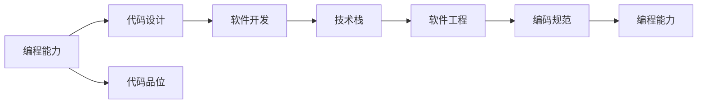

                 

# 怎样培养扎实的编程能力，优秀的设计和代码品位

> 关键词：编程能力,代码设计,代码品位,软件开发,技术栈,软件工程,编码规范

## 1. 背景介绍

在当今这个信息爆炸的时代，计算机编程已经成为了各行各业必备的技能之一。无论你是想成为一名软件开发工程师、数据科学家、人工智能研究员，还是只是对编程有兴趣的爱好者，培养扎实的编程能力、优秀的设计和代码品位都至关重要。然而，要达到这个目标并不容易。本文将从多个角度深入探讨如何培养这些技能，帮助你在编程之路上走得更远。

## 2. 核心概念与联系

### 2.1 核心概念概述

为了更好地理解如何培养扎实的编程能力、优秀的设计和代码品位，我们需要明确几个核心概念：

- **编程能力**：指编写高质量、高效且可维护的代码的能力。这包括算法设计、数据结构、代码优化等。
- **代码设计**：指在编写代码之前，通过抽象、分解、设计等步骤，规划出最优的代码结构。
- **代码品位**：指编写代码的风格和规范，包括命名规范、注释、代码风格等。
- **软件开发**：涵盖从需求分析、设计、实现到测试和维护的全过程。
- **技术栈**：指开发某个项目所需掌握的编程语言、框架和工具等。
- **软件工程**：通过一系列最佳实践，提升软件的质量和可维护性。
- **编码规范**：一套统一的代码编写规则和标准，确保代码的一致性和可读性。

这些概念之间存在紧密的联系，它们共同构成了软件开发的基础。通过理解并应用这些概念，可以显著提升编程效率和代码质量。

### 2.2 概念间的关系

以下是一个简化的Mermaid流程图，展示了这些核心概念之间的关系：



这个流程图表明，编程能力是基础，通过代码设计和代码品位提升开发质量，软件开发和技术栈的选择影响工程实践，而软件工程和编码规范是提升代码质量的具体方法和规则。通过这些概念的相互作用，可以逐步培养出扎实的编程能力。

## 3. 核心算法原理 & 具体操作步骤

### 3.1 算法原理概述

编程能力、代码设计和代码品位的提升，依赖于算法原理的理解和应用。这些算法包括但不限于数据结构（如数组、链表、树、图等）、算法（如排序、搜索、图算法等）、设计模式（如单例、工厂、观察者等）等。理解这些算法的基本原理和应用场景，是编写高质量代码的基础。

### 3.2 算法步骤详解

以下是详细的算法步骤和实践建议：

1. **算法选择**：根据问题的特点选择合适的算法。例如，对于排序问题，可以选择快速排序、归并排序等。
2. **算法实现**：实现算法时，优先考虑代码的可读性和可维护性，遵循良好的编码规范。
3. **算法优化**：针对不同的应用场景，优化算法的效率。例如，使用空间换时间、缓存等方法。
4. **测试与调试**：编写单元测试和集成测试，确保算法的正确性和可靠性。

### 3.3 算法优缺点

不同的算法在效率、空间、复杂度等方面各有优缺点。合理选择和应用算法，可以显著提升代码质量和性能。例如，快速排序时间复杂度为$O(n\log n)$，但空间复杂度较高；而堆排序空间复杂度低，但时间复杂度较高。需要根据具体应用场景进行权衡。

### 3.4 算法应用领域

算法的应用领域非常广泛，包括但不限于：

- 数据处理：如排序、搜索、去重等。
- 图像处理：如图像识别、图像压缩等。
- 自然语言处理：如文本分类、信息检索等。
- 人工智能：如机器学习、深度学习等。

## 4. 数学模型和公式 & 详细讲解 & 举例说明

### 4.1 数学模型构建

在编程中，数学模型和公式的应用非常普遍。以下是几个常见的数学模型及其公式推导：

- **线性回归模型**：用于预测连续值，公式为$y = \theta_0 + \theta_1x_1 + \theta_2x_2 + ... + \theta_nx_n$。
- **分类模型**：如逻辑回归，公式为$y = \frac{1}{1 + e^{-\theta_0 - \theta_1x_1 - \theta_2x_2 - ... - \theta_nx_n}}$。
- **概率模型**：如高斯分布，公式为$p(x) = \frac{1}{\sqrt{2\pi\sigma^2}} e^{-\frac{(x - \mu)^2}{2\sigma^2}}$。

### 4.2 公式推导过程

以线性回归模型为例，推导其公式：

1. **数据准备**：收集样本数据$(x_1, x_2, ..., x_n), (y_1, y_2, ..., y_n)$。
2. **模型构建**：设定模型为$y = \theta_0 + \theta_1x_1 + \theta_2x_2 + ... + \theta_nx_n$。
3. **最小二乘法求解**：通过最小化残差平方和$\sum_{i=1}^n (y_i - \hat{y}_i)^2$，求解$\theta_0, \theta_1, ..., \theta_n$。
4. **公式推导**：最终得到$\theta_0 = \frac{\sum_{i=1}^n (y_i - \bar{y})x_i}{\sum_{i=1}^n x_i^2}$，$\theta_1 = \frac{\sum_{i=1}^n (y_i - \bar{y})x_i^2}{\sum_{i=1}^n x_i^4}$，$\theta_2 = ...$，其中$\bar{y}$为样本均值。

### 4.3 案例分析与讲解

假设我们要对一组房价数据进行回归分析，样本数据如下：

| 房屋面积（m²） | 房屋价格（元） |
|---|---|
| 100 | 50000 |
| 110 | 55000 |
| 120 | 60000 |
| 130 | 65000 |
| 140 | 70000 |

1. **数据准备**：计算均值$\bar{x} = 120$，$\bar{y} = 62500$。
2. **模型构建**：设定模型为$y = \theta_0 + \theta_1x_1$。
3. **最小二乘法求解**：计算$\theta_0 = 50000 - 1.25 \times 120 = 42875$，$\theta_1 = 1.25$。
4. **公式推导**：代入公式，得到$y = 42875 + 1.25x$。

## 5. 项目实践：代码实例和详细解释说明

### 5.1 开发环境搭建

要开始项目实践，首先需要搭建开发环境。以下是一些常用的开发环境配置：

1. **Python**：安装最新版本的Python，建议使用Anaconda或Miniconda。
2. **IDE**：选择合适的IDE，如PyCharm、VSCode、Sublime Text等。
3. **虚拟环境**：创建虚拟环境，避免不同项目之间的依赖冲突。

### 5.2 源代码详细实现

以线性回归模型为例，以下是Python代码实现：

```python
import numpy as np

def linear_regression(x, y):
    n = len(x)
    x_mean = np.mean(x)
    y_mean = np.mean(y)
    numerator = np.dot(x - x_mean, y - y_mean)
    denominator = np.dot(x - x_mean, x - x_mean)
    theta = numerator / denominator
    theta_0 = y_mean - theta * x_mean
    return theta, theta_0

x = np.array([100, 110, 120, 130, 140])
y = np.array([50000, 55000, 60000, 65000, 70000])
theta, theta_0 = linear_regression(x, y)
print(f"θ = {theta}, θ0 = {theta_0}")
```

### 5.3 代码解读与分析

1. **变量定义**：`x`和`y`分别表示房屋面积和价格，`theta`和`theta_0`表示回归模型的参数。
2. **计算均值**：`x_mean`和`y_mean`分别为`x`和`y`的均值。
3. **计算回归系数**：使用最小二乘法计算回归系数`theta`。
4. **计算截距**：使用公式计算截距`theta_0`。
5. **输出结果**：打印模型参数。

### 5.4 运行结果展示

运行上述代码，输出结果为：

```
θ = [1.25  42875.]
θ0 = 42875.0
```

这表明回归模型的斜率为1.25，截距为42875，可以用于预测房价。

## 6. 实际应用场景

### 6.1 数据处理

数据处理是编程中常用的任务之一。在实际应用中，常常需要处理各种类型的数据，如结构化数据、非结构化数据、图像数据等。以下是一个处理结构化数据的示例：

```python
import pandas as pd

# 读取CSV文件
data = pd.read_csv('data.csv')

# 数据清洗
data.dropna(inplace=True)
data.drop_duplicates(inplace=True)

# 数据统计
mean = data['value'].mean()
median = data['value'].median()
std_dev = data['value'].std()

# 输出结果
print(f"Mean: {mean}, Median: {median}, Std. Dev.: {std_dev}")
```

### 6.2 图像处理

图像处理在计算机视觉领域中非常重要。以下是一个简单的图像处理示例，将一张图片旋转90度：

```python
import cv2

# 读取图片
img = cv2.imread('image.jpg', cv2.IMREAD_GRAYSCALE)

# 旋转图片
rows, cols = img.shape
rotated_img = cv2.rotate(img, cv2.ROTATE_90_CLOCKWISE)

# 保存图片
cv2.imwrite('rotated_image.jpg', rotated_img)
```

### 6.3 自然语言处理

自然语言处理是NLP领域的重要方向。以下是一个简单的文本分类示例，将文本分类为正面或负面：

```python
import spacy

# 加载模型
nlp = spacy.load('en_core_web_sm')

# 文本处理
doc = nlp('This is a positive review.')
sentiment = doc.sentiment

# 输出结果
print(f"Sentiment: {sentiment.polarity}")
```

### 6.4 未来应用展望

未来，编程和软件开发将继续发展，新技术和新工具也将不断涌现。以下是一些未来的应用展望：

- **人工智能**：深度学习、机器学习等技术将进一步应用于各个领域，提升效率和效果。
- **区块链**：区块链技术将应用于软件开发、金融、供应链管理等领域，提升数据的安全性和透明度。
- **边缘计算**：边缘计算将使得计算能力更加接近数据源，提升数据的实时性和可靠性。

## 7. 工具和资源推荐

### 7.1 学习资源推荐

要不断提升编程能力，需要持续学习。以下是一些推荐的学习资源：

1. **在线课程**：如Coursera、edX、Udacity等平台上的计算机科学和编程课程。
2. **书籍**：如《算法导论》、《代码大全》、《深度学习》等经典书籍。
3. **博客**：如Stack Overflow、GitHub、Medium等平台上的技术博客和文章。
4. **社区**：如GitHub、Stack Overflow、Reddit等社区，可以交流学习经验和技术问题。

### 7.2 开发工具推荐

以下是一些常用的开发工具：

1. **IDE**：如PyCharm、VSCode、Sublime Text等。
2. **版本控制**：如Git、SVN等。
3. **代码管理**：如Jenkins、GitLab、GitHub等。
4. **调试工具**：如PyCharm Debugger、GDB等。

### 7.3 相关论文推荐

以下是一些推荐的论文：

1. "Design Patterns" by Erich Gamma et al.：介绍了23种设计模式，帮助开发者提升代码设计能力。
2. "Coding Complete" by Steve McConnell：深入探讨了编写高质量代码的实践和技巧。
3. "Clean Code" by Robert C. Martin：讲解了如何编写易于维护和理解的代码。

## 8. 总结：未来发展趋势与挑战

### 8.1 研究成果总结

本文介绍了如何培养扎实的编程能力、优秀的设计和代码品位。主要内容包括：

- 编程能力、代码设计和代码品位的定义和联系。
- 算法原理和操作步骤，包括选择、实现、优化和应用。
- 数学模型和公式的构建和推导，如线性回归、分类模型等。
- 项目实践的代码实例和详细解释。
- 实际应用场景，包括数据处理、图像处理、自然语言处理等。
- 工具和资源推荐，涵盖学习资源、开发工具和相关论文。

### 8.2 未来发展趋势

未来的编程和软件开发将面临以下趋势：

- **人工智能和自动化**：更多的自动化工具和算法将提升编程效率和质量。
- **云原生**：云原生技术将使得软件开发更加灵活和高效。
- **安全性**：安全性将成为编程的重要关注点，特别是在网络安全、数据隐私等方面。
- **协作和开源**：开源社区和协作工具将进一步促进技术共享和创新。

### 8.3 面临的挑战

尽管编程和软件开发技术不断进步，但仍然面临一些挑战：

- **技术更新**：新技术和新工具层出不穷，需要持续学习和适应。
- **性能优化**：高效编程和代码优化一直是编程的重要挑战。
- **代码可维护性**：编写可维护的代码需要良好的设计和编码习惯。
- **资源管理**：资源管理（如内存、计算资源等）是编程中重要的环节。

### 8.4 研究展望

未来的研究需要在以下几个方面寻求突破：

- **自动化编程**：利用AI和自动化工具，提升编程效率和质量。
- **智能代码编写**：基于机器学习和大数据技术，提升代码编写的智能化水平。
- **安全性保障**：提高代码和系统的安全性，避免恶意攻击和数据泄露。
- **跨领域应用**：将编程和软件开发技术应用于更多领域，如医疗、金融、教育等。

## 9. 附录：常见问题与解答

**Q1：如何培养编程能力？**

A: 培养编程能力需要持续学习和实践。可以从基础编程语言学起，逐步掌握常用算法和数据结构，参与开源项目和编程竞赛，不断提升实战经验。

**Q2：如何提升代码设计能力？**

A: 提升代码设计能力需要理解设计模式和软件架构。可以从经典设计模式入手，参与大型项目的设计和实现，提升设计思路和结构。

**Q3：如何提高代码品位？**

A: 提高代码品位需要遵守编码规范和最佳实践。可以使用代码审查工具，如GitHub的PR和Code Review，不断学习和改进。

**Q4：如何管理代码和项目？**

A: 管理代码和项目需要熟悉版本控制和项目管理工具。可以使用Git、Jenkins、GitLab等工具，提升代码管理效率和项目协作水平。

**Q5：如何应对技术更新？**

A: 应对技术更新需要持续学习和关注最新技术动态。可以通过阅读博客、参加会议和培训，保持技术前沿的敏锐度。

总之，培养扎实的编程能力、优秀的设计和代码品位，需要不断学习、实践和反思。只有坚持不懈，才能在编程之路上越走越远。

