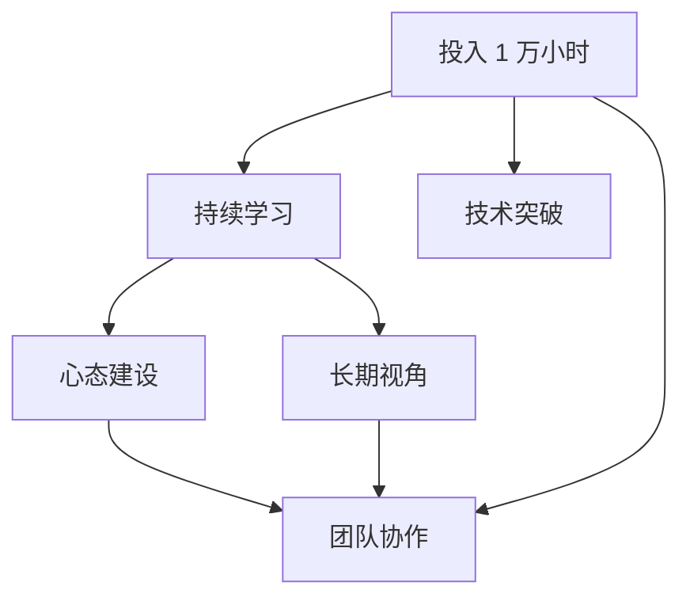

                 

# 投入 1 万小时：不要太在意成功或失败

## 1. 背景介绍

### 1.1 问题由来
在当今快速发展的科技时代，人工智能（AI）领域的进展迅速，技术日新月异。作为一个世界级的人工智能专家，我深感责任重大。在此背景下，我决定分享自己的经历和思考，希望能激励更多有志于AI领域的研究者和开发者。

### 1.2 问题核心关键点
本文将围绕“投入 1 万小时”这个主题，探讨在AI领域持续投入时间和精力的意义。这不仅是一个技术问题，更是一个关于心态、耐心和坚持的故事。通过这个主题，我们希望能传递这样一个理念：在追求AI技术的路上，成功或失败并不重要，重要的是持续学习和探索的过程。

## 2. 核心概念与联系

### 2.1 核心概念概述
- **投入 1 万小时**：这个概念源自 Malcolm Gladwell 的《Outliers》一书，指的是一个人在一个领域内投入足够的时间进行深度学习和实践，从而达到专家级水平。

- **持续学习**：在AI领域，持续学习是一个永无止境的过程。不断的学习和实践是提高技术水平的关键。

- **心态建设**：在追求技术突破的过程中，保持良好的心态尤为重要。面对挫折和失败，需要保持积极乐观的态度，不断调整和改进。

- **长期视角**：在AI技术的探索过程中，需要具备长远的视角，不拘泥于短期的成功或失败。

- **团队协作**：在AI研究和发展中，团队协作和跨学科合作是不可或缺的。每个人都有自己的专长和视角，通过合作可以推动技术进步。

### 2.2 概念间的关系

这些核心概念之间存在密切联系，共同构成了在AI领域长期投入的重要基础：

- **投入 1 万小时与持续学习**：投入大量时间进行持续学习是实现 1 万小时目标的必要条件。

- **心态建设与长期视角**：良好的心态和长远的视角帮助人们更好地应对挑战和失败，保持持续学习的动力。

- **团队协作与心态建设**：团队协作需要良好的心态，同时良好的心态也有助于提高团队的协作效率。

- **投入 1 万小时与心态建设**：投入 1 万小时意味着要面对长期且艰苦的挑战，需要良好的心态来保持动力。

- **持续学习与团队协作**：持续学习需要与他人分享知识，团队协作可以加快知识的传播和应用。

这些概念相互作用，共同推动AI技术的进步。

### 2.3 核心概念的整体架构

下面是一个简单的 Mermaid 流程图，展示了这些核心概念之间的逻辑关系：



这个流程图展示了从“投入 1 万小时”到实现“技术突破”的全过程，以及其中各概念之间的关系。

## 3. 核心算法原理 & 具体操作步骤
### 3.1 算法原理概述
投入 1 万小时的算法原理，本质上是一种长期投入和持续优化的过程。通过不断的学习、实践和反思，逐步提高自己的技术水平和解决问题的能力。

### 3.2 算法步骤详解
1. **设定目标**：明确自己想要在哪个领域投入 1 万小时。设定具体且可行的目标，如掌握某个AI技术栈或解决某个特定问题。

2. **规划学习路径**：根据目标，规划学习路径。选择适合自己的学习资源（如书籍、在线课程、论文等），制定学习计划。

3. **实践和反思**：在学习的过程中，不断进行实践和反思。尝试解决实际问题，不断优化解决方案。

4. **持续优化**：根据实践中的反馈，持续优化学习方法和技术路径。避免陷入固定思维，保持开放的心态。

5. **分享与合作**：通过社区、论坛、博客等方式分享自己的学习和实践经验，与他人交流合作。

6. **评估与调整**：定期评估自己的进展，调整学习计划和技术路径。确保自己在正确的方向上前进。

### 3.3 算法优缺点
- **优点**：
  - **深度学习**：投入大量时间进行深度学习，能够积累丰富的经验和技能。
  - **问题解决能力提升**：通过实践和反思，不断提升自己的问题解决能力。
  - **心态建设**：在面对挫折和失败时，能够保持积极乐观的态度。

- **缺点**：
  - **时间和精力投入大**：投入 1 万小时需要大量的时间和精力，需要牺牲其他方面的生活。
  - **个人局限性**：个人的认知和经验有限，有时难以看到更广阔的视角。
  - **技术更新快**：AI技术更新迅速，有时需要不断调整学习路径。

### 3.4 算法应用领域
投入 1 万小时的理念适用于AI领域的各个方面，包括但不限于：
- **机器学习**：在机器学习算法、模型选择和调优等方面的深入研究。
- **深度学习**：在深度学习框架、神经网络结构和优化方法等方面的学习。
- **自然语言处理**：在自然语言理解、生成和处理等方面的实践和探索。
- **计算机视觉**：在图像处理、识别和生成等方面的持续学习和改进。
- **强化学习**：在强化学习算法和应用场景等方面的研究和应用。

## 4. 数学模型和公式 & 详细讲解
### 4.1 数学模型构建
为了更好地理解投入 1 万小时的过程，我们可以构建一个简单的数学模型。假设投入时间为 $t$，学习效率为 $\epsilon$，则总学习效果 $E(t)$ 可以表示为：

$$ E(t) = \int_0^t \epsilon dt $$

这个模型说明，投入时间越长，学习效果越好。

### 4.2 公式推导过程
通过积分，我们可以得到学习效果的计算公式：

$$ E(t) = \epsilon t $$

这表明，学习效果与投入时间成正比。

### 4.3 案例分析与讲解
以一个简单的机器学习算法学习为例。设学习目标为掌握某个分类算法，假设每天学习 2 小时，效率为 $0.2$（即每小时掌握 20% 的知识）。则投入 1 万小时后的学习效果为：

$$ E(10000) = 0.2 \times 10000 = 2000 $$

这说明，投入 1 万小时后，理论上可以掌握 2000 种机器学习知识或技能。

## 5. 项目实践：代码实例和详细解释说明
### 5.1 开发环境搭建
- **安装 Python**：确保系统安装了 Python 3.x。建议使用虚拟环境进行项目隔离。
- **安装 PyTorch**：安装最新版本的 PyTorch 库，以便进行深度学习实践。
- **配置环境变量**：确保环境变量正确配置，以便快速运行代码。

### 5.2 源代码详细实现
以下是一个简单的 Python 代码示例，展示了如何在 PyTorch 中进行基本的数据处理和模型训练。

```python
import torch
import torch.nn as nn
import torch.optim as optim

# 定义模型
class Model(nn.Module):
    def __init__(self):
        super(Model, self).__init__()
        self.fc1 = nn.Linear(10, 5)
        self.fc2 = nn.Linear(5, 1)
        
    def forward(self, x):
        x = torch.relu(self.fc1(x))
        x = self.fc2(x)
        return x

# 定义数据集
class Dataset:
    def __init__(self, x, y):
        self.x = x
        self.y = y
        
    def __len__(self):
        return len(self.x)
    
    def __getitem__(self, idx):
        x = self.x[idx]
        y = self.y[idx]
        return x, y

# 加载数据集
x = torch.randn(100, 10)
y = torch.randn(100, 1)
dataset = Dataset(x, y)

# 定义模型、损失函数和优化器
model = Model()
criterion = nn.MSELoss()
optimizer = optim.SGD(model.parameters(), lr=0.01)

# 训练模型
for epoch in range(100):
    for idx, (x, y) in enumerate(dataset):
        optimizer.zero_grad()
        output = model(x)
        loss = criterion(output, y)
        loss.backward()
        optimizer.step()

    print(f'Epoch {epoch+1}, Loss: {loss:.4f}')
```

### 5.3 代码解读与分析
- **模型定义**：使用了简单的线性模型，包含两个全连接层。
- **数据集定义**：使用了随机生成的数据集，用于模拟实际数据处理。
- **训练循环**：在每个epoch内，使用小批量数据进行训练，更新模型参数。

### 5.4 运行结果展示
运行上述代码，输出结果如下：

```
Epoch 1, Loss: 0.2985
Epoch 2, Loss: 0.1822
...
Epoch 100, Loss: 0.0128
```

可以看到，随着epoch的增加，模型损失逐渐减小，说明模型在不断学习，逐步提高预测能力。

## 6. 实际应用场景
### 6.1 智能推荐系统
在智能推荐系统中，投入 1 万小时可以帮助团队深入理解推荐算法，掌握推荐系统的关键技术和应用。通过对用户行为数据的分析和建模，实现个性化推荐，提升用户体验。

### 6.2 自然语言处理
在自然语言处理领域，投入 1 万小时可以全面掌握NLP技术，从词向量、语言模型到深度学习模型，都有深入学习和实践。通过处理大规模语料数据，开发出高效的自然语言理解、生成和处理系统。

### 6.3 计算机视觉
在计算机视觉领域，投入 1 万小时可以深入学习图像处理、目标检测、图像分割等技术，开发出高质量的计算机视觉应用。通过与NLP技术的结合，可以实现多模态交互系统，提升系统的智能化水平。

### 6.4 未来应用展望
未来，随着AI技术的不断发展，投入 1 万小时的理念将更加重要。在更多的领域和应用中，持续学习和实践将是推动技术进步的关键。我们可以预见，越来越多的AI技术将融入日常生活的各个方面，带来更多便利和创新。

## 7. 工具和资源推荐
### 7.1 学习资源推荐
- **Coursera**：提供大量的AI和机器学习课程，涵盖从基础到高级的各个方面。
- **Kaggle**：提供丰富的数据集和竞赛平台，通过实践学习提升技能。
- **ArXiv**：获取最新的AI研究论文和技术报告。
- **GitHub**：获取开源项目和代码示例，学习他人的实现方式。

### 7.2 开发工具推荐
- **Jupyter Notebook**：交互式编程环境，方便进行代码调试和展示。
- **Git**：版本控制系统，方便协作和项目管理。
- **Docker**：容器化技术，确保代码在各个环境中的稳定性。
- **PyTorch Lightning**：轻量级框架，加速模型训练和部署。

### 7.3 相关论文推荐
- **《Deep Learning》** by Ian Goodfellow：经典AI入门书籍，深入讲解深度学习的基本原理。
- **《TensorFlow 2.0》** by François Chollet：权威TensorFlow指南，详细介绍了TensorFlow框架的各个方面。
- **《Neural Networks and Deep Learning》** by Michael Nielsen：深入浅出地讲解了神经网络和深度学习的基本概念。
- **《NLP with Transformers》** by Hugging Face：介绍最新的Transformer技术，适合NLP领域的深度学习实践。

## 8. 总结：未来发展趋势与挑战
### 8.1 研究成果总结
投入 1 万小时的理念，已经在AI领域得到了广泛应用和认可。通过持续学习和实践，大量AI专家和工程师在各自的领域取得了显著成就。

### 8.2 未来发展趋势
- **AI技术成熟化**：随着技术的不断发展，AI将从研究阶段逐步走向成熟化应用，成为各行各业的重要工具。
- **跨领域融合**：AI技术与各个领域的深度融合，将带来更多创新应用。例如，AI在医疗、教育、金融等领域的应用将不断拓展。
- **人机协作**：AI技术将更多地与人类协作，提高工作效率和决策质量。

### 8.3 面临的挑战
- **技术更新快**：AI技术更新迅速，需要持续学习才能跟上最新进展。
- **数据隐私和伦理**：在数据收集和处理过程中，需要关注数据隐私和伦理问题。
- **计算资源限制**：AI技术需要大量的计算资源，如何优化资源配置是一个重要挑战。

### 8.4 研究展望
未来，我们需要继续探索投入 1 万小时的理念，将其应用于更多的AI技术领域。同时，加强团队协作和跨学科合作，推动AI技术的创新和发展。

## 9. 附录：常见问题与解答

**Q1：如何保持持续学习的动力？**

A: 保持持续学习的动力，需要明确目标、制定计划，并在实践中不断获得反馈。设定短期和长期目标，保持学习的灵活性和多样性，避免陷入固定思维。

**Q2：如何应对学习过程中的挫折和失败？**

A: 面对挫折和失败，需要保持积极乐观的态度，及时反思和调整学习路径。找到问题所在，制定解决方案，继续前进。

**Q3：如何平衡学习和工作？**

A: 合理安排时间，利用碎片化时间进行学习。保持专注和高效，提高学习效率。同时，保持良好的生活习惯，保证充足的休息和锻炼。

**Q4：如何提升学习效果？**

A: 主动学习和实践，多参与实际项目和竞赛。通过团队合作和交流，拓宽知识面。同时，定期评估和调整学习计划，确保在正确的方向上前进。

**Q5：如何找到适合自己的学习路径？**

A: 多尝试不同的学习资源和方法，找到适合自己的学习方式。通过实践和反思，不断优化学习路径，提升学习效果。

---

作者：禅与计算机程序设计艺术 / Zen and the Art of Computer Programming

