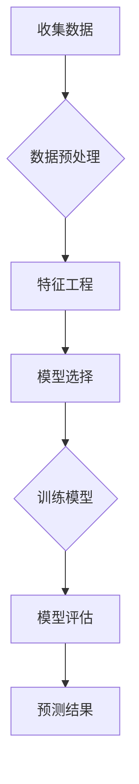

# 未来几年世界经济增长预测

> 关键词：经济增长预测，宏观经济分析，人工智能，机器学习，经济模型，全球趋势，行业展望

## 1. 背景介绍

在全球化的背景下，世界经济增长的预测对于政策制定者、企业投资者以及个人决策者来说至关重要。准确的经济增长预测有助于制定合理的经济政策，优化资源配置，以及做出明智的投资选择。随着人工智能（AI）和机器学习（ML）技术的发展，传统的经济预测方法正逐渐被智能化预测模型所替代。本文将探讨未来几年世界经济增长预测的原理、方法、工具和挑战。

### 1.1 问题的由来

经济增长预测的挑战在于其复杂性和不确定性。经济活动受到多种因素的影响，包括政策变化、市场波动、国际关系、自然灾害等。传统的经济增长预测方法主要依赖于宏观经济模型和专家经验，但这些方法往往难以捕捉到非线性和复杂的经济关系。

### 1.2 研究现状

近年来，AI和ML技术在经济增长预测中的应用取得了显著进展。机器学习模型能够处理大量数据，发现数据之间的复杂关系，从而提供更加精确的预测结果。本文将重点介绍基于机器学习的世界经济增长预测方法。

### 1.3 研究意义

研究未来几年世界经济增长预测，有助于：
- 政府制定有效的经济政策，促进经济增长。
- 企业做出合理的投资决策，降低风险。
- 个人规划财务和职业发展。

### 1.4 本文结构

本文将分为以下几个部分：
- 第二部分介绍经济增长预测的核心概念和联系。
- 第三部分阐述基于机器学习进行经济增长预测的原理和步骤。
- 第四部分讲解数学模型和公式，并提供案例分析。
- 第五部分展示项目实践，包括代码实例和解释。
- 第六部分探讨经济增长预测的实际应用场景和未来展望。
- 第七部分推荐相关工具和资源。
- 第八部分总结研究成果，展望未来发展趋势和挑战。
- 第九部分提供常见问题与解答。

## 2. 核心概念与联系

### 2.1 经济增长预测

经济增长预测是指对未来一定时期内一个国家或地区经济增长速度的预测。它通常涉及对国内生产总值（GDP）、就业率、通货膨胀率、汇率等关键经济指标的分析和预测。

### 2.2 人工智能与机器学习

人工智能是指通过计算机程序模拟人类智能行为的技术，而机器学习是AI的一个重要分支，它使计算机能够从数据中学习并做出决策。

### 2.3 Mermaid 流程图

以下是一个简化的Mermaid流程图，展示了经济增长预测的基本步骤：



### 2.4 核心概念联系

经济增长预测的核心概念包括宏观经济指标、数据收集、机器学习模型、预测结果等。这些概念相互联系，共同构成了经济增长预测的完整流程。

## 3. 核心算法原理 & 具体操作步骤

### 3.1 算法原理概述

基于机器学习进行经济增长预测的核心原理是利用历史数据来训练模型，并使用该模型对未来的经济增长进行预测。

### 3.2 算法步骤详解

#### 3.2.1 数据收集

收集历史经济数据，包括GDP、就业率、通货膨胀率、利率、汇率、国际贸易数据等。

#### 3.2.2 数据预处理

对收集到的数据进行清洗、归一化、缺失值处理等操作，以确保数据的质量和一致性。

#### 3.2.3 特征工程

选择与经济增长相关的特征，如历史增长率、政策变化、全球经济指标等。

#### 3.2.4 模型选择

根据数据特征和预测任务选择合适的机器学习模型，如线性回归、决策树、支持向量机、神经网络等。

#### 3.2.5 训练模型

使用历史数据对模型进行训练，调整模型参数以最小化预测误差。

#### 3.2.6 模型评估

使用验证集对模型进行评估，选择性能最好的模型。

#### 3.2.7 预测结果

使用训练好的模型对未来的经济增长进行预测。

### 3.3 算法优缺点

#### 3.3.1 优点

- 高精度：机器学习模型能够捕捉到复杂的经济关系，提供高精度的预测结果。
- 自动化：机器学习模型能够自动处理大量数据，提高预测效率。
- 适应性：机器学习模型可以根据新的数据不断更新，适应经济环境的变化。

#### 3.3.2 缺点

- 数据依赖：机器学习模型的预测结果依赖于历史数据的准确性和完整性。
- 模型选择：选择合适的模型需要专业知识和经验。
- 过拟合：机器学习模型容易过拟合，需要适当的正则化技术。

### 3.4 算法应用领域

基于机器学习的经济增长预测可以应用于以下领域：

- 政策制定
- 企业战略规划
- 投资决策
- 风险评估

## 4. 数学模型和公式 & 详细讲解 & 举例说明

### 4.1 数学模型构建

经济增长预测的数学模型通常是基于时间序列分析方法，如自回归模型（AR）、移动平均模型（MA）、自回归移动平均模型（ARMA）、自回归积分滑动平均模型（ARIMA）等。

### 4.2 公式推导过程

以ARIMA模型为例，其基本公式如下：

$$
X_t = c + c_1X_{t-1} + c_2X_{t-2} + \ldots + c_pX_{t-p} + \epsilon_t
$$

其中，$X_t$ 是时间序列的第 $t$ 个观测值，$c$ 是常数项，$c_1, c_2, \ldots, c_p$ 是自回归系数，$\epsilon_t$ 是误差项。

### 4.3 案例分析与讲解

假设我们使用ARIMA模型预测某国的月度GDP增长率。首先，我们需要收集该国的月度GDP增长率数据。然后，通过时间序列分析确定模型的阶数 $p$ 和 $q$。最后，使用历史数据进行模型参数估计，并预测未来的GDP增长率。

## 5. 项目实践：代码实例和详细解释说明

### 5.1 开发环境搭建

为了进行经济增长预测的项目实践，我们需要搭建以下开发环境：

- 操作系统：Windows、Linux或macOS
- 编程语言：Python
- 数据分析库：Pandas、NumPy
- 机器学习库：scikit-learn、statsmodels

### 5.2 源代码详细实现

以下是一个简单的ARIMA模型预测GDP增长率的Python代码示例：

```python
import pandas as pd
from statsmodels.tsa.arima.model import ARIMA

# 加载数据
data = pd.read_csv('gdp_growth_rate.csv')

# 创建ARIMA模型
model = ARIMA(data['gdp_growth_rate'], order=(5,1,0))

# 拟合模型
model_fit = model.fit()

# 预测未来3个月的GDP增长率
forecast = model_fit.forecast(steps=3)

# 打印预测结果
print(forecast)
```

### 5.3 代码解读与分析

上述代码首先导入了必要的库，然后加载了GDP增长率数据。接着，使用ARIMA模型创建了一个模型实例，并通过`fit`方法拟合了模型。最后，使用`forecast`方法预测了未来3个月的GDP增长率。

### 5.4 运行结果展示

运行上述代码后，将得到未来3个月的GDP增长率预测结果。这些结果可以帮助我们了解经济增长的趋势和预测未来的经济状况。

## 6. 实际应用场景

基于机器学习的经济增长预测在实际应用中具有广泛的应用场景，以下是一些例子：

- **政策制定**：政府可以基于预测结果制定合理的财政和货币政策，以促进经济增长。
- **企业战略规划**：企业可以基于预测结果制定投资和扩张计划，以抓住市场机遇。
- **投资决策**：投资者可以基于预测结果进行资产配置，降低投资风险。

## 7. 工具和资源推荐

### 7.1 学习资源推荐

- 《Python数据分析基础教程》
- 《机器学习实战》
- 《时间序列分析：理论与实践》

### 7.2 开发工具推荐

- Jupyter Notebook
- Pandas
- scikit-learn
- statsmodels

### 7.3 相关论文推荐

- Hyndman, R. J., & Athanasopoulos, G. (2018). Forecasting: principles and practice.
- Box, G. E. P., Jenkins, G. M., & Reinsel, G. C. (2015). Time series analysis: forecasting and control.

## 8. 总结：未来发展趋势与挑战

### 8.1 研究成果总结

本文介绍了基于机器学习的经济增长预测方法，包括数据收集、预处理、特征工程、模型选择和预测等步骤。通过案例分析和代码示例，展示了如何使用ARIMA模型进行GDP增长率预测。

### 8.2 未来发展趋势

随着AI和ML技术的不断发展，经济增长预测将呈现以下趋势：

- 模型复杂度的提高
- 数据量的增加
- 预测精度的提升
- 多模型集成和优化

### 8.3 面临的挑战

经济增长预测面临着以下挑战：

- 数据质量和可获得性
- 模型解释性和透明度
- 模型的泛化能力
- 经济环境的不确定性

### 8.4 研究展望

未来，经济增长预测的研究将朝着以下方向发展：

- 开发更加准确和可靠的预测模型
- 提高模型的可解释性和透明度
- 探索新的数据来源和方法
- 应对经济环境的不确定性

## 9. 附录：常见问题与解答

**Q1：经济增长预测是否适用于所有国家？**

A1：经济增长预测适用于所有国家，但预测的精度和可靠性可能因国家经济状况和数据质量而异。

**Q2：如何提高经济增长预测的精度？**

A2：提高经济增长预测的精度可以通过以下方法实现：

- 使用高质量的数据
- 选择合适的机器学习模型
- 进行特征工程
- 优化模型参数

**Q3：经济增长预测的模型如何解释？**

A3：一些机器学习模型，如决策树和随机森林，具有较好的可解释性。而深度学习模型的可解释性较差，需要使用技术如LIME或SHAP来解释。

**Q4：经济增长预测是否可以预测突发事件对经济的影响？**

A4：经济增长预测可以预测一些突发事件对经济的影响，但预测的精度可能受到突发事件不可预测性的影响。

**Q5：经济增长预测的模型如何更新？**

A5：经济增长预测的模型可以通过以下方法更新：

- 使用新的数据重新训练模型
- 使用在线学习算法实时更新模型
- 定期评估模型性能，并根据需要调整模型

---

作者：禅与计算机程序设计艺术 / Zen and the Art of Computer Programming