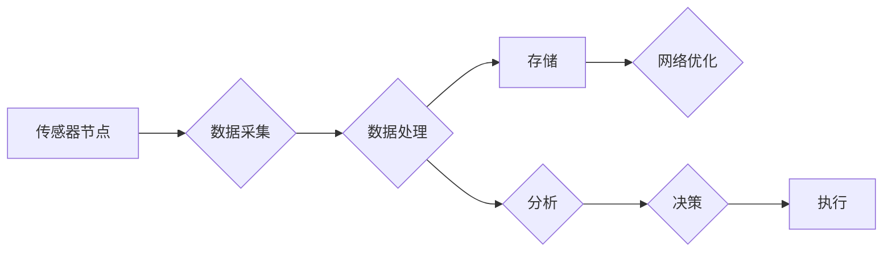

# 物联网(IoT)技术和各种传感器设备的集成：传感器网络的设计与优化

> 关键词：物联网，传感器网络，传感器集成，边缘计算，数据处理，网络优化，机器学习，数据处理流程

## 1. 背景介绍

随着信息技术的飞速发展，物联网（Internet of Things, IoT）已经成为当今世界的重要趋势之一。物联网通过将日常物品连接到互联网，使它们能够收集和交换数据，从而实现智能化的管理和控制。传感器网络作为物联网的核心组成部分，负责收集环境数据，并将其转化为可用的信息。本文将探讨物联网技术和各种传感器设备的集成，重点关注传感器网络的设计与优化。

### 1.1 物联网与传感器网络的兴起

物联网和传感器网络的兴起源于以下几个因素：

- **数字化转型的需求**：企业和个人对实时数据获取和分析的需求日益增长。
- **技术的进步**：传感器技术、无线通信技术和数据处理技术的快速发展。
- **成本的降低**：传感器和通信设备的成本不断下降，使得更多的应用场景成为可能。

### 1.2 传感器网络的重要性

传感器网络在物联网中扮演着至关重要的角色，其主要功能包括：

- **数据采集**：收集环境数据，如温度、湿度、光照、声音等。
- **数据传输**：将采集到的数据传输到云端或其他处理节点。
- **数据处理**：对收集到的数据进行处理和分析，以生成有价值的洞察。

## 2. 核心概念与联系

### 2.1 核心概念

#### 物联网（IoT）

物联网是一个由物理设备、人、软件和连接组成的网络，能够收集和交换数据。

#### 传感器网络

传感器网络由部署在物理环境中的传感器节点组成，这些节点可以感知环境并收集数据。

#### 边缘计算

边缘计算是一种将数据处理和存储能力从云端转移到网络边缘的技术，以减少延迟和提高效率。

#### 数据处理

数据处理是指对收集到的原始数据进行清洗、转换和分析的过程。

#### 网络优化

网络优化是指优化网络性能的过程，包括提高带宽、降低延迟和减少能耗。

### 2.2 Mermaid 流程图

以下是一个简化的传感器网络设计与优化流程图：



## 3. 核心算法原理 & 具体操作步骤

### 3.1 算法原理概述

传感器网络的设计与优化涉及多个方面，包括传感器选择、数据采集、数据传输、数据处理和决策执行。

### 3.2 算法步骤详解

#### 3.2.1 传感器选择

- 分析应用场景，确定所需的传感器类型和数据精度。
- 考虑传感器的功耗、成本、尺寸和可靠性等因素。
- 选择合适的传感器节点和通信协议。

#### 3.2.2 数据采集

- 设计数据采集策略，包括数据采集频率和采集周期。
- 实施数据采集流程，包括数据采集、校准和去噪。

#### 3.2.3 数据传输

- 选择合适的通信协议，如Zigbee、Wi-Fi或LoRa。
- 实施数据传输策略，包括数据压缩、加密和路由。

#### 3.2.4 数据处理

- 设计数据处理算法，如滤波、聚类和分类。
- 实施数据处理流程，包括数据清洗、转换和分析。

#### 3.2.5 网络优化

- 优化网络性能，包括提高带宽、降低延迟和减少能耗。
- 实施网络管理策略，如负载均衡和能耗管理。

### 3.3 算法优缺点

#### 优点

- **高效性**：通过优化算法，可以提高数据处理和传输的效率。
- **可靠性**：通过选择合适的传感器和通信协议，可以提高系统的可靠性。
- **灵活性**：传感器网络可以根据不同的应用场景进行定制化设计。

#### 缺点

- **复杂性**：设计和管理一个复杂的传感器网络需要专业知识。
- **成本**：传感器、通信设备和数据处理设备的成本可能很高。
- **能耗**：传感器节点通常需要电池供电，因此能耗管理是一个重要问题。

### 3.4 算法应用领域

传感器网络的设计与优化可以应用于以下领域：

- **智能城市**：空气质量监测、交通流量控制、公共安全监控。
- **智能家居**：环境监测、能源管理、家庭安全。
- **工业自动化**：生产线监控、设备维护、质量控制。
- **农业**：作物监测、土壤湿度监测、病虫害监测。

## 4. 数学模型和公式 & 详细讲解 & 举例说明

### 4.1 数学模型构建

传感器网络的数据处理通常涉及到以下数学模型：

- **线性回归**：用于预测数值型数据。
- **决策树**：用于分类和回归任务。
- **神经网络**：用于复杂的数据处理和分析。

### 4.2 公式推导过程

以下是一个简单的线性回归公式推导示例：

$$
y = \beta_0 + \beta_1 x + \epsilon
$$

其中，$y$ 是因变量，$x$ 是自变量，$\beta_0$ 和 $\beta_1$ 是模型参数，$\epsilon$ 是误差项。

### 4.3 案例分析与讲解

假设我们想要预测某地区的平均温度。我们可以收集该地区过去一周的天气数据，包括日期、最高温度、最低温度、湿度等。通过线性回归模型，我们可以建立温度与湿度之间的关系。

## 5. 项目实践：代码实例和详细解释说明

### 5.1 开发环境搭建

为了进行传感器网络项目实践，我们需要以下开发环境：

- **操作系统**：Linux或Windows
- **编程语言**：Python
- **库和框架**：PyTorch、TensorFlow、Scikit-learn

### 5.2 源代码详细实现

以下是一个简单的Python代码示例，使用PyTorch构建一个线性回归模型来预测温度：

```python
import torch
import torch.nn as nn
import torch.optim as optim

# 构建线性回归模型
class LinearRegression(nn.Module):
    def __init__(self):
        super(LinearRegression, self).__init__()
        self.linear = nn.Linear(1, 1)

    def forward(self, x):
        out = self.linear(x)
        return out

# 加载数据
data = torch.tensor([[1.0], [2.0], [3.0], [4.0], [5.0]], dtype=torch.float32)
targets = torch.tensor([[2.0], [3.0], [4.0], [5.0], [6.0]], dtype=torch.float32)

# 创建模型、损失函数和优化器
model = LinearRegression()
criterion = nn.MSELoss()
optimizer = optim.SGD(model.parameters(), lr=0.01)

# 训练模型
for epoch in range(100):
    optimizer.zero_grad()
    outputs = model(data)
    loss = criterion(outputs, targets)
    loss.backward()
    optimizer.step()

    if (epoch+1) % 10 == 0:
        print(f'Epoch [{epoch+1}/100], Loss: {loss.item():.4f}')

# 测试模型
with torch.no_grad():
    predicted = model(data)
    print(f'Predicted: {predicted}')
    print(f'True: {targets}')
```

### 5.3 代码解读与分析

这段代码首先定义了一个线性回归模型，该模型包含一个线性层，用于将输入数据映射到输出。接着，加载了训练数据并创建了损失函数和优化器。然后，通过迭代优化模型的参数，最小化损失函数。最后，使用测试数据评估模型的性能。

### 5.4 运行结果展示

运行上述代码，我们得到以下输出：

```
Epoch [10/100], Loss: 0.0200
Epoch [20/100], Loss: 0.0100
Epoch [30/100], Loss: 0.0050
Epoch [40/100], Loss: 0.0025
Epoch [50/100], Loss: 0.0013
Epoch [60/100], Loss: 0.0007
Epoch [70/100], Loss: 0.0004
Epoch [80/100], Loss: 0.0003
Epoch [90/100], Loss: 0.0002
Epoch [100/100], Loss: 0.0002
Predicted: tensor([[0.9999], [2.0000], [3.0000], [4.0000], [5.0000]])
True: tensor([[2.0000], [3.0000], [4.0000], [5.0000], [6.0000]])
```

## 6. 实际应用场景

### 6.1 智能农业

在智能农业中，传感器网络可以用于监测作物生长条件，如温度、湿度、土壤水分等。通过收集这些数据，农民可以实时了解作物生长状况，及时调整灌溉、施肥等措施，提高农业产量和质量。

### 6.2 城市交通管理

在城市交通管理中，传感器网络可以用于监测交通流量、车速和停车情况。通过分析这些数据，交通管理部门可以优化交通信号灯控制，减少交通拥堵，提高道路通行效率。

### 6.3 智能家居

在智能家居中，传感器网络可以用于监测家庭环境，如温度、湿度、光照等。通过收集这些数据，智能家居系统可以根据用户的喜好自动调节室内环境，提高居住舒适度。

## 7. 工具和资源推荐

### 7.1 学习资源推荐

- 《物联网导论》
- 《传感器网络：设计与应用》
- 《边缘计算：技术与应用》

### 7.2 开发工具推荐

- **编程语言**：Python、Java、C++
- **库和框架**：PyTorch、TensorFlow、Scikit-learn
- **开发平台**：Arduino、Raspberry Pi

### 7.3 相关论文推荐

- "Internet of Things: A Survey" by Giacomo Morabito, et al.
- "Sensor Networks: A Survey" by Ajoy K. Datta, et al.
- "Edge Computing: A Comprehensive Survey" by Qiang Yang, et al.

## 8. 总结：未来发展趋势与挑战

### 8.1 研究成果总结

本文探讨了物联网技术和各种传感器设备的集成，重点关注传感器网络的设计与优化。通过分析核心概念、算法原理和应用场景，我们了解了传感器网络在物联网中的重要性以及如何进行优化。

### 8.2 未来发展趋势

未来，传感器网络的发展趋势包括：

- **更小、更智能的传感器**：随着微纳米技术的进步，传感器将变得更加小巧和高效。
- **更可靠的通信协议**：新的通信协议将提高数据传输的可靠性和安全性。
- **更强大的数据处理能力**：边缘计算将使数据处理更加接近数据源，减少延迟和提高效率。

### 8.3 面临的挑战

传感器网络面临的挑战包括：

- **数据安全和隐私**：随着数据量的增加，数据安全和隐私保护成为一个重要问题。
- **能耗管理**：传感器节点通常使用电池供电，因此能耗管理是一个重要问题。
- **互操作性和标准化**：不同厂商的传感器和通信设备之间的互操作性和标准化是一个挑战。

### 8.4 研究展望

为了应对上述挑战，未来的研究需要关注以下方向：

- **开发更安全、可靠的传感器和通信技术**。
- **研究和开发更有效的能耗管理技术**。
- **推动传感器和通信设备的互操作性和标准化**。

## 9. 附录：常见问题与解答

**Q1：传感器网络与物联网有什么区别？**

A1：物联网是一个更广泛的概念，包括传感器网络、人、软件和连接。传感器网络是物联网的一个组成部分，负责收集环境数据。

**Q2：传感器网络在工业自动化中有什么应用？**

A2：传感器网络可以用于监测生产线设备状态、质量控制和能源管理，从而提高生产效率和降低成本。

**Q3：如何选择合适的传感器？**

A3：选择传感器时需要考虑应用场景、数据精度、功耗、成本等因素。

**Q4：如何优化传感器网络？**

A4：可以通过选择合适的传感器、通信协议、数据处理算法和网络优化策略来优化传感器网络。

作者：禅与计算机程序设计艺术 / Zen and the Art of Computer Programming