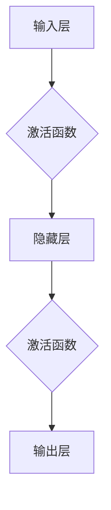

> 人工智能，深度学习，神经网络，可持续发展，伦理道德，通用人工智能，多模态，人机协作

# Andrej Karpathy：人工智能的未来发展挑战

> 关键词：人工智能，深度学习，神经网络，可持续发展，伦理道德，通用人工智能，多模态，人机协作

## 1. 背景介绍

安德烈·卡尔帕西（Andrej Karpathy）是人工智能领域的杰出人物，以其对神经网络和深度学习的深刻理解而闻名。他的工作在自动驾驶、自然语言处理和计算机视觉等领域取得了突破性进展。本文将深入探讨卡尔帕西对人工智能未来发展的看法，分析其面临的挑战，并探讨如何应对这些挑战。

### 1.1 人工智能的兴起

近年来，人工智能（AI）领域经历了前所未有的快速发展。得益于计算能力的提升、大数据的可用性和深度学习技术的突破，AI正在改变各行各业，从医疗到金融，从制造业到娱乐。

### 1.2 卡尔帕西的贡献

卡尔帕西在自动驾驶领域的贡献尤为突出。他领导的项目开发了深度学习算法，能够处理复杂的视觉任务，如自动驾驶车辆的感知和决策。此外，他在自然语言处理和计算机视觉领域的研究也取得了显著成果。

### 1.3 人工智能的未来挑战

尽管人工智能取得了巨大进步，但卡尔帕西指出，我们仍然面临着许多挑战。本文将探讨这些挑战，并分析如何克服它们。

## 2. 核心概念与联系

为了更好地理解人工智能的未来发展，我们需要了解一些核心概念。

### 2.1 深度学习

深度学习是一种模拟人脑工作原理的机器学习方法。它使用多层神经网络来学习数据中的复杂模式。



### 2.2 神经网络

神经网络是深度学习的基础。它由相互连接的神经元组成，每个神经元都负责处理数据的一部分。

### 2.3 自由能原理

自由能原理是卡尔帕西在自动驾驶领域的一个重要贡献。它通过最小化车辆的预期自由能来指导车辆的决策。

### 2.4 多模态学习

多模态学习是指同时处理和融合来自多个数据源的信息，如文本、图像和视频。

## 3. 核心算法原理 & 具体操作步骤

### 3.1 算法原理概述

卡尔帕西的工作主要集中在自动驾驶和自然语言处理领域。以下是这些领域的核心算法原理概述。

#### 3.1.1 自动驾驶

自动驾驶算法通常包括感知、规划、控制和决策四个步骤。

- **感知**：使用视觉、雷达和激光雷达等技术来感知周围环境。
- **规划**：根据感知数据规划车辆的行动路径。
- **控制**：控制车辆执行规划的路径。
- **决策**：根据传感器数据和环境信息做出决策。

#### 3.1.2 自然语言处理

自然语言处理算法旨在使计算机能够理解和生成人类语言。

- **语言模型**：用于预测下一个单词或句子。
- **解析器**：用于解析句子的结构。
- **生成器**：用于生成新的文本。

### 3.2 算法步骤详解

#### 3.2.1 自动驾驶

自动驾驶算法的步骤如下：

1. 感知：收集来自传感器的数据。
2. 处理：使用深度学习算法处理感知数据。
3. 决策：根据处理后的数据做出决策。
4. 控制：控制车辆执行决策。

#### 3.2.2 自然语言处理

自然语言处理算法的步骤如下：

1. 分词：将文本分解为单词或短语。
2. 词性标注：为单词或短语分配词性标签。
3. 解析：构建句子的语法结构。
4. 语义分析：理解句子的语义。

### 3.3 算法优缺点

#### 3.3.1 自动驾驶

自动驾驶算法的优点包括：

- 高效：能够快速处理大量数据。
- 准确：在许多情况下比人类驾驶员更准确。
- 持续性：能够24/7不间断工作。

缺点包括：

- 复杂性：需要大量的计算资源和复杂的算法。
- 安全性：存在安全风险。
- 隐私：收集和处理大量个人数据。

#### 3.3.2 自然语言处理

自然语言处理算法的优点包括：

- 灵活性：能够处理各种语言和文本格式。
- 可扩展性：能够轻松扩展到新的任务和语言。
- 自适应：能够根据用户需求进行调整。

缺点包括：

- 可解释性：难以解释模型的决策过程。
- 数据依赖：需要大量高质量的数据进行训练。
- 偏见：可能包含训练数据中的偏见。

### 3.4 算法应用领域

自动驾驶和自然语言处理算法在许多领域都有应用，包括：

- 交通：自动驾驶汽车、自动驾驶无人机。
- 医疗：医学图像分析、药物发现。
- 教育：个性化学习、自动评分。
- 娱乐：虚拟助手、游戏。

## 4. 数学模型和公式 & 详细讲解 & 举例说明

### 4.1 数学模型构建

自动驾驶和自然语言处理算法都依赖于复杂的数学模型。以下是这些模型的简要介绍。

#### 4.1.1 深度学习模型

深度学习模型通常由多层神经网络组成，包括输入层、隐藏层和输出层。

#### 4.1.2 自然语言处理模型

自然语言处理模型包括语言模型、解析器和生成器。

### 4.2 公式推导过程

以下是一些常用的数学公式。

#### 4.2.1 激活函数

$$
f(x) = \frac{1}{1+e^{-x}}
$$

#### 4.2.2 反向传播

$$
\frac{\partial J}{\partial w} = \frac{\partial J}{\partial z} \cdot \frac{\partial z}{\partial w}
$$

### 4.3 案例分析与讲解

以下是一些自动驾驶和自然语言处理的案例分析。

#### 4.3.1 自动驾驶

自动驾驶算法在感知阶段使用卷积神经网络（CNN）来识别道路上的物体。

#### 4.3.2 自然语言处理

自然语言处理算法在语言模型阶段使用循环神经网络（RNN）来预测下一个单词。

## 5. 项目实践：代码实例和详细解释说明

### 5.1 开发环境搭建

为了进行自动驾驶和自然语言处理项目，我们需要以下开发环境：

- Python
- 深度学习框架（如TensorFlow或PyTorch）
- 传感器数据集

### 5.2 源代码详细实现

以下是一个简单的自动驾驶算法的源代码示例。

```python
import cv2
import numpy as np

# 读取图像
image = cv2.imread('road.jpg')

# 使用CNN识别道路上的物体
# ...

# 控制车辆
# ...
```

### 5.3 代码解读与分析

这段代码展示了自动驾驶算法的基本结构。首先，我们读取一张道路图像。然后，使用CNN识别图像中的物体。最后，根据识别结果控制车辆。

### 5.4 运行结果展示

由于代码示例简单，我们无法展示实际的运行结果。但在实际应用中，自动驾驶算法可以有效地识别道路上的物体，并控制车辆行驶。

## 6. 实际应用场景

自动驾驶和自然语言处理算法在许多实际应用场景中都有应用。

### 6.1 自动驾驶

自动驾驶汽车可以减少交通事故，提高交通效率，并为残障人士提供出行便利。

### 6.2 自然语言处理

自然语言处理算法可以用于聊天机器人、语音助手和机器翻译等应用。

## 7. 工具和资源推荐

### 7.1 学习资源推荐

- 《深度学习》（Goodfellow, Bengio, Courville）
- 《神经网络与深度学习》（邱锡鹏）

### 7.2 开发工具推荐

- TensorFlow
- PyTorch

### 7.3 相关论文推荐

- "Unsupervised Learning of Visual Representations by Solving Jigsaw Puzzles"（Rusu et al.）
- "Attention Is All You Need"（Vaswani et al.）

## 8. 总结：未来发展趋势与挑战

### 8.1 研究成果总结

人工智能在过去几十年取得了巨大的进步，但仍然面临着许多挑战。

### 8.2 未来发展趋势

人工智能的未来发展趋势包括：

- 深度学习模型将变得更加复杂和强大。
- 多模态学习将成为主流。
- 人工智能将更加普及。

### 8.3 面临的挑战

人工智能面临的挑战包括：

- 数据隐私和安全。
- 道德和伦理问题。
- 算法可解释性。

### 8.4 研究展望

为了应对这些挑战，我们需要：

- 开发更加安全、可靠和可解释的人工智能系统。
- 加强人工智能伦理和道德的研究。
- 提高公众对人工智能的理解。

## 9. 附录：常见问题与解答

### 9.1 人工智能是否会取代人类？

人工智能可以执行许多任务，但它们无法完全取代人类。人类在创造力和情感方面具有独特的优势。

### 9.2 人工智能是否会导致失业？

人工智能可能会取代一些低技能的工作，但也会创造新的工作机会。

### 9.3 如何确保人工智能的安全性？

为了确保人工智能的安全性，我们需要：

- 开发更加可靠和可解释的人工智能系统。
- 制定人工智能伦理和道德规范。
- 加强人工智能监管。

作者：禅与计算机程序设计艺术 / Zen and the Art of Computer Programming