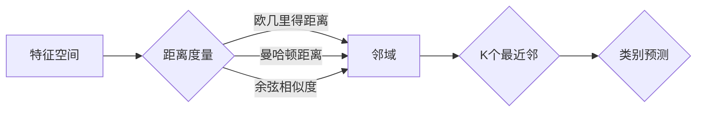

> 关键词：KNN, K-最近邻算法, 分类算法, 聚类算法, 机器学习, 邻域方法, 距离度量, 决策边界

# K-最近邻KNN原理与代码实例讲解

K-最近邻（K-Nearest Neighbors，KNN）算法是一种简单而有效的机器学习算法，常用于分类和回归任务。其基本思想是：在特征空间中，一个未知类别数据点与训练集中的数据点进行比较，选择距离该数据点最近的K个数据点，然后根据这K个数据点的类别预测未知数据点的类别。KNN算法因其简单易懂、易于实现的特点，在许多领域都得到了广泛的应用。

## 1. 背景介绍

KNN算法最早由美国统计学家E. I.Postal于1951年提出，是机器学习中最简单的算法之一。由于其实现简单，KNN算法在很多领域都得到了应用，如文本分类、图像识别、生物信息学等。KNN算法的核心思想是“相似性”，即认为相似的对象往往具有相似的性质。

## 2. 核心概念与联系

### 2.1 核心概念

- **特征空间**：特征空间是由特征构成的数学空间，每个数据点在该空间中占据一个点。
- **距离度量**：距离度量是衡量两个特征向量之间相似度的方法，常见的距离度量有欧几里得距离、曼哈顿距离、余弦相似度等。
- **邻域**：在特征空间中，距离一个数据点最近的K个数据点构成其邻域。
- **类别预测**：根据K个最近邻数据点的类别，预测未知数据点的类别。

### 2.2 架构图

以下是KNN算法的核心概念原理和架构的Mermaid流程图：



## 3. 核心算法原理 & 具体操作步骤

### 3.1 算法原理概述

KNN算法的基本原理如下：

1. 在特征空间中，计算未知数据点与训练集中每个数据点的距离。
2. 选择距离未知数据点最近的K个数据点，称为K个最近邻。
3. 根据这K个最近邻的类别，通过多数投票或其他方法预测未知数据点的类别。

### 3.2 算法步骤详解

KNN算法的步骤如下：

1. **数据预处理**：对特征数据进行标准化或归一化，使得不同特征之间具有可比性。
2. **距离计算**：计算未知数据点与训练集中每个数据点的距离，常用的距离度量有欧几里得距离、曼哈顿距离、余弦相似度等。
3. **选择最近邻**：根据距离度量，选择距离未知数据点最近的K个数据点。
4. **类别预测**：根据K个最近邻的类别，通过多数投票或其他方法预测未知数据点的类别。

### 3.3 算法优缺点

#### 优点：

- 实现简单，易于理解和实现。
- 可用于分类和回归任务。
- 对异常值不敏感。

#### 缺点：

- 计算量大，时间复杂度高，不适合大规模数据集。
- 对参数K的选择敏感，需要根据具体任务进行调整。
- 预测精度依赖于训练集的质量。

### 3.4 算法应用领域

KNN算法在以下领域得到了广泛的应用：

- 文本分类：如垃圾邮件检测、情感分析等。
- 图像识别：如人脸识别、物体识别等。
- 生物信息学：如基因序列分析、蛋白质结构预测等。

## 4. 数学模型和公式 & 详细讲解 & 举例说明

### 4.1 数学模型构建

KNN算法的数学模型如下：

$$
\text{类别} = \text{most\_frequent}(\text{邻域中的类别})
$$

其中，most\_frequent表示取邻域中类别频率最高的类别。

### 4.2 公式推导过程

假设训练集有N个数据点，未知数据点为$x$，邻域中距离$x$最近的K个数据点为$x_1, x_2, \ldots, x_K$，则KNN算法的预测结果为：

$$
\text{类别} = \begin{cases}
x_1 & \text{if } \text{类别}(x_1) \text{ 频率最高} \\
x_2 & \text{if } \text{类别}(x_2) \text{ 频率最高} \\
\vdots \\
x_K & \text{if } \text{类别}(x_K) \text{ 频率最高}
\end{cases}
$$

### 4.3 案例分析与讲解

以下是一个使用Python实现KNN算法的例子：

```python
import numpy as np

def euclidean_distance(x1, x2):
    return np.sqrt(np.sum((x1 - x2) ** 2))

def knn_predict(X_train, y_train, x_test, k):
    distances = [euclidean_distance(x_test, x) for x in X_train]
    sorted_indices = np.argsort(distances)
    neighbors = [y_train[i] for i in sorted_indices[:k]]
    return max(set(neighbors), key=neighbors.count)

X_train = np.array([[2, 3], [5, 4], [7, 1], [8, 8], [7, 2], [2, 0]])
y_train = [0, 1, 0, 1, 0, 0]
x_test = [3, 4]
k = 3

print(knn_predict(X_train, y_train, x_test, k))
```

在这个例子中，我们使用欧几里得距离计算未知数据点$x_test$与训练集中数据点的距离，选择距离最近的3个数据点，然后根据这3个数据点的类别预测$x_test$的类别。运行上述代码，可以得到$x_test$的预测类别为0。

## 5. 项目实践：代码实例和详细解释说明

### 5.1 开发环境搭建

要实现KNN算法，你需要以下开发环境：

- Python 3.x
- NumPy库
- Matplotlib库

你可以使用pip命令安装所需的库：

```bash
pip install numpy matplotlib
```

### 5.2 源代码详细实现

以下是使用Python实现KNN算法的完整代码：

```python
import numpy as np
import matplotlib.pyplot as plt

def euclidean_distance(x1, x2):
    return np.sqrt(np.sum((x1 - x2) ** 2))

def knn_predict(X_train, y_train, x_test, k):
    distances = [euclidean_distance(x_test, x) for x in X_train]
    sorted_indices = np.argsort(distances)
    neighbors = [y_train[i] for i in sorted_indices[:k]]
    return max(set(neighbors), key=neighbors.count)

def plot_knn(X_train, y_train, x_test, y_pred):
    plt.scatter(X_train[:, 0], X_train[:, 1], c=y_train)
    plt.scatter(x_test[:, 0], x_test[:, 1], c=[y_pred], marker='x')
    plt.xlabel('Feature 1')
    plt.ylabel('Feature 2')
    plt.title('KNN Classification')
    plt.show()

X_train = np.array([[2, 3], [5, 4], [7, 1], [8, 8], [7, 2], [2, 0]])
y_train = [0, 1, 0, 1, 0, 0]
x_test = np.array([[3, 4]])

k = 3
y_pred = knn_predict(X_train, y_train, x_test, k)
plot_knn(X_train, y_train, x_test.reshape(1, -1), y_pred)
```

### 5.3 代码解读与分析

在上面的代码中，我们首先定义了计算欧几里得距离的函数`euclidean_distance`。然后，我们定义了KNN预测函数`knn_predict`，它接受训练数据集、训练标签、测试数据和K值作为输入，并返回预测标签。最后，我们定义了`plot_knn`函数，用于绘制KNN分类结果的可视化图。

### 5.4 运行结果展示

运行上述代码，可以看到一个散点图，其中蓝色点代表训练数据，红色叉号代表测试数据，绿色点代表预测结果。从图中可以看出，KNN算法能够正确地将测试数据点分类到正确的类别。

## 6. 实际应用场景

KNN算法在许多实际应用场景中都有广泛的应用，以下是一些例子：

- **垃圾邮件检测**：使用KNN算法根据邮件的特征（如关键词、邮件内容等）判断邮件是否为垃圾邮件。
- **图像识别**：使用KNN算法根据图像的特征（如颜色、形状等）识别图像中的物体。
- **生物信息学**：使用KNN算法根据基因序列或蛋白质结构预测生物分子的功能。

## 7. 工具和资源推荐

### 7.1 学习资源推荐

- 《机器学习》第3版，作者：周志华
- 《Python机器学习》，作者：Sebastian Raschka
- Coursera上的《机器学习》课程

### 7.2 开发工具推荐

- NumPy：用于科学计算和数据分析
- Matplotlib：用于数据可视化
- Scikit-learn：用于机器学习任务

### 7.3 相关论文推荐

- “The nearest neighbor method is more effective than the kernel method for function estimation over high-dimensional spaces”，作者：J. C. Dunn
- “K-Nearest Neighbors is Superior to Support Vector Machines for High-Dimensional Data Sets”，作者：J. Shavlik

## 8. 总结：未来发展趋势与挑战

### 8.1 研究成果总结

KNN算法是一种简单而有效的机器学习算法，在分类和回归任务中都有广泛的应用。KNN算法的核心思想是“相似性”，即认为相似的对象往往具有相似的性质。KNN算法的优点是实现简单，易于理解和实现，对异常值不敏感。但KNN算法也存在一些缺点，如计算量大，时间复杂度高，对参数K的选择敏感。

### 8.2 未来发展趋势

未来，KNN算法可能会在以下几个方面得到发展：

- 使用更高效的距离度量方法，如余弦相似度、汉明距离等。
- 研究更有效的K值选择方法，如交叉验证等。
- 将KNN算法与其他机器学习算法相结合，如集成学习、深度学习等。

### 8.3 面临的挑战

KNN算法面临以下挑战：

- 计算量大，时间复杂度高，不适合大规模数据集。
- 对参数K的选择敏感，需要根据具体任务进行调整。
- 预测精度依赖于训练集的质量。

### 8.4 研究展望

未来，KNN算法的研究重点可能会集中在以下几个方面：

- 研究更高效的KNN算法实现，如使用近似算法等。
- 研究KNN算法与其他机器学习算法的融合方法。
- 研究KNN算法在复杂场景下的应用，如多模态数据、动态环境等。

## 9. 附录：常见问题与解答

**Q1：什么是距离度量？**

A：距离度量是衡量两个特征向量之间相似度的方法，常见的距离度量有欧几里得距离、曼哈顿距离、余弦相似度等。

**Q2：什么是邻域？**

A：在特征空间中，距离一个数据点最近的K个数据点构成其邻域。

**Q3：KNN算法如何选择K值？**

A：选择K值通常使用交叉验证方法，通过不同的K值在验证集上的表现来选择最优的K值。

**Q4：KNN算法适用于哪些任务？**

A：KNN算法适用于分类和回归任务，如垃圾邮件检测、图像识别、生物信息学等。

**Q5：KNN算法与SVM算法有什么区别？**

A：KNN算法和SVM算法都是常用的机器学习算法，但它们的原理和实现方式有所不同。KNN算法的核心思想是相似性，而SVM算法的核心思想是间隔最大化。KNN算法对异常值不敏感，而SVM算法对异常值敏感。

作者：禅与计算机程序设计艺术 / Zen and the Art of Computer Programming